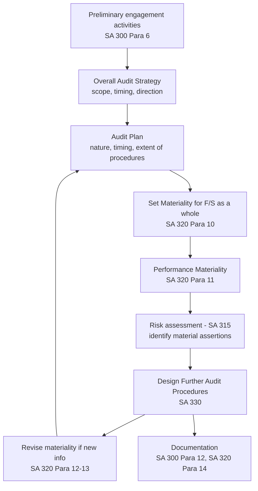

# Q&A — Audit Strategy, Planning & Materiality

> CA Intermediate — Auditing & Ethics. Coverage: SA 300 (Planning an Audit of Financial Statements) and SA 320 (Materiality in Planning and Performing an Audit). All standards cited are Indian Standards on Auditing issued by ICAI. Companies Act references are to the Companies Act, 2013.

---

## How the whole thing fits together (read this first)

The examiner's favourite one-liner: **strategy sets the scope and direction (the "what and how much"), the plan sets the detailed procedures (the "how"), and materiality decides where the effort is worth spending.**

---

# Section A — Concept-Check Questions (with answers)

**A1. Distinguish between the "overall audit strategy" and the "audit plan" under SA 300.**

*Answer:* Under **SA 300 (Para 7–9)**, the **overall audit strategy** sets the *scope, timing and direction* of the audit and guides development of the detailed plan — it deals with characteristics of the engagement (reporting framework, industry), reporting objectives (deadlines, key dates of communication) and allocation of resources (where, when and how much effort). The **audit plan** is more detailed and includes the *nature, timing and extent* of (a) planned risk assessment procedures (SA 315) and (b) planned further audit procedures at the assertion level (SA 330), plus other procedures needed to comply with SAs. The strategy is the broad framework; the plan converts it into specific procedures. The two are interrelated — a change in one changes the other.

---

**A2. Is planning a discrete phase performed only at the start of the audit? Cite the standard.**

*Answer:* No. **SA 300 (Para 2 and A2)** clarifies that planning is a **continual and iterative process** that often begins shortly after (or in connection with) the completion of the previous audit and continues until the completion of the current engagement. The plan is updated and changed as necessary during the course of the audit.

---

**A3. Define "materiality for the financial statements as a whole" and "performance materiality" under SA 320.**

*Answer:* Per **SA 320**: Misstatements are material if, individually or in aggregate, they could **reasonably be expected to influence the economic decisions of users** taken on the basis of the financial statements (Para 2). **Materiality for the financial statements as a whole (Para 10)** is the amount(s) set by the auditor at the planning stage. **Performance materiality (Para 9, definition)** means the amount(s) set at *less than* materiality for the financial statements as a whole, to reduce to an appropriately low level the probability that the aggregate of *uncorrected and undetected* misstatements exceeds materiality for the financial statements as a whole. It may also refer to amounts set below the materiality level for particular classes of transactions, account balances or disclosures.

---

**A4. Why is performance materiality set *lower* than overall materiality? Give the logic.**

*Answer:* Because the auditor never audits 100% of items; some misstatements will remain **undetected**, and some detected ones may be **left uncorrected** (below a threshold). If procedures were designed only to catch misstatements at the overall materiality figure, the *aggregate* of undetected + uncorrected errors could easily push total misstatement *above* materiality. **Performance materiality (a buffer)** builds in a cushion so the aggregate stays below materiality with a low probability of failure (SA 320 Para 9 & A12–A14). It is a matter of professional judgement affected by the auditor's understanding of the entity and the nature/extent of misstatements in prior audits.

---

**A5. What are the qualitative factors that make an otherwise "small" misstatement material?**

*Answer:* SA 320 (Para 2, A1) recognises materiality has a **qualitative dimension**. A numerically small item may be material because of its *nature or the circumstances*: e.g., it converts a profit into a loss (or vice versa), affects compliance with loan covenants or regulatory requirements, relates to related-party transactions, involves fraud or illegality, changes a trend/EPS, affects management remuneration, or relates to sensitive disclosures (director's remuneration, related parties). The examiner tests that materiality is **not purely a percentage exercise**.

---

**A6. What is the relationship between materiality and audit risk?**

*Answer:* They have an **inverse relationship**. The lower the materiality level, the greater the amount of evidence required, hence more work and (unless procedures increase) higher detection risk unless mitigated. Materiality and audit risk are considered together throughout the audit (SA 200 and SA 320): materiality is used both to *plan* the nature, timing and extent of procedures and to *evaluate* the effect of identified misstatements.

---

**A7. List benchmarks commonly used to determine materiality and the factors affecting the choice.**

*Answer:* Per **SA 320 (Para A3–A9)**, common benchmarks include **profit before tax, total revenue, gross profit, total expenses, total equity or net asset value**. Factors affecting the choice: (i) elements of the financial statements (assets, liabilities, equity, revenue, expenses); (ii) items on which users tend to focus; (iii) nature of the entity, its life-cycle stage, industry and economic environment; (iv) the entity's ownership and financing structure (e.g., debt-financed entities may focus on assets/claims rather than earnings); and (v) the relative volatility of the benchmark. For a **profit-oriented entity, profit before tax from continuing operations** is often used; where PBT is volatile, an alternative such as gross profit or total revenue may be more appropriate.

---

**A8. What must the auditor document regarding planning and materiality?**

*Answer:* **SA 300 (Para 12)** requires documentation of: (a) the overall audit strategy; (b) the audit plan; and (c) any **significant changes** made during the audit to the strategy or plan, and the **reasons** for such changes. **SA 320 (Para 14)** requires documenting the following amounts and the factors considered: (a) materiality for the financial statements as a whole; (b) if applicable, materiality level(s) for particular classes of transactions, account balances or disclosures; (c) performance materiality; and (d) any **revision** of the above as the audit progressed.

---

**A9. What are the benefits of planning an audit? (SA 300)**

*Answer:* SA 300 (Para 2) — adequate planning helps to: identify and devote appropriate attention to **important areas**; identify and **resolve problems on a timely basis**; **organise and manage** the engagement so it is performed effectively and efficiently; assist in **selecting engagement team members** with appropriate capabilities and competence and **assigning work** to them; facilitate **direction, supervision and review**; and assist in **coordination** of work done by auditors of components and experts.

---

**A10. What is the "clearly trivial" threshold and how does it differ from materiality?**

*Answer:* SA 450 (linked concept) refers to matters that are **"clearly trivial"** — misstatements that are clearly inconsequential, whether individually or in aggregate, judged by size, nature or circumstances, and need not be accumulated. This is **not** a smaller expression of materiality or performance materiality — clearly trivial is an order of magnitude smaller and no accumulation is expected. Anything not clearly trivial must be accumulated for evaluation against materiality.

---

# Section B — Applied Scenario Questions (situation → audit response with reasoning)

**B1. Volatile benchmark.**
*Situation:* You are auditing a manufacturing company whose profit before tax has swung from ₹4 crore profit to ₹0.5 crore loss to ₹2 crore profit over the last three years. Management proposes 5% of current-year PBT as the materiality benchmark. Comment and state your response.

*Response:* Using PBT is questionable here because it is **highly volatile**, so a small change would swing materiality wildly and a near-zero PBT would produce an unusably tiny materiality figure. Per **SA 320 Para A7–A9**, when the chosen benchmark is volatile, the auditor should consider a **more stable benchmark** such as **normalised/averaged PBT, gross profit, or total revenue**. Reasoning: materiality should reflect the magnitude that would influence users' decisions on a normal-operations basis, not be distorted by a one-off swing. I would document the benchmark chosen, the percentage applied, and the reason for departing from raw PBT (SA 320 Para 14).

---

**B2. A "small" error that flips the result.**
*Situation:* During completion, you find an unrecorded expense of ₹6 lakh. Overall materiality was set at ₹15 lakh. But recording it converts the reported profit of ₹4 lakh into a loss. Management says it is below materiality. Your view?

*Response:* Although ₹6 lakh is numerically below the ₹15 lakh materiality, it is **material by nature/circumstance** because it **changes profit into loss** — a qualitative factor explicitly recognised in **SA 320 Para 2 and A1**. Such a misstatement could reasonably influence users' economic decisions. Response: treat it as a material misstatement; request correction (SA 450). If management refuses, consider the effect on the auditor's opinion (SA 705). The purely quantitative comparison is misleading here.

---

**B3. New information mid-audit.**
*Situation:* Materiality was based on budgeted PBT of ₹10 crore. At year-end, actual PBT is only ₹4 crore due to a large impairment. Fieldwork is substantially complete. What must you do?

*Response:* **SA 320 Para 12–13** requires the auditor to **revise materiality** (and performance materiality) if, during the audit, information comes to light that would have caused a different figure to be set initially. Since actual results differ materially from those used to set materiality, I must **recompute** materiality on the revised base. If the revised (lower) materiality means the extent of further audit procedures already performed is **insufficient**, I must perform **additional procedures**. All revisions and reasons are documented (SA 320 Para 14).

---

**B4. Lower materiality for a specific balance.**
*Situation:* A listed company must disclose managerial remuneration and related-party transactions. Overall materiality is ₹50 lakh. Would you audit these balances to the same ₹50 lakh threshold?

*Response:* No. **SA 320 Para 10 and A10–A11** allow setting a **separate, lower materiality** for particular classes of transactions, account balances or disclosures where misstatements of *lesser amounts* could reasonably influence users' decisions. Managerial remuneration (governed by **Sections 197/198, Companies Act 2013**) and related-party transactions (Section 188 / relevant disclosure requirements) are sensitive and law-driven; users focus on them regardless of amount. I would set a lower specific materiality and design more sensitive procedures for these items, documenting the rationale.

---

**B5. Direction, supervision and review for a first-year audit.**
*Situation:* Your firm has been newly appointed for a mid-size company. The team is largely new to the client. How does this affect your overall strategy?

*Response:* Under **SA 300 Para 8–9 and A8–A11**, the strategy must account for **resource allocation and the extent of direction, supervision and review**. A first-year engagement with unfamiliar staff needs **more experienced team members on high-risk areas, more supervision and review**, opening-balance procedures (**SA 510**), and possibly earlier interim work. The lack of cumulative audit knowledge increases risk, so more attention is directed to obtaining understanding of the entity (SA 315). This is documented as part of the strategy.

---

# Section C — Past-Paper-Style Descriptive Questions (with model answers)

**C1. "The auditor shall establish an overall audit strategy that sets the scope, timing and direction of the audit." Explain the matters the auditor considers in establishing the overall audit strategy. (SA 300)**

*Model Answer:* Per **SA 300 Para 8**, in establishing the overall audit strategy the auditor shall:
1. **Identify the characteristics of the engagement that define its scope** — the financial reporting framework, industry-specific requirements, expected audit coverage, locations/components, nature of business segments, availability of internal audit work, and use of experts.
2. **Ascertain the reporting objectives to plan the timing and nature of communications** — statutory/other deadlines for interim and final reporting, key dates for expected communications with management and those charged with governance, and timing of team discussions.
3. **Consider the factors that, in the auditor's professional judgement, are significant in directing the team's efforts** — determination of materiality (SA 320), preliminary identification of areas with higher risk of material misstatement, results of previous audits, and evidence of management's commitment to sound internal control.
4. **Consider the results of preliminary engagement activities** (SA 300 Para 6 — continuance, ethics/independence, terms of engagement per SA 210) and knowledge from other engagements.
5. **Ascertain the nature, timing and extent of resources** necessary to perform the engagement — team selection, assignment of work (e.g., experienced staff to high-risk areas), engagement budgeting, and the extent of direction, supervision and review.
The strategy and plan must be documented (Para 12).

---

**C2. Explain the concept of materiality and the use of benchmarks in determining materiality for the financial statements as a whole. (SA 320)**

*Model Answer:* **SA 320 Para 2** describes materiality by reference to the applicable financial reporting framework's perspective: misstatements are material if they, individually or in aggregate, could **reasonably be expected to influence the economic decisions of users** taken on the basis of the financial statements. Materiality involves the auditor's professional judgement and is affected by the auditor's perception of the common information needs of users **as a group** (not particular users).

Under **Para 10**, when establishing the overall strategy, the auditor determines materiality for the financial statements as a whole. **Para A3–A9** explain that this often involves applying a **percentage to a chosen benchmark**. Considerations in selecting a benchmark:
- **Elements** of the financial statements (assets, liabilities, equity, income, expenses);
- **Items on which users focus** for the particular entity;
- **Nature of the entity**, industry, economic environment, and stage in its life-cycle;
- **Ownership structure and financing** (a debt-financed entity's users may focus on assets and claims rather than earnings);
- **Relative volatility** of the benchmark.

Examples of benchmarks: **profit before tax from continuing operations, total revenue, gross profit, total expenses, total equity, net asset value.** For profit-oriented entities, **PBT from continuing operations** is frequently used; where it is volatile, gross profit or revenue may be more appropriate. The percentage applied is a matter of professional judgement, and the relationship between the percentage and the benchmark chosen is also a matter of judgement. The auditor then determines **performance materiality (Para 11)** at less than this amount.

---

**C3. Explain the auditor's responsibility to revise materiality as the audit progresses. (SA 320)**

*Model Answer:* Per **SA 320 Para 12**, the auditor shall **revise materiality** for the financial statements as a whole (and, where applicable, materiality level(s) for particular classes of transactions, account balances or disclosures) in the event of becoming aware, during the audit, of **information that would have caused the auditor to have determined a different amount initially**. Examples: a decision to dispose of a major part of the business, or actual results differing materially from anticipated results used at planning.

Per **Para 13**, if the auditor concludes that a **lower materiality** than that initially set is appropriate, the auditor shall determine whether it is necessary to **revise performance materiality**, and whether the **nature, timing and extent of further audit procedures remain appropriate** — performing additional procedures if the previously planned extent is now insufficient. All revisions and the reasons are documented (**Para 14**).

---

**C4. What documentation does SA 300 require in respect of planning, and why is such documentation important?**

*Model Answer:* **SA 300 Para 12** requires the auditor to include in the audit documentation: (a) the **overall audit strategy**; (b) the **audit plan**; and (c) any **significant changes** made during the audit to the overall strategy or plan, together with the **reasons** for such changes. Para A16–A19 clarify that the strategy documentation records the key decisions considered necessary to properly plan the audit and to communicate significant matters to the team; the plan documentation records the planned nature, timing and extent of risk assessment and further audit procedures at the assertion level. Recording significant changes and the reasons demonstrates the auditor's **appropriate response to significant events, conditions and results**. Importance: it evidences that the audit was **properly planned** (a quality control requirement, SA 220 / SQC 1), supports **direction, supervision and review**, and provides an accountability trail for regulators and peer review.

---

# Section D — MCQs / Case Scenarios (correct option + one-line reasoning)

**D1.** The overall audit strategy is documented as required by which standard?
(a) SA 315 (b) SA 320 (c) SA 300 (d) SA 230
**Answer: (c) SA 300** — Para 12 requires documentation of the strategy, plan and significant changes.

**D2.** Performance materiality is:
(a) equal to overall materiality (b) higher than overall materiality (c) set at less than materiality for the F/S as a whole (d) fixed at 5% of revenue
**Answer: (c)** — SA 320 defines it as an amount set below overall materiality to create a buffer for undetected/uncorrected misstatements.

**D3.** A misstatement of ₹2 lakh (materiality ₹10 lakh) that breaches a debt covenant is:
(a) immaterial as it is below ₹10 lakh (b) material by nature/circumstance (c) clearly trivial (d) ignored
**Answer: (b)** — SA 320 Para 2/A1 recognise qualitative materiality; covenant breach can influence users' decisions.

**D4.** Which is generally the most appropriate benchmark for a profit-oriented entity with stable earnings?
(a) Total assets (b) Profit before tax from continuing operations (c) Number of employees (d) Share capital
**Answer: (b)** — SA 320 A7 identifies PBT from continuing operations as commonly used for profit-oriented entities.

**D5.** Planning an audit is best described as:
(a) a one-time activity at year-end (b) performed only after fieldwork (c) a continual and iterative process (d) the manager's job only
**Answer: (c)** — SA 300 Para 2/A2: planning is continual and iterative from prior-year completion to current-year completion.

**D6.** The audit plan is more detailed than the strategy and includes the nature, timing and extent of:
(a) only substantive procedures (b) risk assessment procedures and further audit procedures at the assertion level (c) only test of controls (d) the audit fee
**Answer: (b)** — SA 300 Para 9 links the plan to SA 315 risk assessment and SA 330 further audit procedures.

**D7. Case Scenario.** XYZ Ltd, a listed company, has PBT of ₹20 crore. The auditor sets overall materiality at ₹1 crore and performance materiality at ₹65 lakh. During the audit, a major litigation loss reduces PBT to ₹8 crore.
*(i)* The auditor's immediate obligation is to:
(a) issue the report as planned (b) revise materiality and reassess procedures (c) resign (d) ignore, as fieldwork is done
**Answer: (b)** — SA 320 Para 12–13: new information warranting a different figure requires revision and reassessment of procedure sufficiency.
*(ii)* Setting performance materiality at ₹65 lakh (below ₹1 crore) is intended to:
(a) increase the audit fee (b) create a buffer against undetected/uncorrected misstatements (c) reduce audit work (d) satisfy management
**Answer: (b)** — that is the definitional purpose of performance materiality under SA 320.

**D8.** Which of the following is a preliminary engagement activity relevant to planning?
(a) Signing the audit report (b) Performing procedures on client continuance and evaluating compliance with ethical requirements including independence (c) Filing Form ADT-1 (d) Circulating the balance sheet
**Answer: (b)** — SA 300 Para 6 requires client continuance, ethics/independence, and understanding the terms (SA 210) before planning.

---

## Quick-Revision Trigger List

- **SA 300** = *Planning*: preliminary activities (Para 6) → strategy (Para 7–8) → plan (Para 9) → update (Para 10) → direction/supervision/review (Para 11) → documentation (Para 12).
- **SA 320** = *Materiality*: define (Para 2) → overall materiality (Para 10) → performance materiality (Para 11) → revise (Para 12–13) → document (Para 14).
- **Buffer logic**: performance materiality < overall materiality because undetected + uncorrected misstatements accumulate.
- **Qualitative override**: small ₹ can still be material (loss/profit flip, covenant, related party, remuneration, fraud).
- **Benchmarks**: PBT (profit entities), revenue/gross profit (if PBT volatile), net assets (asset-heavy/financed entities).
- **Companies Act hooks**: Sec 197/198 (managerial remuneration), Sec 188 (related-party transactions) → often trigger lower specific materiality.
- **Examiner trap**: strategy = scope/timing/direction; plan = nature/timing/extent of procedures. Do not swap.
