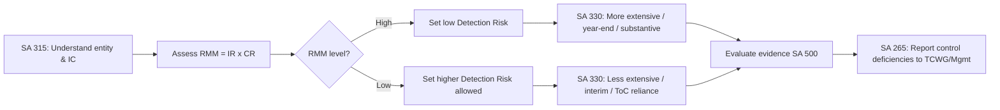

# Q&A — Risk Assessment & Internal Control

*CA Intermediate — Auditing & Ethics | Chapter: Risk Assessment & Internal Control*
*Standards in play: SA 315, SA 330, SA 265, with links to SA 200, SA 240, SA 320, SA 402, SA 500, SA 520, SA 530; Companies Act 2013 Sec 143(3)(i), 134, 138, 177; CARO 2020.*

---

## The one equation to anchor everything

Audit Risk (AR) = Inherent Risk (IR) × Control Risk (CR) × Detection Risk (DR).

IR and CR are the **Risk of Material Misstatement (RMM)** — they exist in the client and the auditor only *assesses* them. DR is the only lever the auditor *controls*, by varying the nature, timing and extent of procedures. For a target AR, DR moves **inversely** to RMM: high RMM → low DR required → more/better evidence.

---

## Section A — Concept-Check (with answers)

**A1. Define audit risk and its components.**
Audit risk is the risk that the auditor expresses an inappropriate opinion when the financial statements are materially misstated (SA 200). AR = IR × CR × DR. IR = susceptibility of an assertion to misstatement before controls; CR = risk that a misstatement will not be prevented/detected by internal control on a timely basis; DR = risk that the auditor's procedures fail to detect an existing misstatement.

**A2. Which components make up the Risk of Material Misstatement?**
IR and CR together constitute RMM. These are the entity's risks and are assessed, not created, by the auditor. DR is a function of audit effectiveness and is the only component the auditor manages directly.

**A3. Explain the inverse relationship between RMM and DR.**
For a given acceptable audit risk, DR must be set inversely to assessed RMM. When RMM is high, acceptable DR is low, so the auditor performs more persuasive, more extensive, and often year-end substantive procedures. When RMM is low, a higher DR is tolerable and less extensive testing suffices. This is the mechanical basis of the SA 330 "responsive" design.

**A4. List the five components of internal control per SA 315.**
(1) Control environment, (2) Entity's risk assessment process, (3) Information system and communication relevant to financial reporting, (4) Control activities, (5) Monitoring of controls.

**A5. Distinguish Test of Controls (ToC) from Substantive Procedures.**
ToC test **operating effectiveness** of controls to support a reduced CR assessment (SA 330). Substantive procedures detect misstatements at the assertion level and comprise (a) tests of details and (b) substantive analytical procedures (SA 330 read with SA 520). Substantive procedures are **mandatory** for each material class of transactions, account balance and disclosure regardless of assessed risk; ToC are performed only when the auditor intends to rely on controls or substantive procedures alone cannot provide sufficient evidence.

**A6. When are Tests of Controls mandatory?**
When the auditor's risk assessment includes an expectation that controls operate effectively (i.e., intends to rely), OR when substantive procedures alone cannot provide sufficient appropriate audit evidence at the assertion level (SA 330 para 8) — typically in highly automated, low-paper environments.

**A7. What is a "significant risk" and what does it require?**
A significant risk is an identified and assessed RMM that, in the auditor's judgement, requires special audit consideration (SA 315). It usually relates to non-routine or judgemental matters and fraud. For a significant risk the auditor must (a) evaluate the design of related controls, and (b) perform substantive procedures **specifically responsive** to it; substantive analytical procedures alone are not sufficient (SA 330).

**A8. Differentiate a "significant deficiency" from a "deficiency" under SA 265.**
A deficiency in internal control exists when a control is unable to prevent/detect misstatements, or a needed control is missing. A significant deficiency is one that, in professional judgement, is of sufficient importance to merit the attention of Those Charged With Governance (TCWG). SA 265 requires significant deficiencies to be communicated **in writing** to TCWG, and other deficiencies to management.

**A9. What must the auditor document under SA 315/330?**
The understanding of the entity and its IC, the assessed RMM at financial statement and assertion levels, significant risks identified, the overall responses and the linkage of further procedures to assessed risks, and the results of procedures (SA 315 & SA 330 documentation requirements; overarching SA 230).

**A10. Does a strong control environment reduce the need for substantive procedures to nil?**
No. Substantive procedures for material items are always required (SA 330). A strong control environment may lower assessed CR and reduce extent, but cannot eliminate substantive testing.

---

## Section B — Applied Scenario Questions (situation → audit response with reasoning)

**B1. SaaS client, no paper trail.** A subscription-software company recognises revenue entirely through an automated billing engine; there are no invoices or delivery notes to vouch.
*Response:* Substantive procedures alone cannot yield sufficient evidence, so SA 330 para 8 makes **Tests of Controls mandatory**. The auditor understands the automated revenue system (SA 315), tests automated application controls and relevant IT General Controls (access, change management, data integrity), and combines re-performance/CAATs on the full transaction population with substantive analytical procedures on subscriber counts × price. Reliability of system-generated reports must itself be tested (SA 500).

**B2. Owner-override, family trading business.** The proprietor personally authorises all payments, keeps the master vendor file, and can post journal entries.
*Response:* This is a control environment weakness with high **management override** risk — an inherent significant/fraud risk (SA 240). Controls cannot be relied upon, so assessed CR is high, DR must be low, and the auditor shifts to extensive substantive testing: 100%/large-sample vouching, testing journal entries (mandatory under SA 240), related-party scrutiny (SA 550), and unpredictable procedures. Deficiency in segregation of duties is a significant deficiency reportable in writing under SA 265.

**B3. Mid-year ERP migration.** The client moved from a legacy system to a new ERP on 1 October; opening balances were converted.
*Response:* Two control environments operate in one period, raising RMM around cut-over. The auditor evaluates data-migration controls (completeness/accuracy of converted balances), tests controls **separately** for the pre- and post-migration periods since reliance for the whole year cannot rest on one system (SA 330), reconciles converted opening balances to legacy closing balances, and performs cut-over testing around 30 September/1 October. IT change-management controls are assessed.

**B4. Analytical anomaly.** Gross margin jumped from 22% to 34% with no change in business model.
*Response:* Under SA 520 an unexpected fluctuation is a risk indicator. The auditor investigates by inquiry of management and, crucially, **corroborates** the explanation with other evidence rather than accepting it (SA 520 para 7). It may signal a significant risk (overstated inventory/revenue) demanding targeted tests of details (SA 330); substantive analytics alone are insufficient for a significant risk. Consider fraud implications (SA 240).

**B5. Service organisation.** Payroll is fully outsourced to a third-party processor whose reports feed the ledger.
*Response:* SA 402 governs. The auditor obtains understanding of services affecting the FS, and either obtains a Type 1/Type 2 assurance report on the service organisation's controls or performs procedures at the service organisation. A Type 2 report supports reliance on operating effectiveness; without it, the auditor must design substantive procedures on payroll.

---

## Section C — Past-Paper-Style Descriptive Questions (with model answers)

**C1. "Detection risk is the only element within the auditor's control." Discuss with reference to how the auditor manages it.**
*Model answer:* AR = IR × CR × DR (SA 200). IR and CR are properties of the entity and its environment; the auditor can only assess them via SA 315 risk-assessment procedures. DR alone depends on the effectiveness of the audit and is managed by altering the **nature** (more reliable procedures, e.g., external confirmation over inquiry), **timing** (year-end rather than interim), and **extent** (larger samples, per SA 530) of further audit procedures (SA 330). Because AR is held to an acceptably low level, DR is set **inversely** to assessed RMM: higher RMM compels lower DR and hence more persuasive evidence. DR can never be reduced to zero because of sampling and non-sampling limitations inherent in any audit.

**C2. Explain the auditor's responsibilities under SA 265 for communicating deficiencies in internal control.**
*Model answer:* SA 265 requires the auditor, having identified deficiencies during the audit, to determine whether individually or in combination they constitute **significant deficiencies**. Significant deficiencies must be communicated **in writing** to TCWG on a timely basis; the communication states a description of the deficiencies, their potential effects, and sufficient information for TCWG to understand the context (it is not a comprehensive list nor an opinion on effectiveness). Other, less severe deficiencies are communicated to the appropriate level of management. The auditor is not required to search for deficiencies but reports those noted while forming the audit opinion. This does not diminish the auditor's own responsibility for the opinion.

**C3. Describe the five components of internal control under SA 315 and their audit relevance.**
*Model answer:* (1) **Control environment** — governance attitude, integrity and ethical values; sets the foundation and influences assessed CR. (2) **Entity's risk assessment process** — how management identifies and responds to business risks relevant to reporting. (3) **Information system and communication** — the procedures and records that initiate, record, process and report transactions and maintain accountability; understanding the flow of transactions is essential to identify where misstatements can arise. (4) **Control activities** — policies/procedures such as authorisation, reconciliation, segregation of duties, and IT application controls; these are the controls the auditor may test. (5) **Monitoring of controls** — ongoing/separate evaluations, including internal audit. The auditor must understand each component to identify and assess RMM and design responses (SA 330).

**C4. What are the auditor's responses to assessed risks at (a) the overall financial-statement level and (b) the assertion level? (SA 330)**
*Model answer:* (a) **Overall responses** address pervasive risks: emphasising professional scepticism, assigning more experienced staff, greater supervision, incorporating unpredictability, and modifying nature/timing/extent generally. (b) **Assertion-level responses** are further audit procedures whose nature, timing and extent are **responsive** to the assessed RMM for each material class/balance/disclosure — comprising tests of controls (only where reliance is intended or substantive testing alone is insufficient) and substantive procedures. Irrespective of assessed risk, the auditor must perform substantive procedures for each material item, and for **significant risks** perform substantive procedures specifically responsive to that risk (analytics alone being inadequate).

**C5. Link internal-control audit work to the Companies Act 2013.**
*Model answer:* Under **Sec 143(3)(i)**, the auditor of specified companies must report on whether the company has an adequate **Internal Financial Controls with reference to financial statements (IFCoFR)** and their operating effectiveness — directly building on SA 315/330 control work. **Sec 134(5)(e)** requires the directors' responsibility statement (listed companies) to assert that adequate internal financial controls were laid down and operating effectively. **Sec 177** empowers the **Audit Committee** (a TCWG channel for SA 265 communication) to evaluate internal financial controls. **Sec 138** mandates **internal audit** for prescribed companies — relevant to the monitoring component and to SA 610 reliance. CARO 2020 additionally requires reporting on specified control-related matters (e.g., internal audit system adequacy).

---

## Section D — MCQs / Case Scenarios (correct option + one-line reasoning)

**D1.** In AR = IR × CR × DR, which is the only component the auditor can directly control?
(a) IR (b) CR (c) DR (d) RMM
**Ans: (c) DR** — managed via nature/timing/extent of procedures; IR and CR are the entity's (SA 200).

**D2.** Tests of controls become **mandatory** when:
(a) controls look strong (b) substantive procedures alone cannot give sufficient evidence (c) the client requests it (d) never
**Ans: (b)** — SA 330 para 8, typical of highly automated, low-paper environments.

**D3.** A significant deficiency in internal control must be communicated:
(a) orally to management (b) in writing to TCWG (c) in the audit report only (d) to shareholders
**Ans: (b)** — SA 265 requires timely **written** communication to TCWG.

**D4.** For a **significant risk**, which is NOT sufficient on its own?
(a) tests of details (b) substantive analytical procedures alone (c) targeted substantive procedures (d) evaluating design of controls
**Ans: (b)** — SA 330 prohibits reliance on analytics alone for significant risks.

**D5.** Which is a substantive procedure?
(a) observing segregation of duties (b) re-performing a bank reconciliation as a test of the control (c) external confirmation of receivables (d) inspecting the authorisation matrix
**Ans: (c)** — confirmations are tests of details detecting misstatements; the others test control operation.

**D6.** Substantive procedures for material items are:
(a) optional if CR is low (b) always required (c) required only for significant risks (d) replaced by ToC
**Ans: (b)** — SA 330 mandates substantive procedures for every material class/balance/disclosure.

**D7.** A gross-margin spike investigated by inquiry, where management's explanation is accepted without corroboration, breaches:
(a) SA 530 (b) SA 520 (c) SA 402 (d) SA 610
**Ans: (b)** — SA 520 requires corroboration of management explanations for significant fluctuations.

**D8. Case scenario.** An auditor of a fully automated e-commerce firm assesses controls as strong, decides to rely on them, but performs **no** substantive procedures on material revenue, arguing CR is very low. Evaluate.
**Ans:** Incorrect. Even with low assessed CR and effective ToC, SA 330 requires substantive procedures for material revenue; controls reliance reduces **extent**, not existence, of substantive work. Revenue also carries a presumed fraud risk (SA 240), a significant risk requiring specifically responsive substantive procedures.

**D9. Case scenario.** During a listed company audit, the CFO can post and approve journals unilaterally. Which combination is correct?
(a) Report as significant deficiency (SA 265) + test journals (SA 240) + relevant to Sec 143(3)(i)
(b) Ignore since automated (c) Only oral note to CFO (d) Reduce substantive testing
**Ans: (a)** — segregation failure is a significant deficiency (written to TCWG/Audit Committee under SA 265), invokes mandatory journal-entry testing (SA 240), and bears on the IFCoFR opinion under Sec 143(3)(i).

**D10.** Reliance on a service organisation's operating effectiveness is best supported by:
(a) a Type 1 report (b) a Type 2 report (c) the client's assurance (d) a brochure
**Ans: (b)** — under SA 402 a Type 2 report covers operating effectiveness over a period; Type 1 covers design at a point in time only.

---

## Traps & Examiner Tricks (rapid list)

1. Writing AR = IR + CR + DR — it is **multiplicative**.
2. Saying the auditor "controls" IR or CR — the auditor only **assesses** them.
3. Getting the DR direction wrong — DR is **inverse** to RMM.
4. Claiming ToC can replace substantive procedures — substantive work is always required for material items.
5. Using analytics alone for a **significant risk** — prohibited (SA 330).
6. Forgetting ToC are **mandatory** where substantive evidence alone is insufficient (SaaS/automated).
7. Communicating significant deficiencies orally — must be **in writing** (SA 265).
8. Confusing "deficiency" (to management) with "significant deficiency" (to TCWG).
9. Treating a strong control environment as eliminating fraud/override risk (SA 240).
10. Accepting management's analytical explanation without corroboration (SA 520).
11. Mixing up SA 315 (assess) with SA 330 (respond) — know which number does what.
12. Ignoring service-organisation controls (SA 402) and IT general controls in automated setups.

---

## First-Principles Recap

You cannot check everything, and some misstatement is deliberately hidden. So you accept a small, defined chance of being wrong (audit risk), split that risk into what the client brings (IR, CR = RMM) and what you can manage (DR), and then spend audit effort inversely to the client-side risk. SA 315 tells you how to **look and assess**; SA 330 tells you how to **respond**; SA 265 tells you how to **report** the control weaknesses you found along the way. Everything else (SA 240, 320, 500, 520, 530, 402 and the Companies Act sections) hangs off this spine.

---

## Quick-Revision Sheet — SA Summary Table

| Standard / Section | One-line role in this chapter |
|---|---|
| SA 200 | Defines audit risk; overall objectives, professional scepticism |
| SA 315 | Identify & **assess** RMM by understanding entity and IC (5 components); significant risks |
| SA 330 | Auditor's **responses**: overall + assertion-level; ToC & substantive; NTE inverse to RMM |
| SA 265 | Communicate control **deficiencies**; significant ones in writing to TCWG |
| SA 240 | Fraud; management override; mandatory journal-entry testing; revenue presumption |
| SA 320 | Materiality — the yardstick for "material" misstatement |
| SA 500 | Sufficient appropriate audit evidence; reliability of information used |
| SA 520 | Analytical procedures; corroborate management explanations |
| SA 530 | Audit sampling — governs **extent** of testing |
| SA 402 | Service organisations; Type 1 vs Type 2 reports |
| Sec 143(3)(i) | Report on adequacy & operating effectiveness of IFCoFR |
| Sec 134(5)(e) | Directors' responsibility statement on internal financial controls (listed cos.) |
| Sec 177 | Audit Committee — evaluates IFC; TCWG channel |
| Sec 138 | Mandatory internal audit — monitoring component |
| CARO 2020 | Additional control/internal-audit reporting clauses |

**Key points to keep on top:** RMM = IR × CR; DR is the only lever; substantive procedures always for material items; ToC mandatory when substantive alone is insufficient; significant risks need targeted substantive tests; significant deficiencies go to TCWG in writing.
