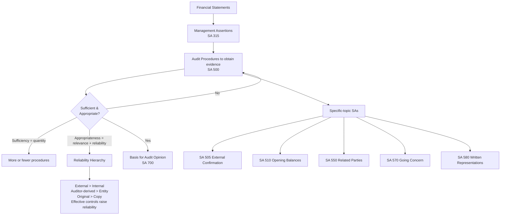

# Q&A — Audit Evidence

> CA Intermediate — Auditing & Ethics | Chapter: Audit Evidence
> Coverage: SA 500, SA 501, SA 505, SA 510, SA 550, SA 560, SA 570, SA 580 (with links to SA 230, SA 315/330). All standards are Indian Standards on Auditing issued by ICAI. No standard cited here is invented.

---

## How the pieces fit (process map)

---

## Section A — Concept Check (with answers)

**A1. Define "audit evidence" and state its two quality dimensions.**
Audit evidence is all information used by the auditor in arriving at the conclusions on which the audit opinion is based (**SA 500**). It includes information in the accounting records *and* other information. Its two quality dimensions are **sufficiency** (measure of *quantity*, affected by risk of material misstatement and quality of evidence) and **appropriateness** (measure of *quality* — its **relevance** and **reliability** in supporting the conclusions).

**A2. What are financial statement assertions? Name the three categories under SA 315.**
Assertions are representations by management, explicit or otherwise, embodied in the financial statements. The three categories are: (i) assertions about **classes of transactions and events** (occurrence, completeness, accuracy, cut-off, classification); (ii) assertions about **account balances** at period end (existence, rights and obligations, completeness, valuation and allocation); and (iii) assertions about **presentation and disclosure**.

**A3. State the reliability hierarchy of audit evidence (SA 500).**
Reliability is influenced by source and nature. Generalisations (subject to exceptions): (a) evidence from **independent external sources** is more reliable than internally generated; (b) internally generated evidence is more reliable when related **controls are effective**; (c) evidence obtained **directly by the auditor** (e.g., observation) is more reliable than obtained indirectly/by inference; (d) evidence in **documentary form** (paper/electronic) is more reliable than oral; (e) **original documents** are more reliable than photocopies or facsimiles.

**A4. List the audit procedures for obtaining evidence.**
Under SA 500 and SA 330: **Inspection, Observation, External Confirmation, Recalculation, Reperformance, Analytical Procedures, and Inquiry.** Inquiry alone does not provide sufficient appropriate evidence and must be corroborated.

**A5. Distinguish "relevance" from "reliability".**
Relevance deals with the **logical connection** between the procedure and the assertion tested (e.g., inspecting inventory tests *existence*, not necessarily *completeness*). Reliability deals with the **trustworthiness** of the evidence based on its source and nature. A piece of evidence must be both relevant and reliable to be appropriate.

**A6. When may the auditor use information produced by a management's expert (SA 500)?**
When such information is used as audit evidence, the auditor shall, to the extent necessary, (a) evaluate the **competence, capabilities and objectivity** of the expert; (b) obtain an understanding of the **work** of that expert; and (c) evaluate the **appropriateness of the expert's work** as audit evidence for the relevant assertion.

**A7. What is a positive vs a negative external confirmation request (SA 505)?**
A **positive** request asks the party to respond in **all cases** — agreeing or disagreeing — giving more reliable evidence. A **negative** request asks the party to respond **only if they disagree**; a non-response provides only weak evidence and is used only when risk is low, controls are effective, a large number of small homogeneous balances exist, and a low exception rate is expected.

**A8. What are "written representations" and can they substitute for other evidence (SA 580)?**
Written representations are written statements by management to confirm certain matters or support other evidence. They are **necessary** audit evidence but **do not by themselves** provide sufficient appropriate evidence; nor do they affect the nature/extent of other evidence the auditor obtains.

---

## Section B — Applied Scenarios (situation → audit response with reasoning)

**B1. Situation:** For trade receivables, the client provides an internally-generated ageing schedule and refuses to allow external confirmations, saying "the ledger is enough."
**Response & reasoning:** Per **SA 505**, external confirmation is more reliable (independent external source) than internal records. If management **refuses to allow** a confirmation request, the auditor shall inquire into reasons, evaluate their validity, and evaluate implications on assessed risk and on the nature/timing/extent of other procedures. If reasons are unreasonable, or alternative procedures cannot yield sufficient appropriate evidence, communicate with those charged with governance (SA 260) and consider implications for the opinion (SA 705).

**B2. Situation:** A confirmation reply is received by fax and appears altered near the balance amount.
**Response & reasoning:** **SA 505** — the auditor must consider the **reliability** of responses. Factors doubting reliability (indirect route, altered figures) require the auditor to obtain **further evidence** (e.g., contact the confirming party directly, verify address/source). If reliability cannot be established, treat as a non-response and perform alternative procedures.

**B3. Situation:** It is a first-year audit (a new appointment). The auditor must deal with opening balances of inventory and fixed assets.
**Response & reasoning:** **SA 510** — obtain sufficient appropriate evidence that (a) opening balances contain no misstatements materially affecting current statements, and (b) appropriate **accounting policies** are consistently applied. Read the **predecessor auditor's report** and financials, review prior-year working papers where permitted, and perform current-year procedures that also give evidence of opening balances (e.g., current collections evidence opening receivables). If opening balances are misstated, or a scope limitation exists, modify the opinion under SA 705.

**B4. Situation:** During audit, you find the entity sold goods to a company owned by the managing director's brother at a price 40% below market.
**Response & reasoning:** **SA 550** (Related Parties) — a **significant related party transaction outside the normal course of business**. Inspect underlying contracts for business rationale, evaluate whether it may indicate fraud, confirm terms, evaluate proper **authorisation and approval** (Section 188, Companies Act 2013), and check **disclosure** adequacy (AS 18 / Ind AS 24). Obtain a written representation (SA 580) that related parties and transactions are fully disclosed.

**B5. Situation:** The company has negative net worth, defaulted on loan repayments, and lost its largest customer.
**Response & reasoning:** **SA 570** (Going Concern) — these are **financial/operating events casting significant doubt**. Evaluate management's assessment covering at least 12 months from the balance sheet date, obtain cash-flow forecasts, review borrowing facilities and management's plans, and obtain **written representations** on feasibility of plans. If a **material uncertainty** exists and is adequately disclosed → unmodified opinion with a **"Material Uncertainty Related to Going Concern"** section. If not disclosed → qualified/adverse. If going concern assumption is inappropriate → **adverse** opinion.

**B6. Situation:** Inventory is material; management values a portion using an actuarial-type valuation model prepared by an in-house engineer.
**Response & reasoning:** The engineer is a **management's expert**. Under **SA 500**, evaluate the expert's competence, capabilities and objectivity; understand the model, assumptions and source data; and test the appropriateness of the output as evidence for the **valuation** assertion. Do not rely blindly; corroborate key inputs. For physical inventory count attendance, apply **SA 501**.

**B7. Situation:** Management gives an oral assurance that all liabilities are recorded and declines to put it in writing.
**Response & reasoning:** **SA 580** — the auditor **shall request written representations** for matters material to the statements where other evidence cannot reasonably be expected to exist. If management **refuses to provide** requested written representations, this is a **scope limitation**; the auditor shall discuss with management, re-evaluate integrity, and **disclaim** or otherwise modify the opinion, since reliability of other representations also becomes doubtful.

---

## Section C — Past-Paper-Style Descriptive Questions (model answers)

**C1. "Sufficiency and appropriateness of audit evidence are interrelated." Explain. (SA 500)**
Sufficiency is the measure of the **quantity** of audit evidence. The quantity needed is affected by the auditor's **assessment of the risks of material misstatement** (higher risk → more evidence) and by the **quality** of the evidence (higher quality → less may be required). Appropriateness is the measure of the **quality** of evidence — its relevance and reliability. The two are interrelated: merely obtaining more evidence (sufficiency) cannot compensate for poor quality (appropriateness). The auditor must obtain evidence that is **both** sufficient and appropriate to reduce audit risk to an acceptably low level and to draw reasonable conclusions supporting the opinion. Professional judgement and professional scepticism govern the assessment of whether enough appropriate evidence has been obtained.

**C2. Explain the audit procedures used to obtain audit evidence under SA 500 / SA 330.**
(i) **Inspection** — examining records/documents (internal or external) or physical examination of an asset; reliability varies with nature and source. (ii) **Observation** — watching a process or procedure performed by others (e.g., inventory count); limited to the point in time observed. (iii) **External Confirmation** — direct written response from a third party (SA 505). (iv) **Recalculation** — checking mathematical accuracy of documents/records. (v) **Reperformance** — the auditor's independent execution of procedures or controls originally performed as part of internal control. (vi) **Analytical Procedures** — evaluation through analysis of plausible relationships among financial and non-financial data. (vii) **Inquiry** — seeking information from knowledgeable persons; must be **corroborated** as it is not sufficient alone. These may serve as risk assessment procedures, tests of controls, or substantive procedures.

**C3. Write a note on external confirmation, its types and the auditor's duties on management refusal. (SA 505)**
External confirmation is audit evidence obtained as a **direct written response** to the auditor from a third party (the confirming party), in paper or electronic form. Because it comes from an independent external source and directly to the auditor, it is highly reliable. **Types:** *positive* (respond in all cases) and *negative* (respond only on disagreement). The auditor **maintains control** over the confirmation process — selecting items, designing requests, sending them, and receiving responses. On **management's refusal** to allow a confirmation: inquire into reasons and evaluate their validity and reliability implications; perform **alternative procedures**; if reasons are unreasonable or alternatives are inadequate, communicate to those charged with governance and consider the impact on the opinion. The auditor must also evaluate whether **results** of confirmations provide relevant and reliable evidence, investigating **exceptions** and treating unreliable responses as non-responses.

**C4. Discuss the auditor's responsibilities regarding opening balances in an initial audit engagement. (SA 510)**
An initial audit engagement is one where prior-period statements were **not audited** or were audited by a **predecessor**. The auditor must obtain sufficient appropriate evidence that: (a) opening balances do **not contain misstatements** materially affecting the current period; and (b) appropriate **accounting policies** reflected in opening balances have been **consistently applied**, and changes are properly accounted for and disclosed. Procedures: read the most recent financial statements and predecessor's report; determine whether opening balances reflect proper policies; and either review the predecessor's working papers or perform specific procedures. If evidence cannot be obtained → **qualified opinion or disclaimer**; if opening balances contain a material misstatement affecting the current period and not properly dealt with → **qualified/adverse**; if a change in accounting policy is not properly accounted for/disclosed → modify accordingly.

**C5. Explain going concern responsibilities of the auditor, including reporting outcomes. (SA 570)**
Financial statements are ordinarily prepared on the **going concern basis**. The auditor must (a) remain **alert** throughout the audit for events/conditions casting significant doubt, (b) **evaluate management's assessment** (period of at least twelve months from the date of the financial statements), and (c) conclude on the **appropriateness** of the assumption and on any **material uncertainty**. Where events/conditions are identified, obtain sufficient appropriate evidence via additional procedures — cash flow forecasts, review of plans, subsequent-events review, and **written representations** on plans. **Reporting outcomes:** (1) Going concern appropriate, no material uncertainty → unmodified. (2) Material uncertainty exists and **adequately disclosed** → unmodified opinion with a separate **"Material Uncertainty Related to Going Concern"** paragraph. (3) Material uncertainty **not adequately disclosed** → qualified or adverse opinion. (4) Going concern basis **inappropriate** → **adverse** opinion. (5) Management unwilling to make/extend its assessment → consider implications (possible qualification/disclaimer).

**C6. State the purpose and limits of written representations. (SA 580)**
Written representations are information provided by management/those charged with governance in writing to **confirm certain matters or support other audit evidence**. Purposes: obtain representation that management has **fulfilled its responsibility** for preparation of the financial statements and for completeness of information provided, and to support specific assertions where warranted. **Limits:** they are necessary but **not sufficient on their own**; they do not relieve the auditor of obtaining other evidence and do not affect the nature/extent of other procedures. If representations are **inconsistent** with other evidence, the auditor investigates and reconsiders reliability. If management **does not provide** requested representations or its integrity is in doubt, the auditor may **disclaim** the opinion.

---

## Section D — MCQs / Case Scenarios (correct option + one-line reasoning)

**D1.** Sufficiency of audit evidence is the measure of its —
A. Quality  B. Relevance  C. **Quantity**  D. Reliability
**Ans: C** — Sufficiency = quantity; appropriateness = quality (relevance + reliability). (SA 500)

**D2.** Which is generally the MOST reliable audit evidence?
A. Photocopy of a supplier invoice held by client
B. **Bank confirmation received directly by the auditor**
C. Oral statement of the accountant
D. Client's internal ageing schedule
**Ans: B** — External, direct, documentary source ranks highest in the reliability hierarchy. (SA 500/505)

**D3.** Inquiry alone —
A. Is always sufficient  B. **Does not provide sufficient appropriate evidence**  C. Is more reliable than inspection  D. Replaces confirmation
**Ans: B** — Inquiry must be corroborated with other procedures. (SA 500)

**D4.** A confirmation request requiring the party to respond only if they disagree is a —
A. Positive request  B. **Negative request**  C. Blank request  D. Statutory request
**Ans: B** — Negative confirmation; used only in low-risk, homogeneous populations. (SA 505)

**D5.** In an initial audit, the standard governing opening balances is —
A. SA 550  B. SA 570  C. **SA 510**  D. SA 560
**Ans: C** — SA 510 deals specifically with opening balances. 

**D6.** Management's assessment of going concern must cover a period of at least —
A. 6 months  B. **12 months from the date of the financial statements**  C. 24 months  D. The next AGM
**Ans: B** — Minimum twelve months from the date of the financial statements. (SA 570)

**D7. Case:** A confirmation reply agreeing the balance is received, but the auditor learns the confirming party is controlled by the client's promoter. The auditor should —
A. Accept it as reliable  B. **Doubt reliability and obtain further evidence / treat with scepticism**  C. Ignore the relationship  D. Issue an adverse opinion
**Ans: B** — Reliability of confirmation is reduced where the party is not truly independent; SA 505 requires evaluating reliability and, potentially, SA 550 related-party scrutiny.

**D8. Case:** Management refuses to sign the written representation letter on completeness of liabilities. The most appropriate action is —
A. Issue unmodified opinion  B. Ignore, since oral assurance was given  C. **Treat as a scope limitation and consider disclaimer of opinion**  D. Withdraw the audit report
**Ans: C** — Refusal to provide required written representations is a limitation on scope, casting doubt on other representations. (SA 580)

**D9.** Evidence obtained directly by the auditor through observation of a control is more reliable than —
A. External confirmation  B. **Evidence obtained indirectly or by inference**  C. Original documents  D. Recalculation
**Ans: B** — Directly obtained evidence outranks indirectly obtained evidence. (SA 500)

**D10. Case:** A material related-party sale below market price is properly disclosed but lacks board approval under Section 188. The auditor should —
A. Do nothing since it is disclosed  B. **Evaluate authorisation, business rationale and possible fraud/non-compliance, and consider reporting implications**  C. Confirm only the balance  D. Rely on management's oral explanation
**Ans: B** — SA 550 requires evaluating authorisation, rationale, and fraud indicators; non-compliance with Section 188 has reporting consequences.

---

## One-line examiner traps to remember
- "More evidence" (sufficiency) **cannot** cure poor quality (appropriateness).
- Inspection of inventory proves **existence**, not **completeness/valuation**.
- Negative confirmations: a **non-response is not evidence** that the balance is correct.
- Written representations **support** but never **substitute** substantive evidence (SA 580).
- Going concern period = **minimum 12 months from the date of the financial statements** (SA 570).
- Management's expert ≠ auditor's expert; SA 500 governs use of a **management's** expert.
