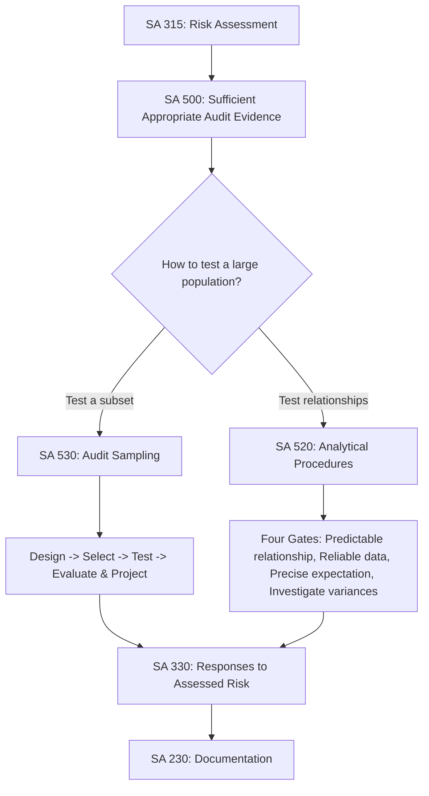

# Q&A — Audit Sampling & Analytical Procedures

> CA Intermediate — Auditing & Ethics | Chapter: Audit Sampling & Analytical Procedures
> Standards in play: **SA 500** (Audit Evidence), **SA 530** (Audit Sampling), **SA 520** (Analytical Procedures), with links to SA 315, SA 320, SA 330, SA 240 and SA 230.

---

## How the pieces fit (read this first)

---

## SECTION A — Concept-Check Questions (with answers)

**A1. Define "audit sampling" as per SA 530.**
Audit sampling is the application of audit procedures to **less than 100%** of the items within a population of audit relevance such that **all sampling units have a chance of selection**, in order to provide the auditor a reasonable basis to draw conclusions about the **entire population**. (SA 530, para 5)

**A2. What is the "sampling unit"?**
The individual items constituting a population — e.g., an invoice, a debtor balance, a voucher. (SA 530, para 5)

**A3. Distinguish sampling risk and non-sampling risk.**
- **Sampling risk**: the risk that the auditor's conclusion based on a sample differs from the conclusion had the **entire population** been tested. It has two aspects — risk of *incorrect acceptance* / *underreliance* and risk of *incorrect rejection* / *overreliance*.
- **Non-sampling risk**: risk that the auditor reaches a wrong conclusion for **any reason unrelated to sample size** — e.g., using inappropriate procedures or misinterpreting evidence. (SA 530, para 5)

**A4. What makes audit evidence "sufficient" and "appropriate" under SA 500?**
- **Sufficiency** = the **measure of the quantity** of audit evidence.
- **Appropriateness** = the **measure of the quality** — its **relevance** and **reliability** in supporting the conclusions. Higher risk usually needs more evidence; higher quality may permit less. (SA 500, para 5)

**A5. State the reliability hierarchy of audit evidence (SA 500).**
Reliability is greater when evidence is: (a) from **independent external sources**; (b) generated under **effective internal control**; (c) obtained **directly by the auditor** (e.g., observation) rather than indirectly; (d) in **documentary** form rather than oral; and (e) **original** documents rather than photocopies/facsimiles. (SA 500, para A31)

**A6. Define analytical procedures (SA 520).**
Evaluations of financial information through analysis of **plausible relationships** among both financial and non-financial data, including the investigation of **fluctuations or relationships that are inconsistent** with other information or that deviate significantly from expected values. (SA 520, para 4)

**A7. Name the two broad approaches to sampling.**
**Statistical sampling** (random selection + probability theory to evaluate results, allowing measurement of sampling risk) and **non-statistical sampling** (judgemental — does not have both features). (SA 530, para 5)

**A8. What is "tolerable misstatement"?**
A monetary amount set by the auditor for which the auditor seeks to obtain appropriate assurance that the actual misstatement in the population does not exceed it. It is the application of **performance materiality** (SA 320) to a particular sampling procedure. (SA 530, para 5)

**A9. What is "tolerable rate of deviation"?**
A rate of deviation from prescribed internal control procedures set by the auditor, for which he seeks appropriate assurance that the actual deviation rate is not exceeded — used in **tests of controls**. (SA 530, para 5)

**A10. When must analytical procedures be used mandatorily?**
Analytical procedures are **mandatory at the risk-assessment stage** (SA 315) and **mandatory near the end of the audit** to form an overall conclusion on whether the financial statements are consistent with the auditor's understanding (SA 520, para 6). As **substantive procedures** they are **optional** (auditor's choice under SA 520, para 5).

---

## SECTION B — Applied Scenario Questions (Situation → Audit Response with reasoning)

**B1. Projection failure.**
*Situation:* An auditor selects a sample of 60 sales invoices from a population of 6,000 and finds misstatements totalling ₹9,000. He concludes "the misstatement is only ₹9,000, which is below materiality — no issue."
*Required:* Comment.
*Response:* This is **wrong**. SA 530 (para 14) requires the auditor to **project** misstatements found in the sample to the **entire population**. The ₹9,000 relates only to the 60 items tested; it must be extrapolated (here, roughly ₹9,000 × 6,000/60 = ₹9,00,000 projected). Only the projected misstatement — together with any **anomalous** misstatement — is compared with tolerable misstatement. Failing to project defeats the purpose of sampling and understates the population misstatement. Reasoning anchor: a sample is representative of the whole; conclusions must be drawn about the whole (SA 530, para 5, 14).

**B2. Treating a deviation as anomalous.**
*Situation:* A misstatement in the sample arose from a computer glitch on a single day that has since been corrected and cannot recur. May the auditor exclude it from projection?
*Response:* Only if the auditor obtains a **high degree of certainty** that the misstatement/deviation is **not representative** of the population — i.e., it is an **anomaly** (SA 530, para 13). He must perform **additional procedures** to establish the misstatement will not affect the rest of the population. If established as anomalous, it is **excluded from projection** but **still added** to the total misstatement (projected + anomalous) when evaluating results. An anomaly is exceptional; it should not be assumed.

**B3. Incoherent gross margin (substantive analytics).**
*Situation:* During analytical review, gross profit margin jumped from 22% to 38% though selling prices and product mix were unchanged, and there was no obvious reason.
*Response:* This is a **significant fluctuation inconsistent with expectations**. Under SA 520 (para 7), the auditor must **investigate**: (a) inquire of management and obtain **corroborating audit evidence** for the explanation, and (b) perform **other audit procedures** if the response is inadequate or unsatisfactory. A margin spike may signal **overstated closing inventory**, **understated purchases/COGS**, cut-off errors or fictitious sales — a possible **fraud risk** (SA 240). The auditor must not accept management's explanation at face value; he corroborates it.

**B4. Systematic selection trap.**
*Situation:* An auditor uses **systematic (interval) selection** — every 50th voucher — over a payments journal in which every 50th entry happens to be an automated month-end recurring standing-order payment.
*Response:* Systematic selection is invalid where the population has a **structure/pattern that coincides with the sampling interval**, because the sample then over-represents one type of item and is **not representative** (SA 530, para A13). The auditor should verify the population has **no pattern**, or switch to **random selection**. Otherwise the sample gives a biased basis for the population conclusion.

**B5. Directional testing error.**
*Situation:* To test **completeness** of purchases (understatement), the auditor picks a sample from the **purchases ledger** and vouches each to a supplier invoice.
*Response:* Wrong **direction**. Selecting from the recorded ledger tests **occurrence/existence** (overstatement), not completeness. To test completeness the auditor must start from an **independent, external population** — e.g., goods received notes / supplier statements — and **trace forward** into the ledger to detect **unrecorded** purchases (SA 500 relevance of evidence; SA 315 assertions). The chosen population must match the assertion being tested.

**B6. Population not appropriate.**
*Situation:* To confirm existence of trade receivables, an auditor draws his sample from the **sales day book**.
*Response:* Inappropriate population. Existence of receivables must be tested from the **closing debtors balances**, not the sales book, because the sample must be drawn from the population **relevant to the objective** and be **complete** (SA 530, para 6, and SA 500 relevance). Sampling from the sales book could include amounts already settled.

**B7. Reliability of data used in analytics.**
*Situation:* An auditor builds an expectation of interest expense using a loan schedule prepared by the client's finance team whose controls the auditor has not tested.
*Response:* SA 520 (para 5(b)) requires the auditor to evaluate the **reliability of data** from which the expectation is developed, considering source, comparability, nature/relevance and controls over preparation. If controls over the schedule are untested, the auditor should **test the source data** or corroborate it (e.g., independent recomputation from sanction letters and bank statements) before relying on the analytical result.

---

## SECTION C — Past-Paper-Style Descriptive Questions (with model answers)

**C1. "Sample size is not a valid criterion to distinguish statistical from non-statistical sampling." Discuss the factors affecting sample size in tests of details.** *(SA 530)*
*Model answer:* Whether statistical or non-statistical, the **sample size must be sufficient** to reduce sampling risk to an acceptably low level (SA 530, para 7). The distinction lies in **random selection + probability-based evaluation**, not in size. Factors increasing/decreasing sample size for **tests of details** (SA 530, Appendix 3):
- **Higher assessed risk of material misstatement** → larger sample.
- **Greater reliance on other substantive procedures** for the same assertion → smaller sample.
- **Higher required confidence** (assurance) → larger sample.
- **Higher tolerable misstatement** → smaller sample.
- **Higher expected misstatement** in the population → larger sample.
- **Stratification** of the population where appropriate → reduces sample size.
- **Number of sampling units** in the population → negligible effect for large populations.

**C2. Explain the methods of selecting sample items under SA 530.**
*Model answer:* (SA 530, para A13 / Appendix 4)
1. **Random selection** — using random number generators/tables; every unit has a known equal chance.
2. **Systematic selection** — a constant **sampling interval** with a random start; avoid where population has a pattern.
3. **Monetary Unit Sampling (MUS)** — value-weighted selection; probability of selection proportional to monetary amount, biasing toward high-value items.
4. **Haphazard selection** — no structured technique but **no conscious bias**; not appropriate for statistical sampling.
5. **Block selection** — selecting contiguous items (e.g., all vouchers of one month); generally **inappropriate** as most populations are not so structured and blocks are unrepresentative.

**C3. Discuss the auditor's action when a sample is not representative or when deviations/misstatements are found. (Evaluation of results — SA 530)**
*Model answer:* Under SA 530 (paras 12–15):
- **Investigate nature and cause** of every deviation/misstatement and evaluate its effect on the audit.
- Consider whether it is an **anomaly**; if claimed anomalous, obtain **high certainty** through additional procedures.
- For **tests of details**, **project** the misstatement to the population; for **tests of controls**, the sample deviation rate is the projected population deviation rate.
- Compare projected misstatement (plus anomalous) with **tolerable misstatement**; compare deviation rate with **tolerable rate**.
- If results indicate the population **may be materially misstated / control cannot be relied on**, the auditor **re-evaluates**, may **extend the sample**, or perform **alternative/further procedures**. If sampling has not provided a reasonable basis, additional evidence is obtained (SA 500).

**C4. State the purposes and stages of analytical procedures in an audit. (SA 520 read with SA 315)**
*Model answer:* Analytical procedures serve three roles across the audit:
1. **Risk assessment procedures** (SA 315) — **mandatory** at planning, to understand the entity and identify areas of risk / unusual relationships.
2. **Substantive analytical procedures** (SA 520, para 5) — **optional**; used to obtain evidence on assertions where relationships are **predictable** and data reliable, often for large volumes of transactions.
3. **Overall review at the end** (SA 520, para 6) — **mandatory**, to conclude whether the financial statements are consistent with the auditor's understanding of the entity.
Techniques include **ratio analysis, trend analysis, reasonableness tests** and comparison with prior periods, budgets, industry data and non-financial information.

**C5. What are the "four gates" (conditions) the auditor must satisfy before relying on substantive analytical procedures? (SA 520, para 5)**
*Model answer:*
1. **Suitability** — the substantive analytical procedure is **suitable for the assertion**, considering assessed risk and any tests of details for that assertion (para 5(a)).
2. **Reliable data** — evaluate reliability of the data used to develop the expectation (source, comparability, relevance, controls over preparation) (para 5(b)).
3. **Precise expectation** — develop an expectation **sufficiently precise** to identify a misstatement that, individually or aggregated, could be material (para 5(c)).
4. **Acceptable difference / investigate** — determine the amount of difference from the expectation that is acceptable **without investigation**, and **investigate** differences exceeding it (para 5(d) → para 7).

**C6. How does the auditor determine that a population is appropriate for sampling? (SA 530, para 6)**
*Model answer:* The population must be:
- **Appropriate** to the objective of the audit procedure, including the **direction of testing** (e.g., completeness vs existence); and
- **Complete** — the auditor obtains evidence that the population from which the sample is drawn is complete, so the conclusion validly extends to the whole population.
The auditor also considers **stratification** (dividing into sub-populations of similar characteristics) and testing **high-value/key items 100%** separately, with sampling applied to the residual.

---

## SECTION D — MCQs and Case Scenarios (correct option + one-line reasoning)

**D1.** Audit sampling requires that:
(a) only high-value items are selected
(b) all sampling units have a chance of selection
(c) exactly 10% of items are tested
(d) only the auditor's favourite items are tested
**Answer: (b)** — SA 530 defines sampling as giving *all* units a chance of selection.

**D2.** The risk that the auditor's conclusion from a sample differs from the conclusion on the whole population is:
(a) non-sampling risk (b) detection risk (c) sampling risk (d) business risk
**Answer: (c)** — By definition under SA 530.

**D3.** "Appropriateness" of audit evidence refers to its:
(a) quantity (b) quality — relevance and reliability (c) cost (d) age
**Answer: (b)** — SA 500 para 5; sufficiency is quantity, appropriateness is quality.

**D4.** Analytical procedures are mandatory:
(a) only at planning (b) only as substantive tests (c) at risk assessment and at the overall final review (d) never
**Answer: (c)** — SA 315 (planning) and SA 520 para 6 (overall conclusion); substantive analytics are optional.

**D5.** Selecting every 40th item where the population has an embedded recurring pattern at that interval violates the requirement that a sample be:
(a) large (b) statistical (c) representative (d) documented
**Answer: (c)** — Systematic selection fails when population structure coincides with the interval (SA 530, A13).

**D6.** A misstatement demonstrably not representative of the population is called:
(a) tolerable (b) projected (c) anomalous (d) expected
**Answer: (c)** — An anomaly, requiring high certainty (SA 530, para 13); excluded from projection but added to total.

**D7.** The most reliable of the following audit evidence is:
(a) a photocopy of a client-prepared voucher
(b) an oral representation by the CFO
(c) a bank confirmation received directly by the auditor
(d) an internally generated report with weak controls
**Answer: (c)** — External, direct, documentary evidence ranks highest (SA 500, A31).

**D8.** Tolerable misstatement is essentially the application of ____ to a sampling procedure:
(a) overall materiality (b) performance materiality (c) trivial threshold (d) audit risk
**Answer: (b)** — SA 530 links tolerable misstatement to performance materiality (SA 320).

**D9 — Case Scenario.**
*CA Nidhi is auditing Zephyr Ltd. She develops an expectation of power cost using units produced × average tariff, finds actual power cost 30% above expectation, and accepts the CFO's one-line email saying "rates went up."*
Which is correct?
(a) Accepting the email alone is adequate
(b) She must corroborate the explanation with independent evidence and consider other procedures
(c) A 30% variance never needs investigation
(d) Analytical procedures cannot use non-financial data
**Answer: (b)** — SA 520 para 7 requires investigating inconsistent fluctuations by inquiry **plus corroboration** and, if needed, other procedures. (Non-financial data such as units produced is expressly permitted.)

**D10 — Case Scenario.**
*During a test of controls over purchase approvals, the tolerable deviation rate was 5%. In a sample of 100, the auditor finds 8 deviations, one of which is a genuine anomaly.*
Best response?
(a) Ignore all deviations as immaterial
(b) Treat 7% as the projected deviation rate, note it exceeds tolerable, and reduce reliance / extend testing
(c) Exclude all 8 and rely fully on the control
(d) Project ₹ value of the deviations
**Answer: (b)** — For tests of controls the sample deviation rate is the projected population rate (SA 530, para 14); after removing the anomaly the rate (7%) still exceeds the 5% tolerable rate, so the auditor cannot rely on the control and must respond (SA 330). (Value projection applies to tests of details, not control deviations.)

**D11.** Which selection method is generally considered inappropriate because populations are rarely structured that way?
(a) random (b) monetary unit (c) block selection (d) systematic
**Answer: (c)** — Block selection yields unrepresentative contiguous items (SA 530, A13).

**D12.** Where does the requirement to document the sampling basis, evaluation and conclusions ultimately flow from?
(a) SA 240 (b) SA 230 (c) SA 610 (d) SA 700
**Answer: (b)** — SA 230 governs audit documentation of the nature, timing, extent and conclusions of procedures performed.

---

## Quick-Revision One-Liners

- **SA 500** = evidence must be **sufficient (quantity)** + **appropriate (quality: relevant + reliable)**.
- **SA 530** = test a **representative subset**; sample size driven by **RMM, tolerable & expected misstatement, required confidence, stratification**.
- Selection: **random, systematic, MUS, haphazard, block** (last two weak; block usually inappropriate).
- Always **project** sample misstatement to the population; add **anomalous** separately; compare with **tolerable misstatement**.
- **SA 520 four gates** = suitable procedure, reliable data, precise expectation, investigate significant differences with corroboration.
- **Direction of testing** = existence/occurrence tests from the **books**; completeness tests from **independent/external population**.
- Analytics mandatory at **risk assessment** and **final overall review**; optional as substantive.
- Fraud-flavoured variances → **SA 240**; responses to results → **SA 330**; materiality inputs → **SA 320**; document everything → **SA 230**.
