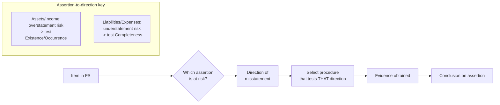

# Q&A — Audit of Items of Financial Statements

> CA Intermediate — Auditing & Ethics. Every question is followed by a complete model answer citing the relevant SA/section. Standards referenced are Indian Standards on Auditing (SAs) issued by ICAI and provisions of the Companies Act, 2013. No standards have been invented.

---

## The one-line mental model

The examiner never asks "audit revenue." He asks "audit the **assertion about revenue that is most likely to be misstated in the direction management prefers**." Assertions are the bridge from *risk* to *procedure*. Pick the wrong assertion and you pick the wrong tool.

**First principle (double-entry direction):** overstating an asset or income overstates profit; understating a liability or expense also overstates profit. So for **assets and income** the auditor fears *overstatement* and tests **Existence / Occurrence**; for **liabilities and expenses** the auditor fears *understatement* and tests **Completeness**.

---

## Section A — Concept-check (short questions + answers)

**A1. What is an "assertion" and why does the auditor care about the *direction* of misstatement?**
Assertions are the representations, explicit or implied, that management makes in the financial statements about classes of transactions, account balances and disclosures (per SA 315, "Identifying and Assessing the Risks of Material Misstatement"). They include Existence, Rights & Obligations, Completeness, Valuation/Accuracy, Occurrence, Cut-off, Classification and Presentation. Direction matters because management's incentive is usually to overstate profit — hence assets/income are audited chiefly for *overstatement* (Existence/Occurrence) and liabilities/expenses for *understatement* (Completeness). The assertion at risk dictates the procedure.

**A2. Which single assertion is the primary target when auditing revenue, and which SA presumes a fraud risk there?**
The **Occurrence** assertion (did the sale really happen and belong to this period). SA 240, "The Auditor's Responsibilities Relating to Fraud in an Audit of Financial Statements," creates a **rebuttable presumption of fraud risk in revenue recognition**. Cut-off is the close cousin — recording next-year sales in this year.

**A3. When is the auditor *required* to attend physical inventory counting, and under which SA?**
Under **SA 501, "Audit Evidence — Specific Considerations for Selected Items,"** when inventory is material the auditor shall attend physical counting (unless impracticable) to: evaluate management's count instructions, observe procedures, inspect the inventory, and perform test counts. This addresses primarily the **Existence** assertion.

**A4. If attendance on the counting date is impracticable, what does SA 501 permit?**
Attend on an **alternative date** and perform audit procedures over **intervening transactions** (roll-back/roll-forward). If attendance itself is impracticable, perform alternative procedures; if even those cannot give sufficient appropriate evidence, **modify the opinion** under SA 705.

**A5. What is external confirmation and which SA governs it?**
Evidence obtained as a direct written response to the auditor from a third party (a confirming party), governed by **SA 505, "External Confirmations."** Positive confirmation asks the party to respond in all cases; negative confirmation asks for a response only if they disagree. It is most useful for the **Existence / Rights** assertion of receivables and bank balances.

**A6. Which assertion is the weak point for trade payables and provisions, and why?**
**Completeness.** Because management prefers to understate liabilities (to boost profit and net worth), the fear is *unrecorded* payables and *under-provided* obligations — so the auditor searches for unrecorded liabilities rather than merely vouching what is booked.

**A7. Which SA governs auditing accounting estimates such as provisions and contingent liabilities?**
**SA 540, "Auditing Accounting Estimates and Related Disclosures."** It requires the auditor to evaluate the method, assumptions and data, test how management made the estimate, and consider indicators of management bias. Contingent liabilities and provisions turn on estimation and judgment, so SA 540 drives the work.

**A8. Under the Companies Act, 2013, name two clauses of CARO 2020 an auditor cross-checks while auditing PPE.**
CARO 2020 requires reporting on (a) maintenance of **proper records of Property, Plant & Equipment** showing full particulars including quantitative details and situation, and whether PPE has been **physically verified** at reasonable intervals; and (b) whether **title deeds of immovable property** are held in the company's name. These map to the Existence and Rights & Obligations assertions of PPE.

**A9. What is "cut-off" and give the direction of error it guards against for sales and purchases.**
Cut-off tests that transactions are recorded in the correct period. For **sales**, the risk is recording *next period's* sales in the *current* period (overstatement of income). For **purchases/expenses**, the risk is pushing *current* period costs into the *next* period (understatement of expense). It is tested by examining despatch/GRN documents around the year-end date.

**A10. Which assertion dominates the audit of investments, and what evidence supports it?**
**Valuation** (are investments carried correctly — at cost, fair value or per applicable AS/Ind AS with impairment) alongside **Existence/Rights**. Evidence: inspection of physical scrips or **demat/DP statements and CDSL/NSDL confirmations**, market quotations for fair valuation, and confirmation for investments held by third parties (SA 505).

---

## Section B — Applied scenarios (situation → audit response with reasoning)

**B1. Channel stuffing.** A consumer-goods company reports a sharp spike in sales in the last week of March, followed by heavy sales returns in the first week of April. How should the auditor respond?
**Response:** This is a classic **Occurrence + Cut-off** red flag, and SA 240 presumes fraud risk in revenue. The auditor should: (i) examine **despatch documents, gate-pass and lorry receipts** for late-March invoices to verify goods actually left; (ii) test **cut-off** by tracing invoices booked around 31 March to proof of delivery and terms of transfer of control; (iii) review **post year-end sales returns / credit notes** and reverse revenue where sale did not truly occur before year-end; (iv) scrutinise dealer agreements for **right-of-return or "sale-or-return"** arrangements that defeat recognition; (v) consider confirming key dealer balances (SA 505). If revenue is inflated, insist on correction; else evaluate impact on the opinion under SA 705.

**B2. Late inventory count.** Due to a plant lockout, the company could count inventory only on 10 April instead of 31 March. Inventory is material. What does the auditor do?
**Response:** SA 501 permits attendance on an **alternative date**. The auditor attends the 10 April count, performs test counts and observes controls, then audits **intervening transactions** (purchases, sales, production 1–10 April) to **roll back** the 10 April quantities/value to 31 March and reconcile. Verify the reconciliation with GRNs, despatch notes and production records. If the intervening records are unreliable or attendance/alternative procedures cannot yield sufficient appropriate evidence on **Existence**, the auditor modifies the opinion (qualified or disclaimer) under SA 705.

**B3. Small creditor / unrecorded liability.** During the search for unrecorded liabilities, the auditor finds a goods-received note dated 28 March for which no purchase invoice is booked and no provision made; the supplier is small and the amount modest. Response?
**Response:** The assertion at risk for payables is **Completeness**, and the *individually immaterial* amount can be misleading — the auditor evaluates it as one instance in a pattern. Procedure: examine **post year-end payments and unpaid invoices** in April, trace the 28 March GRN to see if the liability belongs to the current year, and check whether goods are included in year-end inventory (if the stock is in but the payable is out, both purchases and creditors are understated). If it belongs to March, propose an adjustment to record the payable/accrual. Aggregate all such findings against materiality before concluding (SA 320 / SA 450).

**B4. Under-provided lawsuit.** A company is defending a ₹5 crore product-liability suit. Its lawyer says an adverse outcome is "probable" and the likely payout ₹3–4 crore, but the company provides only ₹50 lakh and discloses the rest as a contingent liability. Response?
**Response:** This is an **accounting estimate** under **SA 540** and a completeness/valuation issue for provisions. Per AS 29 (Provisions, Contingent Liabilities and Contingent Assets), a **present obligation that is probable and reliably estimable requires a provision**, not mere disclosure. The auditor should: (i) obtain **direct confirmation / legal opinion from the company's lawyers** on likelihood and range; (ii) evaluate management's assumptions and check for **management bias** (under-provisioning to protect profit); (iii) conclude the ₹50 lakh provision is understated and the estimate unreasonable. Request correction to provide the best estimate. If management refuses and the amount is material, **qualify or issue an adverse opinion** under SA 705; obtain written representations (SA 580) but never as a substitute for evidence.

**B5. Negative confirmation only.** For a large book of small retail debtors with strong controls and low exception history, the audit senior proposes only negative confirmations. Is that acceptable?
**Response:** Under SA 505, negative confirmations may be used **only when all** of these hold: risk of material misstatement is **low** and controls are effective, the population is **large and homogeneous with small balances**, a **low exception rate** is expected, and the auditor is not aware of circumstances that would cause recipients to disregard them. Since those conditions are met here, negative confirmation is acceptable as *one* source, but because non-response is treated as agreement, the auditor should **combine** it with other substantive procedures (subsequent receipts testing). If risk were higher, positive confirmations would be required.

---

## Section C — Past-paper-style descriptive questions with model answers

**C1. "How would you verify Revenue from the sale of goods?" (Assertions, procedures, SA references.)**
**Model answer:** Revenue is audited principally for **Occurrence, Cut-off, Accuracy and Completeness**, with a fraud presumption under **SA 240**.
- **Occurrence:** Vouch a sample of recorded sales to **invoices, despatch documents, customer orders and gate passes**; confirm goods left the premises and control passed.
- **Cut-off:** Examine the **last few despatch notes/invoices before and after year-end** to ensure sales are recorded in the correct period; review post-year sales returns.
- **Accuracy:** Recompute invoice amounts, check price/quantity to approved price lists and reconcile to the general ledger.
- **Completeness:** Trace despatch notes to invoices to ensure all goods sold are billed.
- **Analytical procedures (SA 520):** Compare gross margins, monthly sales trends and revenue per unit against prior year and expectation.
- **Presentation:** Check disclosure per applicable AS/Ind AS and Schedule III of the Companies Act, 2013.

**C2. "State the auditor's duties regarding physical verification of inventory under SA 501." (Detailed.)**
**Model answer:** Under **SA 501**, when inventory is material to the financial statements the auditor shall **attend physical inventory counting**, unless impracticable, and:
(a) **Evaluate management's instructions and procedures** for recording and controlling the count;
(b) **Observe** the performance of the count procedures;
(c) **Inspect** the inventory (condition, obsolescence, damaged/slow-moving items — a **Valuation** concern);
(d) Perform **test counts** — trace items from floor to records (Completeness) and from records to floor (Existence).
If counting is at a date **other than the balance-sheet date**, perform procedures on **intervening transactions**. If attendance is **impracticable**, perform **alternative procedures**; where inventory is held by a **third party**, obtain **confirmation** from that party (SA 505) and/or inspect. If sufficient appropriate evidence cannot be obtained, **modify the opinion (SA 705)**. Under CARO 2020 the auditor also reports on the reasonableness of coverage and discrepancies of 10% or more.

**C3. "Explain external confirmation of trade receivables — process, positive vs negative, and treatment of non-responses." (SA 505.)**
**Model answer:** Per **SA 505**, external confirmation is direct written evidence from a third party. For receivables it tests **Existence and Rights**.
- **Control:** The auditor must **control** the confirmation process — select the items, design the request, send them, and receive responses **directly** (never routed through the client). This preserves reliability.
- **Positive confirmation:** The debtor responds whether or not they agree; used when risk is higher. **Negative confirmation:** the debtor responds only on disagreement; used only when the four low-risk conditions are met.
- **Non-response to positive requests:** Perform **alternative procedures** — inspect subsequent cash receipts, sales invoices and despatch documents.
- **Exceptions (disagreements):** Investigate to determine whether they indicate misstatement.
- **Management refusal to allow confirmation:** Enquire into reasons, seek other evidence, and evaluate the refusal as a possible **fraud risk factor** (SA 240) and a possible **scope limitation** (SA 705).
- **Reliability doubts:** If responses arrive by unreliable means (e.g., unverified email/fax), verify the source and authenticity.

**C4. "How does an auditor verify Property, Plant and Equipment (PPE), and what does the Companies Act require?"**
**Model answer:** PPE is audited for **Existence, Rights & Obligations, Valuation and Completeness of additions/deletions**.
- **Existence:** Verify **physical verification** by management and review the reconciliation of the fixed-asset register with the ledger.
- **Rights:** Inspect **title deeds** for immovable property and invoices/registration for movables; **CARO 2020** requires reporting whether title deeds are in the company's name.
- **Additions:** Vouch to **invoices, board approval and capitalisation policy**; ensure revenue vs capital classification is correct.
- **Deletions:** Verify **authorisation, sale consideration and profit/loss on disposal**.
- **Valuation:** Check depreciation is charged per **Schedule II of the Companies Act, 2013** (useful-life based) and test for **impairment (AS 28 / Ind AS 36)**.
- **CARO 2020** additionally requires reporting on maintenance of proper PPE records with quantitative details and situation, physical verification at reasonable intervals with material discrepancies dealt with, title-deed holding, and revaluation reasonableness.

**C5. "Write short notes on auditing (a) borrowings and (b) provisions & contingent liabilities."**
**Model answer:**
**(a) Borrowings** — Audited for **Completeness, Obligation, Accuracy and Presentation**. Obtain **confirmations from lenders** (SA 505) for balances and terms; verify **board/ special resolutions** authorising borrowing (Section 179/180, Companies Act, 2013); check **charge creation/registration** with the Registrar (Sections 77–78) and CARO 2020 reporting on **default in repayment** of loans/interest; recompute interest and test cut-off of accruals. Completeness is key — search for unrecorded borrowings.
**(b) Provisions & contingent liabilities** — These are **accounting estimates under SA 540** governed by **AS 29**. Distinguish a **provision** (present obligation, probable outflow, reliable estimate → recognise) from a **contingent liability** (possible obligation or not reliably estimable → disclose only). The auditor evaluates the **method, assumptions and data**, tests management's estimation process, checks for **management bias** (under-provisioning), obtains **legal confirmations** for litigation, reviews subsequent events (SA 560), and verifies disclosure. Under-provision that is material and uncorrected leads to modification under SA 705.

---

## Section D — MCQs / case scenarios (correct option + one-line reasoning)

**D1.** SA 240 creates a rebuttable presumption of fraud risk in:
(a) Purchases (b) **Revenue recognition** (c) Payroll (d) Depreciation
**Answer: (b)** — SA 240 presumes fraud risk exists in revenue recognition.

**D2.** The primary assertion tested by attending physical inventory count under SA 501 is:
(a) Valuation (b) Rights (c) **Existence** (d) Presentation
**Answer: (c)** — Observing and test-counting stock confirms the inventory actually exists.

**D3.** For trade payables, the assertion of greatest audit concern is:
(a) Existence (b) Rights (c) **Completeness** (d) Classification
**Answer: (c)** — The risk is *unrecorded* liabilities understating profit.

**D4.** Negative external confirmations are appropriate only when:
(a) Risk is high (b) Balances are few and large (c) **Risk is low, population large and homogeneous, low exception rate expected** (d) Controls are weak
**Answer: (c)** — These are the SA 505 conditions for negative confirmations.

**D5.** A provision must be recognised (not merely disclosed) when the outflow is:
(a) Possible (b) Remote (c) **Probable and reliably estimable** (d) Uncertain in timing only
**Answer: (c)** — AS 29 requires recognition once outflow is probable and the amount is reliably estimable.

**D6.** Auditing accounting estimates such as provisions is primarily governed by:
(a) SA 501 (b) SA 505 (c) **SA 540** (d) SA 570
**Answer: (c)** — SA 540 deals with auditing accounting estimates and related disclosures.

**D7. Case scenario.** An auditor finds that goods received on 30 March are included in closing inventory, but the corresponding supplier invoice is booked on 5 April with no year-end accrual. The most likely effect is:
(a) Sales overstated (b) **Purchases and trade payables both understated** (c) Inventory understated (d) No effect
**Answer: (b)** — Stock is in but the liability is out, so both purchases (expense) and creditors are understated — a Completeness/cut-off failure.

**D8. Case scenario.** Management refuses to allow the auditor to send confirmations to three large debtors. Per SA 505, the auditor should first:
(a) Immediately qualify the opinion (b) **Enquire into the reasons and seek alternative evidence, treating it as a possible fraud risk / scope limitation** (c) Ignore those debtors (d) Rely on a management representation letter alone
**Answer: (b)** — SA 505 requires enquiry, alternative procedures, and evaluation as a fraud-risk factor / scope limitation before any modification.

**D9.** Depreciation on PPE for a company is to be provided as per:
(a) AS 29 (b) **Schedule II of the Companies Act, 2013** (c) SA 501 (d) Schedule III
**Answer: (b)** — Schedule II prescribes useful lives for computing depreciation.

**D10.** The best evidence for existence of quoted investments held in demat form is:
(a) Broker's contract note only (b) **DP / demat statement and CDSL-NSDL confirmation** (c) Board minutes (d) Bank statement
**Answer: (b)** — The depository statement/confirmation directly evidences existence and ownership.

---

## Trap & examiner-trick checklist

- **Wrong assertion trap:** Being asked to "verify creditors" and reflexively *vouching booked invoices* — that tests Existence, but the real risk is **Completeness (unrecorded liabilities)**.
- **Direction trap:** Assets/income → fear **overstatement**; liabilities/expenses → fear **understatement**. Say the direction explicitly in answers.
- **SA 501 impracticability:** Do **not** jump to a disclaimer — first try alternative date + intervening transactions, then alternative procedures, *then* SA 705.
- **Confirmation control:** State that the auditor must **control** the process and receive replies **directly**; a reply routed via the client is unreliable.
- **Negative confirmation:** Cite the **four conditions** or lose the mark; non-response = deemed agreement, a weakness.
- **Provision vs contingent liability:** Anchor to **AS 29** (probable + reliably estimable = provision) and **SA 540** for the estimation audit.
- **Written representations (SA 580):** Never a *substitute* for available audit evidence.
- **Always cite the SA/section number** — SA 240, 315, 320/450, 501, 505, 520, 540, 560, 580, 705, and Companies Act Schedule II/III, Sections 77–78/179–180, and CARO 2020.

## Quick-revision matrix (item → assertion → direction → key procedure → SA)

| Item | Primary assertion | Feared direction | Key procedure | Anchor |
|---|---|---|---|---|
| Revenue | Occurrence / Cut-off | Overstatement | Vouch to despatch docs; cut-off; review returns | SA 240, 520 |
| Purchases/Expenses | Completeness / Cut-off | Understatement | Search for unrecorded liabilities; cut-off | SA 315, 330 |
| PPE | Existence / Rights | Overstatement | Physical verification; title deeds; Sch II depn | CARO 2020, Sch II |
| Inventory | Existence / Valuation | Overstatement | Attend count; test counts; NRV | SA 501 |
| Receivables | Existence / Rights | Overstatement | Positive/negative confirmation; subsequent receipts | SA 505 |
| Investments | Valuation / Existence | Overstatement | Demat/DP confirmation; fair value | SA 505, AS 13 |
| Cash & bank | Existence | Overstatement | Bank confirmation; reconciliation | SA 505 |
| Borrowings | Completeness / Obligation | Understatement | Lender confirmation; charge registration; default | SA 505, Sec 77 |
| Trade payables | Completeness | Understatement | Unrecorded-liability search; post-year payments | SA 315 |
| Provisions / Contingencies | Completeness / Valuation | Understatement | Legal confirmation; estimate evaluation; bias | SA 540, AS 29 |
| Equity | Rights / Presentation | — | Verify allotment, resolutions, Sch III disclosure | Sec 179/180, Sch III |

**First-principles recap:** Assertion → direction → procedure. Assets and income are audited for *overstatement* (Existence/Occurrence); liabilities and expenses for *understatement* (Completeness). Dedicated SAs — 501 (inventory), 505 (confirmations), 540 (estimates) — exist precisely because those items resist ordinary vouching. Cite the standard, name the assertion, state the direction, and the procedure writes itself.
