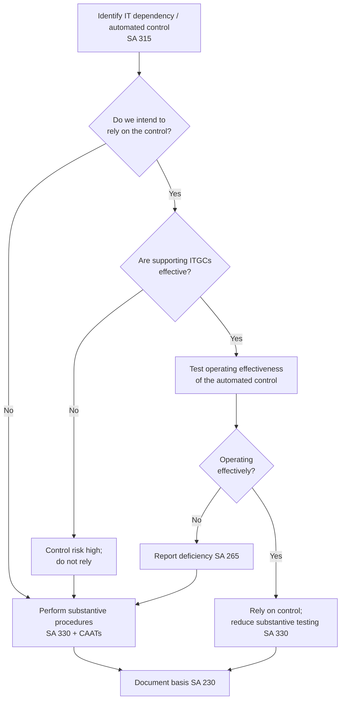

# Q&A — Audit in an Automated Environment

> CA Intermediate — Auditing & Ethics. Standards cited are Indian SAs issued by ICAI and provisions of the Companies Act, 2013. No standard has been invented; where a rule is auditor judgement, it is flagged as such.

---

## Section A — Concept-Check (short questions + answers)

**A1. What is meant by an "automated environment"?**
An automated environment is one where the entity's business processes and accounting are carried out using IT systems (ERP, accounting software, databases, interfaces) with little manual intervention. Transactions are initiated, authorised, recorded, processed and reported electronically. Audit relevance: the auditor cannot ignore how IT affects the flow of transactions and the related risks — this is required under **SA 315 (Revised)**, which mandates understanding the entity's information system, including the IT environment.

**A2. Name the key considerations an auditor must have in an automated environment.**
(i) Information systems and business processes; (ii) applications in use; (iii) IT dependencies (automated controls, reports, calculations, interfaces); (iv) IT General Controls (ITGCs); (v) IT risks arising from use of IT; (vi) cyber security/access risks. These flow from **SA 315 (Revised)** para on understanding the information system and controls.

**A3. What is an IT dependency? Give examples.**
An IT dependency is any aspect of the audit that relies on the functioning of the IT system. Four types: (a) **automated controls** (e.g., three-way match in an ERP), (b) **system-generated reports** (aged debtors report used in provisioning), (c) **calculations/interfaces** (auto-computed depreciation, interest), (d) **system configurations**. Identifying dependencies drives the extent of IT audit work under **SA 315** and **SA 330**.

**A4. Distinguish ITGCs from application controls.**
- **IT General Controls (ITGCs):** policies and procedures relating to many applications, supporting the effective functioning of application controls. Five domains — (1) access security/logical access, (2) program change management, (3) program development/SDLC, (4) IT operations (backup, job scheduling), (5) data centre/network. ITGCs are *pervasive/indirect*.
- **Application controls:** controls embedded within a specific application relating to individual transactions — e.g., validation checks, input checks, edit checks, three-way match, sequence checks. They are *direct* controls over completeness/accuracy/validity.
Key link: application controls can be relied upon **only if** the supporting ITGCs are effective. Weak ITGCs undermine otherwise-good application controls.

**A5. Why can weak ITGCs make automated application controls unreliable?**
Because ITGCs ensure that programs run as designed and are not changed without authorisation. If change management or access controls are weak, a properly designed automated control could have been altered, bypassed, or overridden during the period, so the auditor cannot assume it operated consistently. Hence when ITGCs are ineffective, the auditor treats automated controls as not operating effectively and moves to substantive testing (**SA 330**).

**A6. Define "auditing around the computer" and "auditing through the computer".**
- **Around the computer (black-box):** the auditor ignores processing and reconciles inputs to outputs manually, assuming correct processing. Suitable only for simple, low-volume systems with visible audit trail.
- **Through the computer (white-box):** the auditor tests the actual processing logic and automated controls inside the system, using CAATs, test data, etc. Necessary for complex, high-volume, low-paper-trail systems.

**A7. What are CAATs?**
Computer Assisted Audit Techniques — tools and techniques to apply audit procedures using the computer, e.g., test data, integrated test facility, parallel simulation, and generalised audit software (GAS) such as IDEA/ACL. They allow examining 100% of a population, recalculating, identifying exceptions and duplicates. Recognised under **SA 500** as a means of obtaining audit evidence.

**A8. What is the difference between CAATs and data analytics (ADA)?**
CAATs are traditional, targeted computer techniques (test a control, recalculate a field). **Audit Data Analytics (ADA)** is broader — analysing large/whole data sets to discover patterns, anomalies, correlations and trends to inform risk assessment and substantive testing. Both serve the objective of obtaining **sufficient appropriate audit evidence (SA 500)**.

**A9. State the audit risk model and how IT affects it.**
Audit Risk = Risk of Material Misstatement (Inherent Risk × Control Risk) × Detection Risk. IT can *increase* inherent risk (complex calculations, interfaces) and can *reduce or increase* control risk depending on ITGC strength. The model is applied via **SA 315** (assess RMM) and **SA 330** (respond so as to reduce detection risk to acceptable level).

**A10. How does IT relate to fraud risk under SA 240?**
IT creates fraud opportunities — unauthorised access, privileged/generic user IDs, ability to override automated controls, and manipulation of data directly at the database level bypassing the application. **SA 240** requires the auditor to consider risk of management override of controls, which in an automated environment includes back-end data changes; the auditor tests journal entries (often via CAATs) as a mandatory response.

---

## Section B — Applied Scenario Questions (situation → response with reasoning)

**B1. Situation:** A manufacturing company uses SAP for the entire procure-to-pay cycle. Purchase invoices are auto-matched to POs and GRNs (three-way match); mismatches are blocked. Management asks you to rely on this control instead of vouching all invoices.
**Required:** How should the auditor respond?
**Answer:** The three-way match is an **automated application control**. Because it is automated, if it is operating effectively it operates consistently, so the auditor may test it once/limited times rather than a large sample (benefit of automation, per **SA 330**). BUT reliance is permitted only after: (i) identifying it as an IT dependency and understanding its configuration (**SA 315**); (ii) testing the supporting **ITGCs** — particularly access security (who can change tolerance limits) and change management (whether the matching logic was altered during the year). If ITGCs are effective, test the automated control's operation (e.g., one test transaction / configuration review) and rely, reducing substantive vouching. If ITGCs are weak, do **not** rely — revert to substantive procedures. Document the basis under **SA 230**.

**B2. Situation:** During ITGC testing you find that 15 users, including two junior accounts staff, have "super-user"/administrator access to the finance module. There is no periodic access review.
**Required:** Assess the impact on the audit.
**Answer:** This is a deficiency in **logical access controls (ITGCs)**. Excessive/privileged access means automated controls could be overridden and back-end data changed, so **control risk rises** and automated application controls **cannot be relied upon**. Consequences: (a) evaluate whether it is a *significant deficiency* to be communicated to those charged with governance under **SA 265**; (b) increase **substantive testing** (SA 330) and extend journal-entry testing under **SA 240** for management override; (c) consider heightened fraud risk. The auditor moves toward "through the computer" substantive analytics on the full population rather than relying on controls.

**B3. Situation:** A bank's core system auto-calculates interest on 4 lakh loan accounts daily. There is virtually no paper trail. The audit team proposes reconciling total interest income to a summary report ("around the computer").
**Required:** Comment on the appropriateness and suggest a better approach.
**Answer:** "Auditing around the computer" is **inappropriate** here: high volume, complex automated calculation, and negligible audit trail mean input-output reconciliation cannot detect processing errors affecting sub-populations. The auditor should audit **through the computer** using **CAATs / data analytics**: independently **re-perform** the interest calculation on the entire population using GAS (IDEA/ACL) with the loan master data and rate logic, then investigate exceptions. This obtains sufficient appropriate evidence over the full population (**SA 500**) and tests the automated calculation itself. Supporting ITGCs over the rate tables and change management must also be assessed (**SA 315**).

---

## Section C — Past-Paper-Style Descriptive Questions (model answers)

**C1. "In an automated environment, the auditor's understanding of IT General Controls is fundamental to relying on automated application controls." Explain, describing the categories of ITGCs.** *(6 marks)*

**Model Answer:**
Under **SA 315 (Revised)**, the auditor must understand the entity's IT environment and controls. Automated application controls operate consistently only if the programs and data are protected from unauthorised change — this assurance is provided by **IT General Controls (ITGCs)**. Hence ITGCs are a *precondition* to relying on application controls: if ITGCs are effective, the auditor may test an automated control on a limited basis and rely on it (**SA 330**); if ITGCs are deficient, the automated control is presumed unreliable and substantive procedures are required.

Categories of ITGCs:
1. **Access Security (logical access):** user provisioning, passwords, segregation of duties, privileged-access restriction, periodic access reviews.
2. **Program Change Management:** changes to applications are requested, tested, approved and moved to production in a controlled manner.
3. **Program Development (SDLC):** new systems/major changes are developed, tested and implemented with proper approvals.
4. **IT Operations:** batch job scheduling, backups, incident and problem management, data recovery.
5. **Data Centre / Network / Physical & Environmental controls** supporting availability.

Effective ITGCs across these domains give the auditor confidence that automated controls functioned throughout the period. Deficiencies are evaluated under **SA 265** for communication to those charged with governance.

**C2. Describe how CAATs and Data Analytics assist the auditor in an automated environment, and state the matters to consider before using them.** *(5 marks)*

**Model Answer:**
CAATs (test data, integrated test facility, parallel simulation, generalised audit software) and Audit Data Analytics enable the auditor to obtain **sufficient appropriate audit evidence (SA 500)** more effectively where data is voluminous and electronic. Uses:
- Testing the **entire population** rather than a sample (e.g., all journal entries, all vendor payments).
- **Re-performance** of automated calculations (interest, depreciation).
- Identifying **exceptions, duplicates, gaps in sequences, and anomalies** (duplicate vendor bank accounts, weekend postings).
- Analysing **trends and correlations** to sharpen risk assessment under **SA 315**.
- **Journal-entry testing** for management override under **SA 240**.

Matters to consider before use: (i) availability, integrity and completeness of the data extracted; (ii) compatibility and access to the client's systems; (iii) IT knowledge/skill of the audit team (using an **auditor's expert per SA 620** if needed); (iv) cost-benefit; (v) confidentiality and controlled use of client data; (vi) documenting the tools, parameters and results under **SA 230**. Reliability of CAAT output depends on the reliability of source data, so ITGCs over that data remain relevant.

**C3. Explain the two approaches — "auditing around the computer" and "auditing through the computer" — and state when each is appropriate.** *(4 marks)*

**Model Answer:**
**Auditing around the computer (black-box):** the auditor examines inputs and the corresponding outputs and reconciles them, treating the computer processing as a "black box" assumed to be correct. Appropriate only where systems are **simple, low volume, with a clear visible audit trail** and where original documents are available. Limitation: it provides no assurance over the processing logic itself.

**Auditing through the computer (white-box):** the auditor examines and tests the **actual processing and automated controls** within the system using CAATs, test data and re-performance. Appropriate — indeed necessary — where systems are **complex, high volume, integrated, and have limited paper trail**, so that undetected processing errors could be material. In modern ERP/automated environments, auditing through the computer is generally required to obtain sufficient appropriate evidence (**SA 500**).

---

## Decision Flow — Relying on an Automated Control

---

## Section D — MCQs / Case Scenarios (correct option + one-line reasoning)

**D1.** Reliance on an automated application control is appropriate only when —
A. The control is documented
B. Management confirms it works
C. The supporting ITGCs are operating effectively
D. It is tested every day
**Answer: C.** Automated controls run consistently only if ITGCs (access & change management) protect the program — the precondition for reliance (SA 315/330).

**D2.** A three-way match embedded in an ERP is an example of —
A. An IT General Control
B. An automated application control
C. A manual control
D. A monitoring control
**Answer: B.** It is a control within a specific application over individual transactions.

**D3.** Which is NOT a category of ITGCs?
A. Access security
B. Change management
C. Three-way match
D. IT operations (backup)
**Answer: C.** Three-way match is an application control, not an ITGC.

**D4.** The standard primarily requiring the auditor to understand the entity's IT environment as part of risk assessment is —
A. SA 200
B. SA 315 (Revised)
C. SA 700
D. SA 610
**Answer: B.** SA 315 (Revised) covers identifying and assessing RMM through understanding the entity, including its information system and IT.

**D5.** Testing all journal entries for management override in an automated environment is a response required under —
A. SA 230
B. SA 505
C. SA 240
D. SA 570
**Answer: C.** SA 240 mandates journal-entry testing to address management override risk; CAATs enable full-population testing.

**D6.** "Auditing around the computer" is LEAST appropriate for —
A. A small firm with manual-style software
B. A high-volume bank interest computation with no paper trail
C. A single-user cash book
D. Low-volume payroll of 5 employees
**Answer: B.** High volume, complex processing and no audit trail demand auditing through the computer.

**D7. Case Scenario:** XYZ Ltd migrated to a new ERP mid-year. The auditor finds that program changes during migration were moved to production without documented testing or approval, and several developers retained access to the live finance module post go-live.
Q: What is the auditor's most appropriate conclusion?
A. ITGCs (change management and access) are deficient; automated controls cannot be relied upon and substantive testing must be extended
B. Rely on automated controls since the ERP is new and modern
C. Issue an adverse opinion immediately
D. Ignore, as migration is a one-time event
**Answer: A.** Weak change-management and access ITGCs undermine automated controls; the response is to increase substantive procedures (SA 330) and communicate the deficiency (SA 265) — not an automatic modified opinion.

**D8.** Generalised Audit Software (IDEA/ACL) is best described as —
A. An accounting package
B. A CAAT used to interrogate and analyse client data
C. An ITGC
D. A firewall
**Answer: B.** GAS is a CAAT enabling recalculation, exception and duplicate identification over full data sets (SA 500).

**D9.** In the audit risk model, effective ITGCs and application controls primarily affect —
A. Inherent risk only
B. Control risk
C. Detection risk
D. Sampling risk
**Answer: B.** Strong controls reduce assessed control risk (a component of the risk of material misstatement).

**D10.** A system-generated aged receivables report used to compute the bad-debt provision is an example of —
A. An automated control
B. An IT dependency (system-generated report) whose completeness and accuracy must be tested
C. A manual control
D. An ITGC
**Answer: B.** Reports relied on for audit evidence are IT dependencies; the auditor must test the report's completeness and accuracy (SA 500) before using it.

---

## Quick Recall Table

| Concept | Standard | One-line hook |
|---|---|---|
| Understand IT environment & information system | SA 315 (Revised) | Basis of risk assessment |
| Responses to assessed risks (control vs substantive) | SA 330 | Rely on control only if ITGCs effective |
| Fraud — management override, journal testing | SA 240 | Back-end data change risk; test all JEs |
| Sufficient appropriate evidence via CAATs/analytics | SA 500 | Test 100% of population |
| Communicate control deficiencies | SA 265 | Significant deficiencies to TCWG |
| Using an auditor's expert (IT) | SA 620 | When team lacks IT skills |
| Documentation | SA 230 | Record tools, parameters, conclusions |

**One-line first principle:** In an automated environment, *controls are only as trustworthy as the ITGCs protecting them* — so the auditor first understands IT (SA 315), tests ITGCs, and only then decides between relying on automated controls or auditing through the computer with CAATs to gather substantive evidence (SA 330/500).
