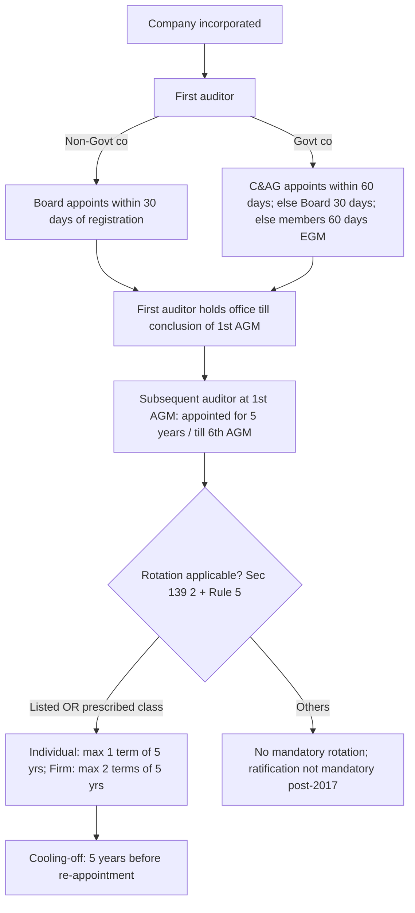

# Q&A — Company Audit (Companies Act Provisions)

CA Intermediate — Auditing & Ethics. Statutory provisions covered: Companies Act 2013, Sections 139–148 and Section 143 (branch audit under 143(8)); the Companies (Audit and Auditors) Rules, 2014; NFRA Rules 2018. Cross-references: SA 210 (terms of engagement), SA 220/SQC 1 (quality & independence), SA 299 (joint audit), SA 600 (using another auditor's work — branch), CARO 2020, ICAI Code of Ethics.

---

## Appointment & Rotation Decision Tree

---

## Section A — Concept-Check Questions (with answers)

**A1. Who appoints the first auditor of a company (other than a Government company) and within what time?**
Under **Section 139(6)**, the Board of Directors shall appoint the first auditor within **30 days** from the date of registration of the company. If the Board fails, it shall inform the members, who shall appoint the first auditor within **90 days** at an extraordinary general meeting. The first auditor holds office till the conclusion of the first AGM.

**A2. How is the first auditor of a Government company appointed?**
Under **Section 139(7)**, the Comptroller and Auditor-General of India (C&AG) appoints the first auditor within **60 days** of registration. If C&AG fails, the Board appoints within the next **30 days**; on Board's failure, members appoint within **60 days** at an EGM. (A "Government company" and companies owned/controlled by government are covered.)

**A3. For how long is a subsequent auditor appointed and what is the ratification position?**
Under **Section 139(1)**, every company at its first AGM appoints an auditor to hold office from that AGM till the conclusion of its **sixth AGM** (i.e., 5 years), subject to the auditor's continuing eligibility. The requirement of annual **ratification** by members was **omitted** by the Companies (Amendment) Act, 2017; ratification is no longer mandatory.

**A4. To whom must the auditor consent/certificate be given before appointment, and what does it certify?**
Per **Section 139(1) read with Rule 4**, the company must obtain the auditor's **written consent** and a **certificate** stating that the appointment, if made, will be in accordance with the conditions prescribed, that the individual/firm is **eligible** and not disqualified under **Sections 141**, 139 and 144, that the proposed appointment is within the term/rotation limits, and that no pending proceedings against the firm are undisclosed.

**A5. State the rotation rule under Section 139(2).**
For **listed companies and prescribed classes** (Rule 5 — unlisted public with paid-up capital ≥ ₹10 crore; private with paid-up ≥ ₹50 crore; or companies with public borrowings/deposits ≥ ₹50 crore), an **individual auditor** cannot serve more than **one term of 5 consecutive years**, and an **audit firm** cannot serve more than **two terms of 5 consecutive years**. A **cooling-off period of 5 years** applies before re-appointment.

**A6. What is the filing requirement after appointment of an auditor?**
Under **Section 139(1) read with Rule 4**, the company shall file a notice of appointment with the Registrar in **Form ADT-1** within **15 days** of the meeting in which the auditor is appointed.

**A7. List any five disqualifications of an auditor under Section 141(3).**
(a) A body corporate other than an LLP; (b) an officer or employee of the company; (c) a partner/employee of an officer or employee; (d) a person (or his relative/partner) holding **any security or interest** in the company (relative may hold face value up to **₹1,00,000**), or indebted for more than **₹5,00,000**, or having given guarantee/security for third-party indebtedness exceeding **₹1,00,000**; (e) a person whose relative is a director or KMP; (f) a person in full-time employment elsewhere or a person/partner holding audit of **more than 20 companies** (the ceiling under 141(3)(g)).

**A8. What is the ceiling on number of audits and how is it computed (Sec 141(3)(g))?**
A person cannot be auditor of **more than twenty companies** (per partner in case of a firm). Excluded from the count: one person companies, dormant companies, small companies, and private companies having paid-up share capital **less than ₹100 crore** (per the proviso/Rule). The limit of 20 is computed per partner who is not in full-time employment elsewhere.

**A9. If a disqualification under Section 141 arises after appointment, what is the consequence?**
Under **Section 141(4)**, if any of the disqualifications in Section 141(3) is incurred **after appointment**, the auditor shall be deemed to have **vacated office**, and such vacation is treated as a **casual vacancy** (to be filled under Section 139(8)).

**A10. How is a casual vacancy filled?**
Under **Section 139(8)**: (i) in a **non-Government** company, by the **Board within 30 days**; if the vacancy arose due to **resignation**, the appointment must also be **approved by members at a general meeting** within 3 months of the Board's recommendation; (ii) in a **Government** company, by the **C&AG within 30 days**, failing which the Board fills it within the next 30 days. The auditor so appointed holds office till conclusion of the next AGM.

**A11. State the procedure and timeline for an auditor's resignation.**
Under **Section 140(2) read with Rule 8**, a resigning auditor must file a statement in **Form ADT-3** with the company and the Registrar (and with C&AG in a Government company) within **30 days** of resignation, indicating reasons and relevant facts. Non-compliance attracts penalty under **Section 140(3)**.

**A12. How can an auditor be removed before the expiry of term?**
Under **Section 140(1)**, removal before expiry requires a **special resolution** of the company **and prior approval of the Central Government** (application in **Form ADT-2** within 30 days of Board resolution; special resolution within 60 days of CG approval). The auditor must be given a **reasonable opportunity of being heard**.

**A13. What is the auditor's right regarding access to records and remuneration fixation?**
Under **Section 143(1)**, the auditor has a **right of access at all times to the books, accounts and vouchers** of the company (whether kept at the registered office or elsewhere) and is entitled to require information and explanations. Under **Section 142**, remuneration is **fixed by the members** (or in a manner determined at the general meeting); the Board fixes remuneration of the first auditor.

**A14. What are the auditor's duties on fraud reporting under Section 143(12)?**
If an auditor, in the course of performance of duties, has **reason to believe** that an offence of **fraud** involving an amount of **₹1 crore or more** is being/has been committed against the company by officers or employees, the auditor shall report to the **Central Government** (via the Board/Audit Committee within specified days, then **Form ADT-4** to CG within 15 days). Frauds **below ₹1 crore** are reported to the **Board/Audit Committee** and disclosed in the Board's Report (Rule 13).

**A15. What non-audit services are prohibited under Section 144?**
An auditor shall not render, directly or indirectly, to the company/holding/subsidiary: accounting and book-keeping; internal audit; design and implementation of financial information systems; actuarial services; investment advisory and investment banking; rendering of outsourced financial services; management services; and any other prescribed service. This safeguards **independence**.

**A16. Which section governs the constitution and functions of NFRA, and which section deals with the Auditing Standards?**
**Section 132** constitutes the **National Financial Reporting Authority (NFRA)** to monitor and enforce compliance with accounting and auditing standards and to oversee auditors of prescribed (largely listed/large public interest) entities. **Section 143(9)/(10)** requires the auditor to comply with the **Standards on Auditing (SAs)**; until CG prescribes them, ICAI's standards deem to be the standards.

**A17. What is the branch audit provision under Section 143(8)?**
Where a company has a **branch office**, its accounts shall be audited either by the **company's auditor** or by **another person qualified** to be appointed as auditor (a "branch auditor") appointed under Section 139. For a **foreign branch**, audit may be done by the company's auditor or a person **duly qualified under the laws of that country**. The **branch auditor prepares a report** and sends it to the company's (principal) auditor, who deals with it in the main audit report as considered necessary.

**A18. How does the principal auditor use the branch auditor's work?**
The principal auditor uses the branch report per **SA 600 (Using the Work of Another Auditor)** — the principal auditor remains responsible for the opinion on the company as a whole, considers the materiality of the branch, may visit the branch, and reviews the branch auditor's work but does **not re-audit** the branch. The branch auditor is responsible for compliance with SAs at the branch.

**A19. What is a joint audit and which SA governs it?**
A **joint audit** is where two or more auditors are jointly appointed to audit the same entity. **SA 299 (Revised) — Responsibility of Joint Auditors** governs the **division of work** by mutual discussion (documented), the **coordination**, and liability. Each joint auditor is responsible for the area **allocated to and audited by them**; all are **jointly and severally** responsible for matters decided in common, for undivided work, for compliance with statutory requirements on presentation, and for ensuring the audit is conducted per SAs.

**A20. What are the "additional" reporting requirements over and above SA 700 in a company audit?**
The auditor reports under **Section 143(3)** (e.g., whether accounts give true and fair view; whether proper books kept; branch reports received; internal financial controls adequacy under 143(3)(i); observations having adverse effect; whether the company has adequate/complied with laws) and separately reports under **CARO 2020** (the Companies (Auditor's Report) Order, 2020) for covered companies. Section **143(3)(f)/(h)** deal with qualifications/observations.

---

## Section B — Applied Scenario Questions (situation → audit response)

**B1. Situation.** XYZ Ltd's Board did not appoint the first auditor within 30 days of incorporation. Three months later, the Board purports to appoint one. Is this valid?
**Response.** Invalid. Under **Section 139(6)**, on the Board's failure within 30 days, the **power shifts to the members**, who must appoint the first auditor within 90 days at an EGM. The Board loses its authority once the 30-day window lapses; a belated Board appointment has no legal effect. The correct action is for the members to appoint at an EGM. The company should convene the EGM without further delay.

**B2. Situation.** An audit firm has completed two terms of 5 years each as auditor of a listed company. The company wishes to re-appoint the same firm because the audit was satisfactory. Advise.
**Response.** Not permissible. Under **Section 139(2)**, an audit **firm** in a listed/prescribed company cannot be appointed for more than **two consecutive terms of 5 years**. A **cooling-off period of 5 years** must elapse before re-appointment of the same firm. Further, an outgoing firm cannot circumvent this by re-appointing a firm having **common partners** (the associated/network firm rule). The company must appoint a different firm.

**B3. Situation.** During the audit of PQR Ltd (a non-Government company), the auditor resigns citing disagreement with management. The Board appoints a replacement within 30 days but does not place it before the members. Comment.
**Response.** The Board's appointment within 30 days is correct under **Section 139(8)** for a casual vacancy. However, because the vacancy arose from **resignation**, the Board's appointment is only valid if **approved by the members at a general meeting within 3 months** of the Board's recommendation. Failing member approval, the appointment is incomplete. Separately, the resigning auditor must have filed **Form ADT-3** within 30 days under **Section 140(2)**.

**B4. Situation.** The auditor of ABC Ltd holds equity shares of face value ₹80,000 in a subsidiary of ABC Ltd. Management argues it is a subsidiary, not the company being audited. Is the auditor disqualified?
**Response.** Disqualified. **Section 141(3)(d)(i)** extends the security/interest bar to the company, its **subsidiary, holding, associate company or a subsidiary of the holding company**. Even a security in the subsidiary triggers disqualification (the relative-holding relaxation of ₹1,00,000 applies only to a **relative** holding, not the auditor himself). The auditor must **dispose of the interest or decline**; if incurred post-appointment, office is deemed vacated under **Section 141(4)**.

**B5. Situation.** The company auditor, while auditing, forms a reasonable belief that the CFO has committed a fraud of ₹3 crore against the company. Management asks the auditor to keep it internal and adjust the accounts. What must the auditor do?
**Response.** Since the amount is **₹1 crore or more**, the auditor **must report to the Central Government** under **Section 143(12) read with Rule 13**: first report to the **Board/Audit Committee** seeking reply within 45 days, then forward the report with the reply (or note absence of reply) to the CG in **Form ADT-4** within **15 days**. The duty is statutory and cannot be waived by management. The auditor also considers the impact on the audit opinion (SA 240) and cannot merely "adjust" the accounts. Failure to report attracts penalty under **Section 143(15)**.

---

## Section C — Descriptive (Past-Paper Style) Questions with Model Answers

**C1. "The provisions of the Companies Act, 2013 relating to appointment and rotation of auditors are designed to protect auditor independence." Explain the rotation and cooling-off provisions under Section 139(2). (5 marks)**

**Model Answer.** Section 139(2) mandates rotation for **listed companies and companies of a prescribed class** (Rule 5 of the Companies (Audit and Auditors) Rules, 2014 — unlisted public companies with paid-up capital ≥ ₹10 crore, private companies with paid-up capital ≥ ₹50 crore, and companies with public borrowings from banks/financial institutions/public deposits ≥ ₹50 crore).
For such companies: an **individual** auditor may be appointed for **not more than one term of five consecutive years**; an **audit firm** for **not more than two terms of five consecutive years**.
A **cooling-off period of five years** applies — an individual/firm that has completed its term(s) is **not eligible for re-appointment** in the same company for 5 years. To prevent circumvention, an audit firm having **common partner(s)** with an outgoing firm is also barred during the cooling-off period. Companies are given a transition period to comply. Members may, by resolution, provide for rotation of the **audit partner and team** at more frequent intervals. These provisions engineer independence by **structurally limiting** long, capture-prone auditor–client relationships (public-interest rationale under Section 132/NFRA oversight).

**C2. Discuss the manner of appointment and reporting responsibility of a Branch Auditor under Section 143(8) of the Companies Act, 2013, and the interaction with SA 600. (5 marks)**

**Model Answer.** Under **Section 143(8)**, where a company has a **branch office**, the accounts of that branch shall be audited by (a) the **company's (principal) auditor**, or (b) **another person qualified for appointment as auditor** of the company under Section 139 (the "branch auditor"), appointed under Section 139. For a **branch outside India**, the accounts may be audited either by the company's auditor or by an **accountant duly qualified under the laws of the foreign country**.
The **branch auditor** conducts the audit in accordance with the SAs, prepares a **report on the branch accounts**, and forwards it to the **principal auditor**, who deals with it in his report **in such manner as he considers necessary**. Remuneration of the branch auditor is fixed by the company in general meeting or as delegated.
The interaction is governed by **SA 600 (Using the Work of Another Auditor)**: the principal auditor remains **responsible for the opinion on the financial statements as a whole**, evaluates the **materiality** of the branch, may issue instructions to and review the work of the branch auditor, and considers whether the branch auditor's work is adequate — but does **not re-perform** the branch audit. The branch auditor is responsible for compliance at the branch level. Together this preserves a **single, accountable opinion** while allowing distributed audit work.

**C3. Explain the disqualifications of an auditor relating to indebtedness, security/interest, and business relationship under Section 141(3), and the effect of Section 141(4). (6 marks)**

**Model Answer.** Section 141(3) lists persons **not eligible** for appointment as auditor. Key financial-independence disqualifications:
- **Security or interest [141(3)(d)(i)]** — a person, or his partner or relative, holding **any security or interest** in the company or its holding/subsidiary/associate/co-subsidiary. Relaxation: a **relative** may hold securities of face value **not exceeding ₹1,00,000**.
- **Indebtedness [141(3)(d)(ii)]** — a person/partner/relative **indebted** to the company (or its holding/subsidiary/associate) for an amount **exceeding ₹5,00,000**.
- **Guarantee/Security [141(3)(d)(iii)]** — having given a **guarantee or provided security** in connection with the indebtedness of a third person to the company for an amount **exceeding ₹1,00,000**.
- **Business relationship [141(3)(e)]** — a person or firm having, directly or indirectly, a **business relationship** with the company (as prescribed, excluding professional services permitted).
- Also: officer/employee of the company [141(3)(b)]; partner/employee of an officer/employee [141(3)(c)]; a person whose relative is a **director or KMP** [141(3)(f)]; person holding **more than 20 company audits** [141(3)(g)]; person convicted of fraud in the last 10 years [141(3)(h)]; a body corporate other than LLP [141(3)(a)].
**Effect of Section 141(4):** if any disqualification is **incurred after appointment**, the auditor is deemed to have **vacated office**, treated as a casual vacancy under Section 139(8). Thus independence is monitored on a **continuing** basis, not merely at appointment.

**C4. Describe the auditor's duty to report fraud under Section 143(12) and the thresholds and forms involved. (5 marks)**

**Model Answer.** Under **Section 143(12)**, if in the course of performing his duties the auditor has **reason to believe** that an offence of **fraud** involving the company by its **officers or employees** is being or has been committed, he must report it.
**Threshold and route (Rule 13):**
- **Fraud ≥ ₹1 crore:** report to the **Board/Audit Committee** within 2 days of knowledge seeking their reply within **45 days**; then forward the report, the reply, and his comments to the **Central Government** in **Form ADT-4** within **15 days** of receipt of the reply (or, if no reply, within 15 days of expiry of 45 days).
- **Fraud < ₹1 crore:** report to the **Board or Audit Committee** (not CG), specifying nature, amount, and parties; such frauds are **disclosed in the Board's Report**.
Reporting made in **good faith** is not a breach of confidentiality (Section 143(13)). Applies also to cost auditors, secretarial auditors, and branch auditors. **Non-compliance** attracts a **penalty** under Section 143(15). This duty complements — but does not replace — the auditor's responsibilities on fraud under **SA 240**.

**C5. Write short notes on: (a) filing forms in a company audit; (b) removal of auditor under Section 140(1). (5 marks)**

**Model Answer.**
**(a) Forms in a company audit:**
| Form | Purpose | Timeline |
|------|---------|----------|
| **ADT-1** | Notice to Registrar of auditor appointment (Sec 139) | Within **15 days** of appointment |
| **ADT-2** | Application to Central Government for approval to remove auditor (Sec 140(1)) | Within **30 days** of Board resolution |
| **ADT-3** | Notice of **resignation** by auditor (Sec 140(2)) | Within **30 days** of resignation |
| **ADT-4** | Report of **fraud ≥ ₹1 crore** to Central Government (Sec 143(12)) | Within **15 days** of receiving Board/AC reply |

**(b) Removal under Section 140(1):** An auditor may be removed **before expiry of term** only by a **special resolution** and after obtaining **prior approval of the Central Government**. Procedure: pass a **Board resolution**, file **Form ADT-2** with the CG within **30 days**; on CG approval, hold a general meeting and pass the **special resolution within 60 days** of receiving approval. The auditor must be given a **reasonable opportunity of being heard**. This layered safeguard prevents management from removing an inconvenient (independent) auditor at will.

---

## Section D — MCQs / Case Scenarios (correct option + reasoning)

**D1.** The first auditor of a non-Government company is appointed by the Board within:
(a) 15 days (b) **30 days** (c) 60 days (d) 90 days
**Answer: (b).** Section 139(6) — Board appoints within 30 days of registration; else members within 90 days.

**D2.** An audit firm in a listed company can hold office for a maximum of:
(a) one term of 5 years (b) **two terms of 5 years** (c) three terms of 3 years (d) unlimited
**Answer: (b).** Section 139(2) — firm: two consecutive terms of 5 years, then 5-year cooling-off.

**D3.** Form ADT-3 is filed for:
(a) appointment (b) **resignation** (c) removal (d) fraud reporting
**Answer: (b).** Section 140(2) read with Rule 8 — resignation statement in ADT-3 within 30 days.

**D4.** Fraud reported to the Central Government in Form ADT-4 relates to an amount of:
(a) any amount (b) ₹50 lakh or more (c) **₹1 crore or more** (d) ₹5 crore or more
**Answer: (c).** Section 143(12) read with Rule 13 — CG reporting threshold is ₹1 crore.

**D5.** The maximum face value of securities a **relative** of the auditor may hold in the company without triggering disqualification is:
(a) ₹50,000 (b) **₹1,00,000** (c) ₹5,00,000 (d) Nil
**Answer: (b).** Section 141(3)(d)(i) proviso — relative may hold securities up to ₹1,00,000 face value.

**D6.** Removal of an auditor before expiry of term requires:
(a) ordinary resolution only (b) Board resolution only (c) **special resolution + prior Central Government approval** (d) NCLT order
**Answer: (c).** Section 140(1) — special resolution plus prior CG approval (ADT-2), with opportunity of being heard.

**D7. Case Scenario.** LMN Ltd (listed) has a domestic branch contributing 40% of turnover. The company's principal auditor did not visit the branch but relied on the branch auditor's clean report and issued a clean opinion on the whole company. The branch report was later found to conceal a material misstatement. Who is responsible for the company-level opinion?
(a) Only the branch auditor (b) **The principal auditor for the company-level opinion; branch auditor for the branch report** (c) Neither (d) The Audit Committee
**Answer: (b).** Under Section 143(8) and SA 600, the principal auditor remains responsible for the **opinion on the FS as a whole** and must evaluate the branch's **materiality** and the adequacy of the branch auditor's work; a 40% branch is significant, so mere reliance without review may be inadequate. The branch auditor is responsible for the **branch report**.

**D8. Case Scenario.** A Chartered Accountant is already the auditor of 19 companies (excluding small/OPC/dormant and private companies below the paid-up threshold). She is offered two more public company audits. Can she accept both?
(a) Yes, both (b) **No — she can accept only one; the ceiling is 20** (c) Yes, ceiling does not apply (d) No — she cannot accept any
**Answer: (b).** Section 141(3)(g) — a person cannot be auditor of more than **20 companies** (per partner). With 19 counted audits she has room for only one more; the second would breach the ceiling.

---

## Quick-Revision Sheet

- **First auditor:** Non-Govt — Board 30 days (else members 90 days EGM); Govt — C&AG 60 days [Sec 139(6)/(7)].
- **Subsequent auditor:** 1st AGM, 5-year term till 6th AGM; **ratification abolished** [Sec 139(1)].
- **Rotation (listed/prescribed):** individual 1×5 yrs; firm 2×5 yrs; **cooling-off 5 yrs** [Sec 139(2), Rule 5].
- **Casual vacancy:** Board 30 days (resignation → member approval in 3 months); Govt → C&AG 30 days [Sec 139(8)].
- **Removal before term:** special resolution + **prior CG approval**, ADT-2, opportunity to be heard [Sec 140(1)].
- **Resignation:** ADT-3 within 30 days [Sec 140(2)].
- **Remuneration:** fixed by members; first auditor by Board [Sec 142].
- **Disqualifications:** body corporate (not LLP), officer/employee, security/interest, indebted > ₹5L, guarantee > ₹1L, relative director/KMP, **>20 audits**, convicted of fraud (10 yrs) [Sec 141(3)]; post-appointment DQ → deemed vacation [Sec 141(4)].
- **Powers/duties:** access at all times; report u/s 143(3); comply with **SAs** [Sec 143(1),(3),(9)/(10)].
- **Fraud reporting:** ≥ ₹1 crore → CG via **ADT-4** (Board/AC reply 45 days, ADT-4 in 15 days); < ₹1 crore → Board/AC + Board's Report [Sec 143(12), Rule 13].
- **Prohibited services:** accounting, internal audit, actuarial, investment advisory/banking, management services, etc. [Sec 144].
- **Branch audit:** company's auditor or qualified branch auditor; foreign branch — locally qualified; report to principal auditor; **SA 600** [Sec 143(8)].
- **Joint audit:** SA 299 — divided work individual responsibility; common matters jointly & severally.
- **Forms:** ADT-1 (appointment, 15 days) · ADT-2 (removal approval) · ADT-3 (resignation, 30 days) · ADT-4 (fraud ≥ ₹1 cr).
- **Connections:** NFRA [Sec 132] oversight of large/listed audits; CARO 2020 additional reporting; ICAI Code of Ethics on independence; IFC reporting [Sec 143(3)(i)].
- **Examiner traps:** ratification no longer needed; belated Board appointment invalid once window lapses; subsidiary/holding interest also disqualifies; cooling-off catches common-partner firms; foreign-branch auditor need not be an Indian CA; fraud < ₹1 cr does NOT go to CG.
