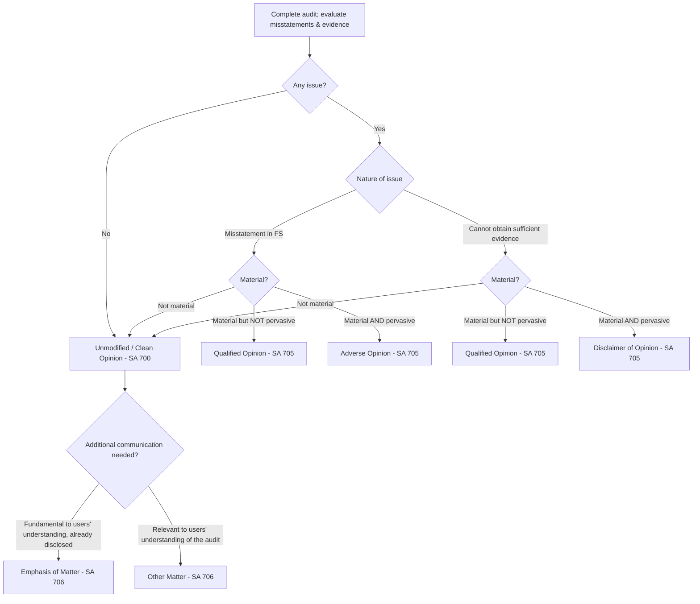

# Q&A — Audit Report & Opinions

CA Intermediate — Auditing & Ethics. Standards on Auditing covered: SA 700 (Revised), SA 701, SA 705 (Revised), SA 706 (Revised); Sections 143, 134, 129 of the Companies Act 2013; CARO 2020; Section 143(3)(i) read with Rule 10A on Internal Financial Controls.

---

## Opinion Decision Tree

---

## Section A — Concept-Check Questions (with answers)

**A1. What is the objective of the auditor under SA 700 (Revised)?**
To form an opinion on the financial statements based on evaluation of conclusions drawn from audit evidence, and to express that opinion clearly through a written report. The auditor concludes whether reasonable assurance has been obtained that the FS as a whole are free from material misstatement (SA 700, para 6).

**A2. On what two things must the auditor conclude before forming an opinion?**
(i) Whether sufficient appropriate audit evidence has been obtained (per SA 330), and (ii) whether uncorrected misstatements are material, individually or in aggregate (per SA 450). The auditor also evaluates whether the FS are prepared in accordance with the applicable financial reporting framework, including adequacy of disclosures (SA 700, paras 10–15).

**A3. Distinguish "material" from "pervasive."**
Material means the misstatement (individually or aggregated) could reasonably be expected to influence users' economic decisions. Pervasive (SA 705, para 5) describes effects that are NOT confined to specific elements/accounts, OR if confined, represent a substantial proportion of the FS, OR relate to disclosures fundamental to users' understanding. Pervasiveness decides between Qualified vs Adverse/Disclaimer.

**A4. State the three types of modified opinion and the trigger for each.**
Per SA 705: (i) **Qualified** — material but not pervasive misstatement, or inability to obtain evidence that is material but not pervasive ("except for"). (ii) **Adverse** — material AND pervasive misstatement. (iii) **Disclaimer** — inability to obtain evidence whose possible effects are material AND pervasive.

**A5. What is a Key Audit Matter under SA 701 and who must report them?**
KAMs are those matters that, in the auditor's professional judgement, were of most significance in the audit of the current period's FS; they are selected from matters communicated to those charged with governance (SA 701, para 8–9). Communicating KAM is mandatory for audits of **listed entities**' complete sets of general purpose FS, or when otherwise required by law/decided by the auditor.

**A6. Differentiate Emphasis of Matter (EOM) from Key Audit Matters (KAM).**
An EOM paragraph (SA 706) refers to a matter **already appropriately presented/disclosed** in the FS that is fundamental to users' understanding; it does not modify the opinion. KAM (SA 701) is a communication about audit significance and may include matters not necessarily the most fundamental to users but most significant to the audit. A matter giving rise to a modified opinion or material uncertainty on going concern is NOT communicated as EOM.

**A7. Emphasis of Matter vs Other Matter paragraph — the core distinction?**
EOM relates to a matter **presented or disclosed in the FS**. An Other Matter paragraph (SA 706) relates to a matter **NOT presented or disclosed in the FS** but relevant to users' understanding of the audit, the auditor's responsibilities, or the report (e.g., prior period audited by predecessor auditor).

**A8. List the elements of an unmodified audit report under SA 700 (order).**
Title; Addressee; Opinion; Basis for Opinion; (Going Concern if applicable, SA 570); Key Audit Matters (where SA 701 applies); Responsibilities of Management/TCWG for the FS; Auditor's Responsibilities for the Audit; Other Reporting Responsibilities (e.g., s.143(3), CARO); Signature; Place; Date; UDIN. The **Opinion section is placed first**, followed immediately by the Basis for Opinion.

**A9. What must the "Basis for Opinion" section state?**
That the audit was conducted per SAs; a reference to the section describing auditor's responsibilities; a statement of independence and fulfilment of ethical responsibilities under the ICAI Code of Ethics; and a statement that audit evidence obtained is sufficient and appropriate to provide a basis for the opinion (SA 700, para 28).

**A10. What is the reporting duty under Section 143(3)(i) of the Companies Act 2013?**
The auditor must report whether the company has an **adequate internal financial controls with reference to financial statements** in place and the operating effectiveness of such controls. Applies subject to exemptions notified for certain private companies. IFC reporting is a separate opinion, typically in Annexure B to the main report.

---

## Section B — Applied Scenario Questions (situation → audit response with reasoning)

**B1. Inventory overstated; effect isolated.**
*Situation:* A company values inventory at cost ignoring NRV; the overstatement is Rs. 40 lakh, material but confined only to the inventory line and profit; other areas are correct.
*Response:* This is a material misstatement that is **NOT pervasive** (confined to specific accounts). Per SA 705, the auditor expresses a **Qualified Opinion** ("except for the effects of the matter described..."). The Basis for Qualified Opinion paragraph must quantify the effect (inventory and profit overstated by Rs. 40 lakh) where practicable. Opinion section heading changes to "Qualified Opinion."

**B2. Management refuses access to a subsidiary's records.**
*Situation:* The parent's investment in and share of results from a foreign subsidiary is a substantial proportion of the group; the auditor cannot obtain any evidence about it.
*Response:* This is an **inability to obtain sufficient appropriate audit evidence** whose possible effects are **material and pervasive** (substantial proportion of FS). Per SA 705, the auditor issues a **Disclaimer of Opinion**. The report states the auditor does not express an opinion and, because of the significance, has not been able to obtain sufficient appropriate evidence. The KAM section is not required when a disclaimer is issued (SA 705).

**B3. Multiple pervasive misstatements.**
*Situation:* Fixed assets, revenue recognition and liabilities are all misstated; the FS as a whole are unreliable.
*Response:* Misstatements are both material AND pervasive → **Adverse Opinion** under SA 705. The auditor states the FS do NOT give a true and fair view. A Basis for Adverse Opinion paragraph describes the matters.

**B4. A material uncertainty on going concern, adequately disclosed.**
*Situation:* The company has net current liabilities and defaulted on loans; a material uncertainty exists but is **adequately disclosed** in the notes.
*Response:* Opinion is **unmodified**. Per SA 570 (Revised) read with SA 700, the auditor includes a **separate "Material Uncertainty Related to Going Concern"** section drawing attention to the disclosure. This is NOT an Emphasis of Matter and NOT a modification. If disclosure were inadequate → Qualified/Adverse under SA 705.

**B5. Restatement note fundamental to understanding.**
*Situation:* The company restated prior figures for a change following a court order; the note is correctly presented and material to understanding.
*Response:* Opinion unmodified. Add an **Emphasis of Matter paragraph** under SA 706 drawing attention to the note, stating the opinion is not modified in respect of this matter. Placed after Basis for Opinion, referencing the specific note.

**B6. Prior period audited by another auditor.**
*Situation:* Comparatives for the prior year were audited by the predecessor auditor.
*Response:* Opinion unmodified for current year. Include an **Other Matter paragraph** (SA 706 / SA 710) stating the prior period FS were audited by the predecessor auditor who expressed an [unmodified] opinion on [date]. This concerns the audit, not a matter disclosed in the FS.

---

## Section C — Past-Paper-Style Descriptive Questions (with model answers)

**C1. "Explain the circumstances requiring a modification and how the auditor decides between the three modified opinions." (SA 705)**
*Answer:* Under SA 705 (Revised), the auditor modifies when either (a) based on evidence, the FS as a whole are **not free from material misstatement**, or (b) the auditor is **unable to obtain sufficient appropriate audit evidence** to conclude the FS are free from material misstatement. The decision then depends on a two-factor judgement: the **nature** of the matter and the **pervasiveness** of its effects (or possible effects). If material but not pervasive → **Qualified**. If misstatement is material and pervasive → **Adverse**. If the inability to obtain evidence has possible effects that are material and pervasive → **Disclaimer**. Pervasive (para 5) means effects not confined to specific elements, or if confined represent a substantial proportion, or relate to disclosures fundamental to users' understanding. When modified, the opinion section is headed appropriately (e.g., "Qualified Opinion") and a "Basis for [Modified] Opinion" section describes the matter and quantifies effects where practicable.

**C2. "Discuss Key Audit Matters — meaning, applicability, and how they are determined and communicated." (SA 701)**
*Answer:* KAMs (SA 701) are matters that, in the auditor's professional judgement, were of most significance in the audit of the current period. Applicability is mandatory for audits of **listed entities'** complete general purpose FS and where law/regulation requires or the auditor otherwise decides to communicate. Determination (para 9–10) starts from matters communicated to TCWG; from these the auditor narrows to those requiring **significant auditor attention**, considering areas of higher assessed risk of material misstatement or significant risks (SA 315), significant auditor judgements relating to areas of management judgement/estimates with high estimation uncertainty (SA 540), and the effect of significant events/transactions. Each KAM is described in a separate section, referencing related FS disclosures, explaining **why** it was considered most significant and **how** it was addressed in the audit. KAMs do not modify the opinion and are not a substitute for a modification, EOM, or going concern reporting.

**C3. "State the auditor's duties under Section 143 and the matters to be reported under Section 143(3)." (Companies Act 2013)**
*Answer:* Section 143(1) gives the auditor a right of access to books/accounts/vouchers and to require information; specific inquiries (loans on security, book entries prejudicial to interests, etc.) are prescribed. Section 143(2) requires the report to members. Section 143(3) mandates reporting, inter alia, on: (a) whether all information and explanations necessary were obtained; (b) whether proper books of account as required by law have been kept; (c) whether the report on branch accounts was received and dealt with; (d) whether the balance sheet and P&L agree with books and returns; (e) whether the FS comply with the **accounting standards**; (f) observations/comments having adverse effect on functioning; (g) director disqualification under s.164(2); (i) adequacy and operating effectiveness of **internal financial controls with reference to FS**; (j) other prescribed matters (Rule 11 — pending litigations, foreseeable losses on long-term contracts, transfer to IEPF, etc.). Section 143(12) requires **fraud reporting** — frauds above the prescribed threshold to the Central Government, and others to the Audit Committee/Board.

**C4. "Distinguish CARO 2020 reporting from the main audit report and note its applicability."**
*Answer:* CARO 2020 (issued under s.143(11)) requires a statement on specified matters in a **separate annexure** to the auditor's report. It applies to most companies **except** one person companies, small companies, banking/insurance/s.8 companies, and certain private companies within specified capital, borrowing and turnover limits. Unlike the main report (an opinion under SA 700), CARO requires **factual/affirmative answers** on 21 clauses (e.g., property/PPE and title deeds, inventory and working capital limits, investments/loans/guarantees under s.185/186, deposits, cost records, statutory dues, default in repayment to lenders, utilisation of funds raised, fraud noticed/reported, whistle-blower complaints, related party compliance u/s 177/188, internal audit system, resignation of statutory auditors, and financial ratios/going concern). Negative or qualified answers must state reasons.

**C5. "Write short notes on Emphasis of Matter and Other Matter paragraphs." (SA 706)**
*Answer:* Under SA 706 (Revised), an **Emphasis of Matter paragraph** refers to a matter **appropriately presented or disclosed** in the FS that, in the auditor's judgement, is of such importance that it is fundamental to users' understanding. The auditor uses it only if evidence obtained shows the matter is not materially misstated, includes a clear reference to the matter and its location in the FS, and states the opinion is not modified. An **Other Matter paragraph** refers to a matter **not presented or disclosed** in the FS that is relevant to users' understanding of the audit, the auditor's responsibilities, or the report. Neither is a substitute for a modified opinion, required disclosures, or going concern reporting. Placement is after Basis for Opinion (and generally after any KAM), with appropriate heading.

---

## Section D — MCQs / Case Scenarios (correct option + one-line reasoning)

**D1.** A material misstatement is confined to one account and is not pervasive. The auditor should issue:
(a) Adverse (b) Disclaimer (c) **Qualified** (d) Unmodified
**Ans: (c)** — Material but not pervasive misstatement → Qualified Opinion (SA 705).

**D2.** The auditor cannot obtain evidence and the possible effects are material AND pervasive:
(a) Qualified (b) **Disclaimer** (c) Adverse (d) EOM
**Ans: (b)** — Inability + material & pervasive → Disclaimer of Opinion (SA 705).

**D3.** Communicating Key Audit Matters is mandatory for:
(a) all companies (b) **listed entities** (c) private companies only (d) no company
**Ans: (b)** — SA 701 mandates KAM for listed entities' complete general purpose FS.

**D4.** A material uncertainty on going concern is adequately disclosed. The auditor's opinion is:
(a) Adverse (b) Qualified (c) **Unmodified with a separate GC section** (d) Disclaimer
**Ans: (c)** — Adequate disclosure → unmodified opinion + "Material Uncertainty Related to Going Concern" section (SA 570/700).

**D5.** A paragraph referring to a matter NOT disclosed in the FS but relevant to understanding the audit is:
(a) EOM (b) **Other Matter** (c) KAM (d) Basis for Opinion
**Ans: (b)** — Not presented/disclosed in FS but relevant to the audit → Other Matter (SA 706).

**D6.** Reporting on adequacy and operating effectiveness of internal financial controls with reference to FS is under:
(a) s.143(3)(f) (b) **s.143(3)(i)** (c) s.143(3)(g) (d) s.134
**Ans: (b)** — Section 143(3)(i) covers IFC reporting.

**D7.** In an unmodified report, which section appears immediately after the Opinion?
(a) KAM (b) **Basis for Opinion** (c) Management's Responsibility (d) EOM
**Ans: (b)** — SA 700 places Basis for Opinion immediately after Opinion.

**D8. Case scenario.** During the audit of listed company X Ltd, the auditor found (i) trade receivables overstated by Rs. 12 lakh (material, isolated), (ii) a correctly disclosed litigation note fundamental to understanding, and (iii) valuation of a complex derivative was the area of most audit significance.
- The opinion type: **Qualified** — material but not pervasive misstatement (SA 705).
- The litigation note treatment: **Emphasis of Matter** — properly disclosed, fundamental (SA 706).
- The derivative treatment: **Key Audit Matter** — most significant to the audit of a listed entity (SA 701).

**D9.** CARO 2020 is issued under which provision?
(a) s.134 (b) **s.143(11)** (c) s.129 (d) s.139
**Ans: (b)** — CARO 2020 is issued under Section 143(11) of the Companies Act 2013.

**D10.** When an Adverse Opinion is expressed, the auditor states that the financial statements:
(a) give a true and fair view (b) **do not give a true and fair view** (c) may give a true and fair view (d) no opinion is expressed
**Ans: (b)** — Adverse Opinion asserts the FS do not give a true and fair view (SA 705).

---

## Examiner Traps (quick reminders)
- Do NOT use EOM to substitute for a modified opinion or for required disclosures — SA 706 forbids it.
- Going concern material uncertainty (adequately disclosed) = **unmodified** opinion + separate GC section, never EOM.
- Disclaimer arises from **inability to obtain evidence**, never from a known misstatement (a pervasive misstatement → Adverse).
- KAM never replaces a modification; and no KAM section when a Disclaimer is issued.
- Quantify the effect in the Basis paragraph "where practicable" — always mention this.
