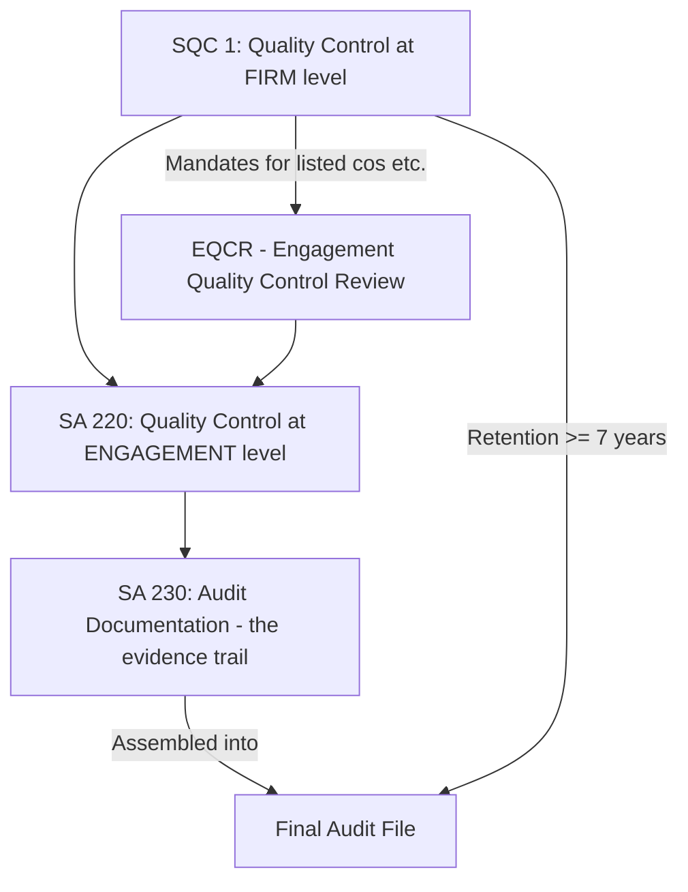

# Q&A — Audit Documentation & Quality Control

Exam-oriented question bank for CA Intermediate, Paper "Auditing & Ethics". Coverage: **SA 230** Audit Documentation, **SA 220** Quality Control for an Audit of Financial Statements, **SQC 1** Quality Control for Firms, and **EQCR** (Engagement Quality Control Review). Standards cited are Indian Standards on Auditing issued by ICAI and provisions of the **Companies Act, 2013**. No invented standards are used.

---

## How the standards fit together

---

## Section A — Concept-Check Questions (with answers)

**A1. Define "audit documentation" and state its other common name.**
Answer: Under **SA 230 (para 6)**, audit documentation means the record of audit procedures performed, relevant audit evidence obtained, and conclusions the auditor reached. Terms such as "working papers" or "workpapers" are also used. It is the tangible record supporting the auditor's opinion.

**A2. State the two principal purposes served by audit documentation under SA 230.**
Answer: Per **SA 230 (para 5)**: (a) it provides evidence of the auditor's basis for a conclusion about the achievement of the overall objectives of the auditor; and (b) it provides evidence that the audit was planned and performed in accordance with SAs and applicable legal/regulatory requirements.

**A3. What is the "experienced auditor" test in SA 230?**
Answer: **SA 230 (para 8)** requires documentation sufficient to enable an experienced auditor, having no previous connection with the audit, to understand: (a) the nature, timing and extent (NTE) of procedures performed; (b) the results and evidence obtained; and (c) significant matters, conclusions reached, and significant professional judgments made.

**A4. When identifying items tested, what three attributes should the auditor record?**
Answer: Under **SA 230 (para 9)**, the auditor should record the identifying characteristics of the items tested, the person who performed the work and the date it was completed, and the person who reviewed the work performed and the date/extent of review.

**A5. What is the time limit for assembling the final audit file, and where is it fixed?**
Answer: **SQC 1 (para 82)** requires the final audit file to be assembled on a timely basis, ordinarily **not more than 60 days after the date of the auditor's report**. SA 230 (para 14) reiterates this administrative process.

**A6. For how long must audit documentation be retained?**
Answer: **SQC 1 (para 83)** prescribes a retention period ordinarily **not shorter than 7 years** from the date of the auditor's report, or the date of the group auditor's report, if later.

**A7. After the file assembly date, can the auditor delete working papers? Can additions be made?**
Answer: **SA 230 (para 15)** prohibits deleting or discarding documentation before the end of the retention period. Additions are permitted after assembly, but the auditor must document: the specific reasons for the change, and when and by whom the changes were made and reviewed (**SA 230 para 16**).

**A8. Distinguish SA 220 from SQC 1 in one line each.**
Answer: **SQC 1** deals with quality control at the **firm level** (system of quality control for all engagements). **SA 220** deals with quality control at the **individual engagement level**, and operates on the premise that the firm is subject to SQC 1.

**A9. What is EQCR and who performs it?**
Answer: EQCR (Engagement Quality Control Review) is an objective evaluation, **before the report is issued**, of the significant judgments made and conclusions reached by the engagement team. It is performed by an **Engagement Quality Control Reviewer** — a partner, other person in the firm, suitably qualified external person, or a team, who is **not part of the engagement team** (**SQC 1 para 39 / SA 220 para 7**).

**A10. When is an EQCR mandatory?**
Answer: Per **SQC 1 (para 60)**, an EQCR is required for **audits of financial statements of listed entities**. The firm must also establish criteria to determine whether an EQCR should be performed for **other engagements** presenting higher risk.

**A11. List the six elements of a system of quality control under SQC 1.**
Answer (mnemonic "LEHAME"): (1) **L**eadership responsibilities for quality within the firm; (2) **E**thical requirements; (3) Acceptance and continuance of client relationships and specific engagements; (4) **H**uman resources; (5) Engagement performance; (6) **M**onitoring. (SQC 1 para 4 / 16.)

**A12. What are the fundamental ethical principles the firm must uphold?**
Answer: Under SQC 1 (ethical requirements element): **Integrity, Objectivity, Professional competence and due care, Confidentiality, and Professional behaviour**. Independence is emphasised for assurance engagements.

**A13. Is oral explanation by the auditor a substitute for documentation?**
Answer: No. **SA 230 (para A16)** states oral explanations by the auditor, on their own, do not represent adequate support for the work performed or conclusions reached, but may be used to clarify or explain information contained in the documentation.

**A14. Must every matter be documented?**
Answer: No. It is neither necessary nor practicable to document every matter considered. **SA 230 (para A7)** — matters of insignificant nature and judgments that are obvious need not be documented; documentation focuses on significant matters.

**A15. Name three items SA 230 requires be documented regarding discussions of significant matters.**
Answer: The auditor should document (a) the significant matters discussed, (b) with whom and when they were discussed, and (c) how the auditor addressed any inconsistency between information and the final conclusion (SA 230 paras 10-11).

---

## Section B — Applied Scenario Questions (situation → response with reasoning)

**B1. Situation:** During finalisation, the audit senior realises a photocopy of an important lease deed was not placed on file, though its contents were tested. She wants to obtain the copy two days after the report date but before file assembly. Is this permissible?
**Response:** Yes. Obtaining and placing the copy is an **administrative/assembly step**, not a change to conclusions. Under **SA 230 (para 13)**, changes during final assembly that are administrative in nature (e.g., assembling, sorting, cross-referencing, deleting superseded drafts, signing completion checklists) may be made before the file is assembled. Since assembly may occur within 60 days (SQC 1 para 82), placing the copy is proper, provided no new conclusion is being formed.

**B2. Situation:** After the file was assembled (day 45), the tax authority raises a query and the auditor performs additional procedures on a related-party transaction. What must the auditor document?
**Response:** Per **SA 230 (para 16)**, when documentation is added after assembly, the auditor must document: (a) the specific reasons for making the change; (b) when and by whom the additional procedures were performed; and (c) when and by whom they were reviewed. **Existing documentation must not be deleted** (para 15). This preserves the integrity of the original file.

**B3. Situation:** A firm audits a listed company. The engagement partner wants to sign the audit report immediately after completing fieldwork, without any second-partner review, to meet a deadline. Advise.
**Response:** Not permissible. For a **listed entity**, **SQC 1 (para 60) and SA 220 (para 19)** mandate an **EQCR before the report is dated**. SA 220 (para 19) states the engagement partner **shall not date the auditor's report** until the completion of the EQCR. The reviewer must objectively evaluate significant judgments and conclusions. The deadline cannot override this requirement.

**B4. Situation:** An EQC reviewer disagrees with the engagement partner on a significant judgment and the matter is not resolved to the reviewer's satisfaction. What happens?
**Response:** Under **SA 220 (para 20 / SQC 1 para 45)**, the report shall not be issued until the matter is resolved through the firm's procedures for dealing with **differences of opinion**. The firm's policies (SQC 1) must provide that conclusions are documented and implemented, and the report is not released until the difference is resolved.

**B5. Situation:** A newly promoted engagement partner has doubts about the integrity of a prospective client's management but the firm is keen to accept for the fee. Response?
**Response:** This engages the **"acceptance and continuance"** element of **SQC 1 (paras 26-33)**. The firm must consider client integrity, its own competence, capabilities, time and resources, and compliance with ethical requirements including independence. **SA 220 (para 12-13)** requires the engagement partner to be satisfied that appropriate acceptance procedures were followed. Doubtful integrity is a ground to decline; fee alone cannot justify acceptance.

**B6. Situation:** During the audit, junior staff and the engagement partner reach different conclusions on the adequacy of a provision. How should the firm handle it and what should be documented?
**Response:** The firm's SQC 1 policies on **consultation** and **differences of opinion** apply (SQC 1 paras 36-38, 45). Consultation on difficult/contentious matters should occur and the **nature and scope of consultation and conclusions must be documented** and agreed by both the consulted party and the team (SA 220 para 18). The report is not issued until the difference is resolved.

**B7. Situation:** A firm's monitoring/inspection reveals recurring deficiencies in documentation of sampling across engagements. What action framework applies?
**Response:** This is the **"monitoring"** element of **SQC 1 (paras 46-56)**. The firm must evaluate whether deficiencies are (a) instances that do not necessarily indicate the system is deficient, or (b) systemic/recurring deficiencies requiring prompt corrective action. Remedial actions may include training, changes to policies, and communication to engagement partners. If a report may be inappropriate, the firm considers obtaining legal advice.

**B8. Situation:** The auditor departs from a relevant requirement of an SA because it was not applicable in the circumstances. Is documentation required?
**Response:** Yes. Under **SA 230 (para 12)**, if in exceptional circumstances the auditor judges it necessary to depart from a **relevant requirement** in an SA, the auditor must document how the **alternative procedures performed achieve the aim** of that requirement, and the **reasons for the departure**. (Note: this applies to genuine exceptional departures, not to requirements that are simply not relevant.)

**B9. Situation:** Client requests the auditor hand over the original working papers, claiming they belong to the client since the client paid for the audit. Advise on ownership.
**Response:** **SA 230 (para A24)** and SQC 1 confirm that **audit documentation is the property of the auditor**. The auditor may, at their discretion, make portions available to clients provided disclosure does not undermine the audit's validity or independence. The client cannot claim ownership merely by paying the fee.

**B10. Situation:** A small proprietary firm argues SQC 1 is meant only for big firms and does not apply to it. Correct?
**Response:** Incorrect. **SQC 1 applies to all firms** performing audits, reviews of historical financial information, and other assurance and related services engagements, **regardless of size**. However, the **nature and extent** of policies and procedures depend on factors such as firm size, operating characteristics, and whether it is part of a network (SQC 1 para 8, A-guidance on scalability).

---

## Section C — Past-Paper-Style Descriptive Questions (with model answers)

**C1. "Audit documentation serves a number of additional purposes beyond supporting the opinion." Enumerate these purposes. (SA 230)**
Model answer: Beyond the two principal purposes (para 5), **SA 230 (para 3)** lists additional purposes:
1. Assisting the engagement team to **plan and perform** the audit.
2. Assisting members responsible for **supervision and review** of the work.
3. Enabling the team to be **accountable** for its work.
4. **Retaining a record** of matters of continuing significance to future audits.
5. Enabling the conduct of **quality control reviews and inspections** (SQC 1).
6. Enabling the conduct of **external inspections** under legal, regulatory or other requirements.

**C2. Explain the factors that affect the form, content and extent of audit documentation. (SA 230 para A2)**
Model answer: Factors include: (a) size and complexity of the entity; (b) nature of the audit procedures to be performed; (c) identified risks of material misstatement; (d) significance of the audit evidence obtained; (e) nature and extent of exceptions identified; (f) the need to document a conclusion not readily determinable from other documentation; (g) the audit methodology and tools used. Documentation may be recorded on paper or in electronic/other media.

**C3. Discuss the requirements relating to assembly, retention, and changes to the audit file. (SA 230 + SQC 1)**
Model answer:
- **Assembly:** The auditor shall assemble documentation in an audit file and complete administrative assembly on a timely basis — **ordinarily not more than 60 days** after the report date (SA 230 para 14; SQC 1 para 82).
- **Retention:** Retention period is **ordinarily not less than 7 years** from the auditor's report date (SQC 1 para 83).
- **Changes before assembly:** Only administrative changes (sorting, cross-referencing, deleting superseded drafts) are allowed (SA 230 para 13).
- **After assembly:** No deletion/discarding before end of retention period (para 15). Additions/modifications require documenting the reasons, and when and by whom made and reviewed (para 16).

**C4. What are the six elements of a firm's system of quality control under SQC 1? Explain any two.**
Model answer: The six elements are: (1) Leadership responsibilities for quality; (2) Ethical requirements; (3) Acceptance and continuance of client relationships and specific engagements; (4) Human resources; (5) Engagement performance; (6) Monitoring.
- **Leadership responsibilities (para 18):** The firm's CEO/managing board bears ultimate responsibility for the quality control system. The firm must promote a **quality-oriented internal culture** and ensure commercial considerations do not override quality. Performance evaluation, compensation and promotion must demonstrate the firm's overriding commitment to quality.
- **Engagement performance (paras 34-45):** The firm must have policies ensuring engagements are performed in accordance with standards — covering **direction, supervision and review**, **consultation** on difficult matters, **EQCR**, resolving **differences of opinion**, and file assembly/retention.

**C5. Write short notes on Engagement Quality Control Review (EQCR): meaning, applicability, and matters the reviewer considers.**
Model answer:
- **Meaning:** An objective evaluation, before the report is issued, of significant judgments made and conclusions reached by the engagement team (SQC 1 para 39; SA 220 para 7).
- **Applicability:** Mandatory for **listed entities**; the firm sets criteria for other higher-risk engagements (SQC 1 para 60).
- **Reviewer's considerations (SA 220 para 20 / SQC 1 para 44):** discussion of significant matters with the engagement partner; review of financial statements and proposed report; review of selected documentation on significant judgments; evaluation of conclusions reached and whether the proposed report is appropriate. The reviewer must be **objective and independent of the engagement team**, and appropriately qualified.

**C6. "The auditor shall prepare documentation on a timely basis." Explain why timely preparation is important. (SA 230 para 7, A1)**
Model answer: Preparing documentation on a **timely basis** (i.e., while performing the work, not long after) helps enhance the **quality** of the audit and facilitates effective **review and evaluation** of the evidence and conclusions **before the report is finalised**. Documentation prepared after the work is performed is likely to be **less accurate** than documentation prepared contemporaneously.

**C7. Explain the "Human Resources" element and its sub-component "assignment of engagement teams" under SQC 1.**
Model answer: The **Human Resources** element (SQC 1 paras 29-33) requires policies giving reasonable assurance that the firm has sufficient personnel with the **competence, capabilities and commitment to ethical principles** to perform engagements per standards. It covers recruitment, performance evaluation, capabilities, competence, career development, promotion, compensation and estimation of personnel needs. **Assignment of engagement teams (para 32):** The firm assigns responsibility for each engagement to an **engagement partner** whose identity and role are communicated to key client personnel, who has appropriate competence, capabilities, authority, and time; and ensures the team collectively has the competence to perform the engagement.

---

## Section D — MCQs and Case Scenarios (correct option + one-line reasoning)

**D1.** Audit documentation should ordinarily be retained for a period not less than:
(a) 5 years (b) 6 years (c) 7 years (d) 10 years
**Answer: (c).** SQC 1 para 83 sets the retention period at not less than 7 years from the report date.

**D2.** The final audit file should ordinarily be assembled within:
(a) 30 days (b) 45 days (c) 60 days (d) 90 days
**Answer: (c).** SA 230 para 14 / SQC 1 para 82 — not more than 60 days after the auditor's report date.

**D3.** An EQCR is mandatory for the audit of:
(a) All companies (b) Listed entities (c) Only public sector banks (d) Firms with turnover > Rs.50 crore
**Answer: (b).** SQC 1 para 60 mandates EQCR for listed entities; firms set criteria for other higher-risk engagements.

**D4.** The "experienced auditor" referred to in SA 230 is a person who:
(a) Has worked on the same audit before (b) Is the current engagement partner (c) Has practical audit experience but no previous connection with this audit (d) Is an ICAI inspector only
**Answer: (c).** SA 230 defines the experienced auditor as one with no previous connection to the audit, used as the benchmark for sufficiency.

**D5.** Which is NOT one of the six elements of a system of quality control under SQC 1?
(a) Monitoring (b) Ethical requirements (c) Leadership responsibilities (d) Statutory audit rotation
**Answer: (d).** Audit rotation is a Companies Act, 2013 (Sec 139) matter, not an SQC 1 quality-control element.

**D6.** Oral explanations by the auditor:
(a) Fully substitute documentation (b) On their own do not represent adequate support but may clarify (c) Are prohibited (d) Replace working papers for small audits
**Answer: (b).** SA 230 para A16 — oral explanations alone are not adequate support but may clarify documented information.

**D7.** Ownership of audit working papers vests with:
(a) The client (b) ICAI (c) The auditor (d) Jointly with client and auditor
**Answer: (c).** SA 230 para A24 — documentation is the property of the auditor.

**D8. Case Scenario:** CA Ramesh audits XYZ Ltd (unlisted, high-risk due to fraud history). The firm's policy requires EQCR for high-risk clients. Ramesh skips EQCR arguing XYZ is unlisted. Is he correct?
(a) Correct, EQCR is only for listed (b) Incorrect, firm's own criteria mandate it here (c) Correct, unlisted clients are exempt always (d) Incorrect, EQCR is required for all audits
**Answer: (b).** SQC 1 para 60 requires firms to set criteria extending EQCR to higher-risk engagements; the firm's own policy binds Ramesh.

**D9. Case Scenario:** After assembling the file on day 30, the auditor discovers a computational error in a note and wants to correct the working paper by erasing the old figure. Advise.
(a) Erase and overwrite freely (b) Cannot delete; add new documentation stating reason, who, and when (c) Destroy the whole file and restart (d) No action needed
**Answer: (b).** SA 230 paras 15-16 — existing documentation must not be deleted; additions require reason, date, and identity of preparer/reviewer.

**D10.** Under SA 230, identifying characteristics of items tested are recorded to:
(a) Increase file size (b) Enable identification of the specific items tested and support the audit trail (c) Satisfy the client (d) Replace sampling
**Answer: (b).** SA 230 para 9 — recording identifying characteristics allows the team to identify the items selected/tested and enables review and re-performance.

**D11.** SA 220 operates on the premise that:
(a) The firm has no quality control system (b) The firm is subject to SQC 1 (c) EQCR is optional for all (d) Documentation is unnecessary
**Answer: (b).** SA 220 is built on the premise that the firm is subject to SQC 1 or at least equally demanding requirements.

**D12. Case Scenario:** An engagement partner of a listed-company audit dates the auditor's report on 20th May; the EQCR is completed on 25th May. Evaluate.
(a) Valid, EQCR can follow the report (b) Invalid, report cannot be dated before EQCR completion (c) Valid if partner is senior (d) Invalid only if client objects
**Answer: (b).** SA 220 para 19 — the engagement partner shall not date the report until completion of the EQCR.

---

## Quick memory hooks

- **60 days** to assemble the file; **7 years** to retain it (SQC 1 paras 82-83).
- **Experienced auditor test** = benchmark for "how much documentation is enough" (SA 230 para 8).
- **NTE + results + significant judgments** = the three things documentation must reveal.
- **SQC 1 = firm level; SA 220 = engagement level; SA 230 = the paper trail.**
- **EQCR = mandatory for listed entities**, report not dated until EQCR done.
- Six SQC 1 elements: Leadership, Ethics, Acceptance/Continuance, Human Resources, Engagement Performance, Monitoring.
