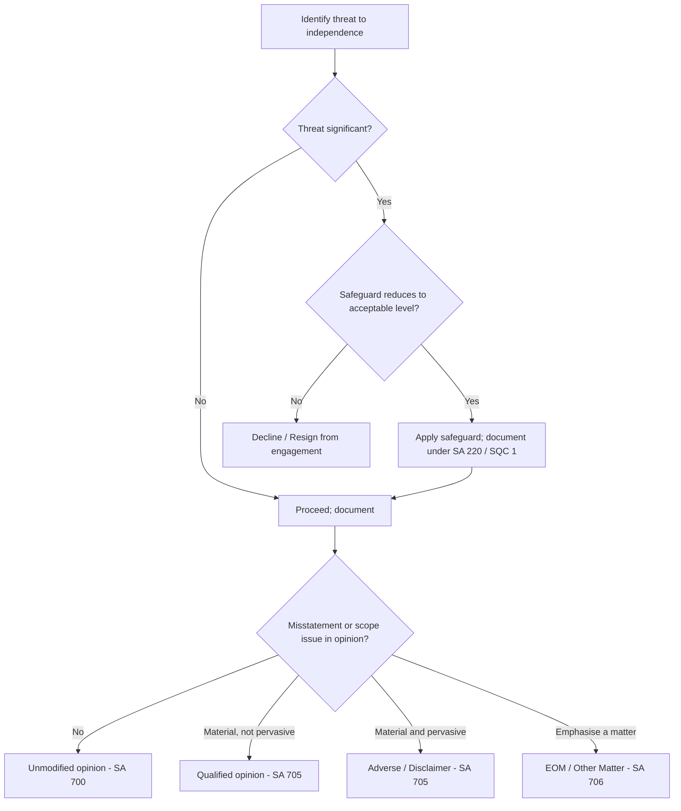

# Q&A — Professional Ethics & Independence

> CA Intermediate • Auditing & Ethics • Chapter: Professional Ethics & Independence
> Governing instruments: **ICAI Code of Ethics**, **Chartered Accountants Act, 1949** (First & Second Schedules), **Companies Act, 2013 (ss. 139, 141, 144)**, **SA 200**, **SA 220**, **SQC 1**, **SA 705/706**.

---

## Section A — Concept-Check Questions (with answers)

**A1. State the five fundamental principles of professional ethics under the ICAI Code of Ethics.**

*Answer:* (i) **Integrity** — straightforward and honest in all professional and business relationships; (ii) **Objectivity** — do not allow bias, conflict of interest or undue influence to override professional judgment; (iii) **Professional Competence and Due Care** — maintain knowledge/skill at the required level and act diligently per technical and professional standards; (iv) **Confidentiality** — do not disclose or use client information without authority or legal duty; (v) **Professional Behaviour** — comply with laws/regulations and avoid conduct discrediting the profession. (ICAI Code of Ethics; echoed in **SA 200 para 14**.)

**A2. Distinguish "independence of mind" from "independence in appearance".**

*Answer:* **Independence of mind** (independence *in fact*) is the state of mind that permits the auditor to express a conclusion without being affected by influences that compromise professional judgment — allowing the auditor to act with integrity, objectivity and professional scepticism. **Independence in appearance** is the avoidance of facts and circumstances so significant that a reasonable and informed third party would conclude the auditor's integrity, objectivity or scepticism had been compromised. Both are required — appearance matters because the audit opinion is a *paid opinion relied on by outsiders who cannot verify it themselves*; a lost appearance of independence destroys the credibility (and hence the value) of the opinion even if the auditor was in fact unbiased. (**SA 200**; ICAI Code of Ethics.)

**A3. Name the five threats to independence and give the one-word mechanism of each.**

*Answer:* (i) **Self-interest** — financial/other interest (e.g., loan, shareholding, fee dependence) pulls judgment; (ii) **Self-review** — auditor evaluates own prior work/output (e.g., books he wrote); (iii) **Advocacy** — auditor promotes client's position, compromising objectivity; (iv) **Familiarity** — long/close relationship makes auditor too sympathetic; (v) **Intimidation** — actual or perceived pressure/threat (dismissal, litigation) deters objective action. (ICAI Code of Ethics.)

**A4. What are the two broad categories of safeguards?**

*Answer:* (i) **Safeguards created by the profession, legislation or regulation** — e.g., educational/CPE requirements, professional standards, disciplinary machinery of ICAI, statutory prohibitions (Companies Act ss. 141/144), rotation (s. 139(2)); (ii) **Safeguards in the work environment (firm-wide and engagement-specific)** — e.g., quality control policies under **SQC 1**, engagement quality control review, rotation of engagement partner, using a second partner to review, and consultation. When no safeguard can reduce a threat to an acceptable level, the auditor must **decline or resign** from the engagement. (ICAI Code of Ethics; **SQC 1**; **SA 220**.)

**A5. Which section of the Companies Act, 2013 lists disqualifications of an auditor, and give three examples?**

*Answer:* **Section 141** of the Companies Act, 2013 lists eligibility, qualifications and disqualifications. Examples: (a) a body corporate other than an LLP; (b) an officer or employee of the company; (c) a person holding **any security or interest** in the company, its subsidiary, holding or associate company (relative may hold security up to face value of ₹1,00,000); (d) a person indebted to the company for more than ₹5,00,000, or who has given a guarantee for more than ₹1,00,000; (e) a person in full-time employment elsewhere or who is auditor of more than **twenty companies**. (**s. 141(3)**.)

**A6. What does Section 144 of the Companies Act, 2013 deal with?**

*Answer:* **Section 144** prohibits the statutory auditor from rendering certain **non-audit / prohibited services** directly or indirectly to the company, its holding or subsidiary company — including accounting and book-keeping, internal audit, design/implementation of financial information systems, actuarial services, investment advisory, investment banking, rendering of outsourced financial services, and management services. The purpose is to eliminate **self-review and self-interest** threats. (**s. 144**.)

**A7. State the rotation requirement in Section 139(2).**

*Answer:* For prescribed classes of companies (listed and certain other companies per Rule 5), an **individual auditor** shall not be appointed for more than **one term of five consecutive years**, and an **audit firm** for more than **two terms of five consecutive years**, with a **five-year cooling-off** before re-appointment. This is a legislative safeguard against the **familiarity** and **self-interest** threats. (**s. 139(2)**.)

---

## Section B — Applied Scenario Questions (situation → response → reasoning)

**B1. Book-keeping done by the auditor.**
*Situation:* CA P is the statutory auditor of XYZ Ltd. Management requests P's firm to also maintain the company's books of account and prepare the financial statements that P will later audit.

*Response & reasoning:* P must **decline** the book-keeping engagement. Auditing the financial statements he himself prepared creates a **self-review threat** of an unacceptable level, and for a company it is **prohibited by Section 144** of the Companies Act, 2013 (accounting and book-keeping services to an audit client). No safeguard can reduce this to an acceptable level while P remains statutory auditor. (**s. 144**; ICAI Code — self-review.)

**B2. Fee dependence and intimidation.**
*Situation:* A single client contributes about 45% of a small firm's total fees. The client hints that unless the auditor accepts a favourable treatment of a doubtful debt, it will change auditors.

*Response & reasoning:* Two threats operate — **self-interest** (undue economic dependence on one client) and **intimidation** (threat of dismissal). The auditor must **not yield**; professional judgment cannot be traded for fee retention (**Objectivity**, **Integrity**). Safeguards: reduce dependence, obtain an engagement quality control review by another partner, consult ICAI, and disclose. If the correct accounting is not accepted, the auditor must **modify the opinion** (qualified/adverse per **SA 705**) and, if independence cannot be maintained, **resign**. ICAI guidance flags excessive fee dependence (broadly, gross fees exceeding 40% from one client for firms other than very small ones) as a caution point. (ICAI Code; **SA 705**.)

**B3. Relative as KMP — appearance.**
*Situation:* CA Q is offered the statutory audit of ABC Ltd where his spouse is the Chief Financial Officer.

*Response & reasoning:* Q must **not accept**. A relative (spouse) being a KMP creates a **familiarity** and **self-interest** threat and destroys **independence in appearance** — a reasonable third party would doubt objectivity. It also attracts disqualification concerns under **s. 141(3)** (relationship/interest). Decline the engagement; no engagement-level safeguard is adequate. (ICAI Code; **s. 141**.)

**B4. Confidentiality and insider information.**
*Situation:* During the audit of a listed company, CA R learns of an unpublished proposed merger. R's friend asks about the company's prospects, and R is tempted to buy the company's shares.

*Response & reasoning:* R must **not disclose** the information and must **not trade** on it. **Confidentiality** prohibits using client information for personal advantage; trading on unpublished price-sensitive information also breaches **Professional Behaviour** and SEBI insider-trading law. Client information may be disclosed only with authority or where there is a legal/professional duty (e.g., under law, or to defend in disciplinary proceedings). (ICAI Code — confidentiality; **s. 141/Professional Behaviour**.)

**B5. Contingent fee.**
*Situation:* A client offers to pay the audit fee as a percentage of the profit disclosed in the audited accounts.

*Response & reasoning:* The auditor must **refuse**. Charging fees based on a percentage of profits/results is prohibited (creates a **self-interest** threat and offends the **Second Schedule / Regulation 192**). Fees must be a fixed professional charge, not contingent on outcomes (except statutorily permitted contingent arrangements). (ICAI Code; CA Act — professional misconduct.)

---

## Section C — Past-Paper-Style Descriptive Questions (with model answers)

**C1. "Independence is the backbone of auditing." Explain independence of mind and appearance, and why appearance is essential. (5 marks)**

*Model answer:* The value of an audit is that an **outsider who cannot verify the accounts himself relies on the auditor's opinion**. For that reliance to be justified, the auditor must be independent both in fact and in appearance.
- **Independence of mind** allows the auditor to form a conclusion free from bias, conflict of interest, or undue influence — enabling integrity, objectivity and professional scepticism (**SA 200 para 15** requires scepticism).
- **Independence in appearance** requires avoiding circumstances so significant that a **reasonable and informed third party** would conclude independence was compromised.
Appearance is essential because credibility, not merely correctness, is what users buy: a well-founded suspicion of bias is enough to destroy the opinion's usefulness. Hence the Companies Act reinforces appearance through **s. 141** (disqualifications), **s. 144** (prohibited services) and **s. 139(2)** (rotation).

**C2. Explain the five threats to independence with the mechanism of each and one safeguard. (6 marks)**

*Model answer:*
| Threat | Mechanism (why judgment bends) | Illustration | Safeguard |
|---|---|---|---|
| Self-interest | Financial/other interest aligns auditor with client | Shareholding, loan, fee dependence | Divest interest; s.141 prohibitions; rotation |
| Self-review | Auditor judges his own earlier work/output | Auditing books he prepared | s.144 prohibition; separate teams |
| Advocacy | Auditor promotes client's position | Representing client in a dispute | Decline advocacy role |
| Familiarity | Long/close relationship breeds sympathy | Relative as KMP; long tenure | Rotation s.139(2); EQCR |
| Intimidation | Pressure/threat deters objectivity | Threat of dismissal or litigation | Consultation; document; resign if needed |

Where no safeguard reduces the threat to an acceptable level, the auditor must **decline or resign**. (ICAI Code of Ethics.)

**C3. Discuss the safeguards available to counter threats to independence. (5 marks)**

*Model answer:* Safeguards fall into two classes.
1. **Created by profession/legislation/regulation:** entry and CPE education requirements; professional standards (SAs, SQC 1); **ICAI disciplinary mechanism** under the CA Act, 1949; external review; statutory prohibitions — **s. 141** (disqualifications), **s. 144** (prohibited non-audit services), **s. 139(2)** (mandatory rotation and cooling-off).
2. **In the work environment (firm/engagement level):** firm-wide quality-control policies under **SQC 1**; leadership emphasising ethics; **engagement quality control review (EQCR)**; rotating the engagement partner; consulting a second partner or ICAI; documentation of judgments (**SA 220**).
The **decline/resign rule** is the ultimate safeguard: if identified threats cannot be eliminated or reduced to an acceptable level by any safeguard, the auditor should not accept or should withdraw from the engagement.

**C4. Write short notes on confidentiality and its exceptions. (4 marks)**

*Model answer:* **Confidentiality** requires that a member not disclose information acquired in a professional relationship without proper and specific authority, nor use it for personal advantage or the advantage of third parties. It continues even after the client relationship ends. **Permitted disclosure** arises where: (a) disclosure is **permitted by law and authorised** by the client; (b) disclosure is **required by law** (e.g., production of documents in legal proceedings, disclosure to a regulator); or (c) there is a **professional right or duty** to disclose (e.g., to comply with a peer/quality review, or to defend oneself in ICAI disciplinary proceedings). Unauthorised disclosure is professional misconduct under the CA Act, 1949.

---

## Opinion / Independence Decision Tree

---

## Section D — MCQs & Case Scenarios

**D1.** Which section prohibits the statutory auditor from rendering internal audit services to the auditee?
- (a) s. 139  (b) s. 141  (c) **s. 144**  (d) s. 143
*Answer:* **(c) s. 144** — it lists prohibited non-audit services, including internal audit.

**D2.** An auditor auditing financial statements his own firm prepared faces primarily a:
- (a) advocacy threat  (b) **self-review threat**  (c) intimidation threat  (d) familiarity threat
*Answer:* **(b)** — evaluating one's own prior output is self-review.

**D3.** Under s. 139(2), an audit firm can hold office for a maximum of:
- (a) one term of 5 years  (b) **two terms of 5 years**  (c) three terms of 5 years  (d) 10 years without break
*Answer:* **(b)** — two consecutive five-year terms, then five-year cooling-off.

**D4.** A relative of the auditor may hold securities in the auditee company up to a face value of:
- (a) ₹1,00,000  (b) ₹5,00,000  (c) **₹1,00,000 (face value)**  (d) any amount
*Answer:* **(c)** — s. 141(3)(d) permits a relative to hold security up to face value of ₹1,00,000.

**D5.** Which is NOT one of the five fundamental principles?
- (a) Integrity  (b) Objectivity  (c) **Independence**  (d) Confidentiality
*Answer:* **(c)** — Independence is a concept underpinned by the principles (esp. objectivity), not itself one of the five fundamental principles.

**D6. Case scenario.** CA S is statutory auditor of DEF Ltd (fee ₹2 lakh). DEF also asks S to design its financial information system (fee ₹15 lakh) and, separately, S's brother is a director. Which is correct?
- (a) S may accept the IT design work as it is unrelated to audit
- (b) **S must refuse the IT-system design (prohibited under s. 144) and address the familiarity/appearance threat from the brother-director**
- (c) The fee ratio makes the audit itself illegal
- (d) S may accept everything with a disclosure note
*Answer:* **(b)** — designing/implementing financial information systems is a **prohibited service under s. 144** (self-review), and a brother as director creates a **familiarity threat** damaging independence in appearance.

**D7.** If a threat cannot be reduced to an acceptable level by any safeguard, the auditor should:
- (a) accept with a lower fee  (b) **decline or resign from the engagement**  (c) issue a disclaimer and continue  (d) ignore appearance and rely on independence in fact
*Answer:* **(b)** — the decline/resign rule is the final safeguard.

**D8.** Professional scepticism is expressly required by:
- (a) SA 230  (b) **SA 200**  (c) s. 144  (d) SQC 2
*Answer:* **(b)** — SA 200 requires the auditor to plan and perform the audit with professional scepticism.

---

## Quick-Revision Sheet

- **5 Principles:** Integrity · Objectivity · Competence & Due Care · Confidentiality · Professional Behaviour.
- **5 Threats:** Self-interest · Self-review · Advocacy · Familiarity · Intimidation.
- **2 Safeguard classes:** profession/legislation/regulation; work-environment (firm/engagement). **Final safeguard = decline/resign.**
- **Legal backstops (Companies Act, 2013):** s. 141 disqualifications · s. 144 prohibited services · s. 139(2) rotation & cooling-off.
- **Standards link:** SA 200 (scepticism, ethics, independence) · SA 220 & SQC 1 (quality control, EQCR) · SA 705/706 (opinion modifications) · CA Act, 1949 (misconduct & discipline).
- **Answer skeleton:** *Identify threat(s) → assess significance → apply/consider safeguard → if none adequate, decline/resign; if misstatement persists, modify opinion under SA 705.*
