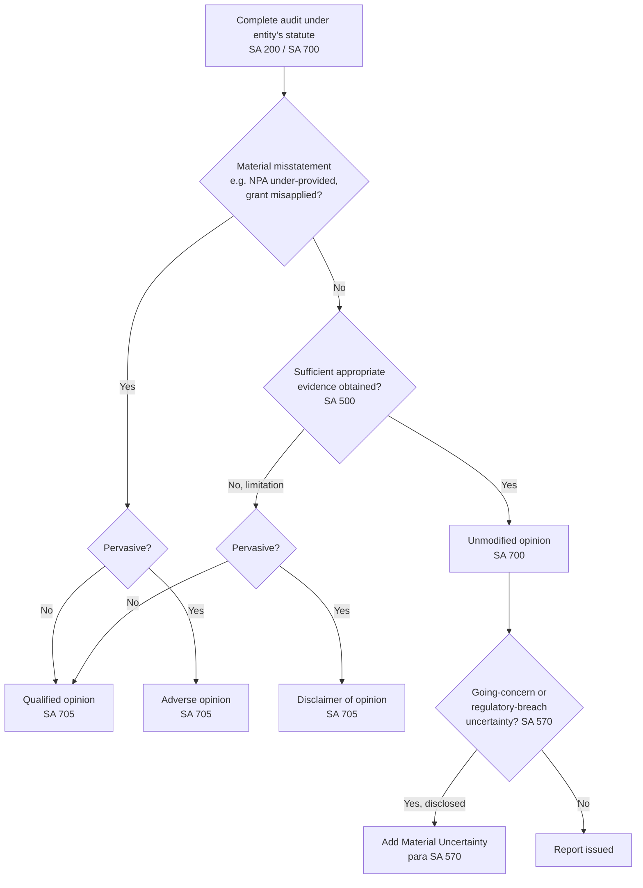

# Q&A — Audit of Different Entities (Overview)

> Exam-oriented question bank for CA Intermediate *Auditing & Ethics*. Every question is immediately followed by a complete model answer citing the relevant Standard on Auditing (SA), Companies Act 2013 section, or governing statute. Standards cited are genuine (SA 200, SA 210, SA 250, SA 299, SA 315, SA 402, SA 500, SA 570, SA 580, SA 610, SA 700 series). No standard has been invented.

---

## Section A — Concept-Check Questions (with answers)

**A1. What is the single unifying idea behind "audit of different entities"?**
Model answer: The core objective of every audit is constant — to express an opinion on whether financial statements give a true and fair view (Companies Act 2013, Sec. 143; SA 200). What changes across entities is the *governing statute, the applicable financial reporting framework, and the entity-specific risk areas*. The auditor tailors risk assessment (SA 315) and audit procedures (SA 500) to the entity's legal form and business, but the assurance framework itself is unchanged. This is why the chapter is called an "overview" — it maps how one audit engine is fitted to many legal chassis.

**A2. Which law governs the audit of a banking company and what is the auditor's special reporting duty?**
Model answer: The Banking Regulation Act 1949 (read with the Companies Act 2013 and RBI directions) governs bank audits. Under Sec. 30 of the Banking Regulation Act, accounts must be audited, and the auditor reports additionally to the RBI. The auditor must specifically examine income recognition, asset classification and provisioning (IRAC norms), and comment on whether transactions noticed were within the bank's powers. Key focus: advances (NPAs), and the Long Form Audit Report (LFAR).

**A3. Under which statute is an insurance company audited, and what is unique about its accounts?**
Model answer: The Insurance Act 1938 and IRDAI (Preparation of Financial Statements) Regulations 2002 govern insurer audits, alongside the Companies Act 2013. Unique features: a Revenue Account (Policyholders' A/c) separate from the Profit & Loss (Shareholders' A/c), actuarial valuation of liabilities (life insurers), and unexpired-risk reserves. The auditor relies on the appointed actuary's certificate for policy liabilities — treated as work of a management's expert, evaluated under SA 500.

**A4. Are NBFCs subject to the Companies Act audit, and what extra report is required?**
Model answer: Yes. An NBFC is a company, so the statutory audit under Sec. 143 of the Companies Act 2013 applies. Additionally, RBI's Non-Banking Financial Companies Auditor's Report (Reserve Bank) Directions require the auditor to submit a separate report to the RBI stating whether the NBFC is engaged in NBFI business, holds a valid Certificate of Registration, meets net owned fund and prudential (IRAC/provisioning) norms.

**A5. Distinguish the C&AG audit of a government company from a normal company audit.**
Model answer: Under Sec. 139(5)/(7) of the Companies Act 2013, the auditor of a government company is *appointed by the C&AG*. Under Sec. 143(5)–(7), the C&AG can issue directions to the auditor, conduct a supplementary audit, and comment upon or supplement the audit report. The statutory auditor's report is therefore subject to C&AG's supplementary audit — a two-tier assurance not present in ordinary company audits.

**A6. Does a cooperative society follow the Companies Act for its audit?**
Model answer: No. A cooperative society is audited under the relevant Cooperative Societies Act — the Central Multi-State Cooperative Societies Act 2002 or the applicable State Cooperative Societies Act — not the Companies Act 2013. The Registrar of Cooperative Societies appoints/empanels auditors. Special features: examination of overdue debts, classification of members, observance of the 25% reserve-fund transfer, and adherence to bye-laws.

**A7. What framework governs the audit of an NGO / charitable trust?**
Model answer: NGOs may be constituted as a Sec. 8 company (Companies Act 2013), a public trust (Indian Trusts Act / State Public Trusts Act), or a society (Societies Registration Act 1860). Audit is also triggered by Sec. 12A/10(23C) of the Income-tax Act 1961 (Form 10B/10BB) and by FCRA 2010 for foreign contributions. The auditor focuses on whether income was applied to charitable objects, corpus vs. general donations, and grant utilisation.

**A8. Is the audit of an LLP compulsory? State the threshold.**
Model answer: Under the LLP Act 2008 read with Rule 24 of the LLP Rules 2009, audit is mandatory only if turnover exceeds Rs. 40 lakh or contribution exceeds Rs. 25 lakh in a financial year. Below both thresholds, statutory audit is not compulsory (though a tax audit under Sec. 44AB may still apply). The auditor verifies the LLP Agreement, partners' contributions, and designated-partner compliance.

**A9. What determines the scope of audit for a sole proprietor or partnership firm?**
Model answer: There is no statutory audit under any company law for a sole proprietorship or an ordinary partnership; the audit is *voluntary* and its scope is fixed by the engagement letter / the partnership deed (SA 210). The audit may nonetheless be mandated by the Income-tax Act (tax audit u/s 44AB). For partnerships the deed is the primary document — governing profit-sharing, interest on capital, and admission/retirement adjustments.

**A10. Which SA governs reliance on a service organisation (e.g., an NBFC's outsourced loan-processing)?**
Model answer: SA 402, *Audit Considerations Relating to an Entity Using a Service Organisation*. The auditor obtains an understanding of the services and their effect on internal control, and may rely on a Type 1 / Type 2 report from the service auditor to assess design and operating effectiveness of controls.

---

## Section B — Applied Scenario Questions (situation → audit response with reasoning)

**B1.** *A bank branch you are auditing has classified a loan as "standard", but interest has not been serviced for 120 days. Management resists reclassification. What do you do?*
Model answer: Under RBI's IRAC norms, an account is a Non-Performing Asset (NPA) once interest/principal is overdue for more than 90 days. At 120 days the loan must be classified sub-standard with the mandated provision. This is a *misstatement*. Apply SA 450 (evaluation of misstatements) — request correction; if management refuses and the amount is material, modify the opinion under SA 705. Reasoning: asset classification directly affects income recognition and provisioning, the highest-risk area in a bank audit; the auditor cannot subordinate a regulatory norm to management preference.

**B2.** *In a life-insurance audit, policyholder liabilities rest entirely on the appointed actuary's valuation certificate. How do you audit that figure?*
Model answer: The actuary is a management's expert. Apply SA 500 (para 8): evaluate the actuary's competence, capability and objectivity; understand the field of expertise; and assess the appropriateness of the actuary's work as audit evidence — the data used, assumptions and methods. The auditor does not re-perform the actuarial valuation but tests input data and reasonableness. Reasoning: reliance is permitted but not blind; ultimate responsibility for the opinion remains with the auditor.

**B3.** *A newly registered NBFC has a Certificate of Registration but its Net Owned Fund has fallen below the RBI-prescribed minimum at year-end. What is your response?*
Model answer: The NBFC Auditor's Report Directions require the auditor to report to the RBI whether the NOF requirement is met. Since it is not, the auditor must state this exception in the separate report to the RBI. Additionally, consider whether the shortfall creates a going-concern doubt under SA 570 (a regulatory breach may threaten continued operations/licence). If material uncertainty exists and disclosure is adequate, include a *Material Uncertainty Related to Going Concern* paragraph under SA 570; if disclosure is inadequate, modify the opinion.

**B4.** *You are the statutory auditor of a government company. After you sign your report, the C&AG's supplementary audit surfaces an understatement of provisions. Can C&AG override you?*
Model answer: Yes, in effect. Under Sec. 143(6) of the Companies Act 2013, the C&AG may conduct a supplementary audit within 60 days and comment upon or supplement the auditor's report; these comments are placed before the AGM. The statutory auditor's report is not the final word for a government company. Reasoning: the two-tier structure ensures public accountability of government funds; the auditor should cooperate and provide working papers.

**B5.** *An NGO received a foreign grant of USD 50,000 for building a school, but Rs. 8 lakh of it was spent on staff salaries not connected to the project. What audit action follows?*
Model answer: This is a potential violation of FCRA 2010 (utilisation of foreign contribution only for the sanctioned purpose) and a matter of grant conditions. Apply SA 250 (*Consideration of Laws and Regulations*): identify the non-compliance, evaluate its effect on the financial statements and on utilisation certificates, and communicate with those charged with governance (SA 260). If the misapplication is material and unadjusted/undisclosed, modify the opinion; also report separately in Form FC-4 utilisation certification. Reasoning: for NGOs, *application of funds to stated objects* is the central assertion.

---

## Section C — Past-Paper-Style Descriptive Questions (with model answers)

**C1. "The nature of the entity dictates the audit approach even though the audit objective is constant." Discuss with three illustrations.** (5 marks)
Model answer: The objective under SA 200 — reasonable assurance and a true-and-fair opinion — is invariant. But SA 315 requires understanding the entity and its environment, including the applicable financial reporting framework, so the *approach* varies:
1. **Bank** — governed by the Banking Regulation Act 1949; the auditor concentrates on advances, IRAC classification, and files an LFAR; income recognition is reversed on NPAs.
2. **Insurer** — governed by the Insurance Act 1938 / IRDAI regulations; the auditor evaluates the appointed actuary's liability valuation (SA 500) and the segregation of policyholders' and shareholders' funds.
3. **Government company** — the C&AG appoints the auditor (Sec. 139(5)) and can supplement the report (Sec. 143(6)).
Thus statute-driven risk areas reshape planning, materiality, and reporting while the assurance framework stays the same.

**C2. Explain the appointment and reporting framework for auditors of government companies under the Companies Act 2013.** (5 marks)
Model answer:
- **Appointment** — Sec. 139(5): the auditor of a government company (or a company controlled by the Central/State Government) is appointed by the C&AG within 180 days of the commencement of the financial year. Sec. 139(7) covers the *first* auditor — appointed by C&AG within 60 days of registration; failing which, by the Board within 30 days; failing which, by members.
- **C&AG directions** — Sec. 143(5): the C&AG may direct the manner in which accounts are audited; the auditor must report accordingly, including any directions and their action taken and impact.
- **Supplementary audit** — Sec. 143(6): C&AG may conduct a supplementary audit within 60 days of receipt of the report and comment upon/supplement it.
- **Test audit** — Sec. 143(7): C&AG may order a test audit.
Conclusion: government-company audits carry a statutory second tier of oversight absent in private-sector audits.

**C3. Write short notes on special points in the audit of a cooperative society.** (4 marks)
Model answer: Under the applicable Cooperative Societies Act (Central Multi-State Act 2002 or State Act), the auditor should:
(a) verify that the society operates within its **bye-laws** and the Act;
(b) examine **overdue debts** and classify them (bad, doubtful, good), assessing their effect on profit;
(c) check compliance with the mandatory transfer of at least **25% of net profit to the reserve fund** and restrictions on dividend/bonus;
(d) verify **membership** records and that loans are given only to members (subject to permitted exceptions);
(e) ensure investments are only in modes permitted by the Act;
(f) report on the **classification of the society** (audit classification A/B/C/D) as required by the Registrar.

**C4. Discuss the auditor's use of an expert and internal audit function in specialised-entity audits.** (4 marks)
Model answer: Two Standards operate:
- **SA 500 & SA 620** — where valuations require specialised skills (actuarial reserves in insurance, property valuation, loan-book modelling in NBFCs), the auditor may use an **auditor's expert** (SA 620) or evaluate a **management's expert** (SA 500 para 8), assessing competence, capability, objectivity, and the appropriateness of the work as evidence.
- **SA 610** — where an entity has an internal audit function (common in banks and large NBFCs), the auditor evaluates it for objectivity, competence and systematic approach before using its work; the auditor cannot use internal audit for matters involving significant judgement, and *sole responsibility* for the opinion remains with the statutory auditor.

**C5. State the audit checkpoints for an LLP and a partnership firm, contrasting the two.** (4 marks)
Model answer:
- **LLP** — statutory audit under LLP Act 2008 + Rule 24 only if turnover > Rs. 40 lakh or contribution > Rs. 25 lakh. Checkpoints: the LLP Agreement (profit-sharing, contribution), designated-partner DIN/compliance, filing of Form 8 and Form 11, and that limited-liability boundaries are respected.
- **Partnership** — no statutory audit under any company law; audit is voluntary or triggered by Sec. 44AB of the Income-tax Act 1961. Scope is set by the engagement letter (SA 210) and governed by the **partnership deed** — interest on capital, remuneration, and settlement on admission/retirement/death.
Contrast: the LLP audit has a statutory threshold and registry filings; the partnership audit is contractual, with the deed as the controlling document.

---

## Opinion / Reporting Decision Tree

---

## Section D — MCQs and Case Scenarios (correct option + one-line reasoning)

**D1.** An asset in a bank becomes an NPA when interest/principal is overdue for more than:
A) 30 days  B) 60 days  C) 90 days  D) 180 days
**Answer: C.** RBI IRAC norms fix the NPA threshold at 90 days of overdue.

**D2.** The auditor of a government company is appointed by:
A) The Board  B) Members in AGM  C) The Comptroller & Auditor General  D) The Central Government
**Answer: C.** Sec. 139(5) of the Companies Act 2013 vests appointment in the C&AG.

**D3.** Audit of a Limited Liability Partnership is compulsory when turnover exceeds:
A) Rs. 25 lakh  B) Rs. 40 lakh  C) Rs. 1 crore  D) Rs. 2 crore
**Answer: B.** Rule 24 of the LLP Rules 2009 sets the turnover threshold at Rs. 40 lakh (or contribution > Rs. 25 lakh).

**D4.** Policyholder liabilities of a life insurer are valued by the appointed actuary; the auditor treats this under:
A) SA 610  B) SA 500 (management's expert)  C) SA 299  D) SA 402
**Answer: B.** The actuary is a management's expert evaluated under SA 500 para 8.

**D5.** A cooperative society must transfer to its reserve fund at least:
A) 10% of net profit  B) 15% of net profit  C) 25% of net profit  D) 50% of net profit
**Answer: C.** The Cooperative Societies Acts mandate a minimum 25% transfer of net profit to the reserve fund.

**D6.** An NBFC's auditor must submit an additional report on prudential norms to:
A) SEBI  B) The Registrar of Companies  C) The Reserve Bank of India  D) IRDAI
**Answer: C.** The NBFC Auditor's Report (Reserve Bank) Directions require a separate report to the RBI.

**D7. Case scenario.** CA Meera audits "GreenLeaf Trust", a Sec. 8 company registered under Sec. 12A of the Income-tax Act. She finds Rs. 3 lakh of general donations treated as corpus without any written direction from donors. The most appropriate action is:
A) Ignore, as amount is small  B) Treat as corpus per management view  C) Reclassify to income and assess impact on 85% application, communicate to TCWG  D) Resign immediately
**Answer: C.** Only donations received with a specific written direction can be corpus (Sec. 11(1)(d)); mis-classification affects the 85%-application test — evaluate under SA 250 and communicate under SA 260.

**D8. Case scenario.** During a bank branch audit, the branch relies on a centralised outsourced CBS data-centre for interest computation. The auditor should primarily apply:
A) SA 570  B) SA 402  C) SA 580  D) SA 610
**Answer: B.** SA 402 governs audit considerations where the entity uses a service organisation.

**D9.** For a government company, the C&AG may conduct a supplementary audit within:
A) 30 days  B) 45 days  C) 60 days  D) 90 days
**Answer: C.** Sec. 143(6) allows supplementary audit within 60 days of receipt of the audit report.

**D10.** In a joint audit of a large NBFC, the division of work and responsibility among joint auditors is governed by:
A) SA 220  B) SA 299  C) SA 600  D) SA 610
**Answer: B.** SA 299 (Revised), *Joint Audit of Financial Statements*, governs responsibilities of joint auditors.

**D11. Case scenario.** An LLP has turnover of Rs. 32 lakh and partner contribution of Rs. 30 lakh. Is statutory audit required?
A) No, both below limits  B) Yes, contribution exceeds Rs. 25 lakh  C) Yes, turnover exceeds Rs. 40 lakh  D) Only if partners demand
**Answer: B.** Audit is triggered if *either* turnover > Rs. 40 lakh *or* contribution > Rs. 25 lakh; contribution of Rs. 30 lakh crosses the limit.

**D12.** Written representations from management on the completeness of related-party or grant transactions are obtained under:
A) SA 505  B) SA 580  C) SA 530  D) SA 700
**Answer: B.** SA 580 governs written representations.

---

## Quick-Revision One-Liners

- **Bank** → Banking Regulation Act 1949; NPAs (90 days), IRAC, LFAR.
- **Insurer** → Insurance Act 1938 / IRDAI; actuary's valuation (SA 500); two revenue streams.
- **NBFC** → Companies Act 2013 (Sec. 143) + separate RBI report; NOF, CoR, prudential norms.
- **Government company** → C&AG appoints (Sec. 139(5)); directions (143(5)); supplementary audit (143(6)); test audit (143(7)).
- **Cooperative society** → Cooperative Societies Act; overdue debts, 25% reserve, bye-laws, audit classification.
- **NGO** → Sec. 8 company / trust / society; Sec. 12A + Form 10B; FCRA for foreign funds; application to objects.
- **LLP** → LLP Act 2008; audit if turnover > Rs. 40 lakh or contribution > Rs. 25 lakh; LLP Agreement.
- **Sole proprietor / partnership** → no company-law audit; voluntary or Sec. 44AB tax audit; deed/engagement letter (SA 210) sets scope.
- **Cross-cutting SAs** → SA 200, 210, 250, 299, 315, 402, 500, 570, 580, 610, 700/705.
