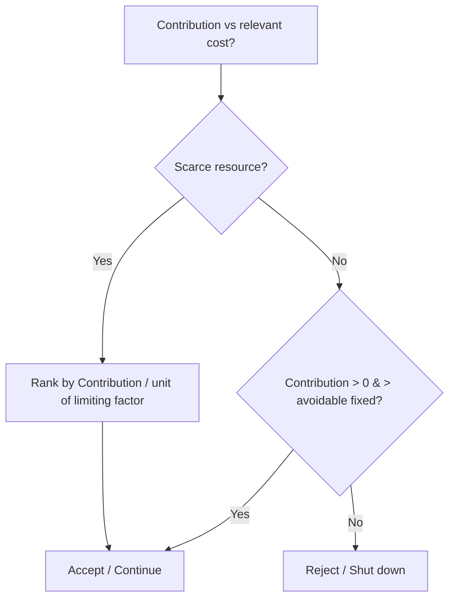
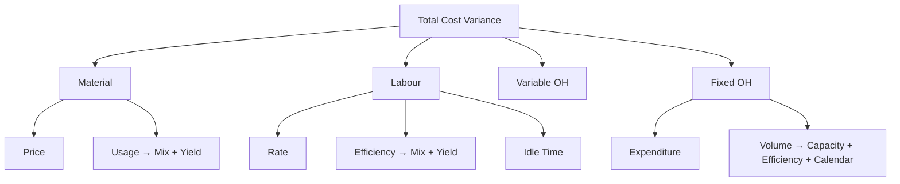

# Cost & Management Accounting — Quick-Revision Cheat-Sheet

> CA Intermediate • last-mile scan • formulas + logic only, not teaching. Round per ICAI convention; quote figures in exam as `₹`.

---

## 1. Cost Sheet & Cost Concepts

| Build-up (running total) | Formula |
|---|---|
| Prime Cost | Direct Material Consumed + Direct Labour + Direct Expenses |
| DM Consumed | Opening RM + Purchases + Carriage-in − Returns − Closing RM |
| Factory/Works Cost | Prime + Factory OH + Op. WIP − Cl. WIP |
| Cost of Production (COP) | Works Cost + Admin OH (production-related) |
| COP of goods sold | COP + Op. FG − Cl. FG |
| Cost of Sales | COGS + Selling & Distribution OH |
| Sales | Cost of Sales + Profit |

- **Scrap/defective sale** of factory material → deduct from Factory OH. **Notional items** (own rent, interest on capital) excluded from cost.
- **Cost classification:** by *nature* (mat/lab/exp), *function* (prod/admin/S&D), *variability* (fixed/variable/semi), *controllability*, *normality*.
- **Cost centre** = location/person/equipment for cost gathering; **Cost unit** = unit of output for cost measurement (e.g. per tonne-km, per bed-day, per kWh).

---

## 2. Material Cost

**EOQ (Economic Order Quantity)**
$$EOQ=\sqrt{\dfrac{2\,A\,O}{C}}$$
A = annual consumption (units), O = ordering cost/order, C = carrying cost per unit p.a. (= price × carrying %).
- At EOQ: **Ordering cost = Carrying cost**; Total inventory cost minimised. No. of orders = A/EOQ.
- Total cost = (A/Q)·O + (Q/2)·C + purchase cost.

**Stock levels**

| Level | Formula |
|---|---|
| Reorder Level (ROL) | Max usage × Max lead time |
| Minimum Level | ROL − (Normal usage × Normal lead time) |
| Maximum Level | ROL + ROQ − (Min usage × Min lead time) |
| Danger Level | Normal usage × Emergency lead time |
| Average Stock | Min level + ½ ROQ (or (Max+Min)/2) |

- **Inventory Turnover** = Material consumed ÷ Average stock; high = fast-moving.
- **Pricing issues:** FIFO (issues @ oldest), LIFO (@ newest — not allowed under AS/Ind AS for financials), Weighted Avg = Total value ÷ Total qty (recompute each receipt).
- **Losses:** *Normal* (unavoidable) → absorbed by good units (inflate rate); *Abnormal* → costed & written off to Costing P&L.
- **Perpetual** = continuous records + **continuous stocktaking** verification. **ABC**: A = high value/low qty tight control.

---

## 3. Labour Cost

| Item | Formula |
|---|---|
| Labour Turnover — Separation | Separations ÷ Avg workers |
| — Replacement | Replacements ÷ Avg workers |
| — Flux | (Separations + Accessions) ÷ Avg workers |
| Efficiency % | Std time for actual output ÷ Actual time × 100 |
| Idle time | Paid time − Worked time |

**Wage / Incentive systems**

| System | Earnings |
|---|---|
| Time rate | Hours × Rate |
| Piece rate | Units × Rate/unit |
| **Halsey** | Time wages + 50% × (Time saved × Rate) |
| **Rowan** | Time wages + (Time saved / Time allowed) × Time taken × Rate |
| Taylor differential | <100% eff → low piece rate; ≥100% → high piece rate |
| Merrick | <83%→ord; 83–100%→+10%; >100%→+20% |
| Gantt task | Below task: time rate; at task: +20% bonus; above: high piece rate |

- **Rowan vs Halsey:** Rowan gives higher bonus until time saved < ½ time allowed; caps worker earning (protects employer from over-generous bonus). Rowan bonus max when saved = ½ allowed.
- **Idle time:** *Normal* (tea, setup) → part of cost (loaded on rate); *Abnormal* (strike, breakdown) → Costing P&L.
- **Overtime premium:** normal cause/ customer request → job/OH; abnormal → P&L. **Guaranteed wage** floor still applies.

---

## 4. Overheads — Absorption

**Absorption rate** = Budgeted OH ÷ Budgeted base.

| Base | Rate |
|---|---|
| % of Direct Material | OH÷DM ×100 |
| % of Direct Labour | OH÷DL ×100 |
| % of Prime Cost | OH÷Prime ×100 |
| Labour hour rate | OH÷Labour hrs |
| Machine hour rate | OH÷Machine hrs |
| Rate per unit | OH÷Units |

- **Machine hour rate** preferred where machine-intensive; comprehensive MHR includes operator wages.
- **Primary distribution:** apportion on logical bases (rent→area, depreciation→asset value, power→HP×hrs, ESI/canteen→no. of employees, stores→material value).
- **Secondary distribution (service→production):** *Direct*, *Step-ladder* (one-way), *Reciprocal* — **Simultaneous equation / Repeated distribution / Trial & error**.

**Over/Under absorption** = Absorbed − Actual.
- Absorbed > Actual → **over-absorbed** (credit). Actual > Absorbed → **under-absorbed**.
- Treatment: (a) supplementary rate if large/normal, (b) Costing P&L if small/abnormal, (c) carry forward if seasonal.
- **Blanket rate** = single factory-wide; **Departmental rate** = per dept (more accurate).

**ABC (Activity-Based Costing):** Cost pool → **Cost driver rate** = Pool cost ÷ Total driver units → apply to products. Removes volume-based distortion for low-volume/complex products.

---

## 5. Cost Accounting Systems

- **Non-integrated:** separate cost ledger; **Cost Ledger Control A/c (CLCA/General Ledger Adjustment A/c)** replaces financials. Reconcile Costing P&L with Financial P&L.
- **Reconciliation causes:** items only in financials (interest, dividend, donation, income-tax, profit/loss on asset sale, notional charges), over/under-absorption, different stock valuation & depreciation methods.
- **Reco rule:** Start with one profit → add incomes credited only there / OH over-absorbed / stock differences that raise profit, subtract the opposite → reach other profit.
- **Integrated (Integral) accounting:** one set of books, no reconciliation needed.

---

## 6. Job / Batch / Contract / Process / Operating

**Batch — Economic Batch Quantity (EBQ)**
$$EBQ=\sqrt{\dfrac{2\,D\,S}{C}}$$
D = annual demand, S = setup cost/batch, C = carrying cost/unit p.a. (Same shape as EOQ; "setup" replaces "ordering".)

**Contract costing**

| Work certified % | Profit to transfer to P&L |
|---|---|
| < 25% | Nil |
| 25% – < 50% | ⅓ × Notional Profit × (Cash received ÷ Work certified) |
| 50% – < 90% | ⅔ × Notional Profit × (Cash received ÷ Work certified) |
| ≥ 90% (near complete) | Estimated total profit × (Work certified ÷ Contract price) |

- Notional Profit = Value of work certified − (Cost of work certified). WIP in BS = Work certified + Uncertified − Reserve − Progress payments. **Loss → transfer full to P&L.**

**Operating (service) costing** — composite units: passenger-km, tonne-km, kWh, patient-day, room-day. Cost/unit = Total cost ÷ composite units. Split fixed (standing) vs variable (running) vs maintenance.

---

## 7. Process Costing & Equivalent Units

- **Normal loss:** expected; cost absorbed by good units; scrap value credited to process. **Abnormal loss/gain** valued at *normal cost per good unit* and taken to Costing P&L.
- **Cost per unit (normal loss)** = (Total cost − Scrap value of normal loss) ÷ (Input − Normal loss units).
- **Abnormal Gain** debited to Process A/c (raises output above expected); its scrap loss reduces the normal-loss scrap recovery.

**Equivalent Units (EU)** = Physical units × % completion (per element: material / labour / OH).

| Method | Logic |
|---|---|
| **FIFO** | EU = complete Op. WIP (remaining %) + units started & finished + Cl. WIP %. Cost = current period cost only ÷ EU. |
| **Weighted Avg** | EU = units completed + Cl. WIP %. Cost = (Op. WIP cost + current cost) ÷ EU. |

Steps: (1) physical flow, (2) EU per element, (3) cost per EU, (4) value Cl. WIP + transferred + abnormal.

**Inter-process profit:** unrealised profit in closing stock eliminated via **Stock Reserve**.

**Joint & By-products** — apportion joint cost at split-off:

| Method | Basis |
|---|---|
| Physical units | Quantity |
| Net Realisable Value | (Sales − further processing − selling) |
| Constant gross-margin % | Equalise GP% across products |
| By-product | Credit NRV to main process (reverse-cost / other-income) |

- **Further-process decision:** process if **Incremental revenue > Incremental cost** beyond split-off (ignore joint cost — sunk).

---

## 8. Marginal Costing & CVP

| Metric | Formula |
|---|---|
| Contribution (C) | Sales − Variable Cost = Fixed + Profit |
| P/V Ratio | C/Sales = ΔC/ΔSales = ΔProfit/ΔSales |
| BEP (units) | Fixed ÷ Contribution per unit |
| BEP (₹) | Fixed ÷ P/V ratio |
| Margin of Safety (MoS) | Actual Sales − BEP Sales = Profit ÷ P/V ratio |
| MoS ratio | Profit ÷ Contribution |
| Required Sales (target profit) | (Fixed + Target Profit) ÷ P/V ratio |
| Sales for target profit after tax | (Fixed + TP/(1−t)) ÷ P/V ratio |
| Profit | (Sales × P/V) − Fixed |

- **P/V improves by:** ↑price, ↓variable cost, richer sales mix. Fixed cost does **not** affect P/V ratio (only BEP & profit).
- **Absorption vs Marginal profit diff = Fixed OH in stock change.** Production > Sales → absorption profit higher (fixed cost deferred in closing stock).
- **Key/limiting factor:** rank products by **Contribution per unit of scarce resource** (per machine hr / per kg / per labour hr).
- **Make-or-buy:** make if buy price > relevant (marginal + avoidable fixed) make cost. **Shutdown point:** continue while contribution ≥ avoidable fixed cost; shutdown if avoidable fixed saved > contribution lost.

---

## 9. Standard Costing — Variances

**Sign rule:** Actual better than standard (lower cost / higher revenue) → **Favourable (F)**; else **Adverse (A)**. `SP=std price, AP=actual price, SQ=std qty for actual output, AQ=actual qty, RSQ=revised std qty (mix)`.

**Material**

| Variance | Formula |
|---|---|
| Cost (MCV) | (SQ×SP) − (AQ×AP) |
| Price (MPV) | AQ × (SP − AP) |
| Usage (MUV) | SP × (SQ − AQ) |
| Mix (MMV) | SP × (RSQ − AQ) |
| Yield (MYV) | SP × (SQ − RSQ) |

Check: MCV = MPV + MUV; MUV = MMV + MYV.

**Labour**

| Variance | Formula |
|---|---|
| Cost (LCV) | (SH×SR) − (AH×AR) |
| Rate (LRV) | AH × (SR − AR) |
| Efficiency (LEV) | SR × (SH − AH_worked) |
| Idle Time (LITV) | SR × Idle hours (always Adverse) |
| Mix / Gang | SR × (RSH − AH) |
| Yield (Sub-eff.) | SR × (SH − RSH) |

`AH` = hours paid; `AH_worked` = paid − idle. LCV = LRV + LEV + LITV.

**Variable OH**

| Variance | Formula |
|---|---|
| Cost | (SH×SR) − Actual VOH |
| Expenditure | (AH×SR) − Actual VOH |
| Efficiency | SR × (SH − AH) |

**Fixed OH**

| Variance | Formula |
|---|---|
| Cost (FOCV) | Absorbed − Actual = (SH×SR) − Actual FOH |
| Expenditure | Budgeted − Actual |
| Volume | Absorbed − Budgeted = SR × (Std hrs for actual output − Budgeted hrs) |
| Capacity | SR × (Actual hrs − Budgeted hrs) |
| Efficiency | SR × (Std hrs for actual output − Actual hrs) |
| Calendar | SR × (Actual days − Budgeted days) × hrs/day |

Check: FOCV = Expenditure + Volume; Volume = Capacity + Efficiency + Calendar.

**Sales (value-based)**

| Variance | Formula |
|---|---|
| Value | Actual Sales − Budgeted Sales |
| Price | AQ × (AP − SP) |
| Volume | SP × (AQ − BQ) |
| Mix | SP × (AQ − RBQ) |
| Quantity (Sub-vol) | SP × (RBQ − BQ) |

*Sales-margin (profit) variances:* replace price with **margin per unit** (Std profit) throughout.

---

## 10. Budgets & Budgetary Control

| Type | Note |
|---|---|
| **Fixed budget** | Single activity level, not adjusted. |
| **Flexible budget** | Recast for actual activity; separate fixed vs variable. |
| **Zero-based (ZBB)** | Every rupee justified afresh from zero. |
| **Cash budget** | Receipts − payments; excludes non-cash (depreciation). Methods: receipts-&-payments, adjusted P&L, balance-sheet. |
| **Master budget** | Consolidated summary of all functional budgets. |
| **Principal/Key budget factor** | Limiting factor (usually sales) — budgeted first. |
| **Production budget** | Sales + Cl. FG − Op. FG (units). |
| **Material purchase budget** | Consumption + Cl. RM − Op. RM. |

| Ratio | Formula |
|---|---|
| Capacity Ratio | Actual hrs worked ÷ Budgeted hrs × 100 |
| Activity Ratio | Std hrs for actual output ÷ Budgeted hrs × 100 |
| Efficiency Ratio | Std hrs for actual output ÷ Actual hrs worked × 100 |
| Calendar Ratio | Actual days ÷ Budgeted days × 100 |

Relation: **Activity = Capacity × Efficiency** (÷100).

---

## 11. Quick Traps / Exam Discipline

- Abnormal loss/gain, abnormal idle time, notional & financial items → **Costing P&L, never product cost.**
- Normal loss/normal idle → **loaded on good output** (raise per-unit rate).
- Scrap of normal loss → **credit the process**; reduces cost per good unit.
- EOQ/EBQ: keep A vs O vs C units consistent (annual). C = price × carrying% if given as %.
- Rowan bonus caps earnings; Halsey is simpler flat 50%.
- Marginal vs Absorption difference = **fixed OH element in inventory change only.**
- Contract: `< 25% → nil profit`; loss always fully booked.
- Variance sign: check via total = sum of components; label **F/A** on every answer.
- Sales-mix & material-mix use **RSQ/RBQ** (actual total qty in standard proportion).

> **Taxation note:** This is Cost & Management Accounting — no tax rates apply. If cross-referencing any Taxation figures (rates, slabs, TDS limits, depreciation %, turnover thresholds), treat them as **Assessment-Year-specific** — **verify against the current ICAI study material / Finance Act for your attempt** before relying on them.
