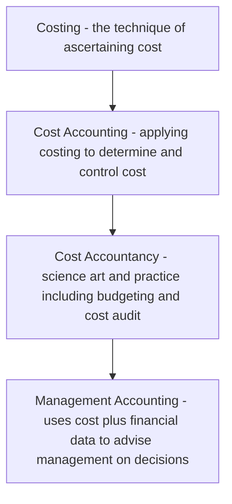
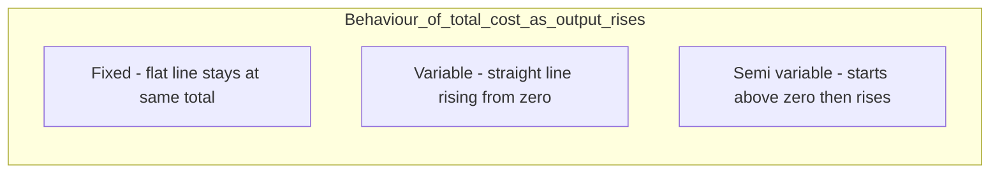
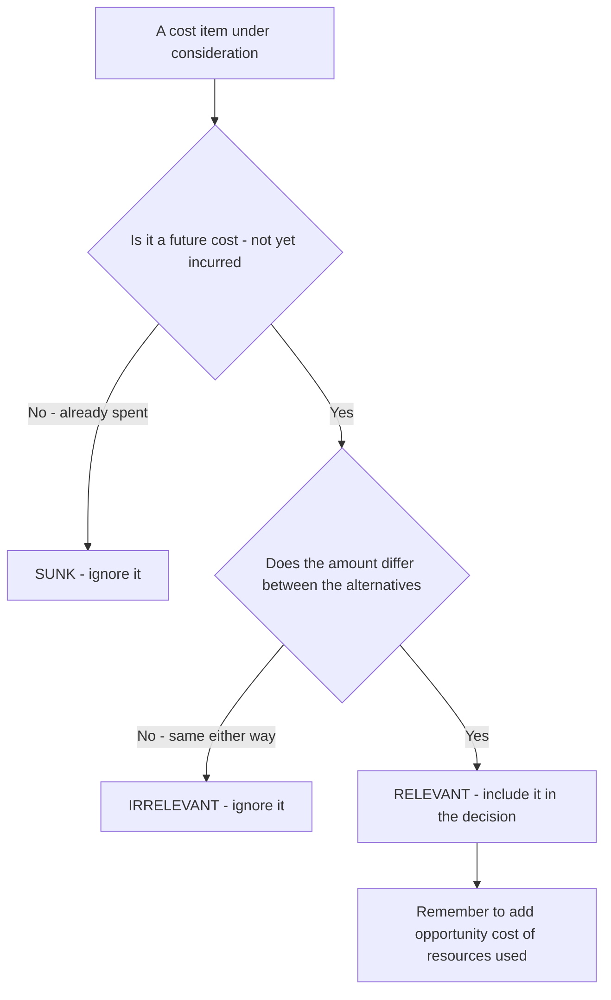
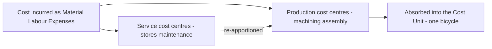
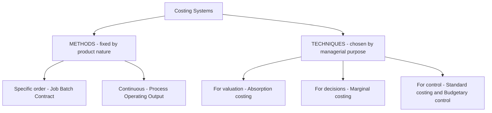
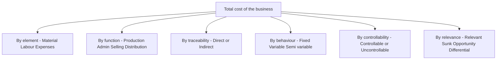

<!-- v2-deep -->

# Chapter 01 — Introduction to Cost & Management Accounting

## 1. The Problem — A Decision Financial Accounting Refuses to Answer

Imagine you run **Deccan Cycles Ltd.**, a factory in Hyderabad making two models of bicycles: a *City* model and a *Racer* model. Your Chartered Accountant hands you the audited financial statements at year end. They are beautiful. They tell you the company earned a net profit of ₹42 lakh, that trade receivables stand at ₹1.8 crore, and that the balance sheet balances to the last rupee.

Now you sit across from that CA and ask five ordinary questions a manager must answer every single week:

1. A dealer will buy 500 City cycles but only if you drop the price to ₹4,200 each. Your "cost" per cycle in the accounts is ₹4,500. Do you refuse the order — or is ₹4,200 actually *profitable*?
2. The Racer line is "losing money." Should you shut it down? Will profit go *up* or *down* if you do?
3. Your foreman overspent on power this month. Was that his fault, or did the electricity board raise tariffs? Whom do you hold responsible?
4. You can either make brake-cables in-house or buy them from a vendor at ₹90. Which is cheaper — and cheaper by how much?
5. What price should you *quote* tomorrow for a custom order of 200 cycles that has never been made before?

The financial statements are **silent on every one of these.** They were never built to speak. Financial accounting (FA) looks *backward* at the business *as a whole*, aggregates everything into totals, and reports to *outsiders* (shareholders, tax authorities, lenders) under a legal framework (Companies Act, Accounting Standards). Its unit of analysis is the *entire entity over a past period*. That is exactly the wrong lens for the five questions above, because each question is about a **part** of the business (one product, one order, one department), looks *forward*, and is asked by an *insider* who can still change the outcome.

> **The problem cost accounting solves:** managers must make forward-looking decisions about *parts* of a business — pricing, product mix, make-or-buy, cost control, shutdown — and financial accounting, by design, delivers only backward-looking totals for the *whole*. We need a second accounting system whose entire purpose is to attach cost to the *right object* (a product, a job, a process, a department) at the *right time* and in the *right form* for the *specific decision at hand*.

This chapter builds the vocabulary and the classification logic of that second system. Every concept here exists because *some decision needs it*. If you ever catch yourself memorizing a classification without knowing which decision it serves, stop — you have missed the point.

### 1.1 Three accounting systems, not two — where each one lives

Students arrive thinking there are two systems (financial and cost). There are really **three overlapping information systems**, and the exam repeatedly tests the boundaries between them:

| System | Primary audience | Time focus | Governed by | Core question |
|---|---|---|---|---|
| **Financial accounting** | External (shareholders, lenders, tax, regulators) | Past | Companies Act 2013, Accounting Standards / Ind AS | "What did the *whole entity* earn and own?" |
| **Cost accounting** | Internal + statutory cost records/audit where applicable | Past *and* future | ICAI Cost Accounting Standards (CAS); Sec. 148 cost records/audit for notified industries | "What did *this product/job/process* cost and why?" |
| **Management accounting** | Internal (managers) only | Overwhelmingly future | *No* external rulebook — whatever aids the decision | "What should we *do* next?" |

The trap to internalise now: **cost accounting is partly regulated, management accounting is not.** Certain companies must maintain **cost records** and undergo a **cost audit** under Section 148 of the Companies Act 2013 (industries and turnover thresholds are notified by the government — *verify current notified list and thresholds against current ICAI material / relevant AY*). Management accounting has **no** statutory format, no compulsory audit, and no prescribed periodicity — precisely because a rulebook would blunt its usefulness.

### 1.2 Cost accounting vs. management accounting — the finer line

Because Section 2 folds them together conceptually, the exam likes a crisp distinction:

- **Cost accounting** *ascertains and controls cost*. It is quantitative, largely monetary, and can stand alone.
- **Management accounting** *uses cost data plus financial data plus non-financial and qualitative data* (market trends, staff morale, economic outlook) to *advise* management. It is broader, more subjective, forward-looking, and cannot function without the other two feeding it.

One clean line for the exam: *cost accounting is a subset of the raw material; management accounting is the finished advice.* Management accounting has **no fixed conventions or double-entry discipline** — it will happily present a one-page contribution statement that would never pass as a financial account.

---

## 2. The Core Idea — A Camera vs. an X-Ray, and a Wardrobe of Lenses

Financial accounting is a **group photograph** of the family taken once a year: everyone in one frame, smiling, verified, framed on the wall for visitors. It is truthful and complete — but you cannot use it to diagnose a broken bone.

Cost accounting is the **X-ray machine and the whole diagnostic lab.** It does not care about the pretty group photo. It cares about *this bone*, *this organ*, *this symptom*. It slices the business into thin cross-sections — this product, this batch, this hour of machine time — so a manager can *diagnose and act*.

But here is the deeper idea, the one that unlocks the whole subject:

> **Cost is not a single fixed number. It is a *number-for-a-purpose*. The same rupee of spending gets classified differently depending on the question you are asking.**

Think of cost data as raw light, and each *classification* as a different **lens** you snap onto the same camera:

- Want to trace cost to a product? Use the **direct / indirect** lens.
- Want to predict what happens if volume changes? Use the **fixed / variable** lens.
- Want to fix responsibility on a manager? Use the **controllable / uncontrollable** lens.
- Want to decide on a one-off order? Use the **relevant / sunk** lens.

There is no "true" classification of a factory rent or a foreman's salary in the abstract. There is only "how should I classify this *for the decision in front of me*." Master the wardrobe of lenses and *when to reach for each*, and cost accounting stops being a memory test and becomes a thinking tool.

### 2.1 The one rupee, five labels — a concrete demonstration

To feel the "number-for-a-purpose" idea in the bone, take a *single* item — the **₹2,00,000 monthly salary of the City-line foreman** — and watch it wear five different labels depending on the question:

| The question a manager asks | Lens applied | Label the ₹2,00,000 wears |
|---|---|---|
| What did the City line cost to run? | Traceability (to the *line*) | **Direct** to the line, but **indirect** to a single cycle |
| What happens to cost if we make 10% more cycles? | Behaviour | **Fixed** (salary won't move within capacity) |
| Does it sit in closing stock or hit this month's P&L? | Period-attach | **Product cost** (part of factory overhead, inventoriable) |
| Is the works manager answerable for it? | Controllability | **Controllable** by the works manager, **uncontrollable** by the foreman himself |
| Should we accept a special order using idle time? | Relevance | **Irrelevant / sunk** for that order (already committed, doesn't change) |

*Same ₹2,00,000. Five questions. Five different — and all correct — classifications.* This table is the entire philosophy of the subject compressed into one number; if a classification ever feels arbitrary, ask "for which of these questions?"

---

## 3. Why It's Built This Way — The Logic Behind a Separate System

Why not just make financial accounting more detailed and be done with it? Because the *constraints* on FA are incompatible with the *needs* of decision-making. Look at the tensions:

| Constraint on FA | Why it blocks decisions | What cost accounting does instead |
|---|---|---|
| Must follow Accounting Standards / Companies Act | Rules optimize for comparability across firms, not usefulness to *this* manager | Free to use any method that aids the decision — no external rulebook |
| Reports the whole entity | Hides which product or department is the problem | Reports by cost centre / cost unit — the *part* |
| Historical, period-end | A decision is dead by the time year-end arrives | Continuous, real-time, and *future*-oriented (budgets, standards, estimates) |
| Records only actual transactions | A decision often hinges on cost *not* incurred (opportunity, notional) | Can bring in opportunity cost, notional rent/interest, imputed costs |
| Values inventory at total cost | Fine for the balance sheet, misleading for a shutdown or extra-order decision | Splits cost into fixed vs. variable so the *avoidable* part is visible |

The design principle is: **an information system must be shaped by the decision it feeds, not by an external compliance rulebook.** Since managers face many *different* decisions, cost accounting cannot offer one number; it must offer a *classified* number and the discipline to pick the right classification. That is why the beating heart of this whole subject is **cost classification** — and why the CA syllabus makes you learn *many* ways to slice the same cost.

Two definitions to anchor the vocabulary (classic CIMA/ICMA terminology — exam-acceptable):

> **Caveat on sourcing:** the wordings below are the traditional CIMA/ICMA terminology definitions, *not* CAS-1. **CAS-1** ("Classification of Cost") defines cost as *"a measurement, in monetary terms, of the amount of resources used for the purpose of production of goods or rendering of services."* If a theory question asks for the **CAS-1** definition, quote that ICAI wording; verify against your current ICAI module.

- **Cost** — the amount of expenditure (actual or notional) incurred on, or attributable to, a specified thing or activity. Note "notional": cost accounting can count sacrifices FA never records.
- **Costing** — the *technique and process* of ascertaining cost.
- **Cost Accounting** — the *formal application* of costing principles, methods and techniques to the process of determining and controlling costs.
- **Cost Accountancy** — the *widest* term: the science, art and practice of a cost accountant, embracing costing, cost accounting, budgetary control, cost control, and cost audit for managerial decision-making.

Nest these like Russian dolls: **Costing ⊂ Cost Accounting ⊂ Cost Accountancy**, with **Management Accounting** as the outermost layer that *uses* all of them plus financial data to actually advise management.

*Figure 3.1 — Cost concepts nest inside progressively wider disciplines; management accounting sits at the top and consumes the rest.*

### 3.1 Objectives of cost accounting — what the system is actually *for*

The exam sometimes asks bluntly "state the objectives / functions of cost accounting." Do not list at random; every objective maps to one of *three verbs* — **ascertain, control, decide**:

| Verb | Objectives it covers |
|---|---|
| **Ascertain** | Ascertain cost per unit; analyse cost by element, function and behaviour; ascertain profitability of each product/job/process |
| **Control** | Control cost through standards and budgets; disclose waste, idle time, spoilage; fix responsibility for variances |
| **Decide** | Provide data for pricing, make-or-buy, mix, shutdown; guide expansion, tenders and quotations; assist policy formulation |

A fourth, quieter objective is **statutory** — to maintain cost records and enable cost audit where the law requires it. If you can group your answer under *ascertain / control / decide (+ comply)*, you will never blank on this question.

### 3.2 Cost control vs. cost reduction — a favourite two-marker

These sound identical and are relentlessly confused:

| | Cost **control** | Cost **reduction** |
|---|---|---|
| Aim | Keep cost *within* a predetermined standard/budget | *Permanently* lower cost *below* the current standard |
| Assumes standard is | Correct and to be *achieved* | Itself *challengeable* — the standard can be beaten |
| Nature | Retains existing conditions; conservative | Questions everything; dynamic and continuous |
| Ends when | The target is met | Never — it is an ongoing programme |
| Example | Stopping power overspend against budget | Redesigning the frame to use less steel forever |

Memory hook: *control fights to reach the line; reduction moves the line.*

### 3.3 Prerequisites of a good (ideal) costing system

An exam may ask "what makes a costing system good?" The answer is not "accuracy at any price." A good system is: **simple, tailored** to the business (not copied off the shelf), **cost-effective** (its benefit must exceed its cost — the *principle of the marginal utility of information*), **comparable** period to period, **flexible** to change, **accurate but timely** (a roughly-right number today beats a precisely-right one next month), and **reconcilable** with financial accounts. The single deepest principle: *a costing system is itself subject to a cost-benefit test.* Elaborate systems that cost more than the decisions they improve are bad systems, however precise.

---

## 4. Full Technical Content — Every Concept Wrapped in Its Decision

### 4.1 The Elements of Cost — the raw material of every classification

Before we can slice cost cleverly, we need the three natural building blocks. Every rupee a factory spends is one of three **elements**:

1. **Material** — physical inputs (steel tubes, tyres, paint).
2. **Labour** — human effort (welders, painters, supervisors).
3. **Expenses** — everything else (power, rent, depreciation, royalty).

Each element then splits by *traceability* into **Direct** and **Indirect** (we justify this split in 4.2). Stacking the elements gives the famous cost build-up:

| Build-up stage | Formula | What it captures |
|---|---|---|
| **Prime Cost** | Direct Material + Direct Labour + Direct Expenses | The cost that *belongs* to the product directly |
| **Works / Factory Cost** | Prime Cost + Factory (Works) Overhead | Everything spent *inside* the factory |
| **Cost of Production** | Works Cost + Administration Overhead (production-related) | Cost of a finished, ready-to-sell unit |
| **Cost of Goods Sold** | Cost of Production ± Opening/Closing finished-goods stock | Cost of what actually *left* the door |
| **Cost of Sales / Total Cost** | COGS + Selling & Distribution Overhead | Full cost to get the product into a customer's hands |
| **Sales** | Total Cost + Profit (or − Loss) | The top line |

**Overhead** is simply the sum of all *indirect* costs (indirect material + indirect labour + indirect expenses). It is grouped by function into **Factory/Works**, **Administration**, and **Selling & Distribution** overhead — because a manager controlling the shop floor should not be judged on the sales team's advertising spend. *Function-wise grouping serves responsibility.*

**The 3×2 grid — the compact way to see all six element-type combinations.** Because each of the three elements splits into direct/indirect, there are exactly six cells, and the exam expects you to place any expense into the right one:

| | Direct (traceable to unit) | Indirect (overhead) |
|---|---|---|
| **Material** | Steel tubes, tyres in a cycle | Lubricating oil, cotton waste, small consumable stores |
| **Labour** | Welder's, painter's wages on the line | Foreman's salary, storekeeper, security guard |
| **Expenses** | Design royalty per cycle, hire of a special tool for one job | Factory rent, depreciation of shared plant, insurance |

*Direct expenses* (also called **chargeable expenses**) are the least intuitive cell — they are non-material, non-labour costs that can still be traced to *one* cost unit: a job-specific tool hire, a specific-design royalty, cost of a special drawing bought for one contract. Missing this cell is a classic slip.

### 4.2 Classification by Traceability — Direct vs. Indirect

> **Decision served:** "What did *this product / job* actually cost?" and "Which costs can I honestly *trace* versus which must I *spread*?"

- **Direct cost** — can be *conveniently and economically traced* to a specific cost object (a product, job, or process). Steel tubes going into a City cycle are direct material; the welder's wages on that line are direct labour; a design royalty paid per cycle is a direct expense.
- **Indirect cost (overhead)** — *cannot* be economically traced to one unit, so it must be *apportioned/absorbed* using some basis. The factory manager's salary, factory rent, and lubricating oil serve *many* products at once.

The dividing line is **convenience/economy of tracing, not physical importance.** Nails in furniture are physically part of the product but so cheap to track individually that we treat them as *indirect* material. The whole point is that direct costs give a *reliable* product cost, while indirect costs need a defensible *sharing rule* (covered in the Overheads chapter). Get the split wrong and every product-cost, price and mix decision downstream is polluted.

**The cost object is not fixed — it moves.** "Direct" and "indirect" are meaningless until you *name the cost object*. The foreman's salary is **indirect** if the cost object is *one cycle*, but **direct** if the cost object is *the whole City line*. When an examiner changes the cost object mid-question ("now treat each department as the cost object"), a cost can flip from indirect to direct without a single rupee changing. Always fix the cost object first.

**Why we don't trace everything even when we could.** Modern barcoding could, in principle, trace every drop of glue to a unit. We deliberately do not, because the *cost of measuring* the cost would exceed the *value of knowing* it — the same cost-benefit principle from 3.3. "Convenient and economical" is doing real work in the definition; it is an *economic* test, not a physical one.

### 4.3 Classification by Behaviour — Fixed, Variable, Semi-Variable

> **Decision served:** "If I make 10% more (or fewer) units, what happens to cost — and therefore to profit?" This lens powers pricing, extra-order acceptance, break-even, and shutdown decisions. It is arguably the single most powerful lens in the subject.

Behaviour = how *total* cost reacts to changes in *activity level* (units, machine-hours) **within the relevant range**.

- **Variable cost** — total rises/falls *in proportion* to activity; *per-unit* stays constant. Direct material, direct wages (piece-rate), power for machines. Make zero cycles → zero material cost.
- **Fixed cost** — total stays *constant* regardless of activity (within the relevant range); *per-unit* falls as volume rises. Factory rent, manager's salary, straight-line depreciation. Whether you make 1 cycle or 1,000, the rent is ₹2,00,000.
- **Semi-variable (mixed) cost** — has both a fixed base and a variable slope. Electricity bill (fixed meter charge + per-unit usage), telephone, repairs. Must be *split* into its fixed and variable parts before use (via the **high-low method** or regression — detailed in the Marginal Costing chapter).

The counter-intuitive trap that behaviour explains: **fixed cost *per unit* is variable, and variable cost *per unit* is fixed.** Managers who reason on "cost per unit" without knowing behaviour make catastrophic pricing errors. That is *why* this lens exists — to stop you treating a fixed cost as if it changes with volume.

**The "relevant range" is the fine print that makes fixed cost honest.** No cost is fixed forever. Factory rent is fixed only *within a band of output* the current factory can hold; cross that band and you rent a second shed — the fixed cost jumps to a new plateau. This produces the **step (stepped) fixed cost**: constant over a range, then a discrete jump, then constant again (e.g., one supervisor per 20 workers — the 21st worker forces a second supervisor). Step costs are *fixed within each step but behave variably across wide swings*. Examiners plant them to see if you blindly hold a "fixed" cost constant when output doubles.

**Two ways a semi-variable cost can be shaped:**
- *Step-variable* pattern — small fixed plateaus that step up frequently (looks almost variable in the large).
- *Mixed* pattern — a genuine fixed intercept plus a smooth variable slope (the telephone bill). The **high-low method** isolates the slope: Variable rate = (Cost at high activity − Cost at low activity) ÷ (High units − Low units); the fixed part is then the balancing figure at either level.

**Engineered, committed, and discretionary fixed costs — a subtle sub-classification.** Not all fixed costs are equally sticky, and this matters for *which* fixed cost you can attack in a cost-cut:
- **Committed fixed cost** — flows from past capacity decisions; unavoidable in the short run (rent, depreciation of owned plant, insurance). You cannot cut it without shrinking capacity.
- **Discretionary (managed/programmed) fixed cost** — set afresh each year by management choice (advertising, R&D, training). It *can* be cut this year without touching capacity — which makes it the first target in a squeeze, and the examiner's favourite "which fixed cost is avoidable?" clue.

*Figure 4.1 — Total-cost behaviour against activity. Fixed cost is a flat line; variable cost is a ray from the origin; semi-variable starts at the fixed intercept and slopes up.*

### 4.4 Classification by Function / Attributability to the Period — Product vs. Period

> **Decision served:** "Which costs cling to the *unit* and sit in inventory until it is sold, and which costs expire with *time* and hit this period's profit regardless of sales?" This governs inventory valuation and the *timing* of profit.

- **Product cost (inventoriable)** — attaches to the product and is carried in inventory as an asset until the unit is sold. Under absorption costing this is *cost of production* (direct materials, direct labour, factory overhead). Unsold → sits on the balance sheet, not yet an expense.
- **Period cost** — relates to a *period*, not a *unit*; expensed in full when incurred. Selling, distribution and general administration costs (and, under *marginal* costing, *all* fixed overhead).

Why split them? Because *when* a cost becomes an expense changes reported profit. Load a cost into "product" and it can be parked in closing stock, deferring the hit; treat it as "period" and it bites now. This is the exact fault-line between **Absorption Costing and Marginal Costing** (a later chapter), and examiners love the profit *difference* it creates when stock levels change.

**The deep reason product cost defers profit.** A cost only becomes an *expense* when the matching principle releases it — and a product cost is matched against *revenue*, which arrives only on sale. So every rupee buried in a *product* cost rides into closing stock and waits on the balance sheet; every rupee stamped *period* is expensed on the calendar regardless of whether a single unit sold. That is why, when **closing stock rises**, absorption costing (which parks fixed factory overhead in the product) reports **higher** profit than marginal costing — it has deferred some fixed cost into stock. The classification is not academic; it moves the reported profit number.

### 4.5 Classification by Controllability — Controllable vs. Uncontrollable

> **Decision served:** "Whom do I hold *responsible* for this variance?" This is the foundation of **responsibility accounting** and performance appraisal — answering our foreman question from Section 1.

- **Controllable cost** — can be *influenced* by the action of a *specified* manager within a *given* time span. A shop supervisor controls material wastage and idle time on his line.
- **Uncontrollable cost** — cannot be influenced by that manager at that level. The supervisor cannot control the *apportioned* head-office rent or a government tariff hike.

Two subtleties that make this an *exam favourite*:
1. **Controllability is relative to a level and a time horizon.** Factory rent is uncontrollable for the foreman but *controllable* for the CEO negotiating the lease. Almost everything is controllable by *someone* over a *long enough* horizon.
2. You judge a manager *only* on what he controls — otherwise you punish people for tariff hikes and monsoons, and the whole incentive system collapses.

**Normal vs. abnormal — the cousin classification that decides costing treatment.** Closely tied to controllability is whether a cost is *normal* (expected, uncontrollable in the routine sense, and therefore *part of cost*) or *abnormal* (unexpected, avoidable, and therefore *excluded from cost and charged to the Costing Profit & Loss Account*). Normal idle time and normal spoilage are absorbed into product cost; **abnormal** idle time, abnormal loss, and abnormal wastage are stripped out so they do not distort the unit cost. This *"normal in, abnormal out"* rule is a recurring exam principle: abnormal items are held answerable separately rather than smeared across good units.

### 4.6 Classification by Relevance to a Decision — Relevant, Sunk, Opportunity, Differential

> **Decision served:** *any specific one-off choice* — accept/reject an order, make-or-buy, keep/replace a machine, shut down a line. This is the "decision-making" cluster and the intellectual peak of the chapter.

The single test for **relevance**: *a cost is relevant only if it is a **future** cost that **differs between the alternatives**.* Anything else is irrelevant noise, however large.

- **Sunk cost** — cost *already incurred*, unrecoverable, *unaffected* by any future decision. The ₹8,00,000 you already spent on a machine is sunk; it must be **ignored** when deciding whether to replace it. The most common managerial fallacy ("we've invested too much to quit now") is exactly the failure to ignore sunk cost.
- **Opportunity cost** — the value of the *next-best alternative forgone*. If using a spare machine for Order A means you cannot rent it out for ₹15,000, that ₹15,000 is a real cost of Order A — even though *no cheque is written and FA never records it.* This is precisely the kind of "notional" cost only cost accounting captures.
- **Differential (incremental) cost** — the *difference in total cost* between two alternatives. If Plan X costs ₹5,00,000 and Plan Y ₹5,60,000, the differential cost of Y is ₹60,000. When it's a *rise* it's *incremental*; a *fall* is *decremental*.
- **Marginal cost** — the *additional* cost of producing *one more* unit; in practice equals *variable cost per unit* within the relevant range. Drives the "accept the ₹4,200 order?" decision.
- **Avoidable vs. unavoidable cost** — costs that *disappear* if an activity is dropped (avoidable → relevant to a shutdown) versus those that *continue* regardless (unavoidable → irrelevant to that decision).
- **Imputed / notional cost** — a hypothetical cost not involving cash outflow, inserted for better decisions or comparability (e.g., notional interest on owner's capital, notional rent on own building). It makes a debt-free unit comparable to a financed one.
- **Replacement cost** — cost to *replace* an asset/material at *current* market prices, versus original historical cost — relevant when deciding on reorder or valuation in inflationary times.
- **Out-of-pocket cost** — the portion involving *actual cash* outflow (excludes non-cash items like depreciation) — relevant to short-run cash-constrained decisions.

**Two distinctions the examiner uses to catch you:**

- **Marginal cost vs. differential cost.** They are cousins but not twins. *Marginal* cost is strictly the cost of *one more unit* (per-unit, variable-cost based). *Differential* cost is the *total* cost gap between two *courses of action* and can include *changes in fixed cost* (e.g., a second supervisor, a step-cost jump). When an alternative pushes output past a capacity step, differential cost captures the fixed-cost jump that marginal cost, by definition, would miss.
- **Opportunity cost vs. sunk cost — mirror images.** Sunk cost is a *past, recorded* outflow that is *irrelevant*. Opportunity cost is a *future, unrecorded* sacrifice that is *highly relevant*. The examiner deliberately pairs them so the careless student includes the sunk cost (which FA recorded, so it "feels real") and omits the opportunity cost (which FA never recorded, so it "feels unreal"). The correct instinct is exactly the reverse.

**Explicit vs. implicit cost.** Explicit (out-of-pocket) costs involve actual cash payment and are recorded. Implicit (imputed, notional, opportunity) costs involve *no* cash payment and are *not* recorded by FA — yet many are relevant. This explicit/implicit cut is the bridge between "what the books show" and "what the decision needs," and it is why relevant-cost analysis so often *adds* items the financial accounts never contained.

*Figure 4.2 — The relevance filter: a cost enters a specific decision only if it clears both gates.*

### 4.7 Cost Centres and Cost Units — *where* and *per what* we collect cost

You cannot classify cost until you decide *where* to pool it and *per what* to express it. Two structural concepts:

**Cost Centre** — a *location, person, item of equipment, or group thereof* for which costs are *ascertained and controlled*. It is the *smallest segment of activity* for which costs are accumulated. It answers "*where* was the cost incurred / who is answerable?" Types:

- **Personal cost centre** — a *person* or group of persons (a works manager, a sales team).
- **Impersonal cost centre** — a *location or equipment* (a machine, a department, a delivery van).
- **Production cost centre** — where actual production/conversion happens (machining, assembly, welding shop).
- **Service cost centre** — supports production but does no conversion itself (stores, maintenance, canteen, boiler house). Its cost is *re-apportioned* to production centres.

A finer split the syllabus mentions: an impersonal production centre can be an **operation cost centre** (a group of similar machines/operations) or a **process cost centre** (a specific continuous process). And within personal/impersonal you may see **operation** vs **process** framing — the exam rarely pushes past naming them, but know they exist.

A related, wider idea is the **Responsibility Centre**, where a manager is accountable for defined items:
- **Cost centre** — responsible for *costs* only.
- **Revenue centre** — responsible for *revenues* only (e.g., a sales booking office that does not control the cost of goods).
- **Profit centre** — responsible for *costs and revenues* (hence profit).
- **Investment centre** — responsible for costs, revenues *and* the *capital invested* (judged on ROI / RI).

*Cost centre vs. cost unit in one line:* a **cost centre absorbs** cost (a place); a **cost unit carries** cost (a thing). Cost first pools in centres, then is absorbed into units.

*Why the hierarchy exists:* you localize cost to the smallest sensible unit so that control and responsibility can be pinned precisely (ties straight back to 4.5 controllability).

**Cost Unit** — the *unit of product or service* to which costs are ascertained, i.e., the *unit of measurement* of cost. It answers "*per what* do we express cost?" It must be the natural unit customers and managers think in:

| Industry | Typical cost unit |
|---|---|
| Cement / Steel / Sugar | per tonne |
| Automobile / Cycle | per vehicle / per cycle |
| Electricity | per kilowatt-hour (kWh) |
| Transport (goods) | per tonne-kilometre |
| Passenger transport | per passenger-kilometre |
| Hospital | per patient-day / per bed-day |
| Hotel | per room-day |
| Gas | per cubic metre |
| Brick-making | per 1,000 bricks |
| Professional services | per chargeable hour |
| Oil / petroleum | per barrel / per litre or tonne |
| Paper | per ream |
| Cotton textiles / yarn | per kg / per bale |
| Chemicals | per litre / kg / tonne |
| Advertising | per enquiry / per response |

Notice several are **composite units** (tonne-km, passenger-km, patient-day): they combine *two* dimensions because a single dimension would mislead — moving 1 tonne 100 km is not the same effort as moving 100 tonnes 1 km, yet both are "100 tonne-km." *The unit is chosen to make cost comparisons fair.*

*Figure 4.3 — Cost flows through centres and is finally expressed per cost unit.*

### 4.8 Methods vs. Techniques of Costing — a two-axis map

Students constantly confuse these. They are *orthogonal* — you pick one **method** *and* one-or-more **techniques** simultaneously.

**Methods** answer *"how is production organized, so how do we collect cost?"* The method is dictated by the **nature of the product/industry**, and you do not get to choose it freely.

| Method | When used | Cost object |
|---|---|---|
| **Job costing** | Distinct, custom jobs to order | Each job |
| **Batch costing** | Identical items made in batches (pharma tablets, cycles in lots) | Each batch (then ÷ units) |
| **Contract costing** | Large, long-duration, site-based jobs (construction) | Each contract |
| **Process costing** | Continuous mass production, output homogeneous (chemicals, sugar, paint) | Each process; cost averaged over output |
| **Operating (Service) costing** | Services, not products (transport, hospital, power) | The service cost unit (per km, per bed-day) |
| **Single/Output costing** | One product, continuous (mining, cement) | Per tonne / unit |
| **Multiple/Composite costing** | Product assembled from many components (car, cycle, TV) | Blend of the above |

*Job/Batch/Contract are all "specific order" costing; Process/Operating are "continuous operation" costing.* The dividing question is: **is output made to a specific customer order (→ specific-order methods) or produced continuously in a stream (→ process/operating)?**

**Only two methods really exist — the rest are variants.** At the deepest level there are just two ways to collect cost, because there are only two ways to organise production:
- **Specific-order (job) costing** — production in *identifiable, separable units/lots to order*; cost is collected *per job/batch/contract*. Job, batch and contract costing are the same idea at three scales (one item → a lot → a giant site job).
- **Continuous-operation (process) costing** — production in an *unbroken stream of identical output*; cost is collected *per process and averaged over units*. Process, operating/service, and single-output costing are all this idea.

Everything else (multiple/composite) is a *blend* of the two. If you can answer "identifiable job or continuous stream?", the method almost picks itself — this is the single most reliable way to nail a "which method?" question.

**Techniques** answer *"what principle do we apply to the collected cost, for control or decision-making?"* You *choose* the technique to suit the *managerial purpose*, and you can overlay it on *any* method.

| Technique | Purpose it serves |
|---|---|
| **Absorption (Total/Full) costing** | Charge *all* costs (fixed + variable) to units — needed for inventory valuation & external reporting |
| **Marginal (Variable) costing** | Charge only *variable* cost to units, treat fixed as period cost — for decisions (pricing, mix, make-or-buy) |
| **Standard costing** | Set predetermined costs and analyse *variances* — for control |
| **Budgetary control** | Plan via budgets and compare actuals — for planning & control |
| **Uniform costing** | Common costing principles across firms — for inter-firm comparison |
| **Historical costing** | Ascertain cost *after* it is incurred |

**The mental model:** *Method* is chosen by the **product** (given to you); *Technique* is chosen by the **decision** (chosen by you). A cycle-maker uses **batch costing (method)** and may apply **standard + marginal costing (techniques)** on top. A hospital uses **operating costing (method)** with **budgetary control (technique)**.

**Historical vs. predetermined — the time axis cuts across techniques.** Costing can also be split by *when* the cost is ascertained: **historical costing** (after the event — accurate but too late to control) versus **predetermined costing** (before, using standards/estimates — enables control but risks estimation error). Standard costing is a *predetermined* technique; it only becomes useful for control *because* it is set in advance and compared to the historical actual. This time axis is why the two coexist rather than compete.

*Figure 4.4 — Costing splits into methods driven by product nature and techniques driven by managerial purpose.*

### 4.9 The master map of cost classification — one figure to see all lenses at once

Everything in Section 4 is really *one idea* — take the pool of total cost and cut it along whichever axis the decision needs. Seeing all the axes together prevents the commonest confusion: treating classifications as rival "types of cost" rather than as *parallel cuts of the same rupee*.

*Figure 4.5 — The same total cost, cut along six independent axes; you may apply several cuts at once to one item.*

The key exam habit this figure trains: when a problem hands you a cost, silently ask *which axis is this question on?* A shutdown question is on the **relevance** and **behaviour** axes; a performance-appraisal question is on the **controllability** axis; a cost-sheet question is on the **element/function/traceability** axes. Reading the axis correctly is 80% of the answer.

---

## 5. Worked Examples — From Warm-Up to Exam-Hard

### Worked Example 1 (Easy) — Building a Cost Sheet from Elements

**Data (Deccan Cycles, City model, for the month):** Direct material consumed ₹6,00,000; Direct wages ₹2,40,000; Direct expenses (design royalty) ₹60,000; Factory overhead ₹1,80,000; Administration overhead (production-related) ₹90,000; Selling & distribution overhead ₹1,10,000; Profit margin: 20% on sales. Units produced and sold: 400 cycles. **Prepare the cost sheet and find the selling price per cycle.**

**Step 1 — Prime Cost:** Direct Material + Direct Labour + Direct Expenses = 6,00,000 + 2,40,000 + 60,000 = **₹9,00,000**.

**Step 2 — Works (Factory) Cost:** Prime Cost + Factory OH = 9,00,000 + 1,80,000 = **₹10,80,000**.

**Step 3 — Cost of Production:** Works Cost + Admin OH = 10,80,000 + 90,000 = **₹11,70,000**. (No opening/closing WIP or finished stock given, so Cost of Production = COGS.)

**Step 4 — Cost of Sales (Total Cost):** COGS + S&D OH = 11,70,000 + 1,10,000 = **₹12,80,000**.

**Step 5 — Profit and Sales.** Profit is 20% *on sales*, so cost is 80% of sales. Sales = Total Cost ÷ 0.80 = 12,80,000 ÷ 0.80 = **₹16,00,000**. Profit = 16,00,000 − 12,80,000 = ₹3,20,000 (check: 20% × 16,00,000 = 3,20,000 ✓).

| Cost Sheet — City model (400 cycles) | Total (₹) | Per cycle (₹) |
|---|---:|---:|
| Direct Material | 6,00,000 | 1,500 |
| Direct Wages | 2,40,000 | 600 |
| Direct Expenses | 60,000 | 150 |
| **Prime Cost** | **9,00,000** | **2,250** |
| Factory Overhead | 1,80,000 | 450 |
| **Works Cost** | **10,80,000** | **2,700** |
| Administration Overhead | 90,000 | 225 |
| **Cost of Production / COGS** | **11,70,000** | **2,925** |
| Selling & Distribution OH | 1,10,000 | 275 |
| **Cost of Sales** | **12,80,000** | **3,200** |
| Profit (20% on sales) | 3,20,000 | 800 |
| **Sales** | **16,00,000** | **4,000** |

**Selling price = ₹4,000 per cycle.** Every subtotal reconciles top-to-bottom.

---

### Worked Example 1B (Easy-Medium) — Same Cost Sheet *With Stock Movements* (the adjustment the examiner adds next)

The moment you are comfortable with Example 1, the examiner reruns it with stocks — to test *at which level* each stock adjusts. Same monthly figures as Example 1, but now:

- **Raw material:** Opening stock ₹50,000; Purchases ₹6,30,000; Closing stock ₹80,000. (So *material consumed* is derived, not given.)
- **Work-in-progress (at works cost):** Opening ₹40,000; Closing ₹70,000.
- **Finished goods:** Opening 20 cycles valued ₹58,500; Closing 30 cycles (value them at *this month's* cost of production per unit).
- Direct wages ₹2,40,000; Direct expenses ₹60,000; Factory OH ₹1,80,000; Admin OH ₹90,000; S&D OH ₹1,10,000. Selling price ₹4,000/cycle. Cycles *produced* this month: 400.

**Step 1 — Material consumed** (adjust *before* prime cost): 50,000 + 6,30,000 − 80,000 = **₹6,00,000**. (Deliberately equals Example 1 so we can isolate the stock effect.)

**Step 2 — Prime Cost** = 6,00,000 + 2,40,000 + 60,000 = **₹9,00,000**.

**Step 3 — Gross Works Cost then adjust WIP** (WIP adjusts at *works* level): 9,00,000 + 1,80,000 = 10,80,000; add opening WIP 40,000, less closing WIP 70,000 → **Works Cost = ₹10,50,000**.

**Step 4 — Cost of Production** (of the 400 finished this month) = 10,50,000 + 90,000 Admin = **₹11,40,000**, i.e., **₹2,850 per cycle** (11,40,000 ÷ 400). *Value closing FG at this ₹2,850.*

**Step 5 — Cost of Goods Sold** (finished-goods stock adjusts *after* cost of production): Opening FG 58,500 + Cost of Production 11,40,000 − Closing FG (30 × 2,850 = 85,500) = **₹11,13,000**.

**Cross-check the units:** Opening 20 + Produced 400 − Closing 30 = **390 cycles sold**.

**Step 6 — Cost of Sales** = COGS 11,13,000 + S&D 1,10,000 = **₹12,23,000**.

**Step 7 — Sales, Profit.** Sales = 390 × 4,000 = **₹15,60,000**. Profit = 15,60,000 − 12,23,000 = **₹3,37,000** (≈ ₹864 per cycle sold; ≈ 21.6% on sales — note it is *not* a clean 20% now, because opening stock came in at last month's lower ₹2,925-ish cost).

**The learning:** three stocks, three *different levels* — raw material *before* prime cost, WIP *at works cost*, finished goods *after cost of production*. Put any one at the wrong level and COGS is wrong. This single reconciliation is worth more marks than memorising the skeleton.

---

### Worked Example 2 (Medium) — The Special-Order Decision (Relevant Cost in Action)

Recall Section 1's dilemma. The *accounts* say each City cycle "costs" ₹3,200 (cost of sales) or ₹2,925 (cost of production). A dealer offers **₹4,200 each for 500 extra cycles**, a one-off export order that needs **no selling & distribution effort** (dealer collects at the gate). Current output is *within* capacity, so no new fixed costs arise. **Should you accept?**

**The wrong answer** (the trap): "Cost is ₹3,200, price is ₹4,200 — but wait, are all costs covered? The order price ₹4,200 > full cost ₹3,200, accept." Right conclusion here, but often the price offered is *below* full cost and the naïve manager wrongly *rejects*. The discipline is to use **relevant cost only.**

**Step 1 — Identify cost behaviour** from Example 1's per-cycle figures. Classify each as variable (changes with the extra 500 units) or fixed (won't change within capacity):

| Element | Per cycle (₹) | Behaviour | Relevant to extra order? |
|---|---:|---|---|
| Direct Material | 1,500 | Variable | Yes |
| Direct Wages | 600 | Variable | Yes |
| Direct Expenses (royalty per cycle) | 150 | Variable | Yes |
| Factory Overhead (assume fixed) | 450 | Fixed | **No** — capacity already paid for |
| Administration OH | 225 | Fixed | **No** |
| Selling & Distribution OH | 275 | Fixed/avoided here | **No** — dealer collects |

**Step 2 — Relevant (marginal) cost per cycle** = 1,500 + 600 + 150 = **₹2,250** (this equals Prime Cost because only the direct/variable elements are relevant).

**Step 3 — Incremental analysis for 500 cycles:**

| | Per cycle (₹) | 500 cycles (₹) |
|---|---:|---:|
| Incremental revenue | 4,200 | 21,00,000 |
| Less: Relevant (marginal) cost | 2,250 | 11,25,000 |
| **Incremental contribution / profit** | **1,950** | **9,75,000** |

**Decision: ACCEPT.** The order adds **₹9,75,000** to profit. The ₹450 factory OH, ₹225 admin OH and ₹275 S&D per cycle are **irrelevant** (fixed/sunk within capacity). Had you judged against full cost ₹3,200 you'd still accept here — but the *method* is what matters: if the offer had been ₹2,800 (below ₹3,200 full cost but above ₹2,250 marginal cost) the naïve manager rejects and *loses* ₹550 × 500 = ₹2,75,000 of contribution. *This is exactly the decision FA cannot make and cost classification exists to enable.*

**Caveat to state in an exam:** valid only if (a) spare capacity exists, (b) the export price won't leak into the domestic market and spoil the ₹4,000 price, and (c) no better alternative use of capacity exists (else add its **opportunity cost**).

**"What if the examiner tweaks it?" — three standard twists and how each flips the answer:**

- *Twist A — no spare capacity.* If the 500 cycles displace 500 regular sales at ₹4,000 (contribution ₹1,750 each), the **opportunity cost** of the displaced sales is 500 × 1,750 = ₹8,75,000. Net gain = incremental contribution 9,75,000 − 8,75,000 = **₹1,00,000**. Still accept, but the margin is now thin — and if the special price were ₹4,000 it would be a wash.
- *Twist B — the order needs a one-off special jig costing ₹5,00,000.* That ₹5,00,000 is a *future, order-specific* fixed cost — **relevant and avoidable**. Net = 9,75,000 − 5,00,000 = **₹4,75,000**; still accept. (Contrast with a jig *already bought* for a cancelled order — that would be *sunk* and ignored.)
- *Twist C — accepting forces overtime raising variable wages by ₹300/cycle.* Marginal cost rises to ₹2,550; contribution falls to ₹1,650 × 500 = ₹8,25,000. Accept, but the point is the *marginal cost is not frozen* — read whether the extra volume changes any variable rate.

---

### Worked Example 3 (Exam-Hard) — Shutdown, Sunk Cost & Opportunity Cost Combined; plus a Composite Cost Unit

**Part A — Product-line shutdown.** Deccan's *Racer* line shows this annual statement, and the board wants to *drop* it because it "loses ₹1,20,000":

| Racer line (per annum) | ₹ |
|---|---:|
| Sales (2,000 cycles @ ₹5,000) | 1,00,00,000 |
| Less: Variable costs (@ ₹3,400/cycle) | 68,00,000 |
| **Contribution** | **32,00,000** |
| Less: Fixed costs charged to line | 33,20,000 |
| **Reported "loss"** | **(1,20,000)** |

Of the ₹33,20,000 fixed costs, **₹21,00,000 is apportioned head-office/common cost** that will *continue* even if the Racer line closes (unavoidable), and only **₹12,20,000 is specific to the Racer line** and would be *saved* on closure (avoidable). A machine currently used by the Racer line could, if the line closes, be **rented out for ₹2,50,000 p.a.** (opportunity cost of keeping the line running). Two years ago the company spent **₹40,00,000** developing the Racer design. **Should the line be shut down?**

**Step 1 — Discard the sunk cost.** The ₹40,00,000 design spend is *sunk* — already incurred, unrecoverable, identical under "keep" or "close." **Ignore it entirely.** (The classic "we spent 40 lakh, we can't quit" fallacy is precisely what we must resist.)

**Step 2 — Identify what actually changes on closure (relevant items only):**

| On shutting the Racer line | ₹ |
|---|---:|
| Contribution *lost* (foregone) | (32,00,000) |
| Specific/avoidable fixed cost *saved* | 12,20,000 |
| Rental income *gained* (opportunity now realised) | 2,50,000 |
| **Net change in profit if shut down** | **(17,30,000)** |

**Step 3 — Decision.** Shutting down makes the company **₹17,30,000 *worse* off** per year. The apportioned ₹21,00,000 common cost continues either way, so the "₹1,20,000 loss" is an *accounting artefact* of arbitrary apportionment. **Keep the Racer line running.** Proof by rebuilding total profit both ways:

| Company profit impact of the Racer line | Keep (₹) | Close (₹) |
|---|---:|---:|
| Contribution from Racer | 32,00,000 | 0 |
| Rent income (machine) | 0 | 2,50,000 |
| Specific fixed cost | (12,20,000) | 0 |
| Common fixed cost (continues regardless) | (21,00,000) | (21,00,000) |
| **Net effect** | **(1,20,000)** | **(18,50,000)** |

Keeping the line leaves the firm ₹17,30,000 better off (−1,20,000 vs −18,50,000). Reconciles with Step 2. **The line stays.** *Notice how four classifications — variable/fixed, avoidable/unavoidable, sunk, and opportunity — had to work together for one decision.*

**"What if the examiner tweaks it?" — the shutdown point.** Suppose instead the specific/avoidable fixed cost were ₹35,00,000 and rental ₹2,50,000. Then closure would *save* 35,00,000 + 2,50,000 = 37,50,000 while *losing* only 32,00,000 contribution → net **+₹5,50,000** to shut. The rule that pops out is the **shutdown test**: close only when *avoidable fixed cost saved + opportunity gains > contribution lost*. Equivalently, keep running as long as the segment earns **any contribution towards common fixed cost** after covering its own avoidable fixed cost. A negative-contribution line, by contrast, should close even before considering fixed cost.

**Part B — Choosing and computing a composite cost unit (Operating costing).** Deccan runs a delivery lorry to ship cycles to dealers. In a month it makes the trips below; running cost for the month is **₹96,000**. Management wants the **cost per tonne-kilometre** (the fair unit, because it captures *both* load and distance).

| Trip | Distance one way (km) | Load carried outward (tonnes) | Return load (tonnes) |
|---|---:|---:|---:|
| A | 40 | 6 | 0 (empty) |
| B | 60 | 5 | 2 |
| C | 30 | 8 | 4 |

**Step 1 — Decide the unit.** A plain "per km" would reward driving far with a light load; "per tonne" ignores distance. The **tonne-km** (tonnes × km) fairly measures haulage effort — *that is why operating costing uses composite units.*

**Step 2 — Compute effective tonne-km** (each leg = load on that leg × its distance; the return distance equals the outward distance):

| Trip | Outward tonne-km | Return tonne-km | Total |
|---|---:|---:|---:|
| A | 6 × 40 = 240 | 0 × 40 = 0 | 240 |
| B | 5 × 60 = 300 | 2 × 60 = 120 | 420 |
| C | 8 × 30 = 240 | 4 × 30 = 120 | 360 |
| **Total** | | | **1,020** |

**Step 3 — Cost per tonne-km** = Total running cost ÷ Total tonne-km = 96,000 ÷ 1,020 = **₹94.12 per tonne-km** (to 2 dp).

This single figure lets management benchmark the lorry month-on-month, decide freight quotes, and compare against a third-party transporter — *decisions the financial P&L's lump "transport expense ₹96,000" could never support.*

**Absolute vs. commercial tonne-km — the tweak that changes the denominator.** What we computed (load on each *actual* leg × distance) is the **absolute tonne-km** and is the *stricter, fairer* basis. Some questions instead ask for **commercial tonne-km** = average load × *total* distance. Here total distance travelled = 2 × (40 + 60 + 30) = 260 km, and average load across all legs = 1,020 ÷ 260 ≈ 3.92 t, so commercial tonne-km ≈ 1,020 too — but the moment the examiner defines "average load" differently (e.g., simple mean of only the loaded legs), the two diverge sharply. *Always read which basis is asked; the empty return leg is the pivot the examiner watches.*

---

### Worked Example 4 (Medium-Hard) — Make-or-Buy with an Opportunity Cost Sting

The brake-cable question from Section 1. Deccan currently *makes* the brake-cable set in-house. A vendor offers to *supply* it at **₹90 per set**. In-house cost per set is recorded as:

| In-house cost per brake-cable set | ₹ |
|---|---:|
| Direct material | 40 |
| Direct labour | 22 |
| Variable factory overhead | 12 |
| Fixed factory overhead (apportioned) | 18 |
| **Total "cost" per set** | **92** |

Naïve reading: "We make it for ₹92, vendor sells at ₹90 — **buy**, save ₹2." **Test this properly.**

**Step 1 — Strip to relevant (avoidable) cost of making.** The ₹18 fixed overhead is *apportioned* head-office cost that continues whether or not we make the cable (it does not vanish on outsourcing). So the cost we actually *save* by not making = 40 + 22 + 12 = **₹74** per set (the variable cost). The ₹18 is **irrelevant**.

**Step 2 — Compare avoidable make-cost with buy-price.** Make (relevant) ₹74 vs Buy ₹90. **Making is cheaper by ₹16 per set.** The ₹18 apportioned fixed cost was masking a good in-house operation. **Continue making.**

**Step 3 — The examiner's sting: free capacity.** Now suppose that if we *stop* making the cable, the freed machine time can be used to make a *mudguard* earning **₹1,00,000 contribution p.a.**, and annual requirement is 5,000 sets. Reframe as: does buying, *plus* the mudguard opportunity, beat making?

| Per annum (5,000 sets) | Make in-house (₹) | Buy out + make mudguard (₹) |
|---|---:|---:|
| Relevant cost of cable (make 74 / buy 90) | 3,70,000 | 4,50,000 |
| Less: contribution from mudguard using freed capacity | 0 | (1,00,000) |
| **Net relevant cost** | **3,70,000** | **3,50,000** |

Now **buying is cheaper by ₹20,000** — because the **opportunity cost** of the tied-up capacity (₹1,00,000 mudguard contribution) tips the decision. *Same numbers, opposite answer, purely because a scarce resource had a better use.* This is the exact classification interplay — avoidable cost + opportunity cost — that Section 4.6 exists to teach, and the single most common make-or-buy trap in the exam.

---

## 6. Presentation & Format — How to Lay It Out in the Exam

**Cost-sheet discipline (memorise the skeleton, understand each subtotal):**

- Always run *elements → prime → works → production → COGS → cost of sales → sales*, showing **bold subtotals** at Prime, Works, Production and Cost of Sales.
- Show a **Total (₹)** column and, when units are given, a **Per-unit (₹)** column. Per-unit fixed costs will differ across volumes — flag that.
- **Adjust stocks at the right level:** raw-material stock adjusts *before* prime cost (opening + purchases − closing = consumed); **WIP** adjusts at *works cost*; **finished-goods** stock adjusts *after* cost of production to reach COGS.
- **Direction of stock adjustment:** *add opening, subtract closing.*
- Keep a "*Less:*" / "*Add:*" prefix on every adjusting line so the marker can follow the arithmetic.
- **Value closing finished goods at the *current* period's cost of production per unit**, not at selling price and not at last period's cost — a frequent silent error (see Example 1B).
- **Items that never enter a cost sheet** (they are *pure financial* items, excluded from cost): income tax, dividends paid, donations, loss/profit on sale of assets, interest on loans/debentures, goodwill written off, fines and penalties. Slotting any of these into the cost sheet is an instant mark loss — they belong only in financial accounts (this is the seed of the cost–financial *reconciliation* chapter).

**Decision-statement discipline (for relevant-cost problems):**

- Head the statement *"Statement showing Relevant/Incremental Cost"* — never mix in sunk or apportioned-fixed lines except to explicitly *exclude* them with a note.
- Work in **contribution** (Sales − Variable cost) for mix/shutdown/extra-order questions, then handle fixed cost separately as avoidable vs. unavoidable.
- Always **state your assumptions** (spare capacity, no market spoilage, opportunity cost included) — examiners award marks for the caveats.
- Show the *"do-nothing"* alternative explicitly where relevant, and compute the answer *both* as an incremental statement *and* as a two-column total-profit comparison when time allows — they must reconcile (as in Example 3), and the reconciliation earns confidence marks.

**Operating-costing discipline:** define the cost unit first, build the *composite* quantity in a table, then divide total cost by total units. Show the tonne-km / passenger-km build-up explicitly, and state whether you used **absolute** or **commercial** tonne-km.

---

## 7. Connections — Where This Chapter Feeds the Rest of the Syllabus

- **Elements → Material, Labour, Overheads chapters.** The direct/indirect split opened here becomes the machinery of stock valuation (FIFO/weighted average), labour incentive schemes, and overhead absorption rates.
- **Fixed/Variable → Marginal Costing & CVP.** Behaviour analysis is the entire foundation of contribution, break-even, margin of safety, and the make-or-buy and mix decisions.
- **Product/Period + Absorption → Marginal vs. Absorption reconciliation.** The period-cost cut you learned here *is* the reason the two systems report different profits when stock changes.
- **Controllable/Uncontrollable + Normal/Abnormal → Standard Costing & Budgetary Control.** Variance analysis only makes sense once you can say *who could have controlled it* and *what was abnormal enough to exclude.*
- **Relevant/Sunk/Opportunity → Decision-Making chapter.** Examples 2, 3 and 4 are miniatures of the full special-order, make-or-buy, and shutdown problem sets.
- **Cost centres → Overheads & Reconciliation.** Service-centre re-apportionment (repeated distribution, simultaneous equations) rests on the centre taxonomy defined here.
- **Methods → Job/Batch/Process/Contract/Operating chapters**, each of which is a *deep dive* into one row of the methods table in 4.8.
- **Pure-financial exclusions → Cost–Financial Reconciliation.** The list of items that never enter a cost sheet (Section 6) is exactly what the reconciliation statement later adds back.

Cost accounting also **reconciles** with financial accounting (a dedicated chapter): the two profits differ because of items FA records but cost accounting excludes (pure financial income/expense like dividends, interest on investments) and notional items cost accounting includes (notional rent/interest). This chapter's *"why they're separate"* is the conceptual root of that reconciliation.

---

## 8. Traps & Examiner Tricks

1. **"Cost per unit" without behaviour.** If a question gives a per-unit cost at one volume and asks for total cost at another volume, you must *strip out* the fixed portion — fixed cost per unit is *not* constant. This is the number-one silent trap.
2. **Treating apportioned (common) fixed cost as avoidable in shutdown problems.** Only *specific/avoidable* fixed cost is relevant to closure. Common cost that continues is irrelevant — see Example 3.
3. **Including sunk cost.** Past R&D, historical machine cost, already-paid deposits — all sunk. Any solution that lets them influence a *future* decision is wrong.
4. **Forgetting opportunity cost.** If a scarce resource used by an option could earn elsewhere, that foregone earning is a *real* relevant cost even though no cash moves. Examiners plant a "could be rented / could make another product" clue precisely to test this (Examples 2-Twist A, 3, and 4).
5. **Direct vs. indirect by importance, not traceability.** Glue and thread are physically essential yet *indirect* because tracing them per unit is uneconomic. Don't be fooled by physical prominence.
6. **Confusing method with technique.** "Deccan should use marginal costing" — marginal is a *technique*, not a method. The *method* (batch) is fixed by the product. State both correctly.
7. **Composite-unit arithmetic.** In tonne-km / passenger-km, remember the *return leg* and any *empty running* — a lorry going back empty earns *zero* tonne-km for that leg but still costs money; that's what pushes up cost per effective tonne-km. Also state absolute vs commercial basis.
8. **Stock adjustment at the wrong level.** WIP adjusts at *works* cost, finished goods at *production* cost, raw material *before* prime cost. Swapping them corrupts COGS (Example 1B).
9. **Profit "on cost" vs. "on sales."** 20% *on sales* ≠ 20% *on cost*. On sales: Sales = Cost ÷ 0.80. On cost: Sales = Cost × 1.20. Read the wording.
10. **Controllability without a level/time frame.** Never label a cost "uncontrollable" absolutely — always relative to *this manager* over *this period*.
11. **Marginal vs. differential cost.** If an alternative crosses a capacity *step*, the extra fixed cost belongs in *differential* cost; "marginal cost = variable cost" quietly drops it. Watch for step-cost language.
12. **Putting pure-financial items into the cost sheet.** Income tax, dividends, interest on loans, donations, loss on sale of assets — none enter cost. This is examined both in cost sheets and in reconciliation.
13. **Valuing closing finished goods wrongly.** Value at *this* period's cost of production per unit — never at selling price, never at last period's cost.
14. **Cost control vs. cost reduction.** A two-marker that punishes vague answers; control keeps to the standard, reduction lowers the standard permanently.
15. **Normal vs. abnormal.** Normal loss/idle time is *absorbed into cost*; abnormal loss/idle time is *excluded and charged to Costing P&L*. Reversing this distorts unit cost.

---

## 9. First-Principles Recap

Strip everything away and rebuild from one seed: **managers make forward decisions about parts of a business, and financial accounting only reports backward totals for the whole.** From that single gap, everything in this chapter follows by necessity:

- Because decisions concern *parts*, we localize cost to **cost centres** and express it **per cost unit**.
- Because different decisions need different cuts of the same rupee, cost is not one number but a **number-for-a-purpose**, sliced by **classifications** — and *each classification exists to serve a specific decision*:
  - trace product cost → **direct/indirect**;
  - predict cost as volume moves → **fixed/variable/semi-variable**;
  - value inventory and time profit → **product/period**;
  - fix responsibility → **controllable/uncontrollable** (and *normal/abnormal* for what even belongs in cost);
  - choose between alternatives → **relevant vs. sunk, opportunity, differential, marginal**.
- Because industries organize production differently, the *collection framework* is a **method** (job, batch, process, operating…), fixed by the product — and at root there are only two: *specific-order* and *continuous-operation*.
- Because managers pursue different purposes, the *analytical principle* laid over any method is a **technique** (absorption, marginal, standard, budgetary), chosen by the decision.
- And because information itself costs money, the whole system is disciplined by one meta-rule: **the benefit of knowing must exceed the cost of measuring** — which is why we trace only what is economical to trace and build only as much system as the decisions justify.

If you can, for any cost item, answer *"which lens, and for which decision?"* — you have understood this chapter. The formulas are just the bookkeeping of that understanding.

---

## 10. Quick-Revision Sheet

**Cost build-up (learn cold):**

| Stage | Formula |
|---|---|
| Prime Cost | Direct Material + Direct Labour + Direct Expenses |
| Works (Factory) Cost | Prime Cost + Factory Overhead (± opening/closing WIP) |
| Cost of Production | Works Cost + Admin Overhead |
| Cost of Goods Sold | Cost of Production + Opening FG − Closing FG |
| Cost of Sales | COGS + Selling & Distribution Overhead |
| Sales | Cost of Sales + Profit |
| Overhead | Indirect Material + Indirect Labour + Indirect Expenses |
| Contribution | Sales − Variable Cost |
| Material consumed | Opening RM + Purchases − Closing RM |

**Stock adjusts at three levels:** Raw material → *before Prime*; WIP → *at Works cost*; Finished goods → *after Cost of Production*. Direction: *+ opening, − closing.* Value closing FG at *current* cost of production per unit.

**Profit-margin conversions:** Profit 20% *on sales* → Sales = Cost ÷ 0.80. Profit 20% *on cost* → Sales = Cost × 1.20.

**Classifications and the decision each serves:**

| Classification | Split | Decision it enables |
|---|---|---|
| Element | Material / Labour / Expenses | Cost build-up |
| Function | Production / Admin / Selling-Distribution | Responsibility grouping |
| Traceability | Direct / Indirect | Product costing; overhead absorption |
| Behaviour | Fixed / Variable / Semi-variable (incl. step) | Pricing, break-even, extra-order, shutdown |
| Period-attach | Product / Period | Inventory valuation; timing of profit |
| Controllability | Controllable / Uncontrollable | Responsibility accounting; appraisal |
| Normality | Normal / Abnormal | Whether it enters cost at all |
| Relevance | Relevant / Sunk / Opportunity / Differential / Marginal | Make-or-buy, accept order, replace, shutdown |

**Decision rules:**
- Relevant cost = *future* cost that *differs* between alternatives. Ignore sunk. Add opportunity cost.
- Accept special order if **price > marginal cost** *and* spare capacity exists (else add opportunity cost of displaced use; and no market spoilage).
- Make-or-buy: compare **avoidable make-cost** with **buy-price**, then add **opportunity cost** of freed capacity. Ignore apportioned fixed cost.
- Shutdown: compare **contribution lost** vs **avoidable fixed cost saved + opportunity gains**. Ignore apportioned common cost. Keep running while the segment gives *any* contribution to common fixed cost after its own avoidable fixed cost.

**Cost control vs. reduction:** control keeps cost *to* the standard; reduction lowers the standard *permanently*.

**Fixed-cost sub-types:** committed (unavoidable short-run) vs discretionary (management-set, first to cut). Step fixed cost: constant within a range, jumps across ranges.

**Cost centre types:** Personal / Impersonal; Production / Service. **Responsibility centres:** Cost, Revenue, Profit, Investment. *Centre absorbs cost; unit carries cost.*

**Composite cost units:** tonne-km (transport-goods), passenger-km (transport-passenger), patient-day (hospital), room-day (hotel), kWh (electricity). Absolute tonne-km (per actual leg) vs commercial tonne-km (avg load × total distance).

**Pure-financial items excluded from cost:** income tax, dividends, donations, interest on loans, loss/profit on asset sale, goodwill written off, fines.

**Methods (product-driven):** Job · Batch · Contract · Process · Operating/Service · Single/Output · Multiple/Composite. *At root only two: specific-order vs continuous-operation.*
**Techniques (purpose-driven):** Absorption · Marginal · Standard · Budgetary Control · Uniform · Historical. *Time axis: historical (after) vs predetermined (before).*

**Statutory note:** certain companies must keep **cost records** and undergo **cost audit** under **Sec. 148, Companies Act 2013** (notified industries/thresholds — *verify current ICAI material / AY*). Management accounting has *no* such statutory format or audit.

**One-line memory hook:** *Method is chosen by the product; Technique is chosen by the decision; Classification is chosen by the question — and the whole system is chosen by cost-benefit.*
