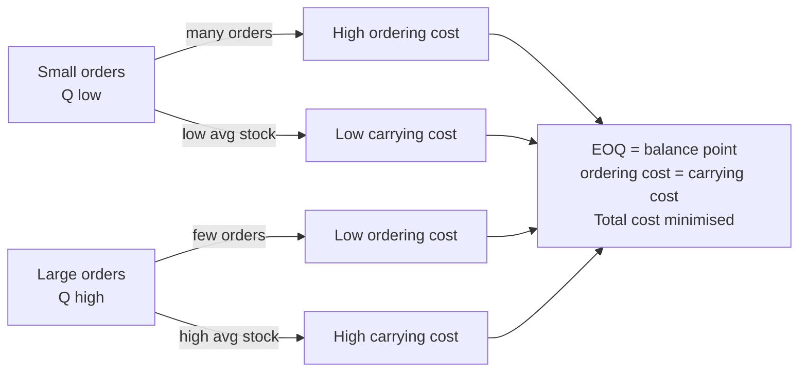
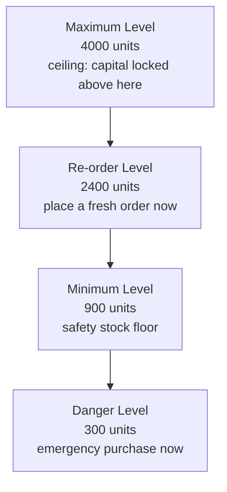
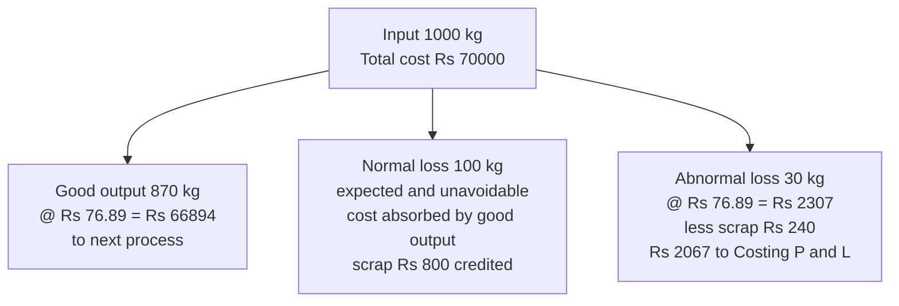

# Chapter 02 — Material Cost

## 1. The Problem — Why a Whole Chapter on "Stuff You Buy"?

Walk into any manufacturing business and ask the accountant: "Where does your money go?" In the overwhelming majority of Indian manufacturing firms the answer is the same — **material is the single largest cost element**, routinely 40% to 70% of total cost. A steel fabricator, a textile mill, a pharmaceutical plant, an FMCG unit — for all of them, rupees spent on raw material dwarf rupees spent on wages or overhead.

Now here is the uncomfortable part. Material is also the cost element that is **easiest to lose control of**, for three brutal reasons:

1. **It is physical and portable.** Cash sits in a bank with layers of controls. Material sits in a godown where it can be pilfered, substituted, over-issued, or simply walk out the gate. Theft of material is a real, quantifiable loss in Indian factories.
2. **It deteriorates, evaporates, spills, and breaks.** Chemicals evaporate, grain is eaten by rats, liquids spill, glass breaks, food rots. Some of this is unavoidable (normal); some signals a broken process (abnormal). Telling the two apart is a costing decision.
3. **It ties up working capital.** Every rupee sitting as stock in the godown is a rupee borrowed from the bank at 10–12% interest, or a rupee not earning returns elsewhere. Buy too much and you bleed carrying cost; buy too little and the production line stops and you lose customers.

Financial accounting is *useless* for managing any of this in real time. The financial P&L tells you, once a year, that you consumed ₹8 crore of material. It cannot tell you: *how much* should we order at a time? *When* should we reorder? At *what price* should we value the units we just issued to the shop floor when prices have been rising all year? Was that 500 kg "loss" acceptable or did someone steal it?

These are **managerial decisions**, and each one has a purpose-built technique in cost accounting:

| The decision a manager faces | The technique this chapter builds |
|---|---|
| How much to order in one go? | **Economic Order Quantity (EOQ)** |
| When to place the order? | **Re-order Level** |
| How low can stock safely fall? | **Minimum Level** |
| How high should stock ever go? | **Maximum Level** |
| At what point do we panic-buy? | **Danger Level** |
| What price do we put on units issued to production? | **FIFO / LIFO / Weighted Average** |
| Was a loss acceptable or does it need investigation? | **Normal vs Abnormal loss treatment** |
| Which items deserve tight control and which don't? | **ABC Analysis** |

Every formula below exists to answer one of these questions. We never state a formula before you feel the pain it removes.

---

## 2. The Core Idea — The Godown as a Bathtub

Picture your material stock as **water in a bathtub**.

- The **tap** pouring water in = purchases (deliveries from suppliers).
- The **drain** letting water out = issues to production (consumption).
- The **water level** at any moment = stock on hand.

The whole art of material control is keeping the water level in a **safe band** — never so low the drain sucks air (a **stock-out**, production stops), never so high it overflows and floods the bathroom (**over-stocking**, capital locked and material spoiling).

The catch is that the tap has a **delay**: when you open it (place an order), water doesn't arrive instantly — it takes the supplier's **lead time** to deliver. So you must open the tap *before* the level gets dangerous, judging how fast the drain is running (consumption rate) and how long the tap takes to respond (lead time).

Every "level" in this chapter is just a **marked line on the side of the bathtub**:
- **Re-order level** = the line at which you shout "open the tap!"
- **Minimum level** = the lowest the water should ever get in normal life.
- **Maximum level** = the highest it should ever get.
- **Danger level** = an emergency red line below minimum — if you hit it, something went wrong, halt normal issues and rush an emergency order.

And **EOQ** answers a different, quieter question: each time you open the tap, *how much* water should you let in? Too little and you're forever running to the tap (high ordering cost); too much and you're storing stale water (high carrying cost). EOQ is the sweet spot between those two nagging costs.

Hold this bathtub picture. Everything technical below hangs on it.

---

## 3. Why It's Built This Way — The Logic Before the Formulae

### 3.1 The two-cost tug-of-war behind EOQ

Why can't we just "order what we need when we need it"? Because **ordering itself costs money**, and **holding stock costs money**, and these two costs pull in *opposite directions*.

- **Ordering cost** (cost per order): raising a purchase requisition, inviting quotations, placing the order, following up, receiving, inspecting, and processing the invoice. This is largely *fixed per order* — it costs roughly the same to order 100 units or 10,000 units. So: **more orders → more total ordering cost.** To cut ordering cost, order in *big lots, rarely*.

- **Carrying cost** (holding cost): interest on capital locked in stock, godown rent, insurance, handling, obsolescence, deterioration, pilferage. This grows with *how much you hold*. So: **bigger lots → higher average stock → more carrying cost.** To cut carrying cost, order in *small lots, often*.

You cannot minimise both. Big rare orders kill carrying cost but inflate ordering cost. Small frequent orders do the reverse. **Total cost is minimised where the two curves cross** — where annual ordering cost exactly equals annual carrying cost. That crossing point is the EOQ. That single insight is the *whole* derivation; the algebra just formalises it.

### 3.2 Why we need levels at all

Even with the right order *size*, you still need to know *when* to order and how to bound the stock. Levels exist because **lead time is uncertain and consumption is uncertain**. If both were perfectly predictable you'd need no buffer — you'd place an order timed so the last unit is issued exactly as the new lot arrives. But suppliers are late and the shop floor sometimes consumes faster than expected. Levels are essentially a **safety-buffer system**: a set of pre-computed lines so that a storekeeper — not a manager — can run day-to-day stock control mechanically and only escalate at the danger line.

### 3.3 Why issue valuation is even a question

Here's a subtlety that trips up newcomers from a financial background. You bought the same bolt in January at ₹10, in March at ₹12, in May at ₹15. Today you issue 1,000 bolts to production. **What is their cost — ₹10, ₹12, ₹15, or a blend?** Physically the bolts are identical and mixed in a bin; you genuinely cannot say *which* rupee-batch left. So costing must adopt an **assumption** — FIFO, LIFO, or weighted average. This is not accounting pedantry: the assumption you pick changes the cost charged to the job, the value of closing stock, and therefore **reported profit**. In a period of rising prices, the choice can swing profit by lakhs. That is why it is a managerial decision, not a clerical one.

---

## 4. Full Technical Content — Every Formula With Its "Why"

### 4.1 Inventory Control Levels

Let us build each level from the bathtub logic. First, the raw ingredients (the "primitives") every level is made of:

- **Lead time** = time between placing an order and receiving it (also called delivery/procurement time).
- **Consumption (usage) rate** = units used per unit of time (per day/week).

Because both wobble, we speak of **maximum, minimum and normal (average)** values of each.

**(a) Re-order Level (ROL)** — the "open the tap now" line.

> **Re-order Level = Maximum Usage × Maximum Lead Time**

*Why maximum × maximum?* The reorder level must protect you in the **worst realistic case** — the fastest the shop floor might consume during the longest the supplier might take. Set it here and even a bad month won't cause a stock-out before the new lot lands. This is the primary line; several other levels are derived *from* it.

An equivalent, often-quoted form when safety stock is stated separately:

> **Re-order Level = Safety Stock + (Average Usage × Average Lead Time)**

Both express the same idea; ICAI problems usually give max/min usage and lead time, so the first form is the workhorse.

**(b) Minimum Level** — the floor of normal operation (the safety stock).

> **Minimum Level = Re-order Level − (Average Usage × Average Lead Time)**

*Why subtract the average, not the maximum?* Once you've re-ordered at ROL, on a *normal* day you'll consume at the *average* rate over the *average* lead time before the lot arrives. Whatever is left when it arrives is your cushion against things going wrong — that cushion *is* the minimum level. If actual usage and lead time turn out average, stock touches exactly this floor as the new lot lands. Anything below signals abnormality.

**(c) Maximum Level** — the ceiling; don't let capital drown here.

> **Maximum Level = Re-order Level + Re-order Quantity − (Minimum Usage × Minimum Lead Time)**

*Why this shape?* The highest stock can ever get is: you were sitting at ROL, you placed an order of size ROQ, and then — best case for stock build-up — the **least** was consumed (minimum usage) over the **shortest** wait (minimum lead time) before the full lot piled in on top. Add the incoming lot to reorder level, subtract the little that was drawn down in the meantime. That's the physical peak.

**(d) Danger Level** — the red emergency line, below minimum.

> **Danger Level = Average Usage × Lead Time for Emergency Purchases**

*Why a separate emergency lead time?* If you've dropped *below* the minimum, normal replenishment has failed. You must now buy through an **emergency channel** (spot purchase, faster/costlier supplier) which has its *own*, shorter lead time. The danger level is the stock that will just barely cover average consumption during that emergency procurement. Hit it and you stop issuing for non-critical use and rush an emergency buy. (Some texts use *maximum* usage here for extra conservatism; ICAI's standard formula uses average usage × emergency lead time — use that unless the question says otherwise.)

**(e) Average Stock Level** — for working-capital and carrying-cost estimates.

> **Average Stock = Minimum Level + ½ × Re-order Quantity**
>
> or, equivalently, **Average Stock = ½ × (Minimum Level + Maximum Level)**

*Why?* Between deliveries, stock saw-tooths from a peak down to the minimum, then jumps back up. Its time-average is the floor plus half a saw-tooth (half a re-order quantity).

### 4.2 Economic Order Quantity (EOQ)

Now the star formula. Define:

- **A** = Annual demand / consumption (units per year)
- **O** = Ordering cost **per order** (₹)
- **C** = Carrying cost **per unit per year** (₹). If given as a % of unit price, then C = (carrying % ) × (price per unit).

**Derivation from the two-cost tug-of-war** (Section 3.1). Let **Q** be the order quantity we're solving for.

- Number of orders per year = A / Q. So **Annual Ordering Cost = (A / Q) × O**.
- Average stock held = Q / 2 (saw-tooth). So **Annual Carrying Cost = (Q / 2) × C**.
- **Total relevant cost** T = (A/Q)·O + (Q/2)·C.

As Q rises, the first term falls and the second rises. Minimum is where they are equal (or by calculus, dT/dQ = 0):

−(A·O)/Q² + C/2 = 0  ⟹  Q² = 2·A·O / C. Hence:

> **EOQ = √( 2 × A × O / C )**

*The formula is literally the point where "ordering cost = carrying cost".* You never have to memorise it as a magic string — you can rebuild it any time from "set the two costs equal".

**Companion figures at EOQ:**

- Number of orders per year = A / EOQ
- Time between orders = 365 / (number of orders) days
- Total ordering cost = (A/EOQ)·O ; Total carrying cost = (EOQ/2)·C — **and at EOQ these two are equal** (a superb self-check!).
- Total inventory cost (excluding purchase price) = ordering + carrying = both added.

**Assumptions of EOQ (know these — examiners test them):** (i) demand is known and constant; (ii) ordering cost per order and carrying cost per unit are constant; (iii) price per unit is constant — *no quantity discounts* (if discounts exist, EOQ must be tested against discount break-points separately); (iv) the entire order is delivered at once; (v) lead time is known. Reality violates all of these, which is exactly why we bolt on the *levels* of 4.1 as shock absorbers.

### 4.3 Valuation of Material Issues

When identical units bought at different prices are issued, we assume a cost-flow order.

**FIFO (First-In-First-Out).** Assume the **oldest** stock is issued first. Closing stock is valued at the **most recent** prices.
- *Logic & effect:* physically sensible (you use up old stock first to avoid spoilage). In **rising prices**, issues are charged at old (low) prices → **lower cost → higher profit**; closing stock at new (high) prices → **higher balance-sheet stock value**.

**LIFO (Last-In-First-Out).** Assume the **newest** stock is issued first. Closing stock sits at **old** prices.
- *Logic & effect:* charges production at prices closest to current replacement cost. In **rising prices**, issues at new (high) prices → **higher cost → lower profit** (and lower reported tax, historically its attraction); closing stock understated at old prices. *Note: LIFO is not permitted under Ind AS-2 / AS-2 for financial reporting, but remains examinable in cost accounting.*

**Weighted Average.** After each receipt, recompute one blended rate:

> **Weighted Average Rate = Total value of stock on hand ÷ Total units on hand**

All issues until the next receipt go out at this rate.
- *Logic & effect:* smooths price fluctuations; issue price lies between FIFO and LIFO; profit and stock values sit in the middle. Preferred when prices swing and you want a stable, un-manipulable cost.

**Master rule of thumb (rising prices):**

| | Issue cost | Profit | Closing stock value |
|---|---|---|---|
| **FIFO** | Lowest | Highest | Highest |
| **LIFO** | Highest | Lowest | Lowest |
| **Wtd Avg** | Middle | Middle | Middle |

(In **falling** prices, reverse FIFO and LIFO.) A guaranteed reconciliation check across any method: **Opening stock + Purchases = Issues (charged to production) + Closing stock**, in *both* value and quantity.

### 4.4 Stock Losses — Wastage, Scrap, Spoilage, Defectives

Loss of material is inevitable; the costing question is always the same: **was it normal (inherent, unavoidable, expected) or abnormal (avoidable, exceptional, a signal something broke)?** The *treatment* depends entirely on that classification.

The **golden principle:**

> **Normal loss** is expected, so its cost is **absorbed by the good output** — the cost of the good units is inflated to carry the normal loss. **Abnormal loss** is not expected, so it is **charged to the Costing Profit & Loss Account** and kept *out* of product cost — otherwise a controllable failure would be hidden inside product cost and never investigated.

The four forms of loss:

| Term | What it is | Realisable value? | Treatment |
|---|---|---|---|
| **Waste** | Portion with **no measurable recovery** — evaporation, smoke, shrinkage, dust; may even cost money to dispose. | Usually nil (may be negative disposal cost). | Normal waste: absorbed by good output (raises unit cost). Abnormal waste: cost to Costing P&L. |
| **Scrap** | Residue with a **small but definite sale value** — metal turnings, off-cuts, trimmings. | Yes, small. | Normal scrap sale value credited to overhead / job / material cost (reduces cost). Abnormal scrap sale credited to Costing P&L. |
| **Spoilage** | Units so damaged they **cannot be rectified** and are sold as seconds/junk. | Sold at low value. | Normal spoilage cost (net of recovery) borne by good output. Abnormal spoilage net cost to Costing P&L. |
| **Defectives** | Units that **can be rectified** by extra work and then sold as good. | Rectifiable. | Normal: rectification cost charged to good output/overhead. Abnormal: rectification cost to Costing P&L. |

**Computing the cost of an abnormal loss** (the exam-favourite manoeuvre): first spread the *total* cost over *expected good output* (i.e. after removing normal loss) to get a **cost per good unit**, then value the abnormal-loss units at that rate, net of any scrap recovered. Fully worked in Example 4 below.

*Why value abnormal loss at the "good unit" cost?* Because the normal loss was always going to happen — it is a legitimate cost of producing good units. The abnormal loss is *extra* units lost that *should* have been good; they must be valued at what a good unit costs and written off, so management sees the true rupee bleed.

### 4.5 ABC Analysis — Selective Control

You cannot lavish equal attention on every one of 10,000 stock items — controlling a ₹5 washer as tightly as a ₹5-lakh engine is a waste of managerial time. **ABC analysis** ("Always Better Control") applies the Pareto principle to inventory: a *small fraction of items accounts for a large fraction of value.*

| Class | Typical share of items | Typical share of value | Control policy |
|---|---|---|---|
| **A** | ~10% | ~70% | Tight: low safety stock, frequent review, EOQ enforced, senior sign-off, perpetual records. |
| **B** | ~20% | ~20% | Moderate control, periodic review. |
| **C** | ~70% | ~10% | Loose: bulk orders, large safety stock, simple two-bin system, minimal paperwork. |

*Why bother?* Managerial attention is itself a scarce, costly resource. ABC channels it where rupees are at stake. Note it classifies by **annual consumption value (quantity × unit price)**, *not* by unit price alone — a cheap item consumed in huge volumes can be a Class-A item. (Related selective techniques worth naming: **VED** — Vital/Essential/Desirable, by criticality; **FSN** — Fast/Slow/Non-moving, by movement; **HML** — High/Medium/Low, by unit price. ABC is the one examined in depth.)

---

## 5. Worked Examples — Full Step-by-Step

### Example 1 — EOQ, order frequency, and total cost (foundation)

**Data.** A factory consumes **12,000 units** of a raw material per year. Ordering cost is **₹150 per order**. The material costs **₹20 per unit**, and carrying cost is **20% of unit value per year**.

**Required.** (a) EOQ, (b) number of orders per year, (c) time between orders, (d) total ordering, carrying and inventory cost at EOQ.

**Solution.**

*Step 1 — identify the primitives.*
- A = 12,000 units/yr ; O = ₹150/order.
- C = 20% × ₹20 = **₹4 per unit per year.**

*Step 2 — EOQ (set ordering = carrying, i.e. the formula).*

EOQ = √(2 × A × O / C) = √(2 × 12,000 × 150 / 4) = √(3,600,000 / 4) = √900,000 = **√900000 = 948.68 ≈ 949 units.**

Let me keep it exact: 2 × 12,000 × 150 = 36,00,000; ÷ 4 = 9,00,000; √9,00,000 = **948.68 units** (≈ 949).

*Step 3 — number of orders per year* = A / EOQ = 12,000 / 948.68 = **12.65 orders** (≈ 13 orders).

*Step 4 — time between orders* = 365 / 12.65 = **28.9 days** (≈ every 29 days).

*Step 5 — costs at EOQ.*
- Ordering cost = (A/EOQ) × O = 12.65 × 150 = **₹1,897.4**
- Carrying cost = (EOQ/2) × C = (948.68/2) × 4 = 474.34 × 4 = **₹1,897.4**
- **Self-check: the two are equal — the hallmark of a correct EOQ.** ✓
- Total inventory cost (excl. purchase price) = 1,897.4 + 1,897.4 = **₹3,794.8**

*Interpretation.* Ordering ~949 units about 13 times a year minimises the combined ordering-plus-carrying cost at roughly ₹3,795. Order much bigger and carrying cost balloons; much smaller and ordering cost balloons.

---

### Example 2 — Proving EOQ is genuinely the minimum (a cost table)

**Data.** Same as Example 1 (A = 12,000, O = ₹150, C = ₹4). Let's tabulate total cost at several order sizes to *see* the U-shaped curve bottom out near EOQ.

| Order Qty (Q) | No. of orders (A/Q) | Ordering cost = orders × 150 (₹) | Avg stock (Q/2) | Carrying cost = (Q/2)×4 (₹) | **Total (₹)** |
|---|---|---|---|---|---|
| 400 | 30.0 | 4,500 | 200 | 800 | **5,300** |
| 600 | 20.0 | 3,000 | 300 | 1,200 | **4,200** |
| 800 | 15.0 | 2,250 | 400 | 1,600 | **3,850** |
| **949 (EOQ)** | 12.6 | 1,897 | 474 | 1,897 | **3,794** |
| 1,200 | 10.0 | 1,500 | 600 | 2,400 | **3,900** |
| 1,600 | 7.5 | 1,125 | 800 | 3,200 | **4,325** |

The total-cost column dips to its **minimum right at EOQ (~₹3,794)** and rises on either side — a live demonstration that EOQ is the trough of the U, not an arbitrary formula. Also note that only at Q = 949 do ordering and carrying costs coincide (₹1,897 each).

*Figure 1 — The two-cost tug-of-war: EOQ sits exactly where the opposing pressures balance.*

---

### Example 3 — Full stock-level computation (exam-standard)

**Data.** For component "X":
- Normal usage: **300 units/week**; Minimum usage: **200 units/week**; Maximum usage: **400 units/week**.
- Re-order (delivery) period (lead time): **4 to 6 weeks**.
- Re-order Quantity (EOQ): **2,400 units**.
- Emergency delivery time: **1 week**.

**Required.** Re-order level, Minimum level, Maximum level, Danger level, Average stock level.

**Solution.** Work strictly from the formulae in 4.1, plugging max/min correctly.

*Step 1 — Re-order Level = Maximum usage × Maximum lead time*
= 400 × 6 = **2,400 units.**

*Step 2 — Minimum Level = ROL − (Average usage × Average lead time)*
Average usage = 300 (given as "normal"); Average lead time = (4 + 6)/2 = 5 weeks.
= 2,400 − (300 × 5) = 2,400 − 1,500 = **900 units.**

*Step 3 — Maximum Level = ROL + ROQ − (Minimum usage × Minimum lead time)*
= 2,400 + 2,400 − (200 × 4) = 4,800 − 800 = **4,000 units.**

*Step 4 — Danger Level = Average usage × Emergency lead time*
= 300 × 1 = **300 units.**

*Step 5 — Average Stock = Minimum level + ½ ROQ*
= 900 + ½ × 2,400 = 900 + 1,200 = **2,100 units.**
(Cross-check via ½(min + max) = ½(900 + 4,000) = 2,450 — the two formulas differ slightly because the "½ ROQ" version assumes stock swings between minimum and minimum+ROQ, while the max/min version uses the extreme peak; ICAI accepts the **Minimum + ½ ROQ = 2,100** form as the standard answer. State the formula you used.)

*Interpretation & ordering of the lines (sanity check):* Danger (300) < Minimum (900) < Re-order (2,400) < Maximum (4,000). This ordering must always hold — if your danger level exceeds your minimum, or reorder exceeds maximum, you've mis-plugged a max/min somewhere.

*Figure 2 — Stock levels as marked lines on the bathtub, from ceiling down to the emergency red line.*

---

### Example 4 — Material issue valuation under FIFO, LIFO and Weighted Average (with profit effect)

**Data.** Transactions for material "M" during March:

| Date | Transaction | Units | Rate ₹/unit |
|---|---|---|---|
| Mar 1 | Opening balance | 200 | 10 |
| Mar 5 | Purchase | 300 | 12 |
| Mar 10 | Issue | 400 | — |
| Mar 18 | Purchase | 400 | 15 |
| Mar 25 | Issue | 300 | — |

**Required.** Value the two issues and the closing stock under (a) FIFO, (b) LIFO, (c) Weighted Average, and comment on profit impact.

First, the physical reconciliation (identical across all methods):
Opening 200 + Purchases (300 + 400) = 900 units in. Issues 400 + 300 = 700 out. **Closing = 900 − 700 = 200 units.** ✓ Total value in = 200×10 + 300×12 + 400×15 = 2,000 + 3,600 + 6,000 = **₹11,600.**

---

**(a) FIFO — oldest issued first.**

| Date | Receipts | Issues | Balance |
|---|---|---|---|
| Mar 1 | — | — | 200 @ ₹10 = ₹2,000 |
| Mar 5 | 300 @ ₹12 = ₹3,600 | — | 200 @ ₹10 ; 300 @ ₹12 (₹5,600) |
| Mar 10 | — | **200 @ ₹10 + 200 @ ₹12 = 2,000 + 2,400 = ₹4,400** | 100 @ ₹12 = ₹1,200 |
| Mar 18 | 400 @ ₹15 = ₹6,000 | — | 100 @ ₹12 ; 400 @ ₹15 (₹7,200) |
| Mar 25 | — | **100 @ ₹12 + 200 @ ₹15 = 1,200 + 3,000 = ₹4,200** | 200 @ ₹15 = ₹3,000 |

- Total issues (to production) = 4,400 + 4,200 = **₹8,600.**
- **Closing stock = 200 @ ₹15 = ₹3,000** (newest prices).
- Check: 8,600 + 3,000 = 11,600 ✓

**(b) LIFO — newest issued first.**

| Date | Receipts | Issues | Balance |
|---|---|---|---|
| Mar 1 | — | — | 200 @ ₹10 = ₹2,000 |
| Mar 5 | 300 @ ₹12 | — | 200 @ ₹10 ; 300 @ ₹12 (₹5,600) |
| Mar 10 | — | **300 @ ₹12 + 100 @ ₹10 = 3,600 + 1,000 = ₹4,600** | 100 @ ₹10 = ₹1,000 |
| Mar 18 | 400 @ ₹15 | — | 100 @ ₹10 ; 400 @ ₹15 (₹7,000) |
| Mar 25 | — | **300 @ ₹15 = ₹4,500** | 100 @ ₹10 ; 100 @ ₹15 = 1,000 + 1,500 = ₹2,500 |

- Total issues = 4,600 + 4,500 = **₹9,100.**
- **Closing stock = ₹2,500** (100 @ ₹10 + 100 @ ₹15).
- Check: 9,100 + 2,500 = 11,600 ✓

**(c) Weighted Average — reblend after each receipt.**

| Date | Units | Value ₹ | Balance units | Balance ₹ | Wtd-avg rate ₹ |
|---|---|---|---|---|---|
| Mar 1 | +200 | 2,000 | 200 | 2,000 | 10.00 |
| Mar 5 | +300 | 3,600 | 500 | 5,600 | **11.20** (5,600/500) |
| Mar 10 | −400 | −4,480 | 100 | 1,120 | 11.20 |
| Mar 18 | +400 | 6,000 | 500 | 7,120 | **14.24** (7,120/500) |
| Mar 25 | −300 | −4,272 | 200 | 2,848 | 14.24 |

- Mar 10 issue = 400 × 11.20 = **₹4,480.** Mar 25 issue = 300 × 14.24 = **₹4,272.**
- Total issues = 4,480 + 4,272 = **₹8,752.**
- **Closing stock = 200 × 14.24 = ₹2,848.**
- Check: 8,752 + 2,848 = 11,600 ✓

**Comparison & profit comment (prices are rising: 10 → 12 → 15):**

| Method | Total issue cost (charged to production) | Closing stock value | Relative profit |
|---|---|---|---|
| FIFO | ₹8,600 (lowest) | ₹3,000 (highest) | **Highest** |
| LIFO | ₹9,100 (highest) | ₹2,500 (lowest) | **Lowest** |
| Wtd Avg | ₹8,752 (middle) | ₹2,848 (middle) | **Middle** |

Exactly as the master rule predicts: in rising prices FIFO charges the least to production (old cheap units) so it **shows the highest profit and the highest closing stock**, LIFO the opposite, weighted average in between. Same physical facts, three different profits — which is precisely why the choice is a *decision*, and why financial reporting (AS-2 / Ind AS-2) bans LIFO to prevent profit manipulation.

---

### Example 5 — Normal vs Abnormal loss valuation (the treatment that separates the two)

**Data.** A process is charged with **1,000 kg** of material at **₹50/kg** (total material ₹50,000). Additional processing cost (labour + overhead) = **₹20,000**. **Normal loss is 10%** of input; such loss (scrap) sells for **₹8/kg**. Actual output was **870 kg**.

**Required.** Value the good output, the normal loss, and the abnormal loss; show the Costing P&L treatment.

**Solution.**

*Step 1 — quantities.*
- Input = 1,000 kg. Normal loss = 10% × 1,000 = **100 kg.**
- Expected (good) output = 1,000 − 100 = **900 kg.**
- Actual output = 870 kg ⇒ **Abnormal loss = 900 − 870 = 30 kg.** (Total loss 130 kg = 100 normal + 30 abnormal.)

*Step 2 — cost per good unit (the crucial step).* Total cost put in = material 50,000 + processing 20,000 = **₹70,000.** From this, recover the scrap value of **normal** loss only: 100 kg × ₹8 = ₹800. Net cost to be spread over expected good output:

Cost per good kg = (Total cost − Normal-loss scrap value) ÷ Expected good output
= (70,000 − 800) ÷ 900 = 69,200 ÷ 900 = **₹76.89 per kg.**

*Why divide by 900, not 1,000?* Because the 100 kg normal loss is expected and its cost is legitimately absorbed by the 900 good units. We deliberately load the normal loss onto good output — that's the golden principle in action.

*Step 3 — value each stream at ₹76.89/kg.*
- **Good output:** 870 × 76.89 = **₹66,894** (this flows to the next process / finished goods).
- **Abnormal loss:** 30 × 76.89 = **₹2,306.67**, gross.

*Step 4 — Costing P&L treatment of abnormal loss.* The 30 abnormal-loss kg can still be sold as scrap at ₹8/kg = ₹240 recovery. So:
- Abnormal loss charged to **Costing Profit & Loss A/c** = 2,306.67 − 240 = **₹2,066.67 (net).**
- Normal loss: **no cost** carried (its cost already absorbed by good output); only its ₹800 scrap sale is realised and credited against process cost as done in Step 2.

*Reconciliation.* Value out = good output 66,894 + abnormal loss (at cost) 2,306.67 + normal-loss scrap credited 800 = 70,000.67 ≈ **₹70,000** (rounding). ✓ The cost input is fully accounted for.

*Interpretation.* By ring-fencing the ₹2,067 abnormal loss into the Costing P&L instead of burying it in product cost, management is *forced* to see and investigate the extra 30 kg that vanished. Had we simply divided ₹70,000 by 870 actual kg, product cost would silently swell and the failure would never surface — the entire reason cost accounting insists on the normal/abnormal split.

*Figure 3 — Cost flow of a process: normal loss is absorbed by good output while abnormal loss is written off to Costing P&L for visibility.*

---

## 6. Presentation & Format — How to Lay It Out in the Exam

**Stores Ledger Control (perpetual inventory) format.** Whenever asked to value issues, present a three-block ledger — *Receipts | Issues | Balance* — each block showing Quantity, Rate, Amount. This is the format used in Example 4 and it is what earns method marks even if an arithmetic slip occurs.

| Date | Particulars | Receipts (Qty · Rate · Amt) | Issues (Qty · Rate · Amt) | Balance (Qty · Rate · Amt) |
|---|---|---|---|---|

**Levels answer.** Present each level as *Formula → substitution → answer*, then a one-line sanity ordering (Danger < Min < ROL < Max). Always state which usage/lead-time (max/min/avg) you used and why.

**EOQ answer.** State A, O, C explicitly (converting % carrying to ₹ per unit), give the formula, substitute, then the self-check "ordering cost = carrying cost".

**Loss problems.** Show the quantity reconciliation first (input = good output + normal loss + abnormal loss), then the cost-per-good-unit computation, then value each stream, then the P&L line. End with the value reconciliation.

**Rounding convention.** EOQ and level answers are usually rounded up to whole units (you cannot order a fraction). Keep two decimals in rates until the final line to avoid compounding rounding error.

---

## 7. Connections — Where This Plugs Into the Rest of Costing

- **Cost Sheet (Ch. 01 / 03):** the *value of materials consumed* you compute here (Opening stock + Purchases + carriage inward − Closing stock − returns) is the very first line of the cost sheet — **Direct Material** feeding into Prime Cost. Material valuation choice therefore ripples into prime cost, works cost and profit.
- **Process Costing:** the normal/abnormal loss machinery of Section 4.4/Example 5 is used *identically* in process costing, where abnormal loss and **abnormal gain** get their own ledger accounts. Master it here and process costing's loss accounting is free.
- **Overheads:** carrying cost, ordering cost and stores-department costs are themselves overheads; scrap recoveries are credited to overhead. Material control feeds overhead absorption.
- **Marginal Costing / Decision-making:** EOQ is a mini optimisation — the same "minimise total of two opposing costs" logic reappears in make-or-buy and other decisions.
- **Working Capital (Financial Management):** average stock level and stock-holding period directly set the inventory component of the working-capital cycle. The bathtub you controlled here *is* the FM inventory conversion period.

---

## 8. Traps & Examiner Tricks

1. **Carrying cost given as a %.** If told "carrying cost is 10% of *average inventory value*" or "10% p.a.", you must convert to **₹ per unit per year = % × unit price** before using it as C in EOQ. Forgetting this is the No. 1 EOQ error.
2. **Ordering cost per order vs per annum.** O in EOQ is cost *per order*. If a total annual purchasing-department cost is given, do **not** plug it in raw.
3. **Max × Max vs Avg × Avg.** Re-order level uses **maximum** usage × **maximum** lead time; minimum level subtracts **average × average**; maximum level subtracts **minimum × minimum**. Mixing these up is the classic levels blunder. Memorise via logic (worst case for stock-out → maximums; best case for pile-up → minimums), not rote.
4. **Quantity discounts.** If the supplier offers a lower price for larger lots, EOQ is **not** automatically the answer. You must compute total cost (purchase + ordering + carrying) at EOQ *and* at each discount break-point and pick the lowest. Plain EOQ assumes constant price.
5. **Dividing total cost by *actual* output in loss problems.** Cost per good unit must use **expected** good output (input − normal loss), *not* actual output. Using actual output wrongly buries abnormal loss in product cost.
6. **Scrap value of normal vs abnormal loss.** Normal-loss scrap reduces the cost spread over good units (credited in the cost-per-unit step). Abnormal-loss scrap is netted against the abnormal loss taken to Costing P&L. Don't double-count or mis-route them.
7. **Weighted average must be *re-computed after every receipt***, not once at the end (that would be "simple average," a different and usually wrong method for perpetual systems). Also, an *issue* does **not** change the rate — only a receipt does.
8. **FIFO vs LIFO profit direction depends on price trend.** The "FIFO = higher profit" rule holds only in **rising** prices; reverse it if the question has falling prices. Read the price sequence before quoting the rule.
9. **ABC by value, not unit price.** A ₹2 item consumed 5,00,000 times a year is Class A. Classify by **annual consumption value**, never by sticker price alone.
10. **Danger level formula variants.** Standard ICAI: Average usage × emergency lead time. Some problems specify "reorder period for emergency purchase" — use that as the lead time. If the question hands you a different definition, follow the question.

---

## 9. First-Principles Recap

Strip everything back and material costing rests on four irreducible ideas:

1. **Material is the biggest, leakiest cost**, so it earns the most control machinery. Control means keeping stock in a safe band (the bathtub) and pricing what leaves the godown honestly.
2. **How much to order** is a tug-of-war between ordering cost (falls with big lots) and carrying cost (rises with big lots). Their balance point is EOQ — rebuildable any time by setting the two costs equal.
3. **When to order and how far stock may swing** is a safety-buffer problem driven by uncertain usage and uncertain lead time. Re-order/min/max/danger levels are pre-computed lines: worst case (maximums) protects against stock-out, best case (minimums) bounds the pile-up.
4. **Pricing issues and treating losses** are about *not lying* to management. Issue-valuation assumptions (FIFO/LIFO/WA) change profit, so choose deliberately. Losses are split normal (absorbed by good output — it was always going to happen) vs abnormal (written off to Costing P&L — so failure is visible and investigated).

If you can regenerate every formula in this chapter from these four ideas, you never have to memorise a single one.

---

## 10. Quick-Revision Sheet

**Inventory Levels**

| Item | Formula |
|---|---|
| Re-order Level (ROL) | Maximum usage × Maximum lead time |
| ROL (alt) | Safety stock + (Avg usage × Avg lead time) |
| Minimum Level | ROL − (Average usage × Average lead time) |
| Maximum Level | ROL + ROQ − (Minimum usage × Minimum lead time) |
| Danger Level | Average usage × Emergency lead time |
| Average Stock | Minimum level + ½ ROQ = ½ (Min + Max) |

**EOQ block**

| Item | Formula |
|---|---|
| EOQ | √(2 × A × O / C) |
| A | Annual demand (units) |
| O | Ordering cost per order (₹) |
| C | Carrying cost per unit per year = carrying % × unit price |
| No. of orders/yr | A ÷ EOQ |
| Time between orders | 365 ÷ (A/EOQ) days |
| Ordering cost | (A/EOQ) × O |
| Carrying cost | (EOQ/2) × C |
| **Check at EOQ** | Ordering cost = Carrying cost |
| Total inventory cost | (A/EOQ)×O + (EOQ/2)×C |

**Issue valuation (rising prices)**

| Method | Issue cost | Profit | Closing stock |
|---|---|---|---|
| FIFO | Lowest | Highest | Highest |
| LIFO | Highest | Lowest | Lowest |
| Wtd Avg | Middle | Middle | Middle |
| Wtd-avg rate | Value on hand ÷ Units on hand (recompute after each receipt) |
| Universal check | Opening + Purchases = Issues + Closing (qty & value) |

**Losses**

| Type | Recovery | Treatment |
|---|---|---|
| Waste | Nil / negative | Normal → absorbed by good output; Abnormal → Costing P&L |
| Scrap | Small sale value | Normal scrap credited to cost/overhead; Abnormal scrap → Costing P&L |
| Spoilage | Low (sold as seconds) | Normal net cost → good output; Abnormal net → Costing P&L |
| Defectives | Rectifiable | Normal rectification → good output/OH; Abnormal → Costing P&L |
| Abnormal loss value | = (Total cost − normal-loss scrap) ÷ **expected good output** × abnormal units, less its own scrap |

**ABC Analysis**

| Class | ~% items | ~% value | Control |
|---|---|---|---|
| A | 10% | 70% | Tight, low safety stock, frequent review |
| B | 20% | 20% | Moderate |
| C | 70% | 10% | Loose, bulk buy, high safety stock |

*Classify by annual consumption value (qty × price), not unit price. Cousins: VED (criticality), FSN (movement), HML (unit price).*
