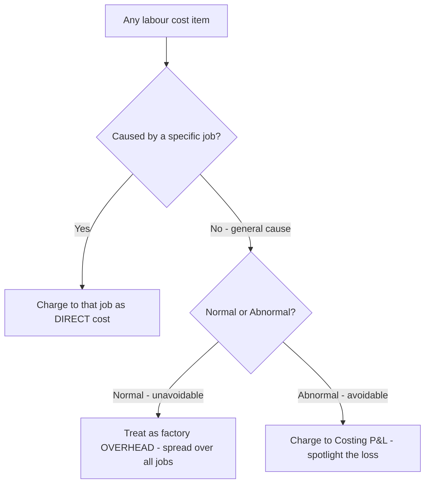
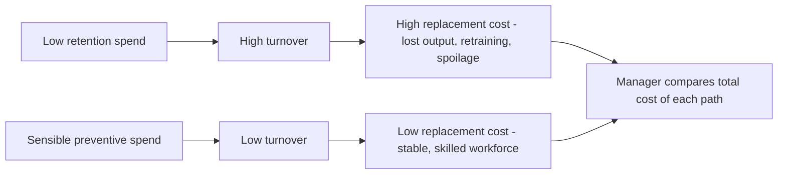
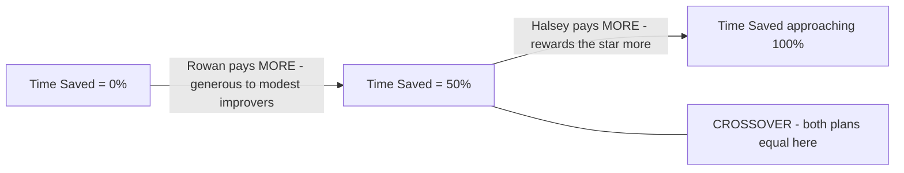

# Chapter 03 — Employee (Labour) Cost

## 1. The Problem — Why Labour Refuses to Behave Like Material

When you bought material in the last chapter, life was mechanically honest. A kilogram of steel that enters the store is a kilogram that can be weighed, counted, and traced to the job that consumed it. The steel does not get tired, does not chat at the tea-stall, does not learn to work faster, and does not quit on Monday morning because a competitor offered fifty rupees more. **Labour does all of these things**, and every one of them is a hole through which cost leaks.

Here is the manager's actual, daily headache. You pay a worker for **time** — she clocks in at 9 and out at 5, and you owe her eight hours of wages. But you sell **output** — the number of good units she produced in those eight hours. The gap between "time paid for" and "output received" is where the entire discipline of labour costing lives. That gap opens up in four specific ways, and each one is a decision the accountant must handle:

1. **Idle time** — the worker is present and being paid, but not producing (machine broke down, material didn't arrive, she waited for instructions). You are paying for time that generated nothing. *Who bears this cost — the specific job, or the factory as a whole?*
2. **Overtime** — you need more output than normal hours allow, so you pay a premium (often double) for extra hours. *Is that premium a cost of the urgent job, or a cost of bad planning?*
3. **Labour turnover** — workers leave and must be replaced. Recruiting, training, and the clumsiness of a new hire all cost money that never appears on any single job card. *How much is this bleeding, and is it worth spending to stop it?*
4. **Remuneration design** — do you pay by the clock (safe but lazy) or by the piece (fast but sloppy)? Or some clever hybrid that shares the gains of speed between worker and firm? *Which system actually maximises the firm's profit per rupee of wage?*

Financial accounting cannot answer any of these. The financial ledger records "Wages ₹8,00,000" as a single lump and moves on. It cannot tell you that ₹40,000 of it was idle time caused by a supplier's late delivery, or that your turnover cost you ₹1,20,000 in lost output last quarter, or that switching from time-rate to the Rowan plan would lift output 20% while raising the wage bill only 12%. **Cost accounting exists to open that lump sum and make each rupee accountable to a decision.**

That is the mission of this chapter: to turn the messy, human, leaky reality of paying people into numbers a manager can act on.

---

## 2. The Core Idea — The Taxi Meter vs. The Courier Fee

Think of two ways to pay for getting a parcel across the city.

**The taxi meter (time rate).** You hire a cab; the meter runs on *time and distance*. If the driver hits traffic, dawdles, or takes a scenic route, *you* pay for it. The driver bears no risk — he earns whether he is efficient or stuck. Safe, predictable, but he has zero incentive to hurry.

**The courier flat fee (piece rate).** You pay ₹100 to deliver the parcel, full stop. If the courier is fast, he does ten deliveries an hour and earns well; if he's slow, that's *his* problem, not yours. All the efficiency risk sits with the worker. He races — but he may also fling the parcel over the gate and crack it.

Every remuneration system in this chapter is a negotiation over **who carries the risk of the time-versus-output gap** — the firm or the worker. Time rate puts it all on the firm. Piece rate puts it all on the worker. The clever **premium bonus plans (Halsey and Rowan)** do something more interesting: they *split the savings* when a worker beats the standard time. The worker and the firm each pocket part of the time she saved. That shared-reward structure is the intellectual heart of this chapter — hold onto the image of *splitting the saved time*, because everything in Section 4 is a variation on how to split it.

And idle time, overtime, and turnover? Those are the **friction** that no payment system eliminates — the potholes on the road that make the meter tick while nothing useful happens. The accountant's job is to *name* each pothole and *charge it to whoever caused it*.

---

## 3. Why It's Built This Way — The Logic Before the Machinery

Before any formula, absorb the three principles that generate all the rules. If you understand these, you can *derive* the treatment of any labour item in the exam instead of memorising a list.

**Principle 1 — Cost must be traced to its cause, not its accident.** When idle time arises because *this particular job* required the worker to wait (a special job needing a special setup), the idle cost belongs to that job. When idle time arises from a *general* cause affecting everyone (a power cut), no single job caused it, so it's spread across all jobs as overhead. The question is never "what happened?" but "*whose fault is it, and who benefited?*" This single test decides direct-vs-indirect for almost every labour item.

**Principle 2 — Normal cost is a cost of doing business; abnormal cost is a loss to be spotlighted.** Some idle time is unavoidable — tea breaks, machine warm-up, the natural rhythm of work. That *normal* portion is baked into the cost of production because it is genuinely part of what it takes to make the product. But idle time from a *strike*, a *flood*, or a *major breakdown* is **abnormal** — it is not part of efficient production, so we refuse to let it hide inside product cost. We yank it out and dump it into the **Costing Profit & Loss Account** where management is forced to look at it. Costing deliberately makes waste *visible*; it never lets an avoidable loss quietly inflate the cost of a unit.

**Principle 3 — Incentives are engineering, not charity.** A bonus scheme is not generosity; it is a *machine for changing behaviour*. You design it so that when the worker acts in her own interest, she simultaneously acts in the firm's interest. The reason the firm shares time-savings with the worker is coldly rational: a worker who finishes in 6 hours instead of 10 has freed 4 hours of capacity. Even after paying her a bonus, the firm gains — lower overhead per unit, more output from the same plant. A good plan makes both parties richer than time-rate would; a bad plan makes the worker cut corners. Every plan below is judged by one question: *does it align the worker's greed with the firm's goal?*

*Figure 1 — The master decision tree. Almost every labour-treatment question in the exam is answered by walking these three forks.*

---

## 4. Full Technical Content — Every Tool, With Its Reason

### 4.1 Attendance & Time-Keeping vs. Time-Booking

Two different measurements, constantly confused by students, so pin them down:

- **Time-keeping** answers *"Was the worker in the factory, and for how long?"* It governs **wage payment** (gate-level attendance). Methods: attendance register, disc/token method, time-recording clocks, and modern **biometric / card-swipe** systems. Its purpose is payroll and discipline.
- **Time-booking** answers *"What did the worker do while inside?"* It governs **cost allocation** (job-level). The instrument is the **Job Card / Time Sheet**, recording hours spent on each job or operation.

The reconciliation of the two is where **idle time is discovered**: if the gate says she was present 8 hours (time-keeping) but her job cards account for only 7 hours of work (time-booking), the missing **1 hour is idle time**. This is not a bureaucratic detail — it is the *arithmetic origin of idle time*.

$$\text{Idle Time} = \text{Time paid for (gate/attendance)} - \text{Time actually booked to jobs}$$

### 4.2 Idle Time — Classification and Treatment

Idle time is time for which the worker is paid but does no productive work. Split it by **controllability** and **normality**:

| Type of Idle Time | Cause | Cost Treatment | Why |
|---|---|---|---|
| **Normal — job-related** | Setting up, waiting between operations *for a specific job*, tool changes | Charge to the **job** (inflate the direct labour rate) | The job caused it and benefited; it is a genuine cost of that job |
| **Normal — general** | Tea breaks, going tool-to-store, unavoidable small waits | **Factory overhead** — spread over all production | Unavoidable and general; no single job to blame |
| **Abnormal** | Strike, lockout, power failure, machine breakdown, flood, material shortage from poor planning | **Costing Profit & Loss A/c** | Avoidable loss; must be spotlighted, not hidden in product cost |

The standard technique for **normal general idle time** is to *inflate the hourly rate* so the cost gets absorbed by productive hours. If a worker is paid ₹10/hour for 8 hours (₹80/day) but only 7 hours are effective, the **effective/inflated rate = ₹80 ÷ 7 = ₹11.43/hour**. Charging jobs at ₹11.43 automatically absorbs the normal idle hour. This is the single most-tested idle-time computation.

### 4.3 Overtime — The Premium Is the Whole Point

Overtime = hours worked beyond normal working hours. Under Indian practice (Factories Act), overtime is typically paid at **double the ordinary rate**. Decompose the overtime payment into two parts, because they are treated differently:

- **Ordinary wage for overtime hours** (the normal rate for those extra hours) — always a cost of production.
- **Overtime premium** (the *extra* over normal — e.g. the second "1×" in double pay) — treatment *depends on the cause*:

| Cause of Overtime | Treatment of the **Premium** | Why |
|---|---|---|
| Customer's urgent request / specific job needs it | Charge premium to **that job** (direct) | That customer caused it and should pay for the rush |
| General pressure of work / seasonal load | **Factory overhead** — spread over all jobs | Benefits production generally; no single culprit |
| Abnormal cause — making up time lost to breakdown, flood, management's poor scheduling | **Costing P&L A/c** | Avoidable; a management failure, not a product cost |
| Worker's own fault / to redo defective work | Charge to the **worker / department** or P&L | The firm shouldn't capitalise its own inefficiency into stock |

**Overtime premium formula:** If normal rate is ₹R and overtime is paid at double,
$$\text{Overtime premium per OT hour} = 2R - R = R \quad (\text{i.e. one normal rate extra per OT hour})$$

The decision logic — *charge the premium to whoever caused the rush* — is a direct application of Principle 1. The exam loves a question where a worker does overtime and you must split total wages into ordinary (product cost) and premium (traced by cause).

### 4.4 Labour Turnover — Measuring the Bleed

**Labour turnover** = the rate at which employees leave and are replaced. It is a *symptom* — high turnover signals bad wages, poor conditions, weak morale — and it *costs real money*. There are three standard measurement methods; know all three because examiners specify which one.

Let:
- Separations = employees who left (resignations, retrenchment, death, retirement)
- Replacements = new workers hired to replace those who left (does **not** include hires for *expansion*)
- Accessions = *all* new hires = replacements + new posts for expansion
- Average number of workers = (Opening + Closing) ÷ 2

**(a) Separation Method:**
$$\text{LTR} = \frac{\text{No. of separations during period}}{\text{Average no. of workers}} \times 100$$

**(b) Replacement Method:**
$$\text{LTR} = \frac{\text{No. of replacements}}{\text{Average no. of workers}} \times 100$$
*Note: only replacements — workers hired to fill vacancies. Expansion hires are excluded because they don't represent people leaving.*

**(c) Flux Method** (the "total churn" — separations + accessions):
$$\text{LTR} = \frac{\text{No. of separations} + \text{No. of accessions}}{\text{Average no. of workers}} \times 100$$

A common variant (ICAI) uses separations + replacements in the flux numerator when expansion hires are to be excluded:
$$\text{LTR (Flux)} = \frac{\text{Separations} + \text{Replacements}}{\text{Average no. of workers}} \times 100$$

**Read the question carefully**: "accessions" includes expansion; "replacements" does not. This distinction is the single most common trap in turnover sums.

**Equivalent Annual Turnover Rate** (when the period is less than a year):
$$\text{Annual LTR} = \frac{\text{LTR for period}}{\text{Days in period}} \times 365$$

#### Costs of Labour Turnover — Two Buckets

| **Preventive Costs** (spent to *stop* people leaving) | **Replacement Costs** (incurred *because* they left) |
|---|---|
| Personnel/welfare admin, medical services | Recruitment & selection cost |
| Good working conditions, safety | Training cost of new workers |
| Fair wages, pensions, bonuses to retain | Loss of output during the vacancy & training gap |
| Better supervision | Higher spoilage/scrap from inexperienced hands |
| | Extra machine breakdown/tool damage by novices |

The managerial insight: preventive spending and replacement cost **trade off**. Spend nothing on prevention and replacement costs explode; spend sensibly on retention and you save more than you spend. Cost accounting quantifies both so management can find the economic optimum — this is a genuine decision the financial books can never illuminate.

*Figure 2 — Turnover as a cost trade-off. The optimum is not zero turnover but the point where preventive plus replacement cost is minimised.*

### 4.5 Remuneration Systems — The Heart of the Chapter

Now the payment machines themselves. We build them in order of increasing cleverness.

#### (A) Time Rate System

**Earnings = Hours Worked × Rate per Hour.**

The taxi meter. Simple, guarantees the worker a stable income, and protects quality (no rush). But it gives *zero* incentive to produce more — a slow worker earns the same as a fast one. Suited to skilled/quality work (toolmakers, artists), or where output isn't within the worker's control. The firm bears all the efficiency risk.

*High wage / measured day-rate variants exist (paying above market to attract better workers), but the core formula is the one above.*

#### (B) Straight Piece Rate System

**Earnings = Units Produced × Rate per Unit.**

The courier fee. Powerful incentive — earn exactly what you produce. But three dangers: (i) quality collapses as workers rush; (ii) no guaranteed minimum wage, so a slow day means near-starvation (industrially and legally problematic); (iii) the firm loses control over quality and material wastage. Suited to standardised, quality-tolerant, high-volume work.

**Taylor's Differential Piece Rate** sharpens this: set a standard output; pay a *low* piece rate to those below standard and a *high* rate to those above — a deliberately punishing gap to drive efficiency. (Merrick's plan is a gentler three-tier version.) These reward the efficient brutally and penalise the slow — motivating but harsh.

#### (C) The Premium Bonus Plans — Sharing the Saved Time

Here is the elegant middle path, and the examiner's favourite. The idea: fix a **standard time** for a job. If the worker finishes *faster*, she has **saved time**. Instead of giving her all the benefit (piece rate) or none (time rate), the firm **shares the value of the saved time** with her as a **bonus**. She still gets guaranteed time-rate wages as a floor (so a bad day doesn't starve her), *plus* a bonus for beating standard. Best of both worlds.

Let:
- $T$ = Time Taken (actual hours)
- $S$ = Standard Time (allowed hours)
- $R$ = Rate per hour
- **Time Saved** = $S - T$

**Halsey Plan — fixed 50% share of saved time:**
$$\boxed{\text{Total Earnings} = (T \times R) + \left(50\% \times (S - T) \times R\right)}$$

The worker gets her time-rate wage *plus* half the value of the time she saved. The firm keeps the other half. Simple, predictable; the firm always keeps 50% of the gain no matter how good the worker is. (A Halsey-Weir variant uses 30–33⅓%.)

**Rowan Plan — bonus proportional to the ratio of time saved to standard:**
$$\boxed{\text{Total Earnings} = (T \times R) + \left(\frac{S - T}{S} \times T \times R\right)}$$

The bonus is *time-rate wage × (time saved ÷ standard time)*. This looks odd — why scale the bonus by the fraction of time saved? Because it **self-limits**: as the worker saves more and more time, the fraction $(S-T)/S$ rises but $T$ shrinks, and the bonus is mathematically capped. **The Rowan bonus can never exceed the time-rate wage**, and it is *maximised when time saved = 50% of standard time*. This built-in ceiling protects the firm from over-paying and — crucially — protects the worker from the temptation to *over-report* speed by cutting quality, because racing past 50% saved actually *reduces* her marginal bonus. It is a self-governing incentive.

#### The Behavioural Difference — Why Two Plans, Not One

- **When time saved is LOW (worker just beats standard), Rowan pays MORE than Halsey.** Rowan is generous to modest improvers — good for encouraging the average worker.
- **When time saved is HIGH (worker is exceptional), Halsey pays MORE than Rowan.** Halsey rewards the star performer more; Rowan's ceiling holds the star back.
- **The crossover is at exactly 50% time saved**, where both plans pay the *same* bonus.

*Proof of the crossover, so you never memorise it blindly:* Set Halsey bonus = Rowan bonus.
Halsey bonus $= 0.5(S-T)R$. Rowan bonus $= \frac{(S-T)}{S}TR$.
Equating and cancelling $(S-T)R$ (assuming time saved ≠ 0): $0.5 = \frac{T}{S}$, so $T = 0.5S$, i.e. **time taken is half of standard = 50% time saved.** Above 50% saved, $T/S < 0.5$ so Rowan's factor drops below Halsey's 0.5 → Halsey wins. Below 50% saved, Rowan wins.

*Figure 3 — The Halsey-vs-Rowan crossover. Below 50% time saved Rowan is more generous, above 50% Halsey is, and at exactly 50% they meet.*

### 4.6 Labour Efficiency & Effective Hourly Rate

**Efficiency** measures output against a standard:
$$\text{Labour Efficiency} = \frac{\text{Standard Time for actual output}}{\text{Actual Time taken}} \times 100$$

Over 100% = beating standard (saving time). Under 100% = below standard.

To compare plans, always compute the **Effective Hourly Rate** (also called effective earnings per hour):
$$\text{Effective Rate/hour} = \frac{\text{Total Earnings under the plan}}{\text{Actual Hours Worked }(T)}$$

This normalises everything to a per-hour figure, letting you say "under Rowan she effectively earns ₹X/hr, under Halsey ₹Y/hr" — the sentence the examiner wants in your conclusion.

---

## 5. Worked Examples — From Warm-Up to Exam-Hard

### Example 1 — Idle Time and the Inflated Rate (Warm-up)

*A worker is paid ₹12 per hour and works a 48-hour week. Of the 48 hours, records show 3 hours are normal idle time (tea breaks, unavoidable waiting). Compute (a) the gross weekly wage, and (b) the effective (inflated) hourly rate at which productive hours should be charged to jobs.*

**Solution.**

(a) Gross weekly wage = 48 hours × ₹12 = **₹576**. *(The worker is paid for all attended hours, idle or not.)*

(b) Productive (effective) hours = 48 − 3 = 45 hours.
The full ₹576 must be recovered over only 45 productive hours:
$$\text{Effective rate} = \frac{₹576}{45} = ₹12.80 \text{ per hour}$$

**Interpretation.** Jobs are charged at ₹12.80/hr, not ₹12/hr. The extra ₹0.80 per productive hour silently absorbs the 3 normal idle hours across the week. *Check:* 45 × ₹12.80 = ₹576 ✓ — the whole wage is recovered, nothing lost. This is Principle 1 (normal general idle time → spread over productive work) turned into arithmetic.

---

### Example 2 — Overtime: Splitting Ordinary Wage from Premium

*In a factory the normal working week is 40 hours at ₹50 per hour. Overtime is paid at double the normal rate. In a given week worker A worked 48 hours. Of the 8 overtime hours, 5 hours were due to a specific customer's urgent order and 3 hours were to make up production lost due to a machine breakdown. Compute total earnings and show how each element is treated in the cost accounts.*

**Solution.**

Step 1 — **Ordinary wages for all hours worked** (normal rate on every hour, including OT hours):
48 hours × ₹50 = **₹2,400**. *(This is always a cost of production.)*

Step 2 — **Overtime premium** = extra rate on OT hours = (double − normal) = ₹50 extra per OT hour × 8 OT hours = **₹400**.

Step 3 — **Total earnings** = ₹2,400 + ₹400 = **₹2,800**.
*Check via direct route:* 40 normal hrs × ₹50 + 8 OT hrs × ₹100 = ₹2,000 + ₹800 = ₹2,800 ✓

Step 4 — **Treatment of the ₹400 premium**, split by cause (Principle 1):

| Element | Amount (₹) | Treatment | Reason |
|---|---|---|---|
| Ordinary wages (48 × 50) | 2,400 | Direct labour — cost of production | Basic wage for hours worked |
| OT premium — 5 hrs (customer rush) 5 × ₹50 | 250 | Charge to that **specific job** | Customer caused the rush; should bear it |
| OT premium — 3 hrs (breakdown make-up) 3 × ₹50 | 150 | Charge to **Costing P&L A/c** | Abnormal; breakdown is an avoidable loss |
| **Total** | **2,800** | | |

**Interpretation.** The same ₹2,800 wage is dissected: ₹2,400 flows into product cost, ₹250 attaches to the customer's job (so quoting/pricing that job reflects its true rush cost), and ₹150 is spotlighted as an abnormal loss rather than being hidden in inventory. Financial accounting would have shown only "Wages ₹2,800" — cost accounting makes each rupee accountable.

---

### Example 3 — Full Comparison: Time Rate vs Piece Rate vs Halsey vs Rowan (Exam-standard)

*Standard time allowed for a job is 60 hours. Worker P completes it in 40 hours. Rate per hour is ₹15. For piece-rate comparison assume the piece rate is set so that a worker completing the standard job in standard time earns the same as time rate (i.e. piece payment = standard-time wage). Calculate P's earnings and effective hourly rate under (a) Time Rate, (b) Piece Rate, (c) Halsey Plan (50%), and (d) Rowan Plan. Comment.*

**Given:** Standard time $S$ = 60 hrs; Time taken $T$ = 40 hrs; Rate $R$ = ₹15/hr; **Time saved = 60 − 40 = 20 hrs.**

**(a) Time Rate.**
Earnings = $T × R$ = 40 × ₹15 = **₹600**.
Effective rate = ₹600 ÷ 40 = **₹15.00/hr**.
*She finished 20 hours early but earns nothing extra — pure taxi-meter.*

**(b) Piece Rate.** Piece payment is based on the standard time the job is worth (60 hrs), regardless of the 40 she took:
Earnings = $S × R$ = 60 × ₹15 = **₹900**.
Effective rate = ₹900 ÷ 40 = **₹22.50/hr**.
*She captures 100% of the value of the time saved — the whole ₹300 (20 × ₹15) benefit is hers.*

**(c) Halsey Plan (50%).**
$$\text{Earnings} = (T × R) + 50\% (S - T) R = 600 + 0.5 × 20 × 15 = 600 + 150 = ₹750$$
Bonus = **₹150** (half of the ₹300 saved-time value). Effective rate = ₹750 ÷ 40 = **₹18.75/hr**.
*The firm keeps the other ₹150.*

**(d) Rowan Plan.**
$$\text{Bonus} = \frac{S - T}{S} × T × R = \frac{20}{60} × 40 × 15 = \frac{1}{3} × 600 = ₹200$$
Earnings = 600 + 200 = **₹800**. Effective rate = ₹800 ÷ 40 = **₹20.00/hr**.

**Summary table:**

| System | Bonus (₹) | Total Earnings (₹) | Effective Rate (₹/hr) |
|---|---|---|---|
| Time Rate | — | 600 | 15.00 |
| Halsey (50%) | 150 | 750 | 18.75 |
| Rowan | 200 | 800 | 20.00 |
| Piece Rate | 300* | 900 | 22.50 |

*\*"Bonus" under piece rate = full value of time saved (20 × ₹15 = 300).*

**Comment.** Time saved here = 20/60 = **33.3% of standard — below the 50% crossover — so Rowan (₹800) pays more than Halsey (₹750)**, exactly as the theory in §4.5 predicts. Piece rate is most generous to the worker but gives the firm none of the saving and risks quality; time rate rewards her speed with nothing. Halsey and Rowan strike the balance, with Rowan favouring this modest-to-good improver.

**Cross-check the crossover claim.** If instead P had taken only 30 hours (50% saved), Halsey bonus = 0.5 × 30 × 15 = ₹225; Rowan bonus = (30/60) × 30 × 15 = ₹225 — **identical**, confirming they meet at 50% time saved. And at 40 hours saved out of 60 (66.7% saved, T = 20): Halsey = 0.5 × 40 × 15 = ₹300; Rowan = (40/60) × 20 × 15 = ₹200 — now **Halsey exceeds Rowan**, confirming Halsey wins above the 50% mark. The two examples together verify Figure 3.

---

### Example 4 — Labour Turnover: All Three Methods with the Expansion Trap

*The following data relate to a factory for the year:*
- *Number of workers at the beginning of the year: 1,900*
- *Number of workers at the end of the year: 2,100*
- *During the year, 40 workers left, 60 workers were discharged, and 150 workers were recruited. Of these 150, 25 were recruited to fill vacancies caused by workers leaving, and the remainder were engaged for an expansion scheme.*

*Calculate the labour turnover rate under (a) Separation Method, (b) Replacement Method, and (c) Flux Method.*

**Solution.**

Step 1 — **Identify the components carefully** (this is the whole exam battle):
- Separations = left + discharged = 40 + 60 = **100**
- Replacements = recruited to fill vacancies = **25** *(NOT 150)*
- Accessions = total recruited = **150** (25 replacements + 125 expansion)
- Average workers = (1,900 + 2,100) ÷ 2 = **2,000**

Step 2 — **(a) Separation Method:**
$$\frac{100}{2,000} × 100 = \mathbf{5\%}$$

Step 3 — **(b) Replacement Method:**
$$\frac{25}{2,000} × 100 = \mathbf{1.25\%}$$

Step 4 — **(c) Flux Method.**
Using the *accessions* form (separations + all accessions):
$$\frac{100 + 150}{2,000} × 100 = \frac{250}{2,000} × 100 = \mathbf{12.5\%}$$
Using the *replacement* form (separations + replacements, excluding expansion) as ICAI often asks:
$$\frac{100 + 25}{2,000} × 100 = \frac{125}{2,000} × 100 = \mathbf{6.25\%}$$

**Interpretation & the trap.** The 125 expansion hires are the landmine. They inflate *accessions* but are **not** replacements — nobody left to create those posts. A careless student divides 150 by 2,000 and reports replacement turnover of 7.5%, six times the true figure. **Always separate "hired because someone left" (replacement) from "hired to grow" (expansion).** State which flux formula you use; if the question says "flux method" without qualification, the accessions form (12.5%) is the standard default, but present both if the phrasing is ambiguous.

---

### Example 5 — Rowan vs Halsey Guarantee Puzzle (Exam-hard, reverse logic)

*A worker takes 9 hours to complete a job for which the standard time is 12 hours. His day rate is ₹20/hour. The firm pays a bonus under the Rowan plan. A trainee, working the same job, takes 15 hours (i.e. exceeds standard). Compute earnings for both workers under the Rowan plan, and comment on what happens when the standard is NOT beaten.*

**Solution.**

**Skilled worker:** $S$ = 12, $T$ = 9, $R$ = ₹20, time saved = 3 hrs.
$$\text{Bonus} = \frac{S-T}{S} × T × R = \frac{3}{12} × 9 × 20 = 0.25 × 180 = ₹45$$
Earnings = (9 × 20) + 45 = 180 + 45 = **₹225**. Effective rate = 225 ÷ 9 = **₹25/hr**.

*Halsey check for the same worker (to show Rowan wins below 50% saved):* time saved = 3/12 = 25% < 50%, so Rowan should exceed Halsey. Halsey bonus = 0.5 × 3 × 20 = ₹30; Halsey earnings = ₹210. Indeed **Rowan ₹225 > Halsey ₹210** ✓.

**Trainee (exceeds standard):** $S$ = 12, $T$ = 15, time saved = 12 − 15 = **−3 (negative → no time saved)**.
Bonus formulas apply *only when time is saved*. Here $T > S$, so **no bonus**. Under any premium bonus plan the worker still gets the **guaranteed time-rate wage** — that is the entire point of the guaranteed floor:
Earnings = $T × R$ = 15 × ₹20 = **₹300**. Effective rate = ₹300 ÷ 15 = **₹20/hr** (= plain time rate).

**Comment.** The premium plans are *asymmetric by design*: beat the standard and you share a bonus; miss it and you are protected by the time-rate floor but earn no bonus. This asymmetry is why workers accept these schemes — the downside is capped at the guaranteed wage (unlike straight piece rate, where a slow trainee could earn almost nothing). It also shows why the firm still bears *some* risk: the trainee's 15 hours cost ₹300 for a job worth only 12 standard hours (₹240) — a ₹60 inefficiency the firm absorbs, which is exactly the pressure that motivates training and turnover-reduction spending from §4.4.

---

## 6. Presentation & Format — How to Lay It Out in the Exam

**For remuneration comparisons**, always present a clean columnar statement and *always* end with the effective hourly rate — that is the line the examiner rewards:

**Statement of Comparative Earnings**

| Particulars | Time Rate | Halsey | Rowan | Piece Rate |
|---|---:|---:|---:|---:|
| Time taken (hrs) | ... | ... | ... | ... |
| Basic wages (T × R) | ... | ... | ... | ... |
| Add: Bonus | — | ... | ... | ... |
| **Total Earnings** | ... | ... | ... | ... |
| **Effective rate/hour** | ... | ... | ... | ... |

**Formatting discipline that earns marks:**
- Always write the formula *before* substituting numbers (e.g. write "Bonus = (S−T)/S × T × R" then plug in). Method marks are awarded even if arithmetic slips.
- State **time saved = S − T** explicitly as a labelled line; many answers lose marks by not showing it.
- For idle time / overtime, present a **treatment table** (item | amount | where charged | reason) — never just a number.
- For turnover, **show the component computation** (separations, replacements, accessions, average) as a labelled block before the ratios.
- Round money to two decimals; keep hours exact; add a one-line **verification/check** ("45 × 12.80 = 576 ✓").

---

## 7. Connections — Where This Chapter Plugs Into the Rest of Cost Accounting

- **→ Cost Sheet (Ch. 02 / overheads):** Direct labour (productive wages, job-related idle time, job-caused OT premium) enters **Prime Cost**. Normal general idle time and general OT premium become **Factory Overhead**. Abnormal idle time and abnormal OT go to **Costing P&L**, *outside* the cost sheet. Every labour item you classify here decides *which line of the cost sheet it lands on*.
- **→ Overhead Absorption:** The "inflated rate" technique for idle time is the same absorption logic used for overheads — recover a fixed pool over a productive base.
- **→ Standard Costing & Variances (later):** Labour efficiency here (Std time ÷ Actual time) is the seed of the **Labour Efficiency Variance** and **Labour Rate Variance**. Standard time $S$ reappears there as the benchmark.
- **→ Reconciliation of Cost & Financial Accounts:** Abnormal idle/OT losses are precisely the items that cause cost profit to differ from financial profit.
- **→ Marginal Costing / Decision-Making:** Whether labour is *fixed* (time-rate monthly staff) or *variable* (piece-rate) determines its behaviour in break-even and make-or-buy decisions.

---

## 8. Traps & Examiner Tricks — The Places Students Bleed Marks

1. **Replacement vs Accession confusion.** Expansion hires are accessions, *not* replacements. Dividing total recruits by average workers for the "replacement rate" is the #1 error (see Example 4).
2. **Charging the whole overtime payment to the job.** Only the *cause-appropriate* portion — and only the *premium* is traced by cause; the ordinary-rate element on OT hours is always product cost. Don't dump the full double-pay onto one job unless the job caused it.
3. **Forgetting the guaranteed time wage.** Under Halsey/Rowan, if the worker *exceeds* standard (T > S), there is **no negative bonus** — she still gets T × R. Never compute a negative bonus (Example 5).
4. **Mixing up Halsey and Rowan bonus formulas.** Halsey = *fixed 50% of time saved*. Rowan = *(time saved ÷ standard) × time-rate wage*. A memory hook: **Rowan has a Ratio** (time saved / standard). Halsey is a **Half**.
5. **Wrong crossover direction.** Below 50% time saved → **Rowan pays more**; above 50% → **Halsey pays more**; at 50% equal. Students routinely state it backwards.
6. **Abnormal idle time inflating product cost.** Strike/flood/breakdown idle time must go to **Costing P&L**, never into the job or overhead. Hiding it in product cost is conceptually wrong and loses marks.
7. **Using the wrong "time" in Rowan.** The bonus multiplies by **T (time taken)**, not S. Writing (S−T)/S × **S** × R is a classic slip that inflates the bonus.
8. **Average workers denominator.** Turnover ratios use the *average* (opening + closing)/2, not closing. Using closing headcount is a silent error.
9. **Idle time rate inflation direction.** The effective rate is *higher* than the paid rate (you recover the same money over fewer hours). If your inflated rate comes out lower, you've divided by the wrong figure.
10. **Piece-rate quality/minimum-wage caveats.** Theory questions want you to *name* the drawbacks (no guaranteed wage, quality risk, material wastage) — don't just give the formula.

---

## 9. First-Principles Recap — Rebuild the Chapter From Three Sentences

If you forget every formula, you can regenerate this chapter from three ideas:

1. **Labour is paid for time but valued for output; the gap between them (idle time, inefficiency) is where cost leaks — so we measure attendance for pay and book time for cost, and reconcile the two to expose the gap.**
2. **Every leaked cost is charged to whoever caused it (job → direct; general → overhead; abnormal → P&L), because cost must follow cause and waste must be made visible, not buried.**
3. **Incentive pay is behavioural engineering: time rate loads risk on the firm, piece rate on the worker, and premium bonus plans (Halsey = fixed half of saved time; Rowan = saved-time-ratio share, self-capping at 50%) split the gain so the worker's speed and the firm's profit pull the same way.**

From (3) you can re-derive both bonus formulas; from (2) you can classify any idle-time or overtime item; from (1) you can explain why time-keeping and time-booking are separate systems and how idle time is discovered. The whole chapter is those three sentences unfolded.

---

## 10. Quick-Revision Sheet

**Core formulas**

| Concept | Formula |
|---|---|
| Idle Time | Time paid (attendance) − Time booked to jobs |
| Effective (inflated) rate | Total wage ÷ Productive (effective) hours |
| Overtime premium (double pay) | (2R − R) per OT hr = R per OT hr |
| Time Rate earnings | Hours worked × Rate = T × R |
| Piece Rate earnings | Units × Rate per unit (or S × R when job-standard based) |
| **Halsey** earnings | (T × R) + **50% × (S − T) × R** |
| **Rowan** earnings | (T × R) + **[(S − T) ÷ S] × T × R** |
| Time saved | S − T |
| Labour efficiency | (Std time for actual output ÷ Actual time) × 100 |
| Effective rate/hour under a plan | Total earnings ÷ Actual hours (T) |

**Labour turnover**

| Method | Formula (× 100, over average workers) |
|---|---|
| Separation | Separations ÷ Avg workers |
| Replacement | Replacements only ÷ Avg workers |
| Flux (accessions form) | (Separations + Accessions) ÷ Avg workers |
| Flux (replacement form) | (Separations + Replacements) ÷ Avg workers |
| Average workers | (Opening + Closing) ÷ 2 |
| Annualised (short period) | (Period LTR ÷ days) × 365 |

**Treatment cheat-sheet**

| Item | Job-caused | General/normal | Abnormal |
|---|---|---|---|
| Idle time | Direct (to job) | Factory overhead | Costing P&L |
| Overtime premium | Direct (to job) | Factory overhead | Costing P&L |

**Halsey vs Rowan — the three facts**
- Below 50% time saved → **Rowan pays more**.
- At exactly 50% time saved (T = ½S) → **equal**.
- Above 50% time saved → **Halsey pays more**.
- Rowan bonus **cannot exceed** the time wage (T × R); maximised at 50% saved.

**Memory hooks:** *Rowan = Ratio (saved/standard); Halsey = Half.* *Cause decides charge; abnormal is spotlighted; guaranteed wage is the floor.*
