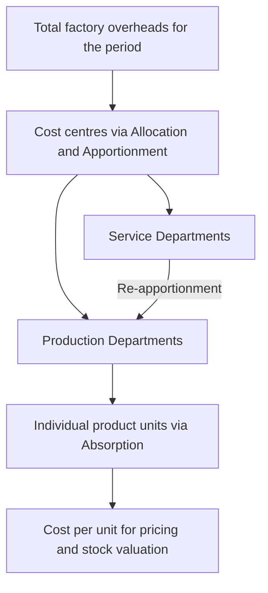
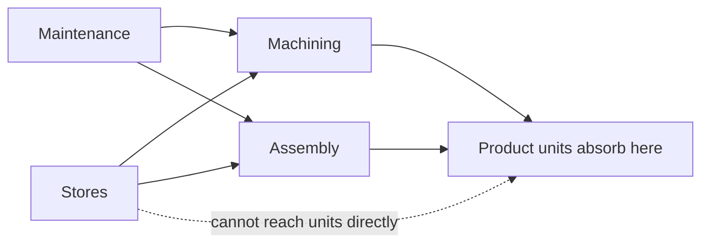
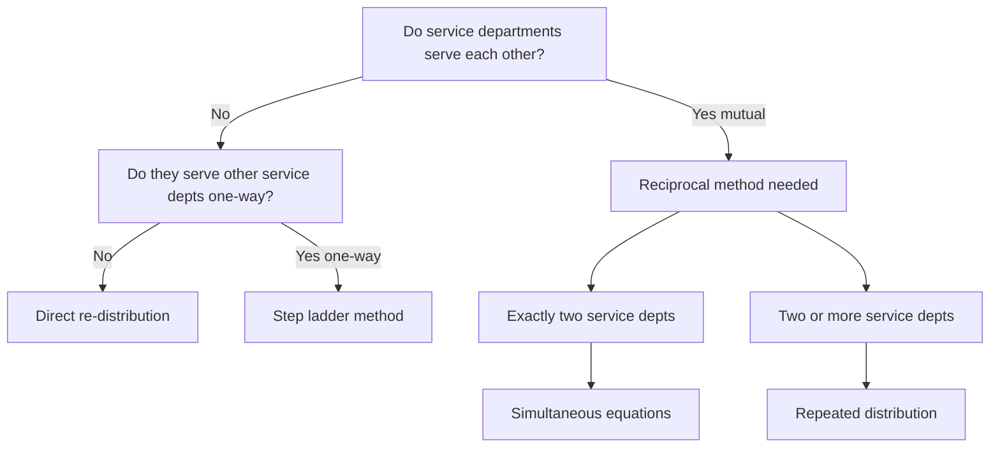
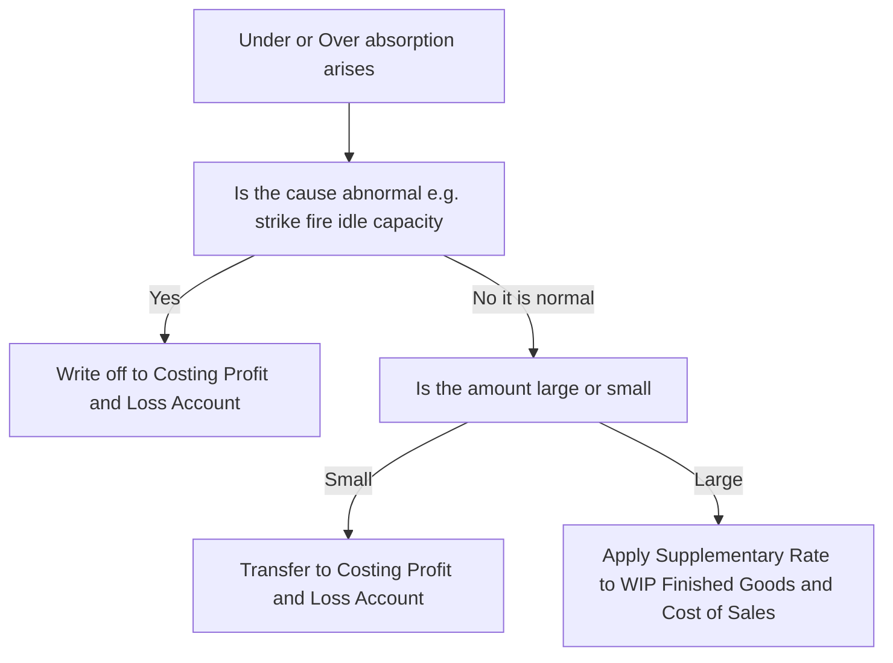
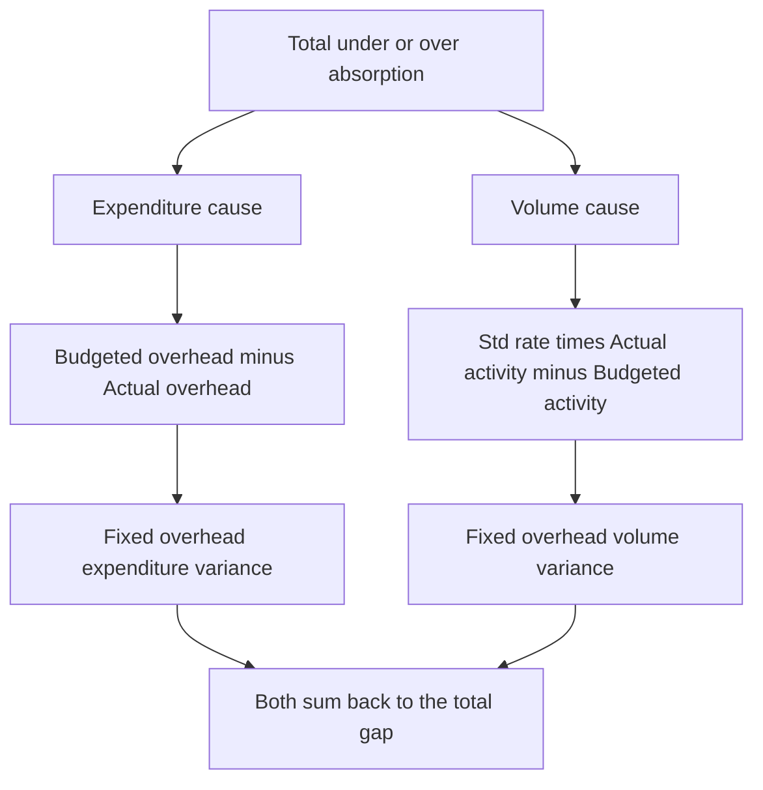

<!-- v2-deep -->

# Chapter 04 — Overheads (Absorption Costing)

## 1. The Problem — the cost that refuses to attach itself to a product

Imagine you run a workshop that makes two things: heavy steel gates and delicate steel window grills. When a customer asks "what did *my* gate cost?", some answers are easy. You can walk to the steel rack, weigh the bars that went into that gate, and read the price tag. You can look at the job card and see the welder spent four hours on it at ₹150 an hour. Steel and welder wages are **direct** — they physically point at one gate. No argument possible.

But the workshop also incurs costs that stubbornly refuse to point at any single gate:

- The factory rent of ₹40,000 a month.
- The supervisor's salary of ₹30,000 — he watched over both gates and grills.
- Electricity of ₹18,000 running lights, cranes and machines.
- Depreciation on the welding machines, the grinder, the paint booth.
- Cotton waste, lubricants, small tools, the storekeeper's wages, the timekeeper.

These are **overheads** — indirect material + indirect labour + indirect expenses. The month's total is real money that must be recovered from customers or the business dies. Yet not one rupee of it announces which gate it belongs to. The rent does not shrink if you make one less gate this Tuesday. The supervisor's ₹30,000 is a single lump watching over hundreds of jobs.

Here is the managerial pain in one sentence: **the price you quote, the profit you report, and the "which product should we push?" decision all depend on a per-unit cost — but a huge slice of cost has no natural per-unit.** Financial accounting shrugs; it only needs the *total* factory cost for the P&L and one closing-stock figure. It never has to say what one gate cost. Cost accounting must, because a manager cannot quote a price on "the factory spent ₹1,08,000 this month."

So the entire machinery of this chapter exists to solve one decision-problem:

> **Given a pile of indirect cost that belongs to no single product, how do we fairly and defensibly load a slice of it onto each unit — so we can price, value stock, and judge product profitability?**

Everything that follows — allocation, apportionment, re-apportionment of service departments, overhead rates, under/over-absorption — is a step in dragging that shapeless pile of indirect cost down onto the cost of one gate.

**Sharpening the definition — why "indirect" is a *relative* word, not an absolute one.** A cost is not born direct or indirect; it *becomes* one relative to the cost object you are measuring and to whether tracing it is economically worth the effort. The same grease can be a *direct* material if you are costing a single overhauled turbine (you meter the exact litres) but an *indirect* material if you are costing thousands of small castings (metering per casting costs more than the grease is worth). This is the **"convenience and materiality"** test that ICAI stresses: an item is treated as overhead when tracing it to the unit is either *impossible* (rent) or *not worthwhile* (a dab of glue per matchbox). Two examiner points fall out of this. First, a cost can be direct in one firm and indirect in another for the identical physical item. Second, "small value + shared use" is the fingerprint of overhead — nails, thread, coolant, small tools. Do not call something overhead merely because it is small; call it overhead because it is small *and* not economically traceable to one unit.

**Where each overhead is ultimately recovered — the three destinations.** Keep in mind from the start that not all overhead travels the same road to the customer. **Factory (works) overhead** is baked into product cost and therefore into *closing stock* — an unsold gate carries its share of factory rent on the balance sheet. **Administration overhead** is usually treated as a period cost recovered on cost of production (ICAI's default), and **Selling & Distribution overhead** is recovered only on goods *actually sold* — it never sits in stock, because you cannot "store" a salesman's commission. This single distinction — *does the overhead attach to stock or not?* — decides whether under/over-absorption of that overhead even affects inventory valuation, and it recurs in the cost sheet, in marginal costing, and in reconciliation.

---

## 2. The Core Idea — the restaurant bill split among friends

Six friends eat dinner. Three ordered individual dishes they can point to — that is *direct* cost, billed to the person. But the table shared two pizzas, a pitcher of juice, and the restaurant added a service charge and GST. Nobody "owns" the service charge. How do you split it?

You wouldn't split the shared items *equally per head* if one friend only sipped water — that's unfair. You look for a **fair basis**: split the pizza by slices eaten, the service charge in proportion to each person's own bill. You are searching for the driver that *causes* the shared cost, and you split in proportion to that driver.

That is the whole philosophy of overhead absorption:

1. **Allocation** — some shared costs actually do belong wholly to one table (a birthday cake ordered for table 4). Charge it there directly.
2. **Apportionment** — costs shared across tables (the AC electricity) are split among tables on a *fair basis* (floor area, number of diners).
3. **Absorption** — finally, each table's share is divided among the diners at that table so each person pays a per-plate amount.

Notice the two-stage descent: shapeless total → department → product. Overheads flow **from the whole factory, into cost centres, then into units**. Keep this staircase image in your head; the technical terms are just the named steps of this staircase.

**The two "unfairnesses" this analogy protects against — over-absorption and cross-subsidy.** The water-sipper problem is a *cross-subsidy*: split the shared cost on the wrong basis and one diner silently pays for another. In a factory the equivalent is a labour-light, machine-heavy product being charged on labour hours — it dodges the cost it truly causes and a labour-heavy product picks up the slack. The whole reason we hunt for a *cause-and-effect* basis is to kill cross-subsidy. If you remember only one sentence from this section: **the "fair basis" is always the thing that best explains *why the cost went up*, not the thing that is easiest to measure.**

*Figure 1 — the descent of overhead cost from a factory-wide pile down to a single unit.*



---

## 3. Why it's built this way — the logic behind the machinery

Before any formula, understand *why the method has the shape it has*. Four design decisions drive everything.

**Design decision 1 — Why go through departments at all? Why not dump total overhead ÷ total units?**
Because products don't consume the factory uniformly. A gate hogs the welding department; a grill hogs the assembly bench. If we averaged all overhead over all units blindly, the cheap-to-make grill would subsidise the machine-hungry gate, and vice versa. **Routing overhead through departments lets each product pick up cost only from the departments it actually passes through, and in proportion to how heavily it uses them.** Fairness requires the department detour.

**Design decision 2 — Why separate "production" from "service" departments?**
A production department (Machining, Assembly) directly works on the product — units flow through it, so units can absorb its cost. A **service department** (Stores, Maintenance, Canteen, Power House) never touches the product; it *serves the other departments*. Units cannot absorb Maintenance cost directly because no product "passes through" Maintenance. So service-department cost must first be pushed onto the production departments it serves, and only then reach the product. This is **secondary distribution / re-apportionment**, and it exists purely because service departments have no units of their own to soak up cost.

**Design decision 3 — Why an absorption *rate* fixed in advance?**
Because managers must quote prices *before* the month ends, when actual overhead and actual output are still unknown. You cannot tell a customer "come back on the 31st and I'll compute the real overhead." So we compute a **pre-determined rate** = *budgeted* overhead ÷ *budgeted* activity, and apply it to every job as it happens. Speed and consistency beat perfect accuracy. The price of using a pre-fixed rate is that it will never exactly match actuals — which is precisely the source of **under/over-absorption** (Section 4.6). That "error" is not a mistake; it is the unavoidable cost of being able to price in real time.

**Design decision 4 — Why choose the absorption *basis* carefully (labour hours vs machine hours vs %)?**
Because the basis is our theory of *what causes the overhead*. In a hand-welding shop, overhead rises with labour hours — so absorb on labour hours. In an automated CNC shop, overhead (power, depreciation, maintenance) rises with machine running time — so absorb on machine hours. Pick the basis that best mirrors cause-and-effect, or you systematically over-charge one product and under-charge another.

**Design decision 5 — Why is the *denominator* (activity level) itself a policy choice?**
Even after picking machine hours as the base, you must choose *which* level of machine hours goes into the pre-determined rate: theoretical maximum capacity, practical capacity, normal (average long-run) capacity, or budgeted capacity for this one period. ICAI's recommended anchor is **normal capacity** — the capacity the plant can achieve on average over a period long enough to iron out seasonal and cyclical swings, after allowing for *normal* unavoidable idle time (holidays, maintenance, setup). Why normal and not budgeted? Because if you divide fixed overhead by a *low* budgeted volume in a bad year, the per-unit rate balloons, you over-price into a falling market, sell even less, and spiral. Using **normal capacity** stabilises the rate across the cycle and deliberately *leaves* the cost of idle capacity to be exposed as a separate loss rather than hidden inside product cost. This is the deep reason under-absorption caused by working below normal capacity is treated as a *period loss* (idle-capacity cost), not smeared onto the units that happened to get made.

**Design decision 6 — Why do we treat fixed and variable overhead differently at heart?**
Variable overhead genuinely rises and falls with activity, so *any* sensible activity base recovers it cleanly. Fixed overhead is a lump that does not move with output; its per-unit figure is entirely an artefact of the volume you divide by. That means **all the drama of under/over-absorption is fundamentally a fixed-overhead phenomenon.** Grasping this now makes Standard Costing's *fixed overhead volume variance* feel like an old friend rather than a new formula.

*Figure 2 — the two families of departments and why service cost must take a detour.*



---

## 4. Full Technical Content

### 4.0 Vocabulary — nail these three verbs first

| Term | Meaning | Test to identify it |
|---|---|---|
| **Allocation** | Charging the *whole* of an overhead item to *one* cost centre, because it was incurred *wholly* for that centre. | "Can I trace 100% of this item to one department?" If yes → allocate. E.g. salary of the Machining foreman → Machining. |
| **Apportionment** | Splitting an overhead item that is *common* to several cost centres among them on a *fair basis*. | "Is this shared by many departments?" If yes → apportion. E.g. factory rent shared by all departments on floor-area. |
| **Absorption** | Charging the overhead of a *production* department onto the *units/jobs* passing through it, via an overhead rate. | The final step: department overhead → per unit. |

Mnemonic: **Allocate whole, Apportion shared, Absorb into units.** Allocation and apportionment together are called **primary distribution**. Re-apportionment of service departments is **secondary distribution**.

**Allocation vs apportionment — the razor the examiner tests.** The single distinction is *traceability of the whole*. If an entire cost item arose *because that one department exists*, allocate it (100%, no splitting). If the item arose for the factory generally and merely happens to benefit several departments, apportion it (split on a basis). The give-aways: a *separately metered* power supply to one shop → allocate; a *single* factory electricity bill → apportion. The foreman of Machining → allocate his salary to Machining; the works manager who oversees all shops → apportion his salary (usually on number of employees or direct wages). A trap: examiners give you "power ₹50,000, of which Dept A is separately metered at ₹12,000" — you *allocate* ₹12,000 to A and *apportion* the remaining ₹38,000. Mixing allocation and apportionment inside one line item is deliberately tested.

**A fourth verb you must not confuse — *collection*.** Before any allocation happens, overheads are first *collected* and *codified* (each overhead given a standing order number / cost account number so it can be gathered from invoices, wage sheets, and journals). Collection is the book-keeping gathering stage; allocation/apportionment is the *spreading* stage. Occasionally a theory question asks the difference — collection = accumulate by nature, allocation = charge to a centre.

### 4.1 Classification recap — what counts as overhead

Overhead = **Indirect Material + Indirect Labour + Indirect Expenses**. It is classified several ways, and the exam expects you to know *why each classification exists*:

- **By function:** Factory (works) OH, Administration OH, Selling & Distribution OH. *Why:* different functions are recovered differently — factory OH goes into product cost and stock; S&D OH does not touch stock, it is charged when goods are sold; administration OH is generally treated as a period cost recovered on cost of production.
- **By behaviour:** Fixed, Variable, Semi-variable. *Why:* only variable OH truly changes with output; fixed OH per unit is a fiction that depends on volume — the seed of under/over-absorption.
- **By element:** Indirect material, indirect labour, indirect expenses. *Why:* mirrors the direct trio and lets you build overhead the same way you build prime cost.
- **By control:** Controllable vs uncontrollable at a given level. *Why:* for responsibility accounting — you only blame a manager for what he can control.
- **By normality:** Normal vs abnormal overhead. *Why:* normal overhead is a legitimate part of product cost; abnormal overhead (fire, strike, flood) is a period loss written to Costing P&L. This classification is the hinge of the whole under/over-absorption *treatment* table.

**Splitting semi-variable overhead — the four exam methods.** A semi-variable overhead (e.g. maintenance, which has a standing crew plus usage-driven parts) must often be split into its fixed and variable halves. Know these four:

1. **High–Low method** — take the highest and lowest activity periods; variable rate per unit = (Cost at high − Cost at low) ÷ (Units at high − Units at low); then fixed = total cost − variable at either level. Fast, but relies on just two points, so an abnormal high/low period distorts it.
2. **Comparison / range method** — similar two-point logic, comparing two representative periods.
3. **Least-squares regression** — fits a line to *all* data points; most accurate, least examined numerically at Inter level but nameable.
4. **Graphical / scatter method** — plot cost against activity, eyeball the line, read the intercept (fixed) and slope (variable).

*Worked micro-example (High–Low).* Maintenance cost was ₹46,000 at 8,000 machine hours and ₹34,000 at 5,000 machine hours. Variable rate = (46,000 − 34,000) ÷ (8,000 − 5,000) = 12,000 ÷ 3,000 = **₹4 per hour**. Fixed = 46,000 − (4 × 8,000) = 46,000 − 32,000 = **₹14,000**. Check at the low point: 14,000 + 4 × 5,000 = 34,000 ✔.

### 4.2 Primary distribution — building the overhead distribution summary

**The task:** take every item of factory overhead and spread it across *all* cost centres (production + service) using allocation where possible and apportionment (on a fair basis) where not.

**Choosing the apportionment basis — the "why" behind each:**

| Overhead item | Fair basis of apportionment | Reason (cause-and-effect) |
|---|---|---|
| Rent, rates, building repairs, building depreciation | Floor area (sq. ft.) | Space consumed causes the cost |
| Lighting, heating | Floor area or number of light points | Roughly space-driven |
| Power / electricity (machine) | HP × machine hours, or metered KWH | Machine load causes power draw |
| Depreciation, insurance of plant | Capital value of plant / machinery | Costlier plant depreciates more |
| Supervision, canteen, welfare, ESI, PF, labour welfare | Number of employees | People-driven cost |
| Stores service, material handling | Value or weight of materials issued | Material throughput drives it |
| Indirect wages, general OH | Direct wages / direct labour hours | Labour intensity |
| Fire insurance of stock | Average value of stock held | Value at risk drives premium |
| Personnel / time-keeping / canteen | Number of employees | People-driven |
| Delivery / distribution | Weight, volume, or tonne-km of goods | Physical movement drives it |

**A subtlety examiners love — floor area vs *volume* vs light points.** Rent is floor *area*. Heating is better on *volume* (a tall bay needs more heat than its footprint suggests) if the data is given. Lighting is best on *number of light points* or *wattage* if provided, else floor area. When the question hands you a more specific driver, you are expected to *use the more specific one*; defaulting to floor area when "number of light points" is supplied loses marks. The rule: **always pick the most cause-specific basis the data permits.**

**The Primary Distribution Summary** is a table: rows = overhead items, columns = departments, plus a Basis column. Allocated items sit in one column; apportioned items are split across columns by the ratio.

**Two cross-checks you must run every time.** (1) Each *row* must sum across departments to the original item total. (2) The *primary total* row must sum to the grand total of all overheads. If either fails, you have a ratio or arithmetic slip. Building these two ticks into your muscle memory catches ~80% of avoidable exam errors here.

### 4.3 Secondary distribution — re-apportioning service departments

Now the service-department totals (from primary distribution) must be pushed onto production departments, because units can only absorb from production departments. There are four methods; the exam favours the last two.

**(a) Direct re-distribution method.** Service department cost is apportioned *only to production departments*, ignoring service-to-service usage. Simplest, least accurate. Use when the question says to ignore inter-service work. Practical note: because service-to-service usage is ignored, you must *re-base the percentages on production departments only* — e.g. if Stores served P1 40%, P2 40%, S2 20%, then under the direct method you drop the 20% and split the whole Stores cost 40:40 → i.e. 50:50 between P1 and P2.

**(b) Step-ladder (step) method.** Rank service departments by how many others they serve (the one serving the most goes first). Re-apportion the first service department to *all* remaining departments (production **and** the other service departments), then the next, and so on — but once a service department is "closed," nothing comes back to it. Handles one-way service but not mutual service. Tie-breaker when two service departments serve the same number of others: start with the one having the **larger overhead** (some texts use larger cost or larger service value — state your assumption).

**(c) Reciprocal service methods — for mutual service.** When service departments serve *each other* (Maintenance services the Power House, and the Power House powers Maintenance), we need to recognise the two-way flow. Three techniques (the exam uses the first two most):

- **Simultaneous equation method** — set up an equation for each service department's *total* cost = its own primary cost + share received from the other service department(s). Solve the simultaneous equations, then distribute the solved totals to production departments. Best for exactly two service departments; extends to three with three equations.
- **Repeated distribution method** — keep re-apportioning the service departments' balances back and forth across *all* departments in the given ratios, round after round; the service-department figures shrink each cycle until they are negligible (round off). Best when there are two or more mutually-serving service departments and the examiner says "repeated distribution."
- **Trial-and-error method** — a lighter cousin of repeated distribution: iteratively estimate each service department's total, feeding shares back, until successive estimates stop changing. Rarely asked numerically but nameable.

*Figure 3 — decision tree for which secondary-distribution method to use.*



**Simultaneous equation setup (the reasoning).** Let X and Y be the *final total* overhead of the two service departments after they absorb each other's share. If department X's own primary overhead is a, and it receives p% of Y, then:

```
X = a + p·Y
Y = b + q·X
```

Substitute and solve. The logic: X's true cost isn't just its own — it includes the slice Y dumps onto it, which itself depends on X. That circularity is exactly what the simultaneous equations untangle.

**Extending to three mutually-serving service departments.** With S1, S2, S3 you write three equations, one per department, each equal to its own primary cost plus the shares it receives from the other two. Solve the 3×3 system (substitution or elimination). The distribution step is identical: apply each *solved* total to production departments using the original percentages. The examiner rarely goes beyond three because the algebra explodes.

**Why the two reciprocal methods must agree.** Both are just different arithmetic for the same accounting truth: every rupee of service cost must end up on production departments, and the two-way flows must be honoured. Simultaneous equations solve the circularity in closed form; repeated distribution converges to the same fixed point by brute iteration. If your two answers differ by more than rounding, one of them is wrong — a free self-check the exam hands you.

### 4.4 Absorption — turning department overhead into a per-unit rate

Once every production department holds its full overhead (own + service share), we absorb it into units. **Overhead absorption rate:**

```
Overhead Absorption Rate = Overhead of the production department ÷ Total quantity of the chosen base
```

The six standard bases, each with its "when to use it and why":

| Method | Formula | Use when / why |
|---|---|---|
| **1. Percentage of Direct Material cost** | (Prod OH ÷ Direct Material) × 100 | Rarely fair — material price swings distort it; only if material and OH move together |
| **2. Percentage of Direct Wages** | (Prod OH ÷ Direct Wages) × 100 | When labour rates are uniform and time-driven OH dominates; simple but ignores that a high-paid worker isn't slower |
| **3. Percentage of Prime Cost** | (Prod OH ÷ Prime Cost) × 100 | Blends the flaws of the two above; seldom ideal |
| **4. Labour Hour Rate** | Prod OH ÷ Direct Labour Hours | **Best for labour-intensive** work — OH driven by *time* spent, not wage rate |
| **5. Machine Hour Rate** | Prod OH ÷ Machine Hours | **Best for machine-intensive** work — power, depreciation, maintenance track running time |
| **6. Rate per Unit of output** | Prod OH ÷ Units produced | Only when output is *homogeneous* (one product) |

**Why labour-hour and machine-hour rates are preferred:** overhead is fundamentally *time-related* (rent accrues by the hour, depreciation by usage, supervision by shift-length). Money-based bases (% of material/wages) get distorted by price fluctuations that have nothing to do with overhead consumption. Time-based rates track the real cause.

**The percentage-basis distortion made concrete.** Suppose factory OH is ₹1,00,000 and total direct wages ₹2,00,000, giving a 50% wage-based rate. A job using a ₹500/day skilled worker for 1 day (₹500 wages) absorbs ₹250 OH, while an identical job done in the same 1 day by a ₹300/day worker (₹300 wages) absorbs only ₹150 — even though both jobs occupied the factory for the *same time* and therefore caused the *same* time-related overhead. The wage basis has silently made overhead depend on *who* did the work rather than *how long* it took. That is precisely why the labour-*hour* rate (which charges both jobs equally) is preferred whenever overhead is time-driven.

**Machine Hour Rate — the composite build-up.** MHR is often built by summing standing charges and running charges per machine hour:

- *Standing / fixed charges* (rent, supervision, insurance for the machine) → apportioned to the machine, then ÷ machine hours.
- *Machine expenses* (power, depreciation, repairs) → per machine hour directly.

MHR = (Standing charges per hour) + (Machine expenses per hour). This is the "**comprehensive machine hour rate**" if it also loads the operator's wages and setup.

**Effective vs total machine hours — the trap inside MHR.** The denominator is *effective* (productive) machine hours, not the calendar total. From gross available hours you subtract *normal* idle time — setup, maintenance, tea breaks, normal breakdowns — because standing charges must be recovered over the hours the machine can *actually* work. A machine "available" 2,400 hours but productive only 2,200 hours (after 200 hours normal maintenance/setup) recovers its standing charges over **2,200**, not 2,400. If you wrongly use 2,400 you under-recover standing charges by design. But note the asymmetry: *abnormal* idle time (a freak two-week breakdown) is **not** deducted from the denominator — its cost is charged to Costing P&L as an abnormal loss, so that the rate reflects normal running only.

**Should machine operators' wages be inside MHR?** Two treatments exist and the question dictates which:
- If one operator runs *one* machine, the operator's wage can be treated as a *direct* wage of the job (charged separately), so it stays *out* of MHR.
- If one operator tends *several* machines, his wage is a shared/indirect cost that belongs *inside* the comprehensive MHR (apportioned per machine hour).
Read the question: "comprehensive machine hour rate" usually signals *include* wages and setup; a plain "machine hour rate for overhead" usually means *exclude* direct operator wages.

**Depreciation basis inside MHR.** For machine hour rate purposes ICAI generally favours depreciation on a *usage/machine-hour* basis (or straight-line spread over effective hours), because MHR is trying to charge cost *per running hour*. Watch for questions giving depreciation as a lump p.a. — divide by effective hours. If a question gives a scrap/residual value, depreciation = (Cost − Residual) ÷ Life, then ÷ effective hours per year.

### 4.5 Blanket rate vs Departmental rate — one rate or many?

A **blanket (single) overhead rate** = total factory overhead ÷ total factory base (e.g., total labour hours), one rate for the *whole* factory.

A **departmental rate** = a *separate* rate for each production department.

**Why departmental rates are almost always better:** a blanket rate is only fair if *every* product spends the *same proportion* of time in *every* department. Real products don't. A gate that lives in the expensive Machining department but skips Assembly would, under a blanket rate, be undercharged (it dodges Machining's high rate) while a grill that lives in cheap Assembly gets overcharged. **Blanket rates are acceptable only when there is a single product, or all products flow uniformly through all departments.** Otherwise use departmental rates. This is examinable as a theory question — know the one-line justification.

**A numerical feel for the blanket-rate error.** Factory OH ₹80,000; Machining OH ₹60,000 over 6,000 hours (₹10/hr) and Assembly OH ₹20,000 over 14,000 hours (₹1.43/hr). Blanket rate = 80,000 ÷ 20,000 = ₹4/hr. Job Alpha spends 8 machining hours + 2 assembly hours (10 hrs). Departmental cost = 8×10 + 2×1.43 = 80 + 2.86 = ₹82.86. Blanket cost = 10 × 4 = ₹40. The blanket rate under-costs the machining-heavy Alpha by more than half — you would price it below cost and lose money on every unit while over-pricing (and losing tenders for) the assembly-heavy jobs. This single contrast is the exam's favourite "explain with figures" prompt.

**Even *within* a department you can go finer — cost-centre / machine rates.** If one department houses a cheap bench and an expensive CNC, a *single departmental* rate still cross-subsidises. The logical end-point of "get finer for fairness" is a *machine-hour rate per machine* (a cost centre of one machine). The trade-off is always accuracy vs the clerical cost of maintaining many rates — ABC (Activity Based Costing, a later chapter) is this idea pushed to activity level.

### 4.6 Under- and Over-absorption — the inevitable gap, and what to do with it

Because we absorb using a **pre-determined rate** (budgeted OH ÷ budgeted activity) but reality delivers **actual OH** and **actual activity**, the amount absorbed almost never equals the actual overhead incurred.

```
Overhead absorbed = Pre-determined rate × Actual base achieved
Under/Over absorption = Overhead absorbed − Actual overhead incurred
```

- If **absorbed > actual** → **over-absorption** (we loaded products with more OH than we actually spent; profit understated by cost accounts, needs adding back).
- If **absorbed < actual** → **under-absorption** (products didn't carry enough OH; profit overstated in cost accounts, needs charging).

**Why does the gap arise? Two independent causes — you must be able to name them:**
1. **Cost (expenditure) variance:** actual overhead spent ≠ budgeted overhead (spent more/less than planned).
2. **Volume variance:** actual activity (hours/units) ≠ budgeted activity — this alone moves the *fixed* overhead recovery, because the fixed OH per unit was calculated on budgeted volume.

**Decomposing the gap — a preview of Standard Costing.** You can actually *split* total under/over-absorption into these two causes numerically, which examiners sometimes ask even in this chapter:

```
Total gap        = Absorbed − Actual
Expenditure part = Budgeted overhead − Actual overhead
Volume part      = Absorbed − Budgeted overhead
                 = Std rate × (Actual activity − Budgeted activity)
```

The two parts add back to the total gap. This is exactly the *fixed overhead expenditure variance* and *fixed overhead volume variance* you will formalise later — proof that under/over-absorption is the seed of overhead variance analysis.

**Treatment — three routes, and WHY each is chosen (ICAI):**

| Situation | Treatment | Reasoning |
|---|---|---|
| Small amount, due to *normal* reasons | Transfer to **Costing P&L Account** | Not worth re-working every cost; write off the normal, expected slippage |
| Large amount, due to *normal* reasons (wrong estimate of rate/volume) | Use a **supplementary rate** to adjust WIP, finished goods and cost of sales | The products were mis-costed; fairness demands going back and correcting stock values and cost of sales pro-rata |
| Any amount due to **abnormal** reasons (strike, fire, breakdown, idle capacity) | Transfer to **Costing P&L Account** | Abnormal costs must never distort product cost or stock; they are period losses |

**Supplementary rate** = amount of under/over-absorption ÷ actual base, applied to spread the correction across closing WIP + finished goods + cost of goods sold. Under-absorption → *positive* supplementary rate added to costs; over-absorption → *negative* rate deducted.

**Two ways to apply a supplementary rate — and the exam's preference.** You can spread the correction either (a) by a *rate per unit/hour* applied to the physical quantity in each of WIP, FG and COGS, or (b) *pro-rata on the value of overhead already absorbed* in each of the three. Both reconcile to the same total; use whichever the data supports. When only percentages of the absorbed-overhead value are given (as in Example 3), use method (b). When units/hours in each bucket are given, method (a) is cleaner.

**The idle-capacity nuance — the most-missed "normal but not on product" case.** When under-absorption arises purely because the plant worked below **normal capacity** (a demand slump, not a one-off disaster), the associated fixed overhead is an **idle-capacity cost**. ICAI treats the *normal* portion of idle-capacity cost as a period cost written to Costing P&L (it should not inflate the cost of the units that *were* made), while any *abnormal* idle capacity (a strike) is also a period loss. In short, sub-normal working does **not** get spread by supplementary rate onto stock — a subtle exception to the "normal + large → supplementary rate" rule. Read the *cause* before you reach for the supplementary rate.

*Figure 4 — treatment logic for under/over-absorbed overhead.*



*Figure 5 — how the two causes of the gap map onto fixed-overhead variances.*



### 4.7 Administration and Selling & Distribution overhead — the roads less travelled

Factory overhead dominates the exam, but the treatment of the *other two* functional overheads is examinable theory.

**Administration overhead — three schools of thought:**
1. **Apportion between production and S&D** — treat admin as serving both the factory and the selling function, split on a suitable basis. (Older view.)
2. **Charge to Costing P&L as a period cost** — admin is a policy cost of running the entity, not caused by units; write it off in the period.
3. **Recover as a separate addition on cost of production** — ICAI's common default: build a percentage-of-works-cost rate and add admin overhead as its own line in the cost sheet. Know that admin OH is generally recovered on **cost of production** (or works cost), typically as a percentage.

**Selling & Distribution overhead — the key features:**
- Recovered only on units **sold**, never on units merely produced, so S&D overhead **does not enter stock valuation.** (This is *the* reason it is excluded from closing-stock cost.)
- Common recovery bases: percentage of works/production cost, percentage of selling price, or a rate per unit sold.
- Distribution-specific costs (freight out, warehousing of finished goods, delivery vans) are best recovered on weight/volume/tonne-km moved.

**Why the distinction matters downstream.** Because S&D overhead never touches stock, a change in its absorption cannot mis-value inventory — so its under/over-absorption is almost always just written to Costing P&L. Factory overhead, sitting in stock, is the one whose mis-absorption can distort the balance sheet, which is exactly why the supplementary-rate machinery exists mainly for *factory* overhead.

---

## 5. Worked Examples

### Example 1 (warm-up) — Machine Hour Rate from first principles

**Problem.** A machine in the Machining department has the following annual data. Compute the machine hour rate.

- Cost of machine ₹2,40,000; scrap value ₹20,000; life 10 years.
- Rent of the department ₹36,000 p.a.; the machine occupies 1/4 of the floor area.
- Supervision ₹48,000 p.a.; the machine is 1 of 4 identical machines supervised.
- Power: machine consumes 5 units/hour at ₹6 per unit.
- Repairs & maintenance ₹11,000 p.a.
- The machine runs 2,200 hours a year (effective).

**Step 1 — sort each cost into standing charge or running charge, and get it per year.**

| Item | Amount to this machine (₹ p.a.) | Basis | Working |
|---|---|---|---|
| Depreciation | 22,000 | (Cost − scrap) ÷ life | (2,40,000 − 20,000)/10 |
| Rent | 9,000 | 1/4 of ₹36,000 (floor area) | 36,000 × 1/4 |
| Supervision | 12,000 | 1 of 4 machines | 48,000 × 1/4 |
| Repairs & maintenance | 11,000 | Allocated to this machine | — |
| **Total standing + fixed running (excl. power)** | **54,000** | | |

**Step 2 — standing/fixed charge per machine hour.**
= 54,000 ÷ 2,200 hours = **₹24.545 per hour**.

**Step 3 — power (a pure running charge) per hour.**
= 5 units × ₹6 = **₹30 per hour**.

**Step 4 — Machine Hour Rate.**
= 24.545 + 30 = **₹54.55 per machine hour** (rounded).

**Check:** total annual overhead recovered = 54.545 × 2,200 = ₹1,20,000, which equals fixed 54,000 + power (30 × 2,200 = 66,000) = ₹1,20,000. ✔ Reconciles.

**Examiner tweak A — "the machine ran 2,400 gross hours but 200 hours were normal setup/maintenance."** Then effective hours are still **2,200** and nothing changes — but you must *state* that standing charges are spread over effective (2,200), not gross (2,400) hours, and justify it (setup/maintenance are normal idle time). If instead the 200 hours were an *abnormal* breakdown, you would compute MHR on the *normal available* hours (say 2,400) and separately charge the cost of the 200 idle hours' standing charges to Costing P&L. Test: which idle time is normal?

**Examiner tweak B — operator wage added.** If one operator minds this machine at ₹40/effective hour and the question asks for a *comprehensive* MHR, add ₹40: comprehensive MHR = 54.55 + 40 = **₹94.55/hr**. If instead one operator minds four machines at ₹1,60,000 p.a., his wage is indirect: 1,60,000 ÷ 4 = ₹40,000 to this machine ÷ 2,200 = ₹18.18/hr → comprehensive MHR = 54.55 + 18.18 = **₹72.73/hr**. Same operator cost, different per-machine load — read the sharing carefully.

---

### Example 2 (core) — Full primary + secondary distribution (repeated distribution + simultaneous equation)

**Problem.** A factory has two production departments **P1, P2** and two service departments **S1 (Stores)** and **S2 (Maintenance)**. Overheads and data:

| Overhead item | Amount (₹) | Basis |
|---|---|---|
| Rent | 20,000 | Floor area |
| Depreciation of plant | 30,000 | Value of plant |
| Supervision | 24,000 | Number of employees |
| Indirect materials | 6,000 | Allocated (given) |

Allocated indirect materials: P1 ₹2,500, P2 ₹2,000, S1 ₹900, S2 ₹600 (totals 6,000).

Departmental data:

| | P1 | P2 | S1 | S2 | Total |
|---|---|---|---|---|---|
| Floor area (sq. m) | 3,000 | 2,000 | 500 | 500 | 6,000 |
| Value of plant (₹'000) | 60 | 40 | 12 | 8 | 120 |
| Number of employees | 40 | 30 | 6 | 4 | 80 |

Service department usage (how each service dept's work is consumed):

- **S1 (Stores)** serves: P1 40%, P2 40%, S2 20%.
- **S2 (Maintenance)** serves: P1 30%, P2 40%, S1 30%.

Because S1 serves S2 *and* S2 serves S1, this is **mutual/reciprocal** service. We'll do the primary distribution, then solve by both **simultaneous equations** and **repeated distribution** to show they agree.

---

**Step 1 — Primary distribution summary.**

*Rent* by floor area 3000:2000:500:500 = 6:4:1:1 (of 12). 20,000/12 = 1,666.67 per part.
- P1 10,000; P2 6,666.67; S1 1,666.67; S2 1,666.67.

*Depreciation* by plant value 60:40:12:8 (of 120). 30,000/120 = 250 per unit.
- P1 15,000; P2 10,000; S1 3,000; S2 2,000.

*Supervision* by employees 40:30:6:4 (of 80). 24,000/80 = 300 per employee.
- P1 12,000; P2 9,000; S1 1,800; S2 1,200.

*Indirect materials* allocated: P1 2,500; P2 2,000; S1 900; S2 600.

| Item | Basis | P1 | P2 | S1 | S2 | Total |
|---|---|---|---|---|---|---|
| Rent | Floor area | 10,000.00 | 6,666.67 | 1,666.67 | 1,666.67 | 20,000 |
| Depreciation | Plant value | 15,000.00 | 10,000.00 | 3,000.00 | 2,000.00 | 30,000 |
| Supervision | Employees | 12,000.00 | 9,000.00 | 1,800.00 | 1,200.00 | 24,000 |
| Indirect material | Allocated | 2,500.00 | 2,000.00 | 900.00 | 600.00 | 6,000 |
| **Primary total** | | **39,500.00** | **27,666.67** | **7,366.67** | **5,466.67** | **80,000** |

Cross-check: 39,500 + 27,666.67 + 7,366.67 + 5,466.67 = **80,000**. ✔

---

**Step 2 — Secondary distribution by SIMULTANEOUS EQUATIONS.**

Let **S1** = total overhead of Stores after receiving Maintenance's share, and **S2** = total overhead of Maintenance after receiving Stores' share.

- S1 receives 30% of S2 (Maintenance gives 30% to Stores).
- S2 receives 20% of S1 (Stores gives 20% to Maintenance).

```
S1 = 7,366.67 + 0.30 S2      ...(i)
S2 = 5,466.67 + 0.20 S1      ...(ii)
```

Substitute (ii) into (i):
S1 = 7,366.67 + 0.30 (5,466.67 + 0.20 S1)
S1 = 7,366.67 + 1,640.00 + 0.06 S1
S1 − 0.06 S1 = 9,006.67
0.94 S1 = 9,006.67 → **S1 = 9,581.56**

Then S2 = 5,466.67 + 0.20 × 9,581.56 = 5,466.67 + 1,916.31 = **S2 = 7,382.98**.

**Now distribute the solved totals to production departments only** (each dept's share of the *whole* solved figure, using the given percentages):

Stores S1 = 9,581.56 → P1 40%, P2 40% (the 20% to S2 is already captured in the equations):
- To P1: 0.40 × 9,581.56 = 3,832.62
- To P2: 0.40 × 9,581.56 = 3,832.62

Maintenance S2 = 7,382.98 → P1 30%, P2 40%:
- To P1: 0.30 × 7,382.98 = 2,214.89
- To P2: 0.40 × 7,382.98 = 2,953.19

| | P1 (₹) | P2 (₹) |
|---|---|---|
| Primary total | 39,500.00 | 27,666.67 |
| From S1 (Stores) | 3,832.62 | 3,832.62 |
| From S2 (Maintenance) | 2,214.89 | 2,953.19 |
| **Total overhead** | **45,547.51** | **34,452.48** |

**Reconciliation:** 45,547.51 + 34,452.48 = **79,999.99 ≈ 80,000**. ✔ (rounding). The whole ₹80,000 has landed on the two production departments — exactly what secondary distribution must achieve.

---

**Step 3 — Verify by REPEATED DISTRIBUTION (same data).**

Start with service balances S1 = 7,366.67, S2 = 5,466.67 and keep re-apportioning until they vanish. Percentages: S1 → P1 40, P2 40, S2 20; S2 → P1 30, P2 40, S1 30.

| Round | P1 | P2 | S1 | S2 |
|---|---|---|---|---|
| Opening (primary) | 39,500.00 | 27,666.67 | 7,366.67 | 5,466.67 |
| Distribute S1 (7,366.67): 40/40/–/20 | +2,946.67 | +2,946.67 | (7,366.67) | +1,473.33 |
| S2 now = 5,466.67+1,473.33 = 6,940.00; distribute 30/40/30 | +2,082.00 | +2,776.00 | +2,082.00 | (6,940.00) |
| S1 now = 2,082.00; distribute 40/40/20 | +832.80 | +832.80 | (2,082.00) | +416.40 |
| Distribute S2 = 416.40: 30/40/30 | +124.92 | +166.56 | +124.92 | (416.40) |
| S1 = 124.92; distribute 40/40/20 | +49.97 | +49.97 | (124.92) | +24.98 |
| Distribute S2 = 24.98: 30/40/30 | +7.49 | +9.99 | +7.49 | (24.98) |
| S1 = 7.49; distribute 40/40/20 | +3.00 | +3.00 | (7.49) | +1.50 |
| Distribute S2 = 1.50 (round off to P1/P2) | +0.75 | +0.75 | — | (1.50) |
| **Totals** | **≈45,547.60** | **≈34,452.41** | 0 | 0 |

Both methods land P1 ≈ ₹45,548 and P2 ≈ ₹34,452, totalling ₹80,000. ✔ **The two reciprocal methods agree** — the small differences are pure rounding. This is your self-check discipline: if simultaneous equations and repeated distribution disagree by more than rounding, you made an arithmetic slip.

---

**Step 4 — CONTRAST: what if the examiner said "use the DIRECT method"?**

Under the direct method we ignore service-to-service work, so we drop the S1→S2 (20%) and S2→S1 (30%) flows and re-base each service department onto production departments only.

- **S1 (Stores) ₹7,366.67** originally 40:40 to P1:P2 (the 20% to S2 dropped) → re-based 50:50.
  - P1 3,683.34; P2 3,683.33.
- **S2 (Maintenance) ₹5,466.67** originally 30:40 to P1:P2 (the 30% to S1 dropped) → re-based 30:40 = 3:4 of 7.
  - P1 = 5,466.67 × 3/7 = 2,342.86; P2 = 5,466.67 × 4/7 = 3,123.81.

| | P1 (₹) | P2 (₹) |
|---|---|---|
| Primary total | 39,500.00 | 27,666.67 |
| From S1 (50:50) | 3,683.34 | 3,683.33 |
| From S2 (3:4) | 2,342.86 | 3,123.81 |
| **Total** | **45,526.20** | **34,473.81** |

Check: 45,526.20 + 34,473.81 = **80,000.01 ≈ 80,000** ✔. Note the answers differ from the reciprocal method (P1 fell from 45,548 to 45,526) — proof that **the method choice changes the departmental overhead, and hence the rate, and hence the quoted price.** The direct method is not "wrong," it is *less accurate*; the examiner chooses the method by instruction, so always read which method is demanded before computing.

---

### Example 3 (exam-hard) — Absorption rate, application, and under/over-absorption with supplementary rate

**Problem.** Continuing the factory, department **P1** is **machine-intensive** and **P2** is **labour-intensive**. For the year:

| | P1 | P2 |
|---|---|---|
| Budgeted overhead (₹) | 45,548 | 34,452 |
| Budgeted machine hours | 22,000 | — |
| Budgeted labour hours | — | 17,000 |

At year-end, **actuals** turned out:

| | P1 | P2 |
|---|---|---|
| Actual overhead incurred (₹) | 48,000 | 33,000 |
| Actual machine hours | 21,000 | — |
| Actual labour hours | — | 18,000 |

Additional: of P1's under/over-absorption, ₹1,000 of the actual overhead excess was due to an **abnormal machine breakdown**. At year-end, output that carried P1's overhead sits as: Finished goods 60%, Closing WIP 15%, Cost of goods sold 25% (by absorbed-overhead value). Required: (a) absorption rates, (b) overhead absorbed, (c) under/over-absorption and its split into normal/abnormal, (d) treatment including a supplementary rate for the normal part in P1.

---

**Part (a) — choose base and compute pre-determined rates.**

P1 is machine-intensive → **Machine Hour Rate**:
Rate = 45,548 ÷ 22,000 = **₹2.0704 per machine hour**.

P2 is labour-intensive → **Labour Hour Rate**:
Rate = 34,452 ÷ 17,000 = **₹2.0266 per labour hour**.

*Why these bases:* P1's overhead (power, depreciation) tracks machine running time; P2's tracks operator time. Using the cause-driven base keeps each product's charge fair.

**Part (b) — overhead absorbed = pre-determined rate × ACTUAL base.**

- P1 absorbed = 2.0704 × 21,000 = **₹43,478.40**.
- P2 absorbed = 2.0266 × 18,000 = **₹36,478.80**.

**Part (c) — under/over-absorption = absorbed − actual.**

- P1: 43,478.40 − 48,000 = **−₹4,521.60 → UNDER-absorbed** (absorbed less than spent; products under-charged).
- P2: 36,478.80 − 33,000 = **+₹3,478.80 → OVER-absorbed** (absorbed more than spent).

*Split P1's under-absorption into normal and abnormal:*
- Abnormal (machine breakdown) = **₹1,000** of the actual overhead was abnormal.
- The abnormal portion of the under-absorption is that ₹1,000 (extra actual cost that should never touch product cost).
- Normal under-absorption = 4,521.60 − 1,000 = **₹3,521.60**.

**Part (d) — treatment.**

*Abnormal ₹1,000 (P1):* transfer straight to **Costing P&L Account** — abnormal losses must not distort stock or product cost.

*P2 over-absorption ₹3,478.80:* the question gives no abnormal cause and the amount is modest relative to overhead; treat as normal and transfer (credit) to **Costing P&L Account** (over-absorption increases costing profit). *Note:* if the examiner labelled it "significant," you would instead spread it via a negative supplementary rate.

*Normal under-absorption ₹3,521.60 (P1) — large, correct via SUPPLEMENTARY RATE across WIP + FG + COGS:*

Supplementary rate is applied on the absorbed-overhead value carried by each stock category. Split ₹3,521.60 in the ratio FG 60 : WIP 15 : COGS 25.

| Where P1 overhead sits | % | Additional charge (₹) | Working |
|---|---|---|---|
| Finished goods | 60% | 2,112.96 | 3,521.60 × 0.60 |
| Closing WIP | 15% | 528.24 | 3,521.60 × 0.15 |
| Cost of goods sold | 25% | 880.40 | 3,521.60 × 0.25 |
| **Total** | 100% | **3,521.60** | ✔ |

*Why spread it, not just write it off?* The ₹3,521.60 means every unit that passed through P1 this year was under-costed. Fairness (and true stock valuation) demands we go back and raise the cost of the units still in stock (FG + WIP) as well as those already sold (COGS). Writing the whole lot to P&L would leave closing stock understated — misstating both this year's profit and next year's opening cost.

**Final reconciliation of P1's ₹4,521.60 under-absorption:**
- Abnormal → P&L: 1,000.00
- Normal → supplementary rate (FG 2,112.96 + WIP 528.24 + COGS 880.40): 3,521.60
- **Total 4,521.60** ✔ Fully accounted for.

**Examiner tweak — decompose P1's gap into expenditure and volume causes.** Using the preview formulas of 4.6, treating the ₹45,548 budget as the budgeted overhead and the pre-determined rate as the "standard" rate:
- Expenditure part = Budgeted − Actual = 45,548 − 48,000 = **−₹2,452** (spent more than budget → adverse).
- Volume part = Std rate × (Actual − Budgeted hours) = 2.0704 × (21,000 − 22,000) = 2.0704 × (−1,000) = **−₹2,070.4** (worked fewer hours than planned → under-recovery).
- Sum = −2,452 − 2,070.4 = **−₹4,522.4 ≈ −₹4,521.6** (the whole under-absorption, difference is rounding of the rate). ✔ The gap is genuinely two causes stacked: overspending *and* under-working.

---

### Example 4 (exam-hard) — Step-ladder vs reciprocal on three service departments, and blanket-vs-departmental impact

**Problem.** A plant has production departments **A, B** and service departments **X, Y, Z**. After primary distribution the department totals are: A ₹50,000; B ₹40,000; X ₹12,000; Y ₹9,000; Z ₹6,000 (grand total ₹1,17,000). Service usage:

| Serving dept | to A | to B | to X | to Y | to Z |
|---|---|---|---|---|---|
| **X** | 40% | 30% | — | 20% | 10% |
| **Y** | 30% | 40% | 20% | — | 10% |
| **Z** | 50% | 40% | 10% | — | — |

Z serves only production plus X (one-way; nothing comes back to Z from X or Y in Z's own row). But X and Y serve each other, so overall there is reciprocity between X and Y. Required: re-apportion by the **step-ladder method** (state your ordering) and comment.

---

**Step 1 — order the service departments.** Rank by how many *other* departments each serves and by size. X serves 4 others (A,B,Y,Z), Y serves 4 others (A,B,X,Z), Z serves 3 (A,B,X). X and Y tie on count; X has the larger overhead (₹12,000 > ₹9,000), so **order: X → Y → Z.** (State this; ordering assumptions earn marks.)

**Step 2 — distribute X (₹12,000) to A,B,Y,Z in 40:30:20:10.**
- A +4,800; B +3,600; Y +2,400; Z +1,200.
- Y now = 9,000 + 2,400 = 11,400; Z now = 6,000 + 1,200 = 7,200. X closed.

**Step 3 — distribute Y (₹11,400).** Under the step method, once X is closed nothing returns to X, so Y's 20%-to-X is dropped and Y is re-based over A,B,Z = 30:40:10 (of 80).
- A += 11,400 × 30/80 = 4,275.00; B += 11,400 × 40/80 = 5,700.00; Z += 11,400 × 10/80 = 1,425.00.
- Z now = 7,200 + 1,425 = 8,625. Y closed.

**Step 4 — distribute Z (₹8,625).** X and Y are closed, so Z's 10%-to-X is dropped; re-base over A,B = 50:40 = 5:4 (of 9).
- A += 8,625 × 5/9 = 4,791.67; B += 8,625 × 4/9 = 3,833.33. Z closed.

**Step 5 — assemble.**

| | A (₹) | B (₹) |
|---|---|---|
| Primary | 50,000.00 | 40,000.00 |
| From X | 4,800.00 | 3,600.00 |
| From Y | 4,275.00 | 5,700.00 |
| From Z | 4,791.67 | 3,833.33 |
| **Total** | **63,866.67** | **53,133.33** |

**Reconciliation:** 63,866.67 + 53,133.33 = **1,17,000.00** ✔ — the entire ₹1,17,000 has landed on A and B.

**Comment (the exam mark).** The step method honoured the one-way flows in ranked order but *could not* send Y's cost back to the already-closed X, so it approximates the true reciprocity between X and Y. A full reciprocal (simultaneous-equation) solution would differ slightly; the step method trades a little accuracy for far less arithmetic. State this trade-off.

**Follow-on — blanket vs departmental rate.** Suppose A runs 30,000 machine hours and B runs 20,000 labour hours. Departmental rates: A = 63,866.67 ÷ 30,000 = **₹2.129/machine hr**; B = 53,133.33 ÷ 20,000 = **₹2.657/labour hr**. A blanket rate over combined 50,000 hours = 1,17,000 ÷ 50,000 = **₹2.34/hr**. A job spending 10 hours entirely in A would absorb 10 × 2.34 = ₹23.40 under the blanket rate but only 10 × 2.129 = ₹21.29 under the departmental rate — the blanket rate *over-charges* an A-only job because it is dragged up by B's higher rate. This is the numeric proof that blanket rates cross-subsidise whenever departmental rates differ and products do not flow uniformly.

---

## 6. Presentation / Format — how to lay it out in the exam

1. **Primary Distribution Summary** — always a table: first column *Item*, second column *Basis of apportionment*, then one column per department (production first, service last), final *Total* column. Show the *ratio* of apportionment in the basis column (e.g., "Floor area 6:4:1:1"). Cross-total the last row and tick it against the grand total.
2. **Secondary Distribution** — continue the same table downward: add rows "Redistribution of S1," "Redistribution of S2." Put the department being closed in *brackets* (negative). End with a bold "Total overhead of production departments" row that must equal the grand total.
3. **Simultaneous equations** — write the two equations explicitly, show substitution, state S1 and S2 clearly before distributing.
4. **Overhead rates** — state the base chosen *and one line of justification* ("machine-intensive → machine hour rate"). Examiners award marks for the justification.
5. **Under/over-absorption** — always present as `Absorbed − Actual`, then label under vs over in words, then the treatment with reasoning.
6. Round money to two decimals; round the *last* repeated-distribution cycle to close service departments to nil.
7. **State every assumption** — the step-method ordering, the capacity level used in the denominator (normal vs budgeted), whether operator wages are in/out of MHR. A one-line stated assumption converts an "ambiguous" question into a defensible answer and protects your marks.
8. **Machine hour rate layout** — split the working into a *Standing charges* block and a *Machine/running expenses* block, sub-total each per hour, then add. This mirrors the marking scheme and makes partial credit easy to award.
9. **Show the reconciliation tick (✔)** at every cross-total — primary total = grand total; secondary total on production depts = grand total; supplementary-rate split = the amount being spread. Visible reconciliation signals control of the numbers.

---

## 7. Connections — where this sits in the wider syllabus

- **← Material & Labour (Ch. 02–03):** direct material and direct labour were traceable; this chapter handles everything that *isn't* traceable. Prime cost (from Ch. 02–03) + factory overhead (this chapter) = **Works/Factory cost** in the cost sheet (Ch. 06).
- **→ Cost Sheet:** the absorbed factory overhead is the line that turns prime cost into works cost. Administration and S&D overheads (same allocation logic) come later in the sheet, and only S&D is excluded from stock valuation.
- **→ Job & Batch Costing:** the overhead absorption *rate* computed here is exactly what a job card uses to load overhead onto each job.
- **→ Activity Based Costing (ABC):** ABC is this chapter's "finer and finer for fairness" logic pushed all the way to *activities* and *cost drivers*, replacing volume-based rates where overhead is driven by transactions (setups, inspections) rather than hours.
- **→ Standard Costing & Variance Analysis:** under/over-absorption is the seed of **fixed overhead volume and expenditure variances** — the "cost variance" and "volume variance" causes named in 4.6 become formal variances later (see Figure 5).
- **→ Marginal Costing:** marginal costing *refuses* to absorb fixed overhead into product cost at all — understanding absorption here is what lets you appreciate the contrast (and the reconciliation of profits under the two systems, which turns on fixed OH in stock).
- **→ Budgetary Control:** the pre-determined rate depends on the *budgeted* overhead and *budgeted* activity produced by the budgeting process; the choice of normal capacity ties directly to flexible budgets.
- **→ Reconciliation of Cost & Financial Accounts:** under/over-absorbed overhead is a classic reconciling item between costing profit and financial profit.

---

## 8. Traps & Examiner Tricks

1. **Absorbed vs actual base confusion.** Overhead *absorbed* = pre-determined rate × **actual** base (not budgeted base). A very common slip is multiplying by budgeted hours. Pre-determined rate uses *budgeted* figures; application uses *actual* activity.
2. **Direction of under vs over.** Absorbed **>** actual = **over**-absorbed (add back to profit). Absorbed **<** actual = **under**-absorbed (charge to profit). Memorise via: "over-absorbed = we over-charged products = costing profit understated = credit P&L."
3. **Distributing the SOLVED service total, not the residual.** In the simultaneous-equation method, after solving S1 and S2, distribute the *full solved figure* using the original percentages to production departments. Students wrongly distribute only the primary total.
4. **Service-to-service percentages in reciprocal method.** The 20% Stores→Maintenance and 30% Maintenance→Stores must be *included* in the equations; they are the whole point. Dropping them silently converts it to the (wrong) direct method.
5. **Step method ordering.** Start with the service department that serves the *most* other departments (or has the largest overhead if tied), and never send cost back to a closed department. And *re-base the surviving percentages* each time a department is closed.
6. **Abnormal causes always go to Costing P&L** — strike, fire, idle capacity, breakdown. Never spread abnormal amounts via a supplementary rate. Examiners plant an "abnormal" clause to test this.
7. **Supplementary rate must hit WIP too**, not just finished goods and COGS. Forgetting closing WIP is a classic error.
8. **Blanket rate justification.** If asked *when* a blanket rate is acceptable, the answer is "single product, or all products pass uniformly through all departments" — not "when it's convenient."
9. **Basis mismatch.** Depreciation apportioned on *floor area* (wrong) instead of *plant value* (right); supervision on plant value (wrong) instead of *employees* (right). Match the basis to the cost driver, and use the *most specific* basis the data offers (light points over floor area for lighting).
10. **Power apportionment.** Power is apportioned on **HP × machine hours** (or KWH), not on floor area or headcount — it is machine-load-driven.
11. **Effective vs gross machine hours.** MHR denominator is *effective* hours (after normal setup/maintenance idle), not gross calendar hours. Using gross hours silently under-recovers standing charges.
12. **Allocation hidden inside an apportionment.** When one department is *separately metered* (power) or has a *named* foreman (salary), allocate that slice first, then apportion only the remainder. Blanket-apportioning the whole item is wrong.
13. **Idle-capacity under-absorption is NOT spread by supplementary rate.** Under-recovery from working below *normal* capacity is a period cost to Costing P&L, an exception to "normal + large → supplementary rate." Read the *cause*, not just the size.
14. **S&D overhead never enters closing stock.** If a question asks for closing-stock value, exclude selling & distribution overhead; include factory overhead (and admin only per the stated policy).
15. **Wrong capacity in the denominator.** Building the pre-determined rate on *budgeted* low volume instead of *normal* capacity inflates the rate and hides idle-capacity cost inside product cost. Prefer normal capacity unless told otherwise, and state it.
16. **Re-basing percentages in the direct method.** Under the direct method you must renormalise the service-to-production percentages so they sum to 100% (drop the service-to-service slice), else the amounts won't total.

---

## 9. First-Principles Recap

Strip away the vocabulary and this chapter is one idea stretched over four moves:

- **The core dilemma:** indirect cost is real money that points at no single product, yet managers need a per-unit cost to price and value stock. Financial accounting never faces this; cost accounting must.
- **Move 1 — Primary distribution.** Spread all factory overhead across every cost centre: *allocate* what belongs wholly to one, *apportion* the shared items on a basis that mirrors the cost's cause (area for rent, plant value for depreciation, headcount for welfare, machine-load for power). Always choose the *most cause-specific* basis the data permits.
- **Move 2 — Secondary distribution.** Service departments have no units to absorb their cost, so push them onto production departments. When services serve each other, untangle the circularity with simultaneous equations or repeated distribution — both must land the *entire* total on production departments and agree with each other. The method choice (direct / step / reciprocal) changes the numbers, so obey the instruction.
- **Move 3 — Absorption.** Convert each production department's overhead into a per-unit rate using a *time-based* base (machine hours for machine-intensive, labour hours for labour-intensive) because overhead is fundamentally time-related. Use *departmental* rates unless products flow uniformly, in which case a blanket rate is tolerable. Divide by *normal* capacity so idle-capacity cost is exposed, not hidden.
- **Move 4 — Reconcile reality.** Because we priced with a pre-determined rate, absorbed ≠ actual. That gap (under/over-absorption) is not an error but the price of real-time pricing; it decomposes into an *expenditure* cause and a *volume* cause (the future fixed-overhead variances). Write off small/abnormal/idle-capacity gaps to Costing P&L; correct large normal gaps with a supplementary rate across WIP, finished goods and cost of sales — because those units were genuinely mis-costed and stock values must be put right.

Every formula in the quick-revision sheet is just one of these four moves made arithmetic.

---

## 10. Quick-Revision Sheet

**Core flow:** Total OH → (Allocation + Apportionment = Primary) → Cost centres → (Re-apportionment = Secondary) → Production depts → (Absorption) → Units.

| Concept | Formula / Rule |
|---|---|
| Overhead | Indirect Material + Indirect Labour + Indirect Expenses |
| Allocation | Whole item → one centre (100% traceable) |
| Apportionment | Shared item → many centres on fair basis |
| **Absorption rate (general)** | Production dept overhead ÷ Total base quantity |
| % of Direct Material | (Prod OH ÷ Direct Material) × 100 |
| % of Direct Wages | (Prod OH ÷ Direct Wages) × 100 |
| % of Prime Cost | (Prod OH ÷ Prime Cost) × 100 |
| **Labour Hour Rate** | Prod OH ÷ Direct Labour Hours (labour-intensive) |
| **Machine Hour Rate** | Prod OH ÷ Machine Hours (machine-intensive) |
| Rate per unit | Prod OH ÷ Units produced (homogeneous output) |
| MHR build-up | Standing charges/hr + Machine running expenses/hr (÷ *effective* hours) |
| **Overhead absorbed** | Pre-determined rate × **Actual** base |
| **Pre-determined rate** | Budgeted OH ÷ Budgeted (normal) base |
| **Under/Over absorption** | Absorbed − Actual overhead |
| → Over-absorbed | Absorbed > Actual (credit Costing P&L) |
| → Under-absorbed | Absorbed < Actual (debit Costing P&L) |
| **Gap: expenditure part** | Budgeted OH − Actual OH |
| **Gap: volume part** | Std rate × (Actual activity − Budgeted activity) |
| **Supplementary rate** | Under/over amount ÷ Actual base; apply to WIP + FG + COGS |
| Semi-variable split (High–Low) | Var/unit = ΔCost ÷ ΔActivity; Fixed = Total − Var×Activity |

**Apportionment bases (memorise the pairing):**

| Overhead | Basis |
|---|---|
| Rent, rates, building dep./repairs, lighting, heating | Floor area (lighting → light points if given) |
| Depreciation & insurance of plant | Value / capital of plant |
| Power | HP × machine hours (or KWH) |
| Supervision, canteen, welfare, ESI, PF, time-keeping | Number of employees |
| Stores / material handling | Value or weight of material issued |
| Fire insurance of stock | Average value of stock |
| Delivery / distribution | Weight, volume, or tonne-km |
| General / indirect wages | Direct wages or direct labour hours |

**Secondary distribution method chooser:**

| Situation | Method |
|---|---|
| Ignore inter-service work | Direct re-distribution (re-base % to production only) |
| One-way service between service depts | Step-ladder (rank by service; larger OH breaks ties) |
| Mutual service, exactly 2 service depts | Simultaneous equations |
| Mutual service, 2+ service depts | Repeated distribution |

**Treatment of under/over-absorption:**

| Cause / size | Treatment |
|---|---|
| Abnormal (strike, fire, breakdown) | Costing P&L Account |
| Sub-normal capacity (idle-capacity cost) | Costing P&L Account (do *not* spread) |
| Normal & small | Costing P&L Account |
| Normal & large | Supplementary rate → WIP + FG + COGS |

**Blanket rate acceptable only when:** single product OR all products pass uniformly through all departments; otherwise use **departmental rates**.

**Reciprocal simultaneous-equation template:** `S1 = a + p·S2 ; S2 = b + q·S1` → solve → distribute solved totals to production departments in given percentages. Always cross-check the total lands wholly on production departments and equals the primary grand total.

**Capacity note (verify current ICAI material / AY):** anchor the pre-determined rate on **normal capacity** so idle-capacity cost is exposed as a period loss rather than buried in product cost.
