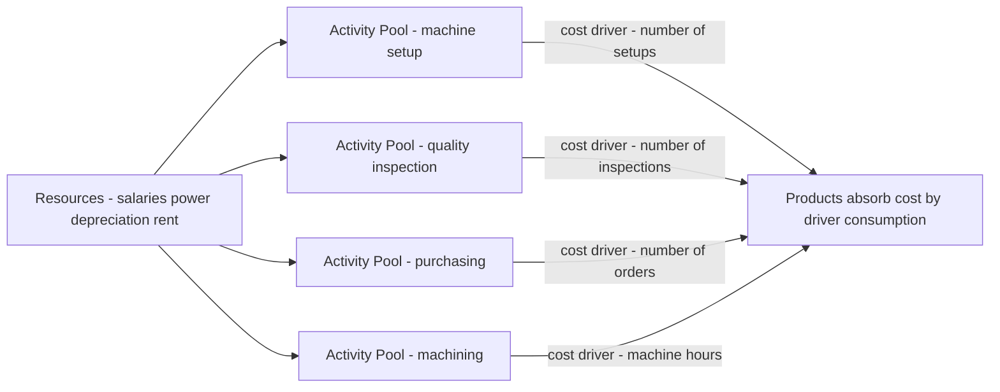
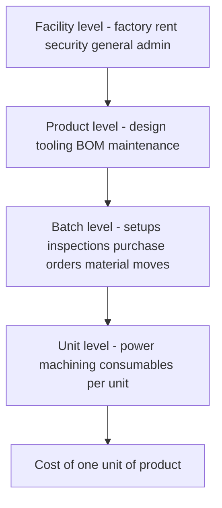
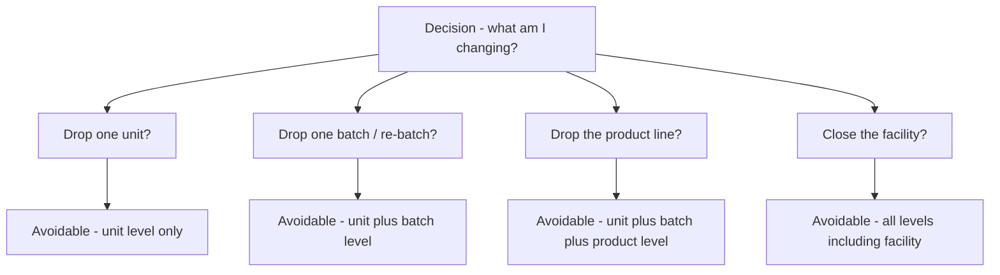

<!-- v2-deep -->

# Chapter 05 — Activity-Based Costing (ABC)

## 1. The Problem — When the Cost Sheet Lies to the Board

You run a factory that makes two products, both plastic bottles. Product **Standard** is a plain 1-litre bottle you make by the million. Product **Premium** is a fiddly, oddly-shaped 250 ml bottle with a child-proof cap that you make in small batches for a niche pharma client. The pharma client haggles hard, and your traditional cost sheet tells you Premium earns a fat 40% margin. So the sales team chases *more* pharma orders, quietly delighted.

Two years later profits have *fallen* even though the "high-margin" Premium now fills half the plant. The board is baffled. The cost sheet said Premium was the winner.

Here is the uncomfortable truth the cost sheet hid. Premium needs **twelve machine set-ups a month** (Standard needs one). Premium needs a **special quality inspection** on every batch. Premium's odd shape jams the line, so a **maintenance engineer** babysits it. Premium generates **forty purchase orders** for exotic caps; Standard generates two. None of this effort is caused by *how many* bottles you make — it is caused by *how complex and how fragmented* the production is. Yet your costing system spread every rupee of that set-up, inspection, maintenance and purchasing cost across products **in proportion to labour hours or machine hours** — that is, in proportion to *volume*. So the high-volume Standard silently absorbed the overhead that the low-volume, high-complexity Premium actually *caused*. Premium looked cheap. It was bleeding you.

This is the managerial decision ABC exists to fix: **which products, customers, or orders are truly profitable, so I know what to price up, drop, or push?** Traditional absorption costing answers that question *wrong* whenever overhead is large and is driven by complexity rather than by volume. Get the answer wrong and you cheerfully expand your loss-makers and kill your winners. Activity-Based Costing is the tool that traces overhead to the *activities that consume resources* and then to the *products that demand those activities* — so the cost sheet finally tells the board the truth.

> The purpose of ABC is **not** more accurate financial statements (financial accounting doesn't care). Its purpose is a better **decision** — pricing, product mix, make-or-buy, cost reduction. Never lose sight of that.

**The one-sentence diagnosis.** The disease is *averaging*. Whenever you average a cost across items that consume it unequally, you tax the light user to subsidise the heavy user. Traditional costing averages *all* overhead over *one* volume base; the more that overhead is caused by things unrelated to volume, and the more unequal the consumption, the bigger the cross-subsidy. ABC is not a different accounting universe — it is simply *averaging in smaller, more homogeneous buckets* so that inside each bucket the items really do consume the cost equally. Hold that thought: **ABC is the medicine for hidden cross-subsidy caused by over-broad averaging.** Everything technical below is machinery for finding buckets pure enough that the average inside them stops lying.

## 2. The Core Idea — The Restaurant Bill Split

Six friends go to dinner. Five order a ₹200 thali. The sixth orders a ₹200 imported steak, three ₹400 cocktails, dessert, and sends the steak back twice to be recooked, keeping the waiter running all night. The total bill is ₹4,000. How do you split it?

The lazy way — "divide by six" — charges each thali-eater ₹667 for their ₹200 meal, subsidising the steak-and-cocktail friend. That is **traditional absorption costing**: pick one simple volume base (here, "number of heads") and smear the whole cost across it. The heavy consumer of *effort* gets undercharged; the simple consumers get overcharged.

The fair way is to ask, *for each thing on the bill, what caused it, and who consumed that cause?* Food cost follows what each person ate. The waiter's extra runs follow the person who sent food back. The cocktails follow the person who drank them. You trace each **pool of cost** to its **driver** and then to the **person who consumed the driver**. That is **Activity-Based Costing** in one dinner. ABC simply refuses to divide-by-six.

**Push the analogy one notch — it exposes the whole hierarchy.** Not every line on the restaurant bill can be traced to a person. The *cover charge* for the private room was triggered by the *booking*, not by any individual — that is a **batch-level** cost, shared by whoever came, unaffected by what each ate. The *live band* the restaurant hired that evening exists because the *restaurant is open at all* — no diner "caused" it; that is a **facility-level** cost you can only split arbitrarily. So even a dinner bill contains unit-level (the food), batch-level (the room booking) and facility-level (the band) costs, and honesty means charging each at the level of the thing that actually triggered it — and admitting when a cost has *no* fair driver at all. Keep this three-layer picture; Section 4.3 formalises it as Cooper's hierarchy.

## 3. Why It's Built This Way — The Logic

Traditional absorption costing was designed in an era (early 20th century) when direct labour was the giant cost and overhead was a small, sleepy add-on. Smearing a small overhead across labour hours was harmless — a rounding error can't distort a decision. Two things then changed:

1. **Overhead exploded and labour shrank.** Automation, quality systems, planning, scheduling, R&D and setups turned overhead into 40–70% of factory cost. A blunt allocation of a *huge* number is no longer a rounding error — it swings product costs by 30–50%.
2. **Product ranges fragmented.** Firms stopped making one thing a million times and started making a hundred things a few thousand times each. Complexity — batches, setups, inspections, special handling — became the real consumer of the overhead. And complexity has **nothing to do with volume**.

Here is the fatal mechanism, stated plainly. A **volume-based** overhead rate (per labour hour or per machine hour or per unit) charges *twice as much overhead to a product you make twice as many of*. But a setup costs the same whether the batch is 10 units or 10,000. So the high-volume product, which needs *few setups per unit*, gets loaded with overhead it never caused, while the low-volume product, which needs *many setups per unit*, gets let off. The result is textbook and predictable:

> **Under traditional costing, high-volume simple products are systematically OVER-costed, and low-volume complex products are systematically UNDER-costed.** ABC reverses both distortions.

ABC's logic is a two-stage causal chain: **Resources → Activities → Products.** Resources (salaries, power, depreciation) are consumed by *activities* (setting up, inspecting, purchasing, moving). Products consume *activities* in proportion to how much they demand them (a product needing 12 setups consumes 12/total of the setup activity). Cost simply follows *causation* down the chain. That is the whole philosophy: **cost is caused, so trace it to its cause.**

**Why "per-unit" is the deadliest word in the traditional method.** The instant you express a batch cost *per unit*, you have secretly declared it proportional to volume — because dividing by units makes it shrink as volume grows. A ₹5,000 setup spread over a 10,000-unit batch is ₹0.50/unit; over a 100-unit batch it is ₹50/unit. Same setup, 100× difference, purely from batch size. Traditional costing hides this because it *never sees the batch* — it only ever sees total units. ABC's whole contribution is to **stop the premature division**: keep setup cost at ₹5,000-per-setup, charge it by *setups*, and divide by units only at the very last step. The lesson generalises: **divide by a driver, not by volume, and divide as late as possible.**

**The two errors are two sides of one coin (conservation).** Because ABC only *re-traces* a fixed pot of overhead, every rupee it *takes off* the over-costed product is a rupee it *puts on* the under-costed one. The distortions are not independent — they are equal and opposite in total. This is why an exam answer that shows one product's cost rising under ABC must show the other's falling; if both move the same way, you have an arithmetic error. Conservation of overhead is both the sanity check and the reason the cross-subsidy is exactly a *transfer*, never a *creation*.

*Figure 1 — ABC's two-stage causal chain: resources pool into activities, activities attach to products through cost drivers.*

## 4. Full Technical Content

### 4.1 The vocabulary (each term earns its place)

| Term | Plain meaning | Why it exists |
|---|---|---|
| **Activity** | A task that consumes resources — setup, inspect, purchase, move, machine | The real unit of work that causes overhead |
| **Cost pool** | The total ₹ of overhead gathered for one activity | You must total a cost before you can rate it |
| **Cost driver** | The factor that *causes* the activity's cost to rise | The fair basis to charge products; replaces the single volume base |
| **Cost driver rate** | Cost pool ÷ total driver quantity | The "price" of one unit of the activity |
| **Resource driver** | Basis for tracing resources *into* a pool (stage 1) | Splits a shared salary across activities |
| **Activity driver** | Basis for tracing a pool *to products* (stage 2) | The "cost driver" in the rate |

**Two finer distinctions the examiner loves.**

- **Cost driver vs cost object.** A *cost driver* is the *cause* of cost (number of setups); a *cost object* is the *thing you want the cost of* (a product, an order, a customer, a channel). ABC can point at any cost object — its power is that once you have activity rates, you can cost a *customer* (who places many small orders) just as easily as a *product*. Exam questions increasingly ask for **customer-level** or **order-level** profitability, not just product cost.
- **Value-added vs non-value-added activities.** A *value-added* activity is one a customer would willingly pay for if they saw it (machining, assembly). A *non-value-added* activity adds cost but no worth (moving, storing, inspecting, re-working, waiting, setting up). ABC *quantifies* the rupees sitting in non-value-added activities — which is the springboard to ABM (Section 7). Naming an activity as NVA is not the same as saying "delete it": some NVA activities (statutory inspection) are *necessary* NVA and cannot simply be cut.

### 4.2 Two kinds of cost driver

- **Transaction drivers** — *count how many times* an activity happens: number of setups, number of purchase orders, number of inspections. Cheap to use; assume each occurrence costs the same.
- **Duration drivers** — *how long* an activity takes: setup hours, inspection hours. More accurate when occurrences vary a lot in effort (a complex setup takes longer), but costlier to measure.

Choose a transaction driver when occurrences are roughly uniform; a duration driver when they vary widely.

**A third, rarely-taught tier — intensity (direct-charging) drivers.** When even *time* fails to capture the effort (one setup needs a senior engineer plus a special jig; another needs a junior for five minutes), you abandon rates and *directly charge* the actual resources used to that specific job. Intensity drivers are the most accurate and the most expensive — reserved for a handful of genuinely special jobs. The three form a ladder of accuracy-vs-cost: **transaction (cheapest, least accurate) → duration → intensity (dearest, most accurate).** The examinable point is the *trade-off*: you climb the ladder only until the extra accuracy stops being worth the extra measurement cost. That trade-off is itself an ABC decision.

**Picking the right driver — the two tests.** A good driver must satisfy both: (1) **causation** — movements in the driver must genuinely cause movements in the pool (a correlation that isn't causal, like "number of units" correlating with setup cost only because bigger orders happen to run in more batches, will mislead the moment the pattern breaks); and (2) **measurability** — you must be able to count it cheaply and objectively. A theoretically perfect driver you cannot measure is useless; a measurable driver that doesn't cause the cost is worse than useless because it looks authoritative while lying.

### 4.3 Cooper's hierarchy of activities — the single most examinable idea

Robin Cooper classified activities by *what triggers them*. This tells you **what the driver must be** and, crucially, **which costs you may and may not unitise**.

| Level | Triggered by | Examples | Driver type |
|---|---|---|---|
| **Unit-level** | Each *unit* made | Power to run machine, direct material handling per unit | Machine hrs, labour hrs, units — *volume based* |
| **Batch-level** | Each *batch/run* | Machine setup, first-article inspection, material movement per batch, purchase order | No. of setups, batches, orders, inspections |
| **Product-level** | Each *product line* existing | Product design, maintaining a BOM, special testing, dedicated tooling | No. of products, design hours |
| **Facility-level** | The *factory* existing at all | Factory rent, plant security, general management, lighting | Cannot be caused by any product — allocate arbitrarily or leave as period cost |

Why this matters for decisions: **batch- and product-level costs are fixed with respect to volume but variable with respect to complexity.** Traditional costing wrongly makes them behave like unit-level costs (it divides them by volume). ABC keeps them at their true level. And **facility-level cost is genuinely un-traceable** — ABC honestly admits it and does not pretend a product "caused" the factory's existence.

**The cost-behaviour insight most students miss.** The hierarchy is really a *statement about what each cost varies with*. Unit-level cost varies with **units**; batch-level cost varies with **number of batches** (so it is *fixed within a batch* and *steps up* only when you add a batch — a classic step-fixed cost); product-level cost varies with **the mere existence of the line** (spend it once whether you make 5 units or 5 million); facility-level cost varies with **nothing you produce**. This reframes ABC as a *finer cost-behaviour model* than the crude fixed/variable split — and it is exactly why ABC feeds Marginal Costing and CVP (Section 7) more honest numbers.

**The relevance ladder for decisions.** The hierarchy doubles as a guide to *which costs are relevant to which decision*:

- Drop *one unit* of output → only **unit-level** cost disappears.
- Drop *one batch* (make fewer, larger runs) → **unit + batch-level** cost of that run disappears.
- Drop the *whole product line* → **unit + batch + product-level** cost disappears, but **facility-level does not** (the rent stays).
- Close the *facility* → finally the facility-level cost disappears.

So when an examiner asks "should we discontinue Product X?", the *avoidable* cost is only up to the product level; the facility-level slice loaded onto X in the ABC cost sheet **will not vanish** and must be excluded from the drop decision. Confusing "ABC full cost" with "avoidable cost" is the trap in Section 8.8 — the hierarchy is what lets you separate them cleanly.

*Figure 2 — Cooper's activity hierarchy: costs sit at the level of the thing that triggers them; only unit-level cost is truly volume-driven.*

*Figure 3 — Match the decision to the hierarchy level: only costs at or below the level you are changing are avoidable.*

### 4.4 The ABC procedure — seven steps, each with its "why"

1. **Identify the major activities** in the organisation (setup, inspect, purchase, machine, dispatch). *Why:* activities are where resources are actually consumed.
2. **Create a cost pool for each activity** and gather its total overhead (stage-1 tracing using resource drivers). *Why:* you cannot compute a rate on an un-totalled cost.
3. **Identify the cost driver** for each pool — the factor causing its cost. *Why:* this is the fair charging basis that replaces the single volume base.
4. **Compute the cost driver rate** = Cost pool ÷ Total quantity of the driver. *Why:* this "prices" one unit of the activity.
5. **Measure each product's consumption** of every driver (how many setups, orders, inspections it demanded). *Why:* stage-2 tracing needs the quantity each product pulls.
6. **Charge overhead to products** = driver rate × driver quantity consumed, summed across all activities. *Why:* cost now follows causation, not volume.
7. **Add prime cost** (direct material + direct labour) to get total cost, then unit cost = total ÷ units. *Why:* to get a full cost usable for pricing/mix decisions.

**Master formulae**

$$\text{Cost Driver Rate} = \frac{\text{Total Cost of Activity Pool}}{\text{Total Cost Driver Quantity}}$$

$$\text{Overhead to a Product} = \sum_{\text{all activities}} \left( \text{Driver Rate} \times \text{Driver Units consumed by product} \right)$$

$$\text{Traditional Rate} = \frac{\text{Total Overhead}}{\text{Total Volume Base (labour hrs / machine hrs / units)}}$$

**A practical warning about step 1 — the granularity trade-off.** How *many* activities should you identify? Too few, and you are back to blanket averaging (the disease). Too many, and the system costs more to run than the accuracy is worth, and near-identical pools clutter the analysis. In practice, activities driven by the *same* driver and behaving alike are **merged into a single cost pool** (a "homogeneous cost pool" — costs within it must move in proportion to *one* driver). The art of ABC is choosing the *fewest* pools that still keep each pool homogeneous. Exams hand you the pools pre-chosen, but a theory question may ask *why* you don't just create a pool per invoice line — the answer is the granularity trade-off.

### 4.5 When does ABC pay off? (a decision in itself)

ABC is itself a cost — it takes time and money to run. Adopt it only when the *distortion it removes* is worth more than the *effort it costs*. It pays off when:

- **Overheads are a large share of total cost** (small overhead → small distortion → not worth it).
- **Product/customer range is diverse** in volume and complexity (a single product cannot be mis-costed relative to itself).
- **Non-volume-driven overheads dominate** — lots of setups, inspections, handling, purchasing.
- **Competition is fierce and pricing must be sharp** — you cannot afford to mis-price.
- **Product-mix and pricing decisions are frequent and high-stakes.**

It does **not** pay off in a single-product plant, or where overhead is tiny, or where all overhead genuinely varies with volume.

### 4.6 Limitations of ABC — the balanced-view marks

An exam that asks you to *evaluate* ABC wants the costs of the cure, not just the disease. State these crisply:

- **Expensive to install and run.** Identifying activities, choosing drivers and continuously measuring driver volumes consumes management time and IT spend. For many firms the extra accuracy does not justify the cost.
- **Not every cost has a clean driver.** Facility-level costs (and some product-level costs) still get an arbitrary allocation — ABC *reduces* but never *eliminates* arbitrariness. Claiming ABC removes all arbitrariness is a conceptual error.
- **Too many activities/pools breed complexity.** Over-refinement produces a system nobody maintains; pools drift out of date as processes change.
- **It is still (largely) a full-absorption, historical system.** Ordinary ABC loads facility-level fixed costs onto units and reports a full "cost", which — as Section 8.8 warns — is *not* the relevant cost for short-run drop/keep or special-order pricing. ABC sharpens the *long-run* picture, not automatically the short-run decision.
- **Behavioural resistance and measurement gaming.** People whose products suddenly look loss-making resist; driver counts self-reported by departments can be massaged.

The honest conclusion: ABC is a *better model*, not a *perfect* or *free* one. It replaces one large, hidden distortion (volume averaging) with smaller, visible imperfections (residual allocation of facility cost, measurement cost). Whether that trade is worth it is the "when does ABC pay off" test of 4.5.

## 5. Worked Examples

### Example 1 — The plastic-bottle plant (easy: see the re-pricing)

**Data.** A plant makes **Standard** (1,00,000 units) and **Premium** (10,000 units). Prime cost: Standard ₹40/unit, Premium ₹60/unit. Total production overhead ₹22,00,000. Machine hours: Standard 50,000, Premium 5,000 (each product uses 0.5 machine hr/unit). Overhead analysed into pools:

| Activity | Cost pool (₹) | Driver | Standard | Premium | Total |
|---|---|---|---|---|---|
| Machining (power, consumables) | 5,50,000 | Machine hours | 50,000 | 5,000 | 55,000 |
| Machine setups | 6,00,000 | No. of setups | 20 | 100 | 120 |
| Quality inspection | 4,50,000 | No. of inspections | 30 | 120 | 150 |
| Purchasing | 3,00,000 | No. of purchase orders | 40 | 160 | 200 |
| Material handling | 3,00,000 | No. of material movements | 50 | 100 | 150 |
| **Total** | **22,00,000** | | | | |

**Step A — Traditional costing** (single machine-hour rate):

$$\text{Rate} = \frac{22,00,000}{55,000 \text{ mc hrs}} = ₹40 \text{ per machine hour}$$

Each unit uses 0.5 mc hr → ₹20 overhead per unit for *both* products.

| | Standard | Premium |
|---|---|---|
| Prime cost/unit | 40.00 | 60.00 |
| Overhead/unit (₹40 × 0.5) | 20.00 | 20.00 |
| **Total cost/unit (traditional)** | **60.00** | **80.00** |

**Step B — ABC.** First the driver rates:

| Activity | Pool ÷ driver total | Rate |
|---|---|---|
| Machining | 5,50,000 ÷ 55,000 | ₹10 / machine hr |
| Setups | 6,00,000 ÷ 120 | ₹5,000 / setup |
| Inspection | 4,50,000 ÷ 150 | ₹3,000 / inspection |
| Purchasing | 3,00,000 ÷ 200 | ₹1,500 / order |
| Material handling | 3,00,000 ÷ 150 | ₹2,000 / movement |

Now charge each product:

| Activity | Standard (qty × rate) | ₹ | Premium (qty × rate) | ₹ |
|---|---|---|---|---|
| Machining | 50,000 × 10 | 5,00,000 | 5,000 × 10 | 50,000 |
| Setups | 20 × 5,000 | 1,00,000 | 100 × 5,000 | 5,00,000 |
| Inspection | 30 × 3,000 | 90,000 | 120 × 3,000 | 3,60,000 |
| Purchasing | 40 × 1,500 | 60,000 | 160 × 1,500 | 2,40,000 |
| Material handling | 50 × 2,000 | 1,00,000 | 100 × 2,000 | 2,00,000 |
| **Total overhead** | | **8,50,000** | | **13,50,000** |
| ÷ units | ÷ 1,00,000 | **₹8.50** | ÷ 10,000 | **₹135.00** |

**Reconciliation (always do this):** 8,50,000 + 13,50,000 = **22,00,000** ✓ (equals total overhead — nothing created or lost, only re-traced).

| | Standard | Premium |
|---|---|---|
| Prime cost/unit | 40.00 | 60.00 |
| Overhead/unit (ABC) | 8.50 | 135.00 |
| **Total cost/unit (ABC)** | **48.50** | **195.00** |
| Total cost/unit (traditional) | 60.00 | 80.00 |
| **Distortion** | over-costed by ₹11.50 | **under-costed by ₹115** |

**The decision.** If Premium sells at ₹112 (which "looked" like a 40% margin on the traditional ₹80 cost), ABC reveals it actually costs ₹195 — a **loss of ₹83 per unit.** Every Premium order chased was destroying value. Standard, meanwhile, is far cheaper than believed (₹48.50 not ₹60) — there is room to cut price and win volume. Traditional costing had the entire strategy backwards. *This is the whole point of the chapter in one table.*

**Cross-subsidy quantified (the conservation check made vivid).** Traditional loaded Standard with ₹20 × 1,00,000 = ₹20,00,000 of overhead; ABC loads it with only ₹8,50,000 — Standard was *over-charged by ₹11,50,000*. Premium under the old system carried ₹20 × 10,000 = ₹2,00,000; ABC loads ₹13,50,000 — Premium was *under-charged by ₹11,50,000*. **The two numbers are identical** (₹11.50 × 1,00,000 = ₹115 × 10,000 = ₹11,50,000). That equality is not a coincidence; it is conservation of overhead — every rupee lifted off Standard was sitting on Premium. If your two "distortion" figures don't tie, you have erred.

### Example 2 — Setup-driven distortion, ICAI style (moderate)

**Data.** A company makes three products A, B, C.

| | A | B | C |
|---|---|---|---|
| Output (units) | 30,000 | 20,000 | 8,000 |
| Machine hrs/unit | 1 | 1 | 2 |
| Direct labour hrs/unit | 1 | 1 | 1 |
| No. of production runs (batches) | 3 | 7 | 20 |
| No. of purchase orders | 15 | 25 | 60 |

Overhead: Setup ₹1,20,000; Stores/purchasing ₹1,50,000; Machine-related (power, depreciation) ₹3,00,000. Total ₹5,70,000. Direct material: A ₹50, B ₹40, C ₹30 per unit. Labour ₹20/hr.

**Traditional** (labour-hour rate). Total labour hrs = 30,000 + 20,000 + 8,000 = 58,000.

$$\text{Rate} = \frac{5,70,000}{58,000} = ₹9.827586/\text{labour hr} \approx ₹9.83$$

Overhead/unit (1 labour hr each) = ₹9.83 for A, B, C alike.

| | A | B | C |
|---|---|---|---|
| Material | 50.00 | 40.00 | 30.00 |
| Labour (1 hr × 20) | 20.00 | 20.00 | 20.00 |
| Overhead (traditional) | 9.83 | 9.83 | 9.83 |
| **Total (traditional)** | **79.83** | **69.83** | **59.83** |

**ABC.** Machine-related cost is unit/volume-level → driver = machine hours. Total machine hrs = 30,000×1 + 20,000×1 + 8,000×2 = 66,000.

| Activity | Pool | Driver total | Rate |
|---|---|---|---|
| Setup | 1,20,000 | 30 runs | ₹4,000 / run |
| Stores/purchasing | 1,50,000 | 100 orders | ₹1,500 / order |
| Machine-related | 3,00,000 | 66,000 mc hrs | ₹4.545455 / mc hr |

Charge to products:

| Activity | A | B | C |
|---|---|---|---|
| Setup (runs × 4,000) | 12,000 | 28,000 | 80,000 |
| Purchasing (orders × 1,500) | 22,500 | 37,500 | 90,000 |
| Machine (mc hr × 4.545455) | 1,36,364 | 90,909 | 72,727 |
| **Total overhead (₹)** | **1,70,864** | **1,56,409** | **2,42,727** |
| ÷ units | 30,000 | 20,000 | 8,000 |
| **Overhead/unit** | **5.70** | **7.82** | **30.34** |

**Reconciliation:** 1,70,864 + 1,56,409 + 2,42,727 = ₹5,70,000 ✓ (rounding within ₹1).

| | A | B | C |
|---|---|---|---|
| Material | 50.00 | 40.00 | 30.00 |
| Labour | 20.00 | 20.00 | 20.00 |
| Overhead (ABC) | 5.70 | 7.82 | 30.34 |
| **Total (ABC)** | **75.70** | **67.82** | **80.34** |
| Total (traditional) | 79.83 | 69.83 | 59.83 |

**Reading it.** High-volume A and B are slightly over-costed under traditional; low-volume, batch-heavy, machine-hungry **C is massively under-costed** — traditional said ₹59.83, ABC says ₹80.34, a **₹20.51 (34%) understatement.** C has 20 of the 30 production runs and 60 of the 100 purchase orders despite being the smallest by volume — its complexity, invisible to a labour-hour rate, is exactly what ABC surfaces. If C were priced off the ₹59.83 figure it could be sold at a loss.

**What if the examiner tweaks it — the machine-hour base swap.** Suppose the traditional rate were struck on *machine hours* (66,000) instead of labour hours. Then rate = 5,70,000 ÷ 66,000 = ₹8.6364/mc hr, and traditional overhead/unit becomes A ₹8.64, B ₹8.64, **C ₹17.27** (C uses 2 mc hr). Notice C's understatement *shrinks* from ₹20.51 to ₹13.07 — because a machine-hour base already captures *part* of C's extra machine intensity, whereas a labour-hour base captured none of it. **The size of ABC's correction depends on how badly the chosen traditional base correlates with the real drivers.** A labour base on a machine-intensive product distorts more; a machine base distorts less but still misses the setup and purchasing complexity entirely. This is a favourite "explain the difference" follow-up: the base you compare against changes the *magnitude* of the distortion but never its *direction*.

### Example 3 — Full ABC cost sheet with profit and a customer-level insight (exam-hard)

**Data.** "Precision Ltd" makes **Deluxe** (low volume, complex) and **Regular** (high volume, simple).

| | Deluxe | Regular |
|---|---|---|
| Annual output (units) | 5,000 | 45,000 |
| Selling price / unit (₹) | 260 | 120 |
| Direct material / unit (₹) | 80 | 45 |
| Direct labour hrs / unit | 2 | 1.5 |
| Machine hrs / unit | 3 | 2 |
| Labour rate | ₹30 / hr | ₹30 / hr |

Overhead pools and drivers:

| Activity | Cost pool (₹) | Driver | Deluxe | Regular | Total |
|---|---|---|---|---|---|
| Machine operation | 9,90,000 | Machine hrs | 15,000 | 90,000 | 1,05,000 |
| Setups | 3,20,000 | No. of setups | 60 | 20 | 80 |
| Production scheduling | 1,50,000 | No. of production orders | 40 | 10 | 50 |
| Quality control | 2,10,000 | No. of inspections | 90 | 15 | 105 |
| Despatch | 1,80,000 | No. of despatch notes | 200 | 100 | 300 |
| **Total overhead** | **18,50,000** | | | | |

**Part 1 — Traditional (machine-hour) cost & profit.**

$$\text{Rate} = \frac{18,50,000}{1,05,000 \text{ mc hrs}} = ₹17.619048/\text{mc hr}$$

Deluxe uses 3 mc hr → ₹52.86/unit; Regular uses 2 mc hr → ₹35.24/unit.

| Traditional cost sheet | Deluxe | Regular |
|---|---|---|
| Direct material | 80.00 | 45.00 |
| Direct labour (hrs × 30) | 60.00 | 45.00 |
| **Prime cost** | **140.00** | **90.00** |
| Overhead (mc hr × 17.619) | 52.86 | 35.24 |
| **Total cost / unit** | **192.86** | **125.24** |
| Selling price | 260.00 | 120.00 |
| **Profit / (loss) / unit** | **67.14** | **(5.24)** |

Traditional verdict: Deluxe hugely profitable, **Regular a loss-maker** — "we should drop Regular." Watch ABC destroy this conclusion.

**Part 2 — ABC.** Driver rates:

| Activity | Pool ÷ total | Rate |
|---|---|---|
| Machine operation | 9,90,000 ÷ 1,05,000 | ₹9.428571 / mc hr |
| Setups | 3,20,000 ÷ 80 | ₹4,000 / setup |
| Scheduling | 1,50,000 ÷ 50 | ₹3,000 / order |
| Quality control | 2,10,000 ÷ 105 | ₹2,000 / inspection |
| Despatch | 1,80,000 ÷ 300 | ₹600 / note |

Overhead charged:

| Activity | Deluxe (₹) | Regular (₹) |
|---|---|---|
| Machine operation | 15,000 × 9.428571 = 1,41,429 | 90,000 × 9.428571 = 8,48,571 |
| Setups | 60 × 4,000 = 2,40,000 | 20 × 4,000 = 80,000 |
| Scheduling | 40 × 3,000 = 1,20,000 | 10 × 3,000 = 30,000 |
| Quality control | 90 × 2,000 = 1,80,000 | 15 × 2,000 = 30,000 |
| Despatch | 200 × 600 = 1,20,000 | 100 × 600 = 60,000 |
| **Total overhead** | **8,01,429** | **10,48,571** |
| ÷ units | ÷ 5,000 | ÷ 45,000 |
| **Overhead / unit** | **160.29** | **23.30** |

**Reconciliation:** 8,01,429 + 10,48,571 = **18,50,000** ✓.

| ABC cost sheet | Deluxe | Regular |
|---|---|---|
| Direct material | 80.00 | 45.00 |
| Direct labour | 60.00 | 45.00 |
| **Prime cost** | **140.00** | **90.00** |
| Overhead (ABC) | 160.29 | 23.30 |
| **Total cost / unit** | **300.29** | **113.30** |
| Selling price | 260.00 | 120.00 |
| **Profit / (loss) / unit** | **(40.29)** | **6.70** |

**The reversal — the exam's whole point.**

| Per unit | Deluxe (Trad) | Deluxe (ABC) | Regular (Trad) | Regular (ABC) |
|---|---|---|---|---|
| Total cost | 192.86 | **300.29** | 125.24 | **113.30** |
| Profit/(loss) | 67.14 | **(40.29)** | (5.24) | **6.70** |

Traditional costing told Precision Ltd to **push Deluxe and drop Regular.** ABC reveals the exact opposite: **Deluxe loses ₹40 a unit** (its 60 setups, 40 orders and 90 inspections, invisible to a machine-hour rate, are the true cost), while **Regular actually earns ₹6.70.** Acting on the traditional numbers would have grown the loss-maker and killed the earner. *Same total ₹18,50,000 of overhead — only the tracing changed — and the strategic conclusion flipped 180°.* That is why ABC exists.

**Whole-firm check.** Total profit ABC: Deluxe (−40.29 × 5,000 = −2,01,450) + Regular (6.70 × 45,000 = 3,01,500) ≈ ₹1,00,050. Total sales − (prime + overhead): Sales = 5,000×260 + 45,000×120 = 13,00,000 + 54,00,000 = 67,00,000. Prime = 5,000×140 + 45,000×90 = 7,00,000 + 40,50,000 = 47,50,000. Overhead = 18,50,000. Profit = 67,00,000 − 47,50,000 − 18,50,000 = **₹1,00,000** ✓ (matches within rounding). *ABC re-slices the pie; it never changes its size.*

**Part 3 — the two-stage decision trap (do NOT just drop Deluxe).** A weak answer stops at "Deluxe loses ₹40, discontinue it." Test it against the hierarchy. Deluxe's ₹160.29/unit ABC overhead contains machine operation (unit-level, ₹28.29), setups + scheduling + quality control + despatch (batch-level, largely avoidable if the line goes) — but *does the ₹18,50,000 pot contain facility-level cost that will simply re-spread onto Regular if Deluxe leaves?* In this data every pool has a genuine activity driver, so most of Deluxe's overhead is avoidable — but the exam-hard move is to *say so explicitly* and compute the *avoidable* cost. If, say, ₹40,000 of the "machine operation" pool were actually facility depreciation that stays regardless, then dropping Deluxe would dump that ₹40,000 onto Regular, and Regular's healthy ₹6.70 could shrink. **The ABC full-cost loss is a red flag, not a verdict.** The verdict needs avoidable-cost (contribution) analysis. Section 8.8 is this trap; graders reserve marks for the caveat.

### Example 4 — Reverse-engineering: find the missing driver volume (twist)

**Data.** An examiner gives you the *answer* and hides an input — a common "do you really understand the mechanism" twist. Plant runs one activity, **inspection**, cost pool ₹4,80,000. Two products, X and Y. X's inspection charge came to ₹3,00,000 for its 150 inspections; Y's total inspections are unknown. What is the inspection rate, Y's inspection count, and Y's inspection charge?

**Work.** X's rate is recoverable directly: ₹3,00,000 ÷ 150 = **₹2,000 / inspection** (the rate is the same for both products — that is the whole point of a single pool). Y's charge = pool − X's charge = 4,80,000 − 3,00,000 = **₹1,80,000.** Y's inspections = 1,80,000 ÷ 2,000 = **90 inspections.**

**Reconciliation:** total inspections 150 + 90 = 240; 240 × ₹2,000 = ₹4,80,000 ✓ = pool. The lesson: **the driver rate is a property of the pool, shared by every product** — so given any one product's charge *and* its driver units you can unlock the rate, and from the rate everything else. Questions that "hide" a number are testing exactly this: rate = pool ÷ total units is one equation you can rearrange three ways.

### Example 5 — Customer-level ABC (the modern exam frontier)

**Data.** A distributor's selling & distribution overhead is ₹12,00,000, analysed into three activities. It serves two customer *types*, both buying the **same** ₹1,000-margin-before-S&D product, so traditional costing (which spreads S&D per rupee of sales or per unit) says both customers are equally profitable. Are they?

| Activity | Cost pool (₹) | Driver | Big-Box (few, large orders) | Corner-Shops (many, tiny orders) | Total |
|---|---|---|---|---|---|
| Order processing | 4,00,000 | No. of orders | 50 | 750 | 800 |
| Delivery | 5,00,000 | No. of deliveries | 100 | 900 | 1,000 |
| Sales-rep visits | 3,00,000 | No. of visits | 20 | 280 | 300 |

Units sold: Big-Box 10,000 units, Corner-Shops 10,000 units (deliberately equal, so volume cannot explain the answer). Contribution before S&D: ₹1,000/unit each → ₹1,00,00,000 each.

**Rates.** Order processing 4,00,000 ÷ 800 = ₹500/order. Delivery 5,00,000 ÷ 1,000 = ₹500/delivery. Visits 3,00,000 ÷ 300 = ₹1,000/visit.

**S&D charged.**

| Activity | Big-Box (₹) | Corner-Shops (₹) |
|---|---|---|
| Order processing | 50 × 500 = 25,000 | 750 × 500 = 3,75,000 |
| Delivery | 100 × 500 = 50,000 | 900 × 500 = 4,50,000 |
| Sales-rep visits | 20 × 1,000 = 20,000 | 280 × 1,000 = 2,80,000 |
| **Total S&D** | **95,000** | **11,05,000** |

**Reconciliation:** 95,000 + 11,05,000 = **12,00,000** ✓.

| Customer profitability | Big-Box | Corner-Shops |
|---|---|---|
| Contribution before S&D | 1,00,00,000 | 1,00,00,000 |
| Less ABC S&D cost | (95,000) | (11,05,000) |
| **Net customer profit** | **99,05,000** | **88,95,000** |
| Traditional view (½ of ₹12,00,000 each) | 94,00,000 | 94,00,000 |

**Reading it.** Traditional costing, spreading S&D equally over equal volume, declares both customers worth ₹94,00,000. ABC reveals **Corner-Shops consume ₹11,05,000 of servicing effort against Big-Box's ₹95,000** — because they place 15× the orders and take 9× the deliveries for the *same* sales. Big-Box is ₹10,10,000 *more* profitable than the average suggested; Corner-Shops ₹5,05,000 *less*. **The decision this drives is not "drop small customers" but "change how you serve them"** — minimum order sizes, order-consolidation incentives, self-service ordering to strip the ₹500/order cost. This is ABC feeding ABM at the *customer* level, and it is exactly the kind of "cost object need not be a product" question that separates strong scripts from rote ones.

## 6. Presentation / Format

**The ABC working, examiner-approved order** (show every stage — marks are for method, not just the answer):

1. **Statement of Cost Driver Rates** — a table: Activity | Cost pool | Cost driver | Total driver units | Rate. 
2. **Statement of Overhead Absorbed** — a table with one column per product, one row per activity: driver units × rate; total the columns.
3. **Cost Sheet per unit** — Direct material + Direct labour = Prime cost; + Overhead (from step 2 ÷ units); = Total cost; − from Selling price = Profit.
4. **Comparison / Comment** — a table contrasting traditional vs ABC unit cost and the decision implication. *The comment carries marks — always state which product is over/under-costed and the decision.*

Golden rules: always **reconcile** total overhead absorbed back to total overhead given; **carry 4–6 decimals** in driver rates (round only the final answer) to keep the reconciliation clean; and **label the driver** for every pool.

**A worked layout habit that saves marks under time pressure.** Compute driver rates *once*, in a top block, and never re-derive them mid-answer — every product charge is then just "units × the rate you already have". Lay the overhead-absorbed statement with *products as columns and activities as rows*, then add a **total row and a per-unit row** at the bottom; the total row is what you reconcile, the per-unit row is what feeds the cost sheet. If a question asks for both traditional and ABC, put them **side by side** in the final comparison so the over/under-costing jumps out — graders scan for that contrast table. When output volumes differ, keep total-rupee and per-unit figures in *clearly separate rows*; mixing them is the commonest presentation error and it silently corrupts the reconciliation.

## 7. Connections

- **Chapter on Overheads (traditional absorption):** ABC is a *refinement* of overhead absorption, not a replacement of the whole system. Prime cost is computed identically; only the second stage — spreading overhead — changes from one blanket/departmental rate to many activity rates.
- **Marginal Costing & CVP:** ABC sharpens *which* costs are truly fixed vs variable. Batch- and product-level costs are "fixed" to volume but "variable" to complexity — an insight marginal costing's simple fixed/variable split misses.
- **Budgetary Control → Activity-Based Budgeting (ABB):** run the ABC logic in reverse — forecast activity volumes (setups, orders), then the resources they'll need.
- **Cost Management → Activity-Based Management (ABM):** ABC *measures* activity cost; ABM *acts* on it — eliminating non-value-added activities (e.g. reduce setups via SMED, cut inspections via quality-at-source).
- **Decision-making chapters (make-or-buy, pricing, product mix):** ABC feeds these the *right* product cost. Every distortion example above is really a mis-made decision.
- **Target Costing / Life-Cycle Costing:** both rely on trustworthy activity-level cost data that only ABC provides.

**Two connections worth spelling out because they recur in theory questions.**

- **ABC → Activity-Based Budgeting (ABB), the exact reversal.** ABC flows *actual resources → activities → products* to find cost. ABB flows the other way: start from *budgeted output → the activities that output will demand → the resources those activities need → the budget*. So if next year's plan needs 500 setups and each setup consumes ₹5,000 of resource, ABB budgets ₹25,00,000 for the setup activity — a far more defensible number than "last year's setup cost + 5%". The link to examine: ABB makes *budgets driver-based*, exposing that a 10% rise in *small orders* costs far more than a 10% rise in *volume*.
- **ABC → ABM, operational vs strategic.** ABM splits into **operational ABM** ("do things right" — make the same activities cheaper: SMED to cut setup time, quality-at-source to cut inspection) and **strategic ABM** ("do the right things" — change the product/customer mix, re-price, or re-design products to demand fewer costly activities). ABC supplies the numbers; ABM chooses the lever. Being able to name both flavours is a stock 4-mark theory ask.

## 8. Traps & Examiner Tricks

1. **Facility-level costs are not driver-traceable.** If a question gives "general factory administration" or rent with no sensible driver, either allocate on a stated arbitrary base *and say so*, or treat as a period cost — do **not** invent a spurious driver.
2. **Using the wrong driver quantity.** For machine-related overhead the driver is *total machine hours* = units × mc hr/unit — **not** units. Forgetting to multiply by hours/unit is the single most common arithmetic slip.
3. **Not reconciling.** If your two products' absorbed overhead doesn't sum back to total overhead, you have an error. Reconcile *before* writing the comment.
4. **Rounding the driver rate too early.** Round ₹9.428571 to ₹9.43 across 90,000 machine hours and you throw the reconciliation off by hundreds of rupees. Keep decimals; round last.
5. **Confusing the two stages.** Resource drivers put cost *into* pools (stage 1); activity/cost drivers push pools *onto products* (stage 2). Exams usually give pools pre-totalled (stage 1 done) — don't re-split them.
6. **Assuming ABC always raises low-volume cost.** It usually does, but only because low-volume products are usually complex. The mechanism is *complexity*, not volume per se — a low-volume but simple product may barely move.
7. **"ABC gives more accurate profit for the P&L."** No. Total profit is **identical** under both systems (Example 3's whole-firm check proves it). ABC only changes profit *per product*. Claiming ABC changes total profit is a conceptual error examiners punish.
8. **Recommending to drop a "loss" product without marginal analysis.** ABC unit "loss" includes facility-level fixed cost that won't disappear if you drop the product. Combine ABC with contribution analysis before recommending withdrawal — a favourite two-part question.
9. **Number-of-setups vs setup-hours.** If the question gives setup *hours*, use them (duration driver); if it gives number of setups, use count (transaction driver). Read which is offered.
10. **Mixing per-unit and total figures in one column.** Driver charges are *totals* (100 setups × ₹5,000 = ₹5,00,000 for the whole product); the cost *sheet* is *per unit* (÷ output). Students who divide by units too early, or forget to divide at all, get a cost sheet that neither reconciles nor makes sense. Keep a total-overhead row and a per-unit row physically separate (Section 6).
11. **Choosing the "given" traditional base without reading it.** If the question says the firm *currently* absorbs on labour hours, your traditional column must use labour hours — even if machine hours are also given. Answering the "traditional vs ABC" contrast against the *wrong* base changes the whole comparison. The base is a stated fact, not your choice.
12. **Averaging setup cost per unit inside a batch.** ₹5,000 per setup is *per setup*, full stop. Do not "smooth" it to ₹5,000 ÷ batch size and then re-multiply by units — that silently reintroduces volume-averaging, the very disease ABC cures, and it will not reconcile. Charge whole setups by count.
13. **Treating an over-costed product's "saving" as new profit.** When ABC lowers Standard's cost, the firm has not *earned* anything — total profit is unchanged. The lower cost only means Standard *can* be priced more competitively; whether that raises profit depends on the market response, not on the re-costing itself.
14. **Assuming more pools always means more accuracy.** Beyond the point where each pool is homogeneous, extra pools add cost and clutter without adding accuracy (Section 4.4 granularity trade-off). "Split every invoice into its own pool" is wrong; homogeneity, not maximal granularity, is the goal.
15. **Forgetting that the driver total must be the *whole plant's* count, not one product's.** The rate's denominator is *total* driver units across all products (e.g. 120 setups), so that the pool is fully absorbed. Dividing a pool by a single product's setups inflates the rate and breaks reconciliation.

## 9. First-Principles Recap

Strip everything away and here is the spine:

- Overhead is **caused** — by activities, and activities are demanded by products in proportion to complexity, not volume.
- Traditional costing charges overhead by a **single volume base**, so it over-charges high-volume simple products and under-charges low-volume complex ones. When overhead is large and products are diverse, that distortion is big enough to reverse pricing and product-mix decisions.
- ABC traces cost along its true chain — **Resources → Activities (cost pools) → Products (via cost drivers)** — so cost follows causation. Rate = pool ÷ driver total; charge = rate × units consumed.
- ABC does **not** change total cost or total profit — it only **re-slices** them, and the re-slicing is what makes the *decision* right.
- Use it only where the distortion is worth the effort: **big overhead, diverse products, non-volume drivers, sharp-pricing markets.** Otherwise the simpler system is the better decision.

Everything else — Cooper's hierarchy, transaction vs duration drivers, ABM — is machinery hung on that spine. If you can re-derive "cost follows causation, trace it there," you can reconstruct the whole chapter.

**Three deeper truths that make the spine bullet-proof under a tough examiner:**

- **The disease is averaging, not volume.** Volume is only the *usual* base; the real fault is averaging a cost across items that consume it unequally. ABC's cure is *narrower, homogeneous pools* so the average inside each stops lying. State the disease this way and you can handle a labour-hour, machine-hour or per-rupee-of-sales base identically.
- **Conservation is your compass.** Because the pot is fixed, over-costing one product is exactly under-costing another; the two distortions are equal and opposite. That single fact gives you the reconciliation check, the cross-subsidy interpretation, and the "total profit is unchanged" answer, all at once.
- **Full cost is not relevant cost.** ABC computes a better *full* cost; but drop/keep and special-order pricing turn on *avoidable* cost. Map each cost to its hierarchy level, keep only what is avoidable for the decision at hand, and never discontinue a product on an ABC unit loss alone.

## 10. Quick-Revision Sheet

| Item | Formula / Rule |
|---|---|
| Cost driver rate | Activity cost pool ÷ Total cost driver quantity |
| Overhead to a product | Σ (driver rate × driver units the product consumes) |
| Traditional OH rate | Total overhead ÷ Total volume base (labour hrs / mc hrs / units) |
| Machine-hr driver total | Σ (units × machine hrs per unit) — **not** units alone |
| Unit cost | (Prime cost + Overhead absorbed) ÷ units, or per-unit prime + per-unit OH |
| Reconciliation check | Σ overhead absorbed by all products = Total overhead given |
| Total profit under ABC | = Total profit under traditional (only per-product profit differs) |
| Cross-subsidy check | ₹ over-costed on one product = ₹ under-costed on the other (conservation) |

**Activity hierarchy → driver**

| Level | Triggered by | Typical driver | Avoidable if you… |
|---|---|---|---|
| Unit | each unit | machine hrs / labour hrs / units | drop one unit |
| Batch | each batch/run | no. of setups, orders, inspections, moves | drop/merge a batch |
| Product | each product line | no. of products, design hours | drop the product line |
| Facility | factory existing | none — arbitrary allocation or period cost | close the facility |

**Distortion direction (memorise):** Traditional **over-costs** high-volume simple products; **under-costs** low-volume complex products. ABC reverses both.

**Driver types (accuracy ladder):** Transaction (count — cheap, use when uniform) → Duration (time — use when occurrences vary) → Intensity/direct-charge (actual resources — dearest, for genuinely special jobs).

**Driver-choice tests:** must be *causal* (moves the pool) AND *measurable* (cheap to count). Perfect-but-unmeasurable is useless; measurable-but-non-causal is misleading.

**ABC pays off when:** overhead large · product range diverse · non-volume overheads dominate · pricing must be sharp. **Not worth it when:** single product · trivial overhead · all overhead volume-driven.

**Limitations (balanced view):** costly to run · residual arbitrariness on facility cost · over-refinement risk · still a full-absorption/historical model (not automatically relevant cost) · behavioural resistance.

**Seven steps:** identify activities → pool costs → identify drivers → compute rates → measure product consumption → charge overhead → add prime cost.

**Cost objects:** ABC can cost a *product, order, customer or channel* — not just products (Example 5).

**ABC vs ABM:** ABC *measures* activity cost; ABM *manages* it — **operational ABM** makes activities cheaper (do things right), **strategic ABM** changes the mix/design to demand fewer activities (do the right things).

**ABC vs ABB:** ABC works actuals *forward* (resources→products) to find cost; ABB works the plan *backward* (output→activities→resources) to set a driver-based budget.
