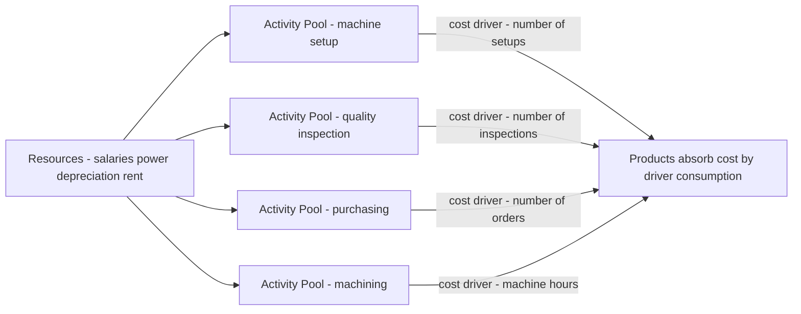
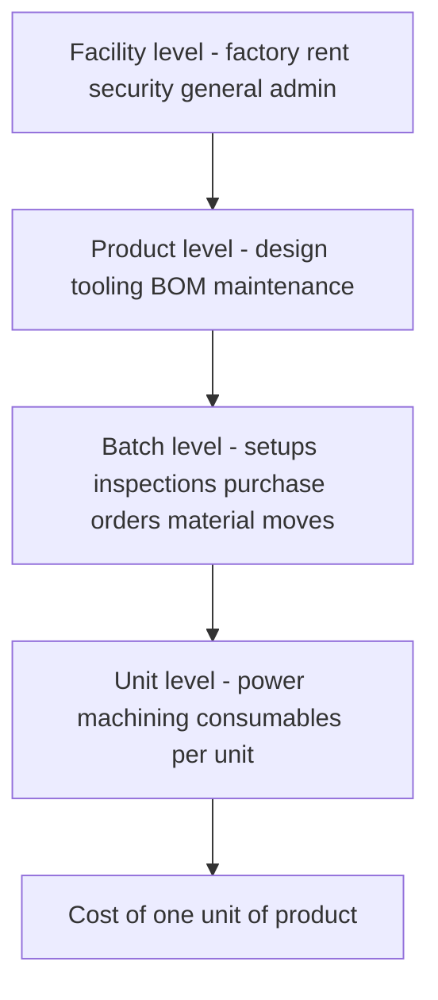

# Chapter 05 — Activity-Based Costing (ABC)

## 1. The Problem — When the Cost Sheet Lies to the Board

You run a factory that makes two products, both plastic bottles. Product **Standard** is a plain 1-litre bottle you make by the million. Product **Premium** is a fiddly, oddly-shaped 250 ml bottle with a child-proof cap that you make in small batches for a niche pharma client. The pharma client haggles hard, and your traditional cost sheet tells you Premium earns a fat 40% margin. So the sales team chases *more* pharma orders, quietly delighted.

Two years later profits have *fallen* even though the "high-margin" Premium now fills half the plant. The board is baffled. The cost sheet said Premium was the winner.

Here is the uncomfortable truth the cost sheet hid. Premium needs **twelve machine set-ups a month** (Standard needs one). Premium needs a **special quality inspection** on every batch. Premium's odd shape jams the line, so a **maintenance engineer** babysits it. Premium generates **forty purchase orders** for exotic caps; Standard generates two. None of this effort is caused by *how many* bottles you make — it is caused by *how complex and how fragmented* the production is. Yet your costing system spread every rupee of that set-up, inspection, maintenance and purchasing cost across products **in proportion to labour hours or machine hours** — that is, in proportion to *volume*. So the high-volume Standard silently absorbed the overhead that the low-volume, high-complexity Premium actually *caused*. Premium looked cheap. It was bleeding you.

This is the managerial decision ABC exists to fix: **which products, customers, or orders are truly profitable, so I know what to price up, drop, or push?** Traditional absorption costing answers that question *wrong* whenever overhead is large and is driven by complexity rather than by volume. Get the answer wrong and you cheerfully expand your loss-makers and kill your winners. Activity-Based Costing is the tool that traces overhead to the *activities that consume resources* and then to the *products that demand those activities* — so the cost sheet finally tells the board the truth.

> The purpose of ABC is **not** more accurate financial statements (financial accounting doesn't care). Its purpose is a better **decision** — pricing, product mix, make-or-buy, cost reduction. Never lose sight of that.

## 2. The Core Idea — The Restaurant Bill Split

Six friends go to dinner. Five order a ₹200 thali. The sixth orders a ₹200 imported steak, three ₹400 cocktails, dessert, and sends the steak back twice to be recooked, keeping the waiter running all night. The total bill is ₹4,000. How do you split it?

The lazy way — "divide by six" — charges each thali-eater ₹667 for their ₹200 meal, subsidising the steak-and-cocktail friend. That is **traditional absorption costing**: pick one simple volume base (here, "number of heads") and smear the whole cost across it. The heavy consumer of *effort* gets undercharged; the simple consumers get overcharged.

The fair way is to ask, *for each thing on the bill, what caused it, and who consumed that cause?* Food cost follows what each person ate. The waiter's extra runs follow the person who sent food back. The cocktails follow the person who drank them. You trace each **pool of cost** to its **driver** and then to the **person who consumed the driver**. That is **Activity-Based Costing** in one dinner. ABC simply refuses to divide-by-six.

## 3. Why It's Built This Way — The Logic

Traditional absorption costing was designed in an era (early 20th century) when direct labour was the giant cost and overhead was a small, sleepy add-on. Smearing a small overhead across labour hours was harmless — a rounding error can't distort a decision. Two things then changed:

1. **Overhead exploded and labour shrank.** Automation, quality systems, planning, scheduling, R&D and setups turned overhead into 40–70% of factory cost. A blunt allocation of a *huge* number is no longer a rounding error — it swings product costs by 30–50%.
2. **Product ranges fragmented.** Firms stopped making one thing a million times and started making a hundred things a few thousand times each. Complexity — batches, setups, inspections, special handling — became the real consumer of the overhead. And complexity has **nothing to do with volume**.

Here is the fatal mechanism, stated plainly. A **volume-based** overhead rate (per labour hour or per machine hour or per unit) charges *twice as much overhead to a product you make twice as many of*. But a setup costs the same whether the batch is 10 units or 10,000. So the high-volume product, which needs *few setups per unit*, gets loaded with overhead it never caused, while the low-volume product, which needs *many setups per unit*, gets let off. The result is textbook and predictable:

> **Under traditional costing, high-volume simple products are systematically OVER-costed, and low-volume complex products are systematically UNDER-costed.** ABC reverses both distortions.

ABC's logic is a two-stage causal chain: **Resources → Activities → Products.** Resources (salaries, power, depreciation) are consumed by *activities* (setting up, inspecting, purchasing, moving). Products consume *activities* in proportion to how much they demand them (a product needing 12 setups consumes 12/total of the setup activity). Cost simply follows *causation* down the chain. That is the whole philosophy: **cost is caused, so trace it to its cause.**

*Figure 1 — ABC's two-stage causal chain: resources pool into activities, activities attach to products through cost drivers.*

## 4. Full Technical Content

### 4.1 The vocabulary (each term earns its place)

| Term | Plain meaning | Why it exists |
|---|---|---|
| **Activity** | A task that consumes resources — setup, inspect, purchase, move, machine | The real unit of work that causes overhead |
| **Cost pool** | The total ₹ of overhead gathered for one activity | You must total a cost before you can rate it |
| **Cost driver** | The factor that *causes* the activity's cost to rise | The fair basis to charge products; replaces the single volume base |
| **Cost driver rate** | Cost pool ÷ total driver quantity | The "price" of one unit of the activity |
| **Resource driver** | Basis for tracing resources *into* a pool (stage 1) | Splits a shared salary across activities |
| **Activity driver** | Basis for tracing a pool *to products* (stage 2) | The "cost driver" in the rate |

### 4.2 Two kinds of cost driver

- **Transaction drivers** — *count how many times* an activity happens: number of setups, number of purchase orders, number of inspections. Cheap to use; assume each occurrence costs the same.
- **Duration drivers** — *how long* an activity takes: setup hours, inspection hours. More accurate when occurrences vary a lot in effort (a complex setup takes longer), but costlier to measure.

Choose a transaction driver when occurrences are roughly uniform; a duration driver when they vary widely.

### 4.3 Cooper's hierarchy of activities — the single most examinable idea

Robin Cooper classified activities by *what triggers them*. This tells you **what the driver must be** and, crucially, **which costs you may and may not unitise**.

| Level | Triggered by | Examples | Driver type |
|---|---|---|---|
| **Unit-level** | Each *unit* made | Power to run machine, direct material handling per unit | Machine hrs, labour hrs, units — *volume based* |
| **Batch-level** | Each *batch/run* | Machine setup, first-article inspection, material movement per batch, purchase order | No. of setups, batches, orders, inspections |
| **Product-level** | Each *product line* existing | Product design, maintaining a BOM, special testing, dedicated tooling | No. of products, design hours |
| **Facility-level** | The *factory* existing at all | Factory rent, plant security, general management, lighting | Cannot be caused by any product — allocate arbitrarily or leave as period cost |

Why this matters for decisions: **batch- and product-level costs are fixed with respect to volume but variable with respect to complexity.** Traditional costing wrongly makes them behave like unit-level costs (it divides them by volume). ABC keeps them at their true level. And **facility-level cost is genuinely un-traceable** — ABC honestly admits it and does not pretend a product "caused" the factory's existence.

*Figure 2 — Cooper's activity hierarchy: costs sit at the level of the thing that triggers them; only unit-level cost is truly volume-driven.*

### 4.4 The ABC procedure — seven steps, each with its "why"

1. **Identify the major activities** in the organisation (setup, inspect, purchase, machine, dispatch). *Why:* activities are where resources are actually consumed.
2. **Create a cost pool for each activity** and gather its total overhead (stage-1 tracing using resource drivers). *Why:* you cannot compute a rate on an un-totalled cost.
3. **Identify the cost driver** for each pool — the factor causing its cost. *Why:* this is the fair charging basis that replaces the single volume base.
4. **Compute the cost driver rate** = Cost pool ÷ Total quantity of the driver. *Why:* this "prices" one unit of the activity.
5. **Measure each product's consumption** of every driver (how many setups, orders, inspections it demanded). *Why:* stage-2 tracing needs the quantity each product pulls.
6. **Charge overhead to products** = driver rate × driver quantity consumed, summed across all activities. *Why:* cost now follows causation, not volume.
7. **Add prime cost** (direct material + direct labour) to get total cost, then unit cost = total ÷ units. *Why:* to get a full cost usable for pricing/mix decisions.

**Master formulae**

$$\text{Cost Driver Rate} = \frac{\text{Total Cost of Activity Pool}}{\text{Total Cost Driver Quantity}}$$

$$\text{Overhead to a Product} = \sum_{\text{all activities}} \left( \text{Driver Rate} \times \text{Driver Units consumed by product} \right)$$

$$\text{Traditional Rate} = \frac{\text{Total Overhead}}{\text{Total Volume Base (labour hrs / machine hrs / units)}}$$

### 4.5 When does ABC pay off? (a decision in itself)

ABC is itself a cost — it takes time and money to run. Adopt it only when the *distortion it removes* is worth more than the *effort it costs*. It pays off when:

- **Overheads are a large share of total cost** (small overhead → small distortion → not worth it).
- **Product/customer range is diverse** in volume and complexity (a single product cannot be mis-costed relative to itself).
- **Non-volume-driven overheads dominate** — lots of setups, inspections, handling, purchasing.
- **Competition is fierce and pricing must be sharp** — you cannot afford to mis-price.
- **Product-mix and pricing decisions are frequent and high-stakes.**

It does **not** pay off in a single-product plant, or where overhead is tiny, or where all overhead genuinely varies with volume.

## 5. Worked Examples

### Example 1 — The plastic-bottle plant (easy: see the re-pricing)

**Data.** A plant makes **Standard** (1,00,000 units) and **Premium** (10,000 units). Prime cost: Standard ₹40/unit, Premium ₹60/unit. Total production overhead ₹22,00,000. Machine hours: Standard 50,000, Premium 5,000 (each product uses 0.5 machine hr/unit). Overhead analysed into pools:

| Activity | Cost pool (₹) | Driver | Standard | Premium | Total |
|---|---|---|---|---|---|
| Machining (power, consumables) | 5,50,000 | Machine hours | 50,000 | 5,000 | 55,000 |
| Machine setups | 6,00,000 | No. of setups | 20 | 100 | 120 |
| Quality inspection | 4,50,000 | No. of inspections | 30 | 120 | 150 |
| Purchasing | 3,00,000 | No. of purchase orders | 40 | 160 | 200 |
| Material handling | 3,00,000 | No. of material movements | 50 | 100 | 150 |
| **Total** | **22,00,000** | | | | |

**Step A — Traditional costing** (single machine-hour rate):

$$\text{Rate} = \frac{22,00,000}{55,000 \text{ mc hrs}} = ₹40 \text{ per machine hour}$$

Each unit uses 0.5 mc hr → ₹20 overhead per unit for *both* products.

| | Standard | Premium |
|---|---|---|
| Prime cost/unit | 40.00 | 60.00 |
| Overhead/unit (₹40 × 0.5) | 20.00 | 20.00 |
| **Total cost/unit (traditional)** | **60.00** | **80.00** |

**Step B — ABC.** First the driver rates:

| Activity | Pool ÷ driver total | Rate |
|---|---|---|
| Machining | 5,50,000 ÷ 55,000 | ₹10 / machine hr |
| Setups | 6,00,000 ÷ 120 | ₹5,000 / setup |
| Inspection | 4,50,000 ÷ 150 | ₹3,000 / inspection |
| Purchasing | 3,00,000 ÷ 200 | ₹1,500 / order |
| Material handling | 3,00,000 ÷ 150 | ₹2,000 / movement |

Now charge each product:

| Activity | Standard (qty × rate) | ₹ | Premium (qty × rate) | ₹ |
|---|---|---|---|---|
| Machining | 50,000 × 10 | 5,00,000 | 5,000 × 10 | 50,000 |
| Setups | 20 × 5,000 | 1,00,000 | 100 × 5,000 | 5,00,000 |
| Inspection | 30 × 3,000 | 90,000 | 120 × 3,000 | 3,60,000 |
| Purchasing | 40 × 1,500 | 60,000 | 160 × 1,500 | 2,40,000 |
| Material handling | 50 × 2,000 | 1,00,000 | 100 × 2,000 | 2,00,000 |
| **Total overhead** | | **8,50,000** | | **13,50,000** |
| ÷ units | ÷ 1,00,000 | **₹8.50** | ÷ 10,000 | **₹135.00** |

**Reconciliation (always do this):** 8,50,000 + 13,50,000 = **22,00,000** ✓ (equals total overhead — nothing created or lost, only re-traced).

| | Standard | Premium |
|---|---|---|
| Prime cost/unit | 40.00 | 60.00 |
| Overhead/unit (ABC) | 8.50 | 135.00 |
| **Total cost/unit (ABC)** | **48.50** | **195.00** |
| Total cost/unit (traditional) | 60.00 | 80.00 |
| **Distortion** | over-costed by ₹11.50 | **under-costed by ₹115** |

**The decision.** If Premium sells at ₹112 (which "looked" like a 40% margin on the traditional ₹80 cost), ABC reveals it actually costs ₹195 — a **loss of ₹83 per unit.** Every Premium order chased was destroying value. Standard, meanwhile, is far cheaper than believed (₹48.50 not ₹60) — there is room to cut price and win volume. Traditional costing had the entire strategy backwards. *This is the whole point of the chapter in one table.*

### Example 2 — Setup-driven distortion, ICAI style (moderate)

**Data.** A company makes three products A, B, C.

| | A | B | C |
|---|---|---|---|
| Output (units) | 30,000 | 20,000 | 8,000 |
| Machine hrs/unit | 1 | 1 | 2 |
| Direct labour hrs/unit | 1 | 1 | 1 |
| No. of production runs (batches) | 3 | 7 | 20 |
| No. of purchase orders | 15 | 25 | 60 |

Overhead: Setup ₹1,20,000; Stores/purchasing ₹1,50,000; Machine-related (power, depreciation) ₹3,00,000. Total ₹5,70,000. Direct material: A ₹50, B ₹40, C ₹30 per unit. Labour ₹20/hr.

**Traditional** (labour-hour rate). Total labour hrs = 30,000 + 20,000 + 8,000 = 58,000.

$$\text{Rate} = \frac{5,70,000}{58,000} = ₹9.827586/\text{labour hr} \approx ₹9.83$$

Overhead/unit (1 labour hr each) = ₹9.83 for A, B, C alike.

| | A | B | C |
|---|---|---|---|
| Material | 50.00 | 40.00 | 30.00 |
| Labour (1 hr × 20) | 20.00 | 20.00 | 20.00 |
| Overhead (traditional) | 9.83 | 9.83 | 9.83 |
| **Total (traditional)** | **79.83** | **69.83** | **59.83** |

**ABC.** Machine-related cost is unit/volume-level → driver = machine hours. Total machine hrs = 30,000×1 + 20,000×1 + 8,000×2 = 66,000.

| Activity | Pool | Driver total | Rate |
|---|---|---|---|
| Setup | 1,20,000 | 30 runs | ₹4,000 / run |
| Stores/purchasing | 1,50,000 | 100 orders | ₹1,500 / order |
| Machine-related | 3,00,000 | 66,000 mc hrs | ₹4.545455 / mc hr |

Charge to products:

| Activity | A | B | C |
|---|---|---|---|
| Setup (runs × 4,000) | 12,000 | 28,000 | 80,000 |
| Purchasing (orders × 1,500) | 22,500 | 37,500 | 90,000 |
| Machine (mc hr × 4.545455) | 1,36,364 | 90,909 | 72,727 |
| **Total overhead (₹)** | **1,70,864** | **1,56,409** | **2,42,727** |
| ÷ units | 30,000 | 20,000 | 8,000 |
| **Overhead/unit** | **5.70** | **7.82** | **30.34** |

**Reconciliation:** 1,70,864 + 1,56,409 + 2,42,727 = ₹5,70,000 ✓ (rounding within ₹1).

| | A | B | C |
|---|---|---|---|
| Material | 50.00 | 40.00 | 30.00 |
| Labour | 20.00 | 20.00 | 20.00 |
| Overhead (ABC) | 5.70 | 7.82 | 30.34 |
| **Total (ABC)** | **75.70** | **67.82** | **80.34** |
| Total (traditional) | 79.83 | 69.83 | 59.83 |

**Reading it.** High-volume A and B are slightly over-costed under traditional; low-volume, batch-heavy, machine-hungry **C is massively under-costed** — traditional said ₹59.83, ABC says ₹80.34, a **₹20.51 (34%) understatement.** C has 20 of the 30 production runs and 60 of the 100 purchase orders despite being the smallest by volume — its complexity, invisible to a labour-hour rate, is exactly what ABC surfaces. If C were priced off the ₹59.83 figure it could be sold at a loss.

### Example 3 — Full ABC cost sheet with profit and a customer-level insight (exam-hard)

**Data.** "Precision Ltd" makes **Deluxe** (low volume, complex) and **Regular** (high volume, simple).

| | Deluxe | Regular |
|---|---|---|
| Annual output (units) | 5,000 | 45,000 |
| Selling price / unit (₹) | 260 | 120 |
| Direct material / unit (₹) | 80 | 45 |
| Direct labour hrs / unit | 2 | 1.5 |
| Machine hrs / unit | 3 | 2 |
| Labour rate | ₹30 / hr | ₹30 / hr |

Overhead pools and drivers:

| Activity | Cost pool (₹) | Driver | Deluxe | Regular | Total |
|---|---|---|---|---|---|
| Machine operation | 9,90,000 | Machine hrs | 15,000 | 90,000 | 1,05,000 |
| Setups | 3,20,000 | No. of setups | 60 | 20 | 80 |
| Production scheduling | 1,50,000 | No. of production orders | 40 | 10 | 50 |
| Quality control | 2,10,000 | No. of inspections | 90 | 15 | 105 |
| Despatch | 1,80,000 | No. of despatch notes | 200 | 100 | 300 |
| **Total overhead** | **18,50,000** | | | | |

**Part 1 — Traditional (machine-hour) cost & profit.**

$$\text{Rate} = \frac{18,50,000}{1,05,000 \text{ mc hrs}} = ₹17.619048/\text{mc hr}$$

Deluxe uses 3 mc hr → ₹52.86/unit; Regular uses 2 mc hr → ₹35.24/unit.

| Traditional cost sheet | Deluxe | Regular |
|---|---|---|
| Direct material | 80.00 | 45.00 |
| Direct labour (hrs × 30) | 60.00 | 45.00 |
| **Prime cost** | **140.00** | **90.00** |
| Overhead (mc hr × 17.619) | 52.86 | 35.24 |
| **Total cost / unit** | **192.86** | **125.24** |
| Selling price | 260.00 | 120.00 |
| **Profit / (loss) / unit** | **67.14** | **(5.24)** |

Traditional verdict: Deluxe hugely profitable, **Regular a loss-maker** — "we should drop Regular." Watch ABC destroy this conclusion.

**Part 2 — ABC.** Driver rates:

| Activity | Pool ÷ total | Rate |
|---|---|---|
| Machine operation | 9,90,000 ÷ 1,05,000 | ₹9.428571 / mc hr |
| Setups | 3,20,000 ÷ 80 | ₹4,000 / setup |
| Scheduling | 1,50,000 ÷ 50 | ₹3,000 / order |
| Quality control | 2,10,000 ÷ 105 | ₹2,000 / inspection |
| Despatch | 1,80,000 ÷ 300 | ₹600 / note |

Overhead charged:

| Activity | Deluxe (₹) | Regular (₹) |
|---|---|---|
| Machine operation | 15,000 × 9.428571 = 1,41,429 | 90,000 × 9.428571 = 8,48,571 |
| Setups | 60 × 4,000 = 2,40,000 | 20 × 4,000 = 80,000 |
| Scheduling | 40 × 3,000 = 1,20,000 | 10 × 3,000 = 30,000 |
| Quality control | 90 × 2,000 = 1,80,000 | 15 × 2,000 = 30,000 |
| Despatch | 200 × 600 = 1,20,000 | 100 × 600 = 60,000 |
| **Total overhead** | **8,01,429** | **10,48,571** |
| ÷ units | ÷ 5,000 | ÷ 45,000 |
| **Overhead / unit** | **160.29** | **23.30** |

**Reconciliation:** 8,01,429 + 10,48,571 = **18,50,000** ✓.

| ABC cost sheet | Deluxe | Regular |
|---|---|---|
| Direct material | 80.00 | 45.00 |
| Direct labour | 60.00 | 45.00 |
| **Prime cost** | **140.00** | **90.00** |
| Overhead (ABC) | 160.29 | 23.30 |
| **Total cost / unit** | **300.29** | **113.30** |
| Selling price | 260.00 | 120.00 |
| **Profit / (loss) / unit** | **(40.29)** | **6.70** |

**The reversal — the exam's whole point.**

| Per unit | Deluxe (Trad) | Deluxe (ABC) | Regular (Trad) | Regular (ABC) |
|---|---|---|---|---|
| Total cost | 192.86 | **300.29** | 125.24 | **113.30** |
| Profit/(loss) | 67.14 | **(40.29)** | (5.24) | **6.70** |

Traditional costing told Precision Ltd to **push Deluxe and drop Regular.** ABC reveals the exact opposite: **Deluxe loses ₹40 a unit** (its 60 setups, 40 orders and 90 inspections, invisible to a machine-hour rate, are the true cost), while **Regular actually earns ₹6.70.** Acting on the traditional numbers would have grown the loss-maker and killed the earner. *Same total ₹18,50,000 of overhead — only the tracing changed — and the strategic conclusion flipped 180°.* That is why ABC exists.

**Whole-firm check.** Total profit ABC: Deluxe (−40.29 × 5,000 = −2,01,450) + Regular (6.70 × 45,000 = 3,01,500) ≈ ₹1,00,050. Total sales − (prime + overhead): Sales = 5,000×260 + 45,000×120 = 13,00,000 + 54,00,000 = 67,00,000. Prime = 5,000×140 + 45,000×90 = 7,00,000 + 40,50,000 = 47,50,000. Overhead = 18,50,000. Profit = 67,00,000 − 47,50,000 − 18,50,000 = **₹1,00,000** ✓ (matches within rounding). *ABC re-slices the pie; it never changes its size.*

## 6. Presentation / Format

**The ABC working, examiner-approved order** (show every stage — marks are for method, not just the answer):

1. **Statement of Cost Driver Rates** — a table: Activity | Cost pool | Cost driver | Total driver units | Rate. 
2. **Statement of Overhead Absorbed** — a table with one column per product, one row per activity: driver units × rate; total the columns.
3. **Cost Sheet per unit** — Direct material + Direct labour = Prime cost; + Overhead (from step 2 ÷ units); = Total cost; − from Selling price = Profit.
4. **Comparison / Comment** — a table contrasting traditional vs ABC unit cost and the decision implication. *The comment carries marks — always state which product is over/under-costed and the decision.*

Golden rules: always **reconcile** total overhead absorbed back to total overhead given; **carry 4–6 decimals** in driver rates (round only the final answer) to keep the reconciliation clean; and **label the driver** for every pool.

## 7. Connections

- **Chapter on Overheads (traditional absorption):** ABC is a *refinement* of overhead absorption, not a replacement of the whole system. Prime cost is computed identically; only the second stage — spreading overhead — changes from one blanket/departmental rate to many activity rates.
- **Marginal Costing & CVP:** ABC sharpens *which* costs are truly fixed vs variable. Batch- and product-level costs are "fixed" to volume but "variable" to complexity — an insight marginal costing's simple fixed/variable split misses.
- **Budgetary Control → Activity-Based Budgeting (ABB):** run the ABC logic in reverse — forecast activity volumes (setups, orders), then the resources they'll need.
- **Cost Management → Activity-Based Management (ABM):** ABC *measures* activity cost; ABM *acts* on it — eliminating non-value-added activities (e.g. reduce setups via SMED, cut inspections via quality-at-source).
- **Decision-making chapters (make-or-buy, pricing, product mix):** ABC feeds these the *right* product cost. Every distortion example above is really a mis-made decision.
- **Target Costing / Life-Cycle Costing:** both rely on trustworthy activity-level cost data that only ABC provides.

## 8. Traps & Examiner Tricks

1. **Facility-level costs are not driver-traceable.** If a question gives "general factory administration" or rent with no sensible driver, either allocate on a stated arbitrary base *and say so*, or treat as a period cost — do **not** invent a spurious driver.
2. **Using the wrong driver quantity.** For machine-related overhead the driver is *total machine hours* = units × mc hr/unit — **not** units. Forgetting to multiply by hours/unit is the single most common arithmetic slip.
3. **Not reconciling.** If your two products' absorbed overhead doesn't sum back to total overhead, you have an error. Reconcile *before* writing the comment.
4. **Rounding the driver rate too early.** Round ₹9.428571 to ₹9.43 across 90,000 machine hours and you throw the reconciliation off by hundreds of rupees. Keep decimals; round last.
5. **Confusing the two stages.** Resource drivers put cost *into* pools (stage 1); activity/cost drivers push pools *onto products* (stage 2). Exams usually give pools pre-totalled (stage 1 done) — don't re-split them.
6. **Assuming ABC always raises low-volume cost.** It usually does, but only because low-volume products are usually complex. The mechanism is *complexity*, not volume per se — a low-volume but simple product may barely move.
7. **"ABC gives more accurate profit for the P&L."** No. Total profit is **identical** under both systems (Example 3's whole-firm check proves it). ABC only changes profit *per product*. Claiming ABC changes total profit is a conceptual error examiners punish.
8. **Recommending to drop a "loss" product without marginal analysis.** ABC unit "loss" includes facility-level fixed cost that won't disappear if you drop the product. Combine ABC with contribution analysis before recommending withdrawal — a favourite two-part question.
9. **Number-of-setups vs setup-hours.** If the question gives setup *hours*, use them (duration driver); if it gives number of setups, use count (transaction driver). Read which is offered.

## 9. First-Principles Recap

Strip everything away and here is the spine:

- Overhead is **caused** — by activities, and activities are demanded by products in proportion to complexity, not volume.
- Traditional costing charges overhead by a **single volume base**, so it over-charges high-volume simple products and under-charges low-volume complex ones. When overhead is large and products are diverse, that distortion is big enough to reverse pricing and product-mix decisions.
- ABC traces cost along its true chain — **Resources → Activities (cost pools) → Products (via cost drivers)** — so cost follows causation. Rate = pool ÷ driver total; charge = rate × units consumed.
- ABC does **not** change total cost or total profit — it only **re-slices** them, and the re-slicing is what makes the *decision* right.
- Use it only where the distortion is worth the effort: **big overhead, diverse products, non-volume drivers, sharp-pricing markets.** Otherwise the simpler system is the better decision.

Everything else — Cooper's hierarchy, transaction vs duration drivers, ABM — is machinery hung on that spine. If you can re-derive "cost follows causation, trace it there," you can reconstruct the whole chapter.

## 10. Quick-Revision Sheet

| Item | Formula / Rule |
|---|---|
| Cost driver rate | Activity cost pool ÷ Total cost driver quantity |
| Overhead to a product | Σ (driver rate × driver units the product consumes) |
| Traditional OH rate | Total overhead ÷ Total volume base (labour hrs / mc hrs / units) |
| Machine-hr driver total | Σ (units × machine hrs per unit) — **not** units alone |
| Unit cost | (Prime cost + Overhead absorbed) ÷ units, or per-unit prime + per-unit OH |
| Reconciliation check | Σ overhead absorbed by all products = Total overhead given |
| Total profit under ABC | = Total profit under traditional (only per-product profit differs) |

**Activity hierarchy → driver**

| Level | Triggered by | Typical driver |
|---|---|---|
| Unit | each unit | machine hrs / labour hrs / units |
| Batch | each batch/run | no. of setups, orders, inspections, moves |
| Product | each product line | no. of products, design hours |
| Facility | factory existing | none — arbitrary allocation or period cost |

**Distortion direction (memorise):** Traditional **over-costs** high-volume simple products; **under-costs** low-volume complex products. ABC reverses both.

**Driver types:** Transaction (count of occurrences — use when uniform) vs Duration (time taken — use when occurrences vary widely).

**ABC pays off when:** overhead large · product range diverse · non-volume overheads dominate · pricing must be sharp. **Not worth it when:** single product · trivial overhead · all overhead volume-driven.

**Seven steps:** identify activities → pool costs → identify drivers → compute rates → measure product consumption → charge overhead → add prime cost.

**ABC vs ABM:** ABC *measures* activity cost; ABM *manages* it (eliminate non-value-added activities).
