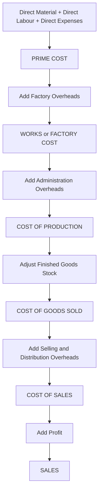
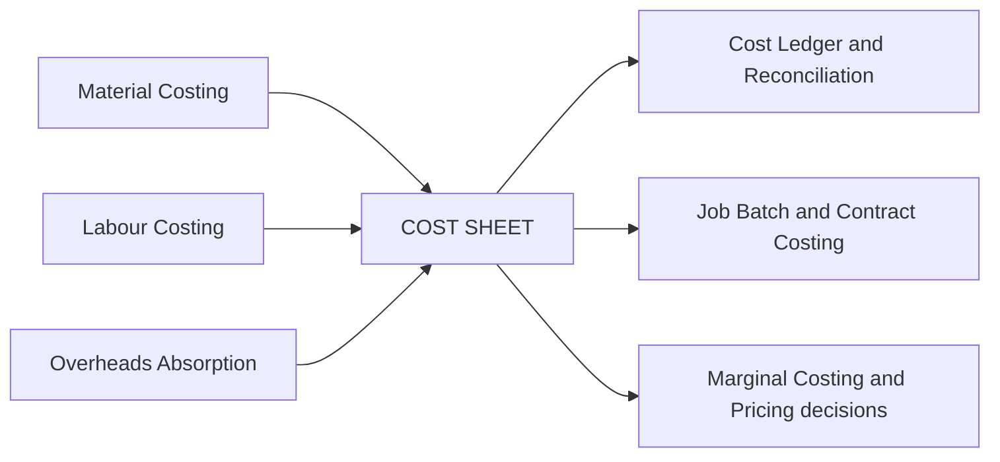

# Chapter 06 — Cost Sheet

## 1. The Problem — the manager's question that financial accounts cannot answer

Imagine you run *Sunrise Cycles*, a factory making bicycles. At the year-end your financial accountant hands you a Profit & Loss Account. It says: *Sales ₹80,00,000, all expenses ₹68,00,000, Profit ₹12,00,000.* You nod. But then a dealer walks in and asks a question that makes the P&L useless:

> "I want to place an order for 500 special-frame cycles. What price will you quote me?"

Turn to the P&L for the answer and you are stranded. The P&L tells you the **result of the past** — one lump profit for everything sold. It cannot tell you:

- What did **one** cycle cost to make?
- Of that cost, how much was **material**, how much **labour**, how much **factory overhead**, how much **office and selling** expense?
- If I make 500 more, which costs will **rise** and which stay flat?
- At what price do I stop *losing* money and start *making* it?

The financial P&L is organised by **nature** (salaries, rent, depreciation, purchases) and lumps the whole business together. A manager needs cost organised by **function and by unit** — material vs labour vs overhead, factory vs office vs selling, and ultimately *per cycle*. That reorganisation, laid out as a vertical statement that builds cost stage by stage up to profit, is the **Cost Sheet**.

**The decision the Cost Sheet enables:** pricing a quotation, judging whether a product is profitable, controlling each element of cost by watching it separately, valuing closing stock for the balance sheet, and comparing this period against the last. Every line of the format below exists because some manager needed one of those answers.

---

## 2. The Core Idea — building a wall, brick by brick

Think of total cost not as one number but as a **wall built in courses (layers)**. You cannot lay the roof before the walls, and you cannot lay the walls before the foundation. Cost accumulates in exactly that disciplined order:

- **Foundation** = the direct, traceable costs of *making the thing* — the raw material you can point to, the wages of the person who touched it, any expense incurred specifically for that job. Together they are the **Prime Cost**.
- **Ground floor** = add the *factory's* indirect costs (the supervisor, factory rent, machine power). Now you have **Works / Factory Cost**.
- **First floor** = add the *office's* cost of administering production. Now you have **Cost of Production**.
- **Roof** = add *selling and distribution* cost. Now you have **Cost of Sales**.
- **The sky above the roof** = whatever the customer pays *over* Cost of Sales is **Profit**; Cost of Sales + Profit = **Sales**.

Each course rests on the one below because each answers a *different manager's question*. The factory manager is judged on Works Cost. The sales manager is judged on selling cost. The MD is judged on the final profit. By stacking the wall in named layers, the Cost Sheet lets each manager see *his own brick* — and lets you quote a price that covers *every* brick.

*Figure 1 — the cost wall: each layer adds one function's cost until the customer's price sits on top.*



---

## 3. Why it is built this way — the logic behind the staircase

Three design principles explain every feature of the Cost Sheet. Understand these and you never memorise the format again — you *reconstruct* it.

**(a) Direct before indirect — because traceability drives control.**
A cost is *direct* if you can economically trace it to one unit (the steel in a frame). It is *indirect* (an overhead) if it is shared and must be *apportioned* (the factory's electricity bill). Direct costs move automatically with volume and are controlled at the shop floor; overheads are controlled by budgets and absorption rates. Separating them at the very first stage (Prime Cost = all directs) is what makes cost *controllable*.

**(b) Function follows the physical journey of the product — because responsibility follows function.**
A product is born in the **factory**, is administered by the **office**, and is pushed to the customer by **selling & distribution**. The Cost Sheet adds overheads in that same sequence — factory → admin → selling — so that each functional manager owns exactly the layer he can influence. This is why Works Cost is struck *before* admin cost: the works manager should not be blamed for the MD's office rent.

**(c) Stock is the timing bridge — because *produced* is not the same as *sold*.**
Here is the subtle heart of the chapter. The factory *produces* a quantity in a period; the sales team *sells* a possibly different quantity. Cost must be matched to the **stage at which the goods physically are**:

- **Raw material stock** sits *before* production, so it is adjusted inside the material line, *before* Prime Cost.
- **Work-in-progress (WIP)** sits *inside* production, so it is adjusted at the *factory* stage — after factory overheads, as we compute Works Cost.
- **Finished goods stock** sits *after* production, so it is adjusted *after* Cost of Production, to convert "cost of goods **produced**" into "cost of goods **sold**".

Each stock is inserted at the exact rung where the goods physically rest. Get the *rung* right and the whole sheet reconciles. Get it wrong and every number below is contaminated. This single rule — **match each stock to its stage** — is the most-tested idea in the chapter.

*Figure 2 — where each stock adjustment enters the staircase.*


---

## 4. Full Technical Content — the formulas, each with its "why"

### 4.1 The elements of cost (the vocabulary)

| Element | Direct (traceable) | Indirect / Overhead (shared) |
|---|---|---|
| **Material** | Direct Material — steel, tyres, forms part of the product | Indirect Material — lubricants, cotton waste, small tools |
| **Labour** | Direct Labour — wages of machine operator, welder | Indirect Labour — supervisor, storekeeper, sweeper |
| **Expenses** | Direct (Chargeable) Expenses — hire of a special mould for one job, royalty per unit, design cost for a specific order | Indirect Expenses — factory rent, power, office salaries, advertising |

> **Direct Material + Direct Labour + Direct Expenses = PRIME COST.**
> **All indirects = OVERHEADS**, later split by function into Factory, Administration, and Selling & Distribution.

### 4.2 Stage 1 — Direct Material Consumed (why the RM stock lives here)

You bought material during the year, but you did not necessarily *use* all of it, and some was left over from last year. The cost sheet needs what was **consumed**, not what was purchased:

```
Raw Material Consumed
  = Opening Stock of Raw Material
  + Purchases of Raw Material
  + Carriage/Freight Inward on material
  + Import duty, octroi, insurance on incoming material
  − Purchase returns / trade discount
  − Closing Stock of Raw Material
```

*Why here?* Material is consumed at the very start of the process, so its stock adjustment belongs *before* Prime Cost. Carriage **inward** is added because it is a cost of *bringing material in* — part of its acquisition cost. (Carriage *outward* is a selling cost and appears far below.)

### 4.3 Stage 2 — Prime Cost

```
Prime Cost = Direct Material Consumed + Direct Labour (Wages) + Direct Expenses
```

*Why struck separately?* Prime Cost is the "hard core" of traceable cost — the part a foreman can control unit-by-unit. It is also the base on which some factories absorb overheads (percentage-of-prime-cost method).

### 4.4 Stage 3 — Works / Factory Cost (why WIP stock lives here)

```
Gross Works Cost   = Prime Cost + Factory (Works) Overheads
Factory Cost       = Gross Works Cost + Opening WIP − Closing WIP
```

**Factory overheads** = indirect material + indirect wages + factory rent, power, fuel, depreciation of plant, factory insurance, works manager's salary, etc.

*Why is WIP adjusted here and nowhere else?* WIP means goods **partly through the factory** — material and labour and some overhead have been incurred but the unit is not finished. That is precisely the *works stage*. So opening WIP (last period's half-done units, now being finished) is added and closing WIP (this period's half-done units) is removed **after** factory overheads have gone in, because WIP already carries a share of factory overhead.

> **Common adjustment — sale of scrap:** scrap arising in the factory is a *recovery* of factory cost. Its sale value is **deducted** from factory overheads (or from Works Cost) before striking Factory Cost.

### 4.5 Stage 4 — Cost of Production

```
Cost of Production = Factory Cost + Administration Overheads (relating to production)
```

**Administration overheads** = office rent, office salaries, office lighting, printing & stationery, directors' remuneration, audit fees, legal charges — the cost of *running the office that administers production*.

*Why after Works Cost?* Administration is a level *above* the shop floor; conceptually you cannot administer production until production exists. (ICAI convention charges general administration here; some purist syllabi treat admin as a period cost — for CA Inter, include production-related admin at this stage unless told otherwise.)

### 4.6 Stage 5 — Cost of Goods Sold (why finished-goods stock lives here)

```
Cost of Goods Sold (COGS)
  = Cost of Production
  + Opening Stock of Finished Goods
  − Closing Stock of Finished Goods
```

*Why here — the crux?* Cost of Production is the cost of everything **produced** this period. But we only match cost against **sales**. Some produced units remain unsold (closing FG stock) and must be carried out; some units sold this period were produced *last* period (opening FG stock) and must be brought in. Adjusting FG stock *after* Cost of Production converts "cost of goods **produced**" into "cost of goods **sold**." This is the timing bridge between production and sales.

> **Valuing the FG stock:** unless told otherwise, closing finished goods are valued at the **current period's Cost of Production per unit** = Cost of Production ÷ units produced. Opening FG is valued at *last* period's rate (given in the problem).

### 4.7 Stage 6 — Cost of Sales, and Profit

```
Cost of Sales = COGS + Selling & Distribution Overheads
Profit        = Sales − Cost of Sales
Sales         = Cost of Sales + Profit
```

**Selling & distribution overheads** = salesmen's salaries and commission, advertising, carriage **outward**, warehouse of finished goods, showroom rent, bad debts, packing for delivery.

*Why last?* Selling cost is incurred only when you *push the finished good to the customer* — the final leg of the product's journey.

### 4.8 The two-sided margin relationships (the pricing engine)

For tenders and quotations you must convert between cost, profit, and sales. Master these:

| If profit is a % **on cost** | If profit is a % **on sales** |
|---|---|
| Profit = Cost × rate | Profit = Sales × rate |
| Sales = Cost × (1 + rate) | Cost = Sales × (1 − rate) |
| e.g. 25% on cost → Sales = 1.25 × Cost | e.g. 20% on sales → Cost = 0.80 × Sales |

**Interconversion trick:** profit that is *x%* on cost equals *x / (100 + x) %* on sales; profit that is *y%* on sales equals *y / (100 − y) %* on cost. (Example: 25% on cost = 25/125 = 20% on sales.)

### 4.9 What is EXCLUDED from a Cost Sheet (pure-cost principle)

The Cost Sheet records only costs of the *product/operation*. It **excludes** all *financial* and *appropriation* items:

- Financial items: interest on loans/debentures, dividends paid, income-tax, loss/profit on sale of assets, transfer to reserves.
- Purely notional gains and non-operating income (interest received, rent received, dividend received).
- Abnormal losses (abnormal wastage, cost of idle time due to strike) — charged to Costing P&L, not the Cost Sheet.
- Cash discount (a financial item). *Trade discount*, however, is netted off purchases/sales.

*Why?* Cost Accounting isolates the *cost of making and selling*, so that decisions are not distorted by how the business is *financed* or *taxed*.

---

## 5. Worked Examples

### Example 1 — The foundation (simple, no stocks)

*Meridian Tools furnishes the following for the year. Prepare a Cost Sheet showing each stage and profit.*

| Item | ₹ |
|---|---|
| Direct materials purchased & consumed | 4,00,000 |
| Direct wages | 2,00,000 |
| Direct expenses (special mould hire) | 40,000 |
| Factory overheads | 1,20,000 |
| Administration overheads | 60,000 |
| Selling & distribution overheads | 80,000 |
| Sales | 10,00,000 |

**Solution — Cost Sheet of Meridian Tools**

| Particulars | ₹ | ₹ |
|---|---:|---:|
| Direct Materials consumed | | 4,00,000 |
| Direct Wages | | 2,00,000 |
| Direct Expenses | | 40,000 |
| **Prime Cost** | | **6,40,000** |
| Add: Factory Overheads | | 1,20,000 |
| **Works / Factory Cost** | | **7,60,000** |
| Add: Administration Overheads | | 60,000 |
| **Cost of Production** | | **8,20,000** |
| Add: Selling & Distribution Overheads | | 80,000 |
| **Cost of Sales** | | **9,00,000** |
| **Profit (balancing figure)** | | **1,00,000** |
| **Sales** | | **10,00,000** |

*Check:* Sales 10,00,000 − Cost of Sales 9,00,000 = Profit 1,00,000. ✓ Reconciles. Note profit is 1,00,000/9,00,000 = **11.11% on cost** = 1,00,000/10,00,000 = **10% on sales** — the interconversion of §4.8 in action.

---

### Example 2 — Introducing all three stocks (the timing bridge)

*Nova Appliances, for the year ended 31 March 2026. Prepare a Cost Sheet.*

| Item | ₹ |
|---|---|
| Raw material — opening stock | 50,000 |
| Raw material — purchases | 6,00,000 |
| Carriage inward | 20,000 |
| Raw material — closing stock | 70,000 |
| Direct wages | 3,00,000 |
| Direct expenses | 30,000 |
| Factory overheads | 1,80,000 |
| Opening Work-in-Progress | 40,000 |
| Closing Work-in-Progress | 60,000 |
| Sale of factory scrap | 10,000 |
| Administration overheads | 90,000 |
| Opening finished goods | 80,000 |
| Closing finished goods | 1,20,000 |
| Selling & distribution overheads | 1,10,000 |
| Profit margin | 20% on sales |

**Step 1 — Material consumed** (RM stock adjusted *before* Prime Cost):
50,000 + 6,00,000 + 20,000 − 70,000 = **6,00,000**.

**Step 2 — Prime Cost:** 6,00,000 + 3,00,000 + 30,000 = **9,30,000**.

**Step 3 — Works Cost** (factory overheads *less* scrap recovery, then WIP adjusted at the factory stage):
Factory OH net of scrap = 1,80,000 − 10,000 = 1,70,000.
Gross works = 9,30,000 + 1,70,000 = 11,00,000; + opening WIP 40,000 − closing WIP 60,000 = **10,80,000**.

**Step 4 — Cost of Production:** 10,80,000 + 90,000 = **11,70,000**.

**Step 5 — Cost of Goods Sold** (finished-goods stock adjusted *after* Cost of Production):
11,70,000 + 80,000 − 1,20,000 = **11,30,000**.

**Step 6 — Cost of Sales:** 11,30,000 + 1,10,000 = **12,40,000**.

**Step 7 — Profit & Sales** (profit is 20% *on sales* → Cost of Sales is 80% of Sales):
Sales = 12,40,000 ÷ 0.80 = **15,50,000**; Profit = 15,50,000 − 12,40,000 = **3,10,000**.

**Cost Sheet of Nova Appliances (year ended 31.03.2026)**

| Particulars | ₹ | ₹ |
|---|---:|---:|
| Opening stock of Raw Material | 50,000 | |
| Add: Purchases | 6,00,000 | |
| Add: Carriage inward | 20,000 | |
| Less: Closing stock of Raw Material | (70,000) | |
| **Raw Material Consumed** | | 6,00,000 |
| Direct Wages | | 3,00,000 |
| Direct Expenses | | 30,000 |
| **Prime Cost** | | **9,30,000** |
| Add: Factory Overheads 1,80,000 less Scrap 10,000 | | 1,70,000 |
| Add: Opening WIP | | 40,000 |
| Less: Closing WIP | | (60,000) |
| **Works / Factory Cost** | | **10,80,000** |
| Add: Administration Overheads | | 90,000 |
| **Cost of Production** | | **11,70,000** |
| Add: Opening Finished Goods | | 80,000 |
| Less: Closing Finished Goods | | (1,20,000) |
| **Cost of Goods Sold** | | **11,30,000** |
| Add: Selling & Distribution Overheads | | 1,10,000 |
| **Cost of Sales** | | **12,40,000** |
| **Profit (20% on sales)** | | **3,10,000** |
| **Sales** | | **15,50,000** |

*Check:* Profit 3,10,000 ÷ Sales 15,50,000 = 20.0% on sales. ✓ Every stock entered at its correct rung; the sheet reconciles.

---

### Example 3 — The exam-hard tender/quotation (per-unit costing + estimate)

This is the archetypal ICAI question: use *last period's* actuals to derive *per-unit* rates, then *project* them onto a future order with cost changes — and quote a price.

*Precision Castings produced and sold **10,000 units** last year. Actuals:*

| Item | ₹ |
|---|---|
| Raw materials consumed | 8,00,000 |
| Direct wages | 5,00,000 |
| Direct expenses | 1,00,000 |
| Factory overheads | 3,00,000 |
| Administration overheads | 2,40,000 |
| Selling & distribution overheads | 2,00,000 |
| Sales | 25,00,000 |

*For the coming year the company has received a tender enquiry for **12,000 units** and expects:*
1. **Raw material price** will rise by **10%**.
2. **Wage rates** will rise by **20%**.
3. **Factory overhead** is recovered as a **percentage of direct wages** (same % as last year).
4. **Administration overhead** is recovered as a **percentage of works cost** (same % as last year).
5. **Selling & distribution overhead** is recovered **per unit** at last year's rate.
6. Direct expenses are **variable** — same rate per unit.
7. The company wants a **profit of 20% on the selling price**.

*Prepare (a) last year's Cost Sheet with per-unit columns, and (b) the estimated Cost Sheet / quotation for the 12,000-unit tender, and state the price per unit to quote.*

---

**Part (a) — Last year's Cost Sheet (10,000 units) to extract the rates**

| Particulars | Total ₹ | Per unit ₹ |
|---|---:|---:|
| Raw Materials consumed | 8,00,000 | 80.00 |
| Direct Wages | 5,00,000 | 50.00 |
| Direct Expenses | 1,00,000 | 10.00 |
| **Prime Cost** | **14,00,000** | **140.00** |
| Factory Overheads | 3,00,000 | 30.00 |
| **Works Cost** | **17,00,000** | **170.00** |
| Administration Overheads | 2,40,000 | 24.00 |
| **Cost of Production** | **19,40,000** | **194.00** |
| Selling & Distribution OH | 2,00,000 | 20.00 |
| **Cost of Sales** | **21,40,000** | **214.00** |
| Profit | 3,60,000 | 36.00 |
| **Sales** | **25,00,000** | **250.00** |

**Extract the recovery bases (this is the "why" of the tender):**
- Factory OH as % of Direct Wages = 3,00,000 ÷ 5,00,000 = **60% of wages**.
- Administration OH as % of Works Cost = 2,40,000 ÷ 17,00,000 = **14.1176% of works cost**.
- Selling & distribution = **₹20 per unit** (flat rate).

*Why use rates, not totals? Because the totals belong to 10,000 units at old prices. A rate is a portable law — apply it to any volume at any price level. That is exactly what a manager needs to price a future order.*

**Part (b) — Estimated per-unit costs for the 12,000-unit tender**

Build the *new* per-unit figures using the given changes, then multiply by 12,000.

- Raw material per unit: 80.00 × 1.10 = **₹88.00**
- Direct wages per unit: 50.00 × 1.20 = **₹60.00**
- Direct expenses per unit: **₹10.00** (variable, unchanged rate)
- **Prime Cost per unit** = 88 + 60 + 10 = **₹158.00**
- Factory OH = 60% of new wages = 60% × 60 = **₹36.00**
- **Works Cost per unit** = 158 + 36 = **₹194.00**
- Administration OH = 14.1176% of works cost = 0.141176 × 194 = **₹27.39**
- **Cost of Production per unit** = 194 + 27.39 = **₹221.39**
- Selling & distribution = **₹20.00** per unit (flat)
- **Cost of Sales per unit** = 221.39 + 20 = **₹241.39**
- Profit = 20% *on selling price* → Cost of Sales is 80% of price → Profit per unit = 241.39 × (20/80) = **₹60.35**
- **Selling price to quote per unit** = 241.39 + 60.35 = **₹301.74** (i.e., 241.39 ÷ 0.80)

**Estimated Cost Sheet / Quotation — 12,000 units**

| Particulars | Per unit ₹ | Total ₹ (×12,000) |
|---|---:|---:|
| Raw Materials (80 × 1.10) | 88.00 | 10,56,000 |
| Direct Wages (50 × 1.20) | 60.00 | 7,20,000 |
| Direct Expenses | 10.00 | 1,20,000 |
| **Prime Cost** | **158.00** | **18,96,000** |
| Factory OH (60% of wages) | 36.00 | 4,32,000 |
| **Works Cost** | **194.00** | **23,28,000** |
| Administration OH (14.1176% of works) | 27.39 | 3,28,695 |
| **Cost of Production** | **221.39** | **26,56,695** |
| Selling & Distribution (₹20/unit) | 20.00 | 2,40,000 |
| **Cost of Sales** | **241.39** | **28,96,695** |
| Profit (20% on selling price) | 60.35 | 7,24,174 |
| **Sales / Tender Price** | **301.74** | **36,20,869** |

*Check:* Profit 7,24,174 ÷ Sales 36,20,869 = 20.0% on sales. ✓ Works cost per unit 194 × 12,000 = 23,28,000. ✓ Admin 3,28,695 ÷ 23,28,000 = 14.12%. ✓ Rounding to two decimals leaves totals within a rupee; ICAI accepts either the per-unit-rounded or the exact-fraction answer as long as it reconciles.

**Managerial punchline:** the quote is **₹301.74 per unit** (₹36,20,869 for the order). Notice how *every* input change flowed through cleanly *because* we costed by rate and by stage. That is the entire payoff of the Cost Sheet — a defensible, transparent price built brick by brick.

---

## 6. Presentation / Format — the standard vertical layout

ICAI expects a **vertical (columnar) statement**, not a debit/credit account. Golden presentation rules:

1. **Title:** "Cost Sheet (or Statement of Cost) of ___ for the period ended ___."
2. **Two amount columns** for build-up (detail column + total column); add a **"Per Unit"** column and a **"Total"** column when quantities are given.
3. Show the **bold sub-totals** in order: Prime Cost → Works/Factory Cost → Cost of Production → Cost of Goods Sold → Cost of Sales → Sales. Never skip a stage even if a layer is nil.
4. Insert each **stock at its correct stage** (RM before Prime; WIP at Works; FG after Cost of Production).
5. Show **scrap sale** as a deduction from factory overhead/works cost; show **defective/rectification** per instructions.
6. Keep **excluded financial items** off the sheet entirely (see §4.9) — mention them only if a reconciliation with financial profit is asked.

*Skeleton to reproduce from memory:*

| Stage | Add | Less | Gives |
|---|---|---|---|
| Materials | Op. RM + Purchases + Carriage in | Cl. RM | Material Consumed |
| + Wages + Direct Exp | | | **Prime Cost** |
| + Factory OH | Op. WIP | Cl. WIP, Scrap | **Works Cost** |
| + Admin OH | | | **Cost of Production** |
| | Op. FG | Cl. FG | **Cost of Goods Sold** |
| + Selling & Distribution OH | | | **Cost of Sales** |
| + Profit | | | **Sales** |

---

## 7. Connections — where this sits in the wider syllabus

*Figure 3 — the Cost Sheet as the confluence of the element chapters.*



- **Material, Labour, Overhead chapters** feed the three elements — the Cost Sheet is where they *assemble*.
- **Overhead absorption** supplies the recovery rates (% of wages, % of works cost, per unit) used in tenders — exactly Example 3.
- **Reconciliation of cost and financial accounts** exists because the Cost Sheet *excludes* the financial items of §4.9; the reconciliation statement bridges the gap.
- **Job / Batch / Contract costing** are the Cost Sheet applied to a single job, a batch, or a long project.
- **Marginal costing** re-cuts the same costs into *fixed vs variable* rather than *function-wise*, for short-run decisions.

---

## 8. Traps & Examiner Tricks

1. **Wrong rung for a stock.** Putting closing FG at the Works stage, or WIP after Cost of Production, corrupts everything below. *Rule:* RM before Prime, WIP at Works, FG after Cost of Production.
2. **Carriage inward vs outward.** Inward = part of material cost (added before Prime). Outward = selling cost (added at Cost of Sales). Examiners bury both in one list.
3. **Profit on cost vs profit on sales.** "25% on cost" ≠ "25% on sales." Convert deliberately (§4.8). This flips the tender price by several rupees.
4. **Financial items sneaked in.** Interest on capital, income-tax, dividends, loss on sale of machinery, donation, goodwill written off, transfer to reserve — all must be **left out**. Non-operating incomes (interest/dividend received) are **not** deducted from cost either.
5. **Scrap treatment.** Normal scrap sale reduces factory cost. Do *not* add it to sales. Abnormal scrap loss goes to Costing P&L, not the sheet.
6. **Cash discount vs trade discount.** Cash discount (received/allowed) is financial — exclude. Trade discount is netted against purchases/sales.
7. **Per-unit rate from the wrong volume.** In tenders, derive rates from *actual output* (units produced), then apply to the *new* quantity. Mixing "sold" and "produced" units is a classic slip when FG stock exists.
8. **Depreciation split.** Depreciation of *plant* → factory OH; of *office equipment* → admin OH; of *delivery van* → selling OH. Location decides the layer.
9. **Overheads given as "office and administration"** default to the admin stage; "showroom/warehouse of finished goods" is selling, not factory.
10. **Under-/over-absorbed overhead** (if given): adjust only if the question asks; otherwise use actuals. Don't invent adjustments.

---

## 9. First-Principles Recap

Strip away the format and the whole chapter is one sentence: **cost accumulates as the product physically travels — foundation of directs (Prime), through the factory (Works), through the office (Cost of Production), out to the customer (Cost of Sales) — and each stock is injected at the exact stage where the goods physically rest.**

- *Why a staircase?* Because different managers own different layers, and each needs to see his own cost.
- *Why directs first?* Because traceable cost is controllable at the shop floor before shared overheads.
- *Why three stocks at three stages?* Because "produced" ≠ "sold," and cost must be matched to *where the goods actually are* — RM before making, WIP during making, FG after making.
- *Why exclude financial items?* Because cost tells you the price of *making and selling*, not of *financing and taxing*.
- *Why per-unit rates for tenders?* Because a rate is a portable law you can carry to any future volume and price level — that is the manager's whole reason for asking.

If you can rebuild the format from these five *whys*, you never need to memorise it — and you can adapt it to any twist the examiner invents.

---

## 10. Quick-Revision Sheet

| # | Stage | Formula |
|---|---|---|
| 1 | Material Consumed | Op. RM + Purchases + Carriage inward + duty − Returns − Cl. RM |
| 2 | **Prime Cost** | Material Consumed + Direct Wages + Direct Expenses |
| 3 | Gross Works Cost | Prime Cost + Factory Overheads − Scrap sale |
| 4 | **Works / Factory Cost** | Gross Works Cost + Op. WIP − Cl. WIP |
| 5 | **Cost of Production** | Works Cost + Administration Overheads |
| 6 | **Cost of Goods Sold** | Cost of Production + Op. Finished Goods − Cl. Finished Goods |
| 7 | **Cost of Sales** | COGS + Selling & Distribution Overheads |
| 8 | **Sales** | Cost of Sales + Profit |
| 9 | Profit = x% on cost | Sales = Cost × (1 + x); on-sales rate = x/(100+x) |
| 10 | Profit = y% on sales | Cost = Sales × (1 − y); on-cost rate = y/(100−y) |
| 11 | FG stock valuation | Cl. FG units × (Cost of Production ÷ units produced) |
| 12 | Cost per unit | Total cost at a stage ÷ number of units |

**Stock-at-its-stage map:** Raw Material → *before* Prime · WIP → *at* Works · Finished Goods → *after* Cost of Production.

**Excluded from Cost Sheet:** interest, income-tax, dividends, loss/profit on sale of assets, transfers to reserve, cash discount, donations, goodwill/preliminary written off, non-operating incomes, abnormal losses.

**Overhead-by-location:** plant depreciation & works manager → Factory · office rent & audit fee & directors' fee → Admin · advertising, carriage outward, salesmen commission, showroom → Selling & Distribution.
