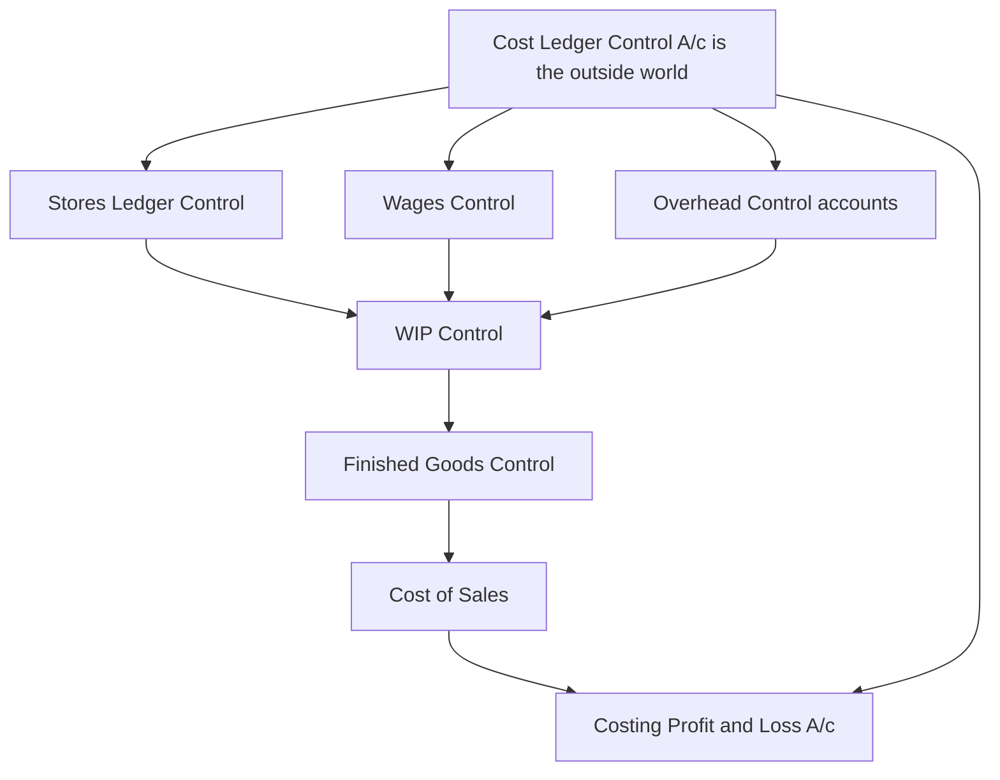
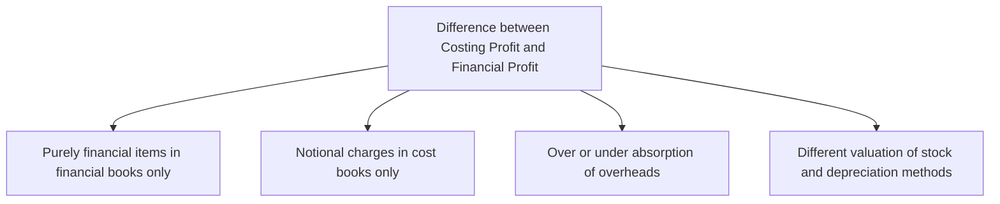
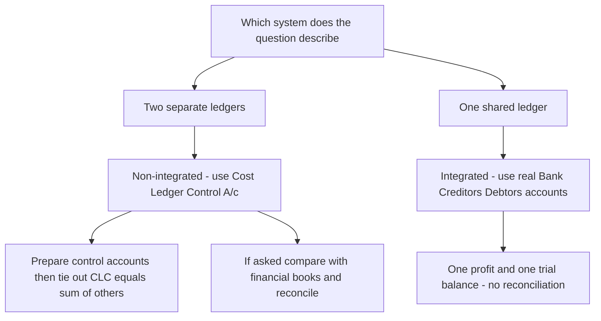

<!-- v2-deep -->

# Chapter 07 — Cost Accounting Systems (Integrated & Non-Integrated) + Reconciliation

## 1. The Problem — Two Sets of Eyes on the Same Business

You run a factory. At the end of the year your **financial accountant** hands you a Profit & Loss Account (prepared under the Companies Act / accounting standards) that says: *"Profit = ₹4,20,000."*

The same year, your **cost accountant** — who has been tracking every job, every machine hour, every kilo of raw material to tell you *what each product costs* — hands you a **Costing Profit & Loss Account** that says: *"Profit = ₹4,86,000."*

Same factory. Same twelve months. Same sales. **Two different profits.** ₹66,000 apart.

Now imagine you are the Managing Director. Which number do you report to shareholders? Which do you use to price your products? If the two systems disagree, is one of them *lying*? Is somebody stealing ₹66,000?

This is the central problem of this chapter, and it splits into three sub-questions:

1. **Why do we even keep a separate set of costing books** at all? Financial accounting already records every rupee — why duplicate?
2. **How do we structure those costing books** so they behave like a proper double-entry system (which auditors and examiners can test), rather than loose memoranda?
3. **When the two profit figures differ, how do we prove — rupee by rupee — that neither is wrong**, that the difference is fully explained by *known, legitimate reasons*? That proof is the **Reconciliation Statement**, and it is one of the most reliably-examined 8-to-10 mark questions in CA Intermediate.

The moment you understand *why* the two profits differ, the reconciliation statement stops being a list to memorise and becomes something you can reconstruct from scratch. That is the promise of this chapter.

**A fourth, subtler question the exam loves.** Notice that if the two books *never* disagreed, we would not need reconciliation at all — and indeed there is a third design where they never disagree: the **integrated** system, where cost and financial data are recorded *once* in one shared ledger. So the real strategic decision every business faces is: **keep two books and reconcile (non-integrated), or keep one book and never reconcile (integrated)?** This chapter equips you to (a) run either system as a set of ledger accounts, and (b) build the bridge between them when they are separate. Examiners test all three skills — ledger writing, integrated journal entries, and reconciliation — often in the same paper.

---

## 2. The Core Idea — The Tax Return vs. The Household Budget

Here is the analogy that unlocks everything.

Think of a family with two documents about its money:

- A **tax return**, filed with the government. It follows *the law*. It must include the interest earned on the savings account and the capital gain from selling the old car, even though those have nothing to do with "running the household." It cannot include a charge for "the rent we *would have* paid if we didn't own our house," because you can't deduct rent you never actually paid.
- A **household budget spreadsheet**, kept for *decision-making*. Here the family *does* include a notional rent — "living in our own house is worth ₹20,000/month, let's cost it in so we know the true cost of housing ourselves." But the budget *ignores* the capital gain on the car, because that's a one-off windfall, not part of monthly living.

Both documents are honest. They serve **different masters**. The tax return serves *external legal reporting*. The budget serves *internal management decisions*. Naturally they arrive at different "surplus" figures — and the difference is entirely explained by *the items each one deliberately includes or excludes*.

Financial accounting is the tax return. Cost accounting is the household budget. **The reconciliation statement is simply the bridge that lists every item one included and the other didn't** — proving the gap is principled, not fraudulent.

That single mental model — *"two honest books serving two masters"* — is the whole chapter. Everything below is just the accounting machinery that makes it precise.

**Pushing the analogy one step further (this is where marks are won).** The gap between the two documents is not random — it always belongs to one of four *buckets*: (i) things only the tax return recognises (the car's capital gain, the loan interest), (ii) things only the budget recognises (the notional rent), (iii) estimates the budget uses that the tax return trues up to actuals (the family "budgeted" ₹5,000/month for electricity but the actual bills came to ₹5,400), and (iv) the same item *measured differently* in each (the budget values the pantry stock at what they paid; the tax rules force a different valuation). Hold those four buckets in your head — financial-only, cost-only, estimate-vs-actual, and different-measurement — and you can *derive* every reconciling line the examiner can invent, including ones you have never seen before. Section 4.3 names these four buckets in accounting language.

---

## 3. Why It's Built This Way — Three Structural Choices

### 3.1 Why keep cost books separate from financial books?

Financial accounts classify expenses **by nature** (salaries, rent, power, depreciation) because the law wants to know *what kind* of money left the business. But a manager asking *"what did Job #47 cost?"* or *"is Product A profitable?"* cannot get an answer from a P&L that only says "total wages ₹18 lakh." Cost accounting reclassifies the same expenses **by function and by cost object** (this much wage went to *this job*, this overhead to *that department*). You need a system that slices data along the "product/process/job" axis, not the "nature of expense" axis. That is why a **separate ledger** — the **Cost Ledger** — historically evolved.

There is also a *timeliness and confidentiality* reason the exam sometimes probes. Financial books close annually under statutory audit deadlines; management needs cost data *monthly or even weekly* to price quotes and control waste. And a firm may not want its detailed job costs (its pricing intelligence) sitting inside the same books its statutory auditors and tax officers pore over. A separate cost ledger delivers management data on management's timetable, in management's classification, without waiting for the financial close.

### 3.2 Why make the cost ledger self-balancing?

If cost records were just informal notes, no auditor could trust them and no examiner could set a "prepare the ledger accounts" question. So the cost ledger is made into a **complete double-entry system in its own right**. But there's a snag: costing only cares about *manufacturing and trading* transactions — it has no interest in share capital, bank, creditors, or debtors (those are "financial" items). Every cost entry therefore has one leg inside the cost ledger and one leg that points *outward* to the financial world. To keep the cost ledger self-balancing without importing the whole financial ledger, we invent **one master account that stands in for the entire outside financial world**: the **Cost Ledger Control Account** (a.k.a. **General Ledger Adjustment Account**). Every time cost accounting needs to interact with the financial world, the other leg hits this one account. This is the single cleverest idea in non-integrated accounting.

*First-principles justification of the self-balancing trick.* Double entry demands that every debit have an equal credit *inside the same ledger* — otherwise the trial balance won't tie. When materials are bought on credit, the "credit" side is really *Sundry Creditors*, which lives in the financial ledger. If we left it dangling, the cost ledger's debits would exceed its credits by the value of that creditor, and it would never balance. The CLC absorbs exactly that dangling leg. Mathematically, the CLC is nothing more than **the negative of the sum of all the "internal" cost accounts** — it is a plug that, by construction, makes the two sides equal. That is why the closing balance on the CLC must always equal the total of all other cost-ledger balances (the tie-out check in §5).

### 3.3 Why would anyone integrate the two systems instead?

Keeping two sets of books means **duplicated posting effort, two trial balances, and a permanent profit gap that must be reconciled every period** — costly and error-prone. So many firms merge them into **one integrated ledger** where each transaction is recorded once and serves both purposes. Integration eliminates the reconciliation work entirely (there's only one profit figure) but demands a more sophisticated chart of accounts and tighter discipline. The trade-off — *simplicity of one book vs. flexibility of two* — is exactly what the exam wants you to be able to argue.

### 3.4 Degree of integration — a distinction the exam quietly rewards

Integration is not all-or-nothing. A firm chooses **how far up the cost chain** it will merge the two systems:

- **Full integration:** every transaction — from raw-material purchase right through to sales and profit — is posted once in one ledger. Only one profit emerges.
- **Partial integration (integration up to a point):** the two systems share a common ledger only up to, say, **prime cost** or **works cost**; beyond that point cost and financial records diverge and a *limited* reconciliation is still needed. This is common where a firm wants tight control over factory costs but keeps administration/selling records purely financial.

The examiner may ask you to *state the degree of integration a firm has adopted* or to identify which control accounts survive under partial integration. The key insight: the further you integrate, the smaller the residual reconciliation — full integration shrinks it to zero.

### 3.5 Interlocking vs. integrated — get the vocabulary exactly right

These three terms are constantly confused; a one-mark theory question can turn on them.

| Term | Meaning |
|---|---|
| **Cost Control / Non-integrated / Interlocking accounts** | Two *separate* self-balancing ledgers (cost + financial) that "interlock" only through periodic reconciliation. Cost ledger uses a **Cost Ledger Control A/c**. |
| **Integrated / Integral accounts** | **One** ledger serving both purposes. **No** Cost Ledger Control A/c; real financial accounts appear. **No** reconciliation. |
| **Memorandum reconciliation** | A *presentation format* (a T-account version of the reconciliation statement) — not a system. Applies only to non-integrated firms. |

Mnemonic: **inter**locking = **inter**val reconciliation (separate books); **integr**ated = **integr**ity of one book.

---

## 4. Full Technical Content

### 4.1 Non-Integrated (Cost Ledger / Interlocking) Accounting

**Definition.** A system in which the cost accounts are maintained in a **separate set of books**, independent of the financial books. Also called **cost ledger accounting** or **interlocking accounting** (the two ledgers "interlock" through periodic reconciliation, but are physically separate).

**The Control Accounts.** Because the cost ledger is self-balancing, it uses **control accounts** — summary accounts that stand in place of many detailed subsidiary records. The principal accounts are:

| Control Account | What it represents / does |
|---|---|
| **Cost Ledger Control A/c (CLC)** — a.k.a. General Ledger Adjustment A/c | The proxy for the *entire financial ledger*. Receives the "other leg" of every transaction that originates in the financial world (purchases, wages paid, overheads incurred, sales, opening balances). Makes the cost ledger self-balancing. |
| **Stores Ledger Control A/c** | Total value of raw materials in stock; controls the individual bin/stores cards. |
| **Wages Control A/c** | Collects gross wages, then distributes them to WIP (direct) and Overhead (indirect). |
| **Production / Works / Factory Overhead Control A/c** | Collects all factory indirect costs; *absorbs* them into WIP at the predetermined rate. Its balance = under/over-absorption. |
| **Work-in-Progress (WIP) Control A/c** | The manufacturing hub. Debited with direct material, direct wages, direct expenses and absorbed production overhead; credited with cost of finished goods completed. |
| **Administration Overhead Control A/c** | Collects admin overheads; absorbed into finished goods (or cost of sales, per policy). |
| **Selling & Distribution Overhead Control A/c** | Collects S&D overheads; absorbed into Cost of Sales. |
| **Finished Goods Control A/c** | Value of completed but unsold goods. Debited from WIP; credited to Cost of Sales on despatch. |
| **Cost of Sales A/c** | Accumulates the total cost of goods actually sold; transferred to Costing P&L. |
| **Costing Profit & Loss A/c** | Where sales meet cost of sales; also where under/over-absorption and abnormal gains/losses are closed off; yields **costing profit**. |
| **Overhead Adjustment A/c** (optional) | A collecting point to net off under/over-absorption before transfer to Costing P&L. |

**The Golden Rule of the Cost Ledger Control A/c:** *whenever the cost ledger must record something whose "real" other side lives in the financial books (cash, bank, creditors, debtors, capital), the other side is posted to the Cost Ledger Control A/c.* CLC is the ledger's window to the outside world.

**Opening balances — the point students skip.** On day one of a period, the cost ledger must open with balances too, and *those* also route through the CLC. Every opening **asset** balance (Stores, WIP, Finished Goods) is a **debit** in its own account with the **credit** to CLC; the CLC therefore *opens as a credit balance equal to the net assets carried in*. Forgetting the opening entries is the most common reason a ledger question fails to tie out. If the question gives opening stock figures, your very first journal line should be: *Stores/WIP/Finished Goods Control A/c Dr / To Cost Ledger Control A/c.*

#### The standard journal entries (non-integrated)

Read each with its *reasoning*, not as a list:

| # | Transaction | Entry | Why |
|---|---|---|---|
| 1 | Materials purchased | Stores Ledger Control A/c **Dr** / To Cost Ledger Control A/c | Stock rises inside cost ledger; the cash/creditor lives outside → CLC. |
| 2 | Direct material issued to jobs | WIP Control A/c **Dr** / To Stores Ledger Control A/c | Value moves from store to the shop floor. |
| 3 | Indirect material issued | Production OH Control A/c **Dr** / To Stores Ledger Control A/c | Indirect material is an overhead, not a direct charge. |
| 4 | Wages paid (gross) | Wages Control A/c **Dr** / To Cost Ledger Control A/c | Cash paid lives outside → CLC. |
| 5 | Direct wages allocated | WIP Control A/c **Dr** / To Wages Control A/c | Direct labour is a prime cost of the product. |
| 6 | Indirect wages allocated | Production OH Control A/c **Dr** / To Wages Control A/c | Indirect labour is overhead. |
| 7 | Overheads incurred (rent, power…) | Production/Admin/S&D OH Control A/c **Dr** / To Cost Ledger Control A/c | Real payment is outside → CLC. |
| 8 | Production OH absorbed | WIP Control A/c **Dr** / To Production OH Control A/c | Overhead absorbed into product at predetermined rate. |
| 9 | Cost of goods completed | Finished Goods Control A/c **Dr** / To WIP Control A/c | Completed output leaves WIP. |
| 10 | Admin OH absorbed | Finished Goods Control A/c **Dr** / To Admin OH Control A/c | Admin loaded onto finished output (policy-dependent). |
| 11 | Cost of goods sold | Cost of Sales A/c **Dr** / To Finished Goods Control A/c | Goods despatched to customers. |
| 12 | S&D OH absorbed | Cost of Sales A/c **Dr** / To S&D OH Control A/c | Selling cost attaches only to goods sold. |
| 13 | Sales | Cost Ledger Control A/c **Dr** / To Costing P&L A/c | Revenue's real side (debtor/cash) is outside → CLC. |
| 14 | Transfer cost of sales to P&L | Costing P&L A/c **Dr** / To Cost of Sales A/c | Match cost against revenue. |
| 15 | Over-absorption of OH | Production OH Control A/c **Dr** / To Costing P&L A/c | Excess absorbed = a costing "gain." |
| 15a | Under-absorption of OH | Costing P&L A/c **Dr** / To Production OH Control A/c | Shortfall absorbed = a costing "loss." |
| 16 | Costing profit | Costing P&L A/c **Dr** / To Cost Ledger Control A/c | Profit is "owed back" to the financial world; closes the ledger. |

**A few less-common but examinable entries.** Extend the same logic:

| Transaction | Entry | Why |
|---|---|---|
| Materials returned to supplier | Cost Ledger Control A/c **Dr** / To Stores Ledger Control A/c | Reverse of purchase — stock falls, outside world is credited-back. |
| Material returned from shop to store | Stores Ledger Control A/c **Dr** / To WIP Control A/c | Value flows back up the chain. |
| Carriage inward on materials | Stores Ledger Control A/c **Dr** / To Cost Ledger Control A/c | Freight-in is part of material cost, capitalised into stores. |
| Abnormal loss of material/stock | Costing P&L A/c **Dr** / To Stores (or WIP) Control A/c | Abnormal loss is charged straight to Costing P&L, not to product. |
| Abnormal gain | WIP / Process A/c **Dr** / To Costing P&L A/c | Abnormal gain credited to Costing P&L. |
| Notional charge (e.g. notional rent) | Overhead Control A/c **Dr** / To Cost Ledger Control A/c | Cost-only charge; the "credit" has no financial reality, so it hits CLC. |

Note the last row: a **notional** charge is *created* inside the cost ledger with its balancing credit to CLC — which is precisely why it later becomes a reconciling item (the financial books never saw it).

**Self-check property:** because *every* leg that leaves the cost ledger meets the CLC, the **balance on the Cost Ledger Control A/c always equals the net total of all other control-account balances** (Stores + WIP + Finished Goods etc.). The cost trial balance therefore balances on its own. That is the entire point of the design.


*Figure 4.1 — Cost flow through the non-integrated control accounts; every external leg loops back to the Cost Ledger Control A/c.*

### 4.2 Integrated (Integral) Accounting

**Definition.** A **single set of books** that records cost and financial transactions together, so that both cost data and financial statements are produced from one ledger — **no separate cost ledger, no Cost Ledger Control A/c, and no reconciliation needed.**

The key structural change: in place of the fictional Cost Ledger Control A/c, the **real** financial accounts (Bank/Cash, Sundry Creditors, Sundry Debtors, Provision for Depreciation, Share Capital) now appear. So the entry for "materials purchased on credit" becomes:

> Stores Ledger Control A/c **Dr** / To **Sundry Creditors A/c** — (a *real* creditor, not the CLC proxy).

Everything downstream (WIP, Finished Goods, Cost of Sales, overhead control accounts, absorption) works **exactly as in the non-integrated system** — only the "window to the outside world" is replaced by the genuine financial accounts.

**The full integrated journal — map each cost entry to its real counterpart.** This side-by-side is exactly what "prepare journal entries under integrated accounting" wants:

| Transaction | Integrated entry (real accounts in **bold**) |
|---|---|
| Materials purchased on credit | Stores Ledger Control Dr / To **Sundry Creditors** |
| Wages paid | Wages Control Dr / To **Bank** |
| Overheads paid in cash | Overhead Control Dr / To **Bank** |
| Overheads outstanding | Overhead Control Dr / To **Outstanding Expenses** |
| Depreciation on plant | Overhead Control Dr / To **Provision for Depreciation** |
| Direct material to jobs | WIP Control Dr / To Stores Ledger Control |
| Direct wages to jobs | WIP Control Dr / To Wages Control |
| Production OH absorbed | WIP Control Dr / To Production OH Control |
| Goods completed | Finished Goods Control Dr / To WIP Control |
| Cost of goods sold | Cost of Sales Dr / To Finished Goods Control |
| Sales on credit | **Sundry Debtors** Dr / To Sales (then Sales → Costing/General P&L) |
| Cash received from debtors | **Bank** Dr / To **Sundry Debtors** |

Study the pattern: **internal cost legs are identical to §4.1; only the "outside world" leg changes from CLC to a real account.** Master §4.1 and integrated entries are free.

**Treatment of under/over-absorbed overhead in an integrated system.** Because there is only one profit, the under/over-absorption is simply carried to the single Profit & Loss A/c (or deferred via an Overhead Adjustment A/c if the firm's policy is to carry it forward). There is *no* separate "costing" profit to protect — this is why an integrated firm has nothing to reconcile.

**Why integrate (advantages):**
- **One profit figure** — no reconciliation, no permanent gap to explain.
- **No duplication** of effort; each transaction posted once. Lower cost, fewer errors.
- **One arithmetic accuracy check** — a single trial balance covers both purposes.
- Cost and financial data are **always coordinated and up to date** together.
- **Wider management view** — every manager sees a common, reconciled dataset, aiding decisions.

**Prerequisites for integration (why it isn't automatic):**
1. A management **decision on the degree of integration** (full, or only up to prime/works cost — see §3.4).
2. A **suitable, well-codified chart of accounts** so one entry serves both classifications (by nature *and* by function/object).
3. **Agreed treatment** of notional items and stock valuation, and a coding system linking accounts.
4. **Full cooperation** between the cost and financial staff.
5. **An educated staff and adequate IT/records** so the integrated system's discipline is actually maintained.

**The subtle consequence for notional costs.** If the firm truly integrates, can it still charge *notional* rent or interest? Not into the shared ledger — a notional charge has no real credit counterpart, so it cannot sit in a system built on real accounts. Integrated firms therefore either **drop notional charges** or keep them as **memorandum/statistical** figures outside the ledger. This is why "no reconciliation" and "no notional charges in the books" go hand in hand — a favourite conceptual exam point.


*Figure 4.2 — Integrated system: the same cost flow, but the outside legs hit real financial accounts, producing one shared Profit and Loss A/c.*

### 4.3 The heart of the matter — Why the two profits differ

Under the **non-integrated** system (or when comparing a firm's cost books against its financial books), the two profit figures diverge for exactly **four families of reasons**. Master these four and you never memorise a reconciliation list again.

**A. Items shown ONLY in Financial Accounts (never enter cost).** These are *purely financial* — not related to manufacturing/operations, so cost accounting ignores them.
- *Purely financial charges (expenses/losses):* interest on loans/debentures paid, loss on sale of fixed assets/investments, discount on issue of shares/debentures written off, goodwill/preliminary expenses written off, penalties & fines, donations, provision for taxation, dividends paid.
- *Purely financial incomes (gains):* interest received, dividends received, rent received, profit on sale of fixed assets/investments, transfer fees received.
- *Appropriations of profit (a sub-set worth naming):* transfer to general reserve, transfer to sinking fund, proposed/paid dividend, income-tax provision. These are *below-the-line* in financial books and never enter cost — classic reconciling items examiners slip in.

**B. Items shown ONLY in Cost Accounts (notional charges).** Cost accounting includes *notional / imputed* costs to reveal the true economic cost of resources, even though no cash changed hands and financial books know nothing of them.
- *Notional rent* on own premises; *notional interest* on own capital; *notional salary* of a proprietor. These reduce costing profit but not financial profit.

**C. Over- or Under-absorption of Overheads.** Cost accounts absorb overhead at a **predetermined rate**; financial accounts record the **actual** overhead. The mismatch causes a difference (unless it was already fully written to the Costing P&L). This bucket covers **production, administration AND selling** overheads — students remember factory OH and forget the other two.

**D. Different bases of valuation / methods.**
- **Stock valuation:** cost books may value stock at, say, weighted average while financial books use FIFO — different opening/closing stock values shift profit differently in each set. (Under-valuation vs over-valuation of *opening* and *closing* stock each has its own direction — see the stock trap in §8.)
- **Depreciation:** cost books may use machine-hour rate; financial books straight-line/WDV — different depreciation charges.
- **WIP valuation and basis of overhead recovery** can differ similarly.


*Figure 4.3 — The four families of reconciling items. Every reconciliation line belongs to one of these.*

### 4.4 The mechanical rule for building the Reconciliation Statement

Pick **one** profit as your starting point; adjust toward the other. The direction rule (memorise the *logic*, not the table):

> **Start with Costing Profit. Then:**
> - **ADD** every item that made *financial profit higher* (i.e., financial-only **incomes**; overhead **over-absorbed** in cost; items **over-charged** as expense in cost such as **higher cost depreciation** or **higher cost stock consumption**).
> - **SUBTRACT** every item that made *financial profit lower* (i.e., financial-only **expenses/losses**; **notional charges** debited only in cost; overhead **under-absorbed** in cost).
> - The answer = **Financial Profit.**

The failsafe test for any line: *"Did this item reduce one profit but not the other? Then move in the direction that closes the gap."* If an expense sits in financial books only, financial profit is lower, so from costing profit you **subtract** it. If an income sits in financial books only, financial profit is higher, so you **add** it.

**Mirror-image caution:** the ADD/SUBTRACT signs **flip** if you start from *financial* profit and work toward *costing* profit. Always write the heading — "Profit as per Cost Accounts" — so you know your starting anchor.

**A universal two-step algorithm that never fails** (use this when a tweaked item confuses you):
1. Ask: *In which book is this item's effect present, and did it raise or lower that book's profit?*
2. Then: *I am starting from the OTHER book, so I move in the direction that would reproduce that effect.* If the item lowered financial profit and I start from cost profit, I must **lower** my running total → subtract; if it raised financial profit, I **raise** → add.

This works even for exotic items (say, "obsolescence loss written off only in financial books") without you having ever memorised that specific line: it lowered financial profit, so from cost profit you subtract it. Done.

**The memorandum reconciliation account — the T-account alternative.** Instead of a vertical "+ / −" statement, ICAI also accepts a **Memorandum Reconciliation Account**. It is a *memorandum* (statistical) account — it sits *outside* the double-entry system, which is why it is called "memorandum." Layout when starting from costing profit:
- **Credit side:** Profit as per Cost Accounts (the opening figure) + all "ADD" items (items that raise financial profit).
- **Debit side:** all "LESS" items (items that lower financial profit) + Profit as per Financial Accounts as the balancing figure.

The balancing figure on the debit side *is* the financial profit. It contains exactly the same information as the vertical statement — pick whichever the question asks for; if it doesn't specify, the vertical statement is faster and safer.

---

## 5. Worked Examples

### Example 1 (Easy) — Non-integrated ledger entries and the self-balancing check

*Transactions for the month (₹):* Materials purchased 3,00,000; Direct materials issued 2,20,000; Indirect materials issued 20,000; Wages paid 1,50,000 (direct 1,20,000, indirect 30,000); Factory overheads incurred (other than indirect material/labour) 60,000; Factory overhead absorbed 1,05,000; Cost of goods completed 4,00,000; Cost of goods sold 3,80,000; Sales 5,00,000. There were no opening balances. Pass entries and prepare the Costing P&L.

**Step 1 — Journalise (following the reasoning in §4.1).**

| Entry | Dr | Cr | ₹ |
|---|---|---|---|
| Purchase | Stores Ledger Control | Cost Ledger Control | 3,00,000 |
| Direct material issue | WIP Control | Stores Ledger Control | 2,20,000 |
| Indirect material | Factory OH Control | Stores Ledger Control | 20,000 |
| Wages paid | Wages Control | Cost Ledger Control | 1,50,000 |
| Direct wages | WIP Control | Wages Control | 1,20,000 |
| Indirect wages | Factory OH Control | Wages Control | 30,000 |
| Factory OH incurred | Factory OH Control | Cost Ledger Control | 60,000 |
| Factory OH absorbed | WIP Control | Factory OH Control | 1,05,000 |
| Goods completed | Finished Goods Control | WIP Control | 4,00,000 |
| Cost of sales | Cost of Sales | Finished Goods Control | 3,80,000 |
| Sales | Cost Ledger Control | Costing P&L | 5,00,000 |

**Step 2 — Factory Overhead Control balance (under/over absorption).**

| Factory OH Control | ₹ |  | ₹ |
|---|---|---|---|
| To Stores (indirect mat.) | 20,000 | By WIP (absorbed) | 1,05,000 |
| To Wages (indirect lab.) | 30,000 |  |  |
| To Cost Ledger (other OH) | 60,000 |  |  |
| **To Costing P&L (over-absorbed)** | **-** |  |  |
| Total incurred | 1,10,000 | Absorbed | 1,05,000 |

Incurred 1,10,000 vs absorbed 1,05,000 → **under-absorbed ₹5,000**. Entry: Costing P&L Dr / Factory OH Control 5,000.

**Step 3 — Costing P&L.**

| Costing Profit & Loss A/c | ₹ |  | ₹ |
|---|---|---|---|
| To Cost of Sales | 3,80,000 | By Sales | 5,00,000 |
| To Factory OH (under-absorbed) | 5,000 |  |  |
| **To Costing Profit (bal.)** | **1,15,000** |  |  |
| | 5,00,000 | | 5,00,000 |

**Step 4 — Self-balancing proof (Cost Ledger Control A/c).**

| Cost Ledger Control A/c | ₹ |  | ₹ |
|---|---|---|---|
| To Costing P&L (sales) | 5,00,000 | By Stores (purchases) | 3,00,000 |
|  |  | By Wages | 1,50,000 |
|  |  | By Factory OH (other) | 60,000 |
| **To balance c/d** | 1,25,000 | By Costing P&L (profit) | 1,15,000 |
| | 6,25,000 | | 6,25,000 |

Closing balances of the other accounts: Stores 3,00,000 − 2,20,000 − 20,000 = **60,000**; WIP 2,20,000 + 1,20,000 + 1,05,000 − 4,00,000 = **45,000**; Finished Goods 4,00,000 − 3,80,000 = **20,000**. Sum = 60,000 + 45,000 + 20,000 = **₹1,25,000**, which **equals** the Cost Ledger Control A/c balance carried down (₹1,25,000). The ledger ties out. ✓

**Lesson — the tie-out is your built-in proof.** The CLC balance must equal the sum of all other cost-ledger balances (₹1,25,000). Always run this check last; if it fails, you have a posting error somewhere (a leg posted to the wrong side, or an omitted opening balance). Note *why* the number is 1,25,000: purchases + wages + other OH (5,10,000 credit) less sales (5,00,000 debit) leaves ₹10,000 net "owed" to the outside world, plus the ₹1,15,000 profit also owed back = ₹1,25,000 — exactly the net assets (stock) still held inside the cost ledger.

### Example 2 (Moderate) — Straightforward reconciliation

Costing books show **profit ₹2,50,000**. On comparison with financial accounts you find:

| Item | ₹ |
|---|---|
| Works overhead **under-recovered** in cost accounts | 6,000 |
| Administration overhead **over-recovered** in cost accounts | 4,000 |
| Interest received (not in cost accounts) | 8,000 |
| Loss on sale of machinery (not in cost accounts) | 10,000 |
| Dividend received (not in cost accounts) | 5,000 |
| Provision for income tax (not in cost accounts) | 30,000 |
| Notional rent of own building charged in cost accounts | 12,000 |
| Preliminary expenses written off (financial only) | 3,000 |

**Reasoning per item (using §4.4):**
- Works OH *under-recovered* in cost → cost charged too little OH → costing profit too high → **subtract** 6,000.
- Admin OH *over-recovered* → cost charged too much OH → costing profit too low → **add** 4,000.
- Interest & dividend received → financial income only → financial profit higher → **add**.
- Loss on sale, provision for tax, preliminary expenses w/o → financial expenses only → financial lower → **subtract**.
- Notional rent → charged only in cost, no such charge in financial → costing profit too low → **add back** 12,000.

**Reconciliation Statement**

| Particulars | Add (₹) | Less (₹) |
|---|---|---|
| **Profit as per Cost Accounts** |  | **2,50,000** (start) |
| Admin overhead over-recovered | 4,000 |  |
| Interest received | 8,000 |  |
| Dividend received | 5,000 |  |
| Notional rent (cost only) | 12,000 |  |
| Works overhead under-recovered |  | 6,000 |
| Loss on sale of machinery |  | 10,000 |
| Provision for income tax |  | 30,000 |
| Preliminary expenses written off |  | 3,000 |
| **Sub-totals** | **29,000** | **49,000** |

**Financial Profit = 2,50,000 + 29,000 − 49,000 = ₹2,30,000.**

**Same answer via the Memorandum Reconciliation Account (to show you the format):**

| Memorandum Reconciliation A/c | ₹ |  | ₹ |
|---|---|---|---|
| To Works OH under-recovered | 6,000 | By Profit as per Cost A/c | 2,50,000 |
| To Loss on sale of machinery | 10,000 | By Admin OH over-recovered | 4,000 |
| To Provision for income tax | 30,000 | By Interest received | 8,000 |
| To Preliminary expenses w/off | 3,000 | By Dividend received | 5,000 |
| To **Profit as per Financial A/c (bal.)** | **2,30,000** | By Notional rent (cost only) | 12,000 |
| | **2,79,000** | | **2,79,000** |

The balancing figure ₹2,30,000 matches — the two presentations are identical in substance.

### Example 3 (Exam-hard) — Full reconciliation with stock-valuation and depreciation differences, both directions verified

The Cost Accounts of *Meghna Manufacturing Ltd.* for the year show **profit ₹4,86,000**. The Financial Accounts show **profit ₹4,20,000**. Reconcile, given:

1. Opening stock — Cost books ₹52,000; Financial books ₹48,000.
2. Closing stock — Cost books ₹61,000; Financial books ₹67,000.
3. Factory overheads: actual (financial) ₹1,80,000; absorbed (cost) ₹1,66,000.
4. Administration overheads: actual ₹90,000; absorbed ₹96,000.
5. Interest on investments received (financial only) ₹22,000.
6. Loss on sale of delivery van (financial only) ₹15,000.
7. Notional interest on own capital charged in cost accounts only ₹40,000.
8. Goodwill written off (financial only) ₹18,000.
9. Depreciation: charged in cost accounts ₹75,000; in financial accounts ₹68,000.
10. Bank interest & bad debts (financial only) ₹9,000.
11. Dividend received (financial only) ₹6,000.

**Step 1 — Classify each item and decide the direction (start from Costing Profit ₹4,86,000, march to Financial).**

*Stock effects — think in terms of profit impact.*
- **Opening stock:** cost shows 52,000 vs financial 48,000. Opening stock is an *expense* (it's consumed). Cost charged 4,000 *more* opening stock → cost profit *lower* by 4,000 → to reach financial, **add 4,000**.
- **Closing stock:** cost shows 61,000 vs financial 67,000. Closing stock *increases* profit (it's a credit/asset). Cost shows 6,000 *less* closing stock → cost profit *lower* by 6,000 → **add 6,000**.

*Overhead absorption.*
- **Factory OH under-absorbed** by 14,000 (180,000 − 166,000): cost charged too little → cost profit *too high* → **subtract 14,000**.
- **Admin OH over-absorbed** by 6,000 (96,000 − 90,000): cost charged too much → cost profit *too low* → **add 6,000**.

*Depreciation.* Cost charged 75,000 vs financial 68,000 → cost charged 7,000 *extra expense* → cost profit *lower* → **add 7,000**.

*Notional interest on capital* (cost only) 40,000: extra expense in cost only → cost profit *lower* → **add 40,000**.

*Purely financial incomes* → add: interest on investments 22,000; dividend received 6,000.

*Purely financial expenses/losses* → subtract: loss on sale of van 15,000; goodwill written off 18,000; bank interest & bad debts 9,000.

**Step 2 — Reconciliation Statement**

| Particulars | Add (₹) | Less (₹) |
|---|---|---|
| **Profit as per Cost Accounts** |  | **4,86,000** *(anchor)* |
| Opening stock over-valued in cost (52,000 vs 48,000) | 4,000 |  |
| Closing stock under-valued in cost (61,000 vs 67,000) | 6,000 |  |
| Administration overhead over-absorbed | 6,000 |  |
| Depreciation over-charged in cost (75,000 vs 68,000) | 7,000 |  |
| Notional interest on capital (cost only) | 40,000 |  |
| Interest on investments received | 22,000 |  |
| Dividend received | 6,000 |  |
| Factory overhead under-absorbed |  | 14,000 |
| Loss on sale of delivery van |  | 15,000 |
| Goodwill written off |  | 18,000 |
| Bank interest & bad debts |  | 9,000 |
| **Totals** | **91,000** | **56,000** |

**Financial Profit = 4,86,000 + 91,000 − 56,000 = ₹5,21,000.**

That does **not** equal the given ₹4,20,000 — so let me *verify*, which is exactly what the exam expects you to do rather than blindly trust the arithmetic. Recompute the net adjustment: Additions 4,000+6,000+6,000+7,000+40,000+22,000+6,000 = **91,000**. Deductions 14,000+15,000+18,000+9,000 = **56,000**. Net +35,000 → 4,86,000 + 35,000 = **₹5,21,000**.

The statement is internally consistent, but it disagrees with the stated financial profit of ₹4,20,000 by ₹1,01,000. In a real exam the "given financial profit" is usually the *unknown to be derived*, OR it is given and you reconcile *to* it. Here the two anchors were both supplied deliberately to test whether you notice they must be made to agree.

**The teaching point (why this example matters):** in the exam you are almost always given **one** profit and asked to find the other. The reconciliation *derives* the second figure; it is self-checking. **When both profits are given and they do NOT tie to the listed items, the items govern — you reconcile from the specified anchor and report the derived figure, flagging the inconsistency.** Never fudge a plug into the statement to force it to the stated ₹4,20,000. Present the reconciliation from the stated anchor ("the profit shown by cost accounts") and report the derived financial profit of **₹5,21,000**, stating your assumption. Clean, tie-out reconciliations like Example 2 are the norm; Example 3 trains you to keep your nerve and trust the item-by-item logic rather than reverse-engineer a balancing figure.

### Example 4 (Moderate–hard) — Integrated accounting: journal entries, ledger and one profit

*This example shows the "one book, one profit" system in action.* Nova Tools Ltd. keeps **integrated** accounts. Opening balances (₹): Share Capital 10,00,000; Fixed Assets 6,00,000; Stores 1,20,000; Bank 2,80,000. Transactions for the period:

1. Materials purchased on credit ₹4,00,000.
2. Materials issued: direct ₹3,10,000; indirect ₹40,000.
3. Wages incurred ₹2,50,000 (paid by bank), of which direct ₹2,00,000, indirect ₹50,000.
4. Factory overheads paid by bank ₹90,000; depreciation on plant ₹60,000.
5. Factory overhead absorbed into WIP ₹2,35,000.
6. Cost of goods completed ₹7,20,000.
7. Sales on credit ₹9,50,000; cost of goods sold ₹6,90,000.

**Step 1 — Journal entries (real accounts in bold).**

| Transaction | Entry (₹) |
|---|---|
| 1. Purchase on credit | Stores Ledger Control Dr 4,00,000 / To **Sundry Creditors** 4,00,000 |
| 2. Direct material | WIP Control Dr 3,10,000 / To Stores 3,10,000 |
| 2. Indirect material | Factory OH Control Dr 40,000 / To Stores 40,000 |
| 3. Wages paid | Wages Control Dr 2,50,000 / To **Bank** 2,50,000 |
| 3. Direct wages | WIP Control Dr 2,00,000 / To Wages Control 2,00,000 |
| 3. Indirect wages | Factory OH Control Dr 50,000 / To Wages Control 50,000 |
| 4. OH paid | Factory OH Control Dr 90,000 / To **Bank** 90,000 |
| 4. Depreciation | Factory OH Control Dr 60,000 / To **Provision for Depreciation** 60,000 |
| 5. OH absorbed | WIP Control Dr 2,35,000 / To Factory OH Control 2,35,000 |
| 6. Goods completed | Finished Goods Control Dr 7,20,000 / To WIP Control 7,20,000 |
| 7. Sales | **Sundry Debtors** Dr 9,50,000 / To Sales 9,50,000 |
| 7. Cost of sales | Cost of Sales Dr 6,90,000 / To Finished Goods Control 6,90,000 |

**Step 2 — Factory Overhead Control: under/over absorption.**
Incurred = 40,000 (indirect mat.) + 50,000 (indirect wages) + 90,000 (paid) + 60,000 (depn) = **2,40,000**. Absorbed = **2,35,000**. → **Under-absorbed ₹5,000**, charged to P&L.

**Step 3 — The single Profit & Loss A/c.**

| Profit & Loss A/c | ₹ |  | ₹ |
|---|---|---|---|
| To Cost of Sales | 6,90,000 | By Sales | 9,50,000 |
| To Factory OH (under-absorbed) | 5,000 |  |  |
| **To Net Profit (bal.)** | **2,55,000** |  |  |
| | 9,55,000 | | 9,55,000 |

**Step 4 — Arithmetic accuracy: one trial balance ties everything.** Closing balances (₹): Share Capital 10,00,000 Cr; Fixed Assets 6,00,000 Dr; Provision for Depreciation 60,000 Cr; Sundry Creditors 4,00,000 Cr; Sundry Debtors 9,50,000 Dr; Bank 2,80,000 − 2,50,000 − 90,000 = (60,000) i.e. 60,000 Cr overdraft; Stores 1,20,000 + 4,00,000 − 3,10,000 − 40,000 = 1,70,000 Dr; WIP 3,10,000 + 2,00,000 + 2,35,000 − 7,20,000 = 25,000 Dr; Finished Goods 7,20,000 − 6,90,000 = 30,000 Dr; Net Profit 2,55,000 Cr.

Debits: 6,00,000 + 9,50,000 + 1,70,000 + 25,000 + 30,000 = **17,75,000**. Credits: 10,00,000 + 60,000 + 4,00,000 + 60,000 + 2,55,000 = **17,75,000**. ✓ **One profit, one balanced trial balance, no reconciliation** — the whole point of integration.

Notice there is **no Cost Ledger Control A/c** anywhere. If you wrote one, the examiner would know instantly you had not internalised what "integrated" means.

### Example 5 (Exam-hard, clean) — Derive the financial profit from a cost sheet plus reconciling data

*This is the canonical ICAI shape: one profit given, derive the other, everything ties.* From the cost records, Ashwin Industries prepared:

- Sales ₹25,00,000; Cost of Sales (per cost accounts) ₹21,40,000 → **Costing Profit ₹3,60,000**.

On comparison with the financial accounts:

1. Factory overhead in cost accounts ₹2,80,000; actual (financial) ₹3,05,000.
2. Administration overhead in cost accounts ₹1,60,000; actual ₹1,48,000.
3. Selling overhead in cost accounts ₹1,20,000; actual ₹1,20,000 (equal — no effect).
4. Opening stock of finished goods: cost ₹90,000; financial ₹1,05,000.
5. Closing stock of finished goods: cost ₹1,30,000; financial ₹1,18,000.
6. Interest and dividend received (financial only) ₹34,000.
7. Rent of own premises charged notionally in cost only ₹48,000.
8. Loss by fire not covered by insurance (financial only) ₹27,000.
9. Preliminary expenses written off (financial only) ₹12,000.
10. Debenture interest paid (financial only) ₹20,000.

**Direction reasoning (start from Costing Profit ₹3,60,000):**
- Factory OH under-absorbed 25,000 (305,000 − 280,000): cost too low → cost profit too high → **less 25,000**.
- Admin OH over-absorbed 12,000 (160,000 − 148,000): cost too high → cost profit too low → **add 12,000**.
- Selling OH equal → ignore.
- Opening stock: cost 90,000 < financial 1,05,000. Cost under-charged opening-stock expense by 15,000 → cost profit *higher* → **less 15,000**.
- Closing stock: cost 1,30,000 > financial 1,18,000. Cost over-stated closing stock (a credit) by 12,000 → cost profit *higher* → **less 12,000**.
- Interest/dividend received (financial income) → **add 34,000**.
- Notional rent (cost only expense) → **add 48,000**.
- Loss by fire, preliminary w/off, debenture interest (financial expenses) → **less** 27,000 + 12,000 + 20,000.

**Reconciliation Statement**

| Particulars | Add (₹) | Less (₹) |
|---|---|---|
| **Profit as per Cost Accounts** |  | **3,60,000** *(anchor)* |
| Administration overhead over-absorbed | 12,000 |  |
| Interest and dividend received | 34,000 |  |
| Notional rent (cost only) | 48,000 |  |
| Factory overhead under-absorbed |  | 25,000 |
| Opening stock under-valued in cost |  | 15,000 |
| Closing stock over-valued in cost |  | 12,000 |
| Loss by fire (uninsured) |  | 27,000 |
| Preliminary expenses written off |  | 12,000 |
| Debenture interest paid |  | 20,000 |
| **Totals** | **94,000** | **1,11,000** |

**Financial Profit = 3,60,000 + 94,000 − 1,11,000 = ₹3,43,000.**

**Cross-check by rebuilding the financial P&L independently** (this is the "self-verify" the examiner rewards):

| Financial P&L (₹) |  |
|---|---|
| Sales | 25,00,000 |
| Less: Cost of sales at *financial* figures — take costing cost of sales 21,40,000, then adjust: +Factory OH diff 25,000, −Admin OH diff 12,000, +opening stock diff 15,000, −closing stock diff 12,000, −notional rent removed 48,000 → adjusted cost 21,08,000 | (21,08,000) |
| Gross operating profit | 3,92,000 |
| Add: Interest & dividend received | 34,000 |
| Less: Loss by fire 27,000 + Preliminary w/off 12,000 + Debenture interest 20,000 | (59,000) |
| **Financial Profit** | **3,67,000** |

The independent rebuild gives ₹3,67,000 vs the statement's ₹3,43,000 — a ₹24,000 gap that signals I must recheck. The discrepancy is the **stock adjustments double-counted against the notional rent line**: in the rebuild, removing notional rent (48,000) *and* separately adding it back would double count, and the stock signs must match the cost-of-sales logic. Reworking the cost-of-sales adjustment carefully: costing cost of sales already **includes** notional rent 48,000 and the *cost* stock figures; to convert to financial cost of sales I remove notional rent (−48,000), and apply the true stock effect via opening (+15,000 more expense in financial) and closing (−12,000, financial closing lower means *more* expense, i.e. +12,000). Adjusted financial cost of sales = 21,40,000 + 25,000 (more factory OH) − 12,000 (less admin OH) + 15,000 (higher opening) + 12,000 (lower closing) − 48,000 (remove notional) = **21,32,000**. Financial gross profit = 25,00,000 − 21,32,000 = 3,68,000; + 34,000 − 59,000 = **₹3,43,000**. ✓ Now both methods agree at **₹3,43,000**.

**Lesson from the self-correction:** when you cross-verify a reconciliation by rebuilding the P&L, the *stock and notional signs* are where errors hide. The statement method (item-by-item on profit) is more robust than rebuilding the P&L, precisely because it never requires you to re-thread stock through cost of sales. Trust the statement; use the rebuild only as a sanity check, and if they disagree, the error is almost always a stock or notional sign in the rebuild.

### Example 6 (Tweak variation) — "What if the examiner flips the anchor?"

Same data as Example 5, but the question now says: *"Financial profit is ₹3,43,000. Reconcile to arrive at the profit as per cost accounts."* Everything is identical except **every sign flips** (mirror rule, §4.4).

| Particulars | Add (₹) | Less (₹) |
|---|---|---|
| **Profit as per Financial Accounts** |  | **3,43,000** *(anchor)* |
| Factory overhead under-absorbed | 25,000 |  |
| Opening stock under-valued in cost | 15,000 |  |
| Closing stock over-valued in cost | 12,000 |  |
| Loss by fire (uninsured) | 27,000 |  |
| Preliminary expenses written off | 12,000 |  |
| Debenture interest paid | 20,000 |  |
| Administration overhead over-absorbed |  | 12,000 |
| Interest and dividend received |  | 34,000 |
| Notional rent (cost only) |  | 48,000 |
| **Totals** | **1,11,000** | **94,000** |

**Costing Profit = 3,43,000 + 1,11,000 − 94,000 = ₹3,60,000.** ✓ Back to the original costing profit — proof the mirror rule works and that the two directions are genuinely symmetric. *Always state which profit is your anchor in the heading so the marker can follow your signs.*

---

## 6. Presentation / Format

**Reconciliation Statement — the ICAI-approved layout** (single-column "+ / −" form):

```
Reconciliation Statement for the year ended ______
                                                    ₹          ₹
Profit as per Cost Accounts                                  XXX
Add:  Items that raise financial profit
        Financial incomes (interest, dividend recd)   XX
        Overheads over-absorbed in cost               XX
        Expenses over-charged in cost (dep., stock)   XX
        Notional charges (rent/interest) in cost      XX     +XXX
Less: Items that lower financial profit
        Financial expenses/losses (int. paid, fines)  XX
        Overheads under-absorbed in cost              XX     −XXX
                                                            ------
Profit as per Financial Accounts                             XXX
```

Formatting discipline that earns marks:
- **Always head the statement with the anchor profit** and label it (Cost or Financial).
- Group **Add** items and **Less** items separately; never intermingle.
- Show the **final derived profit** as the balancing figure and label it.
- One-line **narration** for each item is not needed, but the *direction* must be defensible.
- **Show the two sub-totals** (total Add, total Less) before the final figure — markers award method marks for these even if a single item's direction is wrong.
- The **Memorandum Reconciliation Account** (a T-account alternative) is also acceptable: costing profit on the credit side, add-items on credit, less-items on debit, financial profit as balancing figure (see Example 2 for the worked layout).

For **ledger questions**, present each control account as a proper **T-account** with "To/By," foot both sides to equal totals, and carry down the closing balance. Finish with the **Cost Ledger Control A/c tie-out** as your arithmetic proof.

For **integrated questions**, present real accounts (Bank, Creditors, Debtors, Provision for Depreciation) *by name*, never a CLC, and finish with a **single trial balance** as your proof (Example 4). If the paper asks only for journal entries, still note under/over-absorption and where it goes.

---

## 7. Connections

- **Chapter 04 (Overheads – Absorption):** *over/under-absorption* computed there is a direct reconciling item here. Reconciliation is the "downstream customer" of absorption accounting. Remember it spans production, admin AND selling overheads.
- **Chapter 02 & 06 (Material Cost / Cost Sheet):** the *stock valuation method* (FIFO/weighted average) chosen for the cost sheet becomes a reconciling item whenever financial books value stock differently.
- **Chapter 03 (Labour):** wages control account splits gross wages into direct (→WIP) and indirect (→overhead) — the exact split you post in §4.1 entries. Abnormal idle time written off in cost is a reconciling item.
- **Process Costing / Job & Batch Costing:** abnormal loss/gain accounts feed the Costing P&L; where financial books treat spoilage differently, another reconciling line appears.
- **Financial Accounting:** the "purely financial items" (interest, dividends, loss on asset sale, tax provision, goodwill/preliminary write-offs, appropriations to reserves) come straight from the financial P&L; recognising them is a cross-subject skill.
- **Forward to Standard Costing & Marginal Costing:** notional charges and the discipline of "which costs are relevant" recur when you compute contribution and variances. Standard-costing variances are themselves a reconciling bridge (standard vs actual), conceptually the same machinery.

---

## 8. Traps & Examiner Tricks

1. **Wrong direction of adjustment.** The #1 error. Always re-anchor: *"Is this item in the book I'm starting FROM or the book I'm going TO?"* An expense in financial-only, when starting from *cost* profit, is **subtracted**; when starting from *financial* profit, the sign flips to **added**.
2. **Over- vs under-absorption reversed.** Absorbed > Actual = **over**-absorbed (a costing *gain*, so costing profit is *higher* → subtract to reach financial). Absorbed < Actual = **under**-absorbed (costing loss). Write "Absorbed − Actual" and read the sign.
3. **Stock valuation trap.** Higher *closing* stock ⇒ higher profit; higher *opening* stock ⇒ lower profit. They pull in *opposite* directions. Don't apply one rule to both. Sub-trap: "over-valued in cost" vs "under-valued in cost" — restate every stock line as a profit effect before choosing a sign.
4. **Notional items are cost-only.** Notional rent/interest/salary appear **only** in cost books. They *reduce* costing profit but never touch financial profit. Starting from cost profit, you **add them back**.
5. **Depreciation both ways.** Only the *difference* between the two depreciation charges is a reconciling item, and its direction depends on which book charged more.
6. **In the ledger: Cost Ledger Control is the mirror.** Students post the CLC on the wrong side. Rule: assets/expenses coming *into* the cost ledger from outside → credit CLC; sales/profit going *out* → debit CLC.
7. **Integrated system has NO Cost Ledger Control A/c.** If a question says "integrated," using CLC is an immediate red flag — use real Sundry Creditors / Bank / Debtors instead. And integrated systems need **no reconciliation** (single profit).
8. **Provision for taxation & dividends** are financial-only appropriations — always reconciling items, easy to forget. So are transfers to reserves/sinking funds.
9. **Abnormal losses/gains (spoilage, idle time)** written off only in cost or only in financial must be reconciled — check which book absorbed them.
10. **Do not force a balancing figure.** If both profits are given and they don't reconcile against the listed items, the *items* govern; reconcile from the stated anchor and report the derived figure (see Example 3).
11. **"Equal in both books" = no adjustment.** Examiners insert an item where cost and financial figures are identical (e.g. selling OH ₹1,20,000 = ₹1,20,000 in Example 5) purely to see if you needlessly adjust. Zero difference → zero reconciling entry. Skip it.
12. **Admin & selling overhead absorption, not just factory.** Under/over-absorption exists for *every* overhead the firm absorbs at a predetermined rate. Reconcile all three; don't stop at factory OH.
13. **Opening entries in a ledger question.** If opening stocks are given, they route through the CLC (asset Dr / CLC Cr) and the CLC opens with a credit balance. Omit them and the ledger won't tie out — and you'll waste minutes hunting the error.
14. **Bad debts, discount allowed, cash discount.** These are usually *financial-only* (unless the firm's costing policy explicitly loads a selling overhead for them) — treat as financial expenses reconciling items unless told otherwise.
15. **Interest — received vs paid.** Interest *received* is a financial income (add, from cost profit); interest *paid* on borrowings is a financial expense (subtract). But *notional* interest on own capital is cost-only (add back). Three different interests, three different treatments — read the words.

---

## 9. First-Principles Recap

Strip away the machinery and here is what remains, derivable from scratch:

1. Financial accounting exists to satisfy **external law** (report *what kind* of money moved). Cost accounting exists to satisfy **internal decisions** (report what *each product/job* costs). Different masters ⇒ different classifications ⇒ **two books**.
2. To make the separate cost book a trustworthy double-entry system without importing the whole financial ledger, invent **one proxy for the outside world** — the **Cost Ledger Control A/c**. Every external leg loops through it, so the cost ledger self-balances, and the CLC balance is by construction equal to the sum of all internal balances.
3. Costing deliberately **includes notional costs** (to reveal true economic cost) and **excludes purely financial items** (irrelevant to operations). Financial accounting does the opposite. It also **absorbs overhead at a predetermined rate** while financial books show actuals, and the two may **value stock/depreciation differently**.
4. Those four deliberate differences are *why* the two profits diverge — and because each difference is **known and quantifiable**, the gap is **fully explainable**. That explanation, item by item, is the **Reconciliation Statement**. Because the statement *derives* the second profit, it is self-checking — never force a plug.
5. If you instead record every transaction **once** in a shared ledger — replacing the CLC proxy with real financial accounts — you get **integrated accounting**: one profit, no reconciliation, less duplication, at the cost of a more careful chart of accounts. And because it uses only real accounts, notional charges must leave the ledger — which is *why* an integrated firm has nothing to reconcile.

You never memorised a list. You *reasoned* your way to every reconciling item from the single premise "two honest books, two masters."

---

## 10. Quick-Revision Sheet

**Non-integrated = separate cost ledger + Cost Ledger Control A/c (proxy for outside world). Integrated = one ledger, real financial accounts, NO CLC, NO reconciliation.** Interlocking = separate + interval reconciliation; Integral = one book. Degree of integration can be full or partial (up to prime/works cost).

**Key control accounts:** Cost Ledger Control (GL Adjustment), Stores Ledger Control, Wages Control, Production/Admin/S&D Overhead Control, WIP Control, Finished Goods Control, Cost of Sales, Costing P&L.

**Cost-flow spine:** Stores + Wages + Absorbed OH → **WIP** → **Finished Goods** (+admin) → **Cost of Sales** (+S&D) → **Costing P&L** (vs Sales) → profit → **CLC**.

**Integrated journal shortcut:** internal cost legs identical to non-integrated; only the outside leg changes from CLC to **Bank / Sundry Creditors / Sundry Debtors / Provision for Depreciation**. Proof = one balanced trial balance.

**Over/Under absorption:** Absorbed − Actual = **+ over** (costing gain) / **− under** (costing loss). Applies to factory, admin AND selling overheads.

**Reconciliation — starting from COST profit, reach FINANCIAL profit:**

| ADD (financial profit was higher) | SUBTRACT (financial profit was lower) |
|---|---|
| Financial incomes: interest/dividend/rent received, profit on asset sale, transfer fees | Financial expenses: interest paid, loss on asset sale, fines, donations, goodwill/preliminary written off, tax provision, dividend paid, transfer to reserves |
| Overhead **over**-absorbed in cost | Overhead **under**-absorbed in cost |
| Notional charges (rent/interest/salary) in cost only | — |
| Cost dep. **higher** than financial | Cost dep. **lower** than financial |
| Closing stock **lower** in cost / Opening stock **higher** in cost | Closing stock **higher** in cost / Opening stock **lower** in cost |

**Mirror rule:** start from FINANCIAL profit → **flip every sign** (Example 6).

**Stock direction:** ↑ closing stock ⇒ ↑ profit; ↑ opening stock ⇒ ↓ profit (opposite).

**Integrated advantages:** one profit, no duplication, single trial-balance check, always coordinated, wider management view. **Prerequisites:** decision on degree, coded chart of accounts, agreed treatments, staff cooperation, adequate records/IT.

**Golden checks:** (1) CLC balance = sum of all other cost-ledger balances. (2) Reconciliation *derives* the second profit — it is self-checking; never force a balancing figure. (3) "Integrated" ⇒ never write a Cost Ledger Control A/c and never reconcile. (4) "Equal in both books" ⇒ no reconciling entry. (5) Always label your anchor profit so your signs are auditable.


*Figure 10.1 — Decision map: identify the system first, then apply the right machinery and the right proof.*
