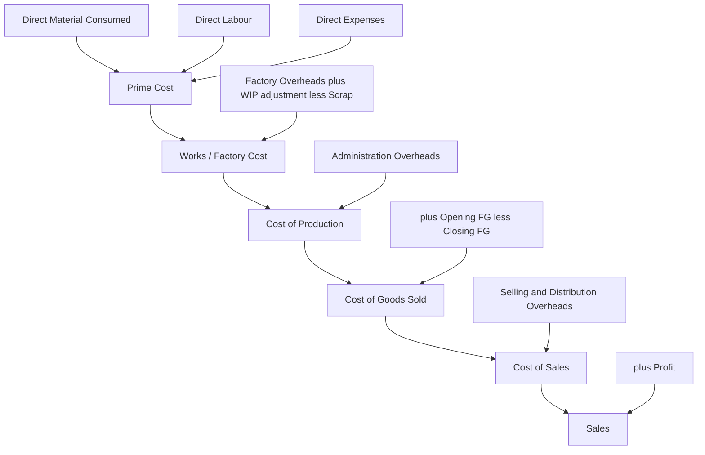
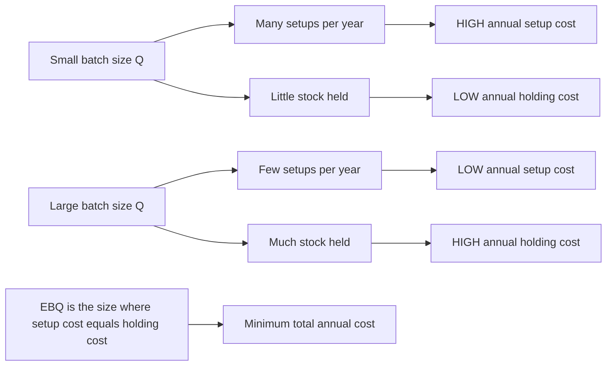

# Chapter 08 — Unit & Batch Costing

## 1. The Problem: "What did one thing cost me?"

Imagine you run a brick kiln. In one month you fired 4,00,000 bricks. Your accounts show you spent ₹18,00,000 on clay, coal, wages, kiln repairs, salaries, and office rent — all mixed together. Now a customer walks in and asks, "What is your price per thousand bricks?" and your banker asks, "Are you making money on each brick or bleeding on each one?"

You cannot answer either question from a heap of total expenses. You need one number: **cost per brick**. And the moment you try to compute it you discover the whole difficulty — some costs (clay, coal) rise directly with each brick, others (rent, manager's salary) do not move at all with output but still have to be *recovered* by the bricks, and some (packing, delivery) attach only after production. The problem of **unit costing** is precisely this: how do you take a pile of period costs incurred to make a stream of *identical* things, and honestly divide it so that each unit carries its fair share — no more, no less — and the total still reconciles back to what you actually spent?

Now change the business. You run a small printing press. You do not make an endless river of one identical item; you make **jobs that happen to repeat in groups**. A customer orders 5,000 identical wedding cards. Another orders 20,000 identical pharma cartons. Each order is a *batch* of identical pieces, but different batches are different products. Here a fresh problem appears that the brick kiln never had: **every time you start a new batch you must set up the machine** — clean the rollers, mount new plates, run test sheets, calibrate colour. That setup costs the same whether you then run 500 cards or 50,000 cards. So a new tension is born: run **big batches** and the setup cost is spread thin (good) but you sit on mountains of unsold inventory tying up cash and warehouse (bad); run **small batches** and inventory is lean (good) but you pay setup after setup after setup (bad). Somewhere between "one giant batch a year" and "a tiny batch every day" there is a batch size that costs the least. Finding it is the problem of the **Economic Batch Quantity (EBQ)**.

This chapter builds the two costing methods that answer these two questions — **Unit (Output/Single) Costing** for the brick kiln, and **Batch Costing** with **EBQ** for the printing press — and it builds each one only *after* you feel the problem it exists to solve.

---

## 2. The Core Idea: The Cake and the Cupcake Tray

Hold two pictures in your head.

**Unit costing is a single large cake.** One oven, one continuous bake, one homogeneous mass. You spent a known total on ingredients, gas, and the baker's time. To find "cost per gram" you simply divide total cost by total grams. There is no question of "which slice got more ingredients" because every gram of a well-mixed cake is identical to every other gram. **Homogeneity is what makes simple division legitimate.** If the output were a mix of a chocolate cake and a fruit cake, dividing total cost by total weight would be a lie — the chocolate would subsidise the fruit. Unit costing earns the right to divide only because the output is *one identical thing*.

**Batch costing is a cupcake tray.** You do not bake one endless cake; you bake **trays of 24 identical cupcakes**. Within a tray every cupcake is identical (so *inside* the tray you divide, just like the cake). But each tray is a distinct event: you greased and lined the tray, preheated, and cleaned up — a **setup** you pay once per tray regardless of whether the tray is full or half-empty. So batch costing is really **"unit costing inside the batch, job costing between batches"**: treat the whole batch as one job, accumulate all its costs, then divide by the number of good pieces in it.

And EBQ is the **cupcake-tray-size decision**. Bake giant trays rarely and you preheat seldom (low setup) but cupcakes go stale on the shelf (high holding). Bake tiny trays constantly and nothing goes stale (low holding) but you preheat all day (high setup). EBQ is the tray size where the money wasted on preheating exactly balances the money wasted on stale stock — the bottom of the total-cost valley. If that "trade-off between per-order cost and per-unit-held cost" feels familiar, it should: **EBQ is EOQ wearing a factory uniform.** EOQ (Chapter on Material Control) balanced *ordering* cost against *carrying* cost for buying; EBQ balances *setup* cost against *carrying* cost for making. Same maths, same valley, different words.

---

## 3. Why It's Built This Way

**Why does unit costing use a Cost Sheet and simple division rather than tracking each unit?** Because tracking each brick individually would cost more than the brick. When output is homogeneous and mass-produced, individuality carries *no information* — brick number 217,004 is identical in cost to brick number 89,431, so recording them separately is pure waste. The rational design is to accumulate cost by *period and process* and divide by *period output*. The Cost Sheet is engineered to do exactly this while preserving the classification the exam demands: Prime Cost → Works/Factory Cost → Cost of Production → Cost of Goods Sold → Cost of Sales, so that at every stage you can see cost per unit and answer pricing, valuation, and control questions.

**Why does batch costing refuse to divide the whole period's cost by the whole period's output?** Because the output is *not* homogeneous across the period — wedding cards and pharma cartons are different products with different materials and different setups. Dividing everything together would smear one product's cost onto another. So the design switch is: make the **batch** the cost-collection unit. Each batch gets its own cost record (materials + labour + a share of overheads + its own setup), and only *within* the batch — where pieces truly are identical — do we divide. Batch costing is deliberately a hybrid: it borrows job costing's discipline of "accumulate per job" and unit costing's convenience of "divide because identical," using each exactly where it is valid.

**Why is EBQ built on a square-root formula and not on "just guess a good size"?** Because the two costs pull in opposite directions and are *non-linear* in batch size. Annual setup cost falls as `1/Q` (bigger batch → fewer setups), while annual holding cost rises linearly as `Q/2` (bigger batch → more average stock). When one curve falls as `1/Q` and another rises as `Q`, their sum is a U-shape with a unique minimum, and calculus (or the AM-GM insight that the two costs are equal at the optimum) delivers a clean square-root answer. The formula is not arbitrary; it is the exact bottom of that valley. Building the decision on the formula means we never over- or under-batch by guesswork — we hit the least-cost size directly.

---

## 4. Full Technical Content

### 4.1 Unit (Output / Single) Costing — where it fits

Use unit costing when **a single homogeneous product is produced continuously or in a single process**, in large volume, so that a meaningful **cost per unit** exists. Classic industries: bricks, cement, steel, paper, sugar, flour milling, mining (coal/ore per tonne), quarrying, dairy, breweries, cotton textiles at yarn stage, and utilities (cost per unit of electricity). The defining feature: *all units are essentially identical, so total cost ÷ total units is honest.*

**The instrument is the Cost Sheet (Statement of Cost).** It is a memorandum statement (not a ledger account) that classifies and totals cost in stages. Learn the skeleton with its *reason at each stage*:

| Stage | What is added | Why this stage exists |
|---|---|---|
| **Prime Cost** | Direct Material Consumed + Direct Labour + Direct (Chargeable) Expenses | The costs traceable *directly* to the product — the irreducible core |
| **Works / Factory Cost** | Prime Cost + Factory Overheads (indirect factory costs) ± Opening/Closing WIP | Everything spent *inside the factory* to convert material into finished goods |
| **Cost of Production** | Works Cost + Administration Overheads (production-related) | Full cost of goods *produced* and put into finished-goods store |
| **Cost of Goods Sold (COGS)** | Cost of Production + Opening FG − Closing FG | Cost of only the units actually *sold* this period |
| **Cost of Sales** | COGS + Selling & Distribution Overheads | Total cost of getting the product *sold and delivered* |
| **Sales** | Cost of Sales + Profit | The selling value; profit is the balancing figure |

**Direct Material Consumed** — never assume it equals purchases:

```
Direct Material Consumed = Opening Stock of Raw Material
                         + Purchases + Carriage Inward − Returns
                         − Closing Stock of Raw Material
```

**Treatment of stock at three levels (a favourite exam distinction):**

- **Raw Material** stock adjusts *before* Prime Cost (to get material consumed).
- **Work-in-Progress (WIP)** stock adjusts at the *Factory/Works Cost* stage. WIP is valued at *factory cost* because it has absorbed material, labour and factory overheads but is not yet complete: `Works Cost = Gross Works Cost + Opening WIP − Closing WIP`.
- **Finished Goods** stock adjusts at the *Cost of Production* stage to reach COGS, and is valued at *cost of production per unit*.

**Treatment of scrap:** the sale value of normal scrap is deducted from factory overheads (or works cost). Abnormal scrap/loss cost is removed from the cost sheet and taken to Costing P&L — it must not inflate the good units' cost.

**Cost per unit** is computed at each relevant stage by dividing that stage's total by the number of units (units *produced* for cost of production; units *sold* for cost of sales).


*Figure 1 — The unit-costing cost sheet as a staged funnel, each stage adding one category of cost and answering one question.*

### 4.2 Batch Costing — where it fits

Use batch costing when **identical articles are produced in distinct lots/batches**, each lot being economically convenient to make together, but different lots may be different products or the same product made at different times. Classic industries: **pharmaceuticals** (a batch of 1,00,000 tablets), **biscuits/bakery**, **ready-made garments** (a batch of one size/design), **footwear**, **toys**, **component/spare-part manufacture**, **printing** (5,000 cards), **electronics** (a run of PCBs), **paints**, and **nuts-and-bolts**.

Batch costing is a **variant of job costing** in which the *batch* is the cost unit (the "job"). Mechanically:

```
Total Cost of a Batch = Direct Materials for the batch
                      + Direct Labour for the batch
                      + Setup / Machine set-up cost of the batch
                      + Overheads absorbed by the batch

Cost per unit in the batch = Total Cost of the Batch / Number of GOOD units in the batch
```

Note two exam-critical subtleties:
- **Setup cost is a per-batch cost**, incurred once no matter how many pieces are run — this is exactly what makes batch *size* matter and drives EBQ.
- If some units in the batch are **rejected/spoiled (normal)**, the good units absorb the whole batch cost, so you divide by *good* units, not total units started.

### 4.3 Economic Batch Quantity (EBQ) — the batch-size decision

**The trade-off, made precise.** Let a factory need `D` units of a product per year (annual demand/requirement). It makes them in batches of size `Q`.

- **Number of batches (setups) per year** = `D / Q`. Each setup costs `S`. So **annual setup cost = (D/Q) × S**. This *falls* as Q rises.
- **Average inventory held** = `Q / 2` (stock rises to Q when a batch is produced, then is drawn down to 0 before the next batch — average is half). Each unit costs `C` per year to hold (storage, insurance, interest on capital blocked, obsolescence). So **annual holding cost = (Q/2) × C**. This *rises* as Q rises.

Total relevant annual cost `T(Q) = (D/Q)·S + (Q/2)·C`. Setting the derivative to zero (or noting the minimum occurs where the two costs are equal) gives:

$$\textbf{EBQ} = \sqrt{\dfrac{2 \times D \times S}{C}}$$

where **D** = annual demand/production requirement, **S** = set-up cost per batch, **C** = holding (carrying) cost per unit per annum.

**Notice the exact parallel to EOQ:** replace "set-up cost per batch S" with "ordering cost per order O" and you have EOQ = √(2DO/C). EBQ is EOQ for *making* instead of *buying*. Everything you learned about EOQ — that at the optimum ordering cost equals carrying cost, that the total-cost curve is flat-bottomed (so small errors in Q barely raise cost) — transfers directly.

**Useful corollaries:**
- **Number of batches per year** = `D / EBQ`.
- **Batch cycle / interval** = `EBQ / D` (in years) or `(EBQ/D) × 12` months or `(EBQ/D) × 365` days.
- If `C` is given as a **percentage `i` of unit cost `p`**, then `C = i × p` and EBQ = √(2DS / (i·p)).
- **Holding-cost basis:** sometimes holding cost is charged on *average* inventory (Q/2) — the standard case above. Read the question: if it says "carrying cost per unit per annum," use C directly.


*Figure 2 — The two opposing pressures on batch size; EBQ sits where they balance.*

---

## 5. Worked Examples

### Example 1 — Unit Costing (easy): the brick kiln, made honest

*A brick works produced 4,00,000 bricks in June. Data: Raw material (clay etc.) consumed ₹6,00,000; Direct wages ₹3,20,000; Direct (chargeable) expenses ₹40,000; Factory overheads ₹2,40,000; Administration overheads ₹1,00,000; Selling & distribution overheads ₹60,000; Sale of scrap (normal) ₹40,000. All bricks produced were sold at ₹6 per brick. Prepare the cost sheet showing cost per 1,000 bricks and total profit.*

**Step 1 — Prime Cost.**
Prime Cost = 6,00,000 + 3,20,000 + 40,000 = **₹9,60,000**

**Step 2 — Works Cost** (add factory OH, deduct scrap sale).
= 9,60,000 + 2,40,000 − 40,000 = **₹11,60,000**

**Step 3 — Cost of Production** (add admin OH). Since all units produced are sold and there is no FG stock, Cost of Production = COGS.
= 11,60,000 + 1,00,000 = **₹12,60,000**

**Step 4 — Cost of Sales** (add S&D OH).
= 12,60,000 + 60,000 = **₹13,20,000**

**Step 5 — Sales and Profit.** Sales = 4,00,000 × ₹6 = ₹24,00,000. Profit = 24,00,000 − 13,20,000 = **₹10,80,000**.

| Particulars | Total (₹) | Per 1,000 bricks (₹) |
|---|---:|---:|
| Direct Material | 6,00,000 | 1,500 |
| Direct Wages | 3,20,000 | 800 |
| Direct Expenses | 40,000 | 100 |
| **Prime Cost** | **9,60,000** | **2,400** |
| Add Factory OH | 2,40,000 | 600 |
| Less Sale of Scrap | (40,000) | (100) |
| **Works Cost** | **11,60,000** | **2,900** |
| Add Administration OH | 1,00,000 | 250 |
| **Cost of Production / COGS** | **12,60,000** | **3,150** |
| Add Selling & Distribution OH | 60,000 | 150 |
| **Cost of Sales** | **13,20,000** | **3,300** |
| Profit | 10,80,000 | 2,700 |
| **Sales** | **24,00,000** | **6,000** |

**Reconciliation check:** per-1,000 cost of sales ₹3,300 × 400 (thousand-lots) = ₹13,20,000 ✓; profit ₹2,700 × 400 = ₹10,80,000 ✓; sales ₹6,000 × 400 = ₹24,00,000 ✓. Every column ties.

### Example 2 — Unit Costing (exam-hard): stock at all three levels

*Sunrise Steel makes one homogeneous product, MS Rods. For the year:*

- *Raw material — Opening ₹1,50,000; Purchases ₹22,00,000; Carriage inward ₹50,000; Closing ₹2,00,000.*
- *Direct wages ₹9,00,000; Direct expenses ₹1,00,000.*
- *Factory overheads = 60% of direct wages.*
- *Opening WIP ₹1,20,000; Closing WIP ₹1,80,000 (both at factory cost).*
- *Administration overheads (production related) ₹3,20,000.*
- *Opening finished goods 200 tonnes valued ₹5,00,000; Closing finished goods 300 tonnes (value to be computed at current cost of production per tonne).*
- *Units produced during the year: 2,000 tonnes.*
- *Selling & distribution overhead ₹200 per tonne sold. Profit is 20% on sales.*

*Prepare the cost sheet, value closing FG, and find the number of tonnes sold, total sales and profit.*

**Step 1 — Direct Material Consumed.**
= Opening + Purchases + Carriage − Closing
= 1,50,000 + 22,00,000 + 50,000 − 2,00,000 = **₹21,00,000**

**Step 2 — Prime Cost.**
= 21,00,000 + 9,00,000 (wages) + 1,00,000 (direct expenses) = **₹31,00,000**

**Step 3 — Gross Works Cost, then adjust WIP.**
Factory OH = 60% × 9,00,000 = ₹5,40,000.
Gross Works Cost = 31,00,000 + 5,40,000 = ₹36,40,000.
Works Cost = 36,40,000 + Opening WIP 1,20,000 − Closing WIP 1,80,000 = **₹35,80,000**

**Step 4 — Cost of Production** (add admin OH).
= 35,80,000 + 3,20,000 = **₹39,00,000** for 2,000 tonnes produced.
**Cost of production per tonne = 39,00,000 / 2,000 = ₹1,950/tonne.**

**Step 5 — Value closing FG and find COGS.**
Closing FG = 300 tonnes × ₹1,950 = ₹5,85,000.
COGS = Cost of Production + Opening FG − Closing FG
= 39,00,000 + 5,00,000 − 5,85,000 = **₹38,15,000**

**Step 6 — Tonnes sold.**
Tonnes sold = Opening FG (200) + Produced (2,000) − Closing FG (300) = **1,900 tonnes**.

**Step 7 — Cost of Sales.**
S&D OH = 1,900 × ₹200 = ₹3,80,000.
Cost of Sales = 38,15,000 + 3,80,000 = **₹41,95,000**

**Step 8 — Sales and Profit.** Profit is 20% on sales ⇒ cost is 80% of sales.
Sales = Cost of Sales / 0.80 = 41,95,000 / 0.80 = **₹52,43,750**.
Profit = Sales − Cost of Sales = 52,43,750 − 41,95,000 = **₹10,48,750** (which is 20% of 52,43,750 ✓).

| Particulars | Amount (₹) |
|---|---:|
| Opening Raw Material | 1,50,000 |
| Add Purchases | 22,00,000 |
| Add Carriage Inward | 50,000 |
| Less Closing Raw Material | (2,00,000) |
| **Direct Material Consumed** | **21,00,000** |
| Add Direct Wages | 9,00,000 |
| Add Direct Expenses | 1,00,000 |
| **Prime Cost** | **31,00,000** |
| Add Factory Overheads (60% of wages) | 5,40,000 |
| **Gross Works Cost** | **36,40,000** |
| Add Opening WIP | 1,20,000 |
| Less Closing WIP | (1,80,000) |
| **Works / Factory Cost** | **35,80,000** |
| Add Administration Overheads | 3,20,000 |
| **Cost of Production (2,000 tonnes)** | **39,00,000** |
| Add Opening Finished Goods (200 t) | 5,00,000 |
| Less Closing Finished Goods (300 t × ₹1,950) | (5,85,000) |
| **Cost of Goods Sold (1,900 t)** | **38,15,000** |
| Add Selling & Distribution OH (1,900 × ₹200) | 3,80,000 |
| **Cost of Sales** | **41,95,000** |
| Add Profit (20% on sales) | 10,48,750 |
| **Sales** | **52,43,750** |

**Reconciliation:** Cost of production per tonne ₹1,950 used consistently for closing stock and implicit in COGS; units flow 200 + 2,000 − 300 = 1,900 sold ✓; profit ₹10,48,750 ÷ sales ₹52,43,750 = 20.0% ✓. Statement fully reconciles.

### Example 3 — Batch Costing with EBQ (exam-hard, multi-part)

*Precision Pharma manufactures a tablet with an annual demand of 24,000 strips. Each machine set-up for a batch costs ₹1,200. The cost of holding one strip in stock is ₹4 per annum. Direct material per strip is ₹5, direct labour per strip is ₹3, and variable overhead is 100% of direct labour. Fixed production overhead is ₹96,000 per annum, absorbed on the basis of annual output. Required:*

*(a) The Economic Batch Quantity.*
*(b) Number of batches per year and the cycle time in days (assume 360 working days).*
*(c) The total cost per strip and the cost of one optimum batch.*
*(d) Show that at EBQ the annual set-up cost equals the annual holding cost, and compute total setup + holding cost. Then demonstrate why a batch of 4,000 strips is worse.*

**Part (a) — EBQ.**
EBQ = √(2DS / C) = √(2 × 24,000 × 1,200 / 4) = √(5,76,00,000 / 4) = √(1,44,00,000).

√(1,44,00,000) = √(1.44 × 10⁷) = 1,200 × √10... let me compute cleanly: 1,44,00,000 = 14,400,000. √14,400,000 = √(14.4 × 10⁶) = 1,000 × √14.4 = 1,000 × 3.7947 = **3,795 strips (approx.)**.

Let me verify by a cleaner factorisation: 2×24,000×1,200 = 5,76,00,000; ÷4 = 1,44,00,000. Now 3,795² = 14,402,025 ≈ 14,400,000 ✓. So **EBQ ≈ 3,795 strips** (we will use 3,795; some texts round to 3,800).

**Part (b) — Batches per year and cycle time.**
Number of batches = D / EBQ = 24,000 / 3,795 = **6.32 ≈ 6.3 batches per year** (in practice ~6 to 7).
Cycle time = (EBQ / D) × 360 = (3,795 / 24,000) × 360 = 0.15813 × 360 = **56.9 ≈ 57 days** between batches.

**Part (c) — Cost per strip and cost of one optimum batch.**
Per-strip variable production cost:
- Direct material ₹5
- Direct labour ₹3
- Variable overhead 100% of labour = ₹3
- Subtotal variable = **₹11 per strip**

Fixed production overhead per strip = 96,000 / 24,000 = ₹4 per strip.
**Total production cost per strip = 11 + 4 = ₹15.**

Cost of one optimum batch of 3,795 strips (production cost, excluding setup/holding which are period trade-off costs):
= 3,795 × ₹15 = **₹56,925** in production cost.
Adding this batch's own set-up cost ₹1,200: **batch cost including setup = ₹58,125**, i.e. ₹58,125 / 3,795 = **₹15.32 per strip** including its setup share.

**Part (d) — The balance at EBQ, and why 4,000 is worse.**

At EBQ = 3,795:
- Annual set-up cost = (D/Q)·S = (24,000 / 3,795) × 1,200 = 6.324 × 1,200 = **₹7,589**.
- Annual holding cost = (Q/2)·C = (3,795 / 2) × 4 = 1,897.5 × 4 = **₹7,590**.

These are equal (₹7,589 ≈ ₹7,590, tiny rounding) — exactly the hallmark of the optimum. **Total setup + holding = ₹15,179.**

Now test Q = 4,000:
- Set-up cost = (24,000 / 4,000) × 1,200 = 6 × 1,200 = ₹7,200.
- Holding cost = (4,000 / 2) × 4 = 2,000 × 4 = ₹8,000.
- Total = **₹15,200** — which is ₹21 *more* than at EBQ (₹15,179). So 4,000 is worse, confirming EBQ is the minimum.

Test Q = 3,000 to show the other side:
- Set-up = (24,000/3,000) × 1,200 = 8 × 1,200 = ₹9,600.
- Holding = (3,000/2) × 4 = ₹6,000.
- Total = **₹15,600** — also worse. The valley truly bottoms near 3,795.

| Batch size Q | Setup cost (D/Q)·S (₹) | Holding cost (Q/2)·C (₹) | Total (₹) |
|---:|---:|---:|---:|
| 3,000 | 9,600 | 6,000 | 15,600 |
| **3,795 (EBQ)** | **7,589** | **7,590** | **15,179** |
| 4,000 | 7,200 | 8,000 | 15,200 |
| 6,000 | 4,800 | 12,000 | 16,800 |

**Reconciliation / self-check:** at EBQ the two component costs are equal (the calculus condition), and total (₹15,179) is the lowest in the table — internally consistent. Note the flat bottom: moving from 3,795 to 4,000 costs only ₹21 extra, illustrating the EOQ/EBQ curve's insensitivity near the optimum. ✓

### Example 4 — Batch Costing with rejects (short, high-yield)

*A batch of 2,000 pistons was produced. Direct materials ₹1,80,000; direct labour ₹90,000; setup cost ₹6,000; overheads absorbed at 120% of direct labour. On inspection, 100 pistons were rejected as normal spoilage (nil scrap value). Find cost per good piston.*

**Working:**
- Overheads = 120% × 90,000 = ₹1,08,000.
- Total batch cost = 1,80,000 + 90,000 + 6,000 + 1,08,000 = **₹3,84,000**.
- Good units = 2,000 − 100 = **1,900**.
- **Cost per good piston = 3,84,000 / 1,900 = ₹202.11.**

**Why divide by good units?** Normal spoilage is an unavoidable cost of making the good ones; loading the whole ₹3,84,000 onto 1,900 survivors correctly makes each good piston bear its fair share of the spoilage. Dividing by 2,000 would understate cost and let spoilage vanish. ✓

---

## 6. Presentation / Format

**Unit-costing Cost Sheet — presentation rules the examiner rewards:**
1. **Title it** "Cost Sheet of ... for the period ended ...".
2. Use **two amount columns** when unit cost is asked — "Total (₹)" and "Cost per unit (₹)". Keep the per-unit column consistent (per unit *produced* down to cost of production; watch the switch to units *sold* below).
3. **Show sub-totals in bold** at each stage (Prime Cost, Works Cost, Cost of Production, COGS, Cost of Sales, Sales). Never skip a stage.
4. **Bracket deductions** (scrap sale, closing stocks) and label them "Less".
5. **State per-unit denominators** explicitly (e.g., "per 1,000 bricks", "2,000 tonnes produced").
6. Adjust each stock at its correct stage: RM before Prime Cost, WIP at Works Cost, FG at Cost of Production→COGS.

**Batch-costing statement — presentation:**

| Batch Cost Statement — Batch No. ___ | ₹ |
|---|---:|
| Direct Materials | xxx |
| Direct Labour | xxx |
| Set-up Cost | xxx |
| Overheads absorbed | xxx |
| **Total Batch Cost** | **xxx** |
| Good units in batch | (n) |
| **Cost per unit = Total ÷ Good units** | **xxx** |

**EBQ answer presentation:** always (i) write the formula, (ii) substitute D, S, C with units, (iii) compute, (iv) round sensibly to whole units, then (v) if asked, derive batches per year and cycle time, and (vi) verify by showing setup cost ≈ holding cost at EBQ.

---

## 7. Connections

- **← Material Control (EOQ):** EBQ *is* EOQ with "set-up cost" swapping in for "ordering cost." Every EOQ property — the √ formula, equality of the two costs at optimum, the flat-bottomed curve, treatment of holding cost as % of unit cost — carries over. If you can do EOQ, EBQ is free.
- **↔ Job Costing (next family):** Batch costing is a *special case of job costing* where the job is a batch of identical units. Job costing accumulates cost per job; batch costing then divides by units — the extra step unit costing also uses. Unit → Batch → Job form a spectrum from "fully homogeneous" to "fully bespoke."
- **↔ Process Costing:** Both unit costing and process costing handle homogeneous mass output; unit/output costing is essentially *single-process* costing. When production passes through *several sequential processes* (sugar, chemicals), you graduate to process costing with equivalent units — but the divide-cost-by-output logic is the same seed.
- **→ Overhead absorption:** The "factory OH = x% of wages" and "overheads at y% of labour" steps come straight from the Overheads chapter's absorption rates; unit/batch costing is where you *apply* them.
- **→ Cost control & pricing:** Cost per unit/batch feeds directly into quotation, tender pricing, inventory valuation for the balance sheet, and make-or-buy decisions.

---

## 8. Traps & Examiner Tricks

1. **Purchases ≠ Material Consumed.** Always adjust opening/closing raw-material stock and add carriage inward. Forgetting this is the single most common slip.
2. **Wrong stock stage.** WIP is adjusted at *Works Cost*, not before Prime Cost; Finished Goods at *Cost of Production → COGS*, not at Works Cost. Mixing these corrupts every subtotal below.
3. **Valuing closing FG at the wrong rate.** Closing finished goods must be valued at the *current year's cost of production per unit*, not at selling price and not at last year's rate (unless the question specifies FIFO/weighted average with opening data).
4. **Units produced vs units sold.** Cost of production divides by units *produced*; cost of sales and profit relate to units *sold*. In Example 2, 2,000 produced but only 1,900 sold — using the wrong denominator wrecks per-unit figures.
5. **"Profit on cost" vs "profit on sales."** 20% on sales ⇒ cost = 80% of sales ⇒ Sales = Cost/0.80. 20% on cost ⇒ Sales = Cost × 1.20. The examiner switches these deliberately.
6. **Scrap treatment.** *Normal* scrap sale is deducted from works/factory cost; *abnormal* loss goes to Costing P&L and must not touch the cost sheet. Don't deduct abnormal items from cost.
7. **Administration overhead placement.** Production-related admin OH sits in Cost of Production; general admin OH is sometimes treated as a period cost between COGS and Cost of Sales. Follow the question's classification.
8. **EBQ — holding-cost basis.** If holding cost is given as a % of unit *cost*, compute C = i × p first. If given directly as ₹ per unit p.a., use it as-is. Halving inventory (Q/2) is already built into the formula — do not halve again.
9. **EBQ — set-up vs ordering vocabulary.** In EBQ the "S" is *set-up* cost per batch (a production cost), not ordering cost. Read the numbers, not the label.
10. **Dividing a batch by total units instead of good units.** With normal rejects, divide by *good* units (Example 4). Dividing by units started understates cost per good unit.
11. **Rounding EBQ then contradicting it.** Round EBQ to whole units, but when you then show "setup cost ≈ holding cost," expect a ₹1–₹2 gap purely from rounding — that is fine; do not "force" them equal by fudging.

---

## 9. First-Principles Recap

Strip everything away and two ideas remain.

**One:** *Division is only honest between identical things.* When output is a homogeneous mass (bricks, tonnes, litres, kWh), you may take the pile of period costs and divide by output — that is **unit costing**, and the Cost Sheet is merely a disciplined way to do that division stage by stage so each cost category is recovered and the total reconciles. When output comes in *identical lots but different products*, you first accumulate cost per **lot/batch** (because lots are not identical to each other) and only then divide *within* the lot (because pieces inside it are identical) — that is **batch costing**, a hybrid of job and unit costing.

**Two:** *Whenever a fixed cost is triggered per event, the size of the event is a decision.* Making a batch triggers a fixed **set-up cost** regardless of batch size, while holding stock costs money proportional to size. Big batches waste setup less but waste holding more; small batches the reverse. The least-cost size is where the two wastes are equal — the square-root **EBQ = √(2DS/C)**. It is the same trade-off as EOQ because it is the same *shape* of problem: a `1/Q` cost fighting a `Q` cost always bottoms at a √ point.

Master those two sentences and you can *reconstruct* every formula and format in this chapter from scratch — no memorisation required.

---

## 10. Quick-Revision Sheet

**When to use:**
- **Unit / Output costing** → single homogeneous product, mass/continuous production (bricks, cement, steel, sugar, power). Answer wanted: **cost per unit**.
- **Batch costing** → identical articles made in distinct lots (pharma, bakery, garments, printing, components). Answer wanted: **cost per unit within a batch** + optimum **batch size**.

**Cost Sheet stages (memorise the ladder):**
Prime Cost → (+Factory OH ±WIP −Normal scrap) Works Cost → (+Admin OH) Cost of Production → (±FG stock) COGS → (+S&D OH) Cost of Sales → (+Profit) Sales.

**Key formulas:**
- Direct Material Consumed = Opening RM + Purchases + Carriage In − Returns − Closing RM
- Works Cost = Gross Works Cost + Opening WIP − Closing WIP
- COGS = Cost of Production + Opening FG − Closing FG
- Units sold = Opening FG + Produced − Closing FG
- Profit on sales p%: Sales = Cost of Sales / (1 − p); Profit on cost p%: Sales = Cost × (1 + p)
- **Batch cost per unit = Total batch cost / Good units**
- **EBQ = √(2 D S / C)**  (D = annual demand, S = set-up cost/batch, C = holding cost/unit/annum; if C = i% of price p, use C = i·p)
- Batches/year = D / EBQ; Cycle = (EBQ/D) × 360 days (or ×12 months)
- At EBQ: annual set-up cost = annual holding cost

**Stock adjustment stages:** RM → before Prime Cost; WIP → at Works Cost (valued at factory cost); FG → at Cost of Production (valued at cost of production/unit).

**Top 5 traps:** (1) purchases ≠ consumed; (2) WIP at Works, FG at COGS — not swapped; (3) closing FG at current cost of production; (4) produced-vs-sold denominator; (5) profit on sales vs on cost.

**EBQ ↔ EOQ:** identical formula; set-up cost replaces ordering cost; curve is flat-bottomed so near-optimum errors are cheap; at optimum the two opposing costs are equal.
