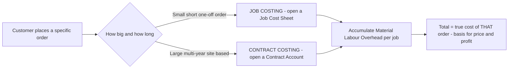
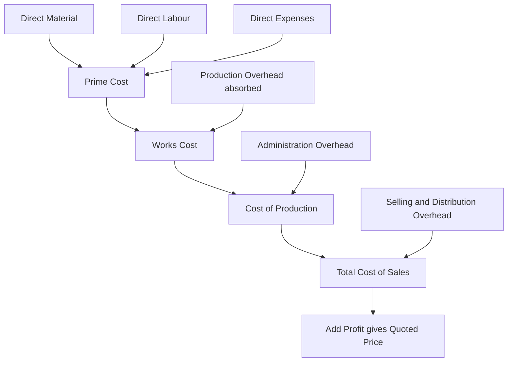
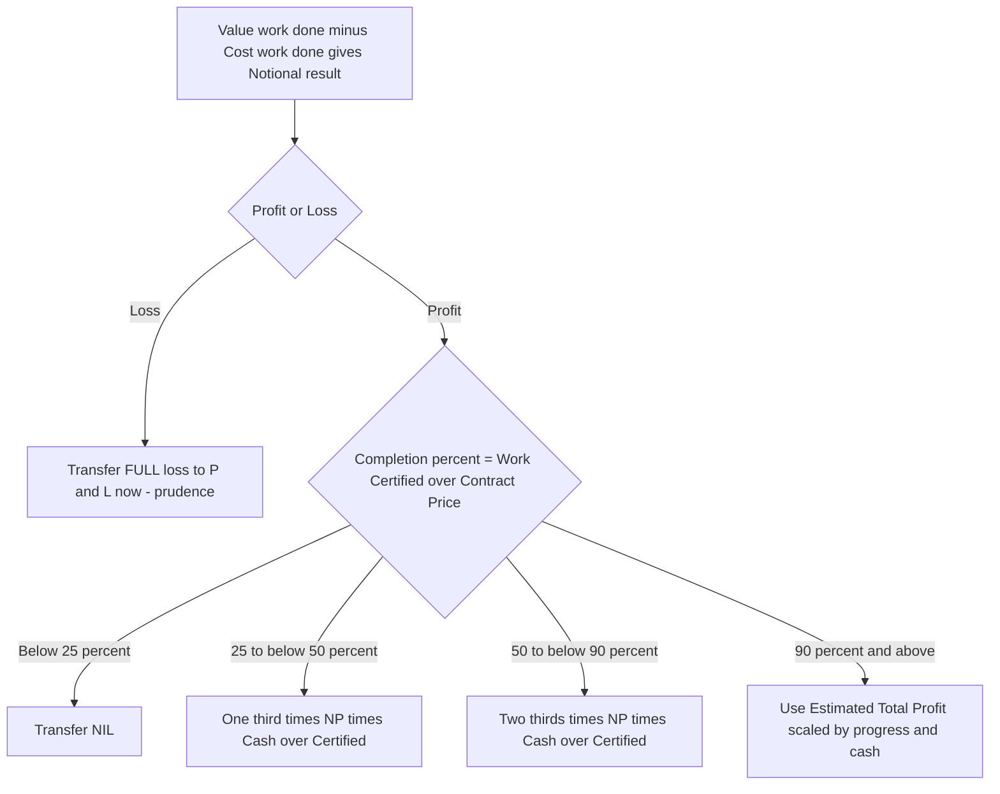

# Chapter 09 — Job & Contract Costing

## 1. The Problem: When "Average Cost Per Unit" Becomes a Lie

Imagine two factories.

The first is a sugar mill. Cane goes in one end; identical bags of sugar come out the other. Every kilo is indistinguishable from every other kilo. If the mill spent ₹50,00,000 this month and produced 10,00,000 kg, the cost per kg is ₹5. Clean. Honest. This is the world of **process/unit costing** (Chapter 10's territory).

The second is a printing press. On Monday it prints 5,000 wedding cards on gold-foil stock. On Tuesday it prints 2,00,000 election pamphlets on cheap newsprint. On Wednesday it prints a 400-page hardcover annual report. If you spent ₹8,00,000 this week producing "3 jobs," what is your "cost per job"? ₹2,66,666 each? That number is **meaningless and dangerous**. It would tell you the wedding cards and the pamphlets cost the same — so you'd quote the same price and lose money on one while overcharging on the other.

The core problem: **when output is heterogeneous — each unit or batch is different, made to a specific customer's order — averaging destroys information.** The manager cannot answer the only questions that matter:

- What did *this specific order* actually cost me?
- Did I make or lose money on the Sharma wedding job?
- What should I quote the next customer who walks in with a similar request?

And there is a harder, second-order version of this problem. Consider a company building the Bandra–Worli sea link. That single "job" takes **four years**. Money pours out continuously — steel, concrete, labour, cranes — but the customer pays in stages, and the profit isn't "realised" until… when? Do you show zero profit for three years and then a giant lump in year four (which is absurd — the work *was* being done and value *was* being created)? Or do you book profit every year (which is dangerous — the contract could still go wrong)?

This chapter builds the two costing systems that solve exactly these problems:

- **Job Costing** — for heterogeneous, customer-specific work where each order is a distinct cost object.
- **Contract Costing** — job costing scaled up for *large, long-duration* jobs, plus the special machinery to answer the "how much profit dare I recognise on an unfinished contract?" question.

Everything else in this chapter — the job cost sheet, the contract account, work certified, retention money, notional profit, the prudence formulas — is machinery invented to answer those questions honestly.

---

## 2. The Core Idea: A Separate Wallet for Every Order

Here is the entire concept in one image.

In process costing you have **one big bucket**. All costs flow in; you divide by units at the end.

In job costing you have **a wallet for every order**. The moment a customer places an order, you staple a fresh envelope to the wall and write a job number on it. Every rupee of material, every hour of labour, every slice of overhead that this order consumes gets dropped into *that envelope*. When the job ships, you empty the envelope, total it, and that total is the true cost of that job — no averaging, no contamination from other orders.

> **Analogy — the restaurant bill.** A canteen with a fixed thali is process costing: one price, everyone pays the same. A à-la-carte restaurant is job costing: the waiter opens a fresh **bill (KOT)** for your table, and *only your dishes* go on it. My paneer tikka does not subsidise your biryani. The bill *is* the job cost sheet.

**Contract costing is the same envelope idea — but the envelope is so big it becomes its own ledger account.** A four-year bridge doesn't get a slip of paper; it gets a full **Contract Account** in the books, opened on day one and kept alive across accounting years until the bridge is handed over. Because it straddles multiple year-ends, we must pause each March and ask: "of the profit sitting in this envelope so far, how much is *safe* to take to the P&L?"

That single question — **how to slice profit off an unfinished, uncertain, long job without lying to shareholders** — is what makes contract costing conceptually rich. The rest is bookkeeping.


*Figure 1 — The decision that selects the method: heterogeneity plus scale/duration.*

---

## 3. Why It's Built This Way

Before a single formula, understand the *design logic*. Every feature exists to protect a specific truth.

**Why a separate cost object per order?** Because the customer is buying *this* thing, not an average of things. Pricing, profitability analysis, and quoting all collapse if you can't isolate one order's cost. So the whole system is built around a **unique identifier** (job number / contract number) that acts like a bank account number — everything tagged to it, nothing leaking.

**Why does contract costing need extra machinery that job costing doesn't?** Three physical facts about big contracts force it:

1. **They cross accounting years.** A one-week print job starts and finishes inside one period — recognise profit when done, no drama. A bridge doesn't. Accounting demands we report profit *annually*, but the job isn't finished annually. Conflict → we need a rule for interim profit.
2. **Most costs are direct.** On a construction site, nearly everything — labour, plant hired to the site, site supervisor's salary, materials delivered to the gate — is *directly* traceable to that one contract. So contract costing has **very little overhead apportionment** and instead obsesses over site-level direct cost control. This is why the contract account looks "purer" than a job cost sheet.
3. **The customer controls payment through certification.** The client's architect/surveyor **certifies** how much work is genuinely done, pays a percentage of that, and *holds back the rest* (retention) as a hostage against defects. This external, cautious valuation becomes the anchor for how much revenue — and therefore profit — we're allowed to recognise.

**Why prudence (caution) dominates profit recognition?** Because an unfinished contract is a *promise*, not a fact. Steel prices could spike, the ground could flood, the client could dispute quality, penalties could bite. If you booked the full apparent profit each year and the contract later soured, you'd have paid dividends and tax on profit that evaporated. Accounting's **prudence concept** says: *anticipate no profit, but provide for all losses.* So the machinery deliberately recognises **only a fraction** of the profit earned so far, keeping the rest as a cushion — and the *less complete and less certain* the contract, the *smaller* that fraction. That single principle generates every profit-transfer formula you'll memorise.

Hold that thought — "the fraction shrinks with uncertainty" — and the formulas in Part 4 will feel inevitable rather than arbitrary.

---

## 4. Full Technical Content

### 4A. Job Costing — the mechanics

**Definition.** Job costing is a method where costs are accumulated and ascertained for each **job / work order / lot**, which is treated as a distinct cost unit. Used by: printers, machine-tool makers, foundries, repair garages, ship repair, interior contractors, advertising agencies, made-to-order furniture, engineering fabricators.

**The three cost elements per job:**

| Element | How captured | Source document |
|---|---|---|
| Direct Materials | Materials issued against the job number | Material Requisition Note / Bill of Materials |
| Direct Labour | Hours booked to the job × wage rate | Job Time Ticket / Time Sheet |
| Direct Expenses | Special tools, hired equipment, sub-contract for that job | Invoices tagged to job |
| Production Overhead | Absorbed using a predetermined rate (e.g., ₹/labour-hr, % of wages, machine-hr rate) | Overhead absorption (see Ch. on Overheads) |

**The Job Cost Sheet** is the beating heart — one per job:

```
Prime Cost      = Direct Material + Direct Labour + Direct Expenses
Works/Factory Cost = Prime Cost + Production (Works) Overhead
Cost of Production = Works Cost + Administration Overhead
Total Cost / Cost of Sales = Cost of Production + Selling & Distribution Overhead
Price to customer = Total Cost + Profit (or Total Cost + markup %)
```

**Integration with the ledger (WIP control):** In an integrated accounting system, each job is a sub-account of **Work-in-Progress Control**. Journal logic:

- Materials issued to job: `Dr WIP Control / Cr Stores Ledger Control`
- Direct wages: `Dr WIP Control / Cr Wages Control`
- Overhead absorbed: `Dr WIP Control / Cr Production OH Control`
- Job completed: `Dr Finished Goods (or Cost of Sales) / Cr WIP Control`

Over/under-absorption of overhead is dealt with separately (see Overheads chapter) — the job carries *absorbed* (predetermined) overhead, not actual.

> **Batch Costing — a first cousin.** When identical articles are produced in *batches* (e.g., 10,000 identical pharma tablets, or 500 identical bolts), the *batch* is the job. Cost per unit = Total batch cost ÷ units in batch. This is where the **Economic Batch Quantity (EBQ)** appears:
>
> **EBQ = √(2 × D × S ÷ C)**
> where D = annual demand, S = set-up cost per batch, C = carrying cost per unit per year.
>
> It's identical in spirit to the EOQ formula — trade off set-up cost (favours big batches) against carrying cost (favours small batches). Batch costing = job costing applied to a group of identical units.


*Figure 2 — Build-up of the job cost sheet from prime cost to quoted price.*

### 4B. Contract Costing — the mechanics

Contract costing is job costing for **large, site-based, long-duration** jobs. Same DNA (accumulate costs against a unique number), but with its own vocabulary and its own profit rule.

**The Contract Account** is a running account for each contract. Broadly:

**Debit side (costs incurred to date):**
- Materials issued / purchased for site
- Direct wages (incl. accrued/outstanding wages)
- Direct expenses
- Plant & machinery sent to site (or depreciation on plant — see below)
- Sub-contract costs
- Cost of extra/additional work
- Apportioned share of head-office overhead (small)

**Credit side (values and closing positions):**
- Material returned to stores / transferred / at site (closing)
- Plant at site (closing WDV) if plant was debited at cost
- **Work-in-Progress: Work Certified + Work Uncertified** (the big one)

The balancing figure is **Notional Profit** (or loss) to date.

#### Key vocabulary — and why each exists

**Contract Price** — the total agreed price for the whole job. This is *not* revenue-to-date; it's the finish line.

**Work Certified** — the value (at contract/selling price) of work the client's architect/surveyor has **inspected and approved** to date. This is an *independent, cautious* measure of progress, expressed in *price* terms (it includes profit). It's the anchor for everything.

**Work Uncertified** — work physically done but *not yet* certified (too recent, or below a certification milestone). It's carried at **cost** (no profit), prudently, because the client hasn't blessed it yet.

**Retention Money** — the client pays only a percentage of work certified (say 80–90%) and **retains the balance** for a defects-liability period. 
- **Cash received = Work Certified × (1 − retention %)**
- Retention money = Work Certified − Cash received.
*Why it exists:* it's the client's insurance. If defects appear, they fix them out of the retained sum. For us, it means even *certified* revenue isn't fully in hand — a second reason for caution.

**Notional Profit** — the *apparent* profit to date, before applying prudence:

> **Notional Profit = (Work Certified + Work Uncertified) − Cost of work done to date**
>
> Equivalently: **Value of Work Done − Cost of Work Done**, where Value of Work Done = Work Certified + Work Uncertified, and Cost of Work Done = costs incurred to date *less* the cost of materials/plant remaining at site (i.e., only cost *consumed* in the work certified + uncertified).

It's called *notional* precisely because we are **not** going to take all of it — prudence forbids.

**Estimated Total Profit** — used when the contract is near completion and reliable estimates of remaining cost exist:

> **Estimated Total Profit = Contract Price − (Costs to date + Estimated additional costs to complete)**

**Plant treatment — two methods:**
- **Method 1 (short contracts / plant temporarily at site):** Debit contract with *cost of plant*; credit *closing WDV of plant at site*. The difference (= depreciation) is effectively the cost charged.
- **Method 2 (long contracts):** Debit contract only with **depreciation** on plant for the period. Cleaner for multi-year contracts.

### 4C. The Heart of the Chapter — How Much Profit Dare We Recognise?

This is *the* examinable idea. The rule scales the recognised profit to the **degree of completion** and the **certainty** of the outcome. Degree of completion is measured as:

> **% of completion = Work Certified ÷ Contract Price × 100**

Now the prudence ladder — memorise the *logic*, and the formulas write themselves. **The less complete the contract, the smaller the fraction of notional profit you keep; and always further discount by cash actually received (retention risk).**

**Stage 1 — Completion is trivially small (less than 25%):**
> **Transfer NIL profit.** Take nothing. The outcome is too uncertain to trust any profit. (Some texts say "less than 25%".)

**Stage 2 — Completion ≥ 25% but < 50%:**
> **Profit to P&L = ⅓ × Notional Profit × (Cash Received ÷ Work Certified)**

**Stage 3 — Completion ≥ 50% but < 90% (the standard case):**
> **Profit to P&L = ⅔ × Notional Profit × (Cash Received ÷ Work Certified)**

**Stage 4 — Completion ≥ 90% (near completion) — switch to Estimated Total Profit basis.** Now the outcome is reasonably certain, so we use the *whole-contract* estimate, scaled by progress. Any of these formulas (whichever the question specifies / provides data for):

> (a) Estimated Profit × (Work Certified ÷ Contract Price)
> (b) Estimated Profit × (Work Certified ÷ Contract Price) × (Cash Received ÷ Work Certified) = Estimated Profit × (Cash Received ÷ Contract Price)
> (c) Estimated Profit × (Cost of Work to Date ÷ Estimated Total Cost)
> (d) Estimated Profit × (Cost of Work to Date ÷ Estimated Total Cost) × (Cash Received ÷ Work Certified)

**Why the two recurring multipliers?**
- The **⅓ or ⅔ fraction** = a blunt prudence haircut that grows more generous as completion rises (more done → more trust → keep a bigger share).
- The **(Cash Received ÷ Work Certified)** factor = a *second* haircut for retention risk: you can only bank profit proportionate to cash you've actually collected, not cash the client is holding back.

**Loss rule — asymmetric on purpose.** Prudence says *provide for all losses immediately and in full.* If the contract shows a **notional loss**, transfer the **entire loss** to the P&L now, regardless of completion %. If it's a small contract expected to end in loss, provide the whole foreseeable loss. No fractions, no cash-ratio softening for losses. This asymmetry (fraction the profits, full the losses) IS the prudence concept in action.


*Figure 3 — The prudence decision tree for profit on incomplete contracts.*

**Where does the un-recognised profit go?** It stays inside the contract as a **reserve/provision**, shown by *reducing WIP* in the Balance Sheet:

> **WIP on Balance Sheet = (Work Certified + Work Uncertified) − Profit taken to P&L − Cash received (i.e., less advances)**
>
> Common presentation: Balance Sheet WIP = Cost of work done + Profit recognised − Cash received. The reserve = Notional Profit − Profit recognised.

### 4D. Escalation Clause — pricing insurance against inflation

On a multi-year contract at a *fixed* price, the contractor bears a brutal risk: what if cement, steel, and wages *rise* over four years? He'd be locked into yesterday's price with tomorrow's costs. The **escalation clause** is the contractual answer.

**Escalation clause:** a term allowing the contract price to be **increased** if prices of specified materials / labour / utilities rise beyond an agreed base level. It protects the *contractor*. (The mirror image, a **de-escalation clause**, reduces the price if input costs *fall* — protecting the *client*.)

**Mechanism (standard exam form):** The claim is computed on the **agreed/standard consumption** at the base rate vs actual rate — *not* on actual (wasteful) consumption, so the contractor can't pass on his own inefficiency.

> **Escalation claim = Σ [ Standard Qty allowed × (Actual Rate − Base Rate) ]**

Only *rate* increases on the *standard quantity* are claimable. Extra quantity used due to the contractor's own waste is *not* reimbursed — that would reward inefficiency.

---

## 5. Worked Examples (fully reconciled)

### Example 1 — Job Costing (easy): Building a quotation

*Vishwakarma Fabricators received an enquiry for a custom steel gate (Job J-217). Estimate the price at 20% profit on selling price.*

Data: Direct material ₹40,000; Direct labour 300 hrs @ ₹50/hr; Direct expense (special powder-coating hire) ₹6,000. Works overhead absorbed @ ₹30 per labour hour. Administration overhead @ 10% of works cost. Selling & distribution overhead @ 5% of works cost.

**Job Cost Sheet — J-217**

| Particulars | Working | ₹ |
|---|---|---|
| Direct Material | | 40,000 |
| Direct Labour | 300 × 50 | 15,000 |
| Direct Expenses | | 6,000 |
| **Prime Cost** | | **61,000** |
| Works Overhead | 300 × 30 | 9,000 |
| **Works Cost** | | **70,000** |
| Administration OH | 10% × 70,000 | 7,000 |
| **Cost of Production** | | **77,000** |
| Selling & Distribution OH | 5% × 70,000 | 3,500 |
| **Total Cost** | | **80,500** |
| Profit | see below | 20,125 |
| **Selling Price (Quotation)** | | **1,00,625** |

*Profit on selling price* means Cost = 80% of price → Price = 80,500 ÷ 0.80 = **₹1,00,625**; Profit = 1,00,625 − 80,500 = **₹20,125**. 
*Check:* 20,125 ÷ 1,00,625 = 20.0% ✓ (profit is exactly 20% of selling price). Reconciled.

### Example 2 — Contract, standard 50–90% case with retention

*Konkan Constructions began Contract No. 88 (contract price ₹40,00,000) on 1 April 2025. Position at 31 March 2026:*

| Item | ₹ |
|---|---|
| Materials issued to site | 10,00,000 |
| Direct wages paid | 8,00,000 |
| Outstanding wages (accrued) | 50,000 |
| Direct expenses | 1,20,000 |
| Plant sent to site (at cost) | 5,00,000 |
| Site (head office) overhead apportioned | 80,000 |
| Materials at site (closing, unused) | 1,00,000 |
| Work Certified | 24,00,000 |
| Work Uncertified (at cost) | 60,000 |
| Cash received (85% of work certified) | 20,40,000 |

Depreciation on plant: charge at 20% p.a. (so closing plant WDV = 5,00,000 − 1,00,000 = ₹4,00,000).

**Step 1 — Contract Account (Method 1: plant at cost in, WDV out).**

| Dr — Particulars | ₹ | Cr — Particulars | ₹ |
|---|---|---|---|
| To Materials | 10,00,000 | By Materials at site c/d | 1,00,000 |
| To Wages (8,00,000+50,000) | 8,50,000 | By Plant at site c/d (WDV) | 4,00,000 |
| To Direct expenses | 1,20,000 | By Work-in-Progress: | |
| To Plant (at cost) | 5,00,000 |   Work Certified | 24,00,000 |
| To Site overhead | 80,000 |   Work Uncertified | 60,000 |
| **To Notional Profit c/d** | **4,10,000** | | |
| **Total** | **29,60,000** | **Total** | **29,60,000** |

*Check the balance:* Debits of cost = 10,00,000+8,50,000+1,20,000+5,00,000+80,000 = 25,50,000. Credits (excl. profit) = 1,00,000+4,00,000+24,00,000+60,000 = 29,60,000. Notional Profit = 29,60,000 − 25,50,000 = **₹4,10,000.** ✓

*Interpretation:* Cost of work done = 25,50,000 − (1,00,000 + 4,00,000 closing balances) = 20,50,000. Value of work done = 24,00,000 + 60,000 = 24,60,000. NP = 24,60,000 − 20,50,000 = **4,10,000** ✓ (both routes agree — reconciled).

**Step 2 — Degree of completion.** = Work Certified ÷ Contract Price = 24,00,000 ÷ 40,00,000 = **60%.** → Falls in the **50%–90% band → ⅔ rule.**

**Step 3 — Profit to transfer to P&L.**
> = ⅔ × Notional Profit × (Cash Received ÷ Work Certified)
> = ⅔ × 4,10,000 × (20,40,000 ÷ 24,00,000)
> = ⅔ × 4,10,000 × 0.85
> = **₹2,32,333** (rounded).

Cash ratio = 20,40,000 ÷ 24,00,000 = 0.85 ✓ (matches the stated 85%).

**Step 4 — Profit kept as reserve** = 4,10,000 − 2,32,333 = **₹1,77,667.**

**Step 5 — Balance Sheet WIP figure.**
> WIP = (Work Certified + Work Uncertified) − Reserve − Cash received
> = 24,60,000 − 1,77,667 − 20,40,000 = **₹2,42,333.**

*Reconciliation of WIP another way:* Cost of work done 20,50,000 + Profit recognised 2,32,333 − Cash received 20,40,000 = **2,42,333** ✓. Both methods agree — fully reconciled.

### Example 3 — Contract near completion (≥90%), estimated-profit basis, with a twist

*Sahyadri Infra's Contract "Ghat Road" has a contract price of ₹1,00,00,000. As on 31 March 2026:*

| Item | ₹ |
|---|---|
| Cost incurred to date | 75,00,000 |
| Estimated further cost to complete | 5,00,000 |
| Work Certified | 92,00,000 |
| Work Uncertified (cost) | 2,00,000 |
| Cash received (75% of certified) | 69,00,000 |

**Step 1 — Completion %** = 92,00,000 ÷ 1,00,00,000 = **92% → ≥90% → Estimated Total Profit basis.**

**Step 2 — Estimated Total Profit.**
> = Contract Price − (Cost to date + Estimated cost to complete)
> = 1,00,00,000 − (75,00,000 + 5,00,000) = **₹20,00,000.**

**Step 3 — Notional profit to date** (for reference / reserve): Value of work done = 92,00,000 + 2,00,000 = 94,00,000; Cost of work done ≈ 75,00,000 (all incurred cost consumed here). NP = 94,00,000 − 75,00,000 = **₹19,00,000.**

**Step 4 — Profit to P&L using the standard "cash-adjusted, certified/price" formula (b):**
> = Estimated Profit × (Work Certified ÷ Contract Price) × (Cash Received ÷ Work Certified)
> = Estimated Profit × (Cash Received ÷ Contract Price)
> = 20,00,000 × (69,00,000 ÷ 1,00,00,000)
> = 20,00,000 × 0.69 = **₹13,80,000.**

*Cross-check with formula (a) — no cash adjustment:* 20,00,000 × (92,00,000 ÷ 1,00,00,000) = 20,00,000 × 0.92 = ₹18,40,000. Cash-adjusted answer (₹13,80,000) is the more prudent one; unless the question specifies otherwise, present the cash-adjusted figure and note the alternative. 

*Cross-check with cost basis (c):* 20,00,000 × (75,00,000 ÷ 80,00,000) = 20,00,000 × 0.9375 = ₹18,75,000. These alternatives are shown only to demonstrate that the *method chosen must match the data/instruction given* — a classic exam decision point.

**Step 5 — Reserve** (using formula b) = Notional profit 19,00,000 − 13,80,000 = **₹5,20,000** held back as cushion for the final 8% and the retained ₹23,00,000 (92,00,000 − 69,00,000) not yet received. Reconciled.

### Example 4 — Escalation clause (exam-hard, self-contained)

*Deccan Builders took a 3-year contract with an escalation clause covering steel and cement. Base rates: steel ₹50/kg, cement ₹350/bag. Agreed (standard) consumption for the certified work: steel 2,00,000 kg, cement 40,000 bags. During execution, actual rates rose to steel ₹58/kg and cement ₹380/bag. Actual consumption was steel 2,10,000 kg (10,000 kg extra due to site wastage) and cement 39,000 bags. Compute the escalation claim.*

**Principle:** claim only the *rate rise* on the *standard (agreed) quantity*. Do not reward the contractor's 10,000 kg wastage; do not penalise on cement where he used less.

| Material | Std Qty | Rate rise (Actual − Base) | Claim ₹ |
|---|---|---|---|
| Steel | 2,00,000 kg | 58 − 50 = ₹8 | 16,00,000 |
| Cement | 40,000 bags | 380 − 350 = ₹30 | 12,00,000 |
| **Total escalation claim** | | | **28,00,000** |

*Why standard qty for steel, not 2,10,000?* Because reimbursing 2,10,000 × 8 = ₹16,80,000 would make the client pay ₹80,000 for the contractor's own wastage — the clause insures against *price* movement, not *inefficiency*. Claim = **₹28,00,000**, added to the contract price. Reconciled to principle.

---

## 6. Presentation / Format (what the examiner wants to see)

**Job cost sheet:** always vertical, building Prime → Works → Production → Total → Price, with a working column. Show the profit basis (on cost vs on sales) explicitly.

**Contract Account:** a proper **T-account**, dated, with:
- Debit: all costs (remember *outstanding wages*, *depreciation or plant-at-cost*).
- Credit: closing materials at site, closing plant WDV, and **WIP = Work Certified + Work Uncertified**.
- Balancing figure clearly labelled **"Notional Profit c/d"** (or Loss).

**Below the account, always show three explicit workings:**
1. **% completion** = Work Certified ÷ Contract Price (state which band → which formula).
2. **Profit transferred to P&L** — write the formula, then substitute.
3. **Balance Sheet extract:**

| Balance Sheet (extract) | ₹ |
|---|---|
| Work-in-Progress: Work Certified + Uncertified | XXX |
| Less: Reserve (profit not recognised) | (XX) |
| Less: Cash received / Advance from client | (XX) |
| **WIP (net) shown under Current Assets** | **XX** |

Plus: Materials at site and Plant at site (WDV) shown as assets; Accrued wages as a liability.

**Profit & Loss transfer:** state the recognised profit figure and, separately, the reserve carried forward. Round to the nearest rupee and state your rounding.

---

## 7. Connections (how this chapter wires into the rest of Cost Accounting)

- **← Materials (Ch. on Material Cost):** Material Requisition Notes tag issues to jobs; EBQ in batch costing is the sibling of EOQ.
- **← Labour:** Job time tickets / time booking feed direct labour into each job; idle time and overtime treatment flow straight into job cost.
- **← Overheads:** Job costing *depends* on a predetermined **overhead absorption rate**; under/over-absorption is settled at the cost-ledger level, not inside the job. Contracts, being mostly direct, carry little apportioned overhead — the conceptual contrast is examinable.
- **→ Process Costing (Ch. 10):** The deliberate *opposite* — homogeneous output, averaging, equivalent units. Knowing *why* job costing exists sharpens *why* process costing exists.
- **→ Cost Sheet / Cost Statements:** The job cost sheet *is* a cost sheet for one order.
- **→ Reconciliation & Integral accounts:** WIP Control ties job costing into the double-entry system.
- **→ Financial Accounting (AS 7 / Ind AS 115):** The prudence-based interim profit here is the cost-accounting cousin of construction-contract revenue recognition. Same worry, different rulebook.

---

## 8. Traps & Examiner Tricks

1. **Wrong profit band.** Students grab ⅔ reflexively. *Always compute Work Certified ÷ Contract Price first* and read off the band. 60% → ⅔; 40% → ⅓; 20% → NIL; 92% → estimated-profit basis.
2. **Forgetting the cash ratio.** Both the ⅓ and ⅔ formulas carry **× (Cash Received ÷ Work Certified)**. Dropping it *overstates* recognised profit — the opposite of prudence. Examiners plant a non-standard retention % (e.g., 75%) to catch this.
3. **Outstanding/accrued wages ignored.** Wages *paid* ≠ wages *incurred*. Add accrued wages to the debit of the contract account.
4. **Plant double counting.** Choose one method. If you debit plant at cost, you *must* credit closing WDV; if you charge only depreciation, do **not** also credit plant WDV.
5. **Materials at site.** Closing unused material must be credited (carried down), else cost of work done is overstated and notional profit understated.
6. **Work Uncertified carried at profit.** It must be at **cost** — no profit on unblessed work. Only *Work Certified* carries selling-price value.
7. **Escalation on actual (wasteful) quantity.** Claim is on **standard quantity × rate rise**, never actual quantity. And only *upward* rate movements (unless a de-escalation clause is stated).
8. **Loss treated like profit.** A loss is transferred **in full, immediately** — no ⅓/⅔, no cash ratio. Symmetry is *wrong* here; asymmetry is the point.
9. **"Profit on cost" vs "profit on sales."** In job pricing, 20% *on cost* ≠ 20% *on sales*. Read the wording; set up the equation (Example 1).
10. **Near-completion formula mismatch.** At ≥90%, you need *estimated total cost to complete*. If the question gives it, you're expected to switch to the estimated-profit basis — using the plain ⅔ rule there loses marks.
11. **Balance Sheet WIP sign errors.** Deduct *both* the reserve and the cash received from (Certified + Uncertified). A negative or bloated WIP signals an arithmetic slip.

---

## 9. First-Principles Recap

Strip away every formula and here is what remains, rebuildable from scratch:

1. **When outputs differ, averaging lies.** So we give each customer order its own wallet (job number) and tag every rupee to it. That wallet's total is the honest cost — for pricing and for profitability. *That's all job costing is.*
2. **Batch costing** is the same wallet wrapped around a group of identical units; divide by units for per-unit cost; EBQ optimises batch size exactly like EOQ optimises order size.
3. **Contract costing** is job costing for jobs so big and so long they get their own ledger account and cross year-ends.
4. **Crossing year-ends creates the one genuinely deep question:** how much of the not-yet-finished, not-yet-certain profit dare I show now? **Prudence answers:** anticipate no profit, provide all losses. So keep only a *fraction* of notional profit — a fraction that **grows as completion grows** (NIL → ⅓ → ⅔ → estimated-profit basis) — and shrink it *again* by the cash you've actually collected (retention risk). Losses: take them all, now.
5. **Retention money** exists because the client keeps a defects hostage; that's *why* cash received < work certified, and *why* the cash ratio appears in every profit formula.
6. **Escalation clause** exists because a fixed price over years exposes the contractor to input-price inflation; it reimburses *rate* rises on *standard* quantities — insuring price risk, not inefficiency.

If you can re-derive the profit ladder from the single sentence "anticipate no profit, provide for all losses, and trust the outcome more as the job nears completion," you never need to memorise it.

---

## 10. Quick-Revision Sheet

**WHEN TO USE**
- Job costing → customised, one-off, heterogeneous orders (printers, garages, fabricators).
- Batch costing → identical units made in lots; cost/unit = batch cost ÷ units.
- Contract costing → large, long, site-based jobs crossing accounting years.

**JOB COST SHEET**
Prime = DM + DL + Direct Exp → +Works OH = Works Cost → +Admin OH = Cost of Production → +S&D OH = Total Cost → +Profit = Price.
Profit on **cost**: Price = Cost × (1+m). Profit on **sales**: Price = Cost ÷ (1−m).

**EBQ** = √(2DS ÷ C).

**CONTRACT — key formulas**
- Value of Work Done = Work Certified + Work Uncertified.
- Cost of Work Done = Costs incurred − closing (materials at site + plant WDV).
- **Notional Profit = Value of Work Done − Cost of Work Done.**
- % Completion = **Work Certified ÷ Contract Price**.
- Cash Received = Work Certified × (1 − retention%); Retention = Certified − Cash.
- Estimated Total Profit = Contract Price − (Cost to date + Cost to complete).

**PROFIT TO TRANSFER (prudence ladder)**

| Completion | Transfer to P&L |
|---|---|
| < 25% | NIL |
| 25% to < 50% | ⅓ × NP × (Cash ÷ Certified) |
| 50% to < 90% | ⅔ × NP × (Cash ÷ Certified) |
| ≥ 90% | Est. Profit × (Cash ÷ Contract Price) *(or cost-ratio variant per data)* |
| Any % with **Loss** | **Full loss, immediately** |

**BALANCE SHEET WIP** = (Certified + Uncertified) − Reserve − Cash received = Cost of work done + Profit recognised − Cash received.
Also show: Materials at site, Plant at site (WDV) as assets; accrued wages as liability. Reserve = Notional Profit − Profit recognised.

**ESCALATION CLAIM** = Σ [ Standard Qty × (Actual Rate − Base Rate) ] — rate rise on standard qty only; never on wastage.

**TOP TRAPS:** compute % completion before choosing fraction; never drop (Cash ÷ Certified); add accrued wages; Work Uncertified at cost; full loss immediately; escalation on standard qty.
