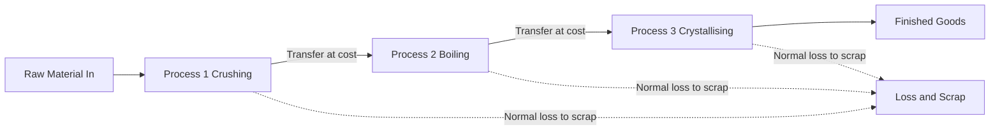
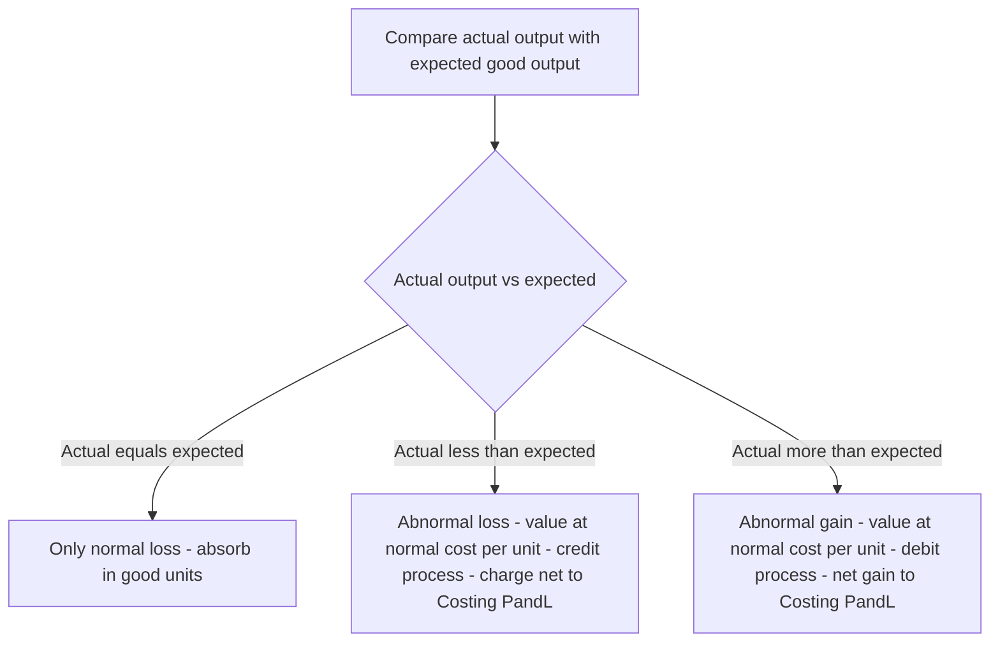
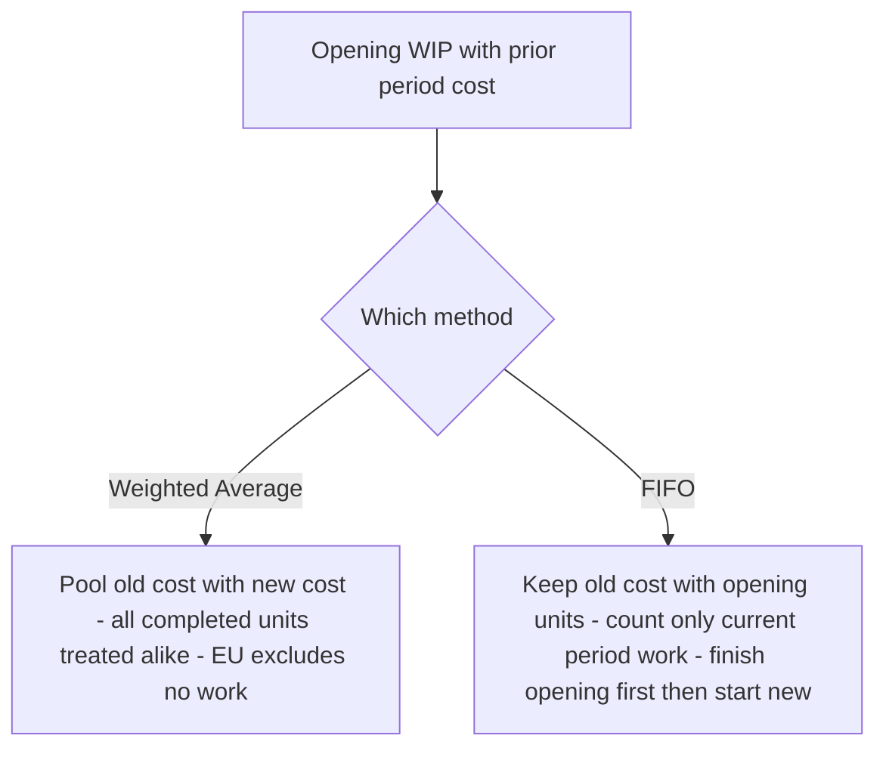
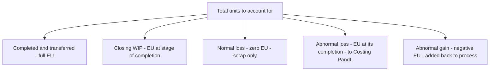

<!-- v2-deep -->

# Chapter 10 — Process & Operation Costing

## 1. The Problem: When You Cannot Point to "This Job"

Imagine you are the cost accountant of a sugar mill. Cane crushes at one end; refined sugar bags roll out at the other. In between there is juice extraction, clarification, evaporation, crystallisation, centrifuging. The plant never stops. Twenty thousand kilograms of sugar came out today. A buyer asks: *"What did it cost you to make one kilogram?"*

You reach for the tool you learned in Job Costing — collect the material, labour and overhead for **this particular kilogram**. And you freeze. There is no "this kilogram". Every crystal was made from a common river of juice, boiled in the same vats, spun in the same centrifuges. You cannot tag a job card to a sugar crystal. The output is **homogeneous** (every unit identical) and the production is **continuous** (an unbroken flow, not discrete orders).

Job costing answers *"what did this specific order cost?"* Process costing answers a different question: *"what did the average unit cost, as it flowed through each stage of a continuous plant?"*

Four hard sub-problems fall out of this the moment you look closely:

1. **The output is continuous and identical** — so we cost the *process*, not the *unit*, and divide at the end.
2. **Material is lost on the way** — evaporation, spillage, chemical reaction. Some loss is unavoidable and expected; some is a signal that something went wrong. These two must be treated **differently**, or the cost figure lies.
3. **At the stroke of midnight when we close accounts, some units are half-finished** — sitting in the evaporator, 60% boiled. How do you divide a period's cost between finished bags and a vat of half-cooked syrup?
4. **One process feeds the next** — juice becomes syrup becomes sugar. The output of Process 1 is the raw material of Process 2. How does cost *transfer*, and should each department book a notional profit on the transfer?

This chapter builds the machinery to answer all four — and it builds each tool only *after* you feel the pain it removes.

### 1.1 Where process costing is legally the *right* method

The examiner sometimes tests the boundary conceptually before any number appears: *"Which costing method suits this industry and why?"* The deciding test is not the product but the **production pattern**. Process costing is mandatory (not optional) when **all** of the following hold:

- Output is **homogeneous** — one unit is a perfect substitute for the next.
- Production is **continuous / mass** — you produce to stock, not to a customer's order.
- Cost cannot be economically traced to an individual unit, so **averaging is the only honest answer**.

Classic industries: **chemicals, paint, cement, sugar, textiles, paper, oil refining, food processing, breweries, distilleries, plastics, steel rolling**. Contrast with printing, ship-building, construction, audit assignments — those are **job / contract** situations because each order is distinct.

A subtle exam point: a single factory can use **both** methods (a *hybrid*). A car plant mass-produces engines by process costing, then assembles a *specific customer's car* under job/batch logic. When the paper says "components are standardised but the final product is customised," expect a **hybrid answer**, not a single method.

### 1.2 The features you may be asked to *list*

Short-note questions ("Features of process costing") expect a crisp list, and each feature secretly encodes a rule you will use later:

1. Production is **continuous** and output is **standardised** → averaging is valid.
2. The factory is divided into **distinct processes / departments**, each a cost centre → one account per process.
3. Cost is **accumulated process-wise** for a **period** (not job-wise for an order) → period costing.
4. Output of one process becomes **input of the next** → cost transfers forward.
5. **Normal and abnormal losses** arise and are treated differently → the loss machinery.
6. **Work-in-progress** exists at period-end → equivalent units.
7. **Joint and by-products** may emerge from a common process → apportionment (next chapter).

---

## 2. The Core Idea: The Relay Race and the Averaging Bucket

Think of production as a **relay race**. Each runner is a *process*. Runner 1 (crushing) carries the baton part of the way, does work on it, and hands it to Runner 2 (boiling), who adds more work and hands it to Runner 3 (crystallising). The baton is the semi-finished product. What passes between runners is **accumulated cost**: everything spent so far travels forward and becomes the "opening cost" of the next runner.

Now the averaging idea. Picture a giant **bucket** for each process. Into the bucket you pour every rupee spent in that process this period — material, wages, overhead, plus the cost handed over by the previous runner. At period-end you look at how many **good units** came out and simply divide:

> **Cost per unit = Total cost poured into the process ÷ Effective good units produced**

That single division is the heart of process costing. Everything else in this chapter — normal loss, abnormal loss, equivalent units, FIFO — exists only to make that division **honest**: to make sure the numerator (cost) and the denominator (units) are counted on the same, fair basis.

*Figure 1 — The relay of cost: each process accumulates its own cost and hands the total forward.*

### 2.1 The one equation, four disguises

Every numerical variant you will meet is the *same* division wearing a different denominator. Fixing this in your head means you never memorise four formulas — you derive them:

| Situation | Numerator (cost) | Denominator (units) |
|---|---|---|
| No loss, no WIP | Total process cost | Input units |
| Normal loss, no WIP | Total cost − scrap of normal loss | Input − normal loss units |
| WIP present (Weighted Avg) | Opening WIP cost + current cost | Completed + closing WIP equivalent units |
| WIP present (FIFO) | Current-period cost only | Work done *this period* in equivalent units |

The numerator always drops any recovery it should not carry (scrap); the denominator always counts only the units that genuinely *earned* that cost. Keep the two on the **same basis** and the answer is right by construction.

---

## 3. Why It Is Built This Way

**Why cost the process, not the unit?** Because the units are indistinguishable, tracing cost to one unit is both impossible and pointless — the average *is* the truth when every unit is identical. Averaging is not a shortcut here; it is the only correct answer.

**Why a separate account for each process?** Because management needs to know *where* cost and *where* loss arise. If sugar is dear this month, the board wants to know whether it was the boiling house or the centrifuge that bled money. A process account is a mini profit-and-loss window on one department. It also produces the transfer price for the next department automatically.

**Why split loss into "normal" and "abnormal"?** Because they mean opposite things to a manager. A 5% evaporation loss is a **law of physics** — you *plan* for it, and its cost is a legitimate cost of the good output. A 12% loss when you expected 5% is a **failure** — a broken valve, a careless operator — and burying its cost inside good units would hide the failure and overstate what the product "should" cost. Good accounting makes problems *visible*. So normal loss is absorbed by good units; abnormal loss is stripped out and sent to the Costing Profit & Loss Account where management can see it.

**Why equivalent units?** Because a half-finished unit consumed roughly half a unit's worth of cost, and pretending it is either a whole unit or nothing would distort the per-unit cost of the finished goods. We convert partly-done work into its "whole-unit equivalent" so the numerator and denominator match.

**Why value abnormal loss at *full* cost but normal loss only at *scrap*?** Because normal loss is a cost the good units are *meant* to bear — it never deserved a cost of its own, so we give it none beyond what the scrap market pays. Abnormal loss, by contrast, represents *good units that should have existed*; they absorbed full material, labour and overhead before being destroyed, so charging them at full cost is the only way to measure the true rupee value of the failure. The valuation rule is not a convention — it follows directly from *what the units economically represent*.

Every rule below is a servant of one master principle: **make the cost per unit reflect economic reality.**

---

## 4. Full Technical Content

### 4.1 The Process Account — the basic format

Each process gets a T-account. Debits = costs flowing *in*; credits = output and losses flowing *out*.

| Dr — Process I Account | Units | ₹ | Cr | Units | ₹ |
|---|---|---|---|---|---|
| To Direct Materials | xxx | xxx | By Normal Loss (scrap value) | xx | xx |
| To Direct Wages | | xxx | By Abnormal Loss | xx | xx |
| To Direct Expenses | | xxx | By Process II A/c (transfer) | xxx | xxx |
| To Production Overhead | | xxx | By Closing WIP | xx | xx |
| To Abnormal Gain | xx | xx | | | |
| **Total** | | | | | |

Note where the two odd items sit: **Abnormal Loss** is a *credit* (it leaves the process, like output), while **Abnormal Gain** is a *debit* (it is added back). We will see why in a moment.

**Reading the units column as a physical check.** Before you trust a single rupee, make the **unit** columns balance: input units on the debit side (including abnormal gain units) must equal output + all loss units on the credit side. If the units do not tie, the rupees never will. This one-line check catches most careless errors.

**Where each cost enters.** Direct material of *the first* process is the true raw material. In later processes the biggest debit is usually **"To Process I A/c"** — the transferred-in cost — and any *additional* material added in that later process sits below it. Watch for a process that adds no fresh material at all: its only debits are the transfer-in plus its own wages and overhead.

### 4.2 Normal loss — planned, unavoidable

**Normal loss** = the loss that *must* happen under efficient operating conditions (evaporation, shrinkage, unavoidable rejects). It is expressed as a percentage of input and is decided in advance from engineering/experience.

Two consequences flow from "it is a cost of making good units":

1. **It carries no cost of its own.** Its cost is *absorbed by the good units*. We do this by removing the lost units from the denominator.
2. **If the scrap has a saleable value**, that recovery *reduces* the net cost to be spread over good units.

> **Cost per good unit = (Total process cost − Scrap value of normal loss) ÷ (Input units − Normal loss units)**

The normal-loss units appear on the credit side **valued only at their scrap/realisable value** (often nil). They are *never* valued at the full process cost — that is the whole point.

**A finer distinction the examiner tests — "% of input" vs "% of output".** Normal loss is *usually* a percentage of **input introduced**. But some questions say "normal loss is 5% of **output**" or "5% of units **inspected** after a certain stage." Read the exact base. If loss is "10% of input" on 1,000 units, loss = 100. If it is "10% of *good output*," you must solve: input − loss = output and loss = 10% × output, which is a small algebra step, not the obvious 10% × 1,000. Misreading the base is a classic silent error.

**Waste vs scrap vs spoilage vs defectives — keep the vocabulary straight.** These are *not* interchangeable, and a theory question may ask you to distinguish them:

- **Waste** — portion with *no* recoverable value (smoke, evaporation, gas). Normal waste simply shrinks the denominator; it has zero scrap credit.
- **Scrap** — residue with a *small* recoverable value (metal turnings). Normal scrap's realisable value reduces the numerator.
- **Spoilage** — units so damaged they cannot be rectified and are sold as *seconds* or scrapped.
- **Defectives** — units that *can* be **rectified** by extra work and then sold as good. Rectification cost of *normal* defectives is a production cost; of *abnormal* defectives it goes to Costing P&L.

### 4.3 Abnormal loss — the failure signal

**Abnormal loss** = actual loss *greater* than normal loss. It is the excess:

> **Abnormal loss units = Normal (expected) good output − Actual good output**
> (equivalently, Actual loss − Normal loss)

Because abnormal loss represents good units that *should* have been produced, it is valued at the **same cost per good unit** as the output — the full, honest per-unit cost:

> **Value of abnormal loss = Cost per good unit × Abnormal loss units**

It is credited out of the process (so it does not inflate the cost of good output), taken to an **Abnormal Loss Account**, where any scrap recovery on those units is credited, and the net loss is charged to the **Costing P&L Account**. Management now sees the rupee cost of inefficiency on the face of the accounts.

**Do abnormal-loss units also fetch scrap?** Yes — physically they are still destroyed and sold at the same scrap rate as normal loss. The scrap on abnormal units is credited *inside the Abnormal Loss Account* (not the Normal Loss Account), reducing the net charge to Costing P&L. The scrap rate is the same; only the *account* that receives the recovery differs. This is why the Abnormal Loss Account, not the process, absorbs it.

### 4.4 Abnormal gain — the pleasant surprise

**Abnormal gain** = when actual loss is *less* than the normal loss allowed — the process did better than the standard.

> **Abnormal gain units = Actual good output − Normal (expected) good output**

Now here is the subtlety that trips up half the exam hall. When we computed cost per unit, we *assumed* the full normal loss would occur and we credited the normal-loss account with the scrap value of the *full* normal loss. But fewer units were actually lost, so **we over-credited the scrap account** and must correct it. Hence:

- Abnormal gain is **debited to the process** (added back) at the **normal cost per good unit** — so the good units still bear only their fair average cost.
- The Abnormal Gain Account is credited by the process, then **debited** with the scrap value that was *not* realised (because those units were not actually scrapped), and the net gain goes to the **Costing P&L Account**.

*This asymmetry — abnormal loss loses its scrap to P&L as a recovery, abnormal gain gives back scrap it never earned — is exactly why the two cannot be treated the same way.*

**Why abnormal gain is *always* valued at normal cost, never at the "period's own" cost.** A tempting error is to recompute a fresh per-unit cost for the gain period. Don't. The per-unit rate is deliberately anchored to the **normal** loss assumption so that the good units carry their *standard* cost regardless of whether the process over- or under-performed. Abnormal gain is simply the mirror of abnormal loss; both use the *same* rate so that the two can be compared as pure efficiency swings.

*Figure 2 — Deciding the treatment of any loss or gain.*

### 4.5 Equivalent units (EU) — valuing the half-done

When there is opening or closing **work-in-progress**, the units are not all equally finished. A closing stock of 2,000 units that is 40% converted has, in cost terms, done the work of 2,000 × 40% = 800 fully-completed units. That 800 is its **equivalent units**.

> **Equivalent units = Physical units × Percentage of completion**

Crucially, completion is measured **separately for each cost element**, because materials, labour and overhead enter the process at different rates. Direct material is usually added *fully at the start*, so WIP is often 100% complete for material but only part-complete for **conversion cost** (labour + overhead). We therefore build a **statement of equivalent production** with a column per element.

The four-step engine:
1. **Statement of Equivalent Production** — convert physical output (completed, closing WIP, abnormal loss/gain) into EU, element by element.
2. **Statement of Cost per EU** — for each element, cost ÷ its equivalent units.
3. **Statement of Evaluation** — value each output stream (transferred, closing WIP, abnormal items) using the per-EU rates.
4. **Process Account** — post everything and confirm both sides balance.

**The completion-percentage assumptions the examiner leans on.** Unless told otherwise:

- **Direct material** introduced *at the beginning* → WIP is **100%** complete for material.
- **Conversion cost** accrues *evenly* → WIP is complete only to its stated stage (e.g. 60%).
- If a *second* material is added at, say, the 75% stage, then WIP that is only 60% done is **0%** complete for that second material — it has not reached the addition point yet. Multi-material questions hinge on *when* each material enters.

**Where do loss units sit in the EU statement?** This is the hardest sub-topic and section 4.8 below works it fully. In brief: **normal loss** carries no equivalent units (it absorbs no cost, so it is *excluded* from the EU columns), while **abnormal loss and abnormal gain** *do* appear as EU lines at their degree of completion — because they represent real work done (or, for gain, real work that must be added back).

### 4.6 Weighted Average vs FIFO — which cost, which units?

Once there is **opening WIP**, a question appears: this period's costs are mixed with last period's costs sitting in opening WIP. How do we combine them? Two philosophies:

**Weighted Average (WA).** Forget history. Treat opening-WIP cost and this period's cost as one pool, and treat all completed units alike.
- EU denominator = **completed units (100%) + closing WIP EU**. Opening WIP is *not* separately adjusted — its prior work is simply swallowed into the average.
- Cost per EU = **(opening WIP cost + current cost) ÷ EU**.
- Simple; but it *blends* last period's rates into this period's — so it slightly blurs cost control.

**FIFO (First-In-First-Out).** Respect the queue. The units in opening WIP are finished *first*, using their own already-incurred cost plus only the cost needed *this period to complete them*. Only then are fresh units started.
- EU denominator = **work done this period only** = (opening WIP × % *remaining* to complete) + (units started *and* completed) + (closing WIP EU).
- Cost per EU uses **current-period cost only**.
- Cost of finished goods comes in two layers: (a) opening WIP's brought-forward cost + cost to finish it, and (b) started-and-completed units at current rates.
- More work, but each period's cost per unit is "clean" — ideal for judging *this* period's efficiency.

*Rule of thumb: if the question gives you opening WIP with its own cost breakdown and asks for FIFO, you must isolate current-period cost and current-period work. If it says "average", pool everything.*

**Why the two even differ — the intuition in one line.** WA answers *"what did an average unit in stock-and-out cost this period?"*; FIFO answers *"what did it cost to do the actual work performed this period?"* When input prices are *rising*, FIFO's current rate is **higher** than WA's blended rate, so FIFO transfers out a slightly *lower* total (old cheap units leave first) and leaves *dearer* closing stock. When prices are stable, the two answers converge. Expect the examiner to comment on this in a theory sub-part.

**A memory hook for the FIFO denominator.** Work done this period = (finish the opening) + (do the middle whole) + (start the closing). Three physical layers, three EU contributions. If you can draw those three layers you never misplace a number.

*Figure 3 — The two ways to handle opening WIP.*

### 4.7 Inter-process profit — why a department books profit on a transfer

Sometimes management wants each process to look like a mini-business: it "sells" its output to the next process at **cost plus a profit margin** (market-based transfer price). Reasons: to judge each department's efficiency against an outside benchmark, and to reveal whether it is cheaper to make in-house or buy out.

This creates one accounting problem: any **closing stock lying inside a later process contains profit added by earlier processes that has not been realised by a sale to the outside world**. That is *unrealised profit* and must be removed when preparing the balance sheet, so stock is not overstated. We track each figure in **three columns — Cost, Profit, Total** — throughout, and compute:

> **Unrealised profit in closing stock = (Profit element in the total column ÷ Total column value) × Closing stock value**

The stock is shown in the balance sheet at **cost = total − unrealised profit**, and a **Stock Reserve** provision is created for the profit removed.

**Advantages and disadvantages (the theory sub-part).** Be ready to *justify* the system, not just operate it:

- *Advantages:* each process's efficiency is judged against market price; make-or-buy decisions become visible; a process running at a loss is exposed immediately.
- *Disadvantages:* the extra Cost/Profit/Total bookkeeping is laborious; unrealised profit must be eliminated for accounts and stock valuation, complicating closing entries; inter-process profit has **no effect on the firm's true profit** — it is purely a management-information device that nets to zero on consolidation.

**The order-of-operations trap.** Compute the **unrealised profit on *opening and closing* stock at *each* process separately**, then aggregate. The provision carried in the balance sheet is the *closing* stock reserve; the P&L absorbs the *movement* (closing reserve − opening reserve). Simple one-process questions ignore opening stock; multi-period ones don't.

### 4.8 WIP *and* loss together — the combined statement

The single most demanding variant marries equivalent units with normal/abnormal loss. The discipline:

1. **Normal loss** — enter its physical units in the *reconciliation of units*, but give it **zero equivalent units** and **zero cost** beyond scrap. Its scrap value is deducted from the material cost (or from total cost) *before* computing cost per EU — exactly as in the no-WIP case.
2. **Abnormal loss** — enter it as an EU line at its **degree of completion** (if it is detected at, say, the end of processing, it is 100% complete for all elements; if detected at an inspection point part-way, use that stage). It is valued at the per-EU rates and credited out of the process to the Abnormal Loss Account.
3. **Abnormal gain** — same idea in reverse: an EU line (usually 100% complete) that is *subtracted* in the reconciliation and *debited* back to the process at the per-EU rates.

**The subtle scrap adjustment under equivalent units.** The scrap realised on normal loss is credited to the **material** element's cost (because loss is typically a material phenomenon) before dividing — so it lowers the material cost per EU, not the conversion cost per EU. Under **abnormal gain**, remember the same scrap correction as in the simple case: the gain account must return the scrap value of the units *not* actually lost to the Normal Loss Account.

*Figure 4 — Placing every unit stream into the equivalent-production statement.*

### 4.9 Operation costing — process costing at finer resolution

**Operation costing** applies when a product passes through a sequence of **small, standardised operations** rather than a few large processes. It is simply process costing zoomed in: the cost centre is the *operation*, not the whole department.

- Cost per unit **of each operation** = (operation cost − scrap recovery) ÷ good units of that operation.
- The unit cost of the finished article = **sum of the per-unit costs of every operation** it passes through.
- All the loss and equivalent-unit logic of process costing applies at operation level.

Its value is *precision*: because each operation is standardised and repetitive, cost per operation is stable and makes an excellent **control benchmark** — an operation drifting above its standard cost is spotted immediately. Industries: mass-manufactured components, toys, cycles, watches, electronics assembly, ready-made garments — anything built on a line of repetitive standardised steps.

---

## 5. Worked Examples

### Example 1 — The clean case: normal loss with scrap value (no WIP)

**Data.** Process I: input 1,000 units @ ₹4.10 = ₹4,100; direct wages ₹3,000; production overhead ₹3,000. Normal loss is 10% of input; scrap realises ₹2 per unit. Actual output = 900 units, all transferred to Process II.

**Step 1 — Normal loss.** 10% of 1,000 = **100 units**, scrap value 100 × ₹2 = **₹200**.

**Step 2 — Cost per good unit.**
Total cost = 4,100 + 3,000 + 3,000 = ₹10,100.
Cost per unit = (10,100 − 200) ÷ (1,000 − 100) = 9,900 ÷ 900 = **₹11.00**.

**Step 3 — Value output.** 900 × ₹11 = **₹9,900**. Actual output equals expected good output (900), so there is **no abnormal loss or gain**.

**Process I Account**

| Dr | Units | ₹ | Cr | Units | ₹ |
|---|---|---|---|---|---|
| To Materials | 1,000 | 4,100 | By Normal Loss (scrap) | 100 | 200 |
| To Wages | | 3,000 | By Process II A/c | 900 | 9,900 |
| To Overhead | | 3,000 | | | |
| **Total** | **1,000** | **10,100** | **Total** | **1,000** | **10,100** |

Both sides agree at ₹10,100 and 1,000 units. **Reconciled.**

---

### Example 2 — Abnormal loss (and its account)

**Data.** Process input 2,000 units @ ₹5 = ₹10,000; wages ₹5,000; overhead ₹4,000. Normal loss 10% of input; scrap value ₹5 per unit. **Actual output = 1,700 units.**

**Step 1 — Normal loss & expected output.** Normal loss = 10% × 2,000 = **200 units** (scrap 200 × ₹5 = **₹1,000**). Expected good output = 2,000 − 200 = **1,800 units**.

**Step 2 — Cost per good unit** (always on the *normal* basis):
Total cost = 10,000 + 5,000 + 4,000 = ₹19,000.
Cost per unit = (19,000 − 1,000) ÷ (2,000 − 200) = 18,000 ÷ 1,800 = **₹10.00**.

**Step 3 — Abnormal loss.** Actual output 1,700 < expected 1,800 → shortfall = **100 units abnormal loss**, valued at ₹10 = **₹1,000**.

**Process Account**

| Dr | Units | ₹ | Cr | Units | ₹ |
|---|---|---|---|---|---|
| To Materials | 2,000 | 10,000 | By Normal Loss (scrap) | 200 | 1,000 |
| To Wages | | 5,000 | By Abnormal Loss | 100 | 1,000 |
| To Overhead | | 4,000 | By Finished/Next Process | 1,700 | 17,000 |
| **Total** | **2,000** | **19,000** | **Total** | **2,000** | **19,000** |

**Abnormal Loss Account.** The 100 abnormal-loss units are still physically scrapped, fetching ₹5 each = ₹500. The rest is a real loss to the business.

| Dr — Abnormal Loss A/c | ₹ | Cr | ₹ |
|---|---|---|---|
| To Process A/c (100 × 10) | 1,000 | By Bank (scrap 100 × 5) | 500 |
| | | By Costing P&L A/c | 500 |
| **Total** | **1,000** | **Total** | **1,000** |

Management sees a clean **₹500 loss from inefficiency** — not buried in product cost. **Reconciled.**

---

### Example 3 — Abnormal gain (and the scrap correction)

**Data.** Input 1,000 units @ ₹8 = ₹8,000; wages ₹1,600; overhead ₹1,600. Normal loss 10% of input; scrap value ₹4 per unit. **Actual output = 950 units.**

**Step 1.** Normal loss = 100 units (scrap 100 × ₹4 = ₹400). Expected good output = 900 units.

**Step 2 — Cost per good unit:**
Total cost = 8,000 + 1,600 + 1,600 = ₹11,200.
Cost per unit = (11,200 − 400) ÷ (1,000 − 100) = 10,800 ÷ 900 = **₹12.00**.

**Step 3 — Abnormal gain.** Actual 950 > expected 900 → **50 units abnormal gain**, valued at ₹12 = **₹600**. Abnormal gain is *debited* to the process.

**Process Account**

| Dr | Units | ₹ | Cr | Units | ₹ |
|---|---|---|---|---|---|
| To Materials | 1,000 | 8,000 | By Normal Loss (scrap) | 100 | 400 |
| To Wages | | 1,600 | By Finished/Next Process | 950 | 11,400 |
| To Overhead | | 1,600 | | | |
| To Abnormal Gain A/c | 50 | 600 | | | |
| **Total** | **1,050** | **11,800** | **Total** | **1,050** | **11,800** |

*(Output valued 950 × 12 = 11,400.)*

**The scrap correction.** We credited Normal Loss with scrap on the *full* 100 units (₹400), but only 100 − 50 = **50 units were actually scrapped**, earning 50 × ₹4 = ₹200. The scrap account has been over-credited by ₹200, which belongs to the abnormal gain (those 50 gained units never became scrap).

**Abnormal Gain Account**

| Dr — Abnormal Gain A/c | ₹ | Cr | ₹ |
|---|---|---|---|
| To Normal Loss A/c (scrap not realised 50 × 4) | 200 | By Process A/c (50 × 12) | 600 |
| To Costing P&L A/c (net gain) | 400 | | |
| **Total** | **600** | **Total** | **600** |

**Normal Loss Account** (to see the whole loop)

| Dr — Normal Loss A/c | Units | ₹ | Cr | Units | ₹ |
|---|---|---|---|---|---|
| To Process A/c | 100 | 400 | By Bank (actual scrap 50 × 4) | 50 | 200 |
| | | | By Abnormal Gain A/c | 50 | 200 |
| **Total** | **100** | **400** | **Total** | **100** | **400** |

Net gain to Costing P&L = **₹400**. Every account closes. **Reconciled.**

---

### Example 4 — Equivalent units: Weighted Average vs FIFO on identical data

**Data.** A process has:
- **Opening WIP:** 4,000 units — Materials 100% complete (valued ₹18,000); Conversion 50% complete (valued ₹20,000).
- **Units introduced this period:** 16,000.
- **Costs added this period:** Materials ₹1,32,000; Conversion ₹1,68,000.
- **Completed and transferred out:** 18,000 units.
- **Closing WIP:** 2,000 units — Materials 100%, Conversion 40%.
- No process loss.

Material is added fully at start; "conversion" = labour + overhead combined.

**Physical reconciliation:** In = 4,000 + 16,000 = 20,000. Out = 18,000 + 2,000 = 20,000. ✔

---

#### 4A — Weighted Average method

**Step 1 — Statement of Equivalent Production**

| Output | Units | Material % | Material EU | Conversion % | Conversion EU |
|---|---|---|---|---|---|
| Completed & transferred | 18,000 | 100 | 18,000 | 100 | 18,000 |
| Closing WIP | 2,000 | 100 | 2,000 | 40 | 800 |
| **Total EU** | | | **20,000** | | **18,800** |

**Step 2 — Cost per EU** (opening cost pooled with current cost)

| Element | Opening ₹ | Added ₹ | Total ₹ | EU | Cost/EU ₹ |
|---|---|---|---|---|---|
| Material | 18,000 | 1,32,000 | 1,50,000 | 20,000 | 7.50 |
| Conversion | 20,000 | 1,68,000 | 1,88,000 | 18,800 | 10.00 |
| **Total** | **38,000** | **3,00,000** | **3,38,000** | | **17.50** |

**Step 3 — Evaluation**
- Transferred out: 18,000 × ₹17.50 = **₹3,15,000**.
- Closing WIP: Material 2,000 × 7.50 = 15,000 + Conversion 800 × 10 = 8,000 = **₹23,000**.

**Step 4 — Check:** 3,15,000 + 23,000 = **₹3,38,000** = total cost pooled. ✔

---

#### 4B — FIFO method (same data)

Under FIFO we count **only work done this period** and use **only current-period cost**.

Units **started and completed** this period = completed − opening WIP = 18,000 − 4,000 = **14,000**.

**Step 1 — Statement of Equivalent Production (FIFO)**

| Output | Units | Material EU | Conversion EU |
|---|---|---|---|
| To complete Opening WIP (Mat 0%, Conv 50% remaining) | 4,000 | 0 | 2,000 |
| Started & completed | 14,000 | 14,000 | 14,000 |
| Closing WIP (Mat 100%, Conv 40%) | 2,000 | 2,000 | 800 |
| **Total EU (work done this period)** | | **16,000** | **16,800** |

**Step 2 — Cost per EU (current-period cost only)**

| Element | Added ₹ | EU | Cost/EU ₹ |
|---|---|---|---|
| Material | 1,32,000 | 16,000 | 8.25 |
| Conversion | 1,68,000 | 16,800 | 10.00 |
| **Total** | **3,00,000** | | **18.25** |

**Step 3 — Evaluation**

*Completed & transferred (18,000 units), in two layers:*
- Opening WIP finished: brought-forward cost 38,000 + cost to complete conversion (2,000 EU × 10) 20,000 = **₹58,000** (for 4,000 units).
- Started & completed: 14,000 × ₹18.25 = **₹2,55,500**.
- **Total transferred = 58,000 + 2,55,500 = ₹3,13,500.**

*Closing WIP (2,000 units):* Material 2,000 × 8.25 = 16,500 + Conversion 800 × 10 = 8,000 = **₹24,500**.

**Step 4 — Check:** 3,13,500 + 24,500 = ₹3,38,000 = opening 38,000 + added 3,00,000. ✔

**The lesson in the contrast.** Same facts, both reconcile to ₹3,38,000, yet transferred cost differs: **WA ₹3,15,000 vs FIFO ₹3,13,500.** FIFO isolates this period's material rate (₹8.25) instead of blending it down with last period's cheaper material (WA ₹7.50) — so FIFO is the sharper tool for period-on-period cost control, while WA is simpler.

---

### Example 5 — WIP *and* abnormal loss together (the combined statement)

This is the hardest common variant — it forces every rule of section 4.8 into one problem.

**Data (Weighted Average).**
- Opening WIP: **nil** (kept nil to isolate the loss logic).
- Units introduced: 12,000 @ material ₹6,00,000.
- Conversion cost this period: ₹3,29,000.
- **Normal loss:** 10% of input; scrap value ₹10 per unit.
- Completed & transferred: 9,000 units.
- Closing WIP: 1,500 units — Material 100%, Conversion 60%.
- Balancing figure is the loss.

**Step 1 — Reconcile physical units.** Input 12,000. Accounted so far: completed 9,000 + closing WIP 1,500 = 10,500. Normal loss = 10% × 12,000 = **1,200**. Units still unexplained = 12,000 − 10,500 − 1,200 = **300 → abnormal loss.** (Actual total loss 1,500 > normal 1,200, so 300 abnormal.)

**Step 2 — Statement of Equivalent Production.** Normal loss gets **zero EU**; abnormal loss is detected at end of process, so it is **100% complete** for both elements.

| Output | Units | Material EU | Conversion EU |
|---|---|---|---|
| Completed & transferred | 9,000 | 9,000 | 9,000 |
| Closing WIP (Mat 100%, Conv 60%) | 1,500 | 1,500 | 900 |
| Abnormal loss (100%) | 300 | 300 | 300 |
| Normal loss (zero EU) | 1,200 | — | — |
| **Total EU** | **12,000** | **10,800** | **10,200** |

**Step 3 — Cost per EU.** Scrap of *normal* loss reduces the **material** cost first: normal-loss scrap = 1,200 × ₹10 = **₹12,000**.

| Element | Cost ₹ | Less normal scrap ₹ | Net ₹ | EU | Cost/EU ₹ |
|---|---|---|---|---|---|
| Material | 6,00,000 | 12,000 | 5,88,000 | 10,800 | 54.4444 |
| Conversion | 3,29,000 | — | 3,29,000 | 10,200 | 32.2549 |
| **Total** | **9,29,000** | | **9,17,000** | | **86.6993** |

*(Rates kept to 4 dp so the reconciliation closes exactly; in an exam, carry the fraction and round only the final answers.)*

**Step 4 — Evaluation.**
- Completed & transferred: 9,000 × 86.6993 = **₹7,80,294**.
- Closing WIP: Material 1,500 × 54.4444 = 81,667 + Conversion 900 × 32.2549 = 29,029 = **₹1,10,696**.
- Abnormal loss: 300 × 86.6993 = **₹26,010**.
- Check: 7,80,294 + 1,10,696 + 26,010 = ₹9,17,000 = net cost pooled. ✔

**Step 5 — Abnormal Loss Account.** Those 300 units still fetch scrap at ₹10 = ₹3,000.

| Dr — Abnormal Loss A/c | ₹ | Cr | ₹ |
|---|---|---|---|
| To Process A/c (300 units) | 26,010 | By Bank (scrap 300 × 10) | 3,000 |
| | | By Costing P&L A/c | 23,010 |
| **Total** | **26,010** | **Total** | **26,010** |

**Reading the result.** Normal loss silently shrank the denominator and cheapened material; abnormal loss surfaced as a **₹23,010 charge to P&L** that no good unit had to carry. Both WIP and loss were handled in one statement — exactly what the examiner is testing. **Reconciled.**

*What if the examiner tweaks it — loss detected part-way?* If inspection happens at the **conversion 50% stage**, abnormal loss would be **100% material** but only **50% conversion** (150 conversion EU, not 300). The completed and WIP lines are unchanged; only the abnormal-loss EU shrinks, raising the conversion cost/EU slightly. Always read *where* inspection occurs.

---

### Example 6 — Inter-process profit and unrealised profit in stock

**Data.** Product passes through Process I and Process II, then to Finished Stock. Each process transfers at a profit.

- **Process I:** Materials ₹20,000 + Wages ₹20,000 = cost ₹40,000. Output transferred to Process II at ₹50,000 (profit ₹10,000). No closing stock in I.
- **Process II:** receives transfer ₹50,000; adds Materials ₹30,000 and Wages ₹10,000. **Closing stock in Process II = ₹18,000** (at transfer/total value). Output transferred to Finished Stock at cost-of-goods + 25% profit on transfer price.

We keep three columns — **Cost, Profit, Total** — throughout.

**Process I** — all self-generated cost, so: Cost ₹40,000, Profit ₹10,000, **Total ₹50,000** transferred out.

**Process II — goods available before its own profit:**

| Element | Cost ₹ | Profit ₹ | Total ₹ |
|---|---|---|---|
| Transfer from Process I | 40,000 | 10,000 | 50,000 |
| Materials added | 30,000 | — | 30,000 |
| Wages added | 10,000 | — | 10,000 |
| **Goods available** | **80,000** | **10,000** | **90,000** |

*(The profit ₹10,000 in the Total column came entirely from Process I.)*

**Unrealised profit in Process II closing stock.** The ₹18,000 closing stock carries the *same proportion* of embedded profit as the goods available:

> Unrealised profit = 18,000 × (Profit 10,000 ÷ Total 90,000) = 18,000 × 0.1111 = **₹2,000**.

So closing stock splits as Cost ₹16,000 + Profit ₹2,000 = Total ₹18,000. Its **balance-sheet value = cost ₹16,000**, and a **Stock Reserve of ₹2,000** is created.

**Cost of goods transferred out of Process II** (goods available − closing stock):

| | Cost ₹ | Profit ₹ | Total ₹ |
|---|---|---|---|
| Goods available | 80,000 | 10,000 | 90,000 |
| Less Closing stock | 16,000 | 2,000 | 18,000 |
| **Cost of output** | **64,000** | **8,000** | **72,000** |

**Add Process II's own profit** at 25% on transfer price. Transfer price = 72,000 ÷ 0.75 = ₹96,000, so profit added = **₹24,000**.

**Transferred to Finished Stock:**

| | Cost ₹ | Profit ₹ | Total ₹ |
|---|---|---|---|
| Transfer to Finished Stock | 64,000 | 8,000 + 24,000 = **32,000** | 96,000 |

**Reconciling the true profit.**
- Apparent profit shown in the two processes = 10,000 (I) + 24,000 (II) = ₹34,000.
- Less unrealised profit locked in Process II closing stock = ₹2,000.
- **Realised (actual) profit = ₹32,000** — exactly the Profit column of the goods that actually moved to Finished Stock. ✔

The three-column discipline delivered both the correct stock value (₹16,000) *and* the correct realised profit (₹32,000) in one pass.

*What if the examiner tweaks it — a margin "on cost" instead of "on transfer price"?* Read the phrase precisely. "25% **on transfer price**" (as above) → profit = cost ÷ 0.75 − cost. "25% **on cost**" → profit = 0.25 × cost = 0.25 × 72,000 = ₹18,000, giving a transfer of ₹90,000. The two produce different transfer prices from identical cost — mixing them is a guaranteed lost mark.

---

### Example 7 — Operation costing: unit cost built operation-by-operation

**Data.** A cycle-pedal is made in three standardised operations. Input to Operation 1 = 10,000 blanks. Each operation has its own cost and its own normal rejection.

| Operation | Input units | Normal reject | Good output | Operation cost ₹ |
|---|---|---|---|---|
| 1 — Press | 10,000 | 2% (200) | 9,800 | 39,200 |
| 2 — Machine | 9,800 | 100 | 9,700 | 29,100 |
| 3 — Polish | 9,700 | 100 | 9,600 | 19,200 |

Rejects have no scrap value. Output of each operation feeds the next.

**Per-unit cost of each operation** = operation cost ÷ good units of that operation:
- Operation 1: 39,200 ÷ 9,800 = **₹4.00**
- Operation 2: 29,100 ÷ 9,700 = **₹3.00**
- Operation 3: 19,200 ÷ 9,600 = **₹2.00**

**Cost per finished pedal** = sum across the operations it survived = 4.00 + 3.00 + 2.00 = **₹9.00**.

**Cross-check via total cost / final good output** would be *wrong* here, because rejects at each stage mean earlier operation costs are borne by fewer surviving units — which is precisely why operation costing computes the rate *stage by stage* and **adds**. Total spend = 39,200 + 29,100 + 19,200 = ₹87,500; final good units = 9,600; naive average = ₹9.11, which **overstates nothing but hides where cost sits**. The operation method's ₹9.00 correctly loads each surviving unit with each operation's own per-unit cost. The ₹0.11 gap is the cost of units rejected *after* absorbing early-operation cost — in a fuller treatment it is charged as the cost of normal rejection carried by survivors, and the operation-wise build-up already embeds it stage by stage.

**The exam value.** Operation costing tells management the standard cost of *each* operation (₹4 / ₹3 / ₹2). If the polishing operation next month costs ₹2.40 per unit, the control signal is instant and localised — the whole point of costing per operation rather than per process. **Reconciled at the operation level.**

---

## 6. Presentation & Format

**Order of statements (with WIP):** always present them in this sequence so the examiner can follow the logic —
1. Statement of Equivalent Production
2. Statement of Cost per Equivalent Unit
3. Statement of Evaluation (apportionment of cost)
4. Process Account (final posting)

**Process Account conventions:**
- Show **units and rupees** in parallel columns on both sides; both column-totals must agree.
- Credit side order: **Normal Loss (at scrap value) → Abnormal Loss → Transfer to next process/Finished → Closing WIP.**
- Abnormal Gain appears on the **debit** side; Abnormal Loss on the **credit** side.
- Normal loss is valued at **scrap value only** (nil if not saleable); abnormal loss/gain at **normal cost per unit**.

**Supporting accounts to open:** Normal Loss A/c, Abnormal Loss A/c, Abnormal Gain A/c, Costing P&L A/c. For inter-process profit, maintain **Cost / Profit / Total** columns and a **Stock Reserve A/c**.

**Inter-process transfer:** the total of one process's output becomes the opening debit ("To Process I A/c") of the next.

**Rounding discipline.** When cost per EU is not exact (e.g. ₹86.6993), **carry the unrounded rate through evaluation and round only the final rupee figures** — otherwise the process account will fail to balance by a few rupees and you will waste minutes hunting a "phantom" difference. If a small residual remains after honest rounding, adjust it against the largest figure (usually transferred-out) and state that you have done so.

**Show the physical-unit reconciliation first.** A one-line "units to account for = units accounted for" statement at the top earns method marks and catches the abnormal loss/gain as a *balancing figure* before you touch rupees.

---

## 7. Connections

- **Job & Batch Costing (Ch. 9):** the mirror image — job costing traces cost to *distinct* orders; process costing *averages* over identical continuous output. Batch costing sits between them. Knowing *which* the business is tells you which method is legal.
- **Joint Products & By-products:** a specialised process-costing situation where one process yields *several* different outputs from a common cost — the apportionment logic (physical units, sales value) is the sequel to this chapter.
- **Material & Labour Costing (Ch. 02–03):** the material, wages and overhead that feed each process account are computed with those chapters' tools; normal loss connects to **normal wastage** treatment in material control.
- **Overheads (Ch. 04):** production overhead absorbed into each process is the output of departmental absorption rates.
- **Cost Control & Standard Costing:** abnormal loss/gain are the raw material of variance analysis — they quantify inefficiency in rupees, which standard costing later refines.
- **Service/Operating Costing:** the same "cost the operation, divide by output" idea, applied to services (per passenger-km, per bed-day) instead of goods.
- **Cost Sheet & Reconciliation:** the transfer-to-finished-stock figure from the last process becomes the *cost of production* line in the cost sheet; abnormal loss/gain are among the items that make cost profit differ from financial profit in a reconciliation statement.

---

## 8. Traps & Examiner Tricks

1. **Valuing normal loss at full cost.** Normal loss units get **scrap value only** — never the per-unit process cost. Putting the full cost there destroys the whole absorption logic.
2. **Wrong denominator.** Cost per unit divides by **(input − normal loss)**, *not* by input. Forgetting to subtract normal loss inflates units and understates cost per unit.
3. **Forgetting scrap value in the numerator.** Deduct the scrap value of normal loss from cost *before* dividing. Skipping it overstates cost per unit.
4. **Abnormal loss/gain valued at the wrong rate.** Both are valued at the **normal cost per good unit**, using the same formula that priced the output — never at scrap value.
5. **The abnormal-gain scrap correction.** Examiners love this. When there is abnormal gain, the Normal Loss and Abnormal Gain accounts must exchange the **scrap value of the units that were *not* actually lost**. Omitting it leaves the accounts unbalanced.
6. **Abnormal gain on the wrong side.** Gain is a **debit** to the process (added back); loss is a **credit**. Reversing them is an instant red flag.
7. **FIFO with the wrong EU.** Under FIFO, opening WIP contributes only the **percentage remaining to be done**, not its full units. Counting opening WIP at 100% turns FIFO into (wrong) weighted average.
8. **Mixing current and total cost in FIFO.** FIFO uses **current-period cost only** for the per-EU rate; the opening WIP cost is added back as a *lump* when valuing completed goods.
9. **Element-wise completion ignored.** Material is usually 100% complete in WIP while conversion is partial. Applying one blanket percentage to all elements misvalues WIP.
10. **Abnormal loss/gain units in the EU statement.** When there is *both* WIP *and* abnormal loss/gain, the abnormal units must appear as a line in the equivalent-production statement (abnormal loss at its degree of completion; treat consistently). Normal loss, by contrast, gets **zero EU**.
11. **Inter-process profit — unrealised profit.** Compute it on **closing stock**, using the **profit-to-total ratio of goods available** (not the transfer margin). Show stock in the balance sheet **net of** this profit.
12. **Scrap value of abnormal loss forgotten.** Abnormal-loss units are still sold as scrap; that recovery reduces the amount charged to Costing P&L (inside the Abnormal Loss A/c, *not* the process).
13. **Misreading the loss base.** "10% of input" ≠ "10% of output" ≠ "10% of units inspected at stage X." Solve the algebra when the base is output; do not reflexively take 10% of input.
14. **"Profit on cost" vs "profit on transfer/selling price."** In inter-process profit and transfer pricing, the phrase decides the divisor (÷0.75 vs ×0.25). Read it exactly.
15. **Scrap of normal loss reducing the *wrong* element.** With equivalent units, normal-loss scrap is deducted from the **material** cost before computing material cost/EU — not spread across conversion.
16. **Rounding the per-EU rate too early.** Carry the fraction; round only final figures, or the process account will be out by a few rupees.
17. **Transferred-in cost treated as fresh material.** In Process II+, the transfer-in is its own debit line ("To Process I A/c"); do not merge it into "materials added," and remember it is usually **100% complete** for the receiving process from the first moment.
18. **Confusing defectives with spoilage.** Defectives can be *rectified* (extra cost, then sold as good); spoilage cannot. Normal rectification cost is a production cost; abnormal goes to P&L.

---

## 9. First-Principles Recap

Start from one immovable fact: **the output is identical and continuous, so no unit can be individually traced.** From that fact, everything else is forced:

- Because units are identical → **average** cost by dividing total process cost by good units. (The bucket.)
- Because production flows through stages → keep a **separate account per process** and **transfer accumulated cost forward.** (The relay.)
- Because some loss is unavoidable → call it **normal**, give it no cost, let good units absorb it, and value it only at scrap. Because loss beyond that signals failure → call it **abnormal**, value it at full unit cost, and **expose it in P&L** so management sees the rupees. Because doing *better* than the standard over-credits the scrap we assumed → **abnormal gain** is added back and must **return the unearned scrap.**
- Because closing accounts catches units half-done → convert them to **equivalent units** so numerator and denominator match, element by element.
- Because opening WIP mixes old and new cost → choose **weighted average** (pool and blend, simple) or **FIFO** (finish the queue first, clean current-period rate).
- Because we want each process judged like a business → transfer at **cost plus profit**, and strip the **unrealised profit** out of stock so the balance sheet tells the truth.
- Because a product may pass through many tiny standardised steps → cost **per operation** and sum them, so control is localised to the step that drifted.

If you can regenerate every formula from "identical + continuous → average, honestly," you never need to memorise them.

---

## 10. Quick-Revision Sheet

**Cost per good unit (no WIP):**
> (Total process cost − Scrap value of normal loss) ÷ (Input units − Normal loss units)

**Normal loss:** units = % × input (read the base!); valued at **scrap value only**; **zero EU**; absorbed by good units.

**Abnormal loss:** = Expected good output − Actual output; valued at **normal cost/unit**; appears as an **EU line at its completion**; **credit** process → Abnormal Loss A/c → (less scrap recovery) → **Costing P&L**.

**Abnormal gain:** = Actual output − Expected good output; valued at **normal cost/unit**; **debit** process; Abnormal Gain A/c is **debited** with scrap value not realised (to Normal Loss A/c), net gain → **Costing P&L**.

**Equivalent units:** = Physical units × % completion, **computed per cost element**; watch *when* each material enters.

| | Denominator (EU) | Cost used |
|---|---|---|
| **Weighted Avg** | Completed 100% + Closing WIP EU | Opening WIP cost **+** current cost |
| **FIFO** | (Opening WIP × % to *complete*) + Started-&-completed + Closing WIP EU | **Current period cost only** |

**FIFO completed-goods cost** = Opening WIP cost b/f + cost to complete it + (Started & completed × current rate).

**Rising prices:** FIFO rate > WA rate → FIFO transfers out slightly less, leaves dearer closing stock.

**Statement order:** Equivalent Production → Cost per EU → Evaluation → Process A/c.

**Process A/c layout:** Dr = Materials, Wages, Expenses, Overhead, **Abnormal Gain**. Cr = **Normal Loss (scrap)**, **Abnormal Loss**, **Transfer/Finished**, **Closing WIP**.

**Inter-process profit:** keep **Cost / Profit / Total** columns.
> Unrealised profit in closing stock = Closing stock × (Profit in total column ÷ Total column value)
> Balance-sheet stock = Total − Unrealised profit; create **Stock Reserve** for the difference.
> Realised profit = Sum of process profits − Unrealised profit in closing stocks.
> Watch "profit on cost" (×margin) vs "profit on transfer price" (÷ [1 − margin]).

**Operation costing:** cost per operation = (operation cost − scrap) ÷ good units of that operation; **finished-unit cost = Σ operation costs**. Same loss/EU logic per operation. Choose it when a product passes through many small standardised operations and you want per-operation control.

**Method choice:** homogeneous + continuous + untraceable → process costing (chemicals, sugar, cement, paper, oil, textiles). Distinct orders → job/contract. Standardised components in a customised final product → **hybrid**.

**Golden checks before you close:** (1) Do the process-account **unit** totals agree? (2) Do the **rupee** totals agree? (3) Did you value normal loss at **scrap** and abnormal items at **full cost**? (4) In FIFO, did you use **current cost** and **remaining** work only? (5) Did you carry the per-EU rate unrounded and round only at the end?
