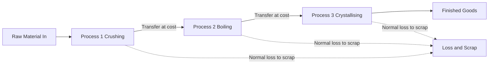
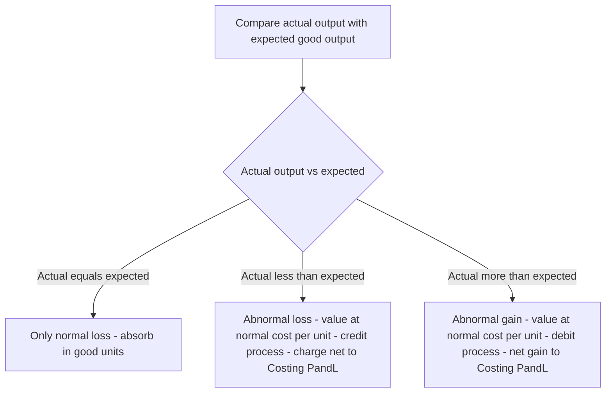
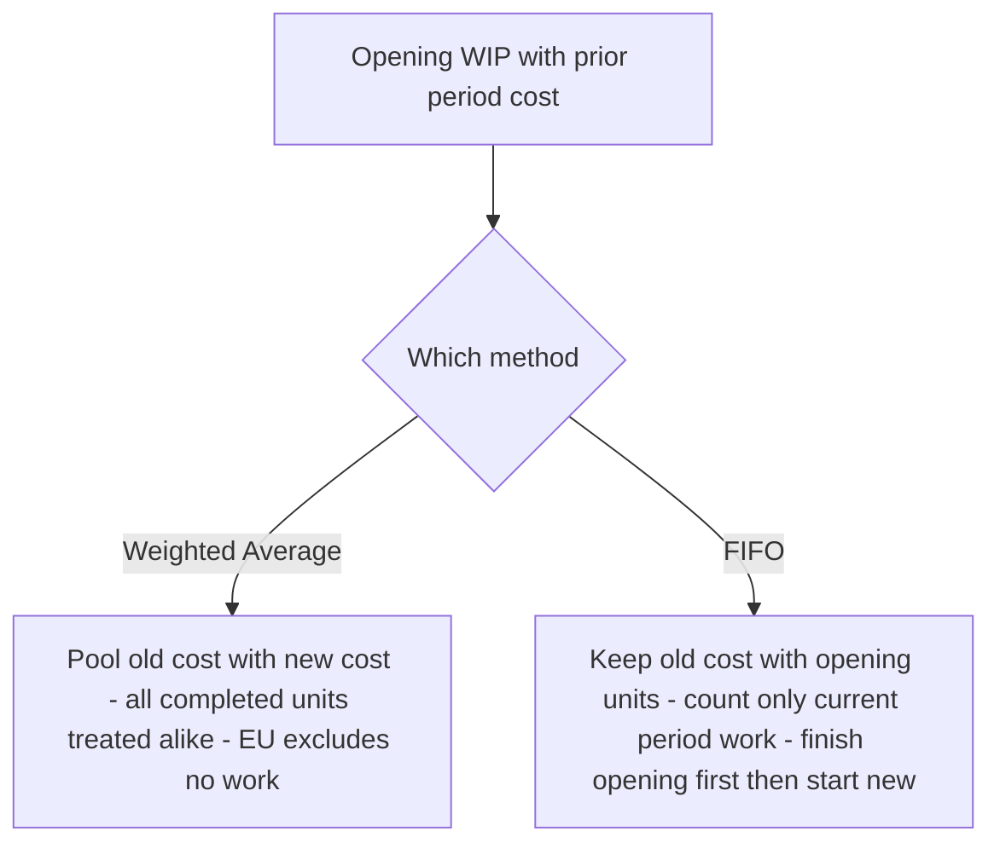

# Chapter 10 — Process & Operation Costing

## 1. The Problem: When You Cannot Point to "This Job"

Imagine you are the cost accountant of a sugar mill. Cane crushes at one end; refined sugar bags roll out at the other. In between there is juice extraction, clarification, evaporation, crystallisation, centrifuging. The plant never stops. Twenty thousand kilograms of sugar came out today. A buyer asks: *"What did it cost you to make one kilogram?"*

You reach for the tool you learned in Job Costing — collect the material, labour and overhead for **this particular kilogram**. And you freeze. There is no "this kilogram". Every crystal was made from a common river of juice, boiled in the same vats, spun in the same centrifuges. You cannot tag a job card to a sugar crystal. The output is **homogeneous** (every unit identical) and the production is **continuous** (an unbroken flow, not discrete orders).

Job costing answers *"what did this specific order cost?"* Process costing answers a different question: *"what did the average unit cost, as it flowed through each stage of a continuous plant?"*

Four hard sub-problems fall out of this the moment you look closely:

1. **The output is continuous and identical** — so we cost the *process*, not the *unit*, and divide at the end.
2. **Material is lost on the way** — evaporation, spillage, chemical reaction. Some loss is unavoidable and expected; some is a signal that something went wrong. These two must be treated **differently**, or the cost figure lies.
3. **At the stroke of midnight when we close accounts, some units are half-finished** — sitting in the evaporator, 60% boiled. How do you divide a period's cost between finished bags and a vat of half-cooked syrup?
4. **One process feeds the next** — juice becomes syrup becomes sugar. The output of Process 1 is the raw material of Process 2. How does cost *transfer*, and should each department book a notional profit on the transfer?

This chapter builds the machinery to answer all four — and it builds each tool only *after* you feel the pain it removes.

---

## 2. The Core Idea: The Relay Race and the Averaging Bucket

Think of production as a **relay race**. Each runner is a *process*. Runner 1 (crushing) carries the baton part of the way, does work on it, and hands it to Runner 2 (boiling), who adds more work and hands it to Runner 3 (crystallising). The baton is the semi-finished product. What passes between runners is **accumulated cost**: everything spent so far travels forward and becomes the "opening cost" of the next runner.

Now the averaging idea. Picture a giant **bucket** for each process. Into the bucket you pour every rupee spent in that process this period — material, wages, overhead, plus the cost handed over by the previous runner. At period-end you look at how many **good units** came out and simply divide:

> **Cost per unit = Total cost poured into the process ÷ Effective good units produced**

That single division is the heart of process costing. Everything else in this chapter — normal loss, abnormal loss, equivalent units, FIFO — exists only to make that division **honest**: to make sure the numerator (cost) and the denominator (units) are counted on the same, fair basis.

*Figure 1 — The relay of cost: each process accumulates its own cost and hands the total forward.*

---

## 3. Why It Is Built This Way

**Why cost the process, not the unit?** Because the units are indistinguishable, tracing cost to one unit is both impossible and pointless — the average *is* the truth when every unit is identical. Averaging is not a shortcut here; it is the only correct answer.

**Why a separate account for each process?** Because management needs to know *where* cost and *where* loss arise. If sugar is dear this month, the board wants to know whether it was the boiling house or the centrifuge that bled money. A process account is a mini profit-and-loss window on one department. It also produces the transfer price for the next department automatically.

**Why split loss into "normal" and "abnormal"?** Because they mean opposite things to a manager. A 5% evaporation loss is a **law of physics** — you *plan* for it, and its cost is a legitimate cost of the good output. A 12% loss when you expected 5% is a **failure** — a broken valve, a careless operator — and burying its cost inside good units would hide the failure and overstate what the product "should" cost. Good accounting makes problems *visible*. So normal loss is absorbed by good units; abnormal loss is stripped out and sent to the Costing Profit & Loss Account where management can see it.

**Why equivalent units?** Because a half-finished unit consumed roughly half a unit's worth of cost, and pretending it is either a whole unit or nothing would distort the per-unit cost of the finished goods. We convert partly-done work into its "whole-unit equivalent" so the numerator and denominator match.

Every rule below is a servant of one master principle: **make the cost per unit reflect economic reality.**

---

## 4. Full Technical Content

### 4.1 The Process Account — the basic format

Each process gets a T-account. Debits = costs flowing *in*; credits = output and losses flowing *out*.

| Dr — Process I Account | Units | ₹ | Cr | Units | ₹ |
|---|---|---|---|---|---|
| To Direct Materials | xxx | xxx | By Normal Loss (scrap value) | xx | xx |
| To Direct Wages | | xxx | By Abnormal Loss | xx | xx |
| To Direct Expenses | | xxx | By Process II A/c (transfer) | xxx | xxx |
| To Production Overhead | | xxx | By Closing WIP | xx | xx |
| To Abnormal Gain | xx | xx | | | |
| **Total** | | | | | |

Note where the two odd items sit: **Abnormal Loss** is a *credit* (it leaves the process, like output), while **Abnormal Gain** is a *debit* (it is added back). We will see why in a moment.

### 4.2 Normal loss — planned, unavoidable

**Normal loss** = the loss that *must* happen under efficient operating conditions (evaporation, shrinkage, unavoidable rejects). It is expressed as a percentage of input and is decided in advance from engineering/experience.

Two consequences flow from "it is a cost of making good units":

1. **It carries no cost of its own.** Its cost is *absorbed by the good units*. We do this by removing the lost units from the denominator.
2. **If the scrap has a saleable value**, that recovery *reduces* the net cost to be spread over good units.

> **Cost per good unit = (Total process cost − Scrap value of normal loss) ÷ (Input units − Normal loss units)**

The normal-loss units appear on the credit side **valued only at their scrap/realisable value** (often nil). They are *never* valued at the full process cost — that is the whole point.

### 4.3 Abnormal loss — the failure signal

**Abnormal loss** = actual loss *greater* than normal loss. It is the excess:

> **Abnormal loss units = Normal (expected) good output − Actual good output**
> (equivalently, Actual loss − Normal loss)

Because abnormal loss represents good units that *should* have been produced, it is valued at the **same cost per good unit** as the output — the full, honest per-unit cost:

> **Value of abnormal loss = Cost per good unit × Abnormal loss units**

It is credited out of the process (so it does not inflate the cost of good output), taken to an **Abnormal Loss Account**, where any scrap recovery on those units is credited, and the net loss is charged to the **Costing P&L Account**. Management now sees the rupee cost of inefficiency on the face of the accounts.

### 4.4 Abnormal gain — the pleasant surprise

**Abnormal gain** = when actual loss is *less* than the normal loss allowed — the process did better than the standard.

> **Abnormal gain units = Actual good output − Normal (expected) good output**

Now here is the subtlety that trips up half the exam hall. When we computed cost per unit, we *assumed* the full normal loss would occur and we credited the normal-loss account with the scrap value of the *full* normal loss. But fewer units were actually lost, so **we over-credited the scrap account** and must correct it. Hence:

- Abnormal gain is **debited to the process** (added back) at the **normal cost per good unit** — so the good units still bear only their fair average cost.
- The Abnormal Gain Account is credited by the process, then **debited** with the scrap value that was *not* realised (because those units were not actually scrapped), and the net gain goes to the **Costing P&L Account**.

*This asymmetry — abnormal loss loses its scrap to P&L as a recovery, abnormal gain gives back scrap it never earned — is exactly why the two cannot be treated the same way.*

*Figure 2 — Deciding the treatment of any loss or gain.*

### 4.5 Equivalent units (EU) — valuing the half-done

When there is opening or closing **work-in-progress**, the units are not all equally finished. A closing stock of 2,000 units that is 40% converted has, in cost terms, done the work of 2,000 × 40% = 800 fully-completed units. That 800 is its **equivalent units**.

> **Equivalent units = Physical units × Percentage of completion**

Crucially, completion is measured **separately for each cost element**, because materials, labour and overhead enter the process at different rates. Direct material is usually added *fully at the start*, so WIP is often 100% complete for material but only part-complete for **conversion cost** (labour + overhead). We therefore build a **statement of equivalent production** with a column per element.

The four-step engine:
1. **Statement of Equivalent Production** — convert physical output (completed, closing WIP, abnormal loss/gain) into EU, element by element.
2. **Statement of Cost per EU** — for each element, cost ÷ its equivalent units.
3. **Statement of Evaluation** — value each output stream (transferred, closing WIP, abnormal items) using the per-EU rates.
4. **Process Account** — post everything and confirm both sides balance.

### 4.6 Weighted Average vs FIFO — which cost, which units?

Once there is **opening WIP**, a question appears: this period's costs are mixed with last period's costs sitting in opening WIP. How do we combine them? Two philosophies:

**Weighted Average (WA).** Forget history. Treat opening-WIP cost and this period's cost as one pool, and treat all completed units alike.
- EU denominator = **completed units (100%) + closing WIP EU**. Opening WIP is *not* separately adjusted — its prior work is simply swallowed into the average.
- Cost per EU = **(opening WIP cost + current cost) ÷ EU**.
- Simple; but it *blends* last period's rates into this period's — so it slightly blurs cost control.

**FIFO (First-In-First-Out).** Respect the queue. The units in opening WIP are finished *first*, using their own already-incurred cost plus only the cost needed *this period to complete them*. Only then are fresh units started.
- EU denominator = **work done this period only** = (opening WIP × % *remaining* to complete) + (units started *and* completed) + (closing WIP EU).
- Cost per EU uses **current-period cost only**.
- Cost of finished goods comes in two layers: (a) opening WIP's brought-forward cost + cost to finish it, and (b) started-and-completed units at current rates.
- More work, but each period's cost per unit is "clean" — ideal for judging *this* period's efficiency.

*Rule of thumb: if the question gives you opening WIP with its own cost breakdown and asks for FIFO, you must isolate current-period cost and current-period work. If it says "average", pool everything.*

*Figure 3 — The two ways to handle opening WIP.*

### 4.7 Inter-process profit — why a department books profit on a transfer

Sometimes management wants each process to look like a mini-business: it "sells" its output to the next process at **cost plus a profit margin** (market-based transfer price). Reasons: to judge each department's efficiency against an outside benchmark, and to reveal whether it is cheaper to make in-house or buy out.

This creates one accounting problem: any **closing stock lying inside a later process contains profit added by earlier processes that has not been realised by a sale to the outside world**. That is *unrealised profit* and must be removed when preparing the balance sheet, so stock is not overstated. We track each figure in **three columns — Cost, Profit, Total** — throughout, and compute:

> **Unrealised profit in closing stock = (Profit element in the total column ÷ Total column value) × Closing stock value**

The stock is shown in the balance sheet at **cost = total − unrealised profit**, and a **Stock Reserve** provision is created for the profit removed.

---

## 5. Worked Examples

### Example 1 — The clean case: normal loss with scrap value (no WIP)

**Data.** Process I: input 1,000 units @ ₹4.10 = ₹4,100; direct wages ₹3,000; production overhead ₹3,000. Normal loss is 10% of input; scrap realises ₹2 per unit. Actual output = 900 units, all transferred to Process II.

**Step 1 — Normal loss.** 10% of 1,000 = **100 units**, scrap value 100 × ₹2 = **₹200**.

**Step 2 — Cost per good unit.**
Total cost = 4,100 + 3,000 + 3,000 = ₹10,100.
Cost per unit = (10,100 − 200) ÷ (1,000 − 100) = 9,900 ÷ 900 = **₹11.00**.

**Step 3 — Value output.** 900 × ₹11 = **₹9,900**. Actual output equals expected good output (900), so there is **no abnormal loss or gain**.

**Process I Account**

| Dr | Units | ₹ | Cr | Units | ₹ |
|---|---|---|---|---|---|
| To Materials | 1,000 | 4,100 | By Normal Loss (scrap) | 100 | 200 |
| To Wages | | 3,000 | By Process II A/c | 900 | 9,900 |
| To Overhead | | 3,000 | | | |
| **Total** | **1,000** | **10,100** | **Total** | **1,000** | **10,100** |

Both sides agree at ₹10,100 and 1,000 units. **Reconciled.**

---

### Example 2 — Abnormal loss (and its account)

**Data.** Process input 2,000 units @ ₹5 = ₹10,000; wages ₹5,000; overhead ₹4,000. Normal loss 10% of input; scrap value ₹5 per unit. **Actual output = 1,700 units.**

**Step 1 — Normal loss & expected output.** Normal loss = 10% × 2,000 = **200 units** (scrap 200 × ₹5 = **₹1,000**). Expected good output = 2,000 − 200 = **1,800 units**.

**Step 2 — Cost per good unit** (always on the *normal* basis):
Total cost = 10,000 + 5,000 + 4,000 = ₹19,000.
Cost per unit = (19,000 − 1,000) ÷ (2,000 − 200) = 18,000 ÷ 1,800 = **₹10.00**.

**Step 3 — Abnormal loss.** Actual output 1,700 < expected 1,800 → shortfall = **100 units abnormal loss**, valued at ₹10 = **₹1,000**.

**Process Account**

| Dr | Units | ₹ | Cr | Units | ₹ |
|---|---|---|---|---|---|
| To Materials | 2,000 | 10,000 | By Normal Loss (scrap) | 200 | 1,000 |
| To Wages | | 5,000 | By Abnormal Loss | 100 | 1,000 |
| To Overhead | | 4,000 | By Finished/Next Process | 1,700 | 17,000 |
| **Total** | **2,000** | **19,000** | **Total** | **2,000** | **19,000** |

**Abnormal Loss Account.** The 100 abnormal-loss units are still physically scrapped, fetching ₹5 each = ₹500. The rest is a real loss to the business.

| Dr — Abnormal Loss A/c | ₹ | Cr | ₹ |
|---|---|---|---|
| To Process A/c (100 × 10) | 1,000 | By Bank (scrap 100 × 5) | 500 |
| | | By Costing P&L A/c | 500 |
| **Total** | **1,000** | **Total** | **1,000** |

Management sees a clean **₹500 loss from inefficiency** — not buried in product cost. **Reconciled.**

---

### Example 3 — Abnormal gain (and the scrap correction)

**Data.** Input 1,000 units @ ₹8 = ₹8,000; wages ₹1,600; overhead ₹1,600. Normal loss 10% of input; scrap value ₹4 per unit. **Actual output = 950 units.**

**Step 1.** Normal loss = 100 units (scrap 100 × ₹4 = ₹400). Expected good output = 900 units.

**Step 2 — Cost per good unit:**
Total cost = 8,000 + 1,600 + 1,600 = ₹11,200.
Cost per unit = (11,200 − 400) ÷ (1,000 − 100) = 10,800 ÷ 900 = **₹12.00**.

**Step 3 — Abnormal gain.** Actual 950 > expected 900 → **50 units abnormal gain**, valued at ₹12 = **₹600**. Abnormal gain is *debited* to the process.

**Process Account**

| Dr | Units | ₹ | Cr | Units | ₹ |
|---|---|---|---|---|---|
| To Materials | 1,000 | 8,000 | By Normal Loss (scrap) | 100 | 400 |
| To Wages | | 1,600 | By Finished/Next Process | 950 | 11,400 |
| To Overhead | | 1,600 | | | |
| To Abnormal Gain A/c | 50 | 600 | | | |
| **Total** | **1,050** | **11,800** | **Total** | **1,050** | **11,800** |

*(Output valued 950 × 12 = 11,400.)*

**The scrap correction.** We credited Normal Loss with scrap on the *full* 100 units (₹400), but only 100 − 50 = **50 units were actually scrapped**, earning 50 × ₹4 = ₹200. The scrap account has been over-credited by ₹200, which belongs to the abnormal gain (those 50 gained units never became scrap).

**Abnormal Gain Account**

| Dr — Abnormal Gain A/c | ₹ | Cr | ₹ |
|---|---|---|---|
| To Normal Loss A/c (scrap not realised 50 × 4) | 200 | By Process A/c (50 × 12) | 600 |
| To Costing P&L A/c (net gain) | 400 | | |
| **Total** | **600** | **Total** | **600** |

**Normal Loss Account** (to see the whole loop)

| Dr — Normal Loss A/c | Units | ₹ | Cr | Units | ₹ |
|---|---|---|---|---|---|
| To Process A/c | 100 | 400 | By Bank (actual scrap 50 × 4) | 50 | 200 |
| | | | By Abnormal Gain A/c | 50 | 200 |
| **Total** | **100** | **400** | **Total** | **100** | **400** |

Net gain to Costing P&L = **₹400**. Every account closes. **Reconciled.**

---

### Example 4 — Equivalent units: Weighted Average vs FIFO on identical data

**Data.** A process has:
- **Opening WIP:** 4,000 units — Materials 100% complete (valued ₹18,000); Conversion 50% complete (valued ₹20,000).
- **Units introduced this period:** 16,000.
- **Costs added this period:** Materials ₹1,32,000; Conversion ₹1,68,000.
- **Completed and transferred out:** 18,000 units.
- **Closing WIP:** 2,000 units — Materials 100%, Conversion 40%.
- No process loss.

Material is added fully at start; "conversion" = labour + overhead combined.

**Physical reconciliation:** In = 4,000 + 16,000 = 20,000. Out = 18,000 + 2,000 = 20,000. ✔

---

#### 4A — Weighted Average method

**Step 1 — Statement of Equivalent Production**

| Output | Units | Material % | Material EU | Conversion % | Conversion EU |
|---|---|---|---|---|---|
| Completed & transferred | 18,000 | 100 | 18,000 | 100 | 18,000 |
| Closing WIP | 2,000 | 100 | 2,000 | 40 | 800 |
| **Total EU** | | | **20,000** | | **18,800** |

**Step 2 — Cost per EU** (opening cost pooled with current cost)

| Element | Opening ₹ | Added ₹ | Total ₹ | EU | Cost/EU ₹ |
|---|---|---|---|---|---|
| Material | 18,000 | 1,32,000 | 1,50,000 | 20,000 | 7.50 |
| Conversion | 20,000 | 1,68,000 | 1,88,000 | 18,800 | 10.00 |
| **Total** | **38,000** | **3,00,000** | **3,38,000** | | **17.50** |

**Step 3 — Evaluation**
- Transferred out: 18,000 × ₹17.50 = **₹3,15,000**.
- Closing WIP: Material 2,000 × 7.50 = 15,000 + Conversion 800 × 10 = 8,000 = **₹23,000**.

**Step 4 — Check:** 3,15,000 + 23,000 = **₹3,38,000** = total cost pooled. ✔

---

#### 4B — FIFO method (same data)

Under FIFO we count **only work done this period** and use **only current-period cost**.

Units **started and completed** this period = completed − opening WIP = 18,000 − 4,000 = **14,000**.

**Step 1 — Statement of Equivalent Production (FIFO)**

| Output | Units | Material EU | Conversion EU |
|---|---|---|---|
| To complete Opening WIP (Mat 0%, Conv 50% remaining) | 4,000 | 0 | 2,000 |
| Started & completed | 14,000 | 14,000 | 14,000 |
| Closing WIP (Mat 100%, Conv 40%) | 2,000 | 2,000 | 800 |
| **Total EU (work done this period)** | | **16,000** | **16,800** |

**Step 2 — Cost per EU (current-period cost only)**

| Element | Added ₹ | EU | Cost/EU ₹ |
|---|---|---|---|
| Material | 1,32,000 | 16,000 | 8.25 |
| Conversion | 1,68,000 | 16,800 | 10.00 |
| **Total** | **3,00,000** | | **18.25** |

**Step 3 — Evaluation**

*Completed & transferred (18,000 units), in two layers:*
- Opening WIP finished: brought-forward cost 38,000 + cost to complete conversion (2,000 EU × 10) 20,000 = **₹58,000** (for 4,000 units).
- Started & completed: 14,000 × ₹18.25 = **₹2,55,500**.
- **Total transferred = 58,000 + 2,55,500 = ₹3,13,500.**

*Closing WIP (2,000 units):* Material 2,000 × 8.25 = 16,500 + Conversion 800 × 10 = 8,000 = **₹24,500**.

**Step 4 — Check:** 3,13,500 + 24,500 = ₹3,38,000 = opening 38,000 + added 3,00,000. ✔

**The lesson in the contrast.** Same facts, both reconcile to ₹3,38,000, yet transferred cost differs: **WA ₹3,15,000 vs FIFO ₹3,13,500.** FIFO isolates this period's material rate (₹8.25) instead of blending it down with last period's cheaper material (WA ₹7.50) — so FIFO is the sharper tool for period-on-period cost control, while WA is simpler.

---

### Example 5 — Inter-process profit and unrealised profit in stock

**Data.** Product passes through Process I and Process II, then to Finished Stock. Each process transfers at a profit.

- **Process I:** Materials ₹20,000 + Wages ₹20,000 = cost ₹40,000. Output transferred to Process II at ₹50,000 (profit ₹10,000). No closing stock in I.
- **Process II:** receives transfer ₹50,000; adds Materials ₹30,000 and Wages ₹10,000. **Closing stock in Process II = ₹18,000** (at transfer/total value). Output transferred to Finished Stock at cost-of-goods + 25% profit on transfer price.

We keep three columns — **Cost, Profit, Total** — throughout.

**Process I** — all self-generated cost, so: Cost ₹40,000, Profit ₹10,000, **Total ₹50,000** transferred out.

**Process II — goods available before its own profit:**

| Element | Cost ₹ | Profit ₹ | Total ₹ |
|---|---|---|---|
| Transfer from Process I | 40,000 | 10,000 | 50,000 |
| Materials added | 30,000 | — | 30,000 |
| Wages added | 10,000 | — | 30,000 → **10,000** |
| **Goods available** | **80,000** | **10,000** | **90,000** |

*(The profit ₹10,000 in the Total column came entirely from Process I.)*

**Unrealised profit in Process II closing stock.** The ₹18,000 closing stock carries the *same proportion* of embedded profit as the goods available:

> Unrealised profit = 18,000 × (Profit 10,000 ÷ Total 90,000) = 18,000 × 0.1111 = **₹2,000**.

So closing stock splits as Cost ₹16,000 + Profit ₹2,000 = Total ₹18,000. Its **balance-sheet value = cost ₹16,000**, and a **Stock Reserve of ₹2,000** is created.

**Cost of goods transferred out of Process II** (goods available − closing stock):

| | Cost ₹ | Profit ₹ | Total ₹ |
|---|---|---|---|
| Goods available | 80,000 | 10,000 | 90,000 |
| Less Closing stock | 16,000 | 2,000 | 18,000 |
| **Cost of output** | **64,000** | **8,000** | **72,000** |

**Add Process II's own profit** at 25% on transfer price. Transfer price = 72,000 ÷ 0.75 = ₹96,000, so profit added = **₹24,000**.

**Transferred to Finished Stock:**

| | Cost ₹ | Profit ₹ | Total ₹ |
|---|---|---|---|
| Transfer to Finished Stock | 64,000 | 8,000 + 24,000 = **32,000** | 96,000 |

**Reconciling the true profit.**
- Apparent profit shown in the two processes = 10,000 (I) + 24,000 (II) = ₹34,000.
- Less unrealised profit locked in Process II closing stock = ₹2,000.
- **Realised (actual) profit = ₹32,000** — exactly the Profit column of the goods that actually moved to Finished Stock. ✔

The three-column discipline delivered both the correct stock value (₹16,000) *and* the correct realised profit (₹32,000) in one pass.

---

## 6. Presentation & Format

**Order of statements (with WIP):** always present them in this sequence so the examiner can follow the logic —
1. Statement of Equivalent Production
2. Statement of Cost per Equivalent Unit
3. Statement of Evaluation (apportionment of cost)
4. Process Account (final posting)

**Process Account conventions:**
- Show **units and rupees** in parallel columns on both sides; both column-totals must agree.
- Credit side order: **Normal Loss (at scrap value) → Abnormal Loss → Transfer to next process/Finished → Closing WIP.**
- Abnormal Gain appears on the **debit** side; Abnormal Loss on the **credit** side.
- Normal loss is valued at **scrap value only** (nil if not saleable); abnormal loss/gain at **normal cost per unit**.

**Supporting accounts to open:** Normal Loss A/c, Abnormal Loss A/c, Abnormal Gain A/c, Costing P&L A/c. For inter-process profit, maintain **Cost / Profit / Total** columns and a **Stock Reserve A/c**.

**Inter-process transfer:** the total of one process's output becomes the opening debit ("To Process I A/c") of the next.

---

## 7. Connections

- **Job & Batch Costing (Ch. 9):** the mirror image — job costing traces cost to *distinct* orders; process costing *averages* over identical continuous output. Batch costing sits between them. Knowing *which* the business is tells you which method is legal.
- **Joint Products & By-products:** a specialised process-costing situation where one process yields *several* different outputs from a common cost — the apportionment logic (physical units, sales value) is the sequel to this chapter.
- **Material & Labour Costing (Ch. 3–4):** the material, wages and overhead that feed each process account are computed with those chapters' tools; normal loss connects to **normal wastage** treatment in material control.
- **Overheads (Ch. 6):** production overhead absorbed into each process is the output of departmental absorption rates.
- **Cost Control & Standard Costing:** abnormal loss/gain are the raw material of variance analysis — they quantify inefficiency in rupees, which standard costing later refines.
- **Service/Operating Costing:** the same "cost the operation, divide by output" idea, applied to services (per passenger-km, per bed-day) instead of goods.

---

## 8. Traps & Examiner Tricks

1. **Valuing normal loss at full cost.** Normal loss units get **scrap value only** — never the per-unit process cost. Putting the full cost there destroys the whole absorption logic.
2. **Wrong denominator.** Cost per unit divides by **(input − normal loss)**, *not* by input. Forgetting to subtract normal loss inflates units and understates cost per unit.
3. **Forgetting scrap value in the numerator.** Deduct the scrap value of normal loss from cost *before* dividing. Skipping it overstates cost per unit.
4. **Abnormal loss/gain valued at the wrong rate.** Both are valued at the **normal cost per good unit**, using the same formula that priced the output — never at scrap value.
5. **The abnormal-gain scrap correction.** Examiners love this. When there is abnormal gain, the Normal Loss and Abnormal Gain accounts must exchange the **scrap value of the units that were *not* actually lost**. Omitting it leaves the accounts unbalanced.
6. **Abnormal gain on the wrong side.** Gain is a **debit** to the process (added back); loss is a **credit**. Reversing them is an instant red flag.
7. **FIFO with the wrong EU.** Under FIFO, opening WIP contributes only the **percentage remaining to be done**, not its full units. Counting opening WIP at 100% turns FIFO into (wrong) weighted average.
8. **Mixing current and total cost in FIFO.** FIFO uses **current-period cost only** for the per-EU rate; the opening WIP cost is added back as a *lump* when valuing completed goods.
9. **Element-wise completion ignored.** Material is usually 100% complete in WIP while conversion is partial. Applying one blanket percentage to all elements misvalues WIP.
10. **Abnormal loss/gain units in the EU statement.** When there is *both* WIP *and* abnormal loss/gain, the abnormal units must appear as a line in the equivalent-production statement (abnormal loss at its degree of completion; treat consistently).
11. **Inter-process profit — unrealised profit.** Compute it on **closing stock**, using the **profit-to-total ratio of goods available** (not the transfer margin). Show stock in the balance sheet **net of** this profit.
12. **Scrap value of abnormal loss forgotten.** Abnormal-loss units are still sold as scrap; that recovery reduces the amount charged to Costing P&L.

---

## 9. First-Principles Recap

Start from one immovable fact: **the output is identical and continuous, so no unit can be individually traced.** From that fact, everything else is forced:

- Because units are identical → **average** cost by dividing total process cost by good units. (The bucket.)
- Because production flows through stages → keep a **separate account per process** and **transfer accumulated cost forward.** (The relay.)
- Because some loss is unavoidable → call it **normal**, give it no cost, let good units absorb it, and value it only at scrap. Because loss beyond that signals failure → call it **abnormal**, value it at full unit cost, and **expose it in P&L** so management sees the rupees. Because doing *better* than the standard over-credits the scrap we assumed → **abnormal gain** is added back and must **return the unearned scrap.**
- Because closing accounts catches units half-done → convert them to **equivalent units** so numerator and denominator match, element by element.
- Because opening WIP mixes old and new cost → choose **weighted average** (pool and blend, simple) or **FIFO** (finish the queue first, clean current-period rate).
- Because we want each process judged like a business → transfer at **cost plus profit**, and strip the **unrealised profit** out of stock so the balance sheet tells the truth.

If you can regenerate every formula from "identical + continuous → average, honestly," you never need to memorise them.

---

## 10. Quick-Revision Sheet

**Cost per good unit (no WIP):**
> (Total process cost − Scrap value of normal loss) ÷ (Input units − Normal loss units)

**Normal loss:** units = % × input; valued at **scrap value only**; absorbed by good units.

**Abnormal loss:** = Expected good output − Actual output; valued at **normal cost/unit**; **credit** process → Abnormal Loss A/c → (less scrap recovery) → **Costing P&L**.

**Abnormal gain:** = Actual output − Expected good output; valued at **normal cost/unit**; **debit** process; Abnormal Gain A/c is **debited** with scrap value not realised (to Normal Loss A/c), net gain → **Costing P&L**.

**Equivalent units:** = Physical units × % completion, **computed per cost element.**

| | Denominator (EU) | Cost used |
|---|---|---|
| **Weighted Avg** | Completed 100% + Closing WIP EU | Opening WIP cost **+** current cost |
| **FIFO** | (Opening WIP × % to *complete*) + Started-&-completed + Closing WIP EU | **Current period cost only** |

**FIFO completed-goods cost** = Opening WIP cost b/f + cost to complete it + (Started & completed × current rate).

**Statement order:** Equivalent Production → Cost per EU → Evaluation → Process A/c.

**Process A/c layout:** Dr = Materials, Wages, Expenses, Overhead, **Abnormal Gain**. Cr = **Normal Loss (scrap)**, **Abnormal Loss**, **Transfer/Finished**, **Closing WIP**.

**Inter-process profit:** keep **Cost / Profit / Total** columns.
> Unrealised profit in closing stock = Closing stock × (Profit in total column ÷ Total column value)
> Balance-sheet stock = Total − Unrealised profit; create **Stock Reserve** for the difference.
> Realised profit = Sum of process profits − Unrealised profit in closing stocks.

**Operation costing:** a finer version of process costing — cost is ascertained **per operation** (not per whole process) where a product passes through many small standardised operations; per-unit cost of each operation = operation cost ÷ good units of that operation, summed across operations. Same loss and equivalent-unit logic applies at operation level.

**Golden checks before you close:** (1) Do the process-account **unit** totals agree? (2) Do the **rupee** totals agree? (3) Did you value normal loss at **scrap** and abnormal items at **full cost**? (4) In FIFO, did you use **current cost** and **remaining** work only?
