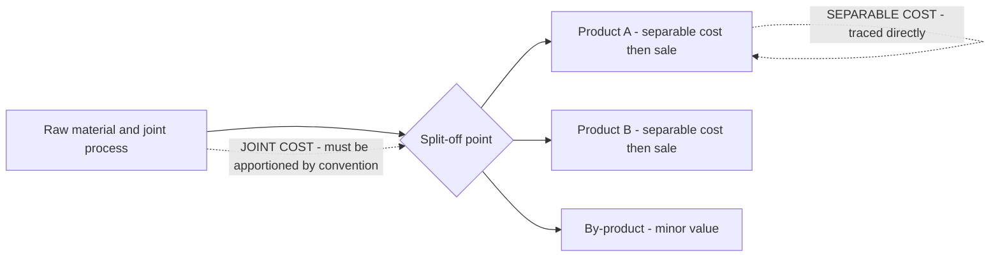
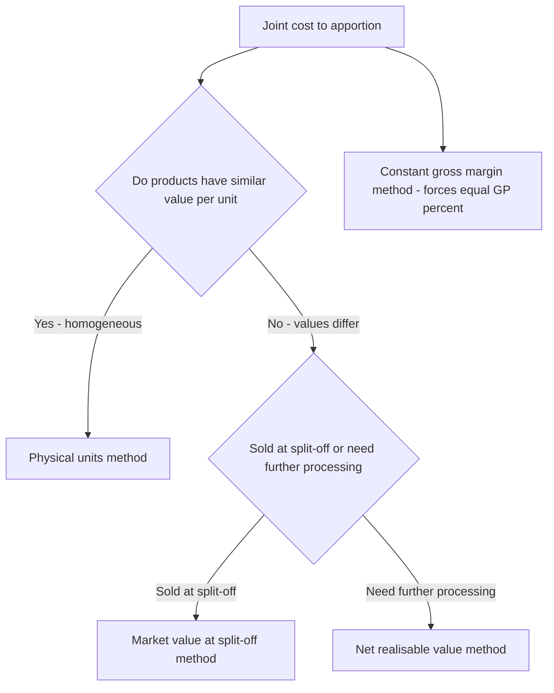
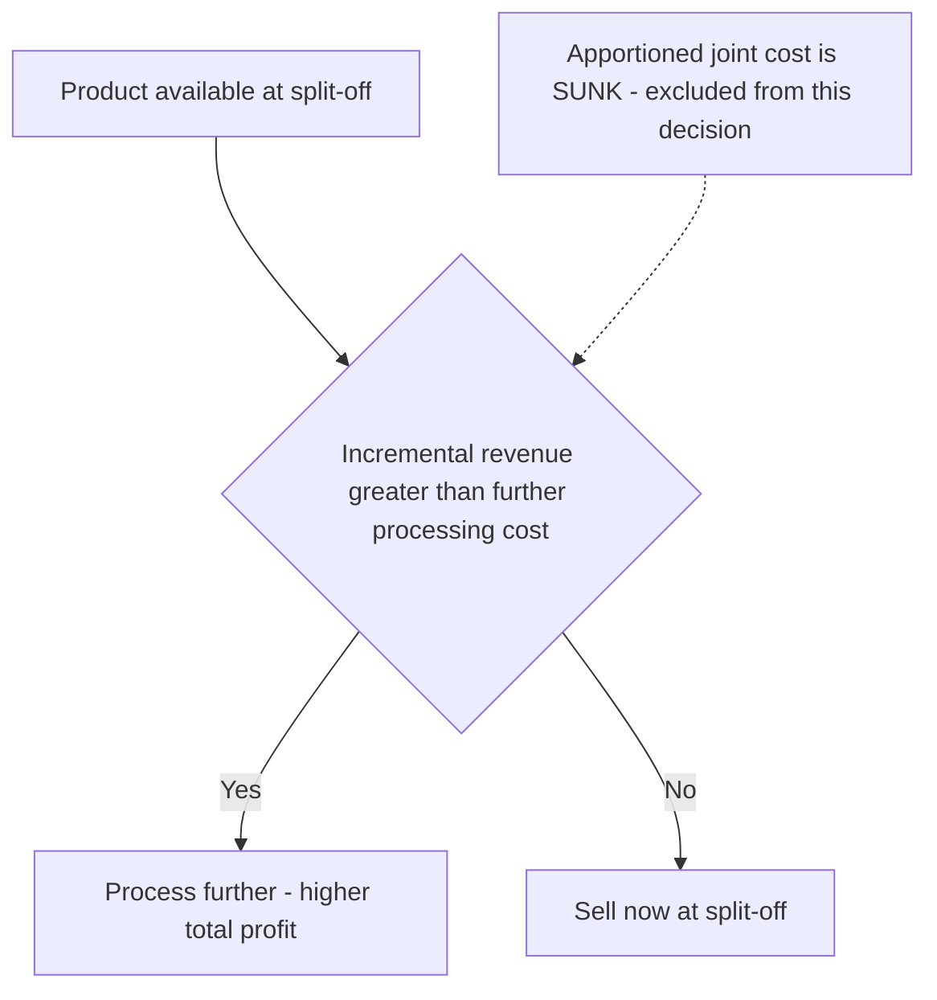

# Chapter 11 — Joint Products & By-Products

## 1. The Problem — One Furnace, Many Children

Every costing technique you have met so far rests on a quiet assumption: that a cost can, in principle, be *traced* to the thing that caused it. Job costing traces material and labour to a job card. Process costing traces cost to a stream of identical units flowing through a department. Even overhead, that slippery beast, is *apportioned* on some cause-and-effect logic (floor area, machine hours) so that in the end every rupee finds a home.

Now meet a class of industries where that assumption simply collapses.

Feed a barrel of **crude oil** into a refinery and heat it. Out of the *same* distillation column, at the *same* moment, from the *same* input, come petrol, diesel, kerosene, naphtha, lubricating oil and bitumen. Crush an **oilseed** and you get edible oil *and* oil-cake. Slaughter a **carcass** in a meat plant and you get prime cuts, offal, hide, bone and fat. Refine **sugar** and you get crystal sugar *and* molasses *and* bagasse. Smelt an **ore** and you recover copper *and* silver *and* gold from one furnace.

Here is the killer question. The refinery spends ₹2,00,000 heating one batch of crude. How much of that ₹2,00,000 belongs to the **diesel**, and how much to the **petrol**?

There is no honest answer. You cannot say "the diesel used more heat" because the heat was applied to the crude *as a whole*, before diesel and petrol even existed as separate substances. The cost was incurred **jointly**, on a mixture, at a stage when the individual products had not yet been born. You literally cannot buy petrol-heat and diesel-heat separately. The cost is common by *physics*, not by accounting laziness.

This is the **joint cost apportionment problem**, and it is the reason this chapter exists. We must find a *defensible* way to split a cost that is, by its nature, unsplittable — and we must know that whatever we do is a convention, not a truth. Worse, some of the products that emerge are trivial in value (the bagasse, the offal, the oil-cake), and lumping them in with the main products distorts everything. Those minor products — **by-products** — need their own treatment.

And lurking behind all of it is a decision trap: once petrol emerges, should the firm *sell it now* or *process it further* into a higher-grade fuel? Get the relevant-cost logic wrong here and you will happily destroy profit while congratulating yourself.

---

## 2. The Core Idea — The Shared Womb and the Moment of Birth

Picture a shared cooking pot. You put in stock, vegetables, spices and simmer for two hours. That two hours of gas is the **joint cost**. At the end you ladle the pot into three different bowls — a clear soup, a thick stew, a spicy broth. The instant you ladle them apart is the **split-off point** — the moment the products become *separately identifiable*.

Two truths flow from this image, and they govern the entire chapter:

**Truth 1 — Before split-off, cost belongs to the pot, not the bowls.** Any cost incurred *before* the ladle (the gas, the stock, the labour of stirring) is joint cost. It attaches to the *mixture*. Splitting it between bowls is an act of allocation by *convention* — we choose a sharing key (weight? value?) and live with it.

**Truth 2 — After split-off, cost belongs to the bowl.** If you then garnish the stew, or reduce the broth further, *that* cost is traceable to one product. It is a **further-processing cost** (also called *separable* or *subsequent* cost), and it never gets pooled or apportioned — it is charged directly to the product that incurred it.

So the whole subject organises itself around one vertical line — the split-off point:

*Figure 1 — The split-off point is the fault line: everything to its left is joint and must be shared by a rule; everything to its right is separable and belongs to one product.*

The **analogy that unlocks the popular method**: how would you fairly split the two-hour gas bill between soup, stew and broth? By *weight*? But a kilo of clear soup is worth far less than a kilo of rich stew — splitting by weight would dump most of the cost on the cheap, watery product and make it look unprofitable while the valuable stew looks like a goldmine. That is absurd. The fairer instinct is to split cost in proportion to what each bowl is *worth* — its ability to *bear* cost. That single instinct is the seed of the **Net Realisable Value method**, and it is why NRV dominates real practice.

---

## 3. Why It's Built This Way — Cost-Bearing Ability vs. Physical Bulk

Before we lay out mechanics, understand the philosophical fork, because every apportionment method is just one side of it.

There are only two possible bases for sharing a joint cost:

**(a) Share by physical bulk** — weight, volume, units. The logic: the process worked on physical stuff, so heavier products "used more of the process." Clean, objective, arithmetic — no market prices needed. Its fatal flaw: it ignores value. If your process yields 1 tonne of a ₹5/kg by-slurry and 100 kg of a ₹500/kg concentrate, the physical method loads ~91% of the cost onto the cheap slurry, showing it at a colossal loss and the concentrate at an absurd profit. That is not information; it is noise. Physical apportionment is only sensible when the products have *roughly similar value per unit*.

**(b) Share by value** — market realisation, or net realisable value. The logic: a joint cost is a *common* cost, and the classic accounting principle for sharing common costs is **"the beneficiary who gains most should bear most."** A product that fetches ₹500/kg is extracting far more benefit from the shared process than one fetching ₹5/kg; let it carry proportionately more cost. This is the **cost-bearing-ability** principle. Its beauty: it prevents any product from *automatically* showing a loss or profit merely because of the apportionment convention. Its cost: you need selling prices, and if products need further processing you must strip that out (hence *net* realisable value).

ICAI examiners lean on value-based methods precisely because joint-product decisions (which to push, whether to process further) must never be corrupted by an arbitrary weight-based split. But they still test physical units, and the elegant **constant gross-margin** method, so you must master all three. The map:

*Figure 2 — Choosing an apportionment method: homogeneity pushes you to physical units; value differences push you to a market-based method; NRV handles the common case where products are processed after split-off.*

---

## 4. Full Technical Content — Methods, Formulas and Entries with the "Why"

### 4.1 Definitions the examiner will hold you to

- **Joint products**: two or more products, each of *significant sales value*, produced *simultaneously* from a common process and common raw material, such that none can be regarded as the "main" product. (Petrol and diesel; edible oil and oil-cake in some framings.)
- **By-product**: a product of *relatively minor sales value* emerging *incidentally* alongside the main product(s) from the same process (molasses from sugar; sawdust from timber). The line between joint product and by-product is *relative sales value* and can shift over time — if the by-product's price soars, it may get reclassified as a joint product.
- **Co-products**: products made *together but not necessarily from the same raw material or process* and often in *controllable* proportions (e.g., different wheat varieties on adjacent fields). Distinguish from joint products, which come from *one* process in *fixed, uncontrollable* proportions. (Frequently asked as a one-mark distinction.)
- **Split-off point**: the point at which joint products become individually identifiable.
- **Joint cost**: total cost incurred up to the split-off point.
- **Separable / subsequent / further-processing cost**: cost incurred on an individual product *after* split-off.

### 4.2 Method 1 — Physical Units (Average Unit Cost) Method

Apportion joint cost in the ratio of the **physical quantity** (kg, litres, units) of each product at the split-off point.

$$\text{Cost per unit} = \frac{\text{Total joint cost}}{\text{Total units of all joint products}}$$

$$\text{Joint cost to a product} = \text{Cost per unit} \times \text{Units of that product}$$

- **Why it exists**: objective, needs no prices, ideal when products are physically similar and similarly priced.
- **The "why" of its weakness**: it silently assumes every kilo is equally valuable — false whenever prices differ. It can throw up products that "make a loss" purely because of the split.
- **Caution — consistent units**: if products come out in different units (litres vs kg vs cubic metres) you must convert to a *common* unit first, else the ratio is meaningless.

### 4.3 Method 2 — Market Value at Split-Off Point

Apportion joint cost in the ratio of the **sales value of each product at the split-off point** (quantity × selling price *at split-off*).

- **Why it exists**: applies cost-bearing ability directly using the price the product would fetch the instant it is born. Theoretically the *cleanest* value method because it uses the value *created by the joint process alone*, uncontaminated by later processing.
- **When you can use it**: only when a market price *exists at split-off*. Often it doesn't — petrol has no meaningful "half-refined" market — which is exactly why NRV was invented.

### 4.4 Method 3 — Net Realisable Value (NRV) Method — the workhorse

When products are processed *further* after split-off, their final selling price includes value added *after* the joint process. Charging joint cost on final sales value would over-reward the heavily-processed product. So we strip the after-split value back out:

$$\text{NRV at split-off} = \text{Final sales value} - \text{Post-split-off (separable) costs} - \text{Selling / distribution costs}$$

Then apportion joint cost in the ratio of NRVs.

**Why NRV is the popular method (know this cold — it's a favourite theory question):**
1. **It handles the realistic case** — most joint products *are* processed further, so a pure split-off price rarely exists; NRV *reconstructs* an equivalent split-off value.
2. **It respects cost-bearing ability** — cost follows value, so no product is condemned to an artificial loss.
3. **It isolates the joint process's own contribution** — by subtracting separable costs, it credits each product only with the value the *joint* stage created, which is what the joint cost should be shared against.
4. **It keeps the further-processing decision honest** — because separable costs are removed before apportionment, they remain visible as *incremental* costs for the "process further?" decision rather than being buried.

### 4.5 Method 4 — Constant (Uniform) Gross-Margin Percentage Method

The idea: since all products spring from one process, force *every* product to show the *same* gross-margin percentage on sales. Work backwards to find the joint cost that achieves this.

Steps:
1. Overall gross-margin % = (Total final sales − Total costs [joint + all separable]) ÷ Total final sales.
2. For each product: Gross profit = its sales × that %.
3. Total cost of each product = its sales − its gross profit.
4. **Joint cost of each product = its total cost − its own separable cost.**

- **Why it exists**: it embodies the view that no product is inherently "more profitable" than another when they share an unavoidable common origin — profitability differences would be an accident of the sharing rule, so eliminate them.
- **The catch to watch**: because it forces uniform margins, a product with *heavy* separable cost can be pushed to a *very low* or even **negative** joint-cost allocation. That is mathematically correct and reconciles, but shocks students. Do not "fix" it.

### 4.6 By-Product Accounting — two philosophies

By-products are minor, so the accounting aim is *simplicity*, not precision. Two families:

**(A) Non-cost / Sales-value methods** — treat by-product realisation as a *reduction of cost* or as *income*, without apportioning any joint cost *to* the by-product.
- **(i) Other income**: net sales of by-product credited to Costing P&L as miscellaneous income. Crudest; used when value is truly negligible and erratic.
- **(ii) Credit to process (net realisable value method for by-products)**: **Net** realisation of the by-product (its sales *less* its own selling and further-processing costs) is *deducted from the joint cost* of the main product before apportioning to the joint products. **This is the most common and examiner-preferred treatment.** Logic: the by-product's sale effectively *recovers* part of the joint cost, so the main products should bear only the *net* joint cost.

**(B) Cost methods** — actually assign a cost *to* the by-product:
- **(i) Opportunity / replacement cost method**: used when the by-product is *not sold* but *consumed internally* (e.g., fed back as fuel or raw material). Value it at the price the firm would otherwise have *paid to buy* it, and credit the main process with that saving.
- **(ii) Standard cost method**: charge the by-product out at a pre-set standard cost; any difference stays in the main product. Used for control where by-product volumes are steady.
- **(iii) Reverse-cost / working-back method**: start from the by-product's ultimate sale value and subtract *estimated profit, selling costs and post-split processing costs* to arrive back at a notional share of joint cost to remove from the main product. Used when the by-product has appreciable, stable value and you want a defensible joint-cost credit.

**The controlling rule**: for by-products you almost never apportion joint cost *forward onto* them; you use their realisation to *claw back* joint cost *off* the main products.

### 4.7 The Further-Processing Decision — relevant costs only

This is where students hemorrhage marks. Once a product exists at split-off you may sell it *as is* or *process it further* and sell it dearer. The decision rule is pure incremental analysis:

$$\text{Process further only if } \; \underbrace{(\text{Sales value after} - \text{Sales value at split-off})}_{\text{Incremental revenue}} \; > \; \underbrace{\text{Further-processing cost}}_{\text{Incremental cost}}$$

**The single most important sentence in this chapter:**

> **The joint cost apportioned to a product is IRRELEVANT to the further-processing decision.**

Why? Because the joint cost is *already incurred* the moment you reach split-off — it is **sunk**, and it is **identical** whether you sell now or process further. It cannot change with the decision, so it must not enter it. Only the *incremental* revenue and the *incremental* (separable) cost differ between the two courses of action; only they are relevant. A product can look "unprofitable" after joint-cost apportionment yet still be worth processing further — or worth selling at split-off — entirely independently of that apportioned figure.

*Figure 3 — The further-processing decision tree. Apportioned joint cost never enters the diamond; only incremental revenue versus incremental cost decides.*

---

## 5. Worked Examples — from gentle to exam-hard

### Example 1 (Easy) — Physical Units Method, full reconciliation

A single process costs **₹90,000** and simultaneously yields three joint products of similar value per kg:

| Product | Output (kg) |
|---|---|
| A | 2,000 |
| B | 3,000 |
| C | 4,000 |
| **Total** | **9,000** |

**Apportion the joint cost.**

Average cost per kg = ₹90,000 ÷ 9,000 kg = **₹10 per kg**.

| Product | Kg | × Rate | Joint cost (₹) |
|---|---|---|---|
| A | 2,000 | 10 | 20,000 |
| B | 3,000 | 10 | 30,000 |
| C | 4,000 | 10 | 40,000 |
| **Total** | **9,000** | | **90,000** |

**Reconciliation**: 20,000 + 30,000 + 40,000 = **₹90,000** = joint cost. ✔ Every rupee is placed. This is legitimate *because* the products are similar in value per kg; had C been worth ten times A, this split would mislead.

---

### Example 2 (Medium) — NRV vs. Constant Gross-Margin, contrasted

A joint process costs **₹4,00,000** and yields three products, each processed further after split-off:

| Product | Output (units) | Selling price after processing (₹) | Further-processing cost (₹) |
|---|---|---|---|
| X | 10,000 | 30 | 50,000 |
| Y | 8,000 | 25 | 30,000 |
| Z | 5,000 | 40 | 70,000 |

**Apportion the joint cost by (a) NRV and (b) Constant Gross-Margin, and compare.**

**Step 1 — Final sales value of each product:**

| Product | Units × Price | Final sales (₹) |
|---|---|---|
| X | 10,000 × 30 | 3,00,000 |
| Y | 8,000 × 25 | 2,00,000 |
| Z | 5,000 × 40 | 2,00,000 |
| **Total** | | **7,00,000** |

#### (a) Net Realisable Value method

NRV = Final sales − Further-processing cost.

| Product | Final sales | − Separable cost | = NRV (₹) |
|---|---|---|---|
| X | 3,00,000 | 50,000 | 2,50,000 |
| Y | 2,00,000 | 30,000 | 1,70,000 |
| Z | 2,00,000 | 70,000 | 1,30,000 |
| **Total** | | | **5,50,000** |

Apportion ₹4,00,000 in the ratio 2,50,000 : 1,70,000 : 1,30,000.

| Product | NRV share | Joint cost = 4,00,000 × share ÷ 5,50,000 (₹) |
|---|---|---|
| X | 2,50,000/5,50,000 | 1,81,818.18 |
| Y | 1,70,000/5,50,000 | 1,23,636.36 |
| Z | 1,30,000/5,50,000 | 94,545.45 |
| **Total** | | **4,00,000.00** |

**Reconciliation**: 1,81,818.18 + 1,23,636.36 + 94,545.45 = **₹4,00,000**. ✔

Resulting profit per product (a useful check that no product is forced into loss):

| Product | Final sales | − Joint cost | − Separable cost | = Profit (₹) |
|---|---|---|---|---|
| X | 3,00,000 | 1,81,818.18 | 50,000 | 68,181.82 |
| Y | 2,00,000 | 1,23,636.36 | 30,000 | 46,363.64 |
| Z | 2,00,000 | 94,545.45 | 70,000 | 35,454.55 |
| **Total** | **7,00,000** | **4,00,000** | **1,50,000** | **1,50,000** |

#### (b) Constant Gross-Margin Percentage method

Total costs = joint 4,00,000 + separable (50,000+30,000+70,000 = 1,50,000) = **₹5,50,000**.
Total gross profit = 7,00,000 − 5,50,000 = **₹1,50,000**.
Overall gross-margin % = 1,50,000 ÷ 7,00,000 = **21.4286%**.

Force each product to earn 21.4286% GP on its sales, then back out joint cost:

| Product | Sales | GP @ 21.4286% | Total cost = Sales − GP | − Separable | = Joint cost (₹) |
|---|---|---|---|---|---|
| X | 3,00,000 | 64,285.71 | 2,35,714.29 | 50,000 | 1,85,714.29 |
| Y | 2,00,000 | 42,857.14 | 1,57,142.86 | 30,000 | 1,27,142.86 |
| Z | 2,00,000 | 42,857.14 | 1,57,142.86 | 70,000 | 87,142.86 |
| **Total** | **7,00,000** | **1,50,000** | **5,50,000** | **1,50,000** | **4,00,000.00** |

**Reconciliation**: joint cost 1,85,714.29 + 1,27,142.86 + 87,142.86 = **₹4,00,000**. ✔ And each product now shows exactly 21.43% margin.

**Comparison / interpretation** — notice the two methods give *different* joint-cost splits (e.g. Z gets ₹94,545 under NRV but only ₹87,143 under constant-margin) even though both reconcile to ₹4,00,000. NRV lets margins *differ* between products (X 22.7%, Z 17.7%); constant-margin *forces* them equal. Neither is "true"; each is an internally consistent convention. The examiner's trap is to ask which product is "most profitable" — under constant-margin the honest answer is *they are equally profitable by construction*, which is precisely why that method is criticised for hiding real differences.

---

### Example 3 (Exam-Hard) — Joint products + by-product + further-processing decision, fully reconciled

*"Vindhya Chemicals"* runs one reaction process. Batch data:

- Joint (pre-split-off) process cost: **₹2,00,000**.
- Outputs from the batch:
  - **P** — 5,000 litres (main joint product)
  - **Q** — 4,000 litres (main joint product)
  - **R** — 1,000 litres (**by-product**)
- **By-product R**: sells for ₹8/litre; selling cost ₹1/litre. R is sold as it emerges (no further processing).
- At split-off, **P** can be sold for ₹40/litre and **Q** for ₹30/litre.
- **Further-processing options** after split-off:
  - **P** can be upgraded for ₹30,000 total and then sold at ₹50/litre.
  - **Q** can be upgraded for ₹25,000 total and then sold at ₹35/litre.

**Required:** (i) treat the by-product; (ii) decide further processing for P and Q; (iii) apportion joint cost to P and Q by market value at split-off; (iv) present a product-wise profit statement and reconcile overall profit.

---

**Step (i) — By-product treatment (credit net realisation to joint cost).**

Net realisation of R = 1,000 × (8 − 1) = 1,000 × 7 = **₹7,000**.
Using the examiner-preferred *NRV-credited-to-process* method, deduct this from joint cost:

Net joint cost to apportion to P and Q = 2,00,000 − 7,000 = **₹1,93,000**.

*(We do NOT push any joint cost onto R; its sale claws back cost from the main products.)*

---

**Step (ii) — Further-processing decision (relevant costs only; joint cost is sunk and ignored).**

| | P | Q |
|---|---|---|
| Incremental revenue = qty × (new price − split-off price) | 5,000 × (50 − 40) = **50,000** | 4,000 × (35 − 30) = **20,000** |
| Incremental (further-processing) cost | **30,000** | **25,000** |
| **Net incremental benefit** | **+20,000** | **−5,000** |
| **Decision** | **Process further** ✔ | **Sell at split-off** ✔ |

So **P is processed further** (adds ₹20,000 of profit); **Q is sold at split-off** (processing it would *destroy* ₹5,000). The apportioned joint cost — whatever it turns out to be — played no part in this, because it is identical under either choice.

---

**Step (iii) — Apportion the net joint cost ₹1,93,000 by market value at split-off.**

Sales value at split-off: P = 5,000 × 40 = 2,00,000; Q = 4,000 × 30 = 1,20,000; total = 3,20,000.

| Product | Split-off sales value | Ratio | Joint cost = 1,93,000 × ratio (₹) |
|---|---|---|---|
| P | 2,00,000 | 0.625 | 1,20,625 |
| Q | 1,20,000 | 0.375 | 72,375 |
| **Total** | **3,20,000** | 1.000 | **1,93,000** |

**Reconciliation**: 1,20,625 + 72,375 = **₹1,93,000**. ✔

---

**Step (iv) — Product-wise profit statement (using the optimal decisions: P processed, Q sold at split-off).**

| Particulars | P (₹) | Q (₹) | Total (₹) |
|---|---|---|---|
| Sales — P at 5,000 × 50; Q at 4,000 × 30 | 2,50,000 | 1,20,000 | 3,70,000 |
| Less: Apportioned joint cost | 1,20,625 | 72,375 | 1,93,000 |
| Less: Further-processing cost | 30,000 | — | 30,000 |
| **Profit** | **99,375** | **47,625** | **1,47,000** |

**Overall reconciliation (prove the total profit independently):**

| Total realisations | ₹ |
|---|---|
| P (5,000 × 50) | 2,50,000 |
| Q (4,000 × 30) | 1,20,000 |
| R net realisation | 7,000 |
| **Total** | **3,77,000** |

| Total costs incurred | ₹ |
|---|---|
| Joint process cost | 2,00,000 |
| Further processing of P | 30,000 |
| **Total** | **2,30,000** |

Overall profit = 3,77,000 − 2,30,000 = **₹1,47,000**, which exactly equals the sum of product profits (99,375 + 47,625). ✔✔ The by-product's ₹7,000 was credited to joint cost, so it is *embedded* in the lower joint cost apportioned to P and Q rather than showing as a separate line — and the totals still tie out.

*(Sanity note: had we wrongly let the apportioned joint cost drive the further-processing decision, we might have "sold P at split-off because its cost looked high," forgoing the genuine ₹20,000 gain. The reconciliation confirms the incremental logic was right.)*

---

## 6. Presentation / Format — how to lay it out in the exam

A joint-cost answer that reconciles but is *messy* still loses presentation marks. Use this skeleton:

**Working Note 1 — Apportionment of Joint Cost**

| Product | Basis (units / sales value / NRV) | Ratio | Joint cost (₹) |
|---|---|---|---|
| … | … | … | … |
| **Total** | | | **= given joint cost** |

**Working Note 2 — Further-Processing Decision** (only if asked)

| | Product 1 | Product 2 |
|---|---|---|
| Incremental revenue | | |
| Incremental cost | | |
| Decision | | |

**Main Statement — Product-wise Profitability**

| Particulars | Prod A | Prod B | Total |
|---|---|---|---|
| Sales | | | |
| Less: Joint cost (from WN1) | | | |
| Less: Separable cost | | | |
| **Profit / (Loss)** | | | |

**Golden presentation rules:**
1. **Always state the basis** of apportionment in words ("Joint cost apportioned on NRV basis") — examiners award method-identification marks.
2. **Show the ratio explicitly** before the split; never jump to rupee figures.
3. **Cross-total and prove** that apportioned joint cost sums back to the given joint cost — write "= joint cost ✔".
4. **By-product**: show its net realisation as a *deduction from joint cost* in a labelled line, not silently.
5. **Round consistently** (usually two decimals, or to the nearest rupee if the question uses whole numbers) and keep the reconciliation exact.

---

## 7. Connections — where this plugs into the rest of the syllabus

- **Process Costing (Ch. 10)**: joint-product costing *is* process costing up to the split-off point — the joint process is just a process account whose output is *several* products instead of one. Normal/abnormal loss, equivalent units and process accounts all still apply *before* split-off. This chapter adds the *apportionment* layer on top.
- **Cost Sheet & overhead apportionment (Ch. 3–4)**: joint-cost apportionment is the same "share a common cost by a sensible base" logic as overhead apportionment — only here the base is value (cost-bearing ability) rather than area or machine hours.
- **Marginal Costing & Decision-Making (Ch. 14)**: the further-processing decision is a pure **relevant-cost / incremental** decision — the *same* logic as make-or-buy, accept-or-reject, and shutdown decisions. Apportioned joint cost is the classic **sunk cost** those chapters warn you to ignore.
- **Standard Costing**: the by-product *standard cost* method links straight to standard-cost thinking.
- **Financial Accounting (AS 2 / Ind AS 2, Inventories)**: for *inventory valuation* of joint products, accounting standards permit a *rational and consistent* allocation — typically **relative sales value (NRV)** — so this chapter's NRV method is what feeds closing-stock valuation in the financial statements too.

---

## 8. Traps & Examiner Tricks

1. **Using final sales value instead of NRV.** If a product is processed *after* split-off, you must subtract the separable cost to get NRV *before* apportioning. Using the full final price over-loads the heavily-processed product. Read for the phrase "after further processing."

2. **Bringing joint cost into the further-processing decision.** The single biggest error. Apportioned joint cost is **sunk and irrelevant**. Compare only *incremental* revenue vs *incremental* cost. If the question gives you the joint-cost split *and* asks about further processing, the split is a distractor for the decision.

3. **Apportioning joint cost onto the by-product.** By-products normally get *no* joint cost. Their net realisation is *credited to* (deducted from) the joint cost of the main products. Watch the direction of the flow.

4. **Gross vs net by-product realisation.** Credit the **net** figure — by-product sales *minus* its own selling and further-processing costs. Students forget the selling cost of the by-product.

5. **Mixed physical units.** In the physical-units method, if outputs are in different units (kg, litres, m³) you must convert to a common measure first. Apportioning across incompatible units is meaningless.

6. **Negative joint-cost allocation under constant gross-margin.** When a product's separable cost is large relative to its sales, the method can assign it a *tiny or negative* joint cost. This is arithmetically correct — do not "adjust" it. State it and move on.

7. **Forgetting to reconcile.** The apportioned joint cost *must* sum to the given joint cost; product profits *must* sum to overall profit. If they don't, you have an error — and reconciling is where the last easy marks live.

8. **Joint product vs by-product misclassification.** Value decides. If the "by-product" fetches a value comparable to the mains, treat it as a joint product. Don't blindly follow the label in the question if the numbers contradict it — but note any assumption.

9. **"Which product is most profitable?" after constant-margin apportionment.** By construction every product shows the *same* margin — so profitability differences are an artefact of the method, not reality. The safe answer discusses this rather than naming a "winner."

10. **Selling costs vs further-processing costs.** Both reduce NRV, but keep them labelled separately; some questions give distribution cost *and* processing cost and expect both deducted.

---

## 9. First-Principles Recap

Strip everything away and you are left with four irreducible ideas:

1. **Some costs are joint by nature, not by neglect.** When one process births several products simultaneously, the pre-split-off cost genuinely cannot be traced. Any split is a *convention*, chosen for usefulness, never a discovered truth.

2. **The split-off point is the fault line.** Left of it, cost is joint and must be *apportioned by a rule*. Right of it, cost is separable and *traced directly*. Get this line right and the whole problem organises itself.

3. **Share common cost by cost-bearing ability.** The most defensible rule lets each product bear cost in proportion to the *value* it derives from the shared process — hence value/NRV methods dominate, with physical units reserved for genuinely homogeneous outputs.

4. **Decisions use incremental, not apportioned, cost.** Whether to process further, or which product to push, depends only on costs and revenues that *change* with the decision. Apportioned joint cost is sunk — it must be *reported* for stock valuation but *ignored* for decisions. Confusing the two is the master-error of this topic.

By-products are just the degenerate case: too small to deserve their own cost, so we let their sale *recover* joint cost off the main products.

---

## 10. Quick-Revision Sheet

**Key terms**
- *Joint cost* = cost incurred up to split-off (unsplittable, apportioned by convention).
- *Split-off point* = where products become separately identifiable.
- *Separable cost* = post-split-off cost, traced directly.
- *Joint product* = significant value; *By-product* = minor, incidental value.

**Apportionment methods**

| Method | Basis | Best when | Key formula |
|---|---|---|---|
| Physical units | Quantity (common unit) | Products similar in value/unit | Rate = Joint cost ÷ total units |
| Market value at split-off | Sales value at split-off | Split-off price exists | Ratio = qty × split-off price |
| **NRV** (workhorse) | Final sales − separable & selling costs | Products processed further | NRV = Final sales − further-proc − selling |
| Constant gross-margin | Force equal GP% | Products deemed equally profitable | Joint cost = (Sales − GP) − separable |

**Why NRV is popular** — handles further-processed products, respects cost-bearing ability, isolates the joint stage's own value contribution, keeps separable costs visible for decisions.

**By-product treatment (preferred)** — credit **net** realisation (sales − its selling/processing costs) as a **deduction from joint cost** of the main products; no joint cost pushed onto the by-product. (Other methods: other income; opportunity/replacement cost if consumed internally; standard cost; reverse-cost.)

**Further-processing rule**
$$\text{Process further iff } (\text{Sales after} - \text{Sales at split-off}) > \text{Further-processing cost}$$
> Apportioned joint cost is **SUNK — ignore it** in the decision.

**Reconciliation checklist**
1. Σ apportioned joint cost = given joint cost. ✔
2. Σ product profits = overall (independently computed) profit. ✔
3. By-product net realisation deducted, not added as forward cost. ✔
4. NRV used (not final sales) whenever there is further processing. ✔

**One-line memory hook**: *Share the womb by worth, trace the birth by hand, and decide by what changes.*
