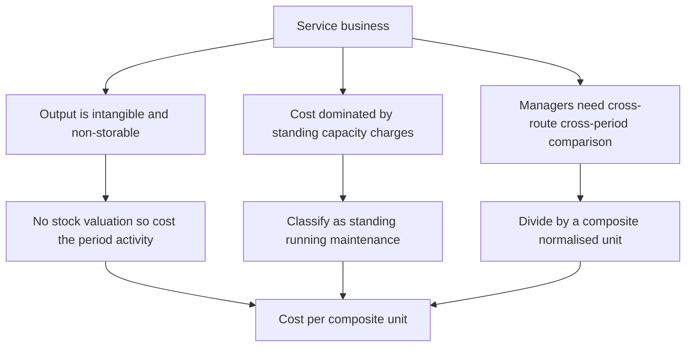
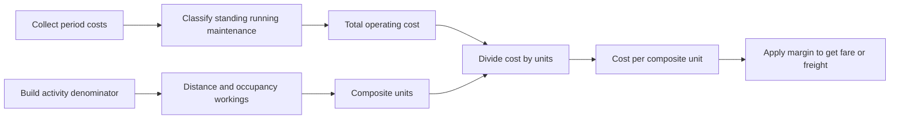
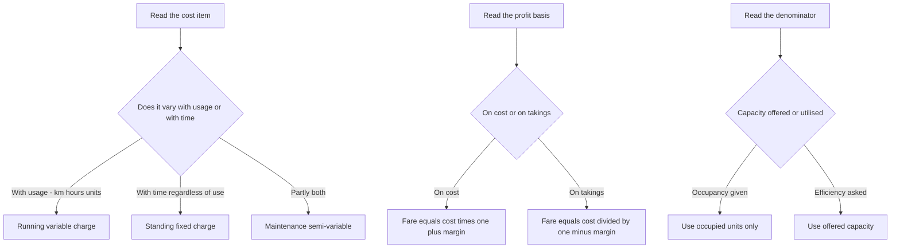
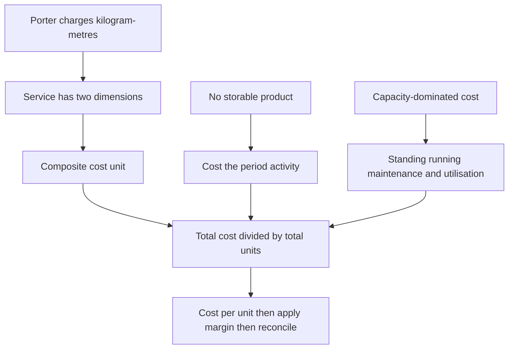

<!-- v2-deep -->

# Chapter 12 — Service Costing

## 1. The Problem — What Do You Cost When There Is Nothing to Hold?

Every method you have met so far quietly assumed a *thing*. Job costing costs a printed wedding card. Batch costing costs 10,000 tablets. Process costing costs a litre of caustic soda oozing out of the last vat. In each case there is a physical object at the end of the line, and the whole machinery of costing exists to answer one question: *what did this object cost to make?* You accumulate materials, labour and overhead against it, and when it walks out of the factory gate you know its cost.

Now walk into a different kind of business.

A **State Transport Corporation** runs 120 buses. At the end of the month it has spent ₹4.8 crore on diesel, drivers, tyres, depot rent, insurance and depreciation. What is the "product"? There is no product. Nothing was manufactured, nothing sits in a warehouse, nothing was sold across a counter. The bus left Bangalore full and arrived in Chennai empty of the very thing it "produced" — the *carriage of a passenger over a distance*. That service was consumed the instant it was created.

A **300-bed hospital** spends ₹6 crore a quarter on doctors, nurses, drugs, laundry, diet, power and equipment depreciation. What did it "make"? A recovered patient? A dead patient? A patient who checked out against medical advice? You cannot inventory a cured human being.

A **hotel**, a **canteen**, an **electricity utility**, a **university**, an **IT services firm**, a **courier company**, a **call centre** — none of them has a tangible, storable, countable unit of output. Yet every one of them must answer questions that are commercially *identical* to the manufacturer's:

- What did one unit of our service cost?
- Are we charging enough to cover it?
- Is Route 12 losing money while Route 7 subsidises it?
- Did cost per bed-day go up because of inefficiency or because occupancy fell?

**This is the problem service costing solves:** how to measure, control and price the cost of an *intangible, non-storable, instantly-consumed* output — when the classic assumption of "one physical unit of product" has collapsed.

The stakes are real and they are exam-relevant. If you pick the wrong cost unit you get a number that is *arithmetically correct and commercially useless* — like knowing your bus fleet cost ₹4.8 crore "per bus" without knowing whether the buses ran full or empty, near or far. The entire discipline of service costing is really the discipline of **choosing the right denominator.**

> Service costing is also called **operating costing** — because you are costing an *operation* (running a fleet, running a ward) rather than making a product. ICAI uses both terms interchangeably; expect either in the question paper.

### 1.1 Internal vs external services — a distinction the examiner exploits

A service is not always sold to an outside customer. ICAI splits service undertakings into two families, and the split changes *why* you are costing at all:

- **External (public-utility) services** — sold to outsiders for a price: a transport corporation, a hotel, a hospital charging patients, a power utility, a courier firm. Here the cost per unit feeds a **price/fare/tariff** and the reconciliation must prove the margin.
- **Internal (captive / departmental) services** — consumed *inside* the same organisation: a factory's own **boiler house** raising steam for the plant, an in-house **power plant**, the **transport pool** that ferries raw material between shops, the staff **canteen**, the internal **IT help-desk**. Here the cost per unit is not a selling price — it is a **transfer/recovery rate** used to *re-charge user departments* so that each department bears its fair share of the service. The output of an internal service becomes an **overhead** of the department that consumes it.

Why this matters in the exam: for an internal service there is usually **no profit margin** (you recover cost, not price), and the deliverable is a **rate per unit for re-apportionment** (₹ per kWh generated, ₹ per 1,000 kg of steam, ₹ per km of internal haulage). If a question about a "captive power plant" asks you to "add 20% profit," pause — captive services are normally recovered at cost unless the question explicitly creates an inter-company charge.

---

## 2. The Core Idea — Cost the *Effort-Distance*, Not the Object

Here is the analogy that unlocks the whole chapter.

Imagine you hire a porter at a railway station. He offers to carry your bag. How should he price the job? He cannot charge "per bag" — a feather-light bag carried 2 km is nothing like a 40 kg trunk carried 20 metres. He cannot charge "per metre" — because 40 kg over 20 m is real work and a feather over 20 m is not. The *only honest measure of what he did* is **weight multiplied by distance** — kilogram-metres. That single fused number captures both dimensions of his effort at once.

That fused, two-dimensional measure is the heart of service costing. It is called a **composite cost unit** (also *compound cost unit*).

Where a factory says "cost per tonne," a transport company says **cost per tonne-kilometre** — because carrying one tonne one kilometre is the true atom of what a truck *does*. A passenger bus says **cost per passenger-kilometre**. A hospital says **cost per patient-day** (one patient occupying one bed for one day). A power station says **cost per kilowatt-hour** (one kilowatt drawn for one hour). A hotel says **cost per room-day** (or bed-night). A steam plant says **cost per kg of steam**.

Notice the pattern. Each composite unit multiplies a **quantity dimension** (a tonne, a passenger, a bed, a kilowatt) by a **service dimension** (a kilometre travelled, a day occupied, an hour consumed). Costing the object alone lies; costing the service dimension alone lies; **costing their product tells the truth.**

*The porter charges kilogram-metres because neither the weight nor the walk alone describes his labour — only their product does. Every composite cost unit is a porter's charge.*

Once you internalise that one idea — *find the two dimensions of the service and fuse them* — the rest of the chapter is bookkeeping.

### 2.1 Simple vs composite units — and when one dimension legitimately collapses

Not every service needs two dimensions. The composite unit is required only when **both** dimensions vary independently and both matter. When one dimension is effectively constant, it drops out and a **simple unit** is correct:

- A **canteen** serves meals of broadly standard size — "distance" has no meaning, so the unit collapses to **per meal**. There is no "meal-something."
- A **cinema** sells admissions to a fixed-length show — the unit is **per ticket** or **per seat**, not "seat-hour," because show length is constant.
- A **water utility** delivers a homogeneous commodity — **per kilolitre** suffices; there is no time dimension because water is storable-ish and billed on volume.
- A **hospital**, by contrast, cannot use "per patient," because two patients staying 2 days and 20 days are wildly different loads — so **patient-day** is mandatory.

The examiner's favourite trap is to *offer* you a plausible simple unit ("cost per passenger," "cost per bed") when the correct answer fuses two dimensions ("cost per passenger-km," "cost per patient-day"). The test: **ask whether holding the quantity constant but stretching the service dimension changes the cost.** If a passenger carried 200 km costs more than one carried 5 km, distance matters, and you *must* fuse it in.

---

## 3. Why It Is Built This Way — The Three Structural Truths

Service costing looks like a grab-bag of tricks (passenger-km here, patient-day there). It is not. It flows from three structural truths about service businesses, and if you understand these three, you can *derive* the right treatment for any service you have never seen before — which is exactly what a hard exam question demands.

**Truth 1 — Output is intangible and non-storable, so cost must attach to a *measure of activity*, not to inventory.**
There is no closing stock of "carriage" or "patient care." Therefore there is no work-in-progress, no equivalent units, no closing-stock valuation. Every rupee spent in the period is a cost of the period's service. This *simplifies* one thing (no stock valuation) and *complicates* another (you must invent a unit of activity to divide by).

**Truth 2 — Cost is dominated by *capacity and standing charges*, not by *materials*.**
A manufacturer's cost is mostly materials that vary directly with output. A bus company's cost is mostly *the bus itself* — its depreciation, insurance, road tax, permit, garage rent, and the driver's salary — all of which are incurred **whether the bus carries 5 passengers or 50.** These are **standing (fixed) charges.** Only diesel, tyres and oil move with distance. This inverted cost structure is *why* service costing obsesses over **capacity utilisation** (occupancy %, load factor, seat-km offered vs sold). A near-empty bus and a full bus cost almost the same to run; the difference in *cost per passenger-km* is enormous. Hence the classification of costs (next section) is built around **standing vs running vs maintenance**, not around material/labour/overhead.

**Truth 3 — The unit must be *comparable across time, routes and peers*, so it must normalise for scale.**
"Total cost of the fleet" tells a manager nothing. "Cost per bus" is better but still lies if buses run different distances. "Cost per bus-km" is better still but ignores whether the bus was full. Only **cost per passenger-km** lets you compare a short crowded city route with a long thin highway route on equal terms, compare this March with last March, and compare your corporation with the one next door. The composite unit exists to make cost *portable* across contexts.

*The three structural truths of a service business each force one design choice, and the three choices converge on a single output — cost per composite unit.*

### 3.1 The consequence of Truth 2 — operating leverage and the "occupancy is destiny" rule

Because the fixed block dominates, service businesses have **high operating leverage**: a small change in utilisation produces a large swing in cost per unit and an even larger swing in profit. This is not decoration; it is directly examinable, because ICAI loves the sub-question "recompute cost per unit if occupancy rises to X%."

Mechanically, write total cost as `F + vN`, where `F` is the fixed block, `v` the variable cost per unit of activity, and `N` the number of composite units:

$$\text{Cost per unit} = \frac{F + vN}{N} = \frac{F}{N} + v$$

The variable component `v` is a floor that never falls; the fixed component `F/N` **collapses hyperbolically as N rises**. Double the occupancy and you (roughly) halve the `F/N` term. That single equation explains why a hotel discounts fiercely to fill the last rooms, why an airline sells stand-by seats cheap, and why a hospital chases occupancy. When a question says "what fare would you charge to fill empty seats," it is testing whether you know that the *relevant* cost of an extra passenger is only `v`, not the full cost per unit — a marginal-costing bridge (Section 7).

---

## 4. Full Technical Content — Methods, Formulas, Classifications, Formats

### 4.1 Selecting the Cost Unit — the Central Skill

A cost unit is fit for purpose when it satisfies three tests:

1. **Representative** — it must genuinely capture what the service delivers (carriage over distance; occupancy over time).
2. **Measurable** — the data to compute it must actually be collectable (you can log km run and passengers carried; you cannot log "customer happiness").
3. **Comparable** — it must normalise for scale so periods, routes and peers line up.

Sometimes a **simple unit** suffices (one dimension dominates); often a **composite unit** is required (two dimensions both matter). The examiner's favourite trap is offering you a simple unit when a composite one is correct.

| Service sector | Usual cost unit | Why this unit |
|---|---|---|
| Goods transport | **Tonne-kilometre** | Both load carried and distance matter |
| Passenger transport | **Passenger-kilometre** | Both persons carried and distance matter |
| Hospital | **Patient-day** (bed-day) | Both number of patients and length of stay matter |
| Hotel / lodging | **Room-day** or **bed-night** | Both rooms let and nights occupied matter |
| Canteen / catering | **Per meal** (or per dish) | Meals served is the natural output |
| Electricity | **Kilowatt-hour (kWh)** | Power drawn over time |
| Water supply | **Per kilolitre** | Volume delivered |
| Cinema | **Per ticket / per seat** | Admissions sold |
| Road maintenance | **Per kilometre of road** | Length maintained |
| IT / professional services | **Per chargeable hour** (per man-day) | Time is the billable resource |
| Education | **Per student** (or student-hour) | Students taught |
| Telecom | **Per call-minute** | Airtime consumed |
| **Boiler / steam plant** | **Per kg (or per 1,000 kg) of steam** | Mass of steam raised |
| **Toll road / bridge** | **Per vehicle-km** (or per PCU-km) | Vehicles carried over distance |
| **Airline** | **Per passenger-km / per tonne-km (cargo)** | Same logic as surface transport |
| **BPO / call centre** | **Per seat per shift** or **per call-minute** | Seat-time is the capacity sold |

### 4.2 The Two Ways to Build a Composite Unit — Absolute vs Commercial

For transport especially, ICAI distinguishes **two ways** of computing the composite tonne-km (or passenger-km), and choosing wrong is a classic error.

**Absolute (weighted) tonne-km** — compute tonne-km for *each leg separately* using that leg's own load, then add. This is the accurate method and is the **default** for cost computation.

$$\text{Absolute tonne-km} = \sum (\text{load on each trip} \times \text{distance of that trip})$$

**Commercial (average) tonne-km** — take the *average load* over all trips and multiply by *total distance*.

$$\text{Commercial tonne-km} = \text{Average load} \times \text{Total distance}$$

They differ whenever the load varies leg to leg. **Unless the question says "commercial," use absolute.** (Same logic applies to passenger-km.)

**The deeper why.** Absolute is a *weighted* sum — it lets a heavy load on a long leg pull the total up, exactly as a porter's charge should. Commercial *averages away* the correlation between load and distance. They are equal in exactly one case: when every leg carries the same load (then averaging loses no information). Whenever heavy loads travel on the longer legs, **absolute > commercial**; whenever heavy loads sit on the shorter legs, **absolute < commercial**. Being able to *predict the direction* of the gap before computing is a fast self-check the examiner rewards, and it is the reconciliation insight in Example 1.

### 4.3 Classification of Costs in the Service Sector

Because the cost structure is capacity-dominated (Truth 2), service costing classifies costs by **behaviour and function specific to operating**, not merely as material/labour/overhead. The master scheme for **transport** is the template; other sectors adapt it.

**A. Standing (Fixed) Charges** — incurred to *keep the capacity available*, independent of usage:
- Depreciation of vehicle (often; see note), road tax, permit fee, insurance premium
- Garage / depot rent, salaries of drivers and conductors *if paid monthly regardless of running*, administrative and supervisory salaries
- Licence fees

**B. Running (Variable / Operating) Charges** — vary directly with *distance / usage*:
- Diesel / petrol / fuel, lubricating oil
- Tyres and tubes (wear with distance)
- Driver/conductor wages *if paid per trip or per km*
- Commission on takings

**C. Maintenance (Semi-variable) Charges** — partly fixed, partly usage-driven:
- Repairs and servicing, spare parts, painting, overhauls
- Garage/workshop labour and consumables

> **Depreciation — the recurring examiner trick.** Depreciation may be **time-based** (e.g. straight-line on years → treat as a **standing** charge) or **usage/mileage-based** (e.g. per km run → treat as a **running** charge). *Read how the question states it.* If given as "₹X per annum" it is standing; if given as "₹Y per km" or "on the basis of km run" it is running.

**Interest and finance cost — the quietly-dropped item.** If the vehicle or asset is bought on a loan, the question sometimes gives "interest on capital / interest on loan." Treat it as a **standing charge** (it accrues with time, not usage) *unless the question tells you it is excluded from cost.* ICAI generally *includes* interest on capital in operating cost statements when the data is supplied — do not silently drop it as "financial." Flag: watch for whether interest is on the *whole* cost or on *average* capital employed (cost + scrap)/2; use exactly what the question defines.

The parallel classifications for other sectors:

| Sector | Fixed / capacity costs | Variable / activity costs | Semi-variable |
|---|---|---|---|
| **Hospital** | Doctors' & nurses' salaries, building depreciation, equipment depreciation, admin, rent | Drugs & medicines, diet/food, disposables, laundry per load | Power, water, maintenance |
| **Hotel** | Staff salaries, building & furniture depreciation, rates & taxes, interior renovation | Linen, guest supplies, food, laundry | Power, cleaning, repairs |
| **Canteen** | Cook & staff wages, kitchen equipment depreciation, rent | Provisions, groceries, fuel/gas, milk | Power, cleaning, crockery replacement |
| **Power (captive)** | Plant depreciation, operating-staff salaries, interest on capital | Fuel/coal, water, consumable stores | Repairs & maintenance |
| **Boiler / steam** | Boiler depreciation, supervision salaries | Fuel/coal, treated water, chemicals | Repairs, cleaning |

### 4.4 The Cost-Per-Unit Formula and the Standard Statement

The engine is always the same:

$$\text{Cost per composite unit} = \frac{\text{Total operating cost for the period}}{\text{Total composite units for the period}}$$

Everything hard is in the *denominator* — building the correct passenger-km / tonne-km / patient-day figure, allowing for occupancy, load factor, return trips, and idle days.

**Building the denominator for transport — the checklist:**

1. **Effective (running) days** = total days − idle/maintenance days.
2. **Trips/day and round trips** — a *round trip* covers the distance twice; count both legs.
3. **Distance run** = days × trips × km per trip (× 2 for return legs if a trip is one-way).
4. **Capacity actually used** = seats × load factor (passengers), or tonnes × capacity utilisation (goods).
5. **Composite units** = distance × capacity used (absolute method: per leg).

**Two flavours of the per-unit answer — "per unit of capacity offered" vs "per unit sold."** Sometimes the examiner wants *both*:
- **Cost per km run** (or per bus-km / per seat-km *offered*) — divides by the *capacity dimension*, ignoring how full you were. This is a productivity/efficiency measure.
- **Cost per passenger-km (sold)** — divides by *utilised* capacity. This is the pricing measure.

The gap between them is the price of empty seats. If cost per seat-km is ₹0.60 and load factor is 80%, cost per passenger-km is ₹0.60 ÷ 0.80 = ₹0.75. Being able to move between "offered" and "sold" denominators cleanly is a mark-scoring skill.

### 4.5 Format of the Operating Cost Statement (Transport)

| Particulars | Per period (₹) | Per km (₹) | Per passenger-km (₹) |
|---|---:|---:|---:|
| **A. Standing charges** | | | |
| Depreciation (time-based) | xxx | | |
| Insurance, road tax, permit | xxx | | |
| Driver & conductor salary (monthly) | xxx | | |
| Garage rent, admin salaries | xxx | | |
| **Sub-total A** | **XXX** | | |
| **B. Running charges** | | | |
| Diesel & oil | xxx | | |
| Tyres & tubes | xxx | | |
| Depreciation (mileage-based) | xxx | | |
| **Sub-total B** | **XXX** | | |
| **C. Maintenance charges** | | | |
| Repairs & spares | xxx | | |
| **Sub-total C** | **XXX** | | |
| **Total operating cost (A+B+C)** | **TTT** | ttt | ttt |
| Add: Profit / markup | ppp | | |
| **Total takings / fare required** | **FFF** | | |

> **Fare from cost — watch the base.** If profit is quoted "on cost," fare = cost × (1 + margin). If quoted "on takings/fare" (i.e., on sales), then cost is (1 − margin) of fare, so **fare = cost ÷ (1 − margin).** Mixing these up is the single most common fare-calculation error.

### 4.6 Two format subtleties that separate a clean answer from a messy one

**(i) The per-km column must reconcile down.** Every running-charge line has a natural "per km" figure; every standing-charge line does *not* (it is a lump per period, converted to per-km only by dividing by total km). A disciplined answer shows standing charges as a single "per km" figure (Sub-total A ÷ km) rather than pretending each fixed line is "per km." The examiner can see at a glance that you understand *which costs are genuinely per-km*.

**(ii) One vehicle vs a fleet.** If the question gives fleet data (say 10 buses, different routes), decide early whether the cost unit is per-vehicle or fleet-wide. For a homogeneous fleet you can cost one representative bus and scale. For a mixed fleet (different capacities/routes) you must build **fleet total passenger-km** and **fleet total cost** and divide once — averaging per-bus rates is wrong because it weights a lightly-used bus equally with a heavily-used one.

---

## 5. Worked Examples — From Easy to Exam-Hard, Fully Reconciled

### Example 1 (Easy) — Goods Transport: Absolute vs Commercial Tonne-km

**Data.** A truck of 10-tonne capacity makes the following trips in a day from depot D:
- D → A (40 km) carrying 10 tonnes; returns empty A → D (40 km).
- D → B (30 km) carrying 8 tonnes; returns empty B → D (30 km).

Total operating cost for the day = **₹9,000.** Find (i) absolute tonne-km, (ii) commercial tonne-km, (iii) cost per absolute tonne-km.

**Step 1 — Absolute (weighted) tonne-km, per leg:**

| Leg | Load (t) | Distance (km) | Tonne-km |
|---|---:|---:|---:|
| D→A loaded | 10 | 40 | 400 |
| A→D empty | 0 | 40 | 0 |
| D→B loaded | 8 | 30 | 240 |
| B→D empty | 0 | 30 | 0 |
| **Total** | | **140** | **640** |

Absolute tonne-km = **640.**

**Step 2 — Commercial (average) tonne-km:**
Average load = total tonne-km ÷ total distance is *not* the definition here; commercial uses average load across trips.
Average load over the four legs = (10 + 0 + 8 + 0) ÷ 4 = 4.5 tonnes.
Total distance = 140 km.
Commercial tonne-km = 4.5 × 140 = **630.**

**Step 3 — Cost per absolute tonne-km** = 9,000 ÷ 640 = **₹14.06.**

**Reconciliation / insight.** Absolute (640) exceeds commercial (630) because loading is concentrated on the longer leg (10 t over 40 km), which absolute rewards leg-by-leg but commercial dilutes by averaging. Cost computation uses the **absolute** figure. Empty return legs cost fuel but earn zero tonne-km — this is *why* the cost per tonne-km (₹14.06) is far above what you'd guess from cost per loaded-tonne-km alone; the deadhead return is baked into the rate.

**What if the examiner tweaks it — a paid back-load appears.** Suppose the return legs are no longer empty: A→D carries 4 t and B→D carries 5 t. Recompute absolute: 400 + (4×40) + 240 + (5×30) = 400 + 160 + 240 + 150 = **950 tonne-km**, and cost per tonne-km falls to 9,000 ÷ 950 = **₹9.47** — a 33% drop with *no change in cost*, purely from killing deadhead. This is the single most powerful lever in goods transport and a favourite "comment on your result" mark. Note the direction flip on the two methods too: commercial average load = (10+4+8+5)/4 = 6.75 t × 140 = 945, so now absolute (950) is only marginally above commercial (945) because loads are more even across legs.

---

### Example 2 (Moderate) — Passenger Transport: Full Operating Cost Statement & Fare

**Data.** Sri Bus Co. runs one bus between town X and town Y, distance **50 km**, capacity **40 passengers.**
- The bus makes **2 round trips per day.**
- It runs **25 days** a month.
- Average occupancy (load factor) = **80%** of capacity.

Costs per month:
- Driver's salary ₹18,000; Conductor's salary ₹12,000
- Insurance ₹2,400; Road tax & permit ₹1,600; Garage rent ₹3,000
- Depreciation (time-based) ₹15,000
- Diesel & oil ₹52,000; Tyres & maintenance ₹8,000; Repairs ₹6,000

The company wants a **profit of 20% on takings (fare).** Compute (a) total monthly distance, (b) passenger-km, (c) total operating cost, (d) cost per passenger-km, (e) fare per passenger-km.

**Step 1 — Distance run per month.**
One round trip = 50 × 2 = 100 km. Two round trips/day = 200 km/day.
Monthly distance = 200 × 25 = **5,000 km.**

**Step 2 — Passenger-km (denominator).**
Seats available per km run = 40; occupied = 80% × 40 = 32 passengers.
Passenger-km = distance × passengers carried = 5,000 × 32 = **1,60,000 passenger-km.**

**Step 3 — Total operating cost.**

| Particulars | ₹/month |
|---|---:|
| **Standing charges** | |
| Driver's salary | 18,000 |
| Conductor's salary | 12,000 |
| Insurance | 2,400 |
| Road tax & permit | 1,600 |
| Garage rent | 3,000 |
| Depreciation (time) | 15,000 |
| **Sub-total (A)** | **52,000** |
| **Running charges** | |
| Diesel & oil | 52,000 |
| Tyres & maintenance | 8,000 |
| **Sub-total (B)** | **60,000** |
| **Maintenance charges** | |
| Repairs | 6,000 |
| **Sub-total (C)** | **6,000** |
| **Total operating cost** | **1,18,000** |

**Step 4 — Cost per passenger-km** = 1,18,000 ÷ 1,60,000 = **₹0.7375 per passenger-km.**

**Step 5 — Fare per passenger-km.** Profit is 20% **on takings**, so cost is 80% of fare.
Fare = cost ÷ (1 − 0.20) = 0.7375 ÷ 0.80 = **₹0.921875 ≈ ₹0.9219 per passenger-km.**

**Reconciliation.** Total takings = fare × passenger-km = 0.921875 × 1,60,000 = **₹1,47,500.**
Check profit = takings − cost = 1,47,500 − 1,18,000 = **₹29,500**, and 29,500 ÷ 1,47,500 = **20.0%** of takings. ✓
Fare per passenger for the full 50 km one-way trip = 0.921875 × 50 = **₹46.09.**

**What if the examiner tweaks it — "20% on cost" instead of "on takings."** Then fare = 0.7375 × 1.20 = **₹0.885 per passenger-km**, takings = 0.885 × 1,60,000 = **₹1,41,600**, profit = 1,41,600 − 1,18,000 = **₹23,600 = 20% of cost**. Notice the *same words "20% profit" produce two different fares* (₹0.9219 vs ₹0.885). This is exactly why Trap 2 exists — one phrase changes the whole answer.

---

### Example 3 (Exam-Hard) — Transport with Idle Days, Return Legs, Load Factor, and Per-km Depreciation

**Data.** A logistics firm owns a **9-tonne** truck operating on a fixed route from depot P.
- Distance P → Q = **120 km** (one way). The truck does **one round trip per day.**
- On the **outward** leg it carries a **full 9 tonnes**; on the **return** leg it carries **6 tonnes** of back-load.
- The truck operates **26 days** a month but was **idle for 2 days** under repair (so effective days = 24).
- Cost of truck ₹27,00,000; life 5 years, scrap ₹3,00,000; **depreciation charged per km run** at a rate you must derive from an estimated life of **6,00,000 km.**

Monthly costs:
- Driver & cleaner wages ₹32,000; Insurance ₹6,000; Road tax & permit ₹4,000; Garage rent ₹8,000; Admin & supervision ₹10,000.
- Diesel: truck gives **4 km per litre**; diesel ₹90/litre. Oil & lubricants ₹0.50 per km. Tyres ₹1.20 per km. Repairs & maintenance ₹15,000 for the month (fixed portion) plus ₹0.80 per km (variable portion).

Required: (a) total km run, (b) absolute tonne-km, (c) full operating cost statement split standing/running/maintenance, (d) cost per tonne-km, (e) freight rate per tonne-km to earn **25% profit on cost.**

**Step 1 — Km run.**
Round trip = 120 × 2 = 240 km/day. Effective days = 26 − 2 = 24.
Total km = 240 × 24 = **5,760 km.**

**Step 2 — Absolute tonne-km (per leg, per day, then month).**

| Leg | Load (t) | Distance (km) | Tonne-km/day |
|---|---:|---:|---:|
| Outward P→Q | 9 | 120 | 1,080 |
| Return Q→P | 6 | 120 | 720 |
| **Per round trip** | | 240 | **1,800** |

Monthly absolute tonne-km = 1,800 × 24 = **43,200 tonne-km.**

**Step 3 — Depreciation rate (per km).**
Depreciable amount = 27,00,000 − 3,00,000 = 24,00,000 over 6,00,000 km.
Rate = 24,00,000 ÷ 6,00,000 = **₹4.00 per km** → this is a **running** charge (usage-based).
Depreciation for month = 4.00 × 5,760 = **₹23,040.**

**Step 4 — Running cost components (per km × 5,760 km).**
- Diesel: 4 km/litre → 5,760 ÷ 4 = 1,440 litres × ₹90 = **₹1,29,600.** (Equivalently ₹22.50/km.)
- Oil & lubricants: 0.50 × 5,760 = **₹2,880.**
- Tyres: 1.20 × 5,760 = **₹6,912.**
- Depreciation (from Step 3) = **₹23,040.**
- Variable repairs: 0.80 × 5,760 = **₹4,608.**

**Step 5 — Full operating cost statement.**

| Particulars | ₹/month |
|---|---:|
| **A. Standing charges** | |
| Driver & cleaner wages | 32,000 |
| Insurance | 6,000 |
| Road tax & permit | 4,000 |
| Garage rent | 8,000 |
| Admin & supervision | 10,000 |
| **Sub-total (A)** | **60,000** |
| **B. Running charges** | |
| Diesel | 1,29,600 |
| Oil & lubricants | 2,880 |
| Tyres | 6,912 |
| Depreciation (per km) | 23,040 |
| **Sub-total (B)** | **1,62,432** |
| **C. Maintenance charges** | |
| Repairs — fixed | 15,000 |
| Repairs — variable | 4,608 |
| **Sub-total (C)** | **19,608** |
| **Total operating cost (A+B+C)** | **2,42,040** |

**Step 6 — Cost per tonne-km** = 2,42,040 ÷ 43,200 = **₹5.6028 per tonne-km.**

**Step 7 — Freight rate at 25% profit on cost.**
Rate = 5.6028 × 1.25 = **₹7.0035 per tonne-km.**

**Reconciliation.** Total freight = 7.0035 × 43,200 = **₹3,02,551** (rounding).
Cleaner check without rounding: freight = cost × 1.25 = 2,42,040 × 1.25 = **₹3,02,550.**
Profit = 3,02,550 − 2,42,040 = **₹60,510 = 25%** of cost 2,42,040. ✓
Cost per km = 2,42,040 ÷ 5,760 = **₹42.02/km** (a useful secondary check the examiner may also ask).

*Note the two depreciation-style traps handled: here it was explicitly **per km / mileage-based**, so it went into running charges. Had the question said "₹4,80,000 per annum (₹40,000/month) on straight line," it would have been a **standing** charge instead — and cost per tonne-km would change. Always read the basis.*

**What if the examiner tweaks it — depreciation switched to time-based.** Suppose instead "depreciate ₹24,00,000 over 5 years straight-line" = ₹4,80,000/yr = ₹40,000/month, a **standing** charge. Then Sub-total A becomes 60,000 + 40,000 = ₹1,00,000; Sub-total B loses the ₹23,040 depreciation and becomes ₹1,39,392; total cost = 1,00,000 + 1,39,392 + 19,608 = **₹2,59,000**. Cost per tonne-km = 2,59,000 ÷ 43,200 = **₹5.995 ≈ ₹6.00** — up from ₹5.60. The *same asset, same period* gives a different cost purely from the depreciation basis, and the gap (₹40,000 − ₹23,040 = ₹16,960) is exactly the difference between a full month's straight-line charge and the mileage charge for only 5,760 of the ~10,000 km/month the asset was designed for. This is the mechanism behind Trap 1.

---

### Example 4 (Exam-Hard) — Hospital Costing: Cost per Patient-Day

**Data.** A charitable hospital runs a **60-bed** ward for a **30-day** month.
- Average bed occupancy = **75%.**
- In addition, during a **10-day peak**, the hospital hired **10 extra beds** at ₹120 per bed per day; these extra beds were **fully occupied** on those 10 days.

Monthly costs:
- Salaries: doctors ₹9,60,000; nurses ₹4,20,000; other staff ₹1,20,000
- Medicines & drugs ₹2,25,000; Diet/food ₹1,80,000
- Laundry ₹90,000; Power & water ₹1,05,000
- Building depreciation ₹1,50,000; Equipment depreciation ₹75,000
- Administration ₹1,35,000

Required: (a) total patient-days, (b) total cost including hire of extra beds, (c) cost per patient-day, (d) if the hospital recovers ₹1,100 per patient-day from paying patients, what is the surplus/deficit?

**Step 1 — Patient-days (the denominator).**

Regular beds: 60 beds × 30 days × 75% occupancy = **1,350 patient-days.**
Extra hired beds: 10 beds × 10 days × 100% = **100 patient-days.**
**Total patient-days = 1,450.**

**Step 2 — Total cost (add bed-hire as a running cost).**

| Particulars | ₹/month |
|---|---:|
| **Fixed / capacity costs** | |
| Doctors' salaries | 9,60,000 |
| Nurses' salaries | 4,20,000 |
| Other staff salaries | 1,20,000 |
| Building depreciation | 1,50,000 |
| Equipment depreciation | 75,000 |
| Administration | 1,35,000 |
| **Sub-total (fixed)** | **18,60,000** |
| **Variable / activity costs** | |
| Medicines & drugs | 2,25,000 |
| Diet / food | 1,80,000 |
| Laundry | 90,000 |
| Power & water | 1,05,000 |
| Hire of extra beds (100 bed-days × ₹120) | 12,000 |
| **Sub-total (variable)** | **6,12,000** |
| **Total operating cost** | **24,72,000** |

**Step 3 — Cost per patient-day** = 24,72,000 ÷ 1,450 = **₹1,705.52.**

**Step 4 — Surplus / deficit at recovery of ₹1,100/patient-day.**
Recovery = 1,100 × 1,450 = **₹15,95,000.**
Deficit = 15,95,000 − 24,72,000 = **(₹8,77,000).**

**Reconciliation / insight.** The hospital runs a **deficit of ₹8.77 lakh** — expected for a charitable hospital, which recovers below cost and funds the gap from donations. The result is dominated by the **fixed block (₹18.6 lakh, 75% of cost)** — a textbook demonstration of Truth 2: raise occupancy and cost per patient-day falls sharply because the fixed block spreads over more patient-days. Verify the denominator logic: had we wrongly used *bed-days available* (60 × 30 = 1,800) instead of *occupied patient-days* (1,350) we would have understated cost per patient-day and hidden the effect of idle capacity — the classic hospital trap.

*Sensitivity to prove the point: at 90% occupancy regular patient-days = 60 × 30 × 0.90 = 1,620, total patient-days = 1,720, and cost per patient-day (fixed block unchanged, variable roughly scaling) drops materially — showing that in service costing the fight is over the denominator, i.e., utilisation.*

**What if the examiner tweaks it — a mix of general and special beds with different recoveries.** Say 45 regular beds recover ₹900/patient-day and 15 recover ₹1,600/patient-day. You cannot use a single blended recovery; you must build patient-days *per bed class* and multiply each by its own rate, then sum. This is the same trap as a mixed fleet in transport — never average two rates when you can weight them by their own volumes.

---

### Example 5 (Exam-Hard) — Hotel Costing: Room-Day, Seasonal Occupancy, and Tariff

**Data.** A hotel has **80 rooms**. Occupancy differs by season across a 365-day year:
- **Peak season (120 days):** 90% occupancy.
- **Off season (245 days):** 40% occupancy.

Annual costs:
- Staff salaries ₹96,00,000; Building & furniture depreciation ₹48,00,000; Rates & taxes ₹12,00,000; Admin & general ₹24,00,000 — all fixed.
- Room supplies, linen and laundry: ₹150 **per occupied room-day** (variable).
- Power & maintenance: ₹36,00,000 fixed + ₹50 per occupied room-day variable.

The hotel wants **profit of 25% on room-tariff (i.e., on takings).** Required: (a) total occupied room-days, (b) total cost, (c) cost per room-day, (d) tariff per room-day.

**Step 1 — Occupied room-days (denominator).**
Peak: 80 × 120 × 90% = **8,640 room-days.**
Off: 80 × 245 × 40% = **7,840 room-days.**
**Total occupied room-days = 16,480.**

**Step 2 — Total cost.**

| Particulars | ₹/year |
|---|---:|
| **Fixed** | |
| Staff salaries | 96,00,000 |
| Building & furniture depreciation | 48,00,000 |
| Rates & taxes | 12,00,000 |
| Admin & general | 24,00,000 |
| Power & maintenance — fixed | 36,00,000 |
| **Sub-total (fixed)** | **2,16,00,000** |
| **Variable (per occupied room-day)** | |
| Room supplies, linen, laundry (16,480 × ₹150) | 24,72,000 |
| Power & maintenance — variable (16,480 × ₹50) | 8,24,000 |
| **Sub-total (variable)** | **32,96,000** |
| **Total operating cost** | **2,48,96,000** |

**Step 3 — Cost per room-day** = 2,48,96,000 ÷ 16,480 = **₹1,510.68.**

**Step 4 — Tariff at 25% on takings.**
Cost is 75% of tariff, so tariff = 1,510.68 ÷ 0.75 = **₹2,014.24 per room-day.**

**Reconciliation.** Total takings = 2,014.24 × 16,480 = **₹3,31,94,675** (rounding). Cleaner: takings = cost ÷ 0.75 = 2,48,96,000 ÷ 0.75 = **₹3,31,94,667**. Profit = 3,31,94,667 − 2,48,96,000 = **₹83,00,667 = 25% of takings**. ✓

**Insight — the "occupied vs available" fork drives the whole answer.** Available room-days = 80 × 365 = 29,200; occupied = 16,480, an **overall occupancy of only 56.4%**. If a naive answer divides the ₹2.49 crore cost by 29,200 available room-days it gets ₹852/room-day and a tariff that *fails to recover fixed cost* in a hotel that is empty 44% of the time. The examiner sets seasonal occupancy precisely to test whether you divide by *occupied* room-days. Because peak occupancy (90%) is far above off-season (40%), a follow-up part often asks for a **differential tariff** — charge more in peak — which is a pricing-strategy comment, not a new computation.

**What if the examiner tweaks it — double occupancy.** If some rooms are let to two guests, the unit may shift to **bed-night** rather than room-day; recompute the denominator on beds occupied, and note that variable per-guest costs (linen, breakfast) then scale on beds while room-linked costs (cleaning) scale on rooms. Splitting variable costs by the *right* driver is the finer distinction here.

---

### Example 6 (Exam-Hard) — Captive Power Plant: Cost per kWh with Transmission Loss

**Data.** A factory runs a captive power plant to supply its own shops. In a month:
- Units **generated** at the plant = **5,00,000 kWh**.
- **Transmission/distribution loss** = **4%** of units generated; only the balance reaches the shops (units *consumed*).

Monthly costs:
- Coal/fuel ₹18,00,000; Water & treatment chemicals ₹90,000; Operating-staff salaries ₹3,60,000; Repairs & maintenance ₹1,50,000; Plant depreciation ₹6,00,000; Interest on capital ₹2,40,000; Consumable stores ₹60,000.

Required: (a) cost per kWh **generated**, (b) cost per kWh **consumed** (the rate at which user departments should be charged), (c) classify fixed vs variable.

**Step 1 — Units.**
Generated = 5,00,000 kWh. Loss = 4% × 5,00,000 = 20,000 kWh. **Consumed = 4,80,000 kWh.**

**Step 2 — Total cost.**

| Particulars | ₹/month | Behaviour |
|---|---:|---|
| Coal / fuel | 18,00,000 | Variable |
| Water & chemicals | 90,000 | Variable |
| Consumable stores | 60,000 | Variable |
| Operating-staff salaries | 3,60,000 | Fixed |
| Repairs & maintenance | 1,50,000 | Semi-variable |
| Plant depreciation | 6,00,000 | Fixed |
| Interest on capital | 2,40,000 | Fixed |
| **Total** | **33,00,000** | |

**Step 3 — Cost per kWh generated** = 33,00,000 ÷ 5,00,000 = **₹6.60 per kWh.**

**Step 4 — Cost per kWh consumed** = 33,00,000 ÷ 4,80,000 = **₹6.875 per kWh.**

**Reconciliation / insight.** The *right* re-charge rate to user departments is **₹6.875 per kWh consumed**, not ₹6.60 — because the cost of the 20,000 lost units must be recovered from the units that actually arrive. Charging on units generated would leave 4% of the plant's cost unrecovered (33,00,000 × 4% ≈ ₹1.32 lakh stranded). Check: 4,80,000 × ₹6.875 = ₹33,00,000 = full cost recovered. ✓ Note there is **no profit margin** — this is an *internal* service (Section 1.1); the deliverable is a cost-recovery transfer rate, so adding a markup would be wrong unless the question explicitly sells surplus power to the grid at a tariff.

**What if the examiner tweaks it — surplus sold to the grid.** If 4,80,000 kWh reaches the works but the works only *use* 4,20,000 kWh and 60,000 kWh is exported at ₹5/kWh, the export revenue (₹3,00,000) is *credited* to the power-plant cost, and the net cost is recovered from internal consumption of 4,20,000 kWh: (33,00,000 − 3,00,000) ÷ 4,20,000 = ₹7.14/kWh. The by-product-credit logic (net-realisable-value) crosses over from process costing.

---

## 6. Presentation / Format Rules for the Exam

- **Always present a three-column or clearly-sectioned statement:** amount for the period, and where asked, per-km and per-composite-unit columns.
- **Group costs under the standard headings** (Standing / Running / Maintenance for transport; Fixed / Variable for hospital-hotel-canteen). Sub-total each group — examiners award method marks for the classification even if a number slips.
- **Show the denominator build-up as a labelled working**, not buried in the statement. Distance working, occupancy working, patient-day working — each as a separate numbered step.
- **State the cost unit explicitly** ("Cost per passenger-km," "Cost per patient-day") — never leave a bare number.
- **Carry 2–4 decimals** on per-unit figures (fares and freight rates are small numbers where rounding early destroys the reconciliation).
- **Close with a reconciliation line** proving takings − cost = profit at the stated margin. This both earns marks and catches your own errors.
- **Do the denominator FIRST, then the cost.** Building passenger-km/patient-day up front means every later "per unit" figure has a home, and you avoid the common panic of a finished cost statement with no denominator to divide by. The two streams are independent (see the workflow diagram) — start the one that is easier to get wrong.
- **Label every rate with its basis** — "₹0.9219 per passenger-km (fare, 20% on takings)" tells the examiner you know *which* margin convention you applied. An unlabelled rate invites the marker to assume the wrong base.

*The exam-answer workflow: two independent streams — cost numerator and activity denominator — meet at the division, then the margin is applied last.*

---

## 7. Connections — Where Service Costing Sits in the Whole Subject

- **vs Job / Batch / Process costing:** those cost *tangible output*; service costing costs *intangible activity*. The machinery (accumulate cost, divide by units) is identical — only the *unit* changes. Service costing is really "process costing where the process has no product."
- **Cost classification (fixed/variable):** service costing is the most vivid application of cost behaviour. Its standing-charge dominance is *why* **marginal costing and break-even** analysis are so powerful for services (a hotel's extra guest is almost pure contribution once fixed costs are covered).
- **Overhead absorption:** choosing passenger-km as the absorption base is conceptually the same act as choosing machine-hours in a factory — pick the base that drives the cost.
- **Marginal costing & decision-making (later chapters):** "Should we run Route 12?" is a *contribution* question built directly on the cost-per-unit here. "Accept a bulk transport order at ₹6/tonne-km when cost is ₹5.60?" is a relevant-cost decision seeded in this chapter.
- **Budgeting & standard costing:** standard cost per patient-day / per passenger-km becomes the benchmark; variances (occupancy variance, fuel-efficiency variance) flow from it.
- **CAS (Cost Accounting Standards):** ICAI's cost statements for transport and utilities in regulated sectors (electricity, ports) are formalised versions of exactly this statement.
- **By-product / joint-cost logic:** the "surplus power sold to grid" credit in Example 6 is the net-realisable-value treatment borrowed straight from joint & by-product costing — service costing does not live in a silo.
- **Reconciliation of cost & financial accounts:** because service costing has no stock, cost profit and financial profit differ only by items like interest or notional charges — one reason interest-on-capital treatment (Section 4.3) matters.

---

## 8. Traps & Examiner Tricks

1. **Depreciation basis.** Time-based ⇒ standing charge; mileage/km-based ⇒ running charge. The question *always* signals which; misclassifying changes total cost and per-unit cost. **The #1 trap.** (See Example 3's tweak for the full numerical effect.)
2. **Profit on cost vs on takings.** "20% on cost" ⇒ fare = cost × 1.20. "20% on takings/fare" ⇒ fare = cost ÷ 0.80. Reconcile at the end to catch this. (Example 2's tweak shows the two answers side by side.)
3. **Return / empty legs.** Count *both legs* of a round trip for distance and fuel, but credit tonne-km/passenger-km only for the *loaded* leg (or the back-load, if any). Empty returns cost money and earn nothing — that is *why* the per-unit rate is high.
4. **Absolute vs commercial tonne-km.** Default to **absolute (weighted per leg)** unless "commercial/average" is stated. They differ only when the load varies leg to leg — and you can predict the *direction* of the gap before computing (Section 4.2).
5. **Available vs occupied capacity in the denominator.** Use **seats/beds/rooms actually occupied** (load factor / occupancy %), *not* capacity available, when the question gives occupancy. Using available capacity understates cost per unit and hides idle-capacity cost. (Example 5's overall 56% occupancy is set to bait this.)
6. **Idle / maintenance days.** Subtract them to get *effective running days* before computing distance. A bus "operating 30 days" but "idle 3 days for repair" runs only 27.
7. **Round trips vs single trips.** "2 round trips" = 4 one-way legs = 4 × one-way distance. Read carefully.
8. **Bed-hire / peak capacity in hospitals & hotels.** Extra hired beds/rooms add to *both* cost (the hire charge) *and* the denominator (extra patient-days/room-days). Include in both or the per-unit figure is wrong.
9. **Wages classification.** Monthly fixed salary ⇒ standing; per-trip/per-km/commission ⇒ running. The same "driver's pay" can sit in either bucket depending on the pay basis stated.
10. **Units of the answer.** Fuel is per litre, but cost per km needs km/litre first. Diesel ₹90/litre at 4 km/litre is ₹22.50/km — a two-step conversion students skip.
11. **Simple vs composite unit.** Don't cost a hospital "per patient" (ignores length of stay) or a truck "per tonne" (ignores distance). Fuse the two dimensions.
12. **Transmission / distribution / evaporation loss.** For power, water, steam and gas, divide cost by units *delivered/consumed*, not units *generated/pumped* — the loss must be recovered from what actually arrives (Example 6). Charging on gross output strands the cost of the loss.
13. **Interest on capital silently dropped.** If the question supplies interest on capital/loan, *include* it (usually as a standing charge) unless told to exclude — do not reflexively treat it as a non-cost financial item.
14. **Internal service given a profit margin.** A captive power plant / boiler / transport pool recovers *cost*, not price. Do not add profit unless the question sells output externally at a stated tariff (Section 1.1).
15. **Mixing rates instead of weighting volumes.** Mixed fleets, mixed bed-classes, differential seasonal tariffs — never average two per-unit rates; build total cost and total units and divide once, or weight each class by its own volume (Examples 4 and 5 tweaks).
16. **"Per unit generated" vs "per unit sold/consumed" confusion.** Cost per km run (offered) and cost per passenger-km (sold) are both legitimate but answer different questions; give whichever the examiner asks and don't confuse the two (Section 4.4).

*A decision tree for the three classification forks that generate most exam errors — behaviour of cost, basis of profit, and choice of denominator.*

---

## 9. First-Principles Recap — Rebuild the Chapter From One Sentence

Start from the porter. *He charges kilogram-metres because neither weight nor walk alone describes his work.* From that one sentence, everything regenerates:

- Services have **no storable product**, so you cannot cost an object → you must cost an **activity**.
- The activity has **two dimensions** (a quantity and a service-span), so a single-dimension unit lies → you need a **composite unit** (tonne-km, passenger-km, patient-day, kWh, room-day).
- Service cost is **capacity-dominated** (the bus/bed exists whether used or not) → classify costs as **standing / running / maintenance** and *obsess over utilisation*, because the denominator (how full, how far, how long) drives the per-unit cost more than the numerator does.
- To make cost **comparable** across routes, periods and peers → divide total operating cost by total composite units to get **cost per composite unit**.
- To price → apply a margin, **watching whether it's on cost or on takings.**
- To reconcile → prove **takings − cost = stated profit.**
- Where output is **lost in delivery** (transmission, evaporation) → divide by units *delivered*, so the loss is recovered from what arrives.
- Where the service is **internal** → recover cost, not price; the per-unit figure is a transfer rate, not a fare.

If you can walk from "the porter" to "cost per patient-day" without notes, you own this chapter.

*The whole chapter as a derivation tree rooted in a single intuition.*

---

## 10. Quick-Revision Sheet

**Core identity**
$$\text{Cost per unit} = \frac{\text{Total operating cost}}{\text{Total composite units}}$$

**Behaviour identity (why occupancy is destiny)**
$$\text{Cost per unit} = \frac{F}{N} + v \quad \text{— fixed term collapses as N (utilisation) rises}$$

**Cost units by sector**

| Sector | Unit |
|---|---|
| Goods transport | Tonne-km |
| Passenger transport | Passenger-km |
| Hospital | Patient-day (bed-day) |
| Hotel | Room-day / bed-night |
| Canteen | Per meal |
| Power | kWh |
| Steam / boiler | Per kg (per 1,000 kg) |
| IT / professional | Chargeable hour |

**Cost classification (transport)**
- **Standing** (capacity): time-depreciation, insurance, road tax, permit, garage rent, monthly salaries, admin, interest on capital.
- **Running** (usage): fuel, oil, tyres, mileage-depreciation, per-km/commission wages.
- **Maintenance** (semi-variable): repairs, spares, servicing.

**Denominator recipe (transport)**
1. Effective days = total − idle.
2. Distance = days × trips × km (×2 for round trips).
3. Capacity used = seats/tonnes × occupancy/load factor.
4. Composite units = Σ(load × distance) per leg (**absolute**).

- **Absolute tonne-km** = Σ(load × distance) per leg. *(default)*
- **Commercial tonne-km** = average load × total distance.
- Direction check: heavy loads on long legs ⇒ absolute > commercial.

**Hospital denominator** = beds × days × occupancy % (+ hired beds × days occupied). Include hire charge in cost.
**Hotel denominator** = rooms × days × occupancy % (season by season). Divide by *occupied*, not available.
**Power/steam/water** = divide cost by units *delivered/consumed* (net of transmission/evaporation loss), not units generated.

**Offered vs sold denominator**
- Cost per km run / per seat-km = efficiency (offered capacity).
- Cost per passenger-km = pricing (utilised capacity) = cost per seat-km ÷ load factor.

**Pricing**
- Profit on **cost**: Fare = Cost × (1 + m).
- Profit on **takings**: Fare = Cost ÷ (1 − m).
- Internal/captive service ⇒ usually **no margin** (recover cost as transfer rate).

**Depreciation flag:** per-annum ⇒ standing; per-km ⇒ running.

**Always finish with:** Takings − Cost = Profit at stated margin. ✓

**Traps in one line:** basis of depreciation • on-cost vs on-takings • count empty legs for distance not for tonne-km • absolute vs commercial • occupied not available capacity • subtract idle days • round trips × 2 • include hired beds in both cost and denominator • wage basis decides bucket • convert fuel/litre to /km • divide by units delivered not generated • don't drop interest on capital • no margin on internal services • weight volumes never average rates • never use a simple unit where a composite one is needed.
