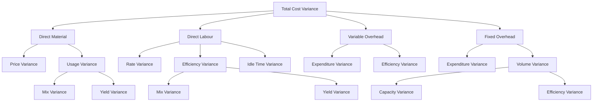
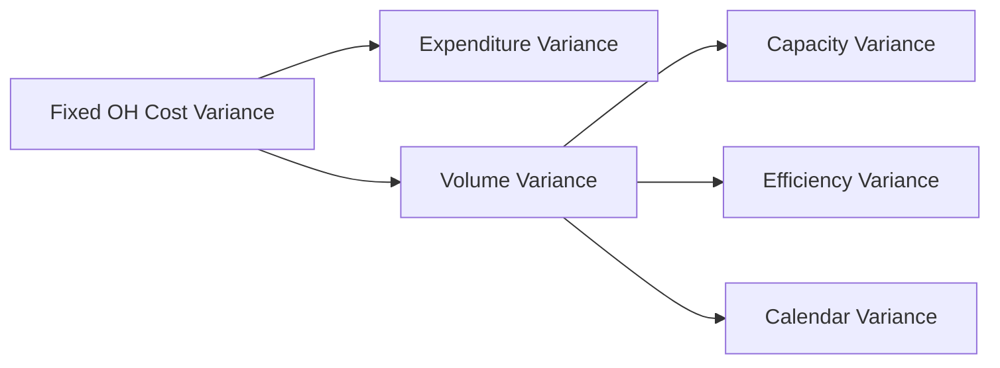
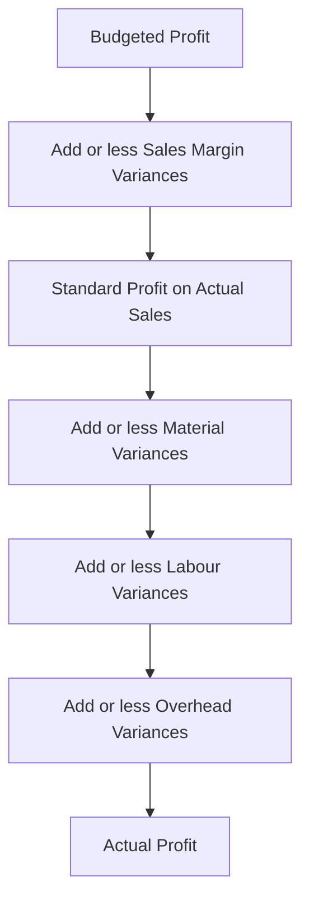

# Chapter 13 — Standard Costing & Variance Analysis

## 1. The Problem: A Number That Tells You Nothing

Imagine you run a factory that makes steel almirahs. At month-end your cost sheet says: *actual cost of production = ₹47,80,000*. Your boss asks one question: **"Is that good or bad?"**

You cannot answer. ₹47,80,000 is a naked fact. Good compared to *what*? Maybe steel prices spiked. Maybe your workers were slow. Maybe you simply made more almirahs than planned, so of course the total is higher. The single number hides five different stories, and each story demands a *different manager to fix it* — the purchase officer for prices, the shop-floor supervisor for worker speed, the production planner for volume.

This is the central failure of ordinary costing: **it records what happened but cannot say what should have happened, so it cannot locate responsibility.** A cost that is merely *recorded* is a post-mortem. A cost that is *controlled* must be caught, diagnosed, and pinned on a cause while there is still time to act.

So the real problem is not "what did it cost?" It is:

> Given that actual cost differs from what we expected, **by how much, because of which cause, and whose desk does the correction land on?**

Standard costing is the answer. It sets a *pre-determined "should be" cost* for every unit, then compares actual to that standard, and — crucially — **splits the total gap into named pieces**, each piece traceable to one decision, one department, one lever. That splitting is variance analysis.

## 2. The Core Idea: A Budget Per Unit, Then Control by Exception

Two analogies carry the whole chapter.

**Analogy 1 — The par score in golf.** A golf hole has a *par* (say, 4 strokes). Par is not what an average hacker scores; it is what a competent player *should* score under normal conditions. When you take 6 strokes, you are "2 over par". Nobody records "6 strokes" in isolation — they record it *against par*, because par converts a raw number into a judgement. A **standard cost is the par of a product**: the carefully engineered cost a unit *should* incur under efficient, normal operating conditions.

**Analogy 2 — Control by exception, like a car dashboard.** Your car has dozens of systems, but you don't monitor each continuously. You watch the dashboard, and only when a warning light glows do you investigate *that* system. Variance analysis is management's dashboard. When actual equals standard, the light is off — ignore it. When a variance is large, the light glows red — investigate *that specific variance*, not the whole factory. This is **management by exception**: attention flows only to the deviations, and the *decomposition of variances tells you which warning light lit up.*

Put together: standard costing sets par per unit; variance analysis reads the dashboard and names the exception.

## 3. Why It's Built This Way: The Logic of Decomposition

Why not just report one total cost variance? Because a total is a *sum of causes that pull in opposite directions and belong to different people*. Consider labour cost. It can differ from standard for two independent reasons:

1. You **paid a different wage rate** than planned (a purchasing/HR decision — you hired costlier workers, or a wage award increased rates).
2. Your workers **took a different number of hours** than the job should need (a shop-floor efficiency matter — supervision, machine condition, worker skill).

A single "labour cost variance" of ₹20,000 adverse could be +₹50,000 from paying too much and −₹30,000 saved from working fast, netting to ₹20,000. Report only the ₹20,000 and you have *hidden a serious rate problem behind an efficiency success*. The two must be separated because **they have different causes, different owners, and different corrective actions.**

The universal engine behind every variance is one idea:

> **Change one thing at a time.** To isolate the price effect, hold quantity constant and vary only price. To isolate the quantity effect, hold price constant (at standard) and vary only quantity.

Every formula in this chapter is that single principle applied to a different input. Once you *see* it, you never memorise a formula again — you *reconstruct* it. The general shapes are:

- **Price/Rate/Expenditure variance** = (Standard price − Actual price) × Actual quantity → *"we bought/paid at a wrong price for what we actually used."* Quantity held at actual.
- **Usage/Efficiency/Quantity variance** = (Standard quantity for actual output − Actual quantity) × Standard price → *"we used a wrong amount, valued at the honest standard price so the price story doesn't leak in."* Price held at standard.

Notice the asymmetry that trips up thousands of students: the **price variance uses *actual* quantity**, but the **usage variance uses *standard* price**. This is deliberate. We value the usage variance at standard price precisely so that no part of the price problem contaminates the efficiency measure — the shop-floor supervisor is judged on hours, not on wage rates he doesn't set.

### The sign convention (learn this once, apply everywhere)

For **cost** variances: `Standard − Actual`.
- Positive result = **Favourable (F)** → actual cost was *below* standard, good.
- Negative result = **Adverse (A)** → actual cost *exceeded* standard, bad.

For **sales/profit** variances the logic flips because more is better: `Actual − Budget` for the value, and favourable means actual *exceeds* budget.

If you always write the standard/budget figure first and subtract the actual, and then read "positive = F for costs, remember to flip for sales," you never lose a sign.

## 4. Full Technical Content: Setting Standards and the Complete Variance Tree

### 4.1 What a standard cost is, and how it is set

A **standard cost** is a pre-determined cost per unit of output, built up element by element from two things: a **physical standard** (how much input a unit *should* consume — kg, hours) and a **price standard** (what each unit of input *should* cost — ₹/kg, ₹/hour). Their product is the standard cost of that element.

Standards are set by the **standard costing committee** (production engineer, purchase manager, cost accountant, personnel manager) using:

- **Material quantity standards** — from the bill of materials and engineering studies, *including a normal allowance for unavoidable scrap/wastage*.
- **Material price standards** — from the purchase manager's forecast of prices over the standard period, net of trade discounts.
- **Labour time standards** — from time-and-motion study, including normal idle/rest allowances.
- **Wage rate standards** — from HR/wage agreements.
- **Overhead standards** — budgeted overheads divided by a budgeted activity base (standard hours or units).

**Types of standard (matters for interpretation):**

| Type | Basis | Problem |
|---|---|---|
| **Ideal standard** | Perfect conditions, no wastage, no breakdown | Unattainable; demotivating; always adverse |
| **Basic standard** | Fixed long-term, unchanged for years | Goes stale; useless for current control |
| **Current standard** | Present conditions, short period | Reflects inefficiencies as "normal" |
| **Normal (Expected) standard** | Attainable under normal efficient conditions | **The preferred, realistic benchmark** |

The **normal/attainable standard** is what ICAI problems assume unless told otherwise: tight enough to motivate, loose enough to be reachable.

**Standard costing vs budgetary control:** a budget is a *total* plan for a *department/period* (₹ for the whole factory); a standard is a *per-unit* cost. Budgets are extensive (aggregate totals); standards are intensive (per unit). They are complementary — the standard cost card feeds the flexible budget.

### 4.2 The variance tree — the map of the whole chapter

*Figure 13.1 — The full cost-variance tree. Every parent equals the sum of its children; this "adding up" is your self-check.*

The unbreakable rule of the tree: **at every node, the children reconcile to the parent.** Price + Usage = Cost. Mix + Yield = Usage. Capacity + Efficiency = Volume. If they don't add up, you have an arithmetic error — the tree is your built-in proof.

### 4.3 Direct Material Variances

Let `SQ` = standard quantity **for actual output** (not budgeted output!), `AQ` = actual quantity used, `SP` = standard price, `AP` = actual price. `AI` = actual quantity purchased/input.

- **Material Cost Variance (MCV)** = (SQ × SP) − (AQ × AP)
  *Meaning:* total gap between what the actual output should have cost in materials and what it did cost. The parent.

- **Material Price Variance (MPV)** = (SP − AP) × AQ
  *Meaning:* the cost of buying at the wrong price, for the quantity actually used. Owner: **purchase manager.** (Some texts compute on quantity *purchased* AI when price variance is isolated at purchase point; ICAI default uses AQ unless purchase and usage quantities differ and the question specifies.)

- **Material Usage (Quantity) Variance (MUV)** = (SQ − AQ) × SP
  *Meaning:* the cost of using the wrong amount of material, valued at the honest standard price. Owner: **production/shop floor.**

  **Check:** MPV + MUV = MCV.

When there are **several materials mixed together** (e.g., a chemical batch), the usage variance splits again:

- **Material Mix Variance (MMV)** = (Revised Standard Quantity − Actual Quantity) × SP
  where **Revised Standard Quantity (RSQ)** = total actual input re-apportioned in the *standard mix ratio*.
  *Meaning:* the cost effect of using inputs in the wrong *proportion* (using more of the cheap material and less of the dear one, or vice versa). Owner: whoever controls the recipe/blend.

- **Material Yield (Sub-usage) Variance (MYV)** = (SQ − RSQ) × SP
  *Meaning:* the cost effect of the total mix producing more or less output than standard — i.e., getting a different *yield* from the same total input. Also expressible as (Actual Yield − Standard Yield from actual input) × Standard cost per unit of output.

  **Check:** MMV + MYV = MUV.

Why RSQ is the pivot: it is the bridge figure that holds *total quantity at actual* but *proportion at standard*. Mix compares actual-proportion vs standard-proportion at the same total (RSQ vs AQ). Yield compares standard-for-output vs standard-proportion-of-actual-total (SQ vs RSQ). One variable changes per step — the golden rule again.

### 4.4 Direct Labour Variances

Let `SH` = standard hours **for actual output**, `AH` = actual hours *paid*, `AH_worked` = actual hours *worked* (paid minus idle), `SR` = standard rate, `AR` = actual rate.

- **Labour Cost Variance (LCV)** = (SH × SR) − (AH_paid × AR)
  *Meaning:* total labour cost gap for actual output.

- **Labour Rate Variance (LRV)** = (SR − AR) × AH_paid
  *Meaning:* cost of paying a wrong wage rate. Owner: **HR/personnel.** Computed on hours *paid* because you pay for every paid hour regardless of idleness.

- **Labour Efficiency Variance (LEV)** = (SH − AH_worked) × SR
  *Meaning:* cost of workers taking wrong number of *productive* hours. Owner: **production supervisor.** Uses hours *worked* so idle time doesn't distort efficiency.

- **Idle Time Variance (ITV)** = Idle Hours × SR = (AH_paid − AH_worked) × SR — **always Adverse** (idle time is paid-for, never productive; you can't "gain" from it).
  *Meaning:* cost of paying for hours during which nobody produced (power cut, machine breakdown, material shortage).

  **Check:** LRV + LEV + ITV = LCV.
  (If the question gives no idle time, AH_paid = AH_worked and ITV = 0, collapsing to LRV + LEV = LCV.)

When several **grades of labour** work together, efficiency splits (exactly parallel to materials):

- **Labour Mix (Gang) Variance (LMV)** = (Revised Standard Hours − Actual Hours worked) × SR
- **Labour Yield (Sub-efficiency) Variance (LYV)** = (SH − Revised Standard Hours) × SR

  **Check:** LMV + LYV = LEV.

### 4.5 Variable Overhead Variances

Variable OH varies with activity, so it is treated like a "labour-hour-driven" cost. Let `SR_v` = standard variable OH rate per hour, `AH` = actual hours, `SH` = standard hours for actual output, `Actual VOH` = actual variable overhead incurred.

- **Variable OH Cost Variance** = (SH × SR_v) − Actual VOH

- **Variable OH Expenditure (Spending) Variance** = (AH × SR_v) − Actual VOH
  = (Standard variable OH for actual hours) − (Actual variable OH).
  *Meaning:* did each hour of activity cost more/less variable OH than budgeted? A *rate* effect.

- **Variable OH Efficiency Variance** = (SH − AH) × SR_v
  *Meaning:* because variable OH is absorbed per hour, working faster/slower than standard changes VOH absorbed. Mirror of labour efficiency.

  **Check:** Expenditure + Efficiency = VOH Cost Variance.

### 4.6 Fixed Overhead Variances — the subtle one

Fixed OH is a *fixed lump* in reality, but standard costing *absorbs* it per unit at a pre-determined rate. This clash — fixed in fact, unitised in absorption — creates the richest variance family. Definitions:

- **Standard Fixed OH Rate per unit (FOR)** = Budgeted Fixed OH ÷ Budgeted Output.
  (Or per hour = Budgeted Fixed OH ÷ Budgeted Hours.)
- `Absorbed FOH` = Actual output × FOR (= Standard hours for actual output × rate per hour).
- `Budgeted FOH` = the original fixed OH budget.
- `Actual FOH` = fixed OH actually incurred.

Variances:

- **Fixed OH Cost Variance** = Absorbed FOH − Actual FOH
  *Meaning:* total over/under-absorption of fixed overhead.

- **Fixed OH Expenditure (Budget) Variance** = Budgeted FOH − Actual FOH
  *Meaning:* did we *spend* more or less fixed overhead than budgeted? Pure spending. Owner: whoever authorises the fixed spend.

- **Fixed OH Volume Variance** = Absorbed FOH − Budgeted FOH
  *Meaning:* because fixed cost per unit assumes a planned volume, producing more/less than planned over- or under-recovers the fixed lump. Producing *above* budget volume = Favourable (fixed cost spread over more units). This is *not* a spending issue — it is a *capacity utilisation* issue.

  **Check:** Expenditure + Volume = FOH Cost Variance.

Volume splits further:

- **Fixed OH Capacity Variance** = (Actual hours worked − Budgeted hours) × FOR per hour
  *Meaning:* did we run the plant for more/fewer hours than budgeted? Owner: capacity/planning.
  (Some ICAI problems use "revised budgeted hours" adjusting for the number of days actually worked — see Calendar variance.)

- **Fixed OH Efficiency Variance** = (Standard hours for actual output − Actual hours worked) × FOR per hour
  *Meaning:* even at given capacity, working efficiently produces more standard-hours of output, recovering more fixed OH.

- **Fixed OH Calendar Variance** = (Actual working days − Budgeted working days) × Budgeted FOH per day (used only when actual days differ from budget).

  **Check:** Capacity + Efficiency (+ Calendar) = Volume.

*Figure 13.2 — Fixed overhead splits by a different logic than variable: spending vs volume, then volume by capacity, efficiency and calendar.*

### 4.7 Sales Variances — measuring the revenue/profit side

Cost variances explain why *cost* moved. Sales variances explain why *profit* moved because of selling activity. Two bases exist; ICAI favours the **profit (margin) method**, which is what reconciles budgeted to actual profit. Let `BQ`=budgeted qty, `AQ`=actual qty sold, `BP`=budgeted price, `AP`=actual price, `SM`=standard margin (profit) per unit, `AM`=actual margin per unit.

**Sales Value method (turnover-based):**
- **Sales Value Variance** = (AQ × AP) − (BQ × BP)
- **Sales Price Variance** = (AP − BP) × AQ
- **Sales Volume Variance** = (AQ − BQ) × BP

**Sales Margin (Profit) method — reconciles profit:**
- **Total Sales Margin Variance** = (AQ × AM) − (BQ × SM)
- **Sales Margin Price Variance** = (AM − SM) × AQ = (AP − BP) × AQ *(cost is held at standard, so margin change equals price change)*
- **Sales Margin Volume Variance** = (AQ − BQ) × SM

Volume splits (for multi-product sales), using **RBQ** = Revised Budgeted Quantity = total actual units in budgeted mix ratio:

- **Sales Margin Mix Variance** = (AQ − RBQ) × SM *(sold a different product mix than budgeted)*
- **Sales Margin Quantity (Sub-volume) Variance** = (RBQ − BQ) × SM *(sold a different total quantity)*

  **Check:** Mix + Quantity = Volume; Price + Volume = Total Sales Margin Variance.

### 4.8 The reconciliation statement — the point of it all

The final deliverable is a bridge from **Budgeted Profit** to **Actual Profit**, threading every variance:

> Budgeted Profit
> ± Sales Margin variances (price, mix, quantity)
> = Standard profit on actual sales... then
> ± all Cost variances (material, labour, VOH, FOH)
> = **Actual Profit**

If it lands exactly on actual profit, every variance is correct. This is why examiners love it: it self-checks the entire answer.

## 5. Worked Examples

### Example 1 — Material and Labour, single input (foundational)

**Data.** SamCo makes one product. Standard cost per unit: material 5 kg @ ₹40/kg; labour 3 hours @ ₹50/hour. Budgeted output 1,000 units. **Actual:** 1,100 units produced; 5,720 kg of material used costing ₹2,37,380; 3,410 labour hours paid costing ₹1,74,910 (no idle time).

**Step 1 — Set the "standard for actual output" (flex to 1,100 units).**
- SQ = 1,100 × 5 = **5,500 kg**; SP = ₹40 → standard material cost = 5,500 × 40 = ₹2,20,000.
- SH = 1,100 × 3 = **3,300 hrs**; SR = ₹50 → standard labour cost = 3,300 × 50 = ₹1,65,000.
- AP = 2,37,380 ÷ 5,720 = **₹41.50/kg**; AR = 1,74,910 ÷ 3,410 = **₹51.30/hr**.

**Step 2 — Material variances.**

| Variance | Formula | Working | Result |
|---|---|---|---|
| Cost (MCV) | (SQ×SP) − (AQ×AP) | 2,20,000 − 2,37,380 | ₹17,380 A |
| Price (MPV) | (SP − AP)×AQ | (40 − 41.50)×5,720 | ₹8,580 A |
| Usage (MUV) | (SQ − AQ)×SP | (5,500 − 5,720)×40 | ₹8,800 A |

**Check:** 8,580 A + 8,800 A = 17,380 A = MCV. ✓

**Step 3 — Labour variances (no idle time).**

| Variance | Formula | Working | Result |
|---|---|---|---|
| Cost (LCV) | (SH×SR) − (AH×AR) | 1,65,000 − 1,74,910 | ₹9,910 A |
| Rate (LRV) | (SR − AR)×AH | (50 − 51.30)×3,410 | ₹4,433 A |
| Efficiency (LEV) | (SH − AH)×SR | (3,300 − 3,410)×50 | ₹5,500 A |

**Check:** 4,433 A + 5,500 A = 9,933 A. Rounding in AR (51.30) causes a ₹23 gap; using exact AR = 1,74,910/3,410, LRV = 1,74,910 − 3,410×50 = 1,74,910 − 1,70,500 = ₹4,410 A, and 4,410 + 5,500 = 9,910 A = LCV. ✓
*(Lesson: compute rate variance as Actual cost − AH×SR to avoid rounding the actual rate.)*

**Reading it:** every variance is adverse. Material: paid ₹1.50/kg over and wasted 220 kg. Labour: overpaid ₹0.10-odd per hour and took 110 excess hours. Two managers, four distinct actions.

### Example 2 — Full overheads with idle time (intermediate)

**Data.** Budget for the month: output 5,000 units; each unit takes 2 standard hours. Budgeted fixed OH ₹3,00,000; budgeted variable OH ₹1,50,000. **Actual:** 4,800 units produced; 10,200 hours paid, of which 300 hours idle (power failure); actual fixed OH ₹3,05,000; actual variable OH ₹1,58,000. Budgeted and actual working days both 25 (no calendar variance).

**Step 1 — Rates and standards.**
- Budgeted hours = 5,000 × 2 = 10,000 hrs.
- Standard VOH rate = 1,50,000 ÷ 10,000 = **₹15/hr**. Standard FOH rate = 3,00,000 ÷ 10,000 = **₹30/hr** (= ₹60/unit).
- Actual output 4,800 → **SH = 4,800 × 2 = 9,600 hrs**.
- AH paid = 10,200; **AH worked = 10,200 − 300 = 9,900 hrs**.
- Absorbed FOH = 9,600 × 30 = ₹2,88,000. Budgeted FOH = ₹3,00,000.

**Step 2 — Variable OH.**

| Variance | Formula | Working | Result |
|---|---|---|---|
| VOH Cost | SH×SR_v − Actual | 9,600×15 − 1,58,000 = 1,44,000 − 1,58,000 | ₹14,000 A |
| VOH Expenditure | AH_worked×SR_v − Actual | 9,900×15 − 1,58,000 = 1,48,500 − 1,58,000 | ₹9,500 A |
| VOH Efficiency | (SH − AH_worked)×SR_v | (9,600 − 9,900)×15 | ₹4,500 A |

**Check:** 9,500 A + 4,500 A = 14,000 A = VOH Cost. ✓
*(VOH efficiency uses hours worked; idle hours consume no variable overhead.)*

**Step 3 — Fixed OH.**

| Variance | Formula | Working | Result |
|---|---|---|---|
| FOH Cost | Absorbed − Actual | 2,88,000 − 3,05,000 | ₹17,000 A |
| FOH Expenditure | Budgeted − Actual | 3,00,000 − 3,05,000 | ₹5,000 A |
| FOH Volume | Absorbed − Budgeted | 2,88,000 − 3,00,000 | ₹12,000 A |
| FOH Capacity | (AH_worked − Budgeted hrs)×FOR | (9,900 − 10,000)×30 | ₹3,000 A |
| FOH Efficiency | (SH − AH_worked)×FOR | (9,600 − 9,900)×30 | ₹9,000 A |

**Checks:** Expenditure 5,000 A + Volume 12,000 A = 17,000 A = FOH Cost. ✓
Capacity 3,000 A + Efficiency 9,000 A = 12,000 A = Volume. ✓
*(We ran 100 hours short of budgeted capacity — that's the capacity loss — and within the hours we ran, we were inefficient by 300 hours — that's the efficiency loss. Volume shortfall is the sum.)*

**Step 4 — Labour idle-time slice (illustration).** If SR = ₹50: Idle Time Variance = 300 × 50 = **₹15,000 A**, always adverse, quarantined from efficiency. This ensures the power-failure cost lands on facilities, not on the workers' efficiency record.

### Example 3 — Multi-material mix & yield with full reconciliation (exam-hard)

**Data.** A chemical "Zenol" is made by mixing three materials. Standard mix for 100 kg of output:

| Material | Std qty (kg) | Std price ₹/kg | Std cost ₹ |
|---|---|---|---|
| A | 50 | 20 | 1,000 |
| B | 30 | 30 | 900 |
| C | 40 | 10 | 400 |
| **Input total** | **120** | | **2,300** |
| Less: normal loss 20% | (20) | | |
| **Output** | **100** | | **2,300** |

Standard cost per kg of output = 2,300 ÷ 100 = ₹23.

**Actual (one batch):** Output 4,750 kg of Zenol. Materials consumed:

| Material | Actual qty (kg) | Actual price ₹/kg | Actual cost ₹ |
|---|---|---|---|
| A | 2,900 | 21 | 60,900 |
| B | 1,600 | 28 | 44,800 |
| C | 1,300 | 12 | 15,600 |
| **Total input** | **5,800** | | **1,21,300** |

**Step 1 — Standard quantity for actual output (SQ).** For 4,750 kg output at standard input ratio (120 kg input per 100 kg output):
- Total std input = 4,750 × 120/100 = 5,700 kg, split 50:30:40 of 120.
- SQ(A) = 5,700 × 50/120 = 2,375 kg; SQ(B) = 5,700 × 30/120 = 1,425 kg; SQ(C) = 5,700 × 40/120 = 1,900 kg.

Standard cost of actual output = 4,750 × 23 = **₹1,09,250** (cross-check: 2,375×20 + 1,425×30 + 1,900×10 = 47,500 + 42,750 + 19,000 = 1,09,250 ✓).

**Step 2 — Revised Standard Quantity (RSQ)** = actual total input (5,800) in standard ratio 50:30:40 (of 120):
- RSQ(A) = 5,800 × 50/120 = 2,416.67 kg
- RSQ(B) = 5,800 × 30/120 = 1,450.00 kg
- RSQ(C) = 5,800 × 40/120 = 1,933.33 kg

**Step 3 — Material Cost Variance** = Std cost of output − Actual cost = 1,09,250 − 1,21,300 = **₹12,050 A**.

**Step 4 — Price Variance** = Σ(SP − AP)×AQ:

| Material | (SP − AP) | ×AQ | Result |
|---|---|---|---|
| A | (20 − 21) = −1 | ×2,900 | 2,900 A |
| B | (30 − 28) = +2 | ×1,600 | 3,200 F |
| C | (10 − 12) = −2 | ×1,300 | 2,600 A |
| **MPV** | | | **₹2,300 A** |

**Step 5 — Usage Variance** = Σ(SQ − AQ)×SP:

| Material | (SQ − AQ) | ×SP | Result |
|---|---|---|---|
| A | (2,375 − 2,900) = −525 | ×20 | 10,500 A |
| B | (1,425 − 1,600) = −175 | ×30 | 5,250 A |
| C | (1,900 − 1,300) = +600 | ×10 | 6,000 F |
| **MUV** | | | **₹9,750 A** |

**Check:** MPV 2,300 A + MUV 9,750 A = **12,050 A = MCV.** ✓

**Step 6 — Mix Variance** = Σ(RSQ − AQ)×SP:

| Material | (RSQ − AQ) | ×SP | Result |
|---|---|---|---|
| A | (2,416.67 − 2,900) = −483.33 | ×20 | 9,666.67 A |
| B | (1,450.00 − 1,600) = −150.00 | ×30 | 4,500.00 A |
| C | (1,933.33 − 1,300) = +633.33 | ×10 | 6,333.33 F |
| **MMV** | | | **₹7,833.33 A** |

**Step 7 — Yield Variance** = Σ(SQ − RSQ)×SP:

| Material | (SQ − RSQ) | ×SP | Result |
|---|---|---|---|
| A | (2,375 − 2,416.67) = −41.67 | ×20 | 833.33 A |
| B | (1,425 − 1,450.00) = −25.00 | ×30 | 750.00 A |
| C | (1,900 − 1,933.33) = −33.33 | ×10 | 333.33 A |
| **MYV** | | | **₹1,916.67 A** |

**Check:** MMV 7,833.33 A + MYV 1,916.67 A = **9,750 A = MUV.** ✓

**Interpreting the story:** The batch overspent ₹12,050. Of that, ₹2,300 was a *price* problem (paid more for A and C, partly rescued by cheaper B), and ₹9,750 was a *usage* problem. Digging into usage: ₹7,833 came from a *wrong blend* — we loaded far more of the expensive materials A and B and skimped on the cheap C, a costly mis-mix — while ₹1,917 came from a *poor yield* (5,800 kg of input yielded only 4,750 kg vs the standard 4,833 kg it should have yielded, i.e. 5,800×100/120). Two very different corrections: fix the recipe discipline (mix) and investigate process loss (yield).

*Yield cross-check:* standard output from 5,800 kg input = 5,800 × 100/120 = 4,833.33 kg; actual = 4,750 kg; shortfall 83.33 kg × ₹23 = **₹1,916.67 A** — matches MYV exactly. ✓

### Example 4 — Sales margin variances and profit reconciliation (capstone)

**Data.** A firm budgets two products:

| Product | Budget qty | Std profit/unit ₹ | Budget profit ₹ |
|---|---|---|---|
| X | 600 | 40 | 24,000 |
| Y | 400 | 60 | 24,000 |
| **Total** | **1,000** | | **48,000** |

**Actual:** X sold 700 units at a margin of ₹35/unit; Y sold 500 units at a margin of ₹58/unit.

**Step 1 — Actuals.** Actual profit = 700×35 + 500×58 = 24,500 + 29,000 = **₹53,500.**

**Step 2 — RBQ** (total actual 1,200 units in budget ratio 600:400 = 60:40):
- RBQ(X) = 1,200 × 60/100 = 720; RBQ(Y) = 1,200 × 40/100 = 480.

**Step 3 — Sales Margin Price Variance** = (AM − SM)×AQ:
- X: (35 − 40)×700 = 3,500 A; Y: (58 − 60)×500 = 1,000 A → **₹4,500 A.**

**Step 4 — Sales Margin Volume Variance** = (AQ − BQ)×SM:
- X: (700 − 600)×40 = 4,000 F; Y: (500 − 400)×60 = 6,000 F → **₹10,000 F.**

**Step 5 — split Volume into Mix and Quantity.**
- **Mix** = (AQ − RBQ)×SM: X (700−720)×40 = 800 A; Y (500−480)×60 = 1,200 F → **₹400 F.**
- **Quantity** = (RBQ − BQ)×SM: X (720−600)×40 = 4,800 F; Y (480−400)×60 = 4,800 F → **₹9,600 F.**

**Check:** Mix 400 F + Quantity 9,600 F = **10,000 F = Volume.** ✓

**Step 6 — Total Sales Margin Variance** = Price 4,500 A + Volume 10,000 F = **₹5,500 F.**
Cross-check: Actual profit 53,500 − Budget profit 48,000 = 5,500 F. ✓ *(Since only selling-side data given, cost variances are nil here.)*

**Step 7 — Reconciliation Statement.**

| Item | ₹ | ₹ |
|---|---|---|
| **Budgeted Profit** | | 48,000 |
| Sales Margin Price Variance | 4,500 A | |
| Sales Margin Mix Variance | 400 F | |
| Sales Margin Quantity Variance | 9,600 F | +5,500 |
| **Actual Profit** | | **53,500** |

Lands exactly on ₹53,500. The reconciliation *is* the proof.

## 6. Presentation / Format

Examiners award marks for *structure*, not just answers. Standard layout:

1. **Working Note 1 — Standard cost card** and the flexed "standard for actual output" figures (SQ, SH).
2. **Working Note 2 — Basic actuals** (AP, AR derived; AH worked vs paid; RSQ/RBQ).
3. **Variance computations**, each labelled with F/A, grouped material → labour → VOH → FOH → sales.
4. **Verification lines** after each family: "Price + Usage = Cost ✓".
5. **Reconciliation Statement** from budgeted to actual profit.

Always write the **F or A** tag — a variance without its direction is worth zero. Present the reconciliation vertically with a clear running total. Show RSQ/RBQ as an explicit working; markers look for it in mix/yield questions.

*Figure 13.3 — The operating-profit reconciliation walk: start at plan, thread every variance, land on actual.*

## 7. Connections

- **Marginal costing (Ch. 12) & CVP:** the *sales margin* method uses contribution/profit per unit — under marginal costing the sales volume variance is valued at **standard contribution**, and there is **no fixed OH volume variance** (fixed cost isn't absorbed into units). Know which system the question assumes.
- **Overheads & absorption (Ch. 9):** the FOH volume variance is exactly the "over/under-absorption" of Chapter 9, now *decomposed* into capacity, efficiency and calendar.
- **Budgetary control (Ch. 14):** flexible budgets supply the "budgeted for actual output" figures; standard costing is budgetary control at the per-unit level.
- **Material & labour costing (Ch. 4–5):** standard quantities come from the bill of materials; standard hours from time study.
- **Responsibility accounting:** each variance maps to a responsibility centre — the whole point of decomposition.

## 8. Traps & Examiner Tricks

1. **Flexing to the wrong output.** SQ and SH must be based on **actual output**, never budgeted output. Using budgeted quantity is the single most common fatal error.
2. **Hours paid vs hours worked.** Rate variance and idle-time use **hours paid**; efficiency uses **hours worked**. Swap them and both go wrong. When idle time exists, LEV must exclude it.
3. **Idle time is always Adverse.** Never favourable. If your formula yields a favourable idle variance, you've mis-signed.
4. **Price variance on purchases vs usage.** If purchase quantity ≠ usage quantity and the question isolates price at purchase point, compute MPV on quantity *purchased*; otherwise on quantity used. Read the wording.
5. **FOH volume is not a spending variance.** Producing less than budget gives an adverse *volume* variance even if you spent exactly the budget — it's under-*recovery*, not over-*spending*. Students wrongly call it wasteful.
6. **Mix vs Yield direction.** Mix uses (RSQ − AQ); Yield uses (SQ − RSQ). Getting the pivot RSQ wrong (must be *actual total* in *standard* ratio) breaks both. RSQ total = AQ total; if they don't match, recompute.
7. **Sales price sign flips.** For sales, favourable = actual *exceeds* budget. Don't carry the cost convention (std − actual) into sales.
8. **Sales value vs sales margin method.** They give different volume variances (BP vs SM). Only the *margin* method reconciles to profit. Use the method the question demands.
9. **Rounding the actual rate.** Compute rate/price variances as (Actual cost − AQ×SP) to sidestep rounding of AP/AR (see Example 1's ₹23 discrepancy).
10. **Calendar variance double-count.** Only include it when actual days ≠ budgeted days; then capacity variance uses *revised* budgeted hours to avoid double counting.
11. **Reconciliation not tying.** If budgeted profit + variances ≠ actual profit, a sign is flipped somewhere. Treat the mismatch as a diagnostic, not a rounding excuse.

## 9. First-Principles Recap

Strip everything away and one sentence remains: **a variance isolates the cost effect of changing exactly one input factor while holding the others at standard.** Price factors are valued at *actual quantity* (you paid the wrong price on what you actually used); quantity factors are valued at *standard price* (so the price story cannot leak into the efficiency story). Mix and yield are just "quantity" split once more, pivoting on RSQ = actual total held in standard proportions. Fixed overhead is the odd one out only because a genuinely fixed cost is being forced through a per-unit rate, so a *volume* variance is born — the price you pay for pretending a fixed cost is variable per unit. Sales flips the sign because more revenue is good. And every parent equals the sum of its children, which is why the reconciliation statement, landing precisely on actual profit, proves the entire analysis in one line. Memorise nothing; hold quantity or price fixed and rebuild each formula on demand.

## 10. Quick-Revision Sheet

**Convention:** Cost variances = (Standard − Actual); positive = Favourable. Sales = (Actual − Budget). SQ/SH always for **actual output**.

| # | Variance | Formula |
|---|---|---|
| **Material** | | |
| 1 | Cost (MCV) | (SQ×SP) − (AQ×AP) |
| 2 | Price (MPV) | (SP − AP) × AQ |
| 3 | Usage (MUV) | (SQ − AQ) × SP |
| 4 | Mix (MMV) | (RSQ − AQ) × SP |
| 5 | Yield (MYV) | (SQ − RSQ) × SP |
| | *Check* | MPV+MUV=MCV; MMV+MYV=MUV |
| **Labour** | | |
| 6 | Cost (LCV) | (SH×SR) − (AH_paid×AR) |
| 7 | Rate (LRV) | (SR − AR) × AH_paid |
| 8 | Efficiency (LEV) | (SH − AH_worked) × SR |
| 9 | Idle Time (ITV) | Idle hrs × SR (always A) |
| 10 | Mix/Gang (LMV) | (RSH − AH_worked) × SR |
| 11 | Yield (LYV) | (SH − RSH) × SR |
| | *Check* | LRV+LEV+ITV=LCV; LMV+LYV=LEV |
| **Variable OH** | | |
| 12 | Cost | (SH×SR_v) − Actual VOH |
| 13 | Expenditure | (AH×SR_v) − Actual VOH |
| 14 | Efficiency | (SH − AH) × SR_v |
| | *Check* | Exp+Eff=Cost |
| **Fixed OH** | | |
| 15 | Cost | Absorbed − Actual |
| 16 | Expenditure (Budget) | Budgeted − Actual |
| 17 | Volume | Absorbed − Budgeted |
| 18 | Capacity | (AH_worked − Budgeted hrs) × FOR |
| 19 | Efficiency | (SH − AH_worked) × FOR |
| 20 | Calendar | (Actual − Budgeted days) × FOH/day |
| | *Check* | Exp+Vol=Cost; Cap+Eff+Cal=Vol |
| **Sales (Margin)** | | |
| 21 | Total Margin | (AQ×AM) − (BQ×SM) |
| 22 | Price | (AM − SM) × AQ |
| 23 | Volume | (AQ − BQ) × SM |
| 24 | Mix | (AQ − RBQ) × SM |
| 25 | Quantity | (RBQ − BQ) × SM |
| | *Check* | Price+Vol=Total; Mix+Qty=Vol |
| **Sales (Value)** | | |
| 26 | Value | (AQ×AP) − (BQ×BP) |
| 27 | Price | (AP − BP) × AQ |
| 28 | Volume | (AQ − BQ) × BP |

**Key figures:** RSQ = actual total input × standard mix ratio. RBQ = actual total sales × budget mix ratio. FOR = Budgeted FOH ÷ Budgeted output (or hours). Absorbed FOH = actual output × FOR.

**Reconciliation:** Budgeted Profit ± Sales margin variances ± Material ± Labour ± VOH ± FOH = **Actual Profit** (must tie exactly).
