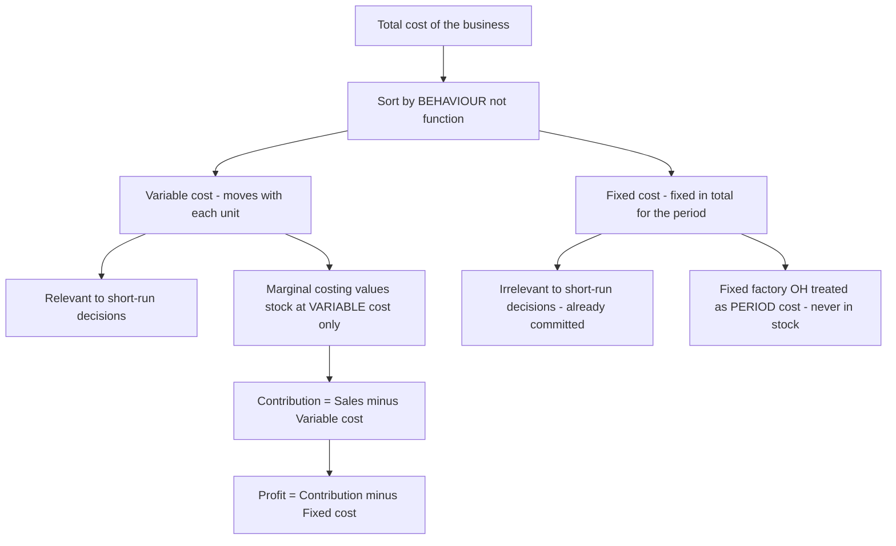
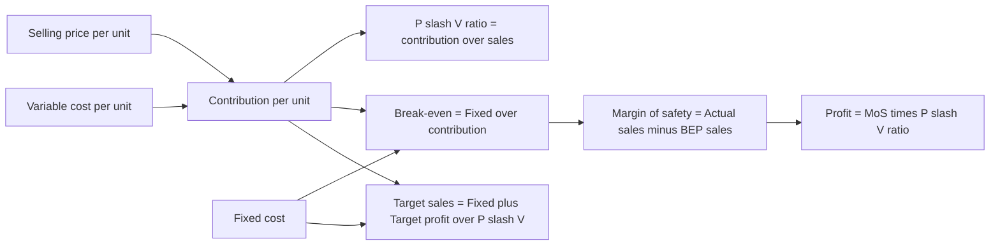
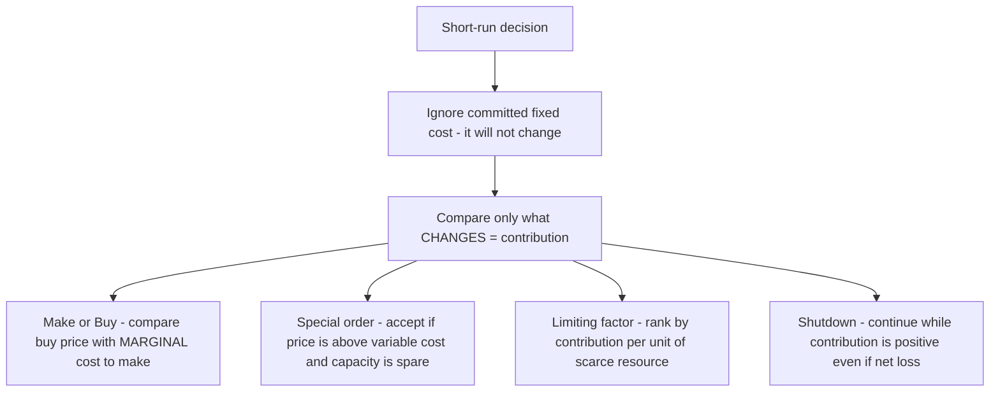

# Chapter 14 — Marginal Costing & CVP Analysis

## 1. The Problem — When Total Cost Lies to the Decision-Maker

You have spent thirteen chapters learning to build a *total cost*. You loaded material, labour and overhead onto a job, a batch, a process, a service, and you produced a single, respectable number: the full cost of one unit. That number is honest for one purpose — telling the world what a unit *cost to produce* over a whole period. It is invaluable for valuing inventory in the financial accounts and for setting a long-run price.

But now a manager walks in with a different kind of question, and the total-cost number quietly betrays her.

A factory makes a component. The cost sheet says it costs ₹45 a unit — ₹30 of material, labour and variable overhead, and ₹15 of fixed factory overhead absorbed on normal volume. An overseas buyer offers a one-time order at **₹35 a unit**. The plant has idle capacity; the regular market is untouched. The works manager glances at the cost sheet, sees ₹45, and says: *"₹35 is below cost. Reject it — we'll lose ₹10 a unit."*

She is **wrong**, and the total-cost number is why. Those ₹15 of fixed overhead — the factory rent, the supervisor's salary, the machine's depreciation — will be incurred *whether or not this order is accepted*. They do not change. Rejecting the order does not save ₹15; accepting it does not add ₹15. The only cost that actually moves when this order is taken is the ₹30 that varies with each extra unit. At ₹35, each unit brings in ₹35 and consumes ₹30 of genuinely additional cost, leaving **₹5 of pure surplus** to help pay for those fixed costs that exist anyway. Reject the order and the company is ₹5 a unit *poorer*.

This is the central failure that marginal costing exists to fix. **For a short-run decision, the total cost of a unit is not the cost of the decision.** Full cost mixes together two species of cost that behave in completely opposite ways:

- costs that **rise and fall with activity** (make one more, spend more; make one fewer, spend less), and
- costs that **sit there regardless** (make one more or a thousand fewer, they are unchanged in the period).

When you fuse the two into a single "₹45", you destroy the very information a decision needs — *what will actually change if I do this?* The manager who trusts total cost will reject profitable orders, keep loss-making products alive, make things she should buy, and shut down departments that were quietly subsidising the rent.

**The problem marginal costing solves:** separate the costs that respond to a decision from the costs that ignore it, so that every short-run choice — take the order, drop the product, make or buy, which product to push when capacity is scarce — is judged on the money that will *actually change*. Everything in this chapter flows from that single act of separation.

---

## 2. The Core Idea — The Cost of the *Next* Unit

Here is the analogy that unlocks the whole chapter.

You have booked a 50-seat bus for a private tour. The bus, the driver, the diesel for the fixed route, the toll — all of it is contracted at a flat **₹20,000** for the day, no matter how many friends you bring. Forty-five people have said yes. A forty-sixth friend calls and asks to come. What does *her* seat cost?

Not ₹20,000 ÷ 46. That "average cost per head" is a real number, but it is not the cost of *her*. Her presence changes nothing about the bus, the driver or the diesel — those are locked in. The only thing her seat adds is perhaps ₹50 for one extra packed lunch. **The cost of the next passenger is ₹50, not the average of ₹435.** So if she offers to chip in ₹200, you say yes instantly — because ₹200 comes in, ₹50 goes out, and ₹150 helps you recover the fixed ₹20,000 you are committed to anyway.

That ₹50 is the **marginal cost** — the cost of one more unit. That ₹150 surplus is the **contribution** — what the sale *contributes* first toward covering fixed costs, and then, once fixed costs are fully covered, toward profit.

This is the mental switch marginal costing demands. Stop asking *"what did a unit cost on average?"* Start asking *"what does the next unit add, and what does it contribute?"* The fixed cost is treated not as something to be smeared thinly over units, but as a **single lump the period must pay for** — a hurdle the total contribution must clear before a rupee of profit appears.

Formally, **marginal cost** is the aggregate of variable costs — the amount by which total cost increases if output rises by one unit (or falls if output drops by one unit). And the master relationship of the entire chapter, the equation you will use in a hundred disguises, is simply:

> **Sales − Variable Cost = Contribution**
> **Contribution − Fixed Cost = Profit**

Contribution is the hero. It is the fund every unit throws into a common pool; fixed cost is the bill that pool must first settle; profit is whatever is left. Once you *feel* that contribution — not profit-per-unit — is what each sale generates, break-even, margin of safety, product mix and shutdown all become obvious rather than memorised.

*The forty-sixth passenger costs ₹50 because the bus is already paid for; contribution is her fare minus that ₹50, and it is the only number that should decide whether she boards.*

---

## 3. Why It's Built This Way — Cost Behaviour, Not Cost Function

Why split costs by **behaviour** (variable vs fixed) rather than by **function** (production, admin, selling), which is how the cost sheet was built? Because a decision does not care *what a cost is for* — it cares *whether the cost will move.* Behaviour is the only classification that answers "what changes if I act?"

So marginal costing re-sorts every cost into three behavioural boxes:

- **Variable costs** move in direct proportion to activity — total varies, but cost *per unit* stays constant. Direct material, direct wages (where truly output-linked), variable overhead. In the analogy, the packed lunch.
- **Fixed costs** stay constant in total over the relevant range, so cost *per unit falls* as volume rises. Rent, salaries, straight-line depreciation, insurance. The bus hire. Crucially, fixed cost per unit is a *mathematical artefact* of the volume you happen to choose — which is exactly why it must never enter a decision.
- **Semi-variable costs** contain both (a telephone bill: fixed line rental + variable call charges; power: a fixed sanctioned-load charge + variable usage). These must be *split* into their fixed and variable parts before analysis — most commonly by the **high-low method**, which you meet in the technical section.

Now the second design choice, the one that trips up every student: **how do you treat fixed factory overhead when valuing stock?** This single decision splits the world into two costing systems.

- **Marginal (variable) costing** says fixed factory overhead is a **cost of the *period*, not of the *product*.** The rent is incurred because a month passed, not because units were made. So it is charged in full against that period's contribution and **never carried in the value of unsold stock.** Inventory is valued at **variable cost only.**
- **Absorption (total) costing** — the method behind your cost sheet, and the one financial reporting standards (AS 2 / Ind AS 2) *require* for published accounts — says fixed factory overhead is a genuine cost of *making* the product, so it is **absorbed into each unit** and travels with unsold units into closing stock.

This one difference — *does fixed factory overhead sit in closing stock or not?* — is the sole reason the two methods report **different profits** in any period where production and sales volumes differ. Understanding *why* that gap arises, and being able to *reconcile* it to the last rupee, is a guaranteed exam requirement and the spine of Section 5's second example.

*Behaviour, not function, is the sorting key — because a decision only reacts to costs that move, and fixed costs do not.*

---

## 4. Full Technical Content — Every Formula, With the Reason It Exists

### 4.1 The contribution family

Everything is one equation seen from different angles. Learn the equation; the formulas are just its rearrangements.

| Concept | Formula | What it answers |
|---|---|---|
| Marginal cost | Direct material + Direct labour + Direct expenses + Variable overhead | Cost added by one more unit |
| Contribution per unit (c) | Selling price − Variable cost per unit | Surplus each unit throws into the fixed-cost pool |
| Total contribution | Sales − Total variable cost, or c × units | The whole pool available for fixed cost + profit |
| Profit | Contribution − Fixed cost | What survives after the pool clears the hurdle |
| Contribution (identity) | Fixed cost + Profit | Same pool, viewed from where it goes |

That last identity — **Contribution = Fixed cost + Profit** — is worth its own line. It says the pool has exactly two destinations: pay the fixed bill, then become profit. It lets you find any one of the three when you know the other two, and it is the engine behind break-even (profit = 0, so contribution = fixed cost).

### 4.2 The P/V ratio — contribution as a *rate*

Contribution per unit is fine when you count units. But businesses often think in **rupees of sales**, and a multi-product firm cannot add "units" of a car and a pen. So we express contribution as a **percentage of sales value** — the **Profit/Volume ratio**, the single most useful ratio in the chapter.

$$\text{P/V ratio} = \frac{\text{Contribution}}{\text{Sales}} \times 100 = \frac{\text{Contribution per unit}}{\text{Selling price per unit}} \times 100$$

The P/V ratio is the **contribution earned per rupee of sales.** A P/V ratio of 40% means every ₹100 of sales generates ₹40 of contribution. Its power is that it is (usually) *constant* regardless of volume, so it converts freely between sales value and contribution.

Because selling price and variable cost per unit are constant, the P/V ratio can also be found from **any two periods'** data — it strips out fixed cost entirely:

$$\text{P/V ratio} = \frac{\text{Change in Contribution}}{\text{Change in Sales}} \times 100 = \frac{\text{Change in Profit}}{\text{Change in Sales}} \times 100$$

(Change in profit equals change in contribution because fixed cost, being fixed, does not change between the two periods — so it cancels. This is the standard "two-year" exam trick.)

**How to improve the P/V ratio** (a favourite theory question): raise selling price; reduce variable cost per unit; change the sales mix toward higher-P/V products. Note fixed cost does *not* appear — it cannot change the P/V ratio.

### 4.3 Break-even — the point where contribution exactly clears the hurdle

The **break-even point (BEP)** is the activity level at which total contribution exactly equals fixed cost, so profit is zero — no profit, no loss. It matters because it is the *floor of survival*: below it you bleed, above it you earn. Set Profit = 0 in the master identity (Contribution = Fixed cost) and solve:

$$\text{BEP (units)} = \frac{\text{Fixed cost}}{\text{Contribution per unit}} \qquad \text{BEP (₹ sales)} = \frac{\text{Fixed cost}}{\text{P/V ratio}}$$

Both say the same thing: keep piling on contribution until the pile equals fixed cost. In units, each unit adds *c*; in rupees, each rupee of sales adds the P/V ratio. (You can also get BEP sales as BEP units × selling price — they must agree; use it to self-check.)

**Cash break-even point** — some fixed costs (depreciation, amortisation) are *non-cash*. The level of sales at which you break even *in cash* is lower, because you only need to cover the cash fixed costs:

$$\text{Cash BEP (units)} = \frac{\text{Fixed cost} - \text{Non-cash fixed cost}}{\text{Contribution per unit}}$$

### 4.4 Margin of safety — how far you can fall before you bleed

Knowing the BEP, the next question is: *how much cushion do I have?* The **margin of safety (MoS)** is the excess of actual (or budgeted) sales over break-even sales — the distance you can lose before profit turns to loss.

$$\text{MoS} = \text{Actual sales} - \text{Break-even sales} \qquad \text{MoS ratio} = \frac{\text{MoS}}{\text{Actual sales}} \times 100$$

The most *revealing* form connects MoS straight to profit — because every rupee of sales *beyond* break-even is pure contribution (fixed cost is already paid), all of it drops to profit:

$$\text{Profit} = \text{MoS (in ₹)} \times \text{P/V ratio} \qquad \Longrightarrow \qquad \text{MoS (₹)} = \frac{\text{Profit}}{\text{P/V ratio}}$$

A large margin of safety means a business that can weather a slump; a thin one means danger. To *improve* it: increase sales, reduce fixed cost (lowers BEP), raise the P/V ratio, or drop unprofitable low-contribution lines.

### 4.5 Target profit — break-even's ambitious cousin

Break-even asks "cover fixed cost." Managers ask "earn ₹X profit." Just raise the hurdle: the pool must now cover **fixed cost *plus* the desired profit.**

$$\text{Units for target profit} = \frac{\text{Fixed cost} + \text{Target profit}}{\text{Contribution per unit}} \qquad \text{Sales for target profit} = \frac{\text{Fixed cost} + \text{Target profit}}{\text{P/V ratio}}$$

If the target profit is stated **after tax**, gross it up first: Required pre-tax profit = After-tax target ÷ (1 − tax rate), then use the pre-tax figure above.

And the general profit equation, which subsumes all of the above:

$$\text{Profit} = (\text{Sales} \times \text{P/V ratio}) - \text{Fixed cost}$$

### 4.6 The CVP relationship, in one picture

Cost-Volume-Profit (CVP) analysis is simply the study of how profit responds as volume moves — everything in 4.3–4.5 is one continuous story.

*One chain: price and variable cost fix contribution; contribution and fixed cost fix break-even; the gap above break-even, taxed at the P/V rate, is profit.*

### 4.7 The break-even chart and the angle of incidence

Plot sales value on the vertical axis against volume on the horizontal. Draw a horizontal-ish **fixed cost line**, a **total cost line** starting at the fixed-cost intercept and sloping up by variable cost, and a **sales line** from the origin. Where sales crosses total cost is the **break-even point**. To its left is a loss wedge; to its right, a profit wedge.

The **angle of incidence** is the angle at which the sales line cuts the total cost line at the BEP. A *wide* angle means profit accumulates rapidly once you pass break-even (high P/V ratio, strong earning power); a *narrow* angle means profit crawls up slowly. Together with the margin of safety, it summarises a firm's profit health at a glance.

### 4.8 Splitting semi-variable cost — the high-low method

Before any of this works, mixed costs must be split. The **high-low method** uses the highest and lowest activity levels:

$$\text{Variable cost per unit} = \frac{\text{Cost at highest activity} - \text{Cost at lowest activity}}{\text{Highest units} - \text{Lowest units}}$$

Then Fixed cost = Total cost at any level − (Variable cost per unit × units at that level).

### 4.9 Multi-product (composite) break-even

When a firm sells several products in a **fixed sales mix**, you cannot use one contribution-per-unit. Compute a **composite (overall) P/V ratio** and break even in sales value:

$$\text{Composite P/V ratio} = \frac{\text{Total contribution of all products}}{\text{Total sales of all products}} \times 100 \qquad \text{Composite BEP (₹)} = \frac{\text{Total fixed cost}}{\text{Composite P/V ratio}}$$

Then split the composite break-even sales back into products in the sales-value ratio to get each product's break-even sales.

---

## 5. Worked Examples — From Textbook-Easy to Exam-Hard

### Example 1 — The full CVP toolkit on one product *(foundation)*

**Data.** Excel Ltd makes a single product. Selling price ₹50 per unit; variable cost ₹30 per unit; fixed costs ₹2,00,000 per year. Current sales 15,000 units.
Required: (a) contribution per unit and P/V ratio; (b) BEP in units and rupees; (c) margin of safety and its ratio; (d) current profit; (e) units and sales needed for a target profit of ₹1,00,000; (f) sales needed for an after-tax profit of ₹63,000 at a 30% tax rate.

**Step 1 — Contribution and P/V ratio.**
Contribution per unit = 50 − 30 = **₹20.**
P/V ratio = 20 ÷ 50 × 100 = **40%.**

**Step 2 — Break-even.**
BEP (units) = Fixed cost ÷ contribution per unit = 2,00,000 ÷ 20 = **10,000 units.**
BEP (₹) = Fixed cost ÷ P/V ratio = 2,00,000 ÷ 0.40 = **₹5,00,000.**
*Self-check:* 10,000 units × ₹50 = ₹5,00,000. ✓

**Step 3 — Margin of safety.**
Actual sales = 15,000 × 50 = ₹7,50,000.
MoS = 7,50,000 − 5,00,000 = **₹2,50,000** (or 15,000 − 10,000 = 5,000 units).
MoS ratio = 2,50,000 ÷ 7,50,000 × 100 = **33.33%.**

**Step 4 — Current profit.**
Profit = Contribution − Fixed = (15,000 × 20) − 2,00,000 = 3,00,000 − 2,00,000 = **₹1,00,000.**
*Self-check via MoS:* Profit = MoS × P/V ratio = 2,50,000 × 0.40 = ₹1,00,000. ✓

**Step 5 — Target profit of ₹1,00,000.**
Units = (Fixed + target) ÷ c = (2,00,000 + 1,00,000) ÷ 20 = **15,000 units.**
Sales = 3,00,000 ÷ 0.40 = **₹7,50,000.** (Consistent with current level — current profit *is* ₹1,00,000.) ✓

**Step 6 — After-tax target of ₹63,000 at 30% tax.**
Pre-tax profit needed = 63,000 ÷ (1 − 0.30) = 63,000 ÷ 0.70 = ₹90,000.
Sales = (Fixed + pre-tax profit) ÷ P/V ratio = (2,00,000 + 90,000) ÷ 0.40 = 2,90,000 ÷ 0.40 = **₹7,25,000** (14,500 units).
*Self-check:* Contribution 14,500 × 20 = 2,90,000; less fixed 2,00,000 = pre-tax 90,000; tax 30% = 27,000; after-tax = 63,000. ✓

---

### Example 2 — Marginal vs Absorption profit, fully reconciled *(the guaranteed exam question)*

**Data.** Sunrise Ltd, for the year:

| Item | Figure |
|---|---|
| Units produced | 10,000 |
| Units sold | 8,000 |
| Selling price per unit | ₹100 |
| Variable manufacturing cost per unit | ₹60 |
| Fixed manufacturing overhead (for the year) | ₹1,50,000 |
| Fixed selling & administration overhead | ₹50,000 |

There was no opening stock. Fixed manufacturing overhead is absorbed on the basis of *normal* production of 10,000 units. Prepare profit statements under **marginal** and **absorption** costing and **reconcile** the difference.

**Preliminary numbers.**
Closing stock = 10,000 produced − 8,000 sold = **2,000 units.**
Fixed manufacturing OH absorption rate = 1,50,000 ÷ 10,000 = **₹15 per unit.**
Absorption cost per unit = variable 60 + fixed 15 = **₹75.**

**(A) Marginal costing statement** — stock valued at variable cost (₹60) only; all fixed cost charged to the period.

| Marginal costing | ₹ |
|---|---:|
| Sales (8,000 × 100) | 8,00,000 |
| Less: Variable cost of sales (8,000 × 60) | 4,80,000 |
| **Contribution** | **3,20,000** |
| Less: Fixed manufacturing overhead | 1,50,000 |
| Less: Fixed selling & admin overhead | 50,000 |
| **Profit** | **1,20,000** |

*(Closing stock here is valued at 2,000 × ₹60 = ₹1,20,000 — no fixed cost inside it.)*

**(B) Absorption costing statement** — stock valued at full cost (₹75); fixed manufacturing OH flows through cost of goods sold.

| Absorption costing | ₹ |
|---|---:|
| Sales (8,000 × 100) | 8,00,000 |
| Cost of goods produced (10,000 × 75) | 7,50,000 |
| Less: Closing stock (2,000 × 75) | 1,50,000 |
| Cost of goods sold | 6,00,000 |
| **Gross profit** | **2,00,000** |
| Less: Fixed selling & admin overhead | 50,000 |
| Under/over absorption of fixed OH | Nil |
| **Profit** | **1,50,000** |

*(Absorbed fixed OH = 10,000 × 15 = ₹1,50,000 = actual fixed OH, so there is no under/over-absorption. Closing stock now carries 2,000 × ₹75 = ₹1,50,000, of which 2,000 × ₹15 = ₹30,000 is fixed overhead.)*

**(C) Reconciliation.**
Difference in profit = 1,50,000 − 1,20,000 = **₹30,000**, absorption being higher.

| Reconciliation | ₹ |
|---|---:|
| Profit as per marginal costing | 1,20,000 |
| Add: Fixed manufacturing OH carried forward in closing stock (2,000 × 15) | 30,000 |
| **Profit as per absorption costing** | **1,50,000** |

**Why absorption shows more profit here.** Production (10,000) exceeded sales (8,000). Under absorption costing, ₹30,000 of this year's fixed overhead is "parked" inside the 2,000 unsold units and pushed into *next* year, so only ₹1,20,000 of fixed manufacturing OH is charged against this year's sales. Marginal costing refuses to park anything — it charges the full ₹1,50,000 now. Hence the ₹30,000 gap.

**The rule that saves exam time:**
- Production **>** Sales (stock rises) → **Absorption profit > Marginal profit.**
- Production **<** Sales (stock falls) → **Absorption profit < Marginal profit** (fixed OH from *last* year's stock is released into this year's cost of sales).
- Production **=** Sales (no stock change) → **Profits are equal.**

---

### Example 3 — Limiting (key) factor and best product mix *(exam-hard)*

**Data.** Trident Ltd makes three products, A, B and C, all on the same machine. Machine capacity is limited to **20,000 machine hours** this year. Fixed costs are ₹1,00,000.

| Per unit | A | B | C |
|---|---:|---:|---:|
| Selling price (₹) | 100 | 90 | 160 |
| Variable cost (₹) | 60 | 60 | 100 |
| Machine hours per unit | 2 | 1 | 4 |
| Maximum market demand (units) | 5,000 | 6,000 | 3,000 |

Determine the product mix that maximises profit, and compute that profit.

**Step 1 — The trap: do NOT rank by contribution per unit.**
Contribution per unit: A = 40, B = 30, C = 60. Ranked this way, C looks best. **This is wrong.** When machine hours are the bottleneck, the scarce resource is *machine hours*, not units. The right question is *"which product wrings the most contribution out of each scarce hour?"*

**Step 2 — Rank by contribution per unit of the limiting factor (machine hour).**

| | A | B | C |
|---|---:|---:|---:|
| Contribution per unit (₹) | 40 | 30 | 60 |
| Machine hours per unit | 2 | 1 | 4 |
| **Contribution per machine hour (₹)** | **20** | **30** | **15** |
| **Rank** | **2** | **1** | **3** |

B, the product with the *lowest* contribution per unit, is actually the **best** — it earns ₹30 of contribution from every scarce hour, twice what C manages.

**Step 3 — Allocate the 20,000 hours by rank, respecting demand ceilings.**

| Rank | Product | Units (up to demand) | Hours used | Hours left |
|---|---|---:|---:|---:|
| 1 | B | 6,000 | 6,000 × 1 = 6,000 | 14,000 |
| 2 | A | 5,000 | 5,000 × 2 = 10,000 | 4,000 |
| 3 | C | 4,000 hrs ÷ 4 = 1,000 | 4,000 | 0 |

B and A are made to full demand; C absorbs only the leftover 4,000 hours, giving 1,000 units (against demand of 3,000).

**Step 4 — Total contribution and profit.**

| Product | Units | Contribution/unit (₹) | Total contribution (₹) |
|---|---:|---:|---:|
| B | 6,000 | 30 | 1,80,000 |
| A | 5,000 | 40 | 2,00,000 |
| C | 1,000 | 60 | 60,000 |
| **Total contribution** | | | **4,40,000** |
| Less: Fixed cost | | | 1,00,000 |
| **Profit** | | | **3,40,000** |

**Proof that this mix is optimal.** Suppose we had (wrongly) prioritised C. Making C to full demand (3,000 units) would eat 12,000 hours, leaving 8,000 hours. Those 8,000 would go to B (6,000 hrs, 6,000 units) then A (2,000 hrs, 1,000 units). Contribution = C 1,80,000 + B 1,80,000 + A 40,000 = ₹4,00,000 — **₹40,000 worse.** The limiting-factor ranking wins by exactly the contribution/hour logic.

---

## 6. Presentation & Format — How to Lay It Out in the Exam

**Always show the contribution line explicitly.** In every marginal statement, the sequence is: Sales → less Variable cost → **Contribution** (a bolded subtotal) → less Fixed cost → Profit. Examiners award marks for the *structure*, not just the final number. Contrast this with the absorption format, which shows **Gross profit** (Sales − full cost of sales) and only then deducts non-manufacturing costs.

**A clean comparative skeleton to reproduce:**

| Particulars | Marginal costing | Absorption costing |
|---|---|---|
| Stock valuation | Variable production cost only | Variable + fixed production cost |
| Fixed factory OH | Period cost — charged in full | Absorbed into units, part carried in stock |
| Sub-total highlighted | **Contribution** | **Gross profit** |
| Under/over-absorption | Does not arise | Must be shown and adjusted |
| Reporting acceptability | Internal decisions only | Required by AS 2 / Ind AS 2 for accounts |

**For CVP answers**, present formulas *before* substituting numbers, keep P/V ratio to two decimals, and *always* add a self-check line (e.g., "BEP units × price = BEP sales ✓"). **For reconciliation**, the safest layout is a three-line bridge: start from one method's profit, add or subtract the fixed overhead in the *change* in stock, and arrive at the other method's profit — label the adjustment "Fixed OH in closing stock" or "…released from opening stock" so the examiner sees you understand *why*, not just *that*, they differ.

---

## 7. Connections — Where This Sits in the Syllabus

- **Overhead absorption (Ch. 4)** is marginal costing's mirror image. There you learned to *absorb* fixed factory overhead into units via a recovery rate; here you learn *why*, for decisions, you should *not*. The under/over-absorption you computed in Ch. 4 is exactly the quantity that vanishes under marginal costing — because there is no fixed rate to over- or under-recover.
- **Standard costing & variances (Ch. 15)**: the **fixed overhead volume variance** exists *only* under absorption costing — it measures the effect of the very fixed-cost-in-units mechanism this chapter isolates. Under marginal standard costing, fixed overhead has only an *expenditure* variance, no volume variance. This chapter is the conceptual key to that difference.
- **Budgeting & flexible budgets (Ch. 16)**: a flexible budget *is* cost-behaviour analysis — it flexes variable cost with activity while holding fixed cost, precisely the split you make here. The **cash budget** connects to cash break-even.
- **Cost sheet (Ch. 6)** builds the total cost that this chapter warns you not to use for decisions.
- **Relevant costing / decision-making (advanced)**: make-or-buy, special orders and shutdown, worked in Section 5-and-below here, are the foundation of the relevant-cost decisions you meet later — where opportunity cost and avoidable fixed cost extend the same contribution logic.

---

## 8. Decision-Making Applications — Contribution as the Universal Judge

Every short-run decision reduces to one test: **does this action increase total contribution, given that committed fixed costs will not change?** Here are the four classic exam decisions, each solved by that one idea.

*Four different questions, one answer: choose the option that leaves total contribution highest, because fixed cost is a sunk backdrop.*

### 8.1 Make or Buy

**Compare the outside buying price with the *marginal* (variable) cost of making — not the full cost.** Fixed overhead already exists and is irrelevant *unless* making the part avoids a specific fixed cost or buying releases capacity for a more profitable use.

**Example.** A component's own cost sheet shows: material ₹8, labour ₹5, variable overhead ₹3, fixed overhead ₹4 → full cost ₹20. A supplier offers it at **₹18**.
Naïve view: ₹18 < ₹20, so buy. **Wrong.** The relevant make cost is the *marginal* cost = 8 + 5 + 3 = **₹16**. The ₹4 fixed overhead continues whether you make or buy. Since ₹16 (make) < ₹18 (buy), **make it** — buying wastes ₹2 per unit. (You would only switch to buying if the ₹4 fixed cost were *actually avoidable* on outsourcing, or if the freed capacity earned more than ₹2/unit elsewhere.)

### 8.2 Accept or Reject a Special Order

**Accept any special order priced above variable cost, provided (i) there is spare capacity and (ii) it will not spoil the regular-market price.** Every rupee above variable cost is extra contribution against unchanged fixed cost.

**Example.** Normal price ₹50, variable cost ₹30, fixed cost per unit ₹15 (full cost ₹45). A one-off export order arrives at **₹35** for 4,000 units; the plant has idle capacity and the export market is separate.
Full-cost thinking says ₹35 < ₹45 → reject. **Wrong.** Contribution per unit = 35 − 30 = **₹5.** Extra contribution = 4,000 × 5 = **₹20,000**, all of it additional profit because fixed cost is unchanged. **Accept.** (If capacity were *full*, you would deduct the contribution lost on displaced regular sales — the opportunity cost — before deciding.)

### 8.3 Shutdown or Continue

A product or department showing a *net loss* need not be closed. **Continue as long as it earns positive contribution**, because that contribution helps pay fixed costs that would otherwise fall on the rest of the business. Compare the contribution earned against the fixed costs *actually saved* by closing.

**Example.** A division: sales ₹5,00,000, variable cost ₹3,50,000, fixed cost ₹2,00,000 → **net loss ₹50,000.** Closing it would save only ₹80,000 of the fixed cost (the rest — ₹1,20,000 of head-office and unavoidable charges — continues regardless).
Contribution while running = 5,00,000 − 3,50,000 = **₹1,50,000.**
If we *continue*: loss = ₹50,000 (as above).
If we *shut down*: we lose the ₹1,50,000 contribution but save ₹80,000 fixed → net position = −1,20,000 (unavoidable fixed) + 80,000 saved… i.e., loss = **₹1,20,000.**
Continuing loses ₹50,000; shutting down loses ₹1,20,000. **Keep it running** — it is absorbing ₹1,50,000 of fixed cost that would otherwise land elsewhere. The **shutdown point** is where contribution just equals the avoidable fixed cost; below that, close.

### 8.4 Product mix under a limiting factor

Fully worked in **Example 3** above: rank by **contribution per unit of the scarce resource**, then allocate the scarce resource top-rank first up to demand. This is the single most-tested decision in the chapter.

---

## 9. First-Principles Recap — Rebuild the Chapter From One Sentence

Start with the sentence that generates everything: **"Only costs that change should decide an action."**

1. Costs come in two behaviours: **variable** (change with each unit) and **fixed** (unchanged in the period). A decision reacts only to the first.
2. So define **marginal cost** = variable cost of one more unit, and **contribution** = selling price − variable cost. Contribution is what each sale throws into a pool.
3. The pool has one job first — **cover fixed cost** — and only then does it become **profit**. Hence *Contribution = Fixed cost + Profit*.
4. Set profit to zero and the pool must just equal fixed cost: that is **break-even**. Express contribution as a rate of sales — the **P/V ratio** — and break-even in rupees falls out as Fixed ÷ P/V ratio.
5. The distance above break-even is the **margin of safety**, and because fixed cost is already paid there, all of it converts to profit at the P/V rate.
6. Raise the hurdle from "fixed cost" to "fixed cost + desired profit" and you get **target-profit** sales.
7. Because fixed cost is a period lump, marginal costing keeps it *out of stock*; absorption costing pushes it *into stock*. That single divergence makes their profits differ by exactly *the fixed overhead sitting in the change in inventory* — which is why they **reconcile** to the rupee.
8. Every decision — make/buy, special order, product mix, shutdown — is then the same move: **pick the option that leaves total contribution highest, ignoring the fixed cost that will not move.**

If you can regenerate the formulas from those eight steps, you never need to memorise a single one.

---

## 10. Quick-Revision Sheet

| # | Concept | Formula |
|---|---|---|
| 1 | Marginal cost | DM + DL + Direct expenses + Variable overhead |
| 2 | Contribution per unit | Selling price − Variable cost per unit |
| 3 | Total contribution | Sales − Variable cost = Fixed cost + Profit |
| 4 | Profit | Contribution − Fixed cost |
| 5 | P/V ratio | (Contribution ÷ Sales) × 100 = (Contribution per unit ÷ SP) × 100 |
| 6 | P/V ratio (two periods) | (Change in profit ÷ Change in sales) × 100 |
| 7 | Break-even (units) | Fixed cost ÷ Contribution per unit |
| 8 | Break-even (₹) | Fixed cost ÷ P/V ratio |
| 9 | Cash break-even (units) | (Fixed cost − Non-cash fixed cost) ÷ Contribution per unit |
| 10 | Margin of safety (₹) | Actual sales − Break-even sales = Profit ÷ P/V ratio |
| 11 | MoS ratio | (MoS ÷ Actual sales) × 100 |
| 12 | Profit (general) | (Sales × P/V ratio) − Fixed cost = MoS × P/V ratio |
| 13 | Units for target profit | (Fixed cost + Target profit) ÷ Contribution per unit |
| 14 | Sales for target profit | (Fixed cost + Target profit) ÷ P/V ratio |
| 15 | Pre-tax profit from after-tax | After-tax profit ÷ (1 − tax rate) |
| 16 | Composite P/V ratio | (Total contribution ÷ Total sales) × 100 |
| 17 | Composite BEP (₹) | Total fixed cost ÷ Composite P/V ratio |
| 18 | High-low variable cost/unit | (Cost at high − Cost at low) ÷ (High units − Low units) |
| 19 | Absorption vs marginal profit gap | Fixed OH per unit × Change in stock units (production − sales) |
| 20 | Make-or-buy rule | Make if buying price > marginal (variable) cost to make (+ any avoidable fixed) |
| 21 | Special-order rule | Accept if price > variable cost per unit, given spare capacity |
| 22 | Limiting-factor ranking | Rank by Contribution per unit of the limiting factor |
| 23 | Shutdown rule | Continue while Contribution > Avoidable fixed cost |

**Profit-comparison memory hook:** Production **>** Sales → Absorption **>** Marginal; Production **<** Sales → Absorption **<** Marginal; Production **=** Sales → equal.

**The one line that regenerates the chapter:** *Contribution = Fixed cost + Profit — cover the fixed hurdle first, then earn; and in every decision, chase the option that grows contribution, because fixed cost has already made up its mind.*
