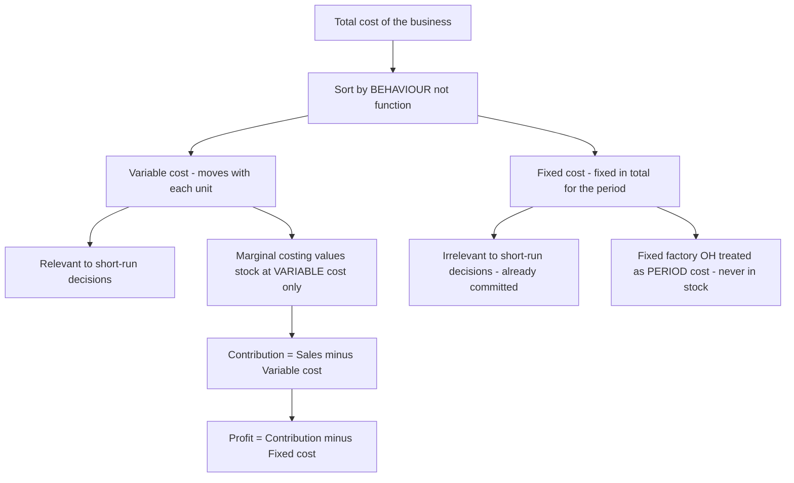
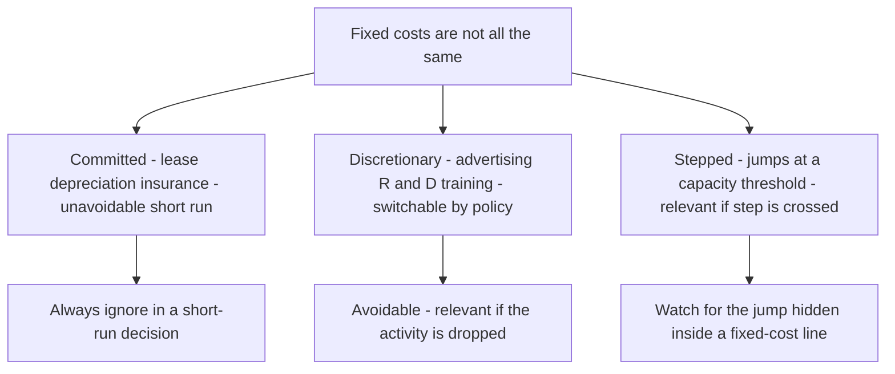
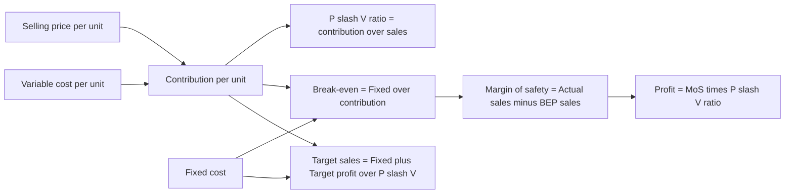
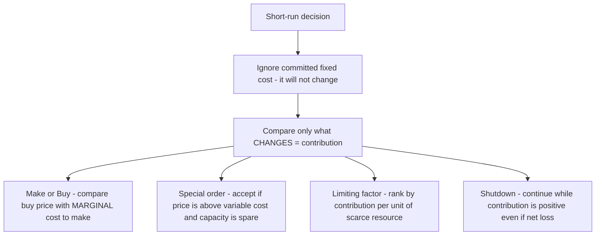

<!-- v2-deep -->

# Chapter 14 — Marginal Costing & CVP Analysis

## 1. The Problem — When Total Cost Lies to the Decision-Maker

You have spent thirteen chapters learning to build a *total cost*. You loaded material, labour and overhead onto a job, a batch, a process, a service, and you produced a single, respectable number: the full cost of one unit. That number is honest for one purpose — telling the world what a unit *cost to produce* over a whole period. It is invaluable for valuing inventory in the financial accounts and for setting a long-run price.

But now a manager walks in with a different kind of question, and the total-cost number quietly betrays her.

A factory makes a component. The cost sheet says it costs ₹45 a unit — ₹30 of material, labour and variable overhead, and ₹15 of fixed factory overhead absorbed on normal volume. An overseas buyer offers a one-time order at **₹35 a unit**. The plant has idle capacity; the regular market is untouched. The works manager glances at the cost sheet, sees ₹45, and says: *"₹35 is below cost. Reject it — we'll lose ₹10 a unit."*

She is **wrong**, and the total-cost number is why. Those ₹15 of fixed overhead — the factory rent, the supervisor's salary, the machine's depreciation — will be incurred *whether or not this order is accepted*. They do not change. Rejecting the order does not save ₹15; accepting it does not add ₹15. The only cost that actually moves when this order is taken is the ₹30 that varies with each extra unit. At ₹35, each unit brings in ₹35 and consumes ₹30 of genuinely additional cost, leaving **₹5 of pure surplus** to help pay for those fixed costs that exist anyway. Reject the order and the company is ₹5 a unit *poorer*.

This is the central failure that marginal costing exists to fix. **For a short-run decision, the total cost of a unit is not the cost of the decision.** Full cost mixes together two species of cost that behave in completely opposite ways:

- costs that **rise and fall with activity** (make one more, spend more; make one fewer, spend less), and
- costs that **sit there regardless** (make one more or a thousand fewer, they are unchanged in the period).

When you fuse the two into a single "₹45", you destroy the very information a decision needs — *what will actually change if I do this?* The manager who trusts total cost will reject profitable orders, keep loss-making products alive, make things she should buy, and shut down departments that were quietly subsidising the rent.

**The problem marginal costing solves:** separate the costs that respond to a decision from the costs that ignore it, so that every short-run choice — take the order, drop the product, make or buy, which product to push when capacity is scarce — is judged on the money that will *actually change*. Everything in this chapter flows from that single act of separation.

**A second, subtler symptom — profit that lurches without a change in sales.** Under the full-cost (absorption) system, a factory can sell exactly the same number of units in two years, at the same price, with the same costs, and yet report *different profits* — simply because it *produced* more in one year than the other, parking fixed overhead in unsold stock. A manager reading those two profit figures would swear something changed in the market; nothing did. Only the production-versus-sales relationship moved. Marginal costing exists partly to stop this: by refusing to let fixed cost hide in inventory, it makes profit move *with sales*, which is the number a manager can actually steer. Hold this thought — it becomes the engine of Section 5's reconciliation.

**Why "short-run" is the load-bearing word.** Marginal costing's whole claim — "ignore fixed cost, it will not change" — is true *only within the relevant range and only for the horizon over which those fixed costs are genuinely committed*. Over a long enough horizon, *every* cost is variable: leases expire, supervisors can be redeployed, capacity can be added or shed. So marginal costing is a tool for *tactical* decisions (this order, this quarter, this bottleneck), not for setting a permanent price floor. A firm that priced *every* sale at marginal cost would never recover its fixed costs and would die. The discipline is: use contribution to decide the *marginal* choice, but ensure that *across all sales* total contribution still clears total fixed cost with room to spare. Examiners love to test whether you know the boundary of the tool, not just the tool.

---

## 2. The Core Idea — The Cost of the *Next* Unit

Here is the analogy that unlocks the whole chapter.

You have booked a 50-seat bus for a private tour. The bus, the driver, the diesel for the fixed route, the toll — all of it is contracted at a flat **₹20,000** for the day, no matter how many friends you bring. Forty-five people have said yes. A forty-sixth friend calls and asks to come. What does *her* seat cost?

Not ₹20,000 ÷ 46. That "average cost per head" is a real number, but it is not the cost of *her*. Her presence changes nothing about the bus, the driver or the diesel — those are locked in. The only thing her seat adds is perhaps ₹50 for one extra packed lunch. **The cost of the next passenger is ₹50, not the average of ₹435.** So if she offers to chip in ₹200, you say yes instantly — because ₹200 comes in, ₹50 goes out, and ₹150 helps you recover the fixed ₹20,000 you are committed to anyway.

That ₹50 is the **marginal cost** — the cost of one more unit. That ₹150 surplus is the **contribution** — what the sale *contributes* first toward covering fixed costs, and then, once fixed costs are fully covered, toward profit.

This is the mental switch marginal costing demands. Stop asking *"what did a unit cost on average?"* Start asking *"what does the next unit add, and what does it contribute?"* The fixed cost is treated not as something to be smeared thinly over units, but as a **single lump the period must pay for** — a hurdle the total contribution must clear before a rupee of profit appears.

Formally, **marginal cost** is the aggregate of variable costs — the amount by which total cost increases if output rises by one unit (or falls if output drops by one unit). And the master relationship of the entire chapter, the equation you will use in a hundred disguises, is simply:

> **Sales − Variable Cost = Contribution**
> **Contribution − Fixed Cost = Profit**

Contribution is the hero. It is the fund every unit throws into a common pool; fixed cost is the bill that pool must first settle; profit is whatever is left. Once you *feel* that contribution — not profit-per-unit — is what each sale generates, break-even, margin of safety, product mix and shutdown all become obvious rather than memorised.

**A note on economists' "marginal cost" versus the accountant's.** In economics, marginal cost is the cost of the *very next* unit and it *changes* as output rises (falling then rising, giving a U-shaped curve, because of diminishing returns). The cost accountant deliberately makes a *simplifying assumption*: within the **relevant range** of activity, variable cost per unit is **constant**, so the accountant's marginal cost is a straight line, equal to variable cost per unit at every level. This is why CVP charts are drawn with straight lines. Know that this linearity is an *assumption*, valid only across the normal operating band — push output far beyond it and overtime premiums, bulk-buying discounts, and congestion break the straight line. An examiner testing "assumptions of CVP analysis" wants exactly this list (see 4.10).

**Contribution is not profit — guard the distinction ruthlessly.** A product with a *positive* contribution but which, after a share of fixed cost, shows a *loss* is still worth selling in the short run, because its contribution reduces the loss the rest of the firm must bear. Conversely, a high *contribution per unit* does not mean a product is best to push — if it devours scarce capacity, a lower-contribution product may win (Example 3). Every trap in this chapter is, at root, someone confusing contribution with profit, or contribution-per-unit with contribution-per-scarce-resource.

*The forty-sixth passenger costs ₹50 because the bus is already paid for; contribution is her fare minus that ₹50, and it is the only number that should decide whether she boards.*

---

## 3. Why It's Built This Way — Cost Behaviour, Not Cost Function

Why split costs by **behaviour** (variable vs fixed) rather than by **function** (production, admin, selling), which is how the cost sheet was built? Because a decision does not care *what a cost is for* — it cares *whether the cost will move.* Behaviour is the only classification that answers "what changes if I act?"

So marginal costing re-sorts every cost into three behavioural boxes:

- **Variable costs** move in direct proportion to activity — total varies, but cost *per unit* stays constant. Direct material, direct wages (where truly output-linked), variable overhead. In the analogy, the packed lunch.
- **Fixed costs** stay constant in total over the relevant range, so cost *per unit falls* as volume rises. Rent, salaries, straight-line depreciation, insurance. The bus hire. Crucially, fixed cost per unit is a *mathematical artefact* of the volume you happen to choose — which is exactly why it must never enter a decision.
- **Semi-variable costs** contain both (a telephone bill: fixed line rental + variable call charges; power: a fixed sanctioned-load charge + variable usage). These must be *split* into their fixed and variable parts before analysis — most commonly by the **high-low method**, which you meet in the technical section.

**A finer distinction the exam probes: fixed costs are not all alike.** Within "fixed" hide three sub-species, and decisions treat them differently:

- **Committed fixed costs** — locked in by past decisions and unavoidable in the short run: lease rent, depreciation on owned plant, insurance. These are the ones you *always* ignore in a short-run decision.
- **Discretionary (managed) fixed costs** — set by management policy each period and *can* be switched off: advertising, R&D, training budgets. Avoidable if the activity is dropped.
- **Stepped fixed costs** — fixed over a band of activity but jumping to a new level once a threshold is crossed (one more supervisor per shift, one more machine per 10,000 units). These are "fixed" only within their step; a decision that pushes activity across a step boundary *does* change them, and they must then be treated as relevant. Examiners hide a step-cost jump inside a "fixed cost" line to see if you notice.

The word **relevant range** now earns its keep: it is the band of activity over which the assumed behaviour holds — variable cost per unit constant, total fixed cost flat. Outside it, both assumptions fail. Every formula in this chapter carries the silent footnote "…within the relevant range."

Now the second design choice, the one that trips up every student: **how do you treat fixed factory overhead when valuing stock?** This single decision splits the world into two costing systems.

- **Marginal (variable) costing** says fixed factory overhead is a **cost of the *period*, not of the *product*.** The rent is incurred because a month passed, not because units were made. So it is charged in full against that period's contribution and **never carried in the value of unsold stock.** Inventory is valued at **variable cost only.**
- **Absorption (total) costing** — the method behind your cost sheet, and the one financial reporting standards (AS 2 / Ind AS 2) *require* for published accounts — says fixed factory overhead is a genuine cost of *making* the product, so it is **absorbed into each unit** and travels with unsold units into closing stock.

This one difference — *does fixed factory overhead sit in closing stock or not?* — is the sole reason the two methods report **different profits** in any period where production and sales volumes differ. Understanding *why* that gap arises, and being able to *reconcile* it to the last rupee, is a guaranteed exam requirement and the spine of Section 5's second example.

**Why standards forbid marginal costing for published accounts.** AS 2 / Ind AS 2 require inventory to include a *systematic allocation of fixed production overheads* based on *normal capacity*. The logic of external reporting is the **matching principle**: fixed factory overhead is a cost of *getting goods into a saleable state*, so it should be carried with the goods and matched against the *revenue* those goods eventually earn — not dumped into the period they were made. Marginal costing's period-cost treatment violates this matching, so it is barred from statutory accounts and used only *internally* for decisions. This is why every exam answer must flag: absorption for reporting, marginal for decisions. (Note the standard's phrase *normal capacity* — allocating fixed overhead on *normal* rather than *actual* output is what creates under/over-absorption, the bridge back to Chapter 4.)

**A common misconception to kill now:** marginal costing does *not* mean "ignore fixed costs." It charges the *entire* fixed cost against the period — arguably *more* aggressively than absorption, which defers part of it into stock. The difference is purely *timing and location* (period vs product), not whether fixed cost is ever counted. Over the whole life of the business, both methods report the *same total profit*; they only differ *period by period*.


*Behaviour, not function, is the sorting key — because a decision only reacts to costs that move, and fixed costs do not.*


*The single word "fixed" hides three behaviours — only the committed kind is safely ignorable in every short-run decision.*

---

## 4. Full Technical Content — Every Formula, With the Reason It Exists

### 4.1 The contribution family

Everything is one equation seen from different angles. Learn the equation; the formulas are just its rearrangements.

| Concept | Formula | What it answers |
|---|---|---|
| Marginal cost | Direct material + Direct labour + Direct expenses + Variable overhead | Cost added by one more unit |
| Contribution per unit (c) | Selling price − Variable cost per unit | Surplus each unit throws into the fixed-cost pool |
| Total contribution | Sales − Total variable cost, or c × units | The whole pool available for fixed cost + profit |
| Profit | Contribution − Fixed cost | What survives after the pool clears the hurdle |
| Contribution (identity) | Fixed cost + Profit | Same pool, viewed from where it goes |

That last identity — **Contribution = Fixed cost + Profit** — is worth its own line. It says the pool has exactly two destinations: pay the fixed bill, then become profit. It lets you find any one of the three when you know the other two, and it is the engine behind break-even (profit = 0, so contribution = fixed cost).

**The four-quadrant way to remember the whole family.** Any exam datum you are given is one corner of this square, and every other corner is one subtraction away:

```
        per unit            × units →           total
Sales   Selling price       ×  Q      =         Sales value
(−)     Variable cost/unit  ×  Q      =         Total variable cost
(=)     Contribution/unit   ×  Q      =         Total contribution
                                       (−) Fixed cost
                                       (=) Profit
```

Read down a column or across a row — the arithmetic is identical. Students lose marks by mixing a *per-unit* figure with a *total* figure in the same subtraction; keep each column pure and this never happens.

### 4.2 The P/V ratio — contribution as a *rate*

Contribution per unit is fine when you count units. But businesses often think in **rupees of sales**, and a multi-product firm cannot add "units" of a car and a pen. So we express contribution as a **percentage of sales value** — the **Profit/Volume ratio**, the single most useful ratio in the chapter.

$$\text{P/V ratio} = \frac{\text{Contribution}}{\text{Sales}} \times 100 = \frac{\text{Contribution per unit}}{\text{Selling price per unit}} \times 100$$

The P/V ratio is the **contribution earned per rupee of sales.** A P/V ratio of 40% means every ₹100 of sales generates ₹40 of contribution. Its power is that it is (usually) *constant* regardless of volume, so it converts freely between sales value and contribution.

Because selling price and variable cost per unit are constant, the P/V ratio can also be found from **any two periods'** data — it strips out fixed cost entirely:

$$\text{P/V ratio} = \frac{\text{Change in Contribution}}{\text{Change in Sales}} \times 100 = \frac{\text{Change in Profit}}{\text{Change in Sales}} \times 100$$

(Change in profit equals change in contribution because fixed cost, being fixed, does not change between the two periods — so it cancels. This is the standard "two-year" exam trick.)

**The complementary identity — the variable-cost ratio.** Since every rupee of sales splits into contribution and variable cost, the two ratios must sum to 1:

$$\text{P/V ratio} + \frac{\text{Variable cost}}{\text{Sales}} = 100\%$$

So a 40% P/V ratio means a 60% variable-cost-to-sales ratio. This is a fast route when the examiner gives you variable cost as a percentage of sales: P/V = 1 − (VC/Sales). It also explains *why raising the selling price* lifts the P/V ratio more powerfully than an equal rupee cut in variable cost — a price rise adds to the numerator (contribution) *and* the denominator (sales), but the numerator's proportional gain dominates near typical margins.

**How to improve the P/V ratio** (a favourite theory question): raise selling price; reduce variable cost per unit (cheaper materials, better labour efficiency, lower variable overhead); change the sales mix toward higher-P/V products. Note fixed cost does *not* appear — it cannot change the P/V ratio. A frequent trap: candidates list "reduce fixed cost" as a way to raise the P/V ratio. It is not — reducing fixed cost lowers the break-even point and raises profit, but the P/V ratio is untouched because fixed cost sits nowhere in its formula.

### 4.3 Break-even — the point where contribution exactly clears the hurdle

The **break-even point (BEP)** is the activity level at which total contribution exactly equals fixed cost, so profit is zero — no profit, no loss. It matters because it is the *floor of survival*: below it you bleed, above it you earn. Set Profit = 0 in the master identity (Contribution = Fixed cost) and solve:

$$\text{BEP (units)} = \frac{\text{Fixed cost}}{\text{Contribution per unit}} \qquad \text{BEP (₹ sales)} = \frac{\text{Fixed cost}}{\text{P/V ratio}}$$

Both say the same thing: keep piling on contribution until the pile equals fixed cost. In units, each unit adds *c*; in rupees, each rupee of sales adds the P/V ratio. (You can also get BEP sales as BEP units × selling price — they must agree; use it to self-check.)

**Cash break-even point** — some fixed costs (depreciation, amortisation) are *non-cash*. The level of sales at which you break even *in cash* is lower, because you only need to cover the cash fixed costs:

$$\text{Cash BEP (units)} = \frac{\text{Fixed cost} - \text{Non-cash fixed cost}}{\text{Contribution per unit}}$$

**How the BEP *moves* — a source of many small MCQs.** Reason it from the formula, never memorise the direction:

- Fixed cost **rises** → BEP **rises** (bigger hurdle, more units to clear it).
- Contribution per unit **rises** (higher price or lower variable cost) → BEP **falls** (each unit clears more of the hurdle).
- A **change in sales mix** toward higher-P/V products **lowers** the composite BEP; toward lower-P/V products **raises** it.
- A change in **volume alone** does *not* move the BEP — the BEP is a property of the cost structure, not of how much you happen to sell.

**Composite vs product-level thinking.** In a single-product firm the BEP is a genuine unit count. In a multi-product firm the "BEP in units" is meaningless unless the mix is fixed; you must work in sales value using the composite P/V ratio (4.9). Watch for a question that gives per-unit data for several products and *silently expects* you to notice you cannot just add units.

### 4.4 Margin of safety — how far you can fall before you bleed

Knowing the BEP, the next question is: *how much cushion do I have?* The **margin of safety (MoS)** is the excess of actual (or budgeted) sales over break-even sales — the distance you can lose before profit turns to loss.

$$\text{MoS} = \text{Actual sales} - \text{Break-even sales} \qquad \text{MoS ratio} = \frac{\text{MoS}}{\text{Actual sales}} \times 100$$

The most *revealing* form connects MoS straight to profit — because every rupee of sales *beyond* break-even is pure contribution (fixed cost is already paid), all of it drops to profit:

$$\text{Profit} = \text{MoS (in ₹)} \times \text{P/V ratio} \qquad \Longrightarrow \qquad \text{MoS (₹)} = \frac{\text{Profit}}{\text{P/V ratio}}$$

A large margin of safety means a business that can weather a slump; a thin one means danger. To *improve* it: increase sales, reduce fixed cost (lowers BEP), raise the P/V ratio, or drop unprofitable low-contribution lines.

**A powerful shortcut the MoS ratio hides.** Because Profit = MoS × P/V ratio and BEP-portion of sales earns zero profit, the **MoS ratio equals the fraction of your P/V-generated contribution that survives as profit**. Equivalently:

$$\text{MoS ratio} = \frac{\text{Profit}}{\text{Contribution}} \qquad\text{and}\qquad \text{Profit} = \text{Sales} \times \text{P/V ratio} \times \text{MoS ratio}$$

So if P/V ratio is 40% and MoS ratio is 25%, profit is 10% of sales — computed without ever finding fixed cost. Examiners set questions giving you *only* the P/V ratio and the MoS ratio and asking for profit as a percentage of sales; this identity answers them in one line.

### 4.5 Target profit — break-even's ambitious cousin

Break-even asks "cover fixed cost." Managers ask "earn ₹X profit." Just raise the hurdle: the pool must now cover **fixed cost *plus* the desired profit.**

$$\text{Units for target profit} = \frac{\text{Fixed cost} + \text{Target profit}}{\text{Contribution per unit}} \qquad \text{Sales for target profit} = \frac{\text{Fixed cost} + \text{Target profit}}{\text{P/V ratio}}$$

If the target profit is stated **after tax**, gross it up first: Required pre-tax profit = After-tax target ÷ (1 − tax rate), then use the pre-tax figure above.

**Target profit stated as a percentage — two very different tweaks.** Read the wording with care:

- *Profit as a % of **sales*** (say "profit must be 10% of sales"): here target profit itself depends on the unknown sales, so bring it into the P/V ratio. Required sales = Fixed cost ÷ (P/V ratio − required profit % of sales). Treating the required margin as a reduction in the effective P/V ratio is the clean method.
- *Profit as a % of **capital employed** or a fixed rupee sum*: this is a constant, so use the ordinary target-profit formula.

Mixing these two is a classic slip — the first needs the profit % *inside* the denominator, the second needs it as a *numerator* addition. Decide which by asking: "does the target grow as sales grow?" If yes, it belongs in the denominator.

And the general profit equation, which subsumes all of the above:

$$\text{Profit} = (\text{Sales} \times \text{P/V ratio}) - \text{Fixed cost}$$

### 4.6 The CVP relationship, in one picture

Cost-Volume-Profit (CVP) analysis is simply the study of how profit responds as volume moves — everything in 4.3–4.5 is one continuous story.


*One chain: price and variable cost fix contribution; contribution and fixed cost fix break-even; the gap above break-even, taxed at the P/V rate, is profit.*

### 4.7 The break-even chart and the angle of incidence

Plot sales value on the vertical axis against volume on the horizontal. Draw a horizontal-ish **fixed cost line**, a **total cost line** starting at the fixed-cost intercept and sloping up by variable cost, and a **sales line** from the origin. Where sales crosses total cost is the **break-even point**. To its left is a loss wedge; to its right, a profit wedge.

The **angle of incidence** is the angle at which the sales line cuts the total cost line at the BEP. A *wide* angle means profit accumulates rapidly once you pass break-even (high P/V ratio, strong earning power); a *narrow* angle means profit crawls up slowly. Together with the margin of safety, it summarises a firm's profit health at a glance.

**Reading the chart's economics — what each feature *means*:**

- The **fixed-cost line's height** is the hurdle; a firm with high fixed cost has a high line and therefore a distant break-even — high operating leverage, high risk, high reward.
- The **gap between the sales line and the total-cost line** at any volume *is* the profit (or loss) at that volume; the vertical distance is literally the P&L.
- The **best pair of health signals** is a *high margin of safety* (break-even far to the left of actual sales) *and* a *wide angle of incidence* (profit builds fast beyond it). A firm can have one without the other — a low-fixed-cost trader may break even early but earn a thin margin per rupee (narrow angle); a capital-heavy manufacturer may break even late but coin money past it (wide angle).

**Two chart variants examiners ask you to distinguish:**

- The **contribution break-even chart** plots the *variable cost line first* (from the origin), then stacks fixed cost on top to reach total cost. Its advantage: the *contribution* is shown directly as the wedge between the sales line and the variable-cost line, so you *see* contribution covering fixed cost then becoming profit. The conventional chart plots fixed cost first and hides contribution.
- The **profit-volume (P/V) graph** dispenses with cost lines entirely. It plots *profit* on the vertical axis against sales on the horizontal — a single straight line starting at *minus fixed cost* (the loss when sales are zero) and crossing the horizontal axis at the break-even point. Its slope *is* the P/V ratio. It is the fastest way to read off profit at any sales level and to compare two products' earning power (steeper line = higher P/V ratio). Know that the P/V graph's horizontal intercept = BEP and its vertical intercept = −Fixed cost; these two facts answer most P/V-graph MCQs.

### 4.8 Splitting semi-variable cost — the high-low method

Before any of this works, mixed costs must be split. The **high-low method** uses the highest and lowest activity levels:

$$\text{Variable cost per unit} = \frac{\text{Cost at highest activity} - \text{Cost at lowest activity}}{\text{Highest units} - \text{Lowest units}}$$

Then Fixed cost = Total cost at any level − (Variable cost per unit × units at that level).

**Two refinements the exam slips in:**

- **Pick by activity level, not by cost.** The "high" and "low" points are the highest and lowest *activity (units/hours)*, even if some middle month has a higher *cost*. Choosing by cost is a classic error.
- **Step changes and inflation break the method.** If fixed cost jumped between the two chosen periods (a stepped cost, or a mid-year rent revision), the plain high-low result is contaminated — you must adjust the high-period cost back to the low-period price basis before differencing. The high-low method assumes a *single* linear cost function across the whole range; flag it if the data hints otherwise. It also uses only two data points and ignores all the rest, so it is cruder than the least-squares regression you may meet elsewhere — a valid "limitations" point.

### 4.9 Multi-product (composite) break-even

When a firm sells several products in a **fixed sales mix**, you cannot use one contribution-per-unit. Compute a **composite (overall) P/V ratio** and break even in sales value:

$$\text{Composite P/V ratio} = \frac{\text{Total contribution of all products}}{\text{Total sales of all products}} \times 100 \qquad \text{Composite BEP (₹)} = \frac{\text{Total fixed cost}}{\text{Composite P/V ratio}}$$

Then split the composite break-even sales back into products in the sales-value ratio to get each product's break-even sales.

**Two rival ways to define the mix — do not confuse them.** The composite P/V ratio above weights by *sales value*. An alternative approach fixes the mix in *physical units* and builds a "composite unit" (e.g., a bundle of 3 of A + 2 of B), finds the contribution per bundle, and divides fixed cost by it to get the number of bundles at break-even. Both are correct; the sales-value method is faster when data are in rupees, the composite-unit method when a physical mix ratio is given. The pitfall: the break-even is valid **only for that exact mix** — change the proportions and the whole answer changes, because the composite P/V ratio shifts. Always state the mix assumption in your answer.

### 4.10 The assumptions (and therefore the limitations) of CVP analysis

Every CVP formula rests on a set of assumptions; each assumption is also a limitation, and stating them is a standard theory sub-question. Marks are awarded for the list *and* for showing you know why each matters:

- **Cost behaviour is linear** within the relevant range — variable cost per unit and selling price per unit are constant. Reality: bulk discounts, overtime premiums and price cuts to sell more volume all bend the lines.
- **Costs split cleanly into fixed and variable** — semi-variable costs are fully separable. Reality: the split is an estimate (high-low, regression), never exact.
- **Fixed costs stay constant** over the whole range. Reality: they step up at capacity thresholds.
- **Production equals sales** (no change in stock), so that volume alone drives both cost and revenue. When stock changes, absorption and marginal profits diverge (Section 5).
- **Sales mix is constant** in a multi-product firm — otherwise the composite P/V ratio is unstable.
- **Only volume affects cost and revenue** — technology, efficiency and price levels are held constant. It is a *short-run, single-period, static* model.

Because of these, CVP is a *planning approximation*, not a precise forecast — best for comparing options and finding the break-even neighbourhood, not for predicting profit to the rupee at extreme volumes.

---

## 5. Worked Examples — From Textbook-Easy to Exam-Hard

### Example 1 — The full CVP toolkit on one product *(foundation)*

**Data.** Excel Ltd makes a single product. Selling price ₹50 per unit; variable cost ₹30 per unit; fixed costs ₹2,00,000 per year. Current sales 15,000 units.
Required: (a) contribution per unit and P/V ratio; (b) BEP in units and rupees; (c) margin of safety and its ratio; (d) current profit; (e) units and sales needed for a target profit of ₹1,00,000; (f) sales needed for an after-tax profit of ₹63,000 at a 30% tax rate.

**Step 1 — Contribution and P/V ratio.**
Contribution per unit = 50 − 30 = **₹20.**
P/V ratio = 20 ÷ 50 × 100 = **40%.**

**Step 2 — Break-even.**
BEP (units) = Fixed cost ÷ contribution per unit = 2,00,000 ÷ 20 = **10,000 units.**
BEP (₹) = Fixed cost ÷ P/V ratio = 2,00,000 ÷ 0.40 = **₹5,00,000.**
*Self-check:* 10,000 units × ₹50 = ₹5,00,000. ✓

**Step 3 — Margin of safety.**
Actual sales = 15,000 × 50 = ₹7,50,000.
MoS = 7,50,000 − 5,00,000 = **₹2,50,000** (or 15,000 − 10,000 = 5,000 units).
MoS ratio = 2,50,000 ÷ 7,50,000 × 100 = **33.33%.**

**Step 4 — Current profit.**
Profit = Contribution − Fixed = (15,000 × 20) − 2,00,000 = 3,00,000 − 2,00,000 = **₹1,00,000.**
*Self-check via MoS:* Profit = MoS × P/V ratio = 2,50,000 × 0.40 = ₹1,00,000. ✓

**Step 5 — Target profit of ₹1,00,000.**
Units = (Fixed + target) ÷ c = (2,00,000 + 1,00,000) ÷ 20 = **15,000 units.**
Sales = 3,00,000 ÷ 0.40 = **₹7,50,000.** (Consistent with current level — current profit *is* ₹1,00,000.) ✓

**Step 6 — After-tax target of ₹63,000 at 30% tax.**
Pre-tax profit needed = 63,000 ÷ (1 − 0.30) = 63,000 ÷ 0.70 = ₹90,000.
Sales = (Fixed + pre-tax profit) ÷ P/V ratio = (2,00,000 + 90,000) ÷ 0.40 = 2,90,000 ÷ 0.40 = **₹7,25,000** (14,500 units).
*Self-check:* Contribution 14,500 × 20 = 2,90,000; less fixed 2,00,000 = pre-tax 90,000; tax 30% = 27,000; after-tax = 63,000. ✓

**Examiner tweak — "what if fixed cost rises by ₹40,000 and the firm still wants ₹1,00,000 profit?"** New hurdle = 2,40,000 + 1,00,000 = 3,40,000; units = 3,40,000 ÷ 20 = 17,000; sales = ₹8,50,000. Notice the BEP itself also moved: new BEP = 2,40,000 ÷ 20 = 12,000 units. This is the fastest way to *feel* that fixed cost drives the break-even but never the P/V ratio (still 40%).

---

### Example 2 — Marginal vs Absorption profit, fully reconciled *(the guaranteed exam question)*

**Data.** Sunrise Ltd, for the year:

| Item | Figure |
|---|---|
| Units produced | 10,000 |
| Units sold | 8,000 |
| Selling price per unit | ₹100 |
| Variable manufacturing cost per unit | ₹60 |
| Fixed manufacturing overhead (for the year) | ₹1,50,000 |
| Fixed selling & administration overhead | ₹50,000 |

There was no opening stock. Fixed manufacturing overhead is absorbed on the basis of *normal* production of 10,000 units. Prepare profit statements under **marginal** and **absorption** costing and **reconcile** the difference.

**Preliminary numbers.**
Closing stock = 10,000 produced − 8,000 sold = **2,000 units.**
Fixed manufacturing OH absorption rate = 1,50,000 ÷ 10,000 = **₹15 per unit.**
Absorption cost per unit = variable 60 + fixed 15 = **₹75.**

**(A) Marginal costing statement** — stock valued at variable cost (₹60) only; all fixed cost charged to the period.

| Marginal costing | ₹ |
|---|---:|
| Sales (8,000 × 100) | 8,00,000 |
| Less: Variable cost of sales (8,000 × 60) | 4,80,000 |
| **Contribution** | **3,20,000** |
| Less: Fixed manufacturing overhead | 1,50,000 |
| Less: Fixed selling & admin overhead | 50,000 |
| **Profit** | **1,20,000** |

*(Closing stock here is valued at 2,000 × ₹60 = ₹1,20,000 — no fixed cost inside it.)*

**(B) Absorption costing statement** — stock valued at full cost (₹75); fixed manufacturing OH flows through cost of goods sold.

| Absorption costing | ₹ |
|---|---:|
| Sales (8,000 × 100) | 8,00,000 |
| Cost of goods produced (10,000 × 75) | 7,50,000 |
| Less: Closing stock (2,000 × 75) | 1,50,000 |
| Cost of goods sold | 6,00,000 |
| **Gross profit** | **2,00,000** |
| Less: Fixed selling & admin overhead | 50,000 |
| Under/over absorption of fixed OH | Nil |
| **Profit** | **1,50,000** |

*(Absorbed fixed OH = 10,000 × 15 = ₹1,50,000 = actual fixed OH, so there is no under/over-absorption. Closing stock now carries 2,000 × ₹75 = ₹1,50,000, of which 2,000 × ₹15 = ₹30,000 is fixed overhead.)*

**(C) Reconciliation.**
Difference in profit = 1,50,000 − 1,20,000 = **₹30,000**, absorption being higher.

| Reconciliation | ₹ |
|---|---:|
| Profit as per marginal costing | 1,20,000 |
| Add: Fixed manufacturing OH carried forward in closing stock (2,000 × 15) | 30,000 |
| **Profit as per absorption costing** | **1,50,000** |

**Why absorption shows more profit here.** Production (10,000) exceeded sales (8,000). Under absorption costing, ₹30,000 of this year's fixed overhead is "parked" inside the 2,000 unsold units and pushed into *next* year, so only ₹1,20,000 of fixed manufacturing OH is charged against this year's sales. Marginal costing refuses to park anything — it charges the full ₹1,50,000 now. Hence the ₹30,000 gap.

**The rule that saves exam time:**
- Production **>** Sales (stock rises) → **Absorption profit > Marginal profit.**
- Production **<** Sales (stock falls) → **Absorption profit < Marginal profit** (fixed OH from *last* year's stock is released into this year's cost of sales).
- Production **=** Sales (no stock change) → **Profits are equal.**

**Year-2 continuation — where the trap really bites.** Suppose in Year 2 Sunrise *produces* 7,000 units but *sells* 9,000 (drawing down the 2,000 opening stock to zero). Same prices and costs; assume normal capacity is still 10,000 units so the absorption rate stays ₹15.

- *Marginal Year 2:* Contribution = 9,000 × (100 − 60) = 3,60,000; less fixed 1,50,000 + 50,000 = **profit ₹1,60,000.**
- *Absorption Year 2:* Opening stock carries ₹15 fixed OH per unit; selling those units *releases* that parked overhead into this year's cost of sales. Stock fell by 2,000 units, so absorption profit is **lower** than marginal by 2,000 × ₹15 = ₹30,000 → **profit ₹1,30,000.** *But note* production (7,000) is below normal (10,000), so fixed OH is **under-absorbed** by (10,000 − 7,000) × 15 = ₹45,000, which must be charged to Year 2 as well. A full absorption statement here would show gross profit reduced by that under-absorption. The teaching point: when production ≠ normal capacity, absorption profit carries a *second* adjustment — under/over-absorption — on top of the stock-movement effect. Marginal costing has neither.
- *Two-year total check:* Over Years 1+2, total produced = 17,000, total sold = 17,000, closing stock nil. Both methods must report the *same* cumulative profit. Marginal total = 1,20,000 + 1,60,000 = ₹2,80,000. Absorption total must also be ₹2,80,000 once Year 2's under-absorption and stock release are correctly booked — the ₹30,000 that absorption "gained" in Year 1 is exactly given back in Year 2. This is the deepest lesson of the chapter: the methods differ only in *timing*, never in *lifetime* profit.

**Examiner tweak — actual fixed OH ≠ absorbed.** If actual fixed manufacturing OH had been ₹1,60,000 while ₹1,50,000 was absorbed (on 10,000 units at ₹15), the ₹10,000 shortfall is **under-absorption**, charged to the absorption P&L, cutting absorption profit to ₹1,40,000. Marginal costing is *unaffected* — it never had a rate to over- or under-recover; it simply charges the actual ₹1,60,000 to the period. The reconciliation then has two lines: +₹30,000 fixed OH in closing stock, and the under-absorption sits only on the absorption side. Always separate the *stock-movement* effect from the *under/over-absorption* effect; they are different animals.

---

### Example 3 — Limiting (key) factor and best product mix *(exam-hard)*

**Data.** Trident Ltd makes three products, A, B and C, all on the same machine. Machine capacity is limited to **20,000 machine hours** this year. Fixed costs are ₹1,00,000.

| Per unit | A | B | C |
|---|---:|---:|---:|
| Selling price (₹) | 100 | 90 | 160 |
| Variable cost (₹) | 60 | 60 | 100 |
| Machine hours per unit | 2 | 1 | 4 |
| Maximum market demand (units) | 5,000 | 6,000 | 3,000 |

Determine the product mix that maximises profit, and compute that profit.

**Step 1 — The trap: do NOT rank by contribution per unit.**
Contribution per unit: A = 40, B = 30, C = 60. Ranked this way, C looks best. **This is wrong.** When machine hours are the bottleneck, the scarce resource is *machine hours*, not units. The right question is *"which product wrings the most contribution out of each scarce hour?"*

**Step 2 — Rank by contribution per unit of the limiting factor (machine hour).**

| | A | B | C |
|---|---:|---:|---:|
| Contribution per unit (₹) | 40 | 30 | 60 |
| Machine hours per unit | 2 | 1 | 4 |
| **Contribution per machine hour (₹)** | **20** | **30** | **15** |
| **Rank** | **2** | **1** | **3** |

B, the product with the *lowest* contribution per unit, is actually the **best** — it earns ₹30 of contribution from every scarce hour, twice what C manages.

**Step 3 — Allocate the 20,000 hours by rank, respecting demand ceilings.**

| Rank | Product | Units (up to demand) | Hours used | Hours left |
|---|---|---:|---:|---:|
| 1 | B | 6,000 | 6,000 × 1 = 6,000 | 14,000 |
| 2 | A | 5,000 | 5,000 × 2 = 10,000 | 4,000 |
| 3 | C | 4,000 hrs ÷ 4 = 1,000 | 4,000 | 0 |

B and A are made to full demand; C absorbs only the leftover 4,000 hours, giving 1,000 units (against demand of 3,000).

**Step 4 — Total contribution and profit.**

| Product | Units | Contribution/unit (₹) | Total contribution (₹) |
|---|---:|---:|---:|
| B | 6,000 | 30 | 1,80,000 |
| A | 5,000 | 40 | 2,00,000 |
| C | 1,000 | 60 | 60,000 |
| **Total contribution** | | | **4,40,000** |
| Less: Fixed cost | | | 1,00,000 |
| **Profit** | | | **3,40,000** |

**Proof that this mix is optimal.** Suppose we had (wrongly) prioritised C. Making C to full demand (3,000 units) would eat 12,000 hours, leaving 8,000 hours. Those 8,000 would go to B (6,000 hrs, 6,000 units) then A (2,000 hrs, 1,000 units). Contribution = C 1,80,000 + B 1,80,000 + A 40,000 = ₹4,00,000 — **₹40,000 worse.** The limiting-factor ranking wins by exactly the contribution/hour logic.

**Examiner tweak 1 — a minimum-supply contract.** Suppose Trident has *contracted* to supply at least 2,000 units of C regardless of profitability. Reserve those first: C 2,000 units × 4 hrs = 8,000 hours, contribution 2,000 × 60 = 1,20,000. That leaves 12,000 hours for free allocation by rank: B 6,000 units (6,000 hrs), then A 3,000 units (6,000 hrs) — A now capped by *hours*, not demand (only 3,000 of its 5,000 demand met). Contribution = C 1,20,000 + B 1,80,000 + A 1,20,000 = ₹4,20,000; profit ₹3,20,000. The lesson: a contractual minimum is carved out *before* ranking, and it *costs* you — here ₹20,000 of profit — which is the price of the commitment.

**Examiner tweak 2 — two limiting factors at once.** If, besides 20,000 machine hours, material were also capped (say each unit needs kilograms of a rationed input), a simple ranking no longer works because the best product on *hours* may be the worst on *material*. The problem becomes **linear programming** — formulate an objective (maximise total contribution) subject to both constraints, and solve graphically (two products) or by simplex. For CA Intermediate, recognise the *trigger* — "two or more binding constraints" means single-factor ranking fails and LP is required — even if the full LP solution is beyond this paper.

**Examiner tweak 3 — a "make or buy the shortfall" option.** If C could be *bought in* at ₹150 to meet its unmet demand of 2,000 units, compare the buy-in cost (₹150) with C's own variable cost (₹100). The extra ₹50 per unit is the price of relieving the bottleneck; buy in only if the contribution earned by *not* diverting machine hours to make C exceeds that ₹50 premium. This links limiting-factor analysis straight to the make-or-buy logic of Section 8.

---

### Example 4 — Two-period data, missing fixed cost, and P/V-ratio inference *(exam-hard, no per-unit data)*

**Data.** Meridian Ltd gives only period totals — no selling price or unit cost is disclosed:

| | Year 1 | Year 2 |
|---|---:|---:|
| Sales (₹) | 12,00,000 | 15,00,000 |
| Profit (₹) | 1,50,000 | 2,40,000 |

Required: (a) P/V ratio; (b) total fixed cost; (c) break-even sales; (d) margin of safety in Year 2; (e) sales required for a profit of ₹3,00,000; (f) profit if sales fall to ₹10,00,000.

**Step 1 — P/V ratio from the change (fixed cost cancels).**
Change in sales = 15,00,000 − 12,00,000 = 3,00,000.
Change in profit = 2,40,000 − 1,50,000 = 90,000.
P/V ratio = 90,000 ÷ 3,00,000 × 100 = **30%.**

**Step 2 — Fixed cost (use either year; contribution − profit = fixed).**
Year 1 contribution = 12,00,000 × 0.30 = 3,60,000; fixed = 3,60,000 − 1,50,000 = **₹2,10,000.**
*Self-check with Year 2:* 15,00,000 × 0.30 = 4,50,000 contribution; less fixed 2,10,000 = profit 2,40,000. ✓

**Step 3 — Break-even sales.**
BEP = Fixed ÷ P/V ratio = 2,10,000 ÷ 0.30 = **₹7,00,000.**

**Step 4 — Margin of safety, Year 2.**
MoS = 15,00,000 − 7,00,000 = **₹8,00,000** (MoS ratio = 8,00,000 ÷ 15,00,000 = 53.33%).
*Self-check:* Profit = MoS × P/V ratio = 8,00,000 × 0.30 = 2,40,000. ✓

**Step 5 — Sales for a profit of ₹3,00,000.**
Sales = (Fixed + target) ÷ P/V ratio = (2,10,000 + 3,00,000) ÷ 0.30 = 5,10,000 ÷ 0.30 = **₹17,00,000.**

**Step 6 — Profit if sales fall to ₹10,00,000.**
Profit = Sales × P/V ratio − Fixed = 10,00,000 × 0.30 − 2,10,000 = 3,00,000 − 2,10,000 = **₹90,000.**
*Self-check via MoS:* MoS = 10,00,000 − 7,00,000 = 3,00,000; × 0.30 = ₹90,000. ✓

**Why this problem type matters.** It tests whether you truly understand that the P/V ratio is a property of the *cost structure*, extractable from any two periods without a single per-unit figure, and that fixed cost then falls out as contribution minus profit. Candidates who can only work forward from per-unit data freeze here. The whole solution rests on one insight: *between two periods at constant prices and costs, the only thing that changes profit is the contribution on the extra sales* — so ΔProfit ÷ ΔSales must be the P/V ratio.

---

## 6. Presentation & Format — How to Lay It Out in the Exam

**Always show the contribution line explicitly.** In every marginal statement, the sequence is: Sales → less Variable cost → **Contribution** (a bolded subtotal) → less Fixed cost → Profit. Examiners award marks for the *structure*, not just the final number. Contrast this with the absorption format, which shows **Gross profit** (Sales − full cost of sales) and only then deducts non-manufacturing costs.

**A clean comparative skeleton to reproduce:**

| Particulars | Marginal costing | Absorption costing |
|---|---|---|
| Stock valuation | Variable production cost only | Variable + fixed production cost |
| Fixed factory OH | Period cost — charged in full | Absorbed into units, part carried in stock |
| Sub-total highlighted | **Contribution** | **Gross profit** |
| Under/over-absorption | Does not arise | Must be shown and adjusted |
| Reporting acceptability | Internal decisions only | Required by AS 2 / Ind AS 2 for accounts |
| Profit driven by | **Sales** volume | Sales *and* production volume |
| Effect of building stock | No profit boost | Profit inflated (fixed OH deferred) |

**The last two rows are examinable theory in their own right.** Because absorption profit rises when you merely *produce* more (parking fixed overhead in stock), it can be *manipulated* — a manager can flatter this year's profit by overproducing into inventory. Marginal costing removes the temptation: with fixed cost fully expensed each period, profit moves only when *sales* move. This "no incentive to overproduce" property is marginal costing's headline *advantage* for internal control, and a stock exam point.

**For CVP answers**, present formulas *before* substituting numbers, keep P/V ratio to two decimals, and *always* add a self-check line (e.g., "BEP units × price = BEP sales ✓"). State the units of your answer (units vs ₹) explicitly — a bare number loses marks. **For reconciliation**, the safest layout is a three-line bridge: start from one method's profit, add or subtract the fixed overhead in the *change* in stock, and arrive at the other method's profit — label the adjustment "Fixed OH in closing stock" or "…released from opening stock" so the examiner sees you understand *why*, not just *that*, they differ. **For limiting-factor problems**, the mark-scoring skeleton is: (i) identify the limiting factor, (ii) a table of contribution per unit of that factor, (iii) an explicit *ranking* row, (iv) an allocation table respecting demand ceilings and any minimum commitments, (v) a final contribution-and-profit statement. Missing the ranking row is the commonest way to lose method marks even with a correct final answer.

---

## 7. Connections — Where This Sits in the Syllabus

- **Overhead absorption (Ch. 4)** is marginal costing's mirror image. There you learned to *absorb* fixed factory overhead into units via a recovery rate; here you learn *why*, for decisions, you should *not*. The under/over-absorption you computed in Ch. 4 is exactly the quantity that vanishes under marginal costing — because there is no fixed rate to over- or under-recover. Example 2's "under-absorption" tweak is Chapter 4 living inside Chapter 14.
- **Standard costing & variances (Ch. 13)**: the **fixed overhead volume variance** exists *only* under absorption costing — it measures the effect of the very fixed-cost-in-units mechanism this chapter isolates. Under marginal standard costing, fixed overhead has only an *expenditure* variance, no volume variance. This chapter is the conceptual key to that difference.
- **Budgeting & flexible budgets (Ch. 15)**: a flexible budget *is* cost-behaviour analysis — it flexes variable cost with activity while holding fixed cost, precisely the split you make here. The **cash budget** connects to cash break-even.
- **Cost sheet (Ch. 6)** builds the total cost that this chapter warns you not to use for decisions.
- **Process costing & inventory valuation**: the choice of stock valuation base (variable vs full cost) that drives Example 2's profit gap is the same choice that would change closing WIP and finished-goods values in a process account — the ₹30,000 "in stock" is not academic; it changes the balance sheet.
- **Relevant costing / decision-making (advanced)**: make-or-buy, special orders and shutdown, worked in Section 8, are the foundation of the relevant-cost decisions you meet later — where **opportunity cost** (the contribution foregone on the best displaced alternative) and **avoidable fixed cost** extend the same contribution logic. When capacity is *full*, the special-order decision must add the opportunity cost of displaced regular sales — the bridge from this chapter to full relevant costing.

---

## 8. Decision-Making Applications — Contribution as the Universal Judge

Every short-run decision reduces to one test: **does this action increase total contribution, given that committed fixed costs will not change?** Here are the four classic exam decisions, each solved by that one idea.


*Four different questions, one answer: choose the option that leaves total contribution highest, because fixed cost is a sunk backdrop.*

**Before the four decisions — the one qualifier that overrides them all: is there spare capacity?** The clean "ignore fixed cost, chase contribution" rule assumes idle capacity, so that doing the new thing costs nothing you were already earning. The moment capacity is *full*, every new unit *displaces* an existing one, and the contribution given up on the displaced unit — the **opportunity cost** — must be charged against the new decision. Half the difficulty in exam decision questions is spotting that capacity is full and remembering to add opportunity cost. Read every decision problem asking first: *"Is capacity spare or full?"*

### 8.1 Make or Buy

**Compare the outside buying price with the *marginal* (variable) cost of making — not the full cost.** Fixed overhead already exists and is irrelevant *unless* making the part avoids a specific fixed cost or buying releases capacity for a more profitable use.

**Example.** A component's own cost sheet shows: material ₹8, labour ₹5, variable overhead ₹3, fixed overhead ₹4 → full cost ₹20. A supplier offers it at **₹18**.
Naïve view: ₹18 < ₹20, so buy. **Wrong.** The relevant make cost is the *marginal* cost = 8 + 5 + 3 = **₹16**. The ₹4 fixed overhead continues whether you make or buy. Since ₹16 (make) < ₹18 (buy), **make it** — buying wastes ₹2 per unit. (You would only switch to buying if the ₹4 fixed cost were *actually avoidable* on outsourcing, or if the freed capacity earned more than ₹2/unit elsewhere.)

**The two exceptions that flip the answer — examiners live here:**

- **Avoidable fixed cost.** If, say, ₹3 of the ₹4 fixed overhead is a *dedicated* supervisor's salary that *ceases* on outsourcing, the true make cost is 16 + 3 = ₹19, now *above* the ₹18 buy price → **buy.** Only *avoidable* fixed cost enters the comparison; the unavoidable ₹1 stays out.
- **Opportunity cost of freed capacity.** If making the part ties up a machine that could otherwise earn ₹5 per part-equivalent of contribution making something else, add that ₹5 to the make cost (16 + 5 = ₹21 > 18) → **buy**, and redeploy the capacity. When capacity is spare and nothing else needs it, opportunity cost is zero and this term vanishes.

The general make-or-buy rule, stated fully: **make if [marginal cost to make + avoidable fixed cost + opportunity cost of capacity used] < buy-in price.**

### 8.2 Accept or Reject a Special Order

**Accept any special order priced above variable cost, provided (i) there is spare capacity and (ii) it will not spoil the regular-market price.** Every rupee above variable cost is extra contribution against unchanged fixed cost.

**Example.** Normal price ₹50, variable cost ₹30, fixed cost per unit ₹15 (full cost ₹45). A one-off export order arrives at **₹35** for 4,000 units; the plant has idle capacity and the export market is separate.
Full-cost thinking says ₹35 < ₹45 → reject. **Wrong.** Contribution per unit = 35 − 30 = **₹5.** Extra contribution = 4,000 × 5 = **₹20,000**, all of it additional profit because fixed cost is unchanged. **Accept.**

**Examiner tweak — capacity is full.** Suppose the plant is at capacity, so making 4,000 export units means selling 4,000 fewer at the regular ₹50 (contribution ₹20 each). The opportunity cost = 4,000 × 20 = ₹80,000, far above the ₹20,000 the export order brings → **reject.** The decision flips entirely on the capacity question. Always compute the *net* effect: extra contribution from the order minus contribution lost on displaced sales.

**Examiner tweak — an extra fixed cost to fulfil the order.** If accepting the export order requires ₹12,000 of special packaging or a new mould (a fixed cost incurred *only because of this order*), it becomes relevant: net gain = 20,000 − 12,000 = ₹8,000 → still accept, but the margin is thinner. An order-specific fixed cost, unlike committed fixed cost, *is* relevant because it would not exist without the decision.

**The non-financial trap.** Even when the numbers say accept, flag qualitative factors an examiner rewards: will the low export price leak back and undercut the ₹50 home market? Will regular customers demand the same discount? Is the buyer a long-term prospect or a one-off? A complete answer states the financial recommendation *and* these caveats.

### 8.3 Shutdown or Continue

A product or department showing a *net loss* need not be closed. **Continue as long as it earns positive contribution**, because that contribution helps pay fixed costs that would otherwise fall on the rest of the business. Compare the contribution earned against the fixed costs *actually saved* by closing.

**Example.** A division: sales ₹5,00,000, variable cost ₹3,50,000, fixed cost ₹2,00,000 → **net loss ₹50,000.** Closing it would save only ₹80,000 of the fixed cost (the rest — ₹1,20,000 of head-office and unavoidable charges — continues regardless).
Contribution while running = 5,00,000 − 3,50,000 = **₹1,50,000.**
If we *continue*: loss = ₹50,000 (as above).
If we *shut down*: we lose the ₹1,50,000 contribution but save ₹80,000 fixed → net position = −1,20,000 (unavoidable fixed) + 80,000 saved… i.e., loss = **₹1,20,000.**
Continuing loses ₹50,000; shutting down loses ₹1,20,000. **Keep it running** — it is absorbing ₹1,50,000 of fixed cost that would otherwise land elsewhere. The **shutdown point** is where contribution just equals the avoidable fixed cost; below that, close.

**The formal shutdown rule and its extra costs.** Continue while **Contribution > Avoidable fixed cost.** But a real shutdown decision also weighs:

- **Additional shutdown costs** — redundancy payments, penalties for breaking supply contracts, the cost of protecting idle plant. These make closing *more* expensive and tilt toward continuing.
- **Restart costs** — if the closure is temporary (a seasonal slump), re-recruiting and re-commissioning later may cost more than the loss avoided. Compare the contribution foregone during closure against the shutdown-plus-restart cost.
- **Qualitative factors** — losing skilled workers, market presence, and customer goodwill; the effect on morale of remaining staff. A product kept alive at break-even contribution may still be worth it to hold a market position.

So the exam-complete rule: shut down only if avoidable fixed cost saved *exceeds* (contribution lost + any incremental shutdown/restart costs), and only if qualitative factors do not override.

### 8.4 Product mix under a limiting factor

Fully worked in **Example 3** above, with three examiner tweaks (minimum-supply contracts, two simultaneous constraints → linear programming, and buy-in of the bottleneck shortfall): rank by **contribution per unit of the scarce resource**, then allocate the scarce resource top-rank first up to demand. This is the single most-tested decision in the chapter. The one non-negotiable step is *ranking by contribution per unit of the limiting factor*, never by contribution per unit of product.

### 8.5 Pricing floors and the danger of marginal-cost pricing

A recurring decision is *how low can price go?* Marginal costing gives the *absolute short-run floor*: any price above variable cost adds contribution. But three cautions, each an exam point:

- The floor is a **short-run, spare-capacity** floor. Set as a *permanent* price it guarantees losses, because fixed cost is never recovered. Long-run price must cover *total* cost plus a margin.
- Pricing at marginal cost in one market while charging full price in another (price discrimination, e.g., exports vs home) works only if the markets are genuinely **separable** — otherwise the low price contaminates the high one.
- In a **recession or to keep a plant running**, accepting orders at or slightly above marginal cost can be rational *temporarily* — the contribution reduces the loss versus idling — but the firm must have a plan to return to full-cost pricing.

---

## 9. First-Principles Recap — Rebuild the Chapter From One Sentence

Start with the sentence that generates everything: **"Only costs that change should decide an action."**

1. Costs come in two behaviours: **variable** (change with each unit) and **fixed** (unchanged in the period). A decision reacts only to the first. (And "fixed" itself hides committed, discretionary and stepped sub-types — only the *committed* kind is safely ignorable.)
2. So define **marginal cost** = variable cost of one more unit, and **contribution** = selling price − variable cost. Contribution is what each sale throws into a pool.
3. The pool has one job first — **cover fixed cost** — and only then does it become **profit**. Hence *Contribution = Fixed cost + Profit*.
4. Set profit to zero and the pool must just equal fixed cost: that is **break-even**. Express contribution as a rate of sales — the **P/V ratio** — and break-even in rupees falls out as Fixed ÷ P/V ratio. (The P/V ratio depends only on price and variable cost, so any two periods reveal it and fixed cost cannot touch it.)
5. The distance above break-even is the **margin of safety**, and because fixed cost is already paid there, all of it converts to profit at the P/V rate.
6. Raise the hurdle from "fixed cost" to "fixed cost + desired profit" and you get **target-profit** sales.
7. Because fixed cost is a period lump, marginal costing keeps it *out of stock*; absorption costing pushes it *into stock*. That single divergence makes their profits differ by exactly *the fixed overhead sitting in the change in inventory* — which is why they **reconcile** to the rupee, and why over the whole life of the business their *total* profits are identical.
8. Every decision — make/buy, special order, product mix, shutdown, pricing floor — is then the same move: **pick the option that leaves total contribution highest, ignoring the fixed cost that will not move** — *unless capacity is full, in which case charge the opportunity cost of what you displace, and unless a fixed cost is genuinely avoidable or order-specific, in which case it does change and counts.*

If you can regenerate the formulas from those eight steps, you never need to memorise a single one. The two escape hatches in step 8 — opportunity cost when capacity is full, avoidable/specific fixed cost — are where the hard marks live.

---

## 10. Quick-Revision Sheet

| # | Concept | Formula |
|---|---|---|
| 1 | Marginal cost | DM + DL + Direct expenses + Variable overhead |
| 2 | Contribution per unit | Selling price − Variable cost per unit |
| 3 | Total contribution | Sales − Variable cost = Fixed cost + Profit |
| 4 | Profit | Contribution − Fixed cost |
| 5 | P/V ratio | (Contribution ÷ Sales) × 100 = (Contribution per unit ÷ SP) × 100 |
| 6 | P/V ratio (two periods) | (Change in profit ÷ Change in sales) × 100 |
| 7 | Variable-cost ratio | (Variable cost ÷ Sales) × 100 = 100% − P/V ratio |
| 8 | Break-even (units) | Fixed cost ÷ Contribution per unit |
| 9 | Break-even (₹) | Fixed cost ÷ P/V ratio |
| 10 | Cash break-even (units) | (Fixed cost − Non-cash fixed cost) ÷ Contribution per unit |
| 11 | Margin of safety (₹) | Actual sales − Break-even sales = Profit ÷ P/V ratio |
| 12 | MoS ratio | (MoS ÷ Actual sales) × 100 = Profit ÷ Contribution |
| 13 | Profit (general) | (Sales × P/V ratio) − Fixed cost = MoS × P/V ratio |
| 14 | Profit as % of sales | P/V ratio × MoS ratio |
| 15 | Units for target profit | (Fixed cost + Target profit) ÷ Contribution per unit |
| 16 | Sales for target profit | (Fixed cost + Target profit) ÷ P/V ratio |
| 17 | Sales for profit = x% of sales | Fixed cost ÷ (P/V ratio − required % of sales) |
| 18 | Pre-tax profit from after-tax | After-tax profit ÷ (1 − tax rate) |
| 19 | Composite P/V ratio | (Total contribution ÷ Total sales) × 100 |
| 20 | Composite BEP (₹) | Total fixed cost ÷ Composite P/V ratio |
| 21 | High-low variable cost/unit | (Cost at high − Cost at low) ÷ (High units − Low units) |
| 22 | Absorption vs marginal profit gap | Fixed OH per unit × Change in stock units (production − sales) |
| 23 | Make-or-buy rule | Make if buying price > [marginal cost + avoidable fixed + opportunity cost] to make |
| 24 | Special-order rule | Accept if price > variable cost per unit, given spare capacity (add opportunity cost if full) |
| 25 | Limiting-factor ranking | Rank by Contribution per unit of the limiting factor |
| 26 | Shutdown rule | Continue while Contribution > Avoidable fixed cost (net of shutdown/restart costs) |

**Profit-comparison memory hook:** Production **>** Sales → Absorption **>** Marginal; Production **<** Sales → Absorption **<** Marginal; Production **=** Sales → equal. (Over the whole life of the business, the two methods report the *same* total profit — they differ only in *timing*.)

**Capacity checklist before any decision:** (1) Spare capacity? → chase contribution, ignore committed fixed cost. (2) Full capacity? → add opportunity cost of displaced sales. (3) Any *avoidable* or *order-specific* fixed cost? → it becomes relevant. (4) Any qualitative factor (market spoilage, goodwill, staff)? → state it.

**The one line that regenerates the chapter:** *Contribution = Fixed cost + Profit — cover the fixed hurdle first, then earn; and in every decision, chase the option that grows contribution, because fixed cost has already made up its mind — unless capacity is full or a fixed cost is truly avoidable, the two cases where the backdrop moves.*
