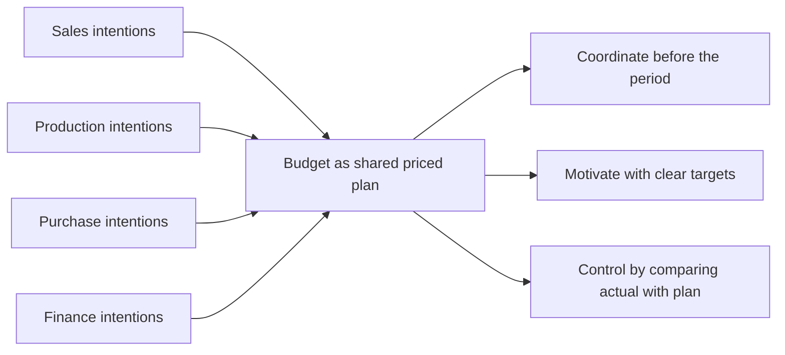
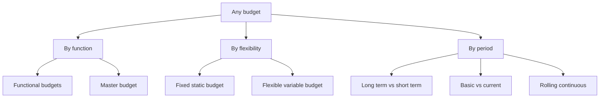
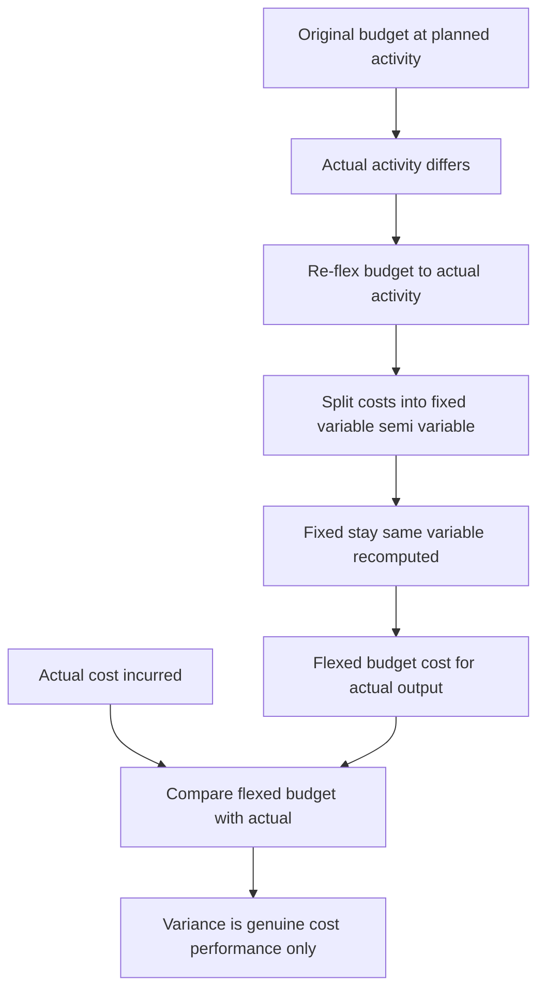
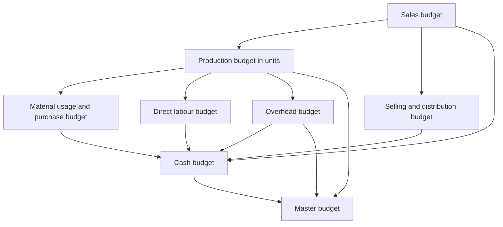
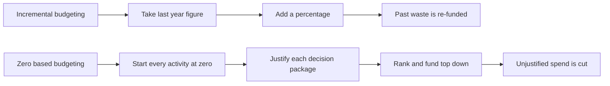

# Chapter 15 — Budgets & Budgetary Control

## 1. The Problem: A business is a fleet of ships that must arrive at the same port on the same day

Imagine you run a factory. Tomorrow morning, the sales team is going to promise customers 10,000 units. The purchase manager is deciding how much steel to order. The HR head is deciding whether to hire two more workers. The finance manager is deciding whether the company can afford to pay a supplier on the 15th. The production supervisor is planning shifts.

Every one of these people is making a decision **today** about the **future**, and every decision depends on what the others decide. If sales promises 10,000 units but production planned for 6,000, customers get let down. If purchases buys steel for 10,000 units but sales only sells 6,000, cash is locked in a warehouse. If finance did not foresee the wage bill of two new workers, the company bounces a cheque even while it is "profitable."

This is the coordination problem. Individually rational decisions, taken in isolation, produce a collectively irrational business. The organisation is a fleet of ships each captained by a manager, and unless someone gives every captain a shared chart, they sail to different ports.

There is a second, quieter problem. Suppose the year ends and profit is ₹40 lakh. Is that good? You cannot answer without a benchmark. Good compared to what? Compared to last year? Last year had different prices, a different scale, a different world. To judge performance you need a **standard set in advance** — a statement of what *should* have happened, against which you lay what *did* happen. Without it, "control" is just narrating history.

A **budget** solves both problems at once. It is a plan expressed in numbers, agreed before the period begins, that (a) forces every department's plans to be mutually consistent, and (b) becomes the yardstick against which actual results are later measured. **Budgetary control** is the machinery of comparing actual with budget, isolating the differences, and acting on them.

This chapter builds the entire apparatus from that need: why budgets exist, the family of budgets a firm prepares, the one distinction that separates a useless budget from a control tool (**fixed vs flexible**), how the functional budgets knit into a **master budget**, the **cash budget** that keeps the firm solvent, and **zero-based budgeting** for when incremental thinking rots.

---

## 2. The Core Idea: A budget is a company's shared travel itinerary — priced

Think of a family planning a month-long trip across several cities. They do not just "hope it works out." They write an itinerary: which city on which date, the hotel booked, the train tickets, the daily spending money, and — critically — a check that the total cost fits the money in the bank *before they leave*.

The itinerary does three jobs, and they map exactly onto the three purposes of a budget:

- **Coordination.** Everyone's plans are made compatible. Dad's museum day and Mum's shopping day do not both need the one rental car at 10 a.m.
- **Motivation.** A target ("we will do Jaipur in two days") focuses effort. A vague wish ("let's see Rajasthan sometime") does not.
- **Control.** Halfway through, they compare the money actually spent with the money planned. Overspending in week 1 triggers a correction in week 2 — *before* the trip runs out of cash, not after.

A budget is that itinerary for a business, drawn in rupees and units. The key mental shift for the self-learner: **a budget is not a forecast.** A forecast is a passive prediction of what *will* happen ("it will probably rain"). A budget is an active commitment to make something happen ("we *will* produce and sell 1,20,000 units and we accept ₹X of cost to do it"). A forecast is an input to a budget; the budget is a decision.

> *Figure 15.1 — A budget converts a scattered set of departmental intentions into one coordinated, priced plan that later doubles as the yardstick for control.*

---

## 3. Why It's Built This Way: three design decisions behind budgetary control

Before any formula, understand three deliberate design choices. Each one is a response to a way that naive planning fails.

**Design decision 1 — Start from the binding constraint (the principal / key / limiting budget factor).**
You cannot plan every department "at full speed" because something always runs out first — market demand, machine hours, skilled labour, cash, or raw material supply. This scarcest resource is the **principal budget factor** (also called the *key factor* or *limiting factor*). The whole budget is built *starting from it*, because planning the others beyond what the constraint allows just manufactures inconsistency. In most firms the constraint is **sales demand**, which is why the **sales budget is usually prepared first** and everything else is sized to it. If instead machine capacity were the bottleneck, production would be planned to capacity and sales sized down to match. Identifying this factor first is not a detail — it is the organising principle of the entire exercise.

**Design decision 2 — Separate the plan from the yardstick by re-flexing it to actual activity (this is the seed of the flexible budget).**
If you plan for 10,000 units and actually make 8,000, comparing the ₹-cost of 8,000 real units against the ₹-cost of 10,000 planned units is comparing apples with oranges. Any manager will "beat" a cost budget simply by producing less. So the budget used for *control* must be **re-computed at the activity level that actually occurred**. That re-computation is the flexible budget, and it exists precisely so that control compares like with like. Hold this thought — Section 4 makes it the centre of gravity.

**Design decision 3 — Management by exception.**
A control system that asks managers to look at every number drowns them. Budgetary control reports only the **variances** — the gaps between actual and budget — and directs attention to the significant ones. Small, random, self-correcting differences are ignored; large or persistent ones are investigated. This is *management by exception*: the budget is the routine, the variance is the alarm.

Layered on top is the human/organisational scaffolding that makes it work:

- A **Budget Manual** — the written rulebook of who prepares what, in what format, by when.
- A **Budget Committee** — cross-functional heads who reconcile conflicting departmental plans and approve the master budget.
- A **Budget Officer** — the coordinator who runs the process.
- The **Budget Period** — the length of time a budget covers (typically one year for operating budgets, broken into months/quarters for control; longer for capital budgets).

---

## 4. Full Technical Content: the machinery, each piece with its reason

### 4.1 What "budgetary control" formally means

**Budgetary control** is the establishment of budgets relating the responsibilities of executives to the requirements of a policy, and the continuous comparison of actual with budgeted results — either to secure by individual action the objective of that policy, or to provide a basis for its revision. Unpack it: *establish budgets → assign to responsible managers → continuously compare actual vs budget → act (correct the action, or revise the plan)*. The last clause matters: a variance may mean the *manager* was wrong, or it may mean the *plan* was wrong. Control decides which.

### 4.2 The family of budgets — three classification axes

Budgets are classified along three independent axes. The same budget sits on all three simultaneously.

**(A) By coverage / function:**
- **Functional budgets** — one per function: sales, production, materials (purchase and usage), direct labour, factory/production overhead, administration, selling & distribution, plant utilisation, capital expenditure, cash.
- **Master budget** — the consolidation of all functional budgets into a single summary: a budgeted Income Statement (Cost Sheet / P&L) and a budgeted Balance Sheet, plus the cash budget.

**(B) By capacity / flexibility — the control-critical axis:**
- **Fixed (static) budget** — prepared for a *single* anticipated level of activity; not adjusted if actual activity differs.
- **Flexible (variable) budget** — designed to *change with the level of activity*, by classifying costs into fixed, variable and semi-variable and recomputing the total for whatever activity actually occurs.

**(C) By period / conditions:**
- **Long-term** (3–10 yrs, strategic, e.g. capital budget) vs **short-term** (usually 1 yr) vs **current** (weeks/months).
- **Basic budget** (a long-run standard, unaltered for the base period) vs **current budget** (adjusted for current conditions).
- **Rolling / continuous budget** — as each month/quarter ends, a new one is added at the far end, so a full 12-month horizon is always in view. Reason: planning never falls off a cliff at year-end.

> *Figure 15.2 — The three independent axes along which any single budget is classified.*

### 4.3 Fixed vs Flexible — the heart of the chapter, and WHY flexible is needed

Here is the failure a fixed budget walks into. Suppose a factory budgets for **10,000 units**:

| | Budget (fixed, 10,000 u) | Actual (8,000 u) | "Variance" |
|---|---|---|---|
| Direct material @ ₹20/u (variable) | 2,00,000 | 1,64,000 | 36,000 F |
| Direct labour @ ₹15/u (variable) | 1,50,000 | 1,25,000 | 25,000 F |
| Factory rent (fixed) | 1,00,000 | 1,00,000 | — |
| Total cost | 4,50,000 | 3,89,000 | 61,000 F |

The fixed-budget comparison shows ₹61,000 **favourable**. The manager looks like a hero. But this is a lie: of course costs are lower — the factory made 20% fewer units. The comparison mixes two utterly different effects — the effect of *making fewer units* (a volume effect, often outside the cost manager's control) and the effect of *cost efficiency* (spending more or less per unit, which *is* the manager's job). A fixed budget cannot separate them, so it cannot control anything.

**The fix: flex the budget to the activity that actually happened (8,000 units).** Variable costs are re-computed at 8,000 units; fixed costs stay fixed.

| | Flexed budget @ 8,000 u | Actual @ 8,000 u | Variance |
|---|---|---|---|
| Direct material @ ₹20/u | 1,60,000 | 1,64,000 | 4,000 A |
| Direct labour @ ₹15/u | 1,20,000 | 1,25,000 | 5,000 A |
| Factory rent | 1,00,000 | 1,00,000 | — |
| Total cost | 3,80,000 | 3,89,000 | **9,000 A** |

Flexed to real activity, the truth appears: the manager actually **overspent by ₹9,000**. The favourable ₹61,000 was pure volume illusion. **This is why a flexible budget is indispensable for control: it compares like with like — the cost that *should* have been incurred for the output *actually produced* against the cost *actually incurred*.** A fixed budget is fine for *planning* a single expected level; it is useless for *controlling* when activity moves — and activity always moves.

**The mechanics of flexing — cost behaviour is the whole trick.** To flex, every cost must first be split by behaviour:

- **Variable cost** — total varies in direct proportion to activity; per-unit is constant. Flexed total = *variable rate per unit × actual units*.
- **Fixed cost** — total is unchanged across the relevant range; per-unit *falls* as activity rises. Flexed total = *same amount, always*.
- **Semi-variable (mixed) cost** — has both a fixed lump and a variable slice (e.g. electricity: a fixed connection charge plus per-unit consumption). It must be **segregated** into its two parts before flexing.

**Segregating a semi-variable cost — the High–Low method** (the exam's workhorse). Take the cost at the highest activity and at the lowest activity:

$$\text{Variable rate per unit} = \frac{\text{Cost at highest activity} - \text{Cost at lowest activity}}{\text{Highest activity} - \text{Lowest activity}}$$

Then: **Fixed cost = Total cost at any level − (Variable rate × units at that level).** Once you have the fixed lump and the variable rate, the semi-variable cost flexes like any other. (More refined methods — least squares regression — exist, but High–Low is the standard exam tool.)

**Flexible budget formula for any activity level:**

$$\text{Budgeted total cost at activity } x = \text{Total fixed cost} + (\text{Variable cost per unit} \times x)$$

This straight line — a fixed intercept plus a variable slope — *is* the flexible budget. Give it any x, it returns the cost that x *ought* to cost.

> *Figure 15.3 — Why the flexible budget is the correct control benchmark: it re-flexes the plan to the activity that actually occurred so that only genuine cost performance remains.*

### 4.4 The functional budgets — order, logic and formats

The functional budgets are prepared in a **strict sequence** dictated by the principal budget factor. Assuming (as usual) that **sales demand is the limiting factor**, the chain is:

> *Figure 15.4 — The build order of functional budgets when sales demand is the principal budget factor, converging into the master budget.*

**(1) Sales budget.** The starting point and, usually, the foundation of everything. Estimated **quantity × selling price**, broken by product, region, period, salesperson. Built from the sales force's estimates, past trends, market research, capacity and pricing policy.

**(2) Production budget (in units).** How many units must be *manufactured* to meet the sales plan while moving inventory from opening to the desired closing level. The logic is a stock reconciliation:

$$\text{Units to produce} = \text{Budgeted sales} + \text{Desired closing FG stock} - \text{Opening FG stock}$$

*Why this shape:* you must produce enough to (a) satisfy sales and (b) build the closing stock, but you get a head start from opening stock, so it is subtracted. This budget is then sub-divided into a **production cost budget** and feeds materials, labour and overheads.

**(3) Material budgets — two distinct budgets, do not confuse them.**

- **Material *usage* (consumption) budget** = units to produce × material required per unit. This is driven by *production*.
  $$\text{Material to be consumed} = \text{Units produced} \times \text{material per unit}$$
- **Material *purchase* budget** = what to *buy*, after a second stock reconciliation on raw materials:
  $$\text{Material to purchase} = \text{Material consumed} + \text{Desired closing RM stock} - \text{Opening RM stock}$$

*Why two:* consumption is a production question; purchasing is a stores/cash question. They differ by the change in raw-material inventory. Purchases (× price) drive the cash outflow to suppliers.

**(4) Direct labour budget.** Standard hours per unit × units to produce = total hours; × wage rate = labour cost. Also flags whether the workforce/overtime is adequate.

**(5) Overhead budgets.** Production overhead (split fixed/variable), administration overhead, selling & distribution overhead — each estimated and, for control, prepared in *flexible* form.

**(6) Other budgets.** Plant utilisation, R&D, capital expenditure (long-term), and the **cash budget** (below).

### 4.5 The Cash Budget — keeping a profitable firm from going broke

**The problem it solves:** profit and cash are *not* the same thing. A firm can be highly profitable on paper and still fail to pay wages next Tuesday, because customers pay in 60 days while wages fall due weekly, and because depreciation is a cost but not a cash outflow. The cash budget is a **month-by-month forecast of cash receipts and payments** that reveals, *in advance*, when the firm will have a surplus (to invest) or a deficit (to arrange an overdraft for). It is the single most practically important budget for survival.

**Golden rule of the cash budget: include only actual cash movements, and time them when the cash actually moves — not when the sale or expense is recorded.**

- **Include:** cash sales; collections from debtors (lagged by the credit period); loans raised; interest/dividends received; sale of assets; issue of shares.
- **Include (payments):** cash paid to suppliers (lagged by credit received); wages; overheads paid in cash; tax; dividends paid; capital expenditure; loan repayments.
- **EXCLUDE non-cash items entirely:** **depreciation**, provisions for bad debts, writing off goodwill, notional/imputed costs. These never touch the bank.
- **Timing is everything:** a sale in January collected in March is a *March* receipt. A purchase in January paid in February is a *February* payment.

**Format — the receipts-and-payments method** (the exam standard):

$$\text{Closing balance} = \text{Opening balance} + \text{Total receipts} - \text{Total payments}$$

and each month's **closing balance becomes next month's opening balance** (the balances chain). Where a minimum cash balance is required, any shortfall signals borrowing; any excess above it signals investible surplus.

### 4.6 The Master Budget

The **master budget** is the summary budget incorporating all functional budgets, finally approved by the budget committee. It is not a fourth kind of calculation — it is the **consolidation**: a budgeted income statement (cost of sales and profit) and a budgeted balance sheet, supported by the cash budget. It is the single document the board approves and against which overall performance is judged.

### 4.7 Zero-Based Budgeting (ZBB) — refusing to inherit last year's fat

**The problem it solves:** the ordinary approach, **incremental budgeting**, takes last year's figure and adds a percentage. Its fatal flaw is that it *inherits every past inefficiency* — if a department wasted ₹5 lakh last year, incremental budgeting quietly re-funds that ₹5 lakh plus 8%. Waste becomes permanent because nobody re-justifies the base.

**ZBB flips the burden of proof.** Every activity starts from a **"zero base"** each cycle; every rupee, including the base, must be justified afresh as if the activity were brand new. Nothing is entitled to funding merely because it existed last year.

**The ZBB process:**
1. **Define decision units** — the smallest activities that can be separately evaluated.
2. **Build decision packages** — for each unit, describe the activity, its purpose, costs, benefits, and alternative ways (and levels) of performing it.
3. **Rank the packages** across the organisation by cost-benefit, from indispensable to marginal.
4. **Allocate resources** down the ranked list until the funds run out; packages below the line are cut.

**Strengths:** eliminates inherited waste; links spend to objectives; forces managers to justify activities; good for discretionary/support costs (R&D, admin, marketing). **Weaknesses:** time-consuming and costly; needs skill and honesty; hard to quantify benefits of some activities; can breed short-termism. Consequently ZBB is often applied *periodically* (say every few years) or selectively to discretionary areas, not to every line every year.

> *Figure 15.5 — Incremental budgeting inherits the past base while ZBB re-justifies every activity from zero.*

---

## 5. Worked Examples — full, step-by-step, reconciled

### Worked Example 1 (Easy) — Production, material usage and purchase budgets

**Data.** Zenith Ltd sells a single product. Budgeted sales for the quarter = **48,000 units**. It wants closing finished-goods (FG) stock of **6,000 units**; opening FG stock is **4,000 units**. Each unit needs **3 kg** of raw material at **₹25/kg**. It wants closing raw-material (RM) stock of **15,000 kg**; opening RM stock is **9,000 kg**.

**Required:** production budget (units), material usage budget (kg), and material purchase budget (kg and ₹).

**Step 1 — Production budget (units).** Produce enough for sales plus the desired stock build, less the head start from opening stock.

| Production budget | Units |
|---|---|
| Budgeted sales | 48,000 |
| Add: Desired closing FG stock | 6,000 |
| Less: Opening FG stock | (4,000) |
| **Units to be produced** | **50,000** |

**Step 2 — Material usage (consumption) budget.** Driven by production.

$$50{,}000 \text{ units} \times 3 \text{ kg} = 1{,}50{,}000 \text{ kg consumed}$$

**Step 3 — Material purchase budget.** Buy enough to cover consumption plus the RM stock build, less opening RM stock.

| Material purchase budget | Kg |
|---|---|
| Material to be consumed | 1,50,000 |
| Add: Desired closing RM stock | 15,000 |
| Less: Opening RM stock | (9,000) |
| **Material to be purchased** | **1,56,000** |

**Value of purchases** = 1,56,000 kg × ₹25 = **₹39,00,000.**

*Note the two separate stock reconciliations — one on finished goods (Step 1), one on raw material (Step 3). Confusing consumption with purchases is the classic error.*

---

### Worked Example 2 (Moderate) — Flexible budget with a semi-variable cost segregated

**Data.** A factory's overhead budget was prepared at **60% capacity = 12,000 units**. Costs at that level:

| Cost | ₹ at 12,000 u | Behaviour |
|---|---|---|
| Direct material | 3,60,000 | Variable |
| Direct labour | 2,40,000 | Variable |
| Power | 84,000 | Semi-variable |
| Repairs & maintenance | 60,000 | Semi-variable |
| Factory rent | 1,20,000 | Fixed |
| Supervision | 90,000 | Fixed |

Additional information for the two semi-variable costs (given at two activity levels so we can segregate them):

| Semi-variable cost | ₹ at 12,000 u (60%) | ₹ at 16,000 u (80%) |
|---|---|---|
| Power | 84,000 | 1,00,000 |
| Repairs & maintenance | 60,000 | 68,000 |

**Required:** prepare a flexible budget at **60%, 80% and 100% capacity** (100% = 20,000 units).

**Step 1 — Segregate the semi-variable costs by High–Low.**

*Power:*
$$\text{Variable rate} = \frac{1{,}00{,}000 - 84{,}000}{16{,}000 - 12{,}000} = \frac{16{,}000}{4{,}000} = ₹4/\text{unit}$$
Fixed part = 84,000 − (4 × 12,000) = 84,000 − 48,000 = **₹36,000**. (Check at 16,000: 36,000 + 4×16,000 = 1,00,000 ✓)

*Repairs & maintenance:*
$$\text{Variable rate} = \frac{68{,}000 - 60{,}000}{16{,}000 - 12{,}000} = \frac{8{,}000}{4{,}000} = ₹2/\text{unit}$$
Fixed part = 60,000 − (2 × 12,000) = 60,000 − 24,000 = **₹36,000**. (Check at 16,000: 36,000 + 2×16,000 = 68,000 ✓)

**Step 2 — Establish per-unit variable rates and fixed lumps.**

| Cost | Variable ₹/unit | Fixed ₹ |
|---|---|---|
| Direct material | 3,60,000 ÷ 12,000 = 30 | — |
| Direct labour | 2,40,000 ÷ 12,000 = 20 | — |
| Power | 4 | 36,000 |
| Repairs & maintenance | 2 | 36,000 |
| Factory rent | — | 1,20,000 |
| Supervision | — | 90,000 |
| **Total** | **56 / unit** | **2,82,000** |

**Step 3 — Flex to each capacity.** Total cost = Fixed 2,82,000 + 56 × units.

| Cost element | 60% (12,000 u) | 80% (16,000 u) | 100% (20,000 u) |
|---|---|---|---|
| Direct material (₹30/u) | 3,60,000 | 4,80,000 | 6,00,000 |
| Direct labour (₹20/u) | 2,40,000 | 3,20,000 | 4,00,000 |
| Power (36,000 + ₹4/u) | 84,000 | 1,00,000 | 1,16,000 |
| Repairs & mtce (36,000 + ₹2/u) | 60,000 | 68,000 | 76,000 |
| Factory rent (fixed) | 1,20,000 | 1,20,000 | 1,20,000 |
| Supervision (fixed) | 90,000 | 90,000 | 90,000 |
| **Total cost** | **9,54,000** | **11,78,000** | **13,02,000** |
| **Cost per unit** | **79.50** | **73.625** | **65.10** |

**Reconciliation / self-check.** At 100%: fixed 2,82,000 + variable (56 × 20,000 = 11,20,000) = **13,02,000 ✓**. Notice the cost *per unit falls* as activity rises (79.50 → 73.625 → 65.10) — the signature of fixed cost being spread over more units. That single fact is *why* comparing per-unit costs across different volumes is meaningless, and why control must use the flexed *total* at actual activity.

---

### Worked Example 3 (Exam-hard) — Flexible budget as a control tool, fully reconciled with a fixed budget

**Data.** Pioneer Ltd budgeted (fixed budget) for **10,000 units** but actually produced and sold **12,000 units**. Cost structure per the original budget:

- Direct material: ₹40/unit (variable)
- Direct labour: ₹30/unit (variable)
- Variable overhead: ₹10/unit (variable)
- Semi-variable overhead: ₹80,000 at 10,000 units; it rises by ₹10,000 for every 2,000 units above 10,000 (i.e. ₹5/unit variable slice on top of a fixed lump).
- Fixed overhead: ₹1,50,000 (fixed within the relevant range up to 12,000 units).

**Actual costs incurred at 12,000 units:** Direct material ₹5,04,000; Direct labour ₹3,54,000; Variable overhead ₹1,26,000; Semi-variable overhead ₹98,000; Fixed overhead ₹1,55,000.

**Required:** (a) the fixed budget; (b) the flexed budget at 12,000 units; (c) the variance against the *flexed* budget with a full reconciliation; and (d) show why the fixed-budget comparison misleads.

**Step 1 — Segregate the semi-variable overhead.** It is ₹80,000 at 10,000 units, and increases ₹10,000 per 2,000 units → variable rate = 10,000 ÷ 2,000 = **₹5/unit**. Fixed part = 80,000 − (5 × 10,000) = **₹30,000**. So semi-variable = 30,000 + 5 × units.

**Step 2 — Build all three columns.** Variable per-unit rates: material 40, labour 30, variable OH 10, semi-variable slice 5. Fixed lumps: semi-variable 30,000 + fixed OH 1,50,000 = 1,80,000 total fixed.

| Cost element | Fixed budget (10,000 u) | Flexed budget (12,000 u) | Actual (12,000 u) | Variance |
|---|---|---|---|---|
| Direct material (₹40/u) | 4,00,000 | 4,80,000 | 5,04,000 | 24,000 A |
| Direct labour (₹30/u) | 3,00,000 | 3,60,000 | 3,54,000 | 6,000 F |
| Variable overhead (₹10/u) | 1,00,000 | 1,20,000 | 1,26,000 | 6,000 A |
| Semi-variable (30,000 + ₹5/u) | 80,000 | 90,000 | 98,000 | 8,000 A |
| Fixed overhead | 1,50,000 | 1,50,000 | 1,55,000 | 5,000 A |
| **Total cost** | **10,30,000** | **12,00,000** | **13,37,000** | **37,000 A** |

**Step 3 — Reconcile the variance (the tie-out).**
Sum of element variances: 24,000 A − 6,000 F + 6,000 A + 8,000 A + 5,000 A = **37,000 A**.
Total flexed budget 12,00,000 vs Actual 13,37,000 = **37,000 Adverse ✓.** The parts tie to the whole.

**Step 4 — Why the fixed comparison misleads.** If you naively compared the **fixed** budget (₹10,30,000 for 10,000 units) with the **actual** (₹13,37,000 for 12,000 units), you would report a ₹3,07,000 *adverse* "variance" and panic. But most of that gap is simply the cost of making 2,000 *extra* units — a *volume* effect, not inefficiency. The flexible budget strips the volume effect out (10,30,000 → 12,00,000 is the legitimate cost of the extra volume) and reveals the *true* cost-control failure: only **₹37,000 adverse**. 

The full decomposition:
- Total fixed-budget-to-actual gap: 13,37,000 − 10,30,000 = **3,07,000 A**
- Of which, volume effect (flexing 10,000 → 12,000 units): 12,00,000 − 10,30,000 = **1,70,000** (extra cost that *should* be incurred for the extra output — not a controllable variance)
- True cost/expenditure variance (flexed vs actual): **37,000 A**
- Check: 1,70,000 + 37,000 = 3,07,000 ✓

This is the entire argument of Section 4.3 made numerical: **only the ₹37,000 belongs on the cost manager's report card.** The ₹1,70,000 is the price of doing more business, which is good news, not bad.

---

### Worked Example 4 (Exam-hard) — Cash Budget

**Data.** Sunrise Ltd wants a cash budget for **April, May, June**. 

Sales (₹): Feb 2,00,000; Mar 2,20,000; Apr 2,40,000; May 2,60,000; Jun 3,00,000.
- **Sales pattern:** 25% cash, 75% credit. Credit customers pay **one month after sale**.
- **Purchases (₹):** Mar 1,20,000; Apr 1,40,000; May 1,50,000; Jun 1,60,000. Paid **one month after purchase**.
- **Wages:** paid in the *same* month — Apr 40,000; May 44,000; Jun 48,000.
- **Overheads:** ₹30,000 per month, paid in the same month. This figure **includes ₹8,000 depreciation.**
- **Machinery** costing ₹1,00,000 to be bought in **May**, paid in **June**.
- **Dividend** of ₹20,000 payable in **April**.
- **Opening cash balance on 1 April = ₹50,000.** Minimum desired balance = ₹25,000.

**Required:** cash budget for the three months and comment on financing.

**Step 1 — Cash receipts. Split cash sales (same month, 25%) and credit collections (75%, one month late).**

| Receipts | April | May | June |
|---|---|---|---|
| Cash sales (25% of current month) | 60,000 | 65,000 | 75,000 |
| Collection from debtors (75% of prior month) | 1,65,000 | 1,80,000 | 1,95,000 |
| **Total receipts** | **2,25,000** | **2,45,000** | **2,70,000** |

*Working:* Apr cash = 25% × 2,40,000 = 60,000; Apr debtors = 75% × Mar 2,20,000 = 1,65,000. May cash = 25% × 2,60,000 = 65,000; May debtors = 75% × Apr 2,40,000 = 1,80,000. Jun cash = 25% × 3,00,000 = 75,000; Jun debtors = 75% × May 2,60,000 = 1,95,000.

**Step 2 — Cash payments. Note: purchases lag one month; overheads exclude the ₹8,000 depreciation (cash overhead = 30,000 − 8,000 = ₹22,000); machinery is *paid* in June though bought in May.**

| Payments | April | May | June |
|---|---|---|---|
| Payment to suppliers (prior month purchases) | 1,20,000 | 1,40,000 | 1,50,000 |
| Wages (same month) | 40,000 | 44,000 | 48,000 |
| Cash overheads (30,000 − 8,000 dep.) | 22,000 | 22,000 | 22,000 |
| Machinery (bought May, paid June) | — | — | 1,00,000 |
| Dividend | 20,000 | — | — |
| **Total payments** | **2,02,000** | **2,06,000** | **3,20,000** |

**Step 3 — Assemble the cash budget (closing balance chains into next opening).**

| | April | May | June |
|---|---|---|---|
| Opening balance | 50,000 | 73,000 | 1,12,000 |
| Add: Receipts | 2,25,000 | 2,45,000 | 2,70,000 |
| Less: Payments | (2,02,000) | (2,06,000) | (3,20,000) |
| **Closing balance** | **73,000** | **1,12,000** | **62,000** |

**Step 4 — Reconciliation and comment.** Each closing rolls to the next opening: 50,000 → 73,000 → 1,12,000 → 62,000 ✓. Independent net check: total receipts (2,25,000+2,45,000+2,70,000 = 7,40,000) − total payments (2,02,000+2,06,000+3,20,000 = 7,28,000) = net +12,000; opening 50,000 + 12,000 = **62,000 closing ✓.**

**Financing comment:** the firm stays above its ₹25,000 minimum in all three months, so **no overdraft is needed.** In June the machinery payment (₹1,00,000) squeezes the balance from ₹1,12,000 down to ₹62,000, but it remains comfortable. The surplus in April–May (well above the ₹25,000 floor) could be short-term invested. *The two traps this problem tests — excluding the ₹8,000 depreciation, and timing the machinery payment in June not May — are exactly where marks are lost.*

---

## 6. Presentation & Format Standards

- **Every budget carries a heading** stating the entity, the budget's name, and the **period/activity level** it is drawn for (e.g. "Flexible Budget at 60%, 80% and 100% capacity"). For flexible budgets, activity levels are the *columns*.
- **Order the functional budgets** in preparation sequence: sales → production → materials/labour/overheads → cash → master. Present workings (High–Low segregation, stock reconciliations) *before* the final statement.
- **Cash budget** uses the receipts-and-payments columnar format, one column per sub-period, with **Opening + Receipts − Payments = Closing**, and the closing balance visibly carried forward. State non-cash exclusions explicitly (a one-line note "depreciation excluded" earns clarity marks).
- **Variance reports** show three columns — *Flexed Budget, Actual, Variance* — and mark each **F (favourable)** or **A (adverse)**; end with a total that **reconciles** to the sum of the parts. Never compare a *fixed* budget with actual for control.
- **Flexible budget** lists costs by behaviour (variable block, semi-variable block, fixed block) so the reader sees the structure; show **cost per unit** as a final row to expose the fixed-cost-spreading effect.

---

## 7. Connections to the Rest of the Syllabus

- **Standard Costing & Variance Analysis (the sister chapter).** A flexible budget *is* the bridge to variances. The "budget allowance for actual output" that anchors every material, labour and overhead variance is nothing but the flexed budget. Worked Example 3's ₹37,000 is a total cost variance waiting to be split into price/usage and efficiency components. Budgetary control operates on *whole departments and functions*; standard costing drills into *per-unit* detail — same philosophy, different resolution.
- **Marginal Costing & CVP.** Flexing depends entirely on the fixed/variable split — the identical cost behaviour classification underpinning contribution, break-even and the P/V ratio. The line "Total cost = Fixed + Variable × units" *is* the marginal-costing cost function.
- **Cost behaviour & segregation.** High–Low (and least-squares) segregation, learned here, is the same tool used across overhead analysis.
- **Budgetary control vs Standard costing distinction** is a favourite theory question: budgets set *overall* limits (extensive), standards set *per-unit* norms (intensive); budgets can exist without standards, standards need budgets to become a control system.
- **Working-capital & financial management.** The cash budget is the operational face of cash management and working-capital planning.

---

## 8. Traps & Examiner Tricks

1. **Comparing a fixed budget with actuals for control.** The single biggest conceptual error. If activity differs from plan, you *must* flex first. A question that gives a fixed budget and different actual output is *testing whether you know to flex.*
2. **Depreciation in the cash budget.** Depreciation is a cost but **never a cash flow.** Exclude it. If overheads are given "including depreciation," subtract it before entering payments (Worked Example 4: ₹30,000 − ₹8,000 = ₹22,000).
3. **Timing lags — sales *made* vs cash *collected*, purchases *made* vs cash *paid*.** Enter cash when it moves, not when the transaction is booked. Machinery *bought* in May but *paid* in June is a June payment.
4. **Confusing material usage with material purchases.** Usage is driven by production; purchases differ by the change in raw-material stock. Two separate reconciliations (finished goods and raw material) are required.
5. **Forgetting the stock adjustment in the production budget.** Units to produce ≠ units to sell unless opening and closing FG stocks are equal. Add closing, subtract opening.
6. **Flexing fixed costs.** Fixed costs stay *fixed* when you flex — do **not** scale them with activity. Conversely, do not leave variable costs unflexed. The whole art is treating each behaviour correctly. (And a semi-variable cost must be split, not flexed whole.)
7. **Relevant range.** Fixed costs are fixed only within a range; a huge jump in activity may push into a new range with stepped-up fixed costs. Read the data for such step-ups.
8. **Sign and reconciliation discipline.** Label every variance F or A, and **prove** the individual variances sum to the total. An unreconciled answer signals an arithmetic slip.
9. **"Budget vs forecast."** A forecast predicts; a budget commits and is used for control. Theory questions probe this.
10. **Minimum cash balance.** When a minimum balance is specified, the answer is incomplete without commenting on **financing (overdraft)** or **investible surplus** relative to that floor.
11. **ZBB is not "starting the whole company from scratch."** It re-justifies *each activity* via decision packages and ranking; it is usually applied to discretionary costs and periodically, given its cost.

---

## 9. First-Principles Recap

Strip everything away and rebuild:

1. A business is many managers deciding the future *today*, each dependent on the others. Left alone they produce an inconsistent plan. So we write one **priced, agreed plan — the budget** — to *coordinate*, *motivate*, and *control*.
2. Because resources are finite, we build the plan **starting from the scarcest resource** (the principal budget factor — usually sales). Everything else is sized to it, in a fixed sequence: sales → production → materials/labour/overheads → cash → master.
3. To *control*, the plan must become a fair yardstick. A **fixed** budget, frozen at one activity level, is unfair the moment activity moves — it mixes the *volume* effect with the *efficiency* effect. So we **flex** the budget to the activity that actually occurred, which demands splitting every cost into **fixed, variable, semi-variable** (High–Low segregates the mixed ones). Flexed budget vs actual = the *genuine* cost performance.
4. **Cash ≠ profit.** A separate **cash budget** tracks only real cash flows, timed when they move, excluding non-cash items like depreciation, so the firm foresees deficits and surpluses and arranges finance in advance.
5. All functional budgets consolidate into the **master budget** — the board's approved plan and yardstick.
6. When last year's base is itself suspect, **ZBB** rebuilds from zero, re-justifying every activity so inherited waste cannot survive.

Every formula in this chapter is a servant of one of these six ideas. None was memorised; each was *needed*.

---

## 10. Quick-Revision Sheet

| Concept | Formula / Rule | Why it exists |
|---|---|---|
| Principal budget factor | The scarcest resource; build the budget starting here (usually sales) | Planning beyond the constraint creates inconsistency |
| Production budget (units) | Budgeted sales + Desired closing FG stock − Opening FG stock | Make enough for sales *and* the stock build, net of opening stock |
| Material usage budget | Units produced × material per unit | Consumption is driven by production |
| Material purchase budget (qty) | Material consumed + Desired closing RM stock − Opening RM stock | Buying differs from using by the change in RM stock |
| Material purchase (value) | Purchase quantity × price per unit | Drives cash outflow to suppliers |
| Direct labour budget | Units produced × hours per unit × wage rate | Sizes workforce and wage cost |
| Flexible budget (total cost) | Total fixed cost + (Variable cost per unit × activity) | Re-computes cost at actual activity for fair control |
| High–Low variable rate | (Cost at high − Cost at low) ÷ (High units − Low units) | Segregates the variable slice of a semi-variable cost |
| High–Low fixed part | Total cost at a level − (Variable rate × units at that level) | Isolates the fixed lump |
| Semi-variable cost | Fixed part + (Variable rate × units) | Must be split before flexing |
| Variance (control) | Flexed budget − Actual (mark F or A) | Compares like with like; excludes volume effect |
| Volume effect | Flexed budget − Fixed budget | The non-controllable cost of a different activity level |
| Cash budget | Opening balance + Receipts − Payments = Closing (chained) | Foresees cash surplus/deficit; profit ≠ cash |
| Cash budget — exclusions | Exclude depreciation and all non-cash items; time flows when cash moves | Only real bank movements matter |
| Master budget | Consolidation of all functional budgets (budgeted P&L + Balance Sheet + cash) | The board's single approved plan and yardstick |
| Incremental budgeting | Last year's figure + a % | Simple but re-funds past waste |
| Zero-based budgeting | Every activity justified from zero via decision packages, ranked and funded top-down | Kills inherited waste; ties spend to objectives |
| Budgetary control | Establish budgets → assign → compare actual vs budget → act/revise | Turns the plan into a running control system |
| Budget vs forecast | Forecast predicts; budget commits and controls | A budget is a decision, not a guess |

**Cost-behaviour reminder for flexing:** *Variable* — total moves with activity, per-unit constant. *Fixed* — total constant, per-unit falls as activity rises. *Semi-variable* — split into fixed lump + variable slice before use.

**Golden control rule:** *Never* judge cost performance by comparing a fixed budget with actual results at a different activity level. Flex first; then, and only then, is the variance real.
