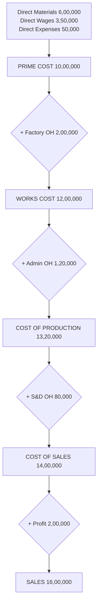

# Q&A — Introduction to Cost & Management Accounting

> CA Intermediate | Cost & Management Accounting | Chapter 1
> Exam-oriented question bank. Every question is followed immediately by a complete model answer.
> Currency: Indian Rupees (₹). Terminology & formulae per ICAI Study Material.

---

## Section A — Concept-Check Questions (with answers)

**A1. Define Cost, Costing, Cost Accounting and Cost Accountancy.**

*Answer:*
- **Cost** — the amount of expenditure (actual or notional) incurred on, or attributable to, a given thing (product, service, activity). It is a *measurement, in monetary terms, of resources used*.
- **Costing** — the *technique and process* of ascertaining costs.
- **Cost Accounting** — the *process of accounting for costs*: recording, classifying, allocating and reporting costs, beginning with recording of expenditure and ending with preparation of statistical data.
- **Cost Accountancy** — the *widest term*; the application of costing and cost accounting principles, methods and techniques to the science, art and practice of cost control and ascertainment of profitability, including presentation of information for managerial decision-making. (Costing + Cost Accounting + Cost Control + Cost Audit.)

**A2. State any four objectives of Cost Accounting.**

*Answer:* (1) Ascertainment of cost, (2) Determination of selling price, (3) Cost control and cost reduction, (4) Ascertaining profit of each activity, (5) Assisting management in decision-making. (Any four.)

**A3. Distinguish between Cost Control and Cost Reduction (any three points).**

*Answer:*

| Basis | Cost Control | Cost Reduction |
|---|---|---|
| Aim | Achieve/maintain a *pre-set standard* | *Reduce cost below* the standard permanently |
| Nature | Retrospective (compares actual vs target) | Prospective / continuous |
| Assumption | Standards are the best; not challenged | Challenges every standard as improvable |
| Permanence | May be temporary | Real and permanent |
| Ends | When target is met | Never-ending, dynamic |

**A4. What is a Cost Centre? Name its two types.**

*Answer:* A **cost centre** is a location, person, item of equipment (or a group of these) for which costs may be ascertained and used for cost control. Two broad types — **(i) Personal cost centre** (a person/group of persons) and **(ii) Impersonal cost centre** (a location or item of equipment). Functionally split into **Production cost centres** and **Service cost centres**.

**A5. Differentiate Cost Centre and Cost Unit.**

*Answer:* A **cost centre** is a *sub-division of an organisation* to which costs are charged; a **cost unit** is a *unit of product/service/time* in relation to which costs are ascertained or expressed (e.g., per tonne, per litre, per passenger-km). Cost unit is the *measuring rod*; cost centre is the *collection point*.

**A6. Give appropriate cost units for: (a) Cement, (b) Power/Electricity, (c) Hospital, (d) Transport, (e) Automobile.**

*Answer:* (a) Cement — per tonne/bag; (b) Power — per kilowatt-hour (kWh); (c) Hospital — per patient-day / per bed-day; (d) Transport — per tonne-kilometre or passenger-kilometre; (e) Automobile — per number/unit.

**A7. Distinguish between Cost Accounting and Management Accounting (any three).**

*Answer:*

| Basis | Cost Accounting | Management Accounting |
|---|---|---|
| Scope | Narrower — ascertainment & control of cost | Wider — all financial + cost data for decisions |
| Nature | Mostly quantitative (cost data) | Quantitative + qualitative |
| Basis | Present & past records | Present & future (projections) |
| Objective | Cost ascertainment/control | Decision-making, planning, control |
| Statutory | Cost audit may be mandatory | Purely optional/advisory |

**A8. What are the essentials of a good costing system?**

*Answer:* Suitability to the business, simplicity, flexibility, economy (cost < benefit), comparability, capability of presenting timely information, minimum changes to existing set-up, uniformity of forms, and support/co-operation of top management and staff.

**A9. State three limitations of Cost Accounting.**

*Answer:* (1) It is based on estimates and conventions (e.g., overhead absorption), so not fully accurate; (2) It is expensive/needs elaborate records; (3) Lack of uniform procedure — different accountants may arrive at different costs; (4) It is not an exact science. (Any three.)

**A10. Explain "Responsibility Centre" and its three types.**

*Answer:* A **responsibility centre** is an activity segment of an organisation for whose performance a specified manager is held responsible. Types — **Cost centre** (responsible for cost only), **Profit centre** (responsible for both cost and revenue), and **Investment centre** (responsible for cost, revenue and investment/assets).

**A11. What is meant by "Cost Object"? Give two examples.**

*Answer:* A **cost object** is anything for which a separate measurement of cost is desired — e.g., a *product* (a car), a *service* (a bank loan), a *project*, a *customer*, or an *activity*.

**A12. State the difference between Allocation and Apportionment of overheads.**

*Answer:* **Allocation** is charging the *whole* of an item of cost directly to a cost centre to which it *wholly relates* (e.g., salary of a foreman to his department). **Apportionment** is *distribution of a common item* of cost over several cost centres on a suitable *equitable basis* (e.g., rent apportioned on floor area).

---

## Section B — Graded Computational Problems (easy → exam-hard)

> This chapter is largely conceptual; computation focuses on cost classification, cost-per-unit, cost centre/unit relations and elementary cost statements. Each solution reconciles fully.

### B1 (Easy) — Prime Cost & Direct/Indirect split

From the following, compute **Prime Cost**:
Direct Materials ₹1,20,000; Direct Wages ₹80,000; Direct (Chargeable) Expenses ₹15,000; Factory Rent ₹25,000; Office Salaries ₹18,000.

*Solution:*
Prime Cost = Direct Materials + Direct Wages + Direct Expenses
= ₹1,20,000 + ₹80,000 + ₹15,000 = **₹2,15,000**.
(Factory Rent and Office Salaries are *indirect* → overheads, excluded from Prime Cost.)

### B2 (Easy) — Cost per unit

A factory produced **5,000 units** at a total cost of ₹8,50,000. Compute cost per unit. If output rises to 6,800 units with total cost ₹10,20,000, compute the new cost per unit and comment.

*Solution:*
- Cost per unit (Case 1) = ₹8,50,000 ÷ 5,000 = **₹170.00**
- Cost per unit (Case 2) = ₹10,20,000 ÷ 6,800 = **₹150.00**
- **Comment:** Cost per unit fell ₹20 despite higher total cost — because **fixed cost is spread over more units** (economies of scale). This demonstrates why per-unit cost (a cost object measure) needs a **cost unit** to be meaningful.

### B3 (Basic) — Classify by element and prepare element-wise total

Classify the following and total each element. Direct Material ₹2,40,000; Indirect Material ₹30,000; Direct Labour ₹1,60,000; Indirect Labour ₹45,000; Direct Expenses ₹20,000; Factory Overheads (other) ₹55,000.

*Solution:*

| Element | Direct (₹) | Indirect / Overhead (₹) |
|---|---:|---:|
| Material | 2,40,000 | 30,000 |
| Labour | 1,60,000 | 45,000 |
| Expenses | 20,000 | 55,000 |
| **Total** | **4,20,000** | **1,30,000** |

- **Prime Cost** = ₹4,20,000 (all direct)
- **Total Overheads** = ₹1,30,000 (all indirect)
- **Total Cost** = ₹4,20,000 + ₹1,30,000 = **₹5,50,000** ✓ (reconciles with sum of all six figures: 2,40,000+30,000+1,60,000+45,000+20,000+55,000 = 5,50,000).

### B4 (Moderate) — Cost unit selection & composite unit (Transport)

A transport operator ran a lorry that made **8 trips** carrying **12 tonnes** each over a one-way distance of **150 km** (return empty). Total operating cost for the period = ₹2,88,000. Compute cost per **tonne-km** (commercial/loaded basis).

*Solution:*
- Loaded tonne-km per trip = 12 tonnes × 150 km = 1,800 tonne-km
- Total loaded tonne-km = 1,800 × 8 trips = **14,400 tonne-km**
- Cost per tonne-km = ₹2,88,000 ÷ 14,400 = **₹20.00 per tonne-km**

*(Note: return journey is empty, so it carries no load; the **commercial tonne-km** counts only the loaded outward legs. This illustrates a **composite cost unit** — two variables (weight × distance) combined.)*

### B5 (Moderate) — Allocation vs Apportionment

A firm has two production departments P1 and P2 and incurs: Foreman's salary of P1 ₹40,000 (relates wholly to P1); Factory Rent ₹90,000 (P1 floor area 2,000 sq.m, P2 floor area 1,000 sq.m); Power ₹60,000 (P1 machine-hours 4,000, P2 machine-hours 2,000). Distribute the costs.

*Solution:*

| Item | Basis | Total (₹) | P1 (₹) | P2 (₹) |
|---|---|---:|---:|---:|
| Foreman salary | **Allocation** (wholly P1) | 40,000 | 40,000 | 0 |
| Factory Rent | **Apportion** — floor area 2:1 | 90,000 | 60,000 | 30,000 |
| Power | **Apportion** — machine-hrs 2:1 | 60,000 | 40,000 | 20,000 |
| **Total** | | **1,90,000** | **1,40,000** | **50,000** |

Check: 1,40,000 + 50,000 = 1,90,000 ✓.
- Rent to P1 = 90,000 × 2000/3000 = 60,000; P2 = 90,000 × 1000/3000 = 30,000.
- Power to P1 = 60,000 × 4000/6000 = 40,000; P2 = 60,000 × 2000/6000 = 20,000.

### B6 (Exam-hard) — Full elementary Cost Statement + profit reconciliation

From the following data of Zenith Ltd for the year, prepare a **statement of cost and profit**, showing Prime Cost, Works Cost, Cost of Production, Cost of Sales and Profit. Output = 10,000 units; all produced units sold.

Raw materials consumed ₹6,00,000; Direct wages ₹3,50,000; Direct chargeable expenses ₹50,000; Factory overheads ₹2,00,000; Administrative overheads (production-related) ₹1,20,000; Selling & distribution overheads ₹80,000; Sales ₹16,00,000.

*Solution:*

**Statement of Cost and Profit (10,000 units)**

| Particulars | Total (₹) | Per unit (₹) |
|---|---:|---:|
| Direct Materials | 6,00,000 | 60.00 |
| Direct Wages | 3,50,000 | 35.00 |
| Direct Expenses | 50,000 | 5.00 |
| **Prime Cost** | **10,00,000** | **100.00** |
| Add: Factory Overheads | 2,00,000 | 20.00 |
| **Works / Factory Cost** | **12,00,000** | **120.00** |
| Add: Administrative Overheads | 1,20,000 | 12.00 |
| **Cost of Production** | **13,20,000** | **132.00** |
| Add: Selling & Distribution Overheads | 80,000 | 8.00 |
| **Cost of Sales** | **14,00,000** | **140.00** |
| **Profit** (balancing) | **2,00,000** | **20.00** |
| **Sales** | **16,00,000** | **160.00** |

**Workings / verification:**
- Profit = Sales − Cost of Sales = 16,00,000 − 14,00,000 = **₹2,00,000** ✓
- Per unit = each total ÷ 10,000; per-unit profit ₹20 × 10,000 = ₹2,00,000 ✓
- Profit as % of sales = 2,00,000 / 16,00,000 = **12.5%**.

### B7 (Exam-hard) — Cost classification into behaviour + relevant range

Total cost at 4,000 units = ₹5,20,000; at 6,000 units = ₹7,00,000 (within relevant range). Using the **high–low method**, split into fixed and variable, and find total cost at 5,000 units.

*Solution:*
- Variable cost per unit = (7,00,000 − 5,20,000) ÷ (6,000 − 4,000) = 1,80,000 ÷ 2,000 = **₹90 per unit**
- Fixed cost = Total − Variable = 5,20,000 − (4,000 × 90) = 5,20,000 − 3,60,000 = **₹1,60,000**
- Check at 6,000: 1,60,000 + (6,000 × 90) = 1,60,000 + 5,40,000 = ₹7,00,000 ✓
- **Total cost at 5,000 units** = 1,60,000 + (5,000 × 90) = 1,60,000 + 4,50,000 = **₹6,10,000**.

*(This links Chapter 1's classification-by-behaviour, fixed/variable/semi-variable, to computation.)*

---

## Section C — Past-Paper-Style Full Questions (with model answers)

**C1. "Cost Accounting has become an essential tool of management." Discuss the role of Cost Accounting in the decision-making process of management. (5 marks)**

*Model Answer:* Cost Accounting supplies detailed cost information that financial accounting cannot, enabling management to:
1. **Fix selling prices** on a scientific basis (cost-plus, tenders, quotations).
2. **Control costs** by comparing actuals with standards/budgets and pinpointing variances and responsibility.
3. **Decide product mix / make-or-buy / accept-reject special orders** using marginal and differential cost analysis.
4. **Measure profitability** of each product, department, or job, and drop/expand accordingly.
5. **Plan and budget** operations and evaluate performance of responsibility centres.
6. **Value inventory** for interim accounts and eliminate wastage/inefficiency.
Thus it converts raw expenditure data into actionable managerial intelligence, making it indispensable for planning, control and decision-making.

**C2. Explain the various methods of costing with one industry example each. (6 marks)**

*Model Answer:* Methods depend on the nature of production:
- **Job Costing** — cost ascertained for each specific job/order (e.g., printing press, repair workshop).
- **Batch Costing** — a batch of identical items is one cost unit (e.g., pharmaceuticals, bakery).
- **Contract Costing** — large jobs spread over long periods, each contract a unit (e.g., construction, shipbuilding).
- **Process Costing** — continuous production through processes; cost per process (e.g., chemicals, refineries).
- **Operation / Unit (Single/Output) Costing** — single product mass produced (e.g., cement, mining, breweries).
- **Service (Operating) Costing** — for services (e.g., transport per tonne-km, hospital per bed-day).
- **Multiple / Composite Costing** — combination for products with many parts (e.g., automobiles, cycles).

**C3. Distinguish between "Financial Accounting" and "Cost Accounting" on any five bases. (5 marks)**

*Model Answer:*

| Basis | Financial Accounting | Cost Accounting |
|---|---|---|
| Purpose | Records overall results; for external users | Ascertains & controls cost; for internal management |
| Users | Shareholders, creditors, govt. | Management |
| Statutory | Legally mandatory for companies | Mandatory only where cost records/audit prescribed |
| Analysis | Overall profit of whole business | Profit/cost of each product, job, process |
| Timing | Reported periodically (year-end) | Reported continuously as needed |
| Valuation of stock | At cost or NRV, whichever lower | At cost |
| Nature | Records historical, monetary data | Uses monetary + non-monetary (units, hours) data |

**C4. What is a "Cost Unit"? Explain the factors influencing its selection, and give cost units for five industries. (5 marks)**

*Model Answer:* A **cost unit** is a unit of quantity of product, service or time (or a combination) in relation to which costs are ascertained or expressed. **Factors in selection:** (i) nature of the product/process, (ii) practice/convention in the industry, (iii) requirement of management for control, (iv) the unit that facilitates comparison and is easily understood, (v) simplicity and appropriateness. **Examples:**

| Industry | Cost Unit |
|---|---|
| Cement | Per tonne / bag |
| Electricity | Per kilowatt-hour (kWh) |
| Transport | Per tonne-km / passenger-km |
| Hospital | Per patient-day / bed-day |
| Hotel | Per room-day |

**C5. Write short notes on: (a) Cost Reduction, (b) Responsibility Accounting, (c) Conversion Cost. (6 marks)**

*Model Answer:*
- **(a) Cost Reduction** — a real and permanent reduction in the unit cost of goods/services without impairing suitability for the intended use or quality. It is continuous, dynamic and challenges every existing standard, using tools like value analysis, work study and standardisation.
- **(b) Responsibility Accounting** — a system of control where costs and revenues are accumulated and reported by responsibility centres, so that a manager is answerable only for items within his control. It aids performance evaluation using the *controllability principle*.
- **(c) Conversion Cost** — the cost of converting raw material into finished product = **Direct Labour + Direct Expenses + Factory (Production) Overheads**. Equivalently, Works Cost − Direct Material Cost.

---

## Section D — MCQs & Case Scenarios (correct option + one-line reasoning)

**D1.** Prime Cost consists of:
(a) Direct Material + Direct Labour only  (b) Direct Material + Direct Labour + Direct Expenses  (c) Direct Material + Factory Overheads  (d) All direct + all indirect costs.
**Ans: (b)** — Prime cost = sum of all *direct* costs (material + labour + expenses).

**D2.** Which of the following is a *composite* cost unit?
(a) Per tonne  (b) Per litre  (c) Per tonne-kilometre  (d) Per unit.
**Ans: (c)** — It combines two measures (weight × distance).

**D3.** Charging the whole of an overhead directly to one cost centre to which it wholly relates is called:
(a) Apportionment  (b) Absorption  (c) Allocation  (d) Re-apportionment.
**Ans: (c)** — Allocation charges an entire item to one cost centre wholly related to it.

**D4.** Conversion cost is:
(a) DM + DL  (b) DL + DE + Factory OH  (c) Prime cost + Admin OH  (d) Works cost + S&D OH.
**Ans: (b)** — Cost of converting materials into finished goods excludes direct material.

**D5.** A centre responsible for both cost and revenue but not investment is a:
(a) Cost centre  (b) Profit centre  (c) Investment centre  (d) Service centre.
**Ans: (b)** — Profit centre is accountable for revenues and costs, not for capital employed.

**D6.** Cost control differs from cost reduction because cost control:
(a) is permanent  (b) challenges standards  (c) aims to attain a set target  (d) is never-ending.
**Ans: (c)** — Cost control seeks to keep costs within a predetermined standard; cost reduction goes below it.

**D7.** Which is NOT an objective of cost accounting?
(a) Ascertainment of cost  (b) Fixation of selling price  (c) Preparation of the company's statutory balance sheet  (d) Cost control.
**Ans: (c)** — The statutory balance sheet is the domain of financial accounting.

**D8 (Case Scenario).** A hospital wants to measure the cost of running its in-patient ward and hold the ward manager accountable for those costs only (not room revenues). It also wants a per-unit figure to compare month-to-month.
(i) The ward is best described as a — (a) Profit centre (b) Cost centre (c) Investment centre.
(ii) The appropriate cost unit is — (a) Per patient (b) Per patient-day/bed-day (c) Per rupee of revenue.
**Ans: (i) (b)** — the manager controls costs only, so it is a cost centre; **(ii) (b)** — patient-day captures both number of patients and length of stay, the standard hospital cost unit.

**D9 (Case Scenario).** Alpha Ltd produces 20,000 units. Direct material ₹5,00,000, direct wages ₹3,00,000, direct expenses ₹1,00,000, factory OH ₹2,00,000.
(i) Prime cost per unit = ? (ii) Works cost per unit = ?
**Ans:** Prime cost = 9,00,000 → **₹45/unit**; Works cost = 11,00,000 → **₹55/unit**. *(One-line reasoning: prime = all direct 9,00,000; add factory OH 2,00,000 for works cost; each ÷ 20,000.)*

**D10.** "Costing must be economical" means:
(a) The costing system should be free  (b) The benefit from the system should exceed its cost  (c) Only cheap clerks be employed  (d) No records be kept.
**Ans: (b)** — A costing system is justified only when its benefits outweigh its cost.

---

### Quick-Revision Formula Strip
- Prime Cost = DM + DL + Direct Expenses
- Works/Factory Cost = Prime Cost + Factory OH
- Cost of Production = Works Cost + Admin OH (production-related)
- Cost of Sales = Cost of Production + Selling & Distribution OH
- Profit = Sales − Cost of Sales
- Conversion Cost = DL + Direct Expenses + Factory OH = Works Cost − DM
- Cost per unit = Total Cost ÷ Output (in cost units)
