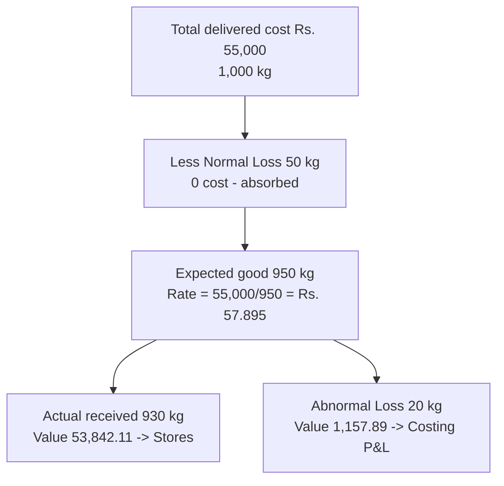

# Q&A — Material Cost

Exam-oriented question bank for CA Intermediate, Cost & Management Accounting — Chapter: **Material Cost**. Every question is followed immediately by a complete model answer. All figures in **Rupees (Rs.)** and formulas follow ICAI conventions.

---

## SECTION A — Concept-Check (Short Answer)

**A1. Why is material control considered the most critical area of cost control?**
Material is usually the **largest single element of cost** (often 40–70% of total cost) and is the most **leak-prone** — losses arise from over-purchasing, pilferage, obsolescence, wastage and blocked working capital. A small percentage saving on material yields a large absolute saving, so control here gives the highest return.

**A2. State the "two-cost tug-of-war" behind inventory decisions.**
Every stocking decision balances **Ordering/Carrying cost trade-off**: ordering in large quantities reduces **ordering cost** (fewer orders) but raises **carrying cost** (more average stock held); ordering small quantities does the reverse. EOQ is the quantity where these two opposing costs are **equal and total cost is minimum**.

**A3. Define Re-order Level, Minimum Level, Maximum Level and Danger Level.**
- **Re-order Level (ROL)** = Maximum consumption × Maximum re-order period. Level at which a fresh order is placed.
- **Minimum Level** = ROL − (Normal consumption × Normal re-order period). Buffer stock.
- **Maximum Level** = ROL + ROQ − (Minimum consumption × Minimum re-order period).
- **Danger Level** = Normal consumption × Maximum re-order period for emergency purchase (below which normal issue stops).

**A4. Distinguish FIFO and LIFO in a period of rising prices.**
Under **FIFO**, issues are priced at **older (lower)** costs → lower charge to production, **higher closing stock**, higher profit. Under **LIFO**, issues are priced at **latest (higher)** costs → higher charge, **lower closing stock**, lower profit. LIFO is **not permitted** under AS-2 / Ind AS-2 for financial reporting.

**A5. Distinguish normal loss from abnormal loss and their cost treatment.**
- **Normal loss**: unavoidable, inherent (evaporation, breakage in handling). Cost is **absorbed by good units** — the good units bear the full cost, raising per-unit cost. No separate account charge.
- **Abnormal loss**: avoidable, due to negligence/accident. Valued at normal cost and **transferred to Costing P&L** (charged against profit), not to production cost.

**A6. What do ABC, VED, FSN and HML analyses classify?**
- **ABC**: by **value** of consumption (A = high value/few items, tight control; C = low value/many items, loose control).
- **VED**: by **criticality** (Vital, Essential, Desirable) — used for spare parts.
- **FSN**: by **usage frequency** (Fast, Slow, Non-moving).
- **HML**: by **unit price** (High, Medium, Low).

**A7. What is the EOQ formula and its assumptions?**
EOQ = √(2AO / C), where A = annual demand, O = cost per order, C = carrying cost per unit p.a. Assumptions: constant demand, constant price (no discount), instant replenishment, and known/fixed ordering & carrying costs.

---

## SECTION B — Graded Computational Problems

### B1 (Easy) — EOQ and number of orders
**Q.** Annual demand 12,000 units; ordering cost Rs. 60 per order; purchase price Rs. 20/unit; carrying cost 10% of unit price per annum. Find EOQ, number of orders and total ordering + carrying cost at EOQ.

**Solution.**
Carrying cost C = 10% × Rs. 20 = **Rs. 2 per unit p.a.**
EOQ = √(2 × 12,000 × 60 / 2) = √(14,40,000 / 2) = √7,20,000 = **848.53 ≈ 849 units.**
Number of orders = 12,000 / 848.53 = **14.14 ≈ 14 orders**.
Ordering cost = (12,000/848.53) × 60 = **Rs. 848.53**
Carrying cost = (848.53/2) × 2 = **Rs. 848.53**
**Total relevant cost = Rs. 1,697** (ordering = carrying, confirming EOQ point).

### B2 (Easy–Medium) — Cost-table proof of EOQ
**Q.** For B1 data, prepare a cost table for order sizes 600, 848, 1,200, 2,000 to prove EOQ minimises total cost.

**Solution.**

| Order size (Q) | No. of orders (A/Q) | Ordering cost (A/Q × 60) | Avg stock (Q/2) | Carrying cost (Q/2 × 2) | Total (Rs.) |
|---|---|---|---|---|---|
| 600 | 20.0 | 1,200 | 300 | 600 | **1,800** |
| 848 | 14.15 | 849 | 424 | 848 | **1,697** |
| 1,200 | 10.0 | 600 | 600 | 1,200 | **1,800** |
| 2,000 | 6.0 | 360 | 1,000 | 2,000 | **2,360** |

Total cost is **lowest (Rs. 1,697) at Q ≈ 848 units** = EOQ. Proven.

### B3 (Medium) — Stock levels
**Q.** Normal usage 300 units/week; minimum usage 200; maximum usage 400. Re-order period 4–6 weeks. Re-order quantity (EOQ) 2,400 units. Compute ROL, Minimum, Maximum and Average stock level.

**Solution.**
- **ROL** = Max usage × Max re-order period = 400 × 6 = **2,400 units**
- **Minimum Level** = ROL − (Normal usage × Normal period) = 2,400 − (300 × 5) = 2,400 − 1,500 = **900 units**
  (Normal period = (4+6)/2 = 5 weeks)
- **Maximum Level** = ROL + ROQ − (Min usage × Min period) = 2,400 + 2,400 − (200 × 4) = 4,800 − 800 = **4,000 units**
- **Average Stock** = Min Level + ½ ROQ = 900 + 1,200 = **2,100 units**
  (or (Min + Max)/2 = (900 + 4,000)/2 = 2,450 units — either accepted; ICAI prefers Min + ½ ROQ)

### B4 (Medium–Hard) — Stores Ledger under FIFO and Weighted Average
**Q.** Prepare stores ledger (FIFO) and value closing stock under both FIFO and Weighted Average.
Jan 1 Opening 200 units @ Rs. 10; Jan 5 Received 300 @ Rs. 12; Jan 10 Issued 350; Jan 15 Received 400 @ Rs. 13; Jan 20 Issued 300.

**Solution — FIFO Stores Ledger.**

| Date | Receipts | Issues | Balance |
|---|---|---|---|
| Jan 1 | — | — | 200 @ 10 = 2,000 |
| Jan 5 | 300 @ 12 = 3,600 | — | 200 @ 10; 300 @ 12 (5,600) |
| Jan 10 | — | 200 @10=2,000; 150 @12=1,800 → **3,800** | 150 @ 12 = 1,800 |
| Jan 15 | 400 @ 13 = 5,200 | — | 150 @ 12; 400 @ 13 (7,000) |
| Jan 20 | — | 150 @12=1,800; 150 @13=1,950 → **3,750** | 250 @ 13 = **3,250** |

**FIFO closing stock = 250 units × Rs. 13 = Rs. 3,250.**

**Weighted Average check** (recompute rate after each receipt):
- After Jan 5: (2,000+3,600)/500 = Rs. 11.20/unit. Issue Jan 10: 350 × 11.20 = 3,920. Balance 150 × 11.20 = 1,680.
- After Jan 15: (1,680+5,200)/550 = Rs. 12.51/unit. Issue Jan 20: 300 × 12.51 = 3,753. Balance 250 × 12.51 = **Rs. 3,127.50.**

**Reconciliation of total material accounted:** Opening 2,000 + Receipts 8,800 = **Rs. 10,800**.
- FIFO: Issues 3,800 + 3,750 = 7,550; + Closing 3,250 = **Rs. 10,800.** ✓
- WA: Issues 3,920 + 3,753 = 7,673; + Closing 3,127.50 = Rs. 10,800.50 (Re 0.50 rounding). ✓

### B5 (Exam-Hard) — Normal and Abnormal Loss valuation
**Q.** 1,000 kg of material purchased at Rs. 50/kg. Freight Rs. 4,000; loading Rs. 1,000. Normal loss in transit is 5% of quantity. Actual material received = 930 kg. Compute the cost per kg of good material received and the abnormal loss to be charged to Costing P&L.

**Solution.**
Total cost of purchase = (1,000 × 50) + 4,000 + 1,000 = 50,000 + 5,000 = **Rs. 55,000.**
Normal loss = 5% × 1,000 = 50 kg → **expected good units = 950 kg.**
Cost absorbed by good units (normal loss cost spread) → cost per good kg = 55,000 / 950 = **Rs. 57.895/kg.**
Actual received = 930 kg → **Abnormal loss = 950 − 930 = 20 kg.**
Abnormal loss value = 20 × 57.895 = **Rs. 1,157.89 → transferred to Costing P&L.**
Value of good material to stores = 930 × 57.895 = **Rs. 53,842.11.**
**Check:** 53,842.11 + 1,157.89 = Rs. 55,000. ✓ (normal loss 50 kg carries no cost — absorbed).

---

## SECTION C — Past-Paper-Style Full Questions

### C1. Comprehensive EOQ with quantity discount
**Q.** A firm uses 90,000 units p.a. Ordering cost Rs. 100/order. Price Rs. 50/unit; carrying cost 12% p.a. Supplier offers 2% discount if order size ≥ 6,000 units. Advise whether to accept the discount.

**Model Answer.**
Carrying cost C = 12% × 50 = Rs. 6/unit p.a.
EOQ = √(2 × 90,000 × 100 / 6) = √30,00,000 = **1,732 units.**

**Without discount (at EOQ 1,732):**
- Purchase = 90,000 × 50 = 45,00,000
- Ordering = (90,000/1,732) × 100 = 5,196
- Carrying = (1,732/2) × 6 = 5,196
- **Total = Rs. 45,10,392**

**With 2% discount (order 6,000, price Rs. 49):**
- Purchase = 90,000 × 49 = 44,10,000
- Ordering = (90,000/6,000) × 100 = 1,500
- Carrying = (6,000/2) × (12% × 49) = 3,000 × 5.88 = 17,640
- **Total = Rs. 44,29,140**

**Advice:** Accepting the discount saves Rs. 45,10,392 − 44,29,140 = **Rs. 81,252 p.a.** → **Accept the discount** despite higher carrying cost, because the purchase-price saving dominates.

### C2. Stores ledger under LIFO with pricing effect
**Q.** From B4 data, value the two issues under **LIFO** and comment on the profit effect versus FIFO.

**Model Answer.**
- Jan 10 issue 350: 300 @ 12 = 3,600 + 50 @ 10 = 500 → **Rs. 4,100.** Balance 150 @ 10 = 1,500.
- Jan 15 receipt 400 @ 13. Jan 20 issue 300: 300 @ 13 = **Rs. 3,900.** Balance 150 @ 10 + 100 @ 13 = 1,500 + 1,300 = **Rs. 2,800.**

**LIFO total issues = 4,100 + 3,900 = Rs. 8,000; closing = Rs. 2,800.** Check: 8,000 + 2,800 = Rs. 10,800. ✓
**Comment:** In rising prices LIFO charges more to production (8,000 vs FIFO 7,550) and shows lower closing stock (2,800 vs 3,250), hence **lower reported profit**. LIFO is disallowed under AS-2.

### C3. Loss treatment full question
**Q.** Explain the accounting treatment of (a) waste, (b) scrap, (c) spoilage and (d) defectives in cost accounts.

**Model Answer.**
- **Waste**: portion with no recoverable value. Normal waste cost absorbed by good output; abnormal waste charged to Costing P&L.
- **Scrap**: residue with small recoverable value. Sale value credited to overhead (if minor), to the job/process (if identifiable), or to Costing P&L (if abnormal). Net scrap reduces material cost.
- **Spoilage**: goods so damaged they cannot be rectified economically. Normal spoilage cost less salvage borne by good units; abnormal spoilage → Costing P&L.
- **Defectives**: can be rectified with extra cost. Rectification cost of normal defectives is charged to the job/overhead; abnormal to Costing P&L.

---

## SECTION D — MCQs & Case Scenarios

**D1.** EOQ increases when:
(a) ordering cost falls (b) carrying cost rises (c) annual demand rises (d) price rises.
**Answer: (c).** EOQ ∝ √A; higher demand raises EOQ (ordering-cost fall lowers it, carrying-cost rise lowers it).

**D2.** Under rising prices, which method gives the highest closing stock value?
(a) LIFO (b) FIFO (c) Simple average (d) Weighted average.
**Answer: (b) FIFO.** Closing stock is valued at the latest (highest) prices.

**D3.** Re-order level = 2,000; ROQ = 1,800; min usage 100/day; min lead time 4 days. Maximum level =
(a) 3,400 (b) 3,800 (c) 3,000 (d) 2,600.
**Answer: (a) 3,400.** = 2,000 + 1,800 − (100 × 4) = 3,400.

**D4.** Abnormal loss is:
(a) added to good units' cost (b) ignored (c) charged to Costing P&L (d) credited to stores.
**Answer: (c).** Abnormal loss is valued at normal cost and charged to Costing P&L to keep product cost undistorted.

**D5.** In ABC analysis, 'A' items are:
(a) high in number, low in value (b) low in number, high in value (c) fast-moving (d) vital spares.
**Answer: (b).** A-items are few (approx 10%) but represent the bulk (approx 70%) of value → tightest control.

**D6.** Danger level is computed as:
(a) Normal usage × Max lead time (b) Max usage × Max lead time (c) Normal usage × Normal lead time (d) Min usage × Min lead time.
**Answer: (a).** Danger level = normal consumption × maximum re-order period for emergency purchase.

**D7 (Case).** A store's C-class items are 60% of item count but only 8% of value, yet the manager applies daily physical counts to them. Comment.
**Answer:** Mis-allocation of control effort. **C items warrant loose control** (bulk ordering, periodic review); tight daily control should target **A items**. Reallocating effort reduces administrative cost without raising stock-out risk on high-value items.

**D8.** Which is NOT an assumption of the basic EOQ model?
(a) Constant demand (b) Instant replenishment (c) Quantity discounts available (d) Known ordering cost.
**Answer: (c).** Basic EOQ assumes a **constant price with no discounts**; discounts require the modified (discount) model.

---

## Traps & Examiner Tricks (Quick Reference)
1. Use **maximum** usage and **maximum** lead time for ROL — not normal.
2. Normal loss carries **no cost**; spread it over good units only.
3. Abnormal **gain** is debited to stock and credited to Costing P&L (opposite of loss).
4. Carrying cost is on **average** stock (Q/2), not full order size.
5. In discount problems, always add **purchase price** to total cost — it changes the decision.
6. Weighted average rate is recomputed **only on receipt**, not on issue.
7. LIFO/Simple-average may be tested in cost accounts but are **barred under AS-2** for financials.
8. Minimum Level uses **normal** usage × **normal** lead time; Maximum uses **minimum** usage × **minimum** lead time.
9. Freight, insurance, and taxes (non-recoverable) form part of **material cost**; recoverable GST does not.
10. Average stock = **Minimum Level + ½ ROQ** (ICAI-preferred), not simply ROQ/2.

## Quick-Revision Formula Sheet

| Item | Formula |
|---|---|
| EOQ | √(2AO / C) |
| Re-order Level | Max usage × Max lead time |
| Minimum Level | ROL − (Normal usage × Normal lead time) |
| Maximum Level | ROL + ROQ − (Min usage × Min lead time) |
| Danger Level | Normal usage × Max lead time (emergency) |
| Average Stock | Minimum Level + ½ ROQ |
| Cost per good unit (normal loss) | Total cost / Expected good units |
| Abnormal loss value | Abnormal units × cost per good unit |
| Inventory Turnover | Cost of materials consumed / Average stock |
