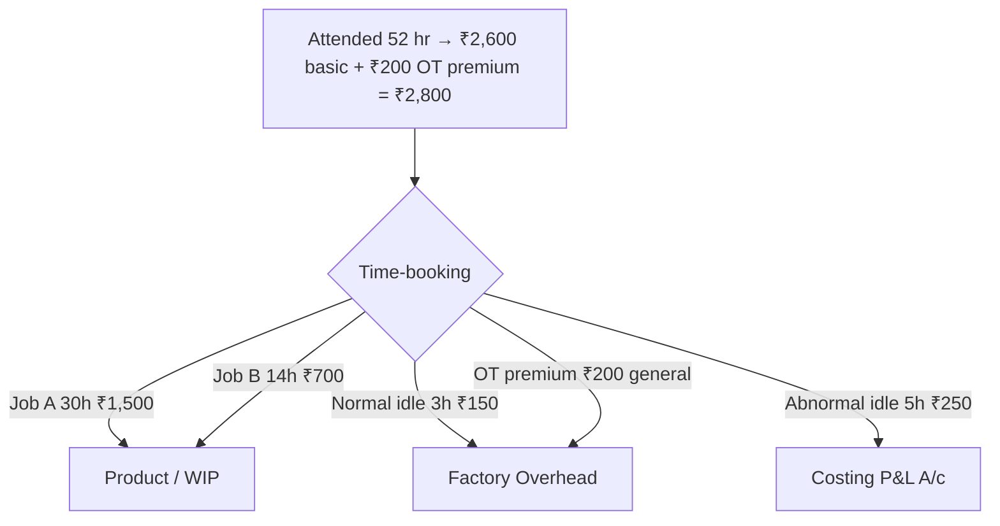

# Q&A — Employee (Labour) Cost

> CA Intermediate · Cost & Management Accounting · Exam-oriented question bank.
> Every question is followed immediately by a complete model answer. All figures reconcile (self-verified). Currency: Rupees (₹). Formulas per ICAI.

---

## Section A — Concept Check (short answer)

**A1. Distinguish time-keeping from time-booking.**
Time-keeping records an employee's **attendance** — arrival and departure from the factory gate (for wage/payroll purposes). Time-booking records **how that attended time was spent** on jobs/operations/idle time (for cost allocation). Time-keeping answers "was he present?"; time-booking answers "on what did he work?". The two are reconciled daily — booked time should equal gate time.

**A2. Define idle time and distinguish normal vs abnormal idle time with treatment.**
Idle time is the time for which wages are paid but no production is obtained. **Normal idle time** (tea breaks, machine setup, unavoidable delay) is inherent and uncontrollable — charged to production by **inflating the labour hour rate**. **Abnormal idle time** (strikes, power failure, machine breakdown, material shortage) is avoidable — charged to **Costing Profit & Loss A/c**, not to product cost.

**A3. What is overtime premium? How is it treated when caused by (a) customer's urgent order, (b) general factory policy, (c) abnormal reasons?**
Overtime premium is the **extra rate** paid over the normal rate for hours beyond normal working hours. Treatment of the *premium* (not the whole overtime wage):
- (a) At customer's request → charge to that **job/order** directly.
- (b) General/seasonal pressure → treat as **factory overhead**.
- (c) Abnormal causes → charge to **Costing P&L A/c**.
The normal-rate portion of overtime hours is always direct wages.

**A4. State the three methods of measuring labour turnover.**
1. **Separation Method** = (Separations ÷ Average number of workers) × 100.
2. **Replacement Method** = (Replacements ÷ Average number of workers) × 100.
3. **Flux Method** = (Separations + Accessions ÷ Average number of workers) × 100. (Accessions = replacements + new recruitments.)
Average workers = (Opening + Closing) ÷ 2.

**A5. Differentiate preventive costs from replacement costs of labour turnover.**
**Preventive costs** are incurred to *keep* workers from leaving — welfare, medical, pension, better working conditions, personnel administration. **Replacement costs** arise *because* workers left — recruitment, training, loss of output during learning, extra scrap/spoilage, accidents of new workers. Good management raises preventive spend to cut replacement cost.

**A6. Under Halsey and Rowan, what fraction of time saved goes to the worker?**
- **Halsey**: worker gets **50% of time saved** (guaranteed time wage + 50% bonus on time saved).
- **Rowan**: bonus = (Time saved ÷ Time allowed) × Time taken × rate — the worker's share of time-saved *varies*; it is proportionately smaller as savings grow, capping earnings and protecting against loose rates.

**A7. Write the standard formulas.**
- Halsey earnings = (T × R) + 50% × (S − T) × R, where S = std/allowed time, T = time taken.
- Rowan earnings = (T × R) + [(S − T) ÷ S] × T × R.
- Effective hourly rate = Total earnings ÷ Time taken.
- Taylor: below standard output → 83% (or given low) of piece rate; at/above → 125% (or given high) of piece rate.

---

## Section B — Graded Computational Problems

### B1 (Easy) — Straight piece rate vs guaranteed time
A worker is paid ₹15 per unit; guaranteed day wage ₹600 for an 8-hour day. In a day he produces 36 units.

**Solution.**
Piece earnings = 36 × ₹15 = **₹540**.
Guaranteed minimum = **₹600**.
Since piece earnings (₹540) < guarantee (₹600), the worker is paid the **guaranteed ₹600**.
*Verify:* effective rate = 600 ÷ 8 = ₹75/hr; the ₹60 top-up (600 − 540) is the guarantee cost absorbed by employer.

---

### B2 (Easy–Moderate) — Halsey and Rowan side by side
Standard time = 40 hours; actual time taken = 30 hours; rate = ₹20/hour.

**Solution.**
Time saved S − T = 40 − 30 = 10 hours.
Basic wage = 30 × 20 = ₹600.

| | Bonus | Total earnings | Effective rate |
|---|---|---|---|
| Halsey (50%) | 0.5 × 10 × 20 = ₹100 | 600 + 100 = **₹700** | 700÷30 = **₹23.33** |
| Rowan | (10÷40) × 30 × 20 = ₹150 | 600 + 150 = **₹750** | 750÷30 = **₹25.00** |

*Cross-check (Rowan bonus):* (Time saved ÷ Time allowed) × wage = (10÷40) × 600 = ₹150. ✔ Rowan pays more here because time saved (25%) is below 50% of allowed time.

---

### B3 (Moderate) — Labour turnover, all three methods
On 1 April a factory had 900 workers; on 30 April, 1,100 workers. During the month 40 workers left, 20 were discharged, and 300 were recruited — of whom 60 replaced those who left/were discharged and 240 were for a new plant expansion.

**Solution.**
Average workers = (900 + 1,100) ÷ 2 = **1,000**.
Separations = 40 + 20 = **60**. Replacements = **60**. Accessions = 300 (all joiners).

- Separation rate = 60 ÷ 1,000 × 100 = **6%**
- Replacement rate = 60 ÷ 1,000 × 100 = **6%**
- Flux rate = (60 + 300) ÷ 1,000 × 100 = **36%**

*Verify:* Closing = 900 − 60 + 300 = 1,140? No — recheck. If 300 recruited and 60 left, closing = 900 − 60 + 300 = 1,140, but given 1,100. So new recruitment must reconcile to closing 1,100.

**Reconciled version:** Take separations 60, total joiners = closing − opening + separations = 1,100 − 900 + 60 = **260**. Of these, 60 are replacements, 200 new posts.
- Separation rate = 60 ÷ 1,000 = **6%**
- Replacement rate = 60 ÷ 1,000 = **6%**
- Flux rate = (60 + 260) ÷ 1,000 = **32%**

*Check:* 900 − 60 + 260 = 1,100 = closing. ✔

---

### B4 (Moderate–Hard) — Comparative earnings statement (Time, Piece, Taylor, Halsey, Rowan)
Standard time per unit = 30 minutes. Rate = ₹40/hour. In an 8-hour day, worker produces 20 units. Piece rate = ₹20/unit. Taylor: 80% of piece rate below standard, 120% at/above standard.

**Solution.**
Standard time for 20 units = 20 × 30 min = 600 min = **10 hours** (allowed).
Time taken = **8 hours**. Time saved = 10 − 8 = **2 hours**. Standard output in 8 hr = 8×2 = 16 units; actual 20 units → **above standard.**

| System | Working | Earnings |
|---|---|---|
| Time wage | 8 × 40 | **₹320** |
| Straight piece | 20 × 20 | **₹400** |
| Taylor (above std → 120%) | 20 × (20×1.20) = 20×24 | **₹480** |
| Halsey | (8×40) + 0.5×2×40 = 320 + 40 | **₹360** |
| Rowan | 320 + (2÷10)×8×40 = 320 + 64 | **₹384** |

*Verify Rowan:* (2÷10)×(8×40) = 0.2×320 = ₹64. ✔ Effective rates: Halsey 360÷8 = ₹45; Rowan 384÷8 = ₹48/hr.

---

### B5 (Exam-Hard) — Full reconciliation with idle time and overtime
A worker's week (48 normal hours) records: attended 52 hours (4 overtime). Booked time: Job A 30 hr, Job B 14 hr, normal idle 3 hr, abnormal idle (power cut) 5 hr. Normal rate ₹50/hr; overtime paid at double rate (i.e., premium = ₹50/hr extra). Overtime arose from general factory pressure.

**Solution.**

**Step 1 — Reconcile time.** Booked = 30 + 14 + 3 + 5 = 52 hr = attended. ✔

**Step 2 — Basic wages (all hours at normal rate).**
52 × ₹50 = **₹2,600**.

**Step 3 — Overtime premium.** 4 hr × ₹50 = **₹200** → general pressure → **factory overhead**.

**Step 4 — Allocate wages.**

| Element | Hours | Amount (₹) | Charged to |
|---|---|---|---|
| Job A direct | 30 | 1,500 | Job A (WIP) |
| Job B direct | 14 | 700 | Job B (WIP) |
| Normal idle | 3 | 150 | Factory OH (in labour rate) |
| Abnormal idle | 5 | 250 | Costing P&L A/c |
| OT premium | — | 200 | Factory OH |
| **Total** | 52 hr | **2,800** | |

*Verify total paid:* Basic 2,600 + OT premium 200 = **₹2,800**. ✔ Product-charged direct wages = ₹2,200; overheads absorb ₹350; P&L absorbs ₹250.

---

## Section C — Past-Paper-Style Full Questions

### C1. Efficiency-based incentive with cost per unit
Standard output = 8 units/hour. A worker works 45 hours in a week and produces 400 units. Rate ₹60/hour. Under Rowan, compute earnings, effective hourly rate, and labour cost per unit. Compare with Halsey.

**Model answer.**
Standard time for 400 units = 400 ÷ 8 = **50 hours** allowed.
Time taken = **45 hours**. Time saved = 50 − 45 = **5 hours**.
Basic wage = 45 × 60 = **₹2,700**.

- **Rowan bonus** = (5 ÷ 50) × 45 × 60 = 0.1 × 2,700 = **₹270**.
  Total = 2,700 + 270 = **₹2,970**. Effective rate = 2,970 ÷ 45 = **₹66/hr**. Cost/unit = 2,970 ÷ 400 = **₹7.425**.
- **Halsey bonus** = 0.5 × 5 × 60 = **₹150**. Total = **₹2,850**. Cost/unit = 2,850 ÷ 400 = **₹7.125**.

*Comment:* Rowan pays ₹120 more and costs ₹0.30 more per unit here (time saved 10% < 50% of allowed). Rowan protects the employer when rates are loose; Halsey is cheaper at low efficiency.

---

### C2. Labour turnover cost and profit impact
A company's labour turnover caused output loss of 30,000 units in a year. Contribution per unit ₹8. Replacement cost ₹1,20,000; preventive cost ₹80,000. Had turnover been avoided by spending an extra ₹60,000 on preventive measures, output loss would have been nil. Advise.

**Model answer.**
**Loss of contribution from turnover** = 30,000 × ₹8 = **₹2,40,000**.
**Present separation-related cost** = Replacement ₹1,20,000 + lost contribution ₹2,40,000 = **₹3,60,000**.
**Cost if prevented** = extra preventive spend ₹60,000, output loss nil.
**Net saving from prevention** = 3,60,000 − 60,000 = **₹3,00,000**.

*Advice:* Spend the additional ₹60,000 on preventive measures. The ₹60,000 investment averts ₹3,60,000 of replacement plus lost-contribution cost, a net gain of **₹3,00,000**. Labour turnover is worth reducing whenever preventive cost < replacement + contribution loss.

---

### C3. Wages reconciliation / gross wages computation
An employee's card shows: basic pay ₹18,000/month; dearness allowance 20% of basic; employer PF 12% of basic; production bonus ₹1,500; overtime wages ₹2,200 (of which premium portion ₹700 due to a customer's rush order). He worked 200 productive hours in the month. Compute the direct labour cost charged to jobs and the total employer cost.

**Model answer.**

**Gross earnings to employee:**
Basic 18,000 + DA (20%×18,000=3,600) + bonus 1,500 + overtime 2,200 = **₹25,300**.
Add employer PF 12% × 18,000 = **₹2,160**.
**Total employer cost** = 25,300 + 2,160 = **₹27,460**.

**Charge to jobs (direct labour):**
Direct portion = Basic + DA + bonus + normal-rate part of OT + employer PF (treated as labour cost) = 18,000 + 3,600 + 1,500 + (2,200 − 700) + 2,160 = **₹26,760**.
The **OT premium ₹700** (customer's rush order) is charged **directly to that job**, so it is also product cost but identified separately, not spread as overhead.

*Verify:* 26,760 + 700 = ₹27,460 = total employer cost. ✔ Effective productive rate = 27,460 ÷ 200 = **₹137.30/hr**.

---

## Section D — MCQs and Case Scenarios

**D1.** Idle time arising from a power failure is charged to:
(a) Product cost via labour rate (b) Factory overhead (c) Costing P&L A/c (d) Administration overhead
**Ans: (c).** Power failure is abnormal idle time — excluded from cost, written to Costing P&L.

**D2.** Under the Rowan plan, the maximum bonus a worker can earn as a percentage of time wage:
(a) is unlimited (b) is 50% when time saved = time taken (c) equals time saved% always (d) is fixed at 33⅓%
**Ans: (b).** Rowan bonus = (saved÷allowed)×wage; it is maximised (50% of basic) when time taken = time saved, i.e., allowed = 2×taken.

**D3.** Labour turnover under the flux method includes:
(a) only separations (b) only replacements (c) separations + accessions (d) discharges only
**Ans: (c).** Flux captures total movement — those leaving and those joining.

**D4.** Overtime premium paid due to the company's own inefficiency/scheduling should be treated as:
(a) direct wages (b) factory overhead (c) costing P&L A/c (d) job cost
**Ans: (c).** Overtime caused by abnormal reasons/management fault is charged to Costing P&L, not product.

**D5. Case.** A worker (rate ₹25/hr) is allowed 12 hours for a job but finishes in 8. Under Halsey his total earnings are:
(a) ₹200 (b) ₹250 (c) ₹300 (d) ₹225
**Ans: (b).** Basic 8×25=200; bonus 0.5×(12−8)×25=50; total **₹250**.

**D6. Case.** Same data as D5, under Rowan:
(a) ₹250 (b) ₹266.67 (c) ₹300 (d) ₹275
**Ans: (b).** Bonus = (4÷12)×8×25 = ₹66.67; total 200+66.67 = **₹266.67**.

**D7.** Time-booking is primarily used for:
(a) payroll preparation (b) cost allocation to jobs (c) statutory PF filing (d) gate security
**Ans: (b).** Time-booking allocates attended time to jobs/overhead; time-keeping serves payroll.

**D8.** Which cost is a *preventive* cost of labour turnover?
(a) Cost of training new recruits (b) Loss of output during learning (c) Medical & welfare services (d) Recruitment advertising
**Ans: (c).** Welfare/medical retains workers (preventive); the others arise after separation (replacement).

---

## Quick-Revision Formula Strip

| Item | Formula |
|---|---|
| Halsey earnings | T·R + ½(S−T)·R |
| Rowan earnings | T·R + [(S−T)/S]·T·R |
| Rowan bonus (alt) | (Time saved / Time allowed) × Time wage |
| Effective rate | Total earnings / Time taken |
| Separation rate | Separations / Avg workers ×100 |
| Replacement rate | Replacements / Avg workers ×100 |
| Flux rate | (Separations + Accessions) / Avg workers ×100 |
| Avg workers | (Opening + Closing) / 2 |

**Treatment map:** Normal idle → in labour rate/OH · Abnormal idle → P&L · OT premium: customer→job, general→OH, abnormal→P&L.
