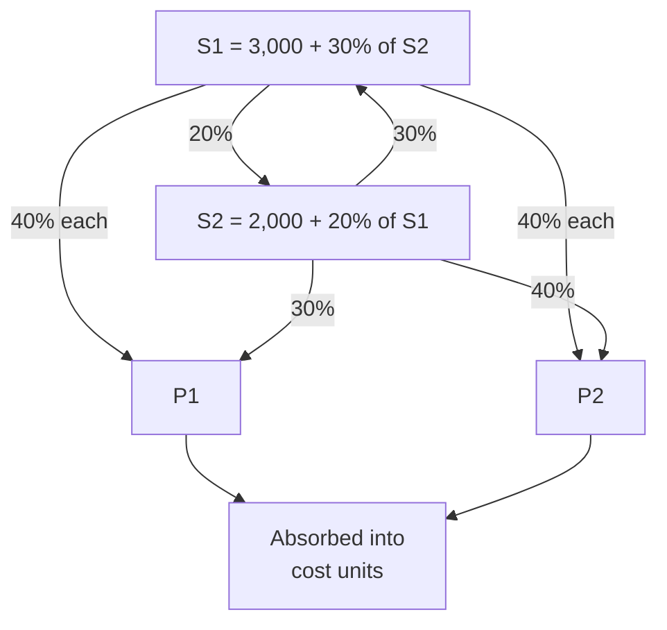

# Q&A — Overheads (Absorption Costing)

*CA Intermediate — Cost & Management Accounting. All figures in Rupees (Rs.). ICAI formulas.*

---

## Section A — Concept-Check (short answer)

**A1. Why can overheads never be traced to a unit the way material and labour can?**
Overheads are indirect costs — factory rent, supervisor salary, power — incurred for *output as a whole*, not for any single unit. There is no natural per-unit measure, so we must *build* one through allocation, apportionment and absorption. (This is the restaurant-bill split problem: the shared starter has no obvious per-diner price.)

**A2. Distinguish allocation, apportionment and absorption in one line each.**
- **Allocation** — charging a *whole* overhead item directly to one cost centre that caused it (e.g., a department's own foreman salary).
- **Apportionment** — *splitting* a shared overhead across several centres on an equitable basis (e.g., rent on floor area).
- **Absorption** — recovering the cost centre's total overhead into *cost units* via an absorption rate.

**A3. What is primary vs secondary distribution?**
Primary distribution allocates/apportions all overheads to *all* departments (production + service). Secondary distribution re-apportions *service* department costs onto *production* departments, so only production departments finally carry overhead.

**A4. Name the three methods of secondary distribution when service departments serve each other.**
(i) Simultaneous equation (algebraic) method, (ii) Repeated distribution method, (iii) Trial-and-error method. All handle *reciprocal* services; the step/non-reciprocal method ignores return service.

**A5. Give the formula for Machine Hour Rate (MHR).**
MHR = Total overheads of the machine (or cost centre) ÷ Machine hours worked. It is the most scientific rate where work is machine-dominated.

**A6. Blanket vs departmental overhead rate — when is a blanket rate acceptable?**
A blanket (single, factory-wide) rate = Total factory overhead ÷ Total base for whole factory. It is acceptable only when there is *one* product or all products pass through *all* departments in the *same* proportion. Otherwise a departmental rate is used to avoid distortion.

**A7. Define under- and over-absorption.**
Under-absorption: overhead *absorbed* (rate × actual base) is **less** than overhead *actually incurred* → costs understated. Over-absorption: absorbed **exceeds** incurred → costs overstated.

**A8. When is a supplementary rate used, and what does a positive supplementary rate signify?**
When under/over-absorption is *large* and due to *normal* causes, it is disposed of by a supplementary rate spread over units/cost. A **positive (additive)** supplementary rate corrects **under-absorption** (extra cost to be loaded); a negative rate corrects over-absorption.

---

## Section B — Graded Computational Problems

### B1 (Easy) — Machine Hour Rate

A machine's monthly data: Depreciation Rs. 5,000; Power Rs. 3,000; Repairs Rs. 1,000; Consumable stores Rs. 500; Supervision (apportioned) Rs. 2,500. The machine works 8 hours/day for 25 days, with 10% idle time for setting.

**Solution.**
Effective machine hours = 8 × 25 × (1 − 0.10) = 200 × 0.90 = **180 hours**.
Total overhead = 5,000 + 3,000 + 1,000 + 500 + 2,500 = **Rs. 12,000**.
MHR = 12,000 ÷ 180 = **Rs. 66.67 per machine hour**.

---

### B2 (Moderate) — Primary Distribution + Absorption Rate

Overheads for a factory with departments A, B (production) and S (service):

| Item | Total (Rs.) | Basis |
|---|---|---|
| Rent | 12,000 | Floor area |
| Depreciation | 9,000 | Machine value |
| Supervision | 6,000 | No. of employees |

| Dept | Floor area (sq.m) | Machine value (Rs.) | Employees |
|---|---|---|---|
| A | 300 | 60,000 | 20 |
| B | 200 | 30,000 | 15 |
| S | 100 | 10,000 | 5 |

Service dept S is apportioned to A and B in ratio 3:2. Dept A works 5,000 labour hours, B works 4,000 machine hours.

**Primary distribution.**
Rent (600 sq.m total → 12,000/600 = Rs. 20/sq.m): A 6,000; B 4,000; S 2,000.
Depreciation (1,00,000 total → 9,000/1,00,000 = Rs.0.09/Re): A 5,400; B 2,700; S 900.
Supervision (40 employees → 6,000/40 = Rs.150/emp): A 3,000; B 2,250; S 750.

| Dept | Rent | Depn | Supervision | Total |
|---|---|---|---|---|
| A | 6,000 | 5,400 | 3,000 | **14,400** |
| B | 4,000 | 2,700 | 2,250 | **8,950** |
| S | 2,000 | 900 | 750 | **3,650** |

**Secondary distribution.** S = Rs. 3,650 split 3:2 → A = 2,190; B = 1,460.
Final: A = 14,400 + 2,190 = **Rs. 16,590**; B = 8,950 + 1,460 = **Rs. 10,410**.
(Check: 16,590 + 10,410 = 27,000 = 14,400 + 8,950 + 3,650 ✓)

**Absorption rates.**
Dept A (labour-hour rate) = 16,590 ÷ 5,000 = **Rs. 3.318 per labour hour**.
Dept B (machine-hour rate) = 10,410 ÷ 4,000 = **Rs. 2.6025 per machine hour**.

---

### B3 (Exam-hard) — Reciprocal service: Simultaneous Equation & Repeated Distribution

Primary-distribution totals: Production P1 = Rs. 8,000, P2 = Rs. 10,000; Service S1 = Rs. 3,000, S2 = Rs. 2,000. Service departments serve as follows:

| From \ To | P1 | P2 | S1 | S2 |
|---|---|---|---|---|
| S1 | 40% | 40% | — | 20% |
| S2 | 30% | 40% | 30% | — |

**Method 1 — Simultaneous equations.**
Let S1 = total cost of S1, S2 = total cost of S2.
S1 = 3,000 + 0.30 S2
S2 = 2,000 + 0.20 S1

Substitute: S1 = 3,000 + 0.30(2,000 + 0.20 S1) = 3,000 + 600 + 0.06 S1
0.94 S1 = 3,600 → **S1 = Rs. 3,829.79**.
S2 = 2,000 + 0.20 × 3,829.79 = **Rs. 2,765.96**.

Apportion to production:
- From S1 (40% each to P1, P2): P1 += 1,531.91; P2 += 1,531.91.
- From S2 (30% P1, 40% P2): P1 += 829.79; P2 += 1,106.38.

| Dept | Primary | From S1 | From S2 | Total |
|---|---|---|---|---|
| P1 | 8,000 | 1,531.91 | 829.79 | **10,361.70** |
| P2 | 10,000 | 1,531.91 | 1,106.38 | **12,638.30** |

(Check: 10,361.70 + 12,638.30 = 23,000 = 8,000+10,000+3,000+2,000 ✓ — all service cost absorbed.)

**Method 2 — Repeated distribution (cross-check).** Keep passing service totals in the given percentages until residual is negligible:

| | P1 | P2 | S1 | S2 |
|---|---|---|---|---|
| Primary | 8,000 | 10,000 | 3,000 | 2,000 |
| S1 (40/40/-/20) | 1,200 | 1,200 | (3,000) | 600 |
| S2 (30/40/30/-) | 780 | 1,040 | 780 | (2,600) |
| S1 (40/40/-/20) | 312 | 312 | (780) | 156 |
| S2 (30/40/30/-) | 46.8 | 62.4 | 46.8 | (156) |
| S1 (40/40/-/20) | 18.72 | 18.72 | (46.8) | 9.36 |
| S2 (close out 30/40/30) | 2.81 | 3.74 | 2.81 → tiny | (9.36) |
| Final S1 residual ~2.81 → 40/40 | 1.40 | 1.40 | — | — |
| **Total** | **≈10,361.73** | **≈12,638.26** | — | — |

Both methods reconcile to **P1 ≈ Rs. 10,362 and P2 ≈ Rs. 12,638**. The simultaneous method is exact; repeated distribution converges to the same figures.

---

### B4 (Exam-hard) — Absorption + Under/Over-Absorption + Supplementary Rate

Budgeted overhead Rs. 5,00,000; budgeted machine hours 50,000 → **predetermined rate = Rs. 10/hr**.
Actual overhead incurred Rs. 5,60,000; actual machine hours 52,000.
Output: 20,000 units, of which 15,000 sold, 3,000 in closing WIP-equivalent finished stock, 2,000 in closing WIP.

**Overhead absorbed** = actual hours × rate = 52,000 × 10 = **Rs. 5,20,000**.
**Under-absorption** = 5,60,000 − 5,20,000 = **Rs. 40,000** (incurred > absorbed → under).

*Analysis of cause:* Rate-driven shortfall of Rs. 40,000 arising from higher actual spending (Rs. 60,000 more) partly offset by more hours worked (2,000 × 10 = Rs. 20,000 extra absorbed). As it is material and due to a normal cause, dispose of via a **supplementary rate** across cost of sales and stocks in proportion to units.

Supplementary rate = 40,000 ÷ 20,000 units = **Rs. 2 per unit (positive/additive)**.
- Cost of sales (15,000 × 2) = Rs. 30,000
- Finished stock (3,000 × 2) = Rs. 6,000
- WIP (2,000 × 2) = Rs. 4,000
- Total = **Rs. 40,000** ✓ (fully absorbed).

*If the under-absorption had been small or due to an abnormal cause (e.g., strike, fire), it would instead be transferred straight to the Costing Profit & Loss Account.*

---

## Section C — Past-Paper-Style Full Questions

**C1.** *A manufacturing company has two production departments (Machining, Assembly) and one service department (Maintenance). Explain the treatment of Maintenance overhead and state, with reasons, the most appropriate absorption base for each production department.*

**Model answer.** Maintenance is a service department; its cost is first captured in primary distribution, then re-apportioned to Machining and Assembly in secondary distribution (basis: maintenance hours or asset value served) so that only the two production departments finally bear overhead. **Machining**, being capital/machine-intensive, should absorb overhead on a **machine-hour rate** because overhead there varies with machine running time (power, depreciation, repairs). **Assembly**, being labour-intensive, should use a **direct labour-hour rate**, as its overhead correlates with operator time. Using a single blanket rate would over-cost labour-heavy jobs and under-cost machine-heavy jobs, so departmental rates are justified.

**C2.** *State how each of the following is disposed of: (a) large under-absorption due to persistent under-estimation of overhead; (b) over-absorption due to greater-than-budgeted output; (c) under-absorption caused by an abnormal machine breakdown.*

**Model answer.**
(a) Large, normal-cause under-absorption → **supplementary rate** loaded on cost of sales, finished goods and WIP (positive rate).
(b) Over-absorption from higher normal output → **supplementary rate (negative)** or, if small, credited to **Costing P&L**.
(c) Abnormal-cause under-absorption → charged directly to **Costing Profit & Loss Account**, as it must not distort product cost.

**C3.** *The overhead of Dept X was Rs. 1,80,000 for 12,000 machine hours (budget). Actual: Rs. 2,04,000 for 12,500 hours. Compute the pre-determined rate, overhead absorbed, and under/over-absorption, splitting the variance into "expenditure" and "capacity/volume" causes.*

**Model answer.**
Pre-determined rate = 1,80,000 ÷ 12,000 = **Rs. 15/hr**.
Absorbed = 12,500 × 15 = **Rs. 1,87,500**.
Under-absorption = 2,04,000 − 1,87,500 = **Rs. 16,500**.
- *Expenditure cause:* actual spend Rs. 2,04,000 vs budget-flexed at actual hours (12,500 × 15 = 1,87,500)… but budget was 1,80,000; extra spend vs original budget = 2,04,000 − 1,80,000 = Rs. 24,000 (adverse).
- *Capacity cause:* extra 500 hours worked absorbed 500 × 15 = Rs. 7,500 more (favourable).
- Net = 24,000 − 7,500 = **Rs. 16,500 under-absorbed** ✓.

---

## Section D — MCQs & Case Scenarios

**D1.** Apportionment of factory rent is best done on the basis of:
(a) Number of employees (b) **Floor area** (c) Machine value (d) Direct wages.
**Answer: (b)** — rent relates to space occupied.

**D2.** Overhead absorbed = Rs. 90,000; overhead incurred = Rs. 1,00,000. This is:
(a) Over-absorption Rs. 10,000 (b) **Under-absorption Rs. 10,000** (c) Nil (d) Over Rs. 90,000.
**Answer: (b)** — incurred exceeds absorbed by Rs. 10,000.

**D3.** The most scientific overhead rate for a highly automated shop is:
(a) Percentage of direct wages (b) **Machine hour rate** (c) Percentage of prime cost (d) Rate per unit.
**Answer: (b)** — overhead there varies with machine time.

**D4.** In secondary distribution, the simultaneous-equation method is required when:
(a) Only one service dept exists (b) Service depts do not serve each other (c) **Service departments serve each other reciprocally** (d) There are no service depts.
**Answer: (c)** — reciprocal service needs algebraic solution.

**D5.** A blanket overhead rate should be avoided when:
(a) Single product (b) **Products pass through departments in different proportions** (c) One department only (d) Uniform processing.
**Answer: (b)** — differing routing distorts a single rate.

**D6 (Case).** A firm budgets overhead Rs. 4,00,000 for 40,000 labour hours. Actual overhead Rs. 4,00,000 but only 36,000 hours worked. Absorbed = 36,000 × (4,00,000/40,000 = Rs.10) = Rs. 3,60,000 → **under-absorbed Rs. 40,000** due to *idle capacity* (a normal-cause volume variance). Treatment: as it reflects unused normal capacity, transfer to Costing P&L (or supplementary rate if material and product-related). Correct statement: **the shortfall is a capacity/volume under-absorption, not an expenditure overrun.**

---

## Quick-Revision Trigger List
- Base picks: rent → floor area; depreciation/power → machine value/hours; supervision → employees; canteen → headcount; stores → material value.
- Reciprocal → simultaneous eqn (exact) or repeated distribution (converges).
- Under-absorption = Incurred − Absorbed (positive). Dispose: small → P&L; large & normal → supplementary rate; abnormal → P&L always.
- MHR = machine overhead ÷ effective machine hours (net of idle/setup).
- Blanket rate only for single/uniform-routing products.
