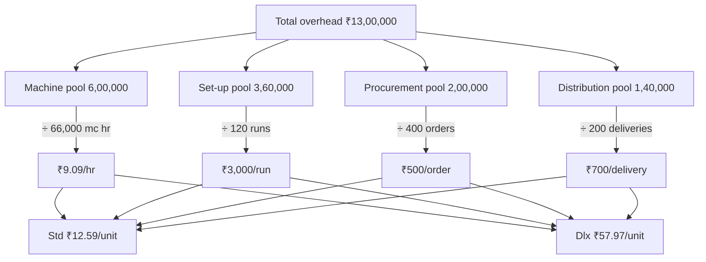

# Q&A — Activity-Based Costing (ABC)

> CA Intermediate · Cost & Management Accounting · Exam-oriented question bank.
> Every question is followed immediately by a complete model answer. All figures in Rupees (₹). ICAI conventions.

---

## Section A — Concept-Check (short answer)

**A1. Define Activity-Based Costing.**
ABC is a costing system that assigns overheads to products/services on the basis of the **activities** they consume, using **cost drivers** as the allocation base, instead of a single volume-based rate. Overheads are first pooled by activity, then charged to products in proportion to each product's usage of the relevant driver.

**A2. Why can a traditional single-rate cost sheet mislead the board on product profitability?**
Traditional absorption uses a **volume base** (labour hours / machine hours). High-volume simple products absorb *most* overhead because they clock the most hours, while low-volume complex products (which trigger many set-ups, inspections, orders) absorb *too little*. This **cross-subsidy** makes simple products look unprofitable and complex products look profitable — the reverse of reality.

**A3. Explain the restaurant bill-split analogy.**
Splitting a restaurant bill equally (per head) overcharges the person who ate a salad and undercharges the one who ordered lobster and wine. ABC is the "pay for what you actually consumed" method — each diner pays for the dishes they ordered, just as each product bears the cost of the activities it actually triggers.

**A4. State the two-stage causal chain in ABC.**
Stage 1: **Resources → Activities** (overhead costs are pooled into activity cost pools via *resource drivers*). Stage 2: **Activities → Cost objects** (activity costs are charged to products via *activity/cost drivers*). Causality — "activities cause cost, products cause activities" — drives both stages.

**A5. Distinguish a *resource driver* from an *activity (cost) driver*.**
A **resource driver** allocates the cost of a resource (e.g., power, rent, salaries) to activity pools (Stage 1). An **activity/cost driver** allocates the cost in an activity pool to products (Stage 2), e.g., number of set-ups, number of purchase orders, inspection hours.

**A6. List Cooper's four-level activity hierarchy with one driver each.**
1. **Unit-level** — performed for each unit (machining) → machine hours/units.
2. **Batch-level** — performed per batch (set-ups, material handling) → number of set-ups/batches.
3. **Product-level (product-sustaining)** — support a product line (design, spec maintenance) → number of products/design changes.
4. **Facility-level (facility-sustaining)** — sustain the plant (rent, security, plant management) → allocated on some fair base (often not driver-traceable; sometimes kept as a lump absorbed on floor area).

**A7. Give the master formula for a cost-driver (recovery) rate and product overhead.**
Cost driver rate = **Activity cost pool ÷ Total cost driver volume**.
Overhead to a product = **Cost driver rate × Driver quantity consumed by that product**.

**A8. When does ABC "pay off" (conditions favouring adoption)?**
When (i) overheads are a large proportion of total cost, (ii) product/customer diversity is high (mix of volumes, sizes, complexity), (iii) non-volume activities (set-ups, inspection, handling) are significant, (iv) intense competition demands accurate pricing, and (v) the cost of measuring drivers is justified by better decisions.

**A9. What is Activity-Based Management (ABM) and how does it differ from ABC?**
ABC is the **costing** technique (assigns cost). ABM **uses** ABC information to improve operations — eliminating **non-value-added activities**, cost reduction, pricing, and process re-engineering. ABC produces the numbers; ABM acts on them.

**A10. Value-added vs non-value-added activity — define and give an example of each.**
A **value-added activity** increases worth to the customer (machining, assembly). A **non-value-added activity** adds cost but no customer worth and should be minimised/eliminated (storage, inspection, moving, waiting, rework).

---

## Section B — Graded Computational Problems

### B1 (Easy) — Single activity rate and re-pricing

A factory has overhead of ₹4,00,000 driven by machine set-ups. Total set-ups = 200. Product X needs 40 set-ups; Product Y needs 160 set-ups.

**Required:** (a) cost-driver rate, (b) overhead to each product.

**Solution.**
(a) Rate = 4,00,000 ÷ 200 = **₹2,000 per set-up**.
(b) Product X = 2,000 × 40 = **₹80,000**; Product Y = 2,000 × 160 = **₹3,20,000**.
Check: 80,000 + 3,20,000 = 4,00,000 ✓

---

### B2 (Easy–Moderate) — Traditional vs ABC, two products

Blitz Ltd makes **A** (10,000 units) and **B** (2,000 units). Total overhead ₹6,00,000. Labour hours: A = 20,000, B = 4,000 (0.5 hr + 2 hr per unit? — take totals as given: A 20,000, B 4,000). Overhead splits by activity:

| Activity | Cost (₹) | Driver | A | B | Total |
|---|---|---|---|---|---|
| Machining | 2,40,000 | machine hrs | 20,000 | 4,000 | 24,000 |
| Set-ups | 1,80,000 | set-ups | 30 | 90 | 120 |
| Inspection | 1,80,000 | inspections | 40 | 160 | 200 |

**Required:** Overhead per unit under (a) traditional labour-hour rate, (b) ABC.

**Solution.**
Traditional rate = 6,00,000 ÷ (20,000 + 4,000) = **₹25 per labour hr**.
- A: 25 × 20,000 = 5,00,000 → **₹50/unit**.
- B: 25 × 4,000 = 1,00,000 → **₹50/unit**.

ABC driver rates:
- Machining = 2,40,000 ÷ 24,000 = ₹10/mc hr.
- Set-ups = 1,80,000 ÷ 120 = ₹1,500/set-up.
- Inspection = 1,80,000 ÷ 200 = ₹900/inspection.

| | A (₹) | B (₹) |
|---|---|---|
| Machining | 10×20,000 = 2,00,000 | 10×4,000 = 40,000 |
| Set-ups | 1,500×30 = 45,000 | 1,500×90 = 1,35,000 |
| Inspection | 900×40 = 36,000 | 900×160 = 1,44,000 |
| **Total** | **2,81,000** | **3,19,000** |
| Units | 10,000 | 2,000 |
| **Per unit** | **₹28.10** | **₹159.50** |

Check: 2,81,000 + 3,19,000 = 6,00,000 ✓
**Insight:** low-volume complex B was undercosted at ₹50; true ABC cost ₹159.50. Traditional cross-subsidised B at the expense of A.

---

### B3 (Moderate) — Full cost & profit reconciliation

Nova Ltd, two products **P** and **Q**:

| | P | Q |
|---|---|---|
| Output (units) | 4,000 | 1,000 |
| Direct material/unit | ₹40 | ₹60 |
| Direct labour/unit (@₹20/hr) | 2 hr | 3 hr |
| Machine hrs/unit | 2 | 4 |
| No. of purchase orders | 40 | 60 |
| No. of set-ups | 20 | 80 |

Overheads: Machine-related ₹2,20,000 (driver: machine hrs); Purchasing ₹1,00,000 (driver: orders); Set-up ₹2,00,000 (driver: set-ups). Selling price P ₹150, Q ₹300.

**Required:** Unit cost and profit per unit under ABC.

**Solution.**
Machine hrs: P 8,000 + Q 4,000 = 12,000. Rate = 2,20,000 ÷ 12,000 = ₹18.333/hr.
Orders: 100 → rate = 1,00,000 ÷ 100 = ₹1,000/order.
Set-ups: 100 → rate = 2,00,000 ÷ 100 = ₹2,000/set-up.

Overhead assigned:

| | P (₹) | Q (₹) |
|---|---|---|
| Machine | 18.333×8,000 = 1,46,667 | 18.333×4,000 = 73,333 |
| Purchasing | 1,000×40 = 40,000 | 1,000×60 = 60,000 |
| Set-up | 2,000×20 = 40,000 | 2,000×80 = 1,60,000 |
| **Total OH** | **2,26,667** | **2,93,333** |
| Per unit OH | 56.67 | 293.33 |

Cost per unit:

| | P (₹) | Q (₹) |
|---|---|---|
| Material | 40.00 | 60.00 |
| Labour (2×20 / 3×20) | 40.00 | 60.00 |
| Overhead | 56.67 | 293.33 |
| **Total cost** | **136.67** | **413.33** |
| Price | 150.00 | 300.00 |
| **Profit/(loss)** | **13.33** | **(113.33)** |

Check OH: 2,26,667 + 2,93,333 = 5,20,000 = 2,20,000+1,00,000+2,00,000 ✓
**Insight:** Q, which the board thought was the "premium earner" at ₹300, actually **loses ₹113/unit** — its 80 set-ups and 60 orders make it a complexity hog.

---

### B4 (Exam-hard) — Traditional vs ABC full reconciliation with decision

Zenith Ltd manufactures **Std** (48,000 units) and **Dlx** (12,000 units). Data:

| | Std | Dlx | Total |
|---|---|---|---|
| Machine hrs/unit | 1.0 | 1.5 | — |
| Direct labour hrs/unit | 0.5 | 1.0 | — |
| Production runs | 30 | 90 | 120 |
| Purchase orders | 100 | 300 | 400 |
| Deliveries | 40 | 160 | 200 |

Overheads: Machine dept ₹6,00,000; Set-up (runs) ₹3,60,000; Procurement (orders) ₹2,00,000; Distribution (deliveries) ₹1,40,000. **Total ₹13,00,000.** Traditional base = direct labour hours.

**Required:** Overhead/unit under (a) traditional, (b) ABC, and comment.

**Solution.**
DL hrs: Std 48,000×0.5 = 24,000; Dlx 12,000×1.0 = 12,000; total 36,000.
Traditional rate = 13,00,000 ÷ 36,000 = ₹36.111/DLH.
- Std: 36.111×24,000 = 8,66,667 → **₹18.06/unit**.
- Dlx: 36.111×12,000 = 4,33,333 → **₹36.11/unit**.

ABC rates:
- Machine hrs: Std 48,000×1 = 48,000; Dlx 12,000×1.5 = 18,000; total 66,000. Rate = 6,00,000 ÷ 66,000 = ₹9.0909/mc hr.
- Set-up = 3,60,000 ÷ 120 = ₹3,000/run.
- Procurement = 2,00,000 ÷ 400 = ₹500/order.
- Distribution = 1,40,000 ÷ 200 = ₹700/delivery.

| | Std (₹) | Dlx (₹) |
|---|---|---|
| Machine | 9.0909×48,000 = 4,36,364 | 9.0909×18,000 = 1,63,636 |
| Set-up | 3,000×30 = 90,000 | 3,000×90 = 2,70,000 |
| Procurement | 500×100 = 50,000 | 500×300 = 1,50,000 |
| Distribution | 700×40 = 28,000 | 700×160 = 1,12,000 |
| **Total OH** | **6,04,364** | **6,95,636** |
| Units | 48,000 | 12,000 |
| **OH/unit** | **₹12.59** | **₹57.97** |

Check: 6,04,364 + 6,95,636 = 13,00,000 ✓

**Comment.** Traditional charged Dlx ₹36.11; ABC reveals **₹57.97** — an under-recovery of ~₹21.86/unit (₹2.6 lakh across 12,000 units) that Std was silently subsidising. If Dlx price was fixed on the ₹36 figure, the "profit" was illusory. ABC supports re-pricing Dlx, or reducing its runs/orders/deliveries.

**Approach diagram:**

---

## Section C — Past-Paper-Style Full Questions

### C1. "A company using single-rate absorption finds its high-volume product looks unprofitable while a niche product looks a star. Explain, with the ABC logic, why this happens and how ABC corrects it." (5 marks)

**Model answer.** Under single-rate absorption the base is volume (labour/machine hours). The high-volume product accumulates the largest share of hours and therefore **absorbs the bulk of overhead**, inflating its cost, while the niche low-volume product absorbs little despite triggering disproportionate **batch- and product-level** activities (set-ups, special orders, inspections). This **cross-subsidy** understates the niche product's true cost and overstates the mainstream product's. ABC breaks overhead into **activity pools**, computes a **driver rate** for each (set-ups, orders, inspections, machine hrs), and recharges each product by its **actual driver consumption**. The niche product now bears its full batch/product-sustaining cost, the volume product is relieved, and reported profitability reverses to reflect economic reality — enabling correct pricing, mix and make-or-buy decisions.

### C2. "State the seven steps in implementing an ABC system." (5 marks)

**Model answer.**
1. **Identify activities** in the organisation (machining, set-up, purchasing, inspection, dispatch).
2. **Create activity cost pools** — group overheads by activity.
3. **Assign resource costs to pools** using resource drivers (Stage 1).
4. **Identify the cost driver** for each pool (the factor causing its cost).
5. **Compute the cost-driver rate** = pool cost ÷ total driver volume.
6. **Assign activity costs to products** = rate × driver quantity consumed (Stage 2).
7. **Compute product cost** by adding direct costs + assigned overhead; use for pricing and decisions.

### C3. "How does ABC information feed Activity-Based Budgeting (ABB) and target costing?" (4 marks)

**Model answer.** **ABB** reverses the ABC flow: starting from planned output, it forecasts the **activity volumes** (set-ups, orders) required, then the **resources** each activity needs, building the budget bottom-up from activities rather than incremental line items — improving accuracy and highlighting capacity. In **target costing**, ABC supplies reliable per-product cost, so once the market price and desired margin fix the **target cost**, ABC pinpoints which **activities** to attack (via ABM) to close the gap between current and target cost — driver reduction (fewer set-ups, larger batches) becomes the cost-reduction lever.

---

## Section D — MCQs & Case Scenarios

**D1.** The primary allocation base in ABC is:
A) machine hours B) direct labour hours C) cost drivers D) units produced
**Ans: C.** ABC assigns overhead by activity cost drivers, not a single volume base.

**D2.** "Number of set-ups" is a driver for which activity level?
A) Unit B) Batch C) Product D) Facility
**Ans: B.** Set-ups are incurred per batch, independent of units in the batch.

**D3.** Factory rent and plant security are best classified as:
A) unit-level B) batch-level C) product-level D) facility-level
**Ans: D.** They sustain the whole facility and cannot be traced to a driver of output.

**D4.** ABC is MOST beneficial when:
A) overheads are a small % of cost B) products are identical C) product diversity and non-volume overheads are high D) there is a single product
**Ans: C.** Diversity + significant batch/product costs create the cross-subsidy ABC fixes.

**D5.** Under ABC, a low-volume complex product's cost usually:
A) falls vs traditional B) rises vs traditional C) stays equal D) becomes zero
**Ans: B.** It finally absorbs its true batch/product-sustaining costs.

**D6.** ABM primarily aims to:
A) increase overheads B) eliminate non-value-added activities C) replace financial accounting D) set standard hours
**Ans: B.** ABM uses ABC data to cut non-value-added activities and reduce cost.

**D7 — Case.** Prime Ltd's traditional system shows Product Z (500 units, 20 set-ups) at ₹80/unit overhead; ABC (set-up rate ₹2,000, machine ₹5/hr, Z uses 1,000 mc hrs) shows a different figure. ABC overhead for Z per unit is:
Working: set-up 2,000×20 = 40,000; machine 5×1,000 = 5,000; total 45,000 ÷ 500 = **₹90/unit**.
A) ₹80 B) ₹85 C) ₹90 D) ₹100
**Ans: C.** Z was undercosted by ₹10/unit; its 20 set-ups drive the increase.

**D8 — Case.** A firm removes a ₹3,00,000 inspection activity (a non-value-added cost) after ABM analysis without harming quality. The correct classification and effect:
A) value-added; cost rises B) non-value-added; cost falls with no customer impact C) facility-level; price rises D) unit-level; output falls
**Ans: B.** Eliminating a non-value-added activity lowers cost while customer worth is unchanged.

**D9 — Case.** Two products share overhead ₹5,00,000 on orders. X places 20 orders, Y 30. If instead Y consolidates to 10 orders (total 30), Y's charge:
Old rate 5,00,000÷50 = ₹10,000; Y old = 3,00,000. New total orders 30, rate = 5,00,000÷30 = ₹16,667; Y new = 1,66,667. Y's charge **falls** (fewer orders consumed) — illustrating driver reduction under ABM.
A) rises B) falls C) unchanged D) doubles
**Ans: B.** Consuming fewer driver units reduces the product's assigned cost.

---

## Quick-Revision Sheet

| Item | Rule / Formula |
|---|---|
| Driver rate | Activity pool cost ÷ total driver volume |
| Product OH | Driver rate × driver units consumed |
| Two stages | Resources →(resource driver)→ Activities →(activity driver)→ Products |
| Hierarchy | Unit · Batch · Product · Facility |
| ABC beats traditional when | High OH %, high diversity, big non-volume activities |
| Effect on low-volume complex | Cost **rises** (removes cross-subsidy) |
| ABM | Uses ABC data → cut non-value-added activities |
| Self-check | Σ product overheads must equal total overhead |

**Nine examiner traps:** (1) using labour hours as ABC driver by habit; (2) forgetting to re-total and reconcile pools; (3) mixing per-unit and per-batch quantities; (4) treating facility costs as driver-traceable; (5) omitting direct material/labour when asked for *total* cost; (6) rounding driver rates too early; (7) not commenting on the profitability reversal; (8) confusing resource driver with activity driver; (9) assuming ABC always lowers cost — it *redistributes* it.
