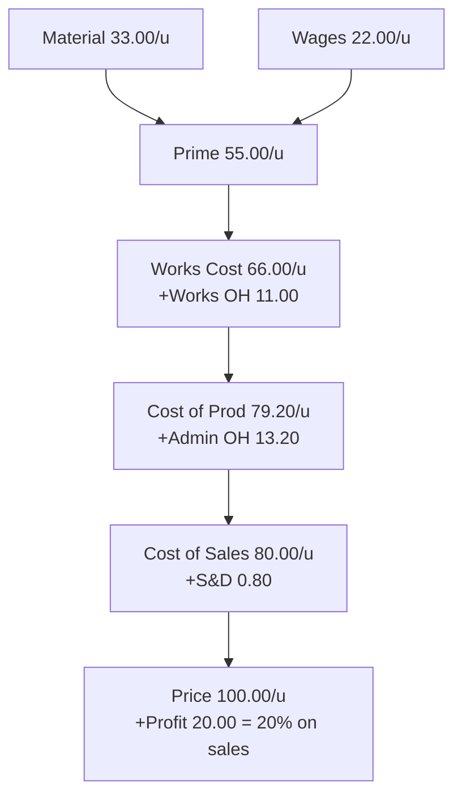

# Q&A — Cost Sheet

Exam-oriented question bank for CA Intermediate — Cost & Management Accounting. Every question is followed immediately by a complete model answer. All figures are in Rupees (₹) and follow ICAI cost-accounting conventions.

---

## Section A — Concept-Check (short theory)

**A1. What is a Cost Sheet and what pricing question does it answer that a P&L cannot?**
A Cost Sheet is a statement showing the total and per-unit cost of a product/service, built element by element and stage by stage (Prime → Works → Production → COGS → Cost of Sales). The financial P&L only gives *total* profit for the period; it cannot tell you the cost *per unit* or the cost *at each function*. The Cost Sheet answers "what did one unit cost to make and sell, and therefore what price must I quote?" — essential for tenders, quotations and price fixation.

**A2. Distinguish direct and indirect costs.**
Direct costs are conveniently and wholly traceable to a cost object (direct material, direct labour, direct expenses) and form Prime Cost. Indirect costs (overheads) cannot be economically traced to one unit and are apportioned/absorbed — factory, administration and selling & distribution overheads.

**A3. State the five cost stages in order and the item added at each.**
Prime Cost (direct elements) → Factory/Works Cost (+ factory OH ± WIP) → Cost of Production (+ admin OH) → Cost of Goods Sold (± finished-goods stock) → Cost of Sales (+ selling & distribution OH). Add profit to reach Sales.

**A4. Why is stock a "timing bridge" and where does each stock adjustment sit?**
Stock corrects the mismatch between what is *made/bought* this period and what is *sold* this period. Raw-material stock adjusts at material-consumed (before Prime Cost); WIP adjusts inside Works Cost; finished-goods stock adjusts between Cost of Production and COGS.

**A5. Give the two margin formulas and how to convert between them.**
Profit as % of cost: Profit = Cost × rate. Profit as % of sales: Profit = Sales × rate. Convert: if profit is 25% on cost, then on sales it is 25/125 = 20%; if 20% on sales, then on cost it is 20/80 = 25%.

**A6. List four items excluded from the Cost Sheet.**
Purely financial/appropriation items: income tax, dividends paid, interest on loans (financial charge), donations, goodwill/preliminary-expense write-offs, loss on sale of fixed assets, cash discounts, and transfers to reserves. They are dealt with in Cost Reconciliation, not the Cost Sheet.

**A7. What is the treatment of scrap sale of raw material vs. sale of finished-goods scrap?**
Sale value of *defective raw material/normal factory scrap* is deducted from factory overheads (or material cost); it reduces cost. It is never treated as other income in the Cost Sheet.

---

## Section B — Graded Computational Problems (full workings)

### B1 (Easy) — Basic build-up, profit on cost
**Q.** From the following prepare a Cost Sheet and find Sales: Direct material ₹50,000; Direct wages ₹30,000; Direct expenses ₹5,000; Factory overhead ₹20,000; Administration overhead ₹15,000; Selling overhead ₹10,000. Profit is 20% on cost.

**Solution.**

| Particulars | ₹ |
|---|---|
| Direct Material | 50,000 |
| Direct Wages | 30,000 |
| Direct Expenses | 5,000 |
| **Prime Cost** | **85,000** |
| Add: Factory Overhead | 20,000 |
| **Works / Factory Cost** | **1,05,000** |
| Add: Administration Overhead | 15,000 |
| **Cost of Production** | **1,20,000** |
| Add: Selling Overhead | 10,000 |
| **Cost of Sales** | **1,30,000** |
| Add: Profit (20% × 1,30,000) | 26,000 |
| **Sales** | **1,56,000** |

*Self-check:* Profit 26,000 / Sales 1,56,000 = 16.67% on sales = 20/120. Consistent.

---

### B2 (Medium) — All three stock adjustments
**Q.** Prepare a Cost Sheet: Raw material — Opening ₹20,000, Purchases ₹1,00,000, Carriage inward ₹5,000, Closing ₹15,000. Direct wages ₹60,000; Direct expenses ₹10,000; Factory overhead ₹40,000; Work-in-progress — Opening ₹12,000, Closing ₹8,000; Administration overhead (production-related) ₹26,000; Finished goods — Opening ₹30,000, Closing ₹20,000; Selling & distribution overhead ₹40,000. Profit is 25% on cost.

**Solution.**

| Particulars | ₹ | ₹ |
|---|---|---|
| Opening Raw Material | 20,000 | |
| Add: Purchases | 1,00,000 | |
| Add: Carriage Inward | 5,000 | |
| Less: Closing Raw Material | (15,000) | |
| **Raw Material Consumed** | | **1,10,000** |
| Direct Wages | | 60,000 |
| Direct Expenses | | 10,000 |
| **Prime Cost** | | **1,80,000** |
| Add: Factory Overhead | 40,000 | |
| Add: Opening WIP | 12,000 | |
| Less: Closing WIP | (8,000) | 44,000 |
| **Works / Factory Cost** | | **2,24,000** |
| Add: Administration Overhead | | 26,000 |
| **Cost of Production** | | **2,50,000** |
| Add: Opening Finished Goods | 30,000 | |
| Less: Closing Finished Goods | (20,000) | 10,000 |
| **Cost of Goods Sold** | | **2,60,000** |
| Add: Selling & Distribution Overhead | | 40,000 |
| **Cost of Sales** | | **3,00,000** |
| Add: Profit (25% × 3,00,000) | | 75,000 |
| **Sales** | | **3,75,000** |

*Self-check:* Profit 75,000 on cost 3,00,000 = 25% ✓; on sales 3,75,000 = 20% = 25/125 ✓.

---

### B3 (Exam-Hard) — Tender / quotation with per-unit rates
**Q.** During 2025-26 a factory produced 10,000 units with: Raw material consumed ₹3,00,000; Direct wages ₹2,00,000; Works overhead 50% of direct wages; Administration overhead 20% of works cost. In 2026-27 the factory receives a tender for **1,500 units**. Material and wages **per unit** will rise by 10%; works overhead remains 50% of wages and administration overhead 20% of works cost. Selling & distribution overhead is to be added at **₹0.80 per unit**. The company wants a **profit of 20% on the selling price**. Prepare the current-year cost sheet (total and per unit) and compute the tender price (total and per unit).

**Step 1 — Current-year cost sheet (10,000 units):**

| Particulars | Total ₹ | Per unit ₹ |
|---|---|---|
| Raw Material | 3,00,000 | 30.00 |
| Direct Wages | 2,00,000 | 20.00 |
| **Prime Cost** | **5,00,000** | **50.00** |
| Works Overhead (50% of wages) | 1,00,000 | 10.00 |
| **Works Cost** | **6,00,000** | **60.00** |
| Administration OH (20% of works cost) | 1,20,000 | 12.00 |
| **Cost of Production** | **7,20,000** | **72.00** |

**Step 2 — Revised per-unit rates for the tender:**
- Material: 30 × 1.10 = **₹33.00**
- Wages: 20 × 1.10 = **₹22.00**
- Prime cost = 33 + 22 = **₹55.00**
- Works OH = 50% × 22 = **₹11.00** → Works cost = **₹66.00**
- Admin OH = 20% × 66 = **₹13.20** → Cost of production = **₹79.20**
- Selling & distribution = **₹0.80** → Cost of sales = **₹80.00**

**Step 3 — Tender cost sheet (1,500 units):**

| Particulars | Per unit ₹ | 1,500 units ₹ |
|---|---|---|
| Material (33.00) | 33.00 | 49,500 |
| Wages (22.00) | 22.00 | 33,000 |
| **Prime Cost** | **55.00** | **82,500** |
| Works OH | 11.00 | 16,500 |
| **Works Cost** | **66.00** | **99,000** |
| Administration OH | 13.20 | 19,800 |
| **Cost of Production** | **79.20** | **1,18,800** |
| Selling & Distribution OH | 0.80 | 1,200 |
| **Cost of Sales** | **80.00** | **1,20,000** |
| Profit (20% on sales → 20/80 of cost) | 20.00 | 30,000 |
| **Tender / Sales Price** | **100.00** | **1,50,000** |

**Answer:** Quote **₹1,50,000 in total, i.e., ₹100 per unit.**

*Self-check:* Profit 30,000 / Sales 1,50,000 = 20% on sales ✓. Cost of sales 1,20,000 = 80% of 1,50,000 ✓.

The flow of a per-unit build-up used above:

---

## Section C — Past-Paper-Style Full Questions

### C1 — Cost sheet with excluded items and scrap
**Q.** The books show: Raw material consumed ₹4,00,000; Direct wages ₹2,50,000; Direct expenses ₹50,000; Factory overhead ₹1,50,000; Sale of factory scrap ₹10,000; Administration overhead ₹90,000; Selling & distribution overhead ₹1,10,000; Interest on bank loan ₹15,000; Dividend paid ₹20,000; Donation ₹5,000; Profit ₹1,60,000. Prepare a Cost Sheet, treating the excluded items correctly, and show Sales.

**Solution.** Interest on loan, dividend and donation are financial/appropriation items — **excluded** from the Cost Sheet. Sale of factory scrap is **deducted from factory overhead**.

| Particulars | ₹ |
|---|---|
| Raw Material Consumed | 4,00,000 |
| Direct Wages | 2,50,000 |
| Direct Expenses | 50,000 |
| **Prime Cost** | **7,00,000** |
| Factory Overhead (1,50,000 − 10,000 scrap) | 1,40,000 |
| **Works Cost** | **8,40,000** |
| Administration Overhead | 90,000 |
| **Cost of Production** | **9,30,000** |
| Selling & Distribution Overhead | 1,10,000 |
| **Cost of Sales** | **10,40,000** |
| Profit | 1,60,000 |
| **Sales** | **12,00,000** |

*Note:* Interest ₹15,000, dividend ₹20,000, donation ₹5,000 are ignored. Profit % on cost = 1,60,000/10,40,000 = 15.38%.

---

### C2 — Reconstruction: find missing figures
**Q.** A product's cost of sales is ₹5,50,000 and profit is 10% on sales. Selling overhead is ₹50,000 and administration overhead is ₹40,000. There is no opening/closing stock of finished goods or WIP. Prime cost is 70% of works cost. Compute (a) Sales, (b) Cost of production, (c) Works cost, and (d) Prime cost.

**Solution.**
(a) Profit = 10% on sales → Cost of sales = 90% of sales. Sales = 5,50,000 / 0.90 = **₹6,11,111** (rounded). Profit = ₹61,111.
(b) Cost of production = Cost of sales − Selling OH = 5,50,000 − 50,000 = **₹5,00,000** (no finished-goods stock, so COGS = Cost of production).
(c) Works cost = Cost of production − Admin OH = 5,00,000 − 40,000 = **₹4,60,000**.
(d) Prime cost = 70% × Works cost = 0.70 × 4,60,000 = **₹3,22,000**.

*Self-check:* Prime 3,22,000 + Factory OH 1,38,000 = Works 4,60,000; +Admin 40,000 = 5,00,000; +Selling 50,000 = 5,50,000 = Cost of sales ✓.

---

### C3 — Two-period cost comparison (per-unit efficiency)
**Q.** Output rose from 5,000 units (Year 1) to 8,000 units (Year 2). Year 1: Material ₹1,00,000; Wages ₹75,000; Variable factory OH ₹25,000; Fixed factory OH ₹40,000. In Year 2 material and wages per unit are unchanged, variable OH per unit unchanged, but fixed factory OH stays ₹40,000. Prepare per-unit works cost for both years and comment.

**Solution.**
Year 1 per unit: Material 20, Wages 15, Variable OH 5, Fixed OH 40,000/5,000 = 8 → Works cost/unit = **₹48**.
Year 2 per unit: Material 20, Wages 15, Variable OH 5, Fixed OH 40,000/8,000 = 5 → Works cost/unit = **₹45**.

| Element (per unit) | Year 1 ₹ | Year 2 ₹ |
|---|---|---|
| Material | 20 | 20 |
| Wages | 15 | 15 |
| Variable Factory OH | 5 | 5 |
| Fixed Factory OH | 8 | 5 |
| **Works Cost / unit** | **48** | **45** |

**Comment:** Per-unit cost fell by ₹3 purely because fixed overhead (₹40,000) is spread over more units — this is *economies of scale / better fixed-cost absorption*, not a change in efficiency of variable elements.

---

## Section D — MCQs & Case Scenarios

**D1.** Carriage inward on raw material is:
(a) Selling overhead (b) Added to material cost (c) Excluded (d) Admin overhead
**Answer: (b).** It is a cost of *acquiring* material, so it is added to purchases in arriving at material consumed.

**D2.** Which is NOT part of the Cost Sheet?
(a) Direct expenses (b) Factory rent (c) Interest on debentures (d) Depreciation of plant
**Answer: (c).** Interest on debentures is a financial charge, excluded and handled in reconciliation.

**D3.** If profit is 20% on cost, then profit as a % of sales is:
(a) 20% (b) 16.67% (c) 25% (d) 80%
**Answer: (b).** 20/120 = 16.67% on sales.

**D4.** Work-in-progress is adjusted at the stage of:
(a) Prime cost (b) Works cost (c) Cost of production (d) Cost of sales
**Answer: (b).** WIP is partly-finished factory output, so it is adjusted within Works/Factory Cost.

**D5.** Sale of normal scrap of raw material is:
(a) Added to sales (b) Other income (c) Deducted from factory OH / material cost (d) Ignored
**Answer: (c).** It reduces cost; never shown as income in the Cost Sheet.

**D6 (Case).** A firm quotes a tender at cost of sales ₹80/unit and wants 25% profit on cost. A rival quotes ₹98/unit. Should the firm quote lower and still profit?
**Answer:** Firm's price = 80 × 1.25 = ₹100/unit. That is above the rival's ₹98. To win it could drop to just under ₹98, still above cost of sales ₹80, so it remains profitable (₹18 profit/unit ≈ 22.5% on cost). Yes — it can undercut and still earn a positive margin.

**D7 (Case).** Cost of production is ₹7,20,000 for 10,000 units. Opening finished goods 500 units, closing 800 units, valued at current cost of production per unit (₹72). Find COGS.
**Answer:** Per-unit cost ₹72. Opening FG = 500 × 72 = 36,000; Closing FG = 800 × 72 = 57,600. COGS = 7,20,000 + 36,000 − 57,600 = **₹6,98,400.**

**D8.** Administration overhead relating to production is added:
(a) Before prime cost (b) Between works cost and cost of production (c) After cost of sales (d) It is excluded
**Answer: (b).** General/production admin OH converts works cost into cost of production.

---

## Quick-Revision Sheet

**Stage formulas:**
- Material Consumed = Opening RM + Purchases + Carriage inward − Returns − Closing RM
- Prime Cost = Direct Material + Direct Labour + Direct Expenses
- Works Cost = Prime Cost + Factory OH + Opening WIP − Closing WIP (less scrap sale)
- Cost of Production = Works Cost + Administration OH
- Cost of Goods Sold = Cost of Production + Opening FG − Closing FG
- Cost of Sales = COGS + Selling & Distribution OH
- Sales = Cost of Sales + Profit

**Margin interconversion:** on-cost r → on-sales r/(1+r); on-sales s → on-cost s/(1−s). (25% on cost = 20% on sales.)

**Stock-at-stage map:** RM stock → at Material Consumed | WIP → inside Works Cost | FG stock → between Cost of Production and COGS.

**Excluded (go to reconciliation):** income tax, dividends, interest on loans/debentures, donations, goodwill & preliminary write-offs, loss/profit on sale of assets, cash discount, transfers to reserves.

**Examiner traps (10):** (1) treating carriage inward as selling OH; (2) forgetting to deduct scrap from factory OH; (3) adjusting WIP at wrong stage; (4) mixing profit-on-cost with profit-on-sales; (5) including interest/dividend/tax in cost; (6) valuing closing FG at old vs. current cost of production; (7) omitting direct expenses from prime cost; (8) adding admin OH before works cost; (9) ignoring per-unit rate changes in tenders; (10) netting off finished-goods stock in the wrong direction.
