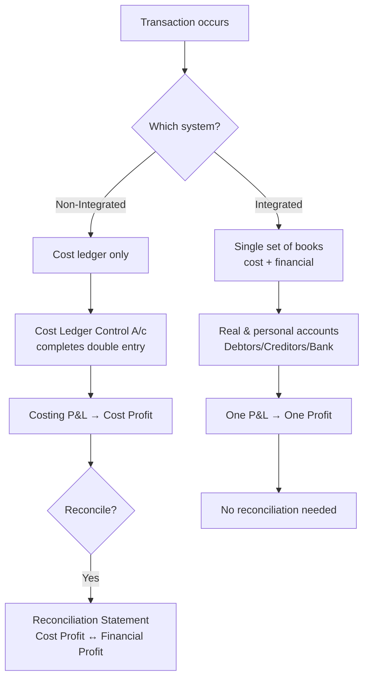

# Q&A — Cost Accounting Systems (Integrated & Non-Integrated) + Reconciliation

> CA Intermediate — Cost & Management Accounting. All amounts in Rupees (₹). ICAI formulas and formats. Every question is followed immediately by a complete model answer.

---

## Section A — Concept-Check (short answer)

**A1. What is a non-integrated (cost ledger) system?**
A self-contained set of cost accounts maintained separately from the financial books. Because there is no double entry link to personal/real accounts, a **Cost Ledger Control Account** (also called General Ledger Adjustment A/c) is opened to complete the double entry and make the cost ledger self-balancing.

**A2. What is an integrated (integral) system?**
A single set of books that records both cost and financial transactions, so **only one profit figure** emerges. No Cost Ledger Control A/c is needed because real and personal accounts (Debtors, Creditors, Bank, Fixed Assets) exist in the same ledger.

**A3. Name the principal control accounts in a non-integrated system.**
Stores Ledger Control, Wages Control, Works/Factory Overhead Control, WIP Control, Finished Goods (Stock) Control, Administration Overhead Control, Selling & Distribution Overhead Control, Cost of Sales, Costing Profit & Loss, and the Cost Ledger Control A/c.

**A4. Why do profits under cost and financial books differ?**
Because some items appear in **only one** set of books, or are **valued/treated differently**: purely financial items (interest, dividend, loss/profit on sale of assets, income tax, donations, goodwill written off), notional charges in cost accounts, over/under absorption of overheads, and different bases of stock valuation and depreciation.

**A5. State the golden reconciliation rule (starting from cost profit).**
Starting from profit as per **cost** accounts: **ADD** incomes recorded only in financial books, over-absorption of overhead, and any expense that cost charged *more* than financial; **DEDUCT** expenses recorded only in financial books, under-absorption of overhead, and any income/closing-stock that cost recorded *more* than financial. The result is profit as per financial accounts. (Reverse every sign if you start from financial profit.)

**A6. If closing stock is valued higher in cost accounts than in financial accounts, what is the effect?**
Higher closing stock ⇒ higher profit. So **cost profit is higher**; to reach financial profit you **deduct** the difference.

**A7. Is reconciliation required under an integrated system?**
No. A single profit is produced, so there is nothing to reconcile. Reconciliation is needed **only** under the non-integrated system.

---

## Section B — Graded Computational Problems (full workings)

### B1 (Easy) — Stores Ledger Control Account

**Question.** From the following, prepare the Stores Ledger Control A/c: Opening balance ₹40,000; Materials purchased ₹1,20,000; Materials returned to suppliers ₹5,000; Direct materials issued to production ₹1,00,000; Indirect materials issued to factory ₹15,000; Materials returned from WIP to stores ₹4,000.

**Answer.**

| Dr. Stores Ledger Control A/c | ₹ | Cr. | ₹ |
|---|---:|---|---:|
| To Balance b/d | 40,000 | By Cost Ledger Control (returns to supplier) | 5,000 |
| To Cost Ledger Control (purchases) | 1,20,000 | By WIP Control (direct materials) | 1,00,000 |
| To WIP Control (returns to stores) | 4,000 | By Works Overhead Control (indirect) | 15,000 |
| | | By Balance c/d | **44,000** |
| | **1,64,000** | | **1,64,000** |

**Working:** Closing = 1,64,000 − (5,000 + 1,00,000 + 15,000) = **₹44,000.**

---

### B2 (Medium) — WIP flow with overhead absorption

**Question.** Continuing B1: Direct wages charged to WIP ₹60,000; Works overhead absorbed @ **150% of direct wages**. Opening WIP ₹25,000; Closing WIP ₹30,000. Actual works overhead incurred = Indirect materials ₹15,000 + Indirect wages ₹20,000 + Other works expenses ₹58,000. Prepare the WIP Control A/c and the Works Overhead Control A/c, and state the under/over absorption.

**Answer.**

Works overhead absorbed = 150% × ₹60,000 = **₹90,000.**

| Dr. WIP Control A/c | ₹ | Cr. | ₹ |
|---|---:|---|---:|
| To Balance b/d | 25,000 | By Finished Goods Control (bal. fig.) | **2,45,000** |
| To Stores Ledger Control | 1,00,000 | By Balance c/d | 30,000 |
| To Wages Control | 60,000 | | |
| To Works Overhead Control | 90,000 | | |
| | **2,75,000** | | **2,75,000** |

Finished goods transferred = 2,75,000 − 30,000 = **₹2,45,000.**

| Dr. Works Overhead Control A/c | ₹ | Cr. | ₹ |
|---|---:|---|---:|
| To Stores Ledger Control (indirect matl.) | 15,000 | By WIP Control (absorbed) | 90,000 |
| To Wages Control (indirect wages) | 20,000 | By Costing P&L (under-absorbed) | **3,000** |
| To Cost Ledger Control (other exp.) | 58,000 | | |
| | **93,000** | | **93,000** |

**Under-absorption** = Actual 93,000 − Absorbed 90,000 = **₹3,000**, charged to Costing P&L A/c.

---

### B3 (Exam-hard) — Reconciliation Statement

**Question.** Profit as per **cost accounts** is ₹1,50,000. On comparison the following are found:
1. Works overhead **under-recovered** in cost ₹8,000.
2. Administration overhead **over-recovered** in cost ₹3,000.
3. Depreciation charged in cost ₹25,000 but in financial books ₹20,000.
4. Interest on investments received (financial only) ₹6,000.
5. Dividend received (financial only) ₹4,000.
6. Loss on sale of machinery (financial only) ₹5,000.
7. Preliminary expenses written off (financial only) ₹3,000.
8. Closing stock in cost accounts ₹52,000; in financial accounts ₹50,000.

Prepare a Reconciliation Statement and find profit as per financial accounts.

**Answer.**

| Reconciliation Statement | (+) ₹ | (−) ₹ |
|---|---:|---:|
| Profit as per Cost Accounts | **1,50,000** | |
| 1. Works OH under-recovered in cost (fin. bears more) | | 8,000 |
| 2. Admin OH over-recovered in cost (fin. bears less) | 3,000 | |
| 3. Depreciation overcharged in cost (25,000 vs 20,000) | 5,000 | |
| 4. Interest on investments (financial only) | 6,000 | |
| 5. Dividend received (financial only) | 4,000 | |
| 6. Loss on sale of machinery (financial only) | | 5,000 |
| 7. Preliminary expenses written off (financial only) | | 3,000 |
| 8. Closing stock overvalued in cost (52,000 vs 50,000) | | 2,000 |
| **Sub-totals** | **1,68,000** | **18,000** |
| **Profit as per Financial Accounts** | | **1,50,000** |

**Check:** 1,68,000 − 18,000 = **₹1,50,000** = profit as per financial accounts. ✔ (Reconciled.)

**Reasoning trail:** items charged *more* in cost (over-recovered admin OH, excess depreciation) mean financial profit is *higher* ⇒ add. Under-recovery and purely financial expenses reduce financial profit relative to cost ⇒ deduct. Financial-only incomes add. Overvalued cost closing stock inflated cost profit ⇒ deduct to reach financial.

---

## Section C — Past-Paper-Style Full Questions

### C1. Journalise transactions in an Integrated system

**Question.** In an integrated accounting system, pass journal entries for: (a) materials purchased on credit ₹80,000; (b) direct materials issued to production ₹50,000; (c) direct wages paid by cash ₹30,000; (d) works overhead absorbed ₹18,000; (e) finished goods transferred from WIP ₹95,000; (f) goods sold on credit at cost ₹90,000.

**Answer.**

| # | Journal Entry | Dr. ₹ | Cr. ₹ |
|---|---|---:|---:|
| a | Stores Ledger Control A/c … Dr. / To Sundry Creditors | 80,000 | 80,000 |
| b | WIP Control A/c … Dr. / To Stores Ledger Control | 50,000 | 50,000 |
| c | Wages Control A/c … Dr. / To Cash | 30,000 | 30,000 |
| c* | WIP Control A/c … Dr. / To Wages Control | 30,000 | 30,000 |
| d | WIP Control A/c … Dr. / To Works Overhead Control | 18,000 | 18,000 |
| e | Finished Goods Control A/c … Dr. / To WIP Control | 95,000 | 95,000 |
| f | Cost of Sales A/c … Dr. / To Finished Goods Control | 90,000 | 90,000 |

**Key point:** In the integrated system there is **no Cost Ledger Control A/c** — real accounts (Creditors, Cash) complete the double entry. In a *non-integrated* system, entries (a) and (c) would instead be credited to **Cost Ledger Control A/c**.

---

### C2. Trial balance of a Cost Ledger

**Question.** State which side of the Cost Ledger Control A/c the following balances appear when preparing the trial balance of the cost ledger, and why: Stores Ledger Control ₹44,000; WIP Control ₹30,000; Finished Goods Control ₹60,000.

**Answer.** All three are **asset (debit) balances**. The Cost Ledger Control A/c is the mirror of every other account, so it carries the **credit total** equal to the sum of all debit balances = 44,000 + 30,000 + 60,000 = **₹1,34,000 (credit)**. This confirms the cost ledger is self-balancing: total debits = total credits, proving the arithmetical accuracy of the cost books independent of financial accounts.

---

### C3. Memorandum Reconciliation Account

**Question.** Re-present the reconciliation of B3 in the form of a **Memorandum Reconciliation Account**.

**Answer.**

| Dr. Memorandum Reconciliation A/c | ₹ | Cr. | ₹ |
|---|---:|---|---:|
| To Works OH under-recovered | 8,000 | By Profit as per Cost Accounts | 1,50,000 |
| To Loss on sale of machinery | 5,000 | By Admin OH over-recovered | 3,000 |
| To Preliminary expenses written off | 3,000 | By Depreciation overcharged in cost | 5,000 |
| To Closing stock overvalued in cost | 2,000 | By Interest on investments | 6,000 |
| To Profit as per Financial Accounts | **1,50,000** | By Dividend received | 4,000 |
| | **1,68,000** | | **1,68,000** |

Debits = items reducing financial profit; credits = starting profit plus items increasing it. Both sides agree at ₹1,68,000, confirming financial profit **₹1,50,000**.

---

## Diagram — The two systems at a glance

---

## Section D — MCQs & Case Scenarios

**D1.** In a non-integrated system, wages paid are credited to:
(a) Cash A/c (b) Cost Ledger Control A/c (c) WIP Control (d) Costing P&L.
**Answer: (b).** The cost ledger has no cash account, so the Cost Ledger Control A/c completes the entry.

**D2.** Which item appears in financial books but never in cost accounts?
(a) Direct wages (b) Factory rent (c) Dividend received (d) Depreciation.
**Answer: (c).** Dividend is a pure financial (non-operating) income, excluded from cost.

**D3.** Over-absorption of overhead means:
(a) actual > absorbed (b) absorbed > actual (c) actual = absorbed (d) no overhead.
**Answer: (b).** Absorbed exceeds actual; it *increases* cost profit relative to financial, so deduct when reconciling from cost.

**D4.** The account that makes the cost ledger self-balancing is:
(a) Cost of Sales (b) Costing P&L (c) Cost Ledger Control A/c (d) Finished Goods Control.
**Answer: (c).** Also called General Ledger Adjustment A/c.

**D5. Case.** Cost profit ₹2,00,000. Notional rent of ₹12,000 (owner's premises) was charged in cost accounts only; income tax ₹18,000 appears in financial books only. Financial profit = ?
**Answer: ₹1,94,000.** Notional rent charged in cost but not financial ⇒ add back 12,000 (2,12,000); income tax financial-only expense ⇒ deduct 18,000 ⇒ **₹1,94,000.** Reason: cost overstated an expense, financial has an extra real expense.

**D6.** Under an integrated system the number of profit figures determined is:
(a) two, reconciled (b) two, unreconciled (c) one (d) none.
**Answer: (c).** A single ledger yields one profit; no reconciliation arises.

**D7. Case.** Closing stock valued at ₹70,000 (cost) and ₹74,000 (financial, at NRV). Starting from cost profit, the adjustment is:
(a) add 4,000 (b) deduct 4,000 (c) ignore (d) add 74,000.
**Answer: (a) add 4,000.** Financial closing stock higher ⇒ financial profit higher ⇒ add.

---

## Quick-Revision Sheet

- **Non-integrated:** separate cost books; **Cost Ledger Control A/c** balances them; produces cost profit needing **reconciliation**.
- **Integrated:** one set of books; real/personal accounts present; **one profit, no reconciliation**.
- **Control accounts:** Stores → WIP → Finished Goods → Cost of Sales → Costing P&L; Wages & Overhead Control feed WIP.
- **Reconciliation (from cost profit):** **ADD** financial-only incomes, over-absorption, cost-overcharged expenses, higher financial closing stock. **DEDUCT** financial-only expenses, under-absorption, cost-undercharged expenses, higher cost closing stock.
- **Purely financial items (never in cost):** interest/dividend received, profit/loss on asset sale, income tax, donations, goodwill/preliminary written off, fines.
- **Notional items (only in cost):** notional rent, notional interest on capital — add back to reach financial profit.
- **Self-check:** if statement doesn't reconcile, re-examine the *direction* (sign) of each item — most errors are sign errors, not omissions.
