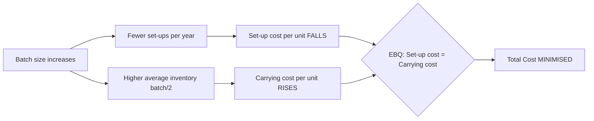

# Q&A — Unit & Batch Costing

> CA Intermediate • Cost & Management Accounting • ICAI-aligned • all figures in Rupees (₹)

---

## Section A — Concept Check (with answers)

**A1. What is Unit (Output/Single) Costing and where is it applied?**
**Ans.** Unit costing is a method of costing used where production is continuous, output is a single uniform product, and cost is ascertained **per unit of output**. Cost per unit = Total Cost ÷ Number of units produced. Applied in mines, quarries, breweries, cement works, steel, paper, brick-making — industries with one homogeneous product.

**A2. What is Batch Costing? How does it differ from Job Costing?**
**Ans.** Batch costing is a form of **specific order costing** where a group of identical articles maintaining continuity of production (a *batch*) is treated as one cost unit. Cost per unit = Total Batch Cost ÷ Number of units in batch. It differs from job costing in that the cost unit is a **batch** (many identical units) rather than a **single job**. Batch costing is essentially job costing applied to a batch. Used in pharmaceuticals, biscuits, garments, spare parts, toys, footwear.

**A3. Define Economic Batch Quantity (EBQ) and state the trade-off it balances.**
**Ans.** EBQ is the batch size that **minimises the total of set-up cost and carrying cost** per annum. As batch size rises, number of set-ups (and set-up cost) falls but average inventory (and carrying cost) rises. EBQ is where these two opposing costs are balanced (set-up cost = carrying cost at optimum).

**A4. State the EBQ formula and define each symbol.**
**Ans.**
$$EBQ = \sqrt{\dfrac{2DS}{C}}$$
where **D** = annual demand/requirement (units), **S** = set-up cost per batch (₹), **C** = carrying (holding) cost per unit per annum (₹).

**A5. In unit costing, how are "cost of production" and "cost of sales" distinguished?**
**Ans.** Cost of Production = Prime cost + Factory overhead + Admin overhead (related to production) + adjustment for opening/closing WIP and finished goods. **Cost of Sales = Cost of Production of goods sold + Selling & Distribution overhead**. Sales − Cost of Sales = Profit.

**A6. Why is the Cake vs Cupcake-Tray analogy used?**
**Ans.** A single large cake = **unit costing**: one continuous flow, cost spread over identical slices. A cupcake tray baked in trays of 12 = **batch costing**: you bake a set-up (tray) at a time, cost is collected per tray then divided by cupcakes. The tray = the batch; the oven pre-heat = the set-up cost.

**A7. Why does set-up cost per unit fall while carrying cost per unit rises as batch size grows? (First-principles)**
**Ans.** Set-up cost is a **fixed cost per batch**, so spreading it over more units lowers per-unit set-up cost. Carrying cost depends on **average inventory (≈ batch/2)**, which grows with batch size, raising carrying cost per unit. Total cost is minimised at EBQ where marginal savings on set-up equal marginal rise in carrying.

---

## Section B — Graded Computational Problems (full workings)

### B1 (Easy) — Basic Unit Cost
A cement plant produced **50,000 tonnes**. Costs: Materials ₹40,00,000; Wages ₹20,00,000; Works overhead ₹10,00,000; Admin overhead ₹5,00,000. Find cost per tonne under each element.

**Solution.**
| Element | Total (₹) | Per tonne (₹) |
|---|---|---|
| Materials | 40,00,000 | 80.00 |
| Wages | 20,00,000 | 40.00 |
| **Prime Cost** | **60,00,000** | **120.00** |
| Works overhead | 10,00,000 | 20.00 |
| **Works Cost** | **70,00,000** | **140.00** |
| Admin overhead | 5,00,000 | 10.00 |
| **Cost of Production** | **75,00,000** | **150.00** |

Per-tonne = Total ÷ 50,000. **Cost of production = ₹150 per tonne.**

---

### B2 (Easy–Moderate) — Basic Batch Cost
A batch of **1,000 pens** incurred: Direct material ₹6,000; Direct labour ₹4,000; Set-up cost ₹2,000; Overhead absorbed @ 150% of direct labour. Find cost per pen.

**Solution.**
- Overhead = 150% × ₹4,000 = ₹6,000
- Total batch cost = 6,000 + 4,000 + 2,000 + 6,000 = **₹18,000**
- Cost per pen = 18,000 ÷ 1,000 = **₹18.00**

---

### B3 (Moderate) — EBQ + Number of Set-ups
Annual demand **D = 40,000** units; Set-up cost **S = ₹250** per batch; Carrying cost **C = ₹2** per unit p.a. Find EBQ, number of set-ups, and total relevant cost. Verify set-up cost = carrying cost.

**Solution.**
$$EBQ = \sqrt{\frac{2 \times 40{,}000 \times 250}{2}} = \sqrt{\frac{2{,}00{,}00{,}000}{2}} = \sqrt{1{,}00{,}00{,}000} = \textbf{3{,}162 units (approx)}$$

Using EBQ ≈ 3,162:
- No. of set-ups = 40,000 ÷ 3,162 = **12.65 ≈ 13**
- Set-up cost = 12.65 × 250 = **₹3,162**
- Carrying cost = (3,162 ÷ 2) × 2 = **₹3,162**
- **Total relevant cost = ₹6,324** (set-up = carrying ✔, confirming optimum)

---

### B4 (Moderate) — Comprehensive Unit Cost Statement with WIP & Stock
Output **10,000 units**. Data (₹): Raw material consumed 3,00,000; Direct wages 2,00,000; Works overhead 1,00,000; Admin overhead 60,000; Selling & distribution overhead 40,000. Opening finished stock **500 units** valued at ₹28,000; Closing finished stock **1,000 units** (valued at current cost of production). Units sold accordingly. Selling price ₹75 per unit. Prepare a cost sheet and find profit.

**Solution — Cost Sheet.**
| Particulars | ₹ |
|---|---|
| Raw material consumed | 3,00,000 |
| Direct wages | 2,00,000 |
| **Prime Cost** | **5,00,000** |
| Works overhead | 1,00,000 |
| **Works/Factory Cost** | **6,00,000** |
| Admin overhead | 60,000 |
| **Cost of Production (10,000 units)** | **6,60,000** |

Cost of production per unit = 6,60,000 ÷ 10,000 = **₹66**.

**Stock reconciliation (units):** Opening 500 + Produced 10,000 − Closing 1,000 = **Units sold 9,500**.

| Particulars | ₹ |
|---|---|
| Cost of Production (10,000 units) | 6,60,000 |
| Add: Opening finished stock (500 units) | 28,000 |
| Less: Closing finished stock (1,000 × ₹66) | (66,000) |
| **Cost of Goods Sold (9,500 units)** | **6,22,000** |
| Add: Selling & distribution overhead | 40,000 |
| **Cost of Sales** | **6,62,000** |
| Sales (9,500 × ₹75) | 7,12,500 |
| **Profit** | **50,500** |

*Self-check:* Sales 7,12,500 − Cost of Sales 6,62,000 = **₹50,500** ✔.

---

### B5 (Exam-hard) — EBQ with cost comparison at different batch sizes
A company uses component X: Annual demand **90,000 units**; Set-up cost **₹1,350** per batch; Cost of manufacture ₹5 per unit; Carrying cost **20% of unit cost per annum**.
(i) Compute EBQ. (ii) Show total cost (set-up + carrying) at batch sizes 6,000 and at EBQ, proving EBQ is cheaper.

**Solution.**
Carrying cost C = 20% × ₹5 = **₹1 per unit p.a.**
$$EBQ = \sqrt{\frac{2 \times 90{,}000 \times 1{,}350}{1}} = \sqrt{24{,}30{,}00{,}000} = \textbf{15{,}588 units (approx)}$$

**At EBQ = 15,588:**
- Set-ups = 90,000 ÷ 15,588 = 5.774 → Set-up cost = 5.774 × 1,350 = **₹7,794**
- Carrying = (15,588 ÷ 2) × 1 = **₹7,794**
- **Total = ₹15,588**

**At batch = 6,000:**
- Set-ups = 90,000 ÷ 6,000 = 15 → Set-up cost = 15 × 1,350 = **₹20,250**
- Carrying = (6,000 ÷ 2) × 1 = **₹3,000**
- **Total = ₹23,250**

EBQ total ₹15,588 < ₹23,250 at 6,000 → **EBQ minimises total cost** ✔ (set-up = carrying only at EBQ).

---

### B6 (Exam-hard) — Batch costing with selling price / profit per batch
A pharma firm makes tablets in batches of **10,000**. Per batch: Direct material ₹15,000; Direct labour 500 hrs @ ₹40; Set-up cost ₹3,000. Factory overhead ₹30 per labour hour; Selling overhead 10% of factory cost. Selling price ₹6 per tablet. Find cost per tablet and profit per batch.

**Solution.**
- Direct labour = 500 × 40 = ₹20,000
- Factory overhead = 500 × 30 = ₹15,000
- **Factory cost** = Material 15,000 + Labour 20,000 + Set-up 3,000 + FOH 15,000 = **₹53,000**
- Selling overhead = 10% × 53,000 = ₹5,300
- **Total cost of batch** = 53,000 + 5,300 = **₹58,300**
- Cost per tablet = 58,300 ÷ 10,000 = **₹5.83**
- Sales = 10,000 × ₹6 = ₹60,000
- **Profit per batch = 60,000 − 58,300 = ₹1,700** (₹0.17 per tablet) ✔

---

## Section C — Past-Paper-Style Full Questions

### C1. (Unit Costing — full cost sheet with quotation)
*A factory produces a standard product. In a period 2,000 units were made. Costs: Direct materials ₹4,00,000; Direct wages ₹2,50,000; Direct expenses ₹50,000; Factory overhead 60% of direct wages; Admin overhead 20% of works cost. A customer asks for a quotation for 300 units at the same cost structure plus a profit of 25% on selling price. Prepare the cost sheet and quotation.*

**Model Answer — Cost Sheet (2,000 units).**
| Particulars | ₹ | Per unit ₹ |
|---|---|---|
| Direct materials | 4,00,000 | 200 |
| Direct wages | 2,50,000 | 125 |
| Direct expenses | 50,000 | 25 |
| **Prime Cost** | **7,00,000** | **350** |
| Factory OH (60% of wages) | 1,50,000 | 75 |
| **Works Cost** | **8,50,000** | **425** |
| Admin OH (20% of works cost) | 1,70,000 | 85 |
| **Cost of Production** | **10,20,000** | **510** |

**Quotation for 300 units:**
- Cost of production = 300 × ₹510 = **₹1,53,000**
- Profit = 25% on selling price = 1/3 of cost = 1,53,000 × 25/75 = **₹51,000**
- **Quoted price (300 units) = ₹2,04,000** → **₹680 per unit**

*Check:* Profit ₹51,000 ÷ Sales ₹2,04,000 = 25% ✔.

---

### C2. (Batch Costing / EBQ — full)
*Monthly demand for a part is 2,000 units (annual 24,000). Setting up the machine for a batch costs ₹324. Annual carrying cost is ₹1 per unit. (i) Determine EBQ. (ii) If the supplier offers a 2% discount on material cost of ₹10/unit for a minimum batch of 4,000, evaluate whether to accept, considering only set-up + carrying + discount saving.*

**Model Answer.**
$$EBQ = \sqrt{\frac{2 \times 24{,}000 \times 324}{1}} = \sqrt{1{,}55{,}52{,}000} = \textbf{3{,}944 units (approx)}$$

**Cost at EBQ 3,944:**
- Set-ups = 24,000 ÷ 3,944 = 6.085 → ₹6.085 × 324 = ₹1,972
- Carrying = 3,944/2 × 1 = ₹1,972 → **Total = ₹3,944**

**Cost at batch 4,000 (to earn discount):**
- Set-ups = 24,000 ÷ 4,000 = 6 → 6 × 324 = ₹1,944
- Carrying = 4,000/2 × 1 = ₹2,000 → Sub-total = ₹3,944
- Extra set-up+carrying vs EBQ ≈ **nil (₹3,944 vs ₹3,944)**

**Discount saving** = 2% × ₹10 × 24,000 = **₹4,800 p.a.**

**Conclusion:** Batch of 4,000 keeps set-up+carrying virtually unchanged (₹3,944) while gaining a discount of ₹4,800. **Accept the 4,000-unit batch.**

---

### C3. (Unit Costing — cost per unit with by-product/scrap adjustment)
*A brick kiln fired 5,00,000 bricks. Costs: Clay ₹1,50,000; Labour ₹1,00,000; Fuel ₹75,000; Other works OH ₹25,000. Broken bricks (scrap) realised ₹10,000, credited to works cost. Find works cost per 1,000 bricks.*

**Model Answer.**
| Particulars | ₹ |
|---|---|
| Clay | 1,50,000 |
| Labour | 1,00,000 |
| Fuel | 75,000 |
| Other works OH | 25,000 |
| **Gross Works Cost** | **3,50,000** |
| Less: Scrap realised | (10,000) |
| **Net Works Cost** | **3,40,000** |

Cost per 1,000 bricks = 3,40,000 ÷ (5,00,000/1,000) = 3,40,000 ÷ 500 = **₹680 per 1,000 bricks** (₹0.68 each).

---

## Section D — MCQs & Case Scenarios

**D1.** Batch costing is a variant of:
A) Process costing B) Job costing C) Operating costing D) Unit costing
**Ans: B** — a batch is a group of identical jobs, so batch costing extends job (specific-order) costing.

**D2.** At Economic Batch Quantity:
A) Set-up cost is minimum B) Carrying cost is minimum C) Set-up cost = Carrying cost D) Total cost is maximum
**Ans: C** — EBQ is where set-up cost equals carrying cost, giving minimum total.

**D3.** If annual demand doubles (others constant), EBQ becomes:
A) Doubles B) Halves C) Rises by √2 (≈1.414×) D) Unchanged
**Ans: C** — EBQ ∝ √D, so doubling D multiplies EBQ by √2.

**D4.** Unit costing is most suitable for:
A) A garment factory making varied designs B) A ship-building yard C) A cement factory D) An advertising agency
**Ans: C** — cement is a single homogeneous continuous product.

**D5.** In EBQ, carrying cost is computed on:
A) Full batch size B) Average inventory (batch ÷ 2) C) Annual demand D) Number of set-ups
**Ans: B** — average stock over the batch cycle is batch/2.

**D6 (Case).** A toy maker has D = 1,00,000; S = ₹800; C = ₹4/unit p.a. The production manager wants batches of 5,000 "for convenience." As cost accountant, advise.
- EBQ = √(2×1,00,000×800 ÷ 4) = √(4,00,00,000) = **6,325 units**.
- Total cost at EBQ = set-up (1,00,000/6,325 × 800 = ₹12,649) + carrying (6,325/2 × 4 = ₹12,649) = **₹25,298**.
- Total cost at 5,000 = set-up (20 × 800 = ₹16,000) + carrying (5,000/2 × 4 = ₹10,000) = **₹26,000**.
**Advice:** EBQ 6,325 saves ₹702 p.a. over the 5,000 batch; recommend batches of ~6,325. ✔

**D7.** Which cost is *added after* cost of production to reach cost of sales?
A) Factory overhead B) Direct expenses C) Selling & distribution overhead D) Set-up cost
**Ans: C** — S&D overhead converts cost of production (of goods sold) into cost of sales.

---

## EBQ Trade-off — Mermaid Diagram

---

## Quick Formula Recap
- **Unit cost** = Total Cost ÷ Units produced
- **Cost of Production** = Prime Cost + Factory OH + Admin OH (± WIP)
- **Cost of Sales** = Cost of Goods Sold + S&D OH
- **Batch cost per unit** = Total Batch Cost ÷ Units in batch
- **EBQ** = √(2DS ÷ C); **No. of set-ups** = D ÷ EBQ; at optimum **Set-up cost = Carrying cost**

### Traps & Examiner Tricks
1. **Carrying cost on batch/2, not full batch** — average inventory only.
2. **C may be given as % of unit cost** — convert to ₹ per unit first (e.g. 20% of ₹5 = ₹1).
3. **Annualise demand** — if monthly demand given, multiply by 12 before EBQ.
4. **Closing stock valued at current cost of production**, not selling price.
5. **Set-up cost belongs to factory cost** in a batch cost sheet, not selling overhead.
6. **Profit "on selling price" vs "on cost"** — 25% on price = 1/3 of cost.
