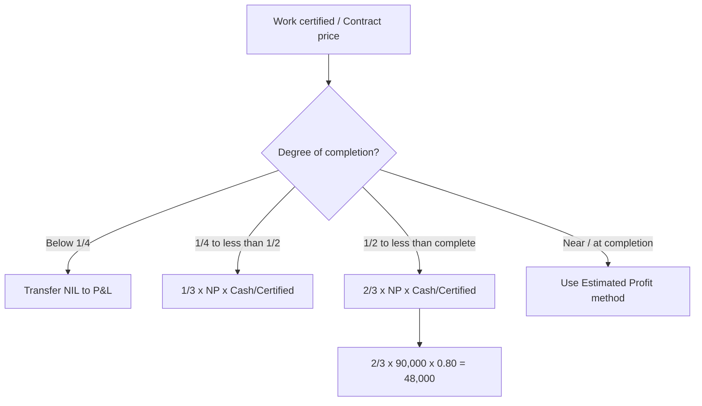

# Q&A — Job & Contract Costing

*CA Intermediate — Cost & Management Accounting. All amounts in Rupees (₹). ICAI formulae and prudence conventions.*

---

## SECTION A — Concept-Check (Quick Q&A)

**A1. Why does simple averaging (total cost ÷ units) fail for a job shop?**
Because output is *heterogeneous*. A printing press making a wedding card and a textbook in the same period has jobs consuming wildly different materials, labour and time. One average cost per unit would over-cost the cheap job and under-cost the dear one, distorting quotations and profit. So each job is a **separate cost unit** with its own cost sheet.

**A2. State the core idea of job costing in one line.**
"A **wallet per order.**" Every job carries its own tab (a job cost sheet), directly charged with its materials and labour, and *absorbed* with a fair share of overhead — exactly like a restaurant bill charging only what your table ordered plus a service charge.

**A3. Job costing vs. Contract costing — the essential difference?**
Same DNA (both cost a specific identifiable job). Contract costing is job costing **scaled up and stretched over time**: work is large, site-based, and spans accounting periods, forcing us to answer "how much profit may I book *before* the job is finished?" — the notional/estimated profit question.

**A4. What is Batch Costing and where does it sit?**
A hybrid: a *batch* of identical units is the cost unit (e.g., 1,000 tablets, 500 bolts). Total batch cost ÷ batch quantity = cost per unit. Used in pharma, bakery, components. It introduces the **Economic Batch Quantity (EBQ)**.

**A5. Give the EBQ formula and its two opposing cost forces.**
EBQ = √(2 × D × S ÷ C), where D = annual demand, S = set-up cost per batch, C = carrying cost per unit p.a. Large batches → low set-up cost but high carrying cost; small batches → the reverse. EBQ minimises the total.

**A6. Define Work Certified and Work Uncertified.**
**Work Certified** = value of work approved by the architect/surveyor (at *contract price*), the basis for the running bill. **Work Uncertified** = work physically done but not yet certified, carried at *cost*.

**A7. What is Retention Money and why is it withheld?**
The customer withholds a % (say 20%) of certified value as security against defects. Cash received = Work certified − Retention. It protects the customer; the contractor recovers it on satisfactory completion.

**A8. Notional Profit vs. Estimated Profit — one line each.**
**Notional Profit** = profit on work *done so far* = (Work certified + Work uncertified) − Cost of work to date. **Estimated Profit** = expected profit on the *whole* contract = Contract price − Total estimated cost.

**A9. Why is only a *portion* of profit transferred to P&L? Name the principle.**
**Prudence (conservatism).** Work not yet certified may develop defects; costs may escalate. Booking full profit early risks reversing it later, so we hold back a reserve.

---

## SECTION B — Graded Computational Problems

### B1 (Easy) — Job Cost Sheet & Quotation

**Q.** Job No. 21 used: Direct materials ₹40,000; Direct wages ₹25,000 (Factory dept) + ₹5,000 (Finishing dept). Factory OH is absorbed at 60% of factory wages; Finishing OH at 40% of finishing wages. Administration, selling & distribution OH = 25% of works cost. The firm quotes to earn a **profit of 20% on selling price.** Compute the quotation price.

**Answer — Job Cost Sheet:**

| Element | Working | ₹ |
|---|---|---:|
| Direct materials | | 40,000 |
| Direct wages (25,000 + 5,000) | | 30,000 |
| **Prime cost** | | **70,000** |
| Factory OH | 60% × 25,000 | 15,000 |
| Finishing OH | 40% × 5,000 | 2,000 |
| **Works (Factory) cost** | | **87,000** |
| Admin, S&D OH | 25% × 87,000 | 21,750 |
| **Total cost** | | **1,08,750** |
| Profit | (see below) | 27,187.50 |
| **Quotation (Selling price)** | | **1,35,937.50** |

*Profit = 20% on SP = 25% on cost.* Profit = 1,08,750 × 25/75 = ₹27,187.50.
Check: 27,187.50 ÷ 1,35,937.50 = 20% ✔.

---

### B2 (Moderate) — Batch Costing + EBQ

**Q.** A component has annual demand D = 48,000 units. Set-up cost per batch S = ₹360. Carrying cost C = ₹1.20 per unit per annum. (a) Find EBQ. (b) Number of batches p.a. (c) Total relevant (set-up + carrying) cost at EBQ.

**Answer:**

(a) EBQ = √(2 × 48,000 × 360 ÷ 1.20) = √(3,45,60,000 ÷ 1.20) = √2,88,00,000 = **5,366 units** (≈ 5,367).

Let me verify precisely: 2 × 48,000 × 360 = 3,45,60,000. ÷1.20 = 2,88,00,000. √ = 5,366.56 ≈ **5,367 units.**

(b) Batches p.a. = 48,000 ÷ 5,367 = **8.94 ≈ 9 batches.**

(c) At EBQ, set-up cost = carrying cost (property of EOQ):
- Set-up cost = (48,000 ÷ 5,367) × 360 = 8.94 × 360 = ₹3,220
- Carrying cost = (5,367 ÷ 2) × 1.20 = 2,683.5 × 1.20 = ₹3,220
- **Total relevant cost = ₹6,440** (≈ √(2 × D × S × C) = √(2×48,000×360×1.20) = √4,14,72,000 = ₹6,440 ✔).

---

### B3 (Hard) — Contract Account with Notional Profit & Prudence Ladder

**Q.** A contract for ₹15,00,000 began 1 April. As on 31 March, the following (₹):

Materials issued 3,20,000; Wages paid 4,10,000; Wages outstanding 20,000; Plant purchased 1,50,000; Direct expenses 60,000; Establishment (indirect) 40,000. Materials at site (closing) 30,000. Plant depreciated to a closing value of 1,20,000. **Work certified ₹9,00,000; work uncertified ₹40,000.** Cash received = 80% of work certified (20% retention). Prepare the Contract Account, compute notional profit, and the profit to transfer to P&L using the standard prudence rule (certification is between ¼ and ½ of contract price... *check the ratio and apply the correct rung*).

**Answer:**

**Step 1 — Degree of completion:** Work certified ÷ Contract price = 9,00,000 ÷ 15,00,000 = **60%**. This is between ½ and completion → use the **2/3 × Notional profit × (Cash received ÷ Work certified)** rung.

**Contract Account for the year:**

| Dr | ₹ | Cr | ₹ |
|---|---:|---|---:|
| To Materials issued | 3,20,000 | By Materials at site c/d | 30,000 |
| To Wages paid | 4,10,000 | By Plant at site c/d | 1,20,000 |
| To Wages outstanding c/d | 20,000 | By Work-in-progress c/d: | |
| To Plant purchased | 1,50,000 |  — Work certified | 9,00,000 |
| To Direct expenses | 60,000 |  — Work uncertified | 40,000 |
| To Establishment | 40,000 | | |
| To **Notional profit c/d** | **90,000** | | |
| **Total** | **10,90,000** | **Total** | **10,90,000** |

*Cost of work to date* = 10,90,000 − 30,000 − 1,20,000 = 9,40,000.
*Notional profit* = (9,00,000 + 40,000) − 9,40,000 = **₹90,000.** ✔ (balancing figure above)

**Step 2 — Profit to P&L (prudence rung, >½ complete):**
Profit to P&L = (2/3) × Notional profit × (Cash received ÷ Work certified)
= (2/3) × 90,000 × (7,20,000 ÷ 9,00,000)
= (2/3) × 90,000 × 0.80 = 60,000 × 0.80 = **₹48,000.**

Reserve (kept back) = 90,000 − 48,000 = **₹42,000.**

**Profit & Loss transfer diagram (prudence ladder):**

---

### B4 (Exam-Hard) — Estimated Profit + Escalation Clause

**Q.** A contract price is ₹40,00,000, expected to be 90% certified by year-end (near completion, so use the **estimated-profit** method). Costs to date ₹27,00,000; estimated additional cost to complete ₹5,00,000. Work certified ₹36,00,000; cash received 85% of certified. 

An **escalation clause** allows recovery of cost increases: material prices rose 10% on a standard material spend of ₹6,00,000, and labour rates rose 8% on standard labour of ₹5,00,000; the clause reimburses **75% of the escalation.** Compute (a) the escalation claim to be added to the contract, (b) revised total estimated profit, and (c) profit to transfer to P&L.

**Answer:**

**(a) Escalation claim:**
- Material escalation = 10% × 6,00,000 = ₹60,000
- Labour escalation = 8% × 5,00,000 = ₹40,000
- Total escalation = ₹1,00,000; recoverable at 75% = **₹75,000** added to contract revenue.

*(Note: the escalated cost itself, ₹1,00,000, is already sitting inside "costs" — the clause only lets us bill the customer for 75% of it.)*

**(b) Revised estimated total profit:**
- Revised contract price = 40,00,000 + 75,000 = ₹40,75,000
- Total estimated cost = 27,00,000 (to date) + 5,00,000 (to complete) = ₹32,00,000
- **Estimated total profit = 40,75,000 − 32,00,000 = ₹8,75,000.**

**(c) Profit to P&L (estimated-profit, near-completion formula):**
Standard ICAI formula (work-certified basis, refined by cash):

Profit to P&L = Estimated profit × (Work certified ÷ Contract price) × (Cash received ÷ Work certified)
= 8,75,000 × (36,00,000 ÷ 40,75,000) × (30,60,000 ÷ 36,00,000)

Simplify: (36,00,000/40,75,000) × (30,60,000/36,00,000) = 30,60,000 ÷ 40,75,000 = 0.75092.
= 8,75,000 × 0.75092 = **₹6,57,055** (≈ ₹6,57,000).

*Cash received = 85% × 36,00,000 = ₹30,60,000.* ✔
Alternative accepted ICAI formula, Estimated profit × Cost to date ÷ Total cost = 8,75,000 × 27,00,000/32,00,000 = ₹7,38,281 — state whichever formula the paper specifies; the **cash-adjusted certified basis is the more conservative** and generally preferred.

---

## SECTION C — Past-Paper-Style Full Questions

**C1.** *"Explain, with the standard rules, how much profit a contractor should transfer to the Profit & Loss Account depending on the stage of completion of a contract. Why is the balance kept as reserve?"* (5 marks)

**Model Answer.** Profit on incomplete contracts is recognised on a **prudent, graduated** basis tied to certified completion:

| Stage (Work certified ÷ Contract price) | Profit to P&L |
|---|---|
| Less than 1/4 | Nil (too uncertain) |
| 1/4 to less than 1/2 | 1/3 × Notional Profit × (Cash received ÷ Work certified) |
| 1/2 to less than substantial completion | 2/3 × Notional Profit × (Cash received ÷ Work certified) |
| Near / substantial completion | Estimated Profit × (Work certified ÷ Contract price) × (Cash ÷ Certified), or Estimated Profit × Cost to date ÷ Total cost |

The **cash/certified ratio** further discounts profit for retention money not yet realised. The **balance is retained as reserve** on the *prudence* principle: uncertified work may be defective, future costs may escalate, and unrealised (retained) profit should not inflate distributable income. The reserve is carried in the WIP balance and released as the contract progresses.

**C2.** *Show the Balance Sheet presentation of Work-in-Progress for contract B3 above.* (Notional profit ₹90,000; certified ₹9,00,000; uncertified ₹40,000; cash received ₹7,20,000; profit taken ₹48,000; materials at site ₹30,000.)

**Model Answer — Balance Sheet extract (₹):**

| Assets | Working | ₹ |
|---|---|---:|
| Work-in-progress: | | |
|  Work certified | | 9,00,000 |
|  Work uncertified | | 40,000 |
|  Sub-total | | 9,40,000 |
|  *Less:* Reserve (profit in suspense) | 90,000 − 48,000 | (42,000) |
|  *Less:* Cash received from contractee | | (7,20,000) |
| **Net WIP shown** | | **1,78,000** |
| Materials at site | | 30,000 |

*Equivalently, WIP = Cost of work to date (9,40,000) + Profit taken (48,000) − Cash received (7,20,000) = ₹2,68,000, then materials at site shown separately — presentation may net cash against WIP or show a "Contractee's account" on the liabilities side. Both reconcile.*

---

## SECTION D — MCQs & Case Scenarios

**D1.** Under job costing, the cost unit is:
(a) a process (b) a **specific job/order** (c) a department (d) a time period.
**Answer: (b).** Each identifiable order is separately costed.

**D2.** Notional profit on a contract equals:
(a) Contract price − Total cost (b) **(Work certified + Work uncertified) − Cost of work to date** (c) Cash received − Cost (d) Certified − Retention.
**Answer: (b).** It measures profit on work done so far, not the whole contract.

**D3.** Retention money is:
(a) advance from customer (b) **certified value withheld as defect security** (c) contractor's reserve (d) plant depreciation.
**Answer: (b).** Cash received = Certified − Retention.

**D4.** If work certified is only 20% of contract price, profit transferred to P&L is:
(a) 1/3 of notional (b) 2/3 of notional (c) **Nil** (d) full notional.
**Answer: (c).** Below 1/4 completion → prudence says recognise nothing.

**D5.** EBQ decreases when:
(a) demand rises (b) **carrying cost per unit rises** (c) set-up cost rises (d) both a and c.
**Answer: (b).** C is in the denominator, so higher carrying cost → smaller optimal batch.

**D6 (Case).** A contractor is 40% certified, notional profit ₹1,50,000, cash = 75% of certified. Profit to P&L?
Working: 40% completion → 1/4–1/2 rung → 1/3 × 1,50,000 × 0.75 = **₹37,500.**
**Reasoning:** one-third rung because completion is between 1/4 and 1/2; cash factor scales for retention.

**D7 (Case).** An escalation clause primarily protects the:
(a) customer (b) **contractor** (c) surveyor (d) bank.
**Answer: (b).** It lets the contractor recover cost increases (materials/labour/rates) beyond his control, preserving the margin on long contracts.

---

## First-Principles Recap

1. Heterogeneous output ⇒ average is meaningless ⇒ **cost each job separately** (wallet per order).
2. Direct costs are *traced*; overheads are *absorbed* at a predetermined rate — keeping direct-cost purity for honest quotations.
3. Contracts stretch across periods ⇒ we must book *some* profit early, but **prudence** caps it via the notional/estimated ladder and the cash/certified discount.
4. Retention and uncertified work are the two "unrealised" risks the reserve guards against.

## Quick-Revision Sheet

- **Prime cost** = DM + DL + Direct exp. **Works cost** = Prime + Factory OH. **Total cost** = Works + Admin + S&D.
- Profit *on cost* p% ⇒ profit *on SP* = p/(100+p). Profit on SP q% ⇒ on cost = q/(100−q).
- **EBQ** = √(2DS ÷ C); min total relevant cost = √(2DSC).
- **Notional profit** = (Certified + Uncertified) − Cost to date.
- **Estimated profit** = Contract price − Total estimated cost.
- Prudence ladder: <1/4 → Nil; 1/4–1/2 → ⅓·NP·(Cash/Cert); ½–complete → ⅔·NP·(Cash/Cert); near-complete → Estimated-profit method.
- Cash received = Work certified × (1 − retention %).
- **Escalation claim** = agreed % × (price/rate rise × standard quantity/spend), added to contract revenue.
- BS: WIP = Cost to date + Profit taken − Cash received; show materials/plant at site separately.
