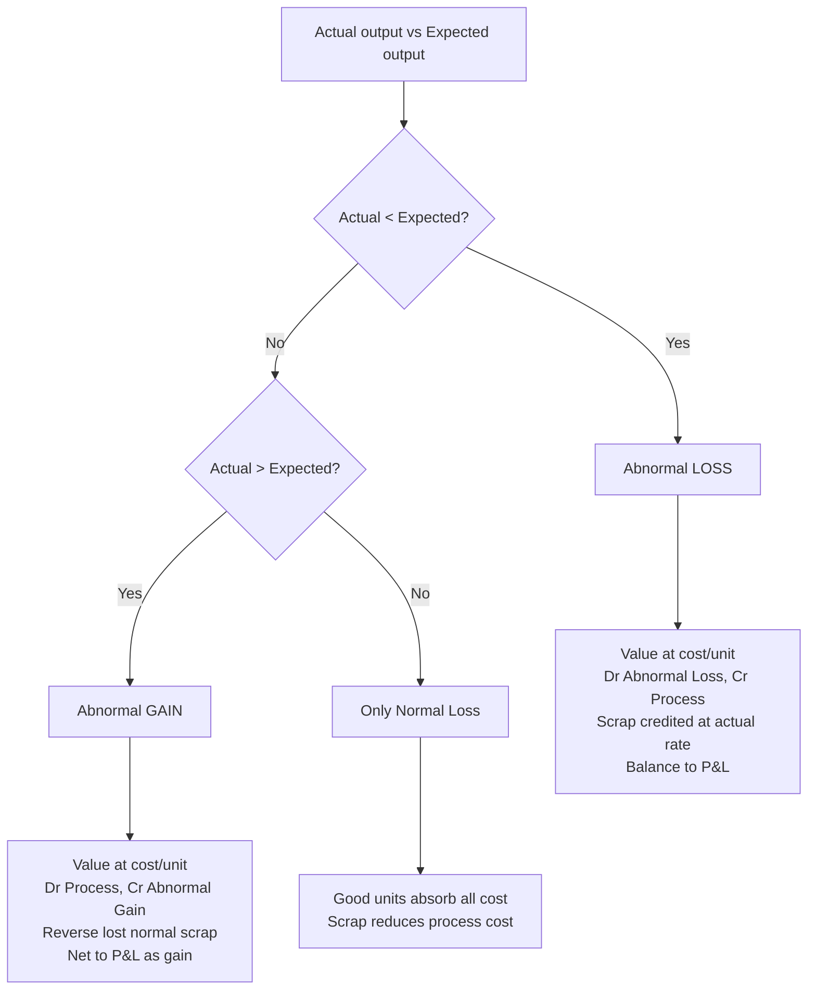

# Q&A — Process & Operation Costing

*CA Intermediate · Cost & Management Accounting · ICAI-aligned · all amounts in Rupees (₹)*

---

## SECTION A — Concept Check (short answers)

**A1. Why is process costing used instead of job costing?**
When output is continuous, homogeneous and produced through a sequence of distinct operations (chemicals, cement, sugar, refining), individual units cannot be identified. Cost is therefore **averaged** over all units of a process for a period: Cost per unit = Total process cost ÷ Output units.

**A2. Name the four sub-problems process costing must solve.**
(1) Where does cost accumulate — the **process account**; (2) how to treat **losses/gains** (normal loss, abnormal loss, abnormal gain); (3) how to cost **part-finished** units — **equivalent units**; (4) how to pick a **cost-flow assumption** — **FIFO vs Weighted Average**; plus inter-process profit for transfer pricing.

**A3. Distinguish normal vs abnormal loss.**
**Normal loss** = unavoidable, expected loss (evaporation, spoilage) allowed as a % of input; it bears **no cost** — its cost is absorbed by good units and its scrap value reduces process cost. **Abnormal loss** = loss above normal; it is **valued at the same cost per good unit** and charged to Costing P&L (not to good output).

**A4. What is abnormal gain and when does it arise?**
When **actual loss < normal loss**, i.e. actual output exceeds expected output. It is valued at the normal cost per unit, debited to the Process A/c and credited to Abnormal Gain A/c. Its scrap-value adjustment **reduces** the Normal Loss recovery (see B4/B-trap).

**A5. Give the cost-per-effective-unit formula (normal loss present).**
Cost per unit = (Total cost of process − Scrap value of normal loss) ÷ (Input units − Normal loss units).

**A6. Equivalent units (EU) — define.**
EU convert partly-finished work into the notionally-complete units they represent: EU = Physical units × % completion, computed **separately** for material, labour and overhead.

**A7. One-line difference: Weighted Average vs FIFO EU.**
**WA** merges opening WIP with current cost and does not separate opening-WIP work done last period. **FIFO** separates: EU = work to complete opening WIP + units started-and-finished + closing WIP. FIFO cost/unit reflects **only current-period** cost.

**A8. What is inter-process profit and its danger?**
Transferring output between processes at cost + profit margin; it reveals process efficiency and comparability with market price. Danger: **unrealised profit** locked in unsold closing stock must be eliminated for the Balance Sheet.

---

## SECTION B — Graded Computational Problems

### B1 (Easy) — Normal loss only

Input to Process A: 1,000 units @ ₹20 = ₹20,000. Additional cost ₹15,000. Normal loss 10% of input, scrap realises ₹5/unit. No abnormal loss/WIP.

**Solution.**
Normal loss = 10% × 1,000 = 100 units → scrap value = 100 × ₹5 = ₹500.
Expected output = 1,000 − 100 = 900 units.
Cost per unit = (20,000 + 15,000 − 500) ÷ 900 = 34,500 ÷ 900 = **₹38.333**.

| Process A A/c | Units | ₹ | | Units | ₹ |
|---|---|---|---|---|---|
| Input | 1,000 | 20,000 | Normal loss | 100 | 500 |
| Add. cost | — | 15,000 | Output (900×38.333) | 900 | 34,500 |
| | **1,000** | **35,000** | | **1,000** | **35,000** |

Reconciles: 900 + 100 = 1,000 units; ₹34,500 + ₹500 = ₹35,000. ✓

---

### B2 (Moderate) — Abnormal loss + account

Same data as B1 but **actual output = 850 units** (so actual loss = 150).

**Solution.**
Normal loss 100 units (scrap ₹500). Cost/unit unchanged = ₹38.333 (normal-loss scrap only affects the divisor of expected output).
Abnormal loss = Expected output 900 − Actual output 850 = **50 units** valued at ₹38.333 = **₹1,917** (rounded).

| Process A A/c | Units | ₹ | | Units | ₹ |
|---|---|---|---|---|---|
| Input | 1,000 | 20,000 | Normal loss | 100 | 500 |
| Add. cost | — | 15,000 | Abnormal loss | 50 | 1,917 |
| | | | Output | 850 | 32,583 |
| | **1,000** | **35,000** | | **1,000** | **35,000** |

**Abnormal Loss A/c:** Dr from Process ₹1,917 (50 u). Cr: scrap sale 50 × ₹5 = ₹250; Costing P&L (balance) = ₹1,667.
Check: 500 + 1,917 + 32,583 = ₹35,000. ✓ Output 850 × 38.333 = ₹32,583. ✓

---

### B3 (Moderate–hard) — Abnormal gain with scrap correction

Input 1,000 units @ ₹20 = ₹20,000; additional cost ₹15,000; normal loss 10%, scrap ₹5/unit. **Actual output = 930 units** (actual loss 70 < normal 100).

**Solution.**
Cost per unit = (35,000 − 500) ÷ 900 = **₹38.333** (divisor = expected output 900).
Abnormal gain = Actual 930 − Expected 900 = **30 units** × ₹38.333 = **₹1,150**.

| Process A A/c | Units | ₹ | | Units | ₹ |
|---|---|---|---|---|---|
| Input | 1,000 | 20,000 | Normal loss | 100 | 500 |
| Add. cost | — | 15,000 | Output | 930 | 35,650 |
| Abnormal gain | 30 | 1,150 | | | |
| | **1,030** | **36,150** | | **1,030** | **36,150** |

**Scrap correction (the trap):** actual scrap sold is only for real loss of 70 units, but Normal Loss A/c was credited for 100 units × ₹5. The 30 gain units' "lost" scrap is reversed:
**Abnormal Gain A/c:** Dr Normal Loss scrap forgone 30 × ₹5 = ₹150; Cr Process ₹1,150 → net **₹1,000 to Costing P&L (profit).**
Check output value 930 × 38.333 = ₹35,650. ✓

---

### B4 (Hard) — Equivalent units: WA vs FIFO

Process data for the month:
Opening WIP 400 units (Material 100%, ₹8,000; Conversion 40%, ₹2,400).
Introduced 2,000 units; Material ₹42,000; Conversion ₹30,600.
Closing WIP 300 units (Material 100%, Conversion 30%). No losses.

Units completed & transferred = 400 + 2,000 − 300 = **2,100 units.**

**(a) Weighted Average**

| Element | Completed | Closing WIP EU | Total EU | Cost (₹) | Cost/EU |
|---|---|---|---|---|---|
| Material | 2,100 | 300×100%=300 | 2,400 | 8,000+42,000=50,000 | 20.833 |
| Conversion | 2,100 | 300×30%=90 | 2,190 | 2,400+30,600=33,000 | 15.068 |

Cost/unit completed = 20.833 + 15.068 = **₹35.901**.
Transferred out = 2,100 × 35.901 = **₹75,393**.
Closing WIP = 300×20.833 + 90×15.068 = 6,250 + 1,356 = **₹7,606**.
Check: 75,393 + 7,606 = ₹82,999 ≈ ₹83,000 total (50,000+33,000). ✓ (₹1 rounding)

**(b) FIFO**

| Element | Complete op. WIP | Started&finished | Closing WIP | Total EU | Current cost | Cost/EU |
|---|---|---|---|---|---|---|
| Material | 400×0%=0 | 1,700 | 300 | 2,000 | 42,000 | 21.000 |
| Conversion | 400×60%=240 | 1,700 | 90 | 2,030 | 30,600 | 15.074 |

Started & finished = 2,100 completed − 400 opening = 1,700.
Cost of the 1,700 fresh units = 1,700 × (21 + 15.074) = 1,700 × 36.074 = **₹61,326**.
Opening WIP completed = brought-forward ₹10,400 + conversion 240×15.074 = ₹3,618 → ₹14,018.
Total transferred = 61,326 + 14,018 = **₹75,344.**
Closing WIP = 300×21 + 90×15.074 = 6,300 + 1,357 = **₹7,657.**
Check: 75,344 + 7,657 = 83,001 ≈ opening 10,400 + current 72,600 = ₹83,000. ✓

**Takeaway:** WA blends the ₹20/unit-ish opening material with dearer current material; FIFO isolates current cost (₹21 material). Different valuations, same total.

---

### B5 (Exam-hard) — Inter-process profit with unrealised profit

Process I transfers output to Process II at cost + 25% on transfer price... simplified: transfer at **cost + 20% mark-up on cost**.
Process I total cost ₹60,000; transferred to II at cost + 20% = ₹72,000 (profit ₹12,000).
Process II own cost added ₹28,000. Of Process II output, **closing stock = 25%** remains unsold (still in II), rest transferred to Finished Stock at cost + 25% on transfer price... to keep clean, take Process II closing stock at transfer-in value.

**Unrealised profit in Process II closing stock:**
Closing stock 25% carries transferred-in element. Transferred-in portion in closing stock = 25% × ₹72,000 = ₹18,000, of which profit element = 25% × ₹12,000 = **₹3,000 unrealised.**
For the Balance Sheet, closing stock is reduced by ₹3,000 (stock reserve), so Process II stock is stated at cost to the firm, not at inter-process profit.

**Provision for Unrealised Profit A/c** carries ₹3,000; the increase is charged to P&L, ensuring profit is recognised **only on units actually sold/transferred out**, never on internally-held stock.

---

## SECTION C — Past-paper-style Full Question

**C1.** A product passes through Process X. Data: Input 12,000 kg @ ₹4 = ₹48,000; Labour ₹18,000; Overhead ₹12,000. Normal loss 5% of input, scrap ₹6/kg. Actual output 11,000 kg. Prepare Process X A/c and Abnormal Loss A/c.

**Model answer.**
Normal loss = 5% × 12,000 = 600 kg; scrap value 600 × ₹6 = ₹3,600.
Expected output = 12,000 − 600 = 11,400 kg.
Total cost = 48,000 + 18,000 + 12,000 = ₹78,000.
Cost/unit = (78,000 − 3,600) ÷ 11,400 = 74,400 ÷ 11,400 = **₹6.5263/kg.**
Abnormal loss = 11,400 − 11,000 = 400 kg × 6.5263 = **₹2,611.**

| Process X A/c | kg | ₹ | | kg | ₹ |
|---|---|---|---|---|---|
| Material | 12,000 | 48,000 | Normal loss | 600 | 3,600 |
| Labour | — | 18,000 | Abnormal loss | 400 | 2,611 |
| Overhead | — | 12,000 | Output | 11,000 | 71,789 |
| | **12,000** | **78,000** | | **12,000** | **78,000** |

**Abnormal Loss A/c:** Dr Process ₹2,611 (400 kg). Cr scrap 400×₹6 = ₹2,400; Costing P&L ₹211.
Check: 3,600 + 2,611 + 71,789 = ₹78,000. ✓ Output 11,000 × 6.5263 = ₹71,789. ✓

---

## Mermaid — Loss/Gain decision flow

---

## SECTION D — MCQs & Case Scenarios

**D1.** Cost per unit divisor when normal loss exists is:
(a) Input units (b) Actual output (c) **Input − Normal loss units** ✓ (d) Input + gain.
*Reason: normal loss units bear no cost, so they leave the denominator.*

**D2.** Abnormal gain is:
(a) Credited to P&L as loss (b) **Valued at normal cost/unit and credited to Abnormal Gain A/c** ✓ (c) Ignored (d) Added to normal loss.
*Reason: gain units are costed like good units.*

**D3.** Under FIFO, equivalent units include:
(a) Opening WIP full units (b) **Only work needed to complete opening WIP + started-finished + closing WIP** ✓ (c) Closing WIP at 100% (d) Normal loss.
*Reason: FIFO isolates current-period effort.*

**D4.** Scrap value of normal loss is credited to:
(a) P&L (b) Abnormal Loss (c) **Normal Loss A/c / reduces process cost** ✓ (d) Finished stock.
*Reason: it lowers the net cost absorbed by good units.*

**D5.** Unrealised inter-process profit is eliminated because:
(a) It is a real cash loss (b) **Stock held internally is not yet sold, profit unearned** ✓ (c) Tax rule (d) Scrap adjustment.
*Reason: prudence — recognise profit only on external realisation.*

**D6 (Case).** Process Y: expected output 4,750 units, actual 4,800. This means:
(a) Abnormal loss 50 (b) **Abnormal gain 50** ✓ (c) Normal loss rose (d) No adjustment.
*Reason: actual > expected → 50-unit abnormal gain, debited to Process A/c.*

**D7 (Operation costing).** Operation costing (service costing) uses a **composite cost unit** such as:
(a) Per batch (b) **Per passenger-km / per tonne-km** ✓ (c) Per job (d) Per contract.
*Reason: services combine two variables (quantity × distance).*

---

## Quick-Revision Sheet

- **Cost/unit (normal loss)** = (Total cost − Normal scrap) ÷ (Input − Normal loss units).
- **Abnormal loss units** = Expected output − Actual output (positive); **Abnormal gain** = Actual − Expected.
- Abnormal loss/gain **valued at normal cost per unit**; net effect to Costing P&L.
- **Abnormal gain scrap trap:** reverse the normal-loss scrap on gain units (Dr Abnormal Gain).
- **Normal loss** = no cost, scrap reduces process cost; never valued at cost/unit.
- **EU** computed element-wise (Material / Labour / OH). WA merges opening; FIFO separates current cost.
- **FIFO transferred-out** = opening WIP carried cost + completion cost + started-&-finished units.
- **Inter-process profit:** eliminate unrealised profit in closing stock via Stock Reserve for the Balance Sheet.
- **Operation/Service costing:** composite units — tonne-km, passenger-km, patient-day, kWh; classify costs into fixed (standing), variable (running), maintenance.
- Always **reconcile units and rupees** on both sides of every Process A/c before finalising.
