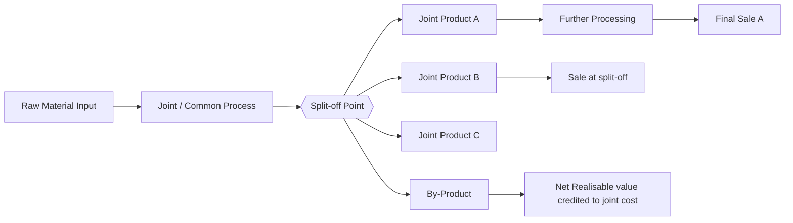

# Q&A — Joint Products & By-Products

*CA Intermediate · Cost & Management Accounting · Exam-Oriented Question Bank*

---

## How to use this bank
Work each computational problem on paper **before** reading the model answer. Every dataset below is internally consistent — your totals must tie back to the joint cost given. Formulas follow ICAI conventions; all figures in Rupees (₹).

---

## SECTION A — Concept Check (short answer)

**A1. Define the split-off point.**
The stage in a common process at which joint products and by-products become separately identifiable. Costs incurred **before** it are *joint (common) costs* needing apportionment; costs after it are *further-processing (separable) costs* traceable to a specific product.

**A2. Distinguish joint products from by-products.**
Joint products are two or more products of **roughly comparable sales value** produced simultaneously and each regarded as a main objective. A by-product has **relatively minor sales value** arising incidentally from the process. Classification is relative and can change with market prices.

**A3. Why can joint costs never be truly "accurately" allocated?**
Because they are incurred **jointly and indivisibly** up to split-off — no cause-and-effect link exists between the common cost and any single product. All apportionment bases are therefore conventions chosen for a purpose (stock valuation), not scientific truth.

**A4. State the four common methods of apportioning joint cost.**
(i) Physical (units/quantity) measure; (ii) Market value at split-off point; (iii) Net Realisable Value (NRV); (iv) Constant (uniform) gross-margin percentage method.

**A5. Why is NRV the most popular method?**
It respects **cost-bearing ability** (higher-value products absorb more cost), works even when products are **not saleable at split-off** (they need further processing before any market price exists), and prevents the distortion where a low-value bulky product wrongly absorbs the bulk of cost.

**A6. Give the NRV formula for a product's share of joint cost.**
NRV of a product = Final sales value − Further processing cost − Selling/distribution cost (of that product). Joint cost share = Joint cost × (Product NRV ÷ Total NRV of all joint products).

**A7. Decision rule for "further process or sell at split-off?"**
Process further **only if** Incremental (further) sales revenue > Incremental (further processing) cost. Joint cost already incurred is **sunk and irrelevant** to this decision.

**A8. Name two by-product accounting methods.**
(i) **Non-cost / other-income** method — by-product income credited to Costing P&L. (ii) **Cost / NRV method** — by-product's net realisable value credited to (deducted from) the joint process cost before apportioning to main products.

**A9. Why is the physical-units method criticised?**
It ignores value: a cheap heavy product absorbs a large cost share and may show a loss while a light valuable product shows huge profit — misleading for performance and pricing.

**A10. Under the constant gross-margin method, what is held equal across products?**
The **gross-profit percentage on sales** is identical for every joint product; joint cost is the balancing figure that forces this uniform margin.

---

## SECTION B — Graded Computational Problems

### B1 (Easy) — Physical Units Method
Joint cost of a process = ₹1,80,000. Output: Product X 6,000 kg, Product Y 3,000 kg, Product Z 1,000 kg. Apportion joint cost on physical units.

**Answer.** Total units = 6,000 + 3,000 + 1,000 = 10,000 kg. Rate = 1,80,000 ÷ 10,000 = **₹18 per kg**.

| Product | Kg | ₹18 × Kg | Joint cost (₹) |
|---|---|---|---|
| X | 6,000 | 18 | 1,08,000 |
| Y | 3,000 | 18 | 54,000 |
| Z | 1,000 | 18 | 18,000 |
| **Total** | **10,000** | | **1,80,000** ✓ |

---

### B2 (Easy–Medium) — Market Value at Split-off
Joint cost = ₹90,000. All three products are saleable at split-off.

| Product | Units | Selling price at split-off (₹/u) |
|---|---|---|
| P | 2,000 | 30 |
| Q | 1,500 | 20 |
| R | 1,000 | 10 |

Apportion by market value at split-off.

**Answer.**

| Product | Units | Price | Market value (₹) | Share ratio | Joint cost (₹) |
|---|---|---|---|---|---|
| P | 2,000 | 30 | 60,000 | 60/100 | 54,000 |
| Q | 1,500 | 20 | 30,000 | 30/100 | 27,000 |
| R | 1,000 | 10 | 10,000 | 10/100 | 9,000 |
| **Total** | | | **1,00,000** | | **90,000** ✓ |

Rate = 90,000 ÷ 1,00,000 = ₹0.90 per ₹1 of market value. (e.g. P: 60,000 × 0.90 = 54,000.)

---

### B3 (Medium) — NRV Method (with further processing)
Joint cost = ₹2,40,000. None saleable at split-off; each needs further processing.

| Product | Final sales value (₹) | Further processing cost (₹) | Selling exp. (₹) |
|---|---|---|---|
| A | 2,00,000 | 40,000 | 10,000 |
| B | 1,50,000 | 30,000 | 5,000 |
| C | 1,00,000 | 20,000 | 5,000 |

Apportion joint cost on NRV.

**Answer.** NRV = Final sales value − Further processing − Selling expenses.

| Product | Sales | − Further | − Selling | NRV (₹) |
|---|---|---|---|---|
| A | 2,00,000 | 40,000 | 10,000 | 1,50,000 |
| B | 1,50,000 | 30,000 | 5,000 | 1,15,000 |
| C | 1,00,000 | 20,000 | 5,000 | 75,000 |
| **Total** | | | | **3,40,000** |

Joint cost share = ₹2,40,000 × (Product NRV ÷ 3,40,000):
- A = 2,40,000 × 1,50,000/3,40,000 = **₹1,05,882**
- B = 2,40,000 × 1,15,000/3,40,000 = **₹81,177**
- C = 2,40,000 × 75,000/3,40,000 = **₹52,941**
- Total = 1,05,882 + 81,177 + 52,941 = **₹2,40,000** ✓ (rounded to nearest ₹).

In an exam, state the rate factor (0.70588) and round the last product as the balancing figure so the shares tie exactly to ₹2,40,000.

---

### B4 (Medium–Hard) — Constant Gross-Margin Percentage Method
Joint cost = ₹3,00,000. Further processing costs: A ₹50,000, B ₹30,000, C ₹20,000. Final sales values: A ₹3,00,000, B ₹1,80,000, C ₹1,20,000. Apportion joint cost so every product earns the same gross-margin %.

**Answer.**
**Step 1 — Overall gross margin %.**
Total sales = 3,00,000 + 1,80,000 + 1,20,000 = ₹6,00,000.
Total cost = Joint 3,00,000 + Further (50,000+30,000+20,000 = 1,00,000) = ₹4,00,000.
Total gross profit = 6,00,000 − 4,00,000 = ₹2,00,000. **GM % = 2,00,000 ÷ 6,00,000 = 33.33%.**

**Step 2 — Apply same GM% to each product's sales, work back to joint cost.**

| Product | Sales | GP @33.33% | Total cost (Sales−GP) | − Further cost | = Joint cost (₹) |
|---|---|---|---|---|---|
| A | 3,00,000 | 1,00,000 | 2,00,000 | 50,000 | 1,50,000 |
| B | 1,80,000 | 60,000 | 1,20,000 | 30,000 | 90,000 |
| C | 1,20,000 | 40,000 | 80,000 | 20,000 | 60,000 |
| **Total** | **6,00,000** | **2,00,000** | **4,00,000** | **1,00,000** | **3,00,000** ✓ |

Every product shows GP margin of 33.33% and joint cost sums exactly to ₹3,00,000.

---

### B5 (Hard) — Sell-or-Process-Further Decision
From B4, Product C can instead be sold **at split-off** for ₹95,000 (no further ₹20,000 cost). Should the firm process C further?

**Answer.** Joint cost apportioned to C (₹60,000) is **sunk / irrelevant**.
- Incremental revenue from further processing = 1,20,000 − 95,000 = **₹25,000**.
- Incremental cost = **₹20,000**.
- Net gain from processing = 25,000 − 20,000 = **₹5,000 > 0**.

**Decision: process C further** — it adds ₹5,000 net. (If the split-off price were, say, ₹1,05,000, incremental revenue ₹15,000 < ₹20,000 cost → sell at split-off.)

---

### B6 (Exam-Hard) — Joint + By-Product + Further Processing (full reconciliation)
A process costs ₹5,00,000 (joint cost). It yields two joint products M and N and one by-product Z.
- By-product Z: 1,000 units, net realisable value ₹20 each. **Credited to joint cost (NRV method).**
- M: 10,000 units, final sales ₹6,00,000, further processing ₹80,000.
- N: 8,000 units, final sales ₹3,00,000, further processing ₹40,000.

Apportion the **net** joint cost between M and N on NRV, then prepare the product-wise profit statement.

**Answer.**
**Step 1 — Net joint cost after by-product credit.**
By-product NRV = 1,000 × ₹20 = ₹20,000.
Net joint cost = 5,00,000 − 20,000 = **₹4,80,000**.

**Step 2 — NRV of M and N.**
- M: 6,00,000 − 80,000 = ₹5,20,000
- N: 3,00,000 − 40,000 = ₹2,60,000
- Total NRV = ₹7,80,000

**Step 3 — Apportion ₹4,80,000 on NRV (ratio 520:260 = 2:1).**
- M = 4,80,000 × 520/780 = **₹3,20,000**
- N = 4,80,000 × 260/780 = **₹1,60,000**
- Total = ₹4,80,000 ✓

**Step 4 — Profit statement.**

| Particulars | M (₹) | N (₹) | Total (₹) |
|---|---|---|---|
| Final sales value | 6,00,000 | 3,00,000 | 9,00,000 |
| Less: Joint cost share | 3,20,000 | 1,60,000 | 4,80,000 |
| Less: Further processing | 80,000 | 40,000 | 1,20,000 |
| **Profit** | **2,00,000** | **1,00,000** | **3,00,000** |

**Reconciliation check:** Total sales 9,00,000 − net joint cost 4,80,000 − further 1,20,000 = ₹3,00,000 = total profit ✓. By-product ₹20,000 already absorbed as a cost reduction, so it is not shown as separate income.

---

## SECTION C — Past-Paper-Style Full Questions

### C1. (Comprehensive — 10 marks)
*"In a manufacturing process, joint cost up to split-off is ₹7,20,000. Three products emerge — Alpha, Beta, Gamma. Alpha and Beta are main products; Gamma is a by-product. Gamma: 2,000 kg sold at ₹15/kg, selling cost ₹2/kg. Alpha: 12,000 kg, sold at ₹50/kg after further processing costing ₹1,20,000. Beta: 8,000 kg, sold at ₹40/kg after further processing costing ₹80,000. Apportion joint cost by NRV (by-product credited at net realisable value) and show product profitability."*

**Model Answer.**
**By-product Gamma net realisable value** = 2,000 × (15 − 2) = 2,000 × 13 = **₹26,000**.
**Net joint cost** = 7,20,000 − 26,000 = **₹6,94,000**.

**NRV of main products:**
- Alpha: (12,000 × 50) − 1,20,000 = 6,00,000 − 1,20,000 = ₹4,80,000
- Beta: (8,000 × 40) − 80,000 = 3,20,000 − 80,000 = ₹2,40,000
- Total NRV = ₹7,20,000 (ratio 480:240 = 2:1)

**Joint cost apportionment:**
- Alpha = 6,94,000 × 480/720 = **₹4,62,667**
- Beta = 6,94,000 × 240/720 = **₹2,31,333**
- Total = ₹6,94,000 ✓

**Profitability:**

| Particulars | Alpha (₹) | Beta (₹) |
|---|---|---|
| Sales | 6,00,000 | 3,20,000 |
| Less: Joint cost | 4,62,667 | 2,31,333 |
| Less: Further processing | 1,20,000 | 80,000 |
| **Profit** | **17,333** | **8,667** |

Total profit = ₹26,000, equal to the by-product credit — confirming internal consistency (main-product NRVs equalled joint cost, so all main-product profit here derives from the by-product credit).

---

### C2. (Method comparison — 6 marks)
*"Joint cost ₹1,00,000 yields product G (1,000 kg, ₹120/kg) and product H (4,000 kg, ₹20/kg), both saleable at split-off with no further cost. Apportion by (a) physical units and (b) market value; comment."*

**Model Answer.**
**(a) Physical units** (5,000 kg, rate ₹20/kg):
- G = 1,000 × 20 = ₹20,000; H = 4,000 × 20 = ₹80,000.
- Profit G = 1,20,000 − 20,000 = **₹1,00,000**; Profit H = 80,000 − 80,000 = **₹0**.

**(b) Market value** — Sales: G = 1,20,000, H = 80,000, total ₹2,00,000 (ratio 3:2):
- G = 1,00,000 × 120/200 = ₹60,000; H = 1,00,000 × 80/200 = ₹40,000.
- Profit G = 1,20,000 − 60,000 = **₹60,000**; Profit H = 80,000 − 40,000 = **₹40,000**.

**Comment:** Physical-units method distorts — the low-value bulky product H bears 80% of cost and shows zero profit while G shows an inflated ₹1,00,000. Market-value method allocates cost per cost-bearing ability, giving both products a **uniform 50% margin** on sales — a fairer and more decision-useful result.

---

### C3. (Theory — 4 marks)
*"Explain why joint cost apportionment is irrelevant for the decision to process a joint product further."*

**Model Answer.** Joint cost is incurred **up to split-off regardless** of what happens afterwards; it is common to all products and **sunk** by the time the further-processing choice is made. A rational incremental decision compares only **future, differential** cash flows: additional revenue from processing versus additional (separable) cost. Including an arbitrary joint-cost share would (a) not change with the decision and (b) could wrongly make a profitable further step look unprofitable. Hence the correct rule is *process further only if incremental revenue > incremental cost*, ignoring apportioned joint cost.

---

## SECTION D — MCQs & Case Scenarios

**D1.** Costs incurred **after** the split-off point are called:
(a) Joint costs (b) Common costs (c) Separable/further-processing costs (d) Sunk costs
**Ans: (c)** — they are traceable to individual products beyond split-off.

**D2.** The most appropriate method when joint products are **not saleable at split-off** is:
(a) Market value at split-off (b) NRV method (c) Physical units (d) Average cost
**Ans: (b)** — no split-off price exists, so NRV (final value less further costs) is used.

**D3.** Under the constant gross-margin method, the figure held constant is:
(a) Cost per unit (b) Sales per unit (c) Gross-profit % on sales (d) Physical output
**Ans: (c)** — joint cost is the balancing figure forcing equal GP%.

**D4.** By-product net realisable value credited to the process reduces:
(a) Sales revenue (b) Joint cost to be apportioned (c) Further processing cost (d) Selling expenses
**Ans: (b)** — under the NRV/cost method the credit lowers the joint cost pool.

**D5.** A product should be processed further only when:
(a) Joint cost share is low (b) Incremental revenue > incremental cost (c) It is the main product (d) Physical bulk is high
**Ans: (b)** — the incremental principle governs.

**D6. Case.** Joint cost ₹4,00,000; two products valued at split-off ₹3,00,000 (X) and ₹1,00,000 (Y). X's joint-cost share under market-value method is:
(a) ₹1,00,000 (b) ₹2,00,000 (c) ₹3,00,000 (d) ₹4,00,000
**Ans: (c)** — 4,00,000 × 300/400 = ₹3,00,000.

**D7. Case.** By-product yields ₹10,000 income; firm uses the **other-income (non-cost)** method. Effect on joint cost apportioned to main products:
(a) Reduced by ₹10,000 (b) Unchanged (c) Increased by ₹10,000 (d) Split equally
**Ans: (b)** — under the non-cost method by-product income goes to Costing P&L, so main-product joint cost is unaffected.

**D8.** Physical-units method is unsuitable when products:
(a) Have identical value (b) Differ widely in per-unit value (c) Are measured in the same unit (d) Emerge at split-off
**Ans: (b)** — value differences cause distorted, misleading cost shares.

---

## Quick-Revision One-Liners
- **Joint cost** = pre-split-off common cost; **separable cost** = post-split-off, traceable.
- **NRV** = Final sales value − further processing − selling cost; most defensible base.
- **Constant GM%**: work back joint cost = (Sales × Cost%) − further cost.
- **By-product NRV** is *credited to joint cost* (cost method) or to *P&L* (non-cost method).
- **Further-processing decision:** ignore sunk joint cost; process if Δrevenue > Δcost.
- Always **reconcile**: apportioned shares must sum to the total joint cost.
