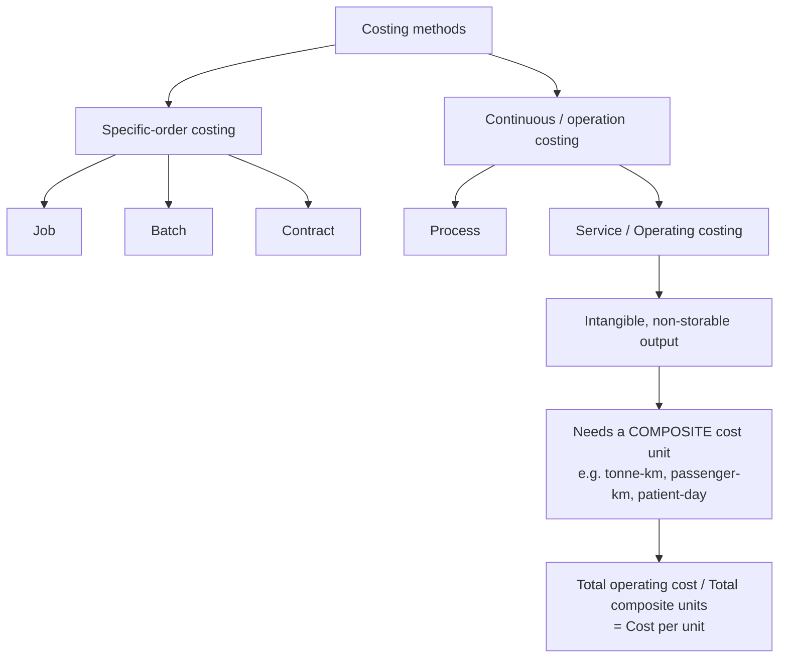

# Q&A — Service Costing

> CA Intermediate · Cost & Management Accounting · Chapter: **Service (Operating) Costing**
> Every question is followed immediately by a complete model answer. All figures reconcile. Currency: Indian Rupees (Rs.).

---

## How the method sits in the family (Mermaid)

---

## SECTION A — Concept-Check (short answer)

**A1.** Why is service costing also called *operating costing*, and what is the defining feature of its output?
**Answer.** It is called operating costing because it computes the cost of *operating* a service (a facility rendered rather than a good produced). Defining feature: the output is **intangible and non-storable** — it cannot be inventoried, so there is no closing WIP/finished-goods valuation; cost is expressed per unit of service rendered during the period.

**A2.** What is a *composite (compound) cost unit*? Give two examples.
**Answer.** A cost unit built from **two factors multiplied together** because a single factor fails to capture the value delivered. Examples: **tonne-kilometre** (weight × distance) for goods transport, **passenger-kilometre** for passenger transport, **patient-day** (patients × days) for hospitals, **kilowatt-hour** for power, **room-day** for hotels.

**A3.** State Porter's kilogram-metre analogy and what it teaches about composite units.
**Answer.** A porter who carries 10 kg over 100 m does the *same work* as one who carries 100 kg over 10 m — both equal **1,000 kg-metres**. It teaches that in transport the *effort/value* is a **product of load and distance**, so cost must be spread over a composite unit (tonne-km), never over distance alone or load alone.

**A4.** Distinguish **absolute (weighted) tonne-km** from **commercial (simple/average) tonne-km**.
**Answer.**
- **Absolute tonne-km** = Σ (load of each trip × distance of that trip). It weights each leg by its own load — more accurate.
- **Commercial tonne-km** = **Average load** × **Total distance** travelled. It uses one average load across the whole distance — simpler but approximate.

**A5.** Under what three cost heads are operating costs usually classified in a transport operating-cost statement?
**Answer.** (i) **Standing / Fixed charges** (insurance, road tax, licence, garage rent, salary of permanent driver, depreciation on time basis); (ii) **Running / Variable charges** (fuel, oil, tyres, depreciation on km basis); (iii) **Maintenance / Semi-variable charges** (repairs, servicing, spare parts).

**A6.** Why can depreciation appear under *either* standing or running charges?
**Answer.** If provided on a **time basis** (e.g. per annum on straight line) it is a **standing charge** (accrues whether the vehicle runs or not); if provided on a **usage basis** (e.g. per km run), it is a **running charge**. The question's wording dictates the classification — a classic trap.

**A7.** In a passenger-bus problem, how do you convert seating capacity and occupancy into passenger-km?
**Answer.** Passenger-km = **Seats × Occupancy % × Km run × Trips (both ways as applicable) × Operating days**. Only *occupied* seats generate revenue-earning passenger-km, so the occupancy percentage must be applied.

**A8.** Why are *idle/off-road days* important when computing cost per running km?
**Answer.** Standing charges accrue for **all** days (idle or not), but they are recovered only over the **kilometres actually run**. Ignoring idle days overstates km run, understates cost per km, and gives a wrong quotation.

---

## SECTION B — Graded Computational Problems (easy → exam-hard)

### B1 (Easy) — Simple tonne-km and cost per tonne-km

A lorry carries **5 tonnes** of goods over a **one-way** distance of **120 km** and returns **empty**. It makes this trip on all **25 operating days** in a month. Total operating cost for the month is **Rs. 90,000**. Compute (a) absolute tonne-km and (b) cost per tonne-km.

**Answer.**
Loaded leg only earns tonne-km (return is empty ⇒ 0 tonnes).
- Loaded tonne-km per trip = 5 t × 120 km = 600 tonne-km.
- Monthly absolute tonne-km = 600 × 25 days = **15,000 tonne-km**.
- Cost per tonne-km = Rs. 90,000 ÷ 15,000 = **Rs. 6.00 per tonne-km**.

*Note:* total distance run = (120 + 120) × 25 = 6,000 km, but the empty return earns no tonne-km.

---

### B2 (Easy-Moderate) — Passenger-km and fare

A 40-seat bus runs **2 round trips** daily on a **20 km** (one-way) route, for **25 days** a month, at **75% occupancy**. Total operating cost is **Rs. 1,50,000** per month and the operator wants a **20% profit on takings (fare)**. Find (a) passenger-km and (b) fare per passenger-km.

**Answer.**
Distance per day = 20 km × 2 (one-way per round trip) × 2 round trips = 80 km.
Passenger-km per month = Seats × Occupancy × Km × Days
= 40 × 75% × 80 × 25
= 30 × 80 × 25 = **60,000 passenger-km**.

Cost per passenger-km = 1,50,000 ÷ 60,000 = **Rs. 2.50**.
Profit is 20% of fare ⇒ cost is 80% of fare.
Fare per passenger-km = 2.50 ÷ 0.80 = **Rs. 3.125 ≈ Rs. 3.13 per passenger-km**.

*Check:* Fare 3.125 × 60,000 = Rs. 1,87,500; profit = 1,87,500 − 1,50,000 = Rs. 37,500 = 20% of 1,87,500. ✔

---

### B3 (Moderate) — Full operating cost statement, goods transport

A transport company runs one truck. Data for the year:
- Cost of truck Rs. 12,00,000; residual value Rs. 1,20,000; life 5 years (depreciation on **time/straight-line** basis).
- Annual: Insurance Rs. 24,000; Road tax & licence Rs. 12,000; Driver's salary Rs. 1,80,000; Garage rent Rs. 24,000.
- Diesel: truck runs **1,00,000 km** a year; mileage 5 km/litre; diesel Rs. 90/litre.
- Oil & sundries Rs. 1.50 per km; Tyres Rs. 1.00 per km; Repairs & maintenance Rs. 60,000 for the year.
- Effective load: truck carries **8 tonnes** on the outward leg and returns empty; outward and return distances are equal, so **half** the km are loaded.

Prepare the operating cost statement and find cost per tonne-km. Profit is not required.

**Answer.**

Depreciation (time basis) = (12,00,000 − 1,20,000) ÷ 5 = Rs. 2,16,000 p.a.

Diesel = 1,00,000 km ÷ 5 = 20,000 litres × Rs. 90 = Rs. 18,00,000.
Oil & sundries = 1,00,000 × 1.50 = Rs. 1,50,000.
Tyres = 1,00,000 × 1.00 = Rs. 1,00,000.

**Operating Cost Statement (per annum)**

| Head | Rs. |
|---|---:|
| **A. Standing charges** | |
| Depreciation (time basis) | 2,16,000 |
| Insurance | 24,000 |
| Road tax & licence | 12,000 |
| Driver's salary | 1,80,000 |
| Garage rent | 24,000 |
| **Sub-total A** | **4,56,000** |
| **B. Running charges** | |
| Diesel | 18,00,000 |
| Oil & sundries | 1,50,000 |
| Tyres | 1,00,000 |
| **Sub-total B** | **20,50,000** |
| **C. Maintenance charges** | |
| Repairs & maintenance | 60,000 |
| **Sub-total C** | **60,000** |
| **Total operating cost (A+B+C)** | **25,66,000** |

Tonne-km: loaded km = half of 1,00,000 = 50,000 km at 8 tonnes.
Absolute tonne-km = 50,000 × 8 = **4,00,000 tonne-km**.
**Cost per tonne-km = 25,66,000 ÷ 4,00,000 = Rs. 6.415 ≈ Rs. 6.42.**

Cost per km run (for reference) = 25,66,000 ÷ 1,00,000 = **Rs. 25.66/km**.

---

### B4 (Exam-hard) — Idle days, per-km depreciation, absolute vs commercial tonne-km, quotation

A truck operator gives the following for a month of **30 days**, of which the truck is **idle for 5 days** (under repair):
- Truck cost Rs. 15,00,000; depreciation charged at **Rs. 4.00 per km run** (usage basis).
- Standing charges for the month: Insurance Rs. 5,000; Tax Rs. 2,000; Permit Rs. 3,000; Driver + cleaner wages Rs. 30,000; Garage rent Rs. 6,000.
- Repairs & maintenance for the month Rs. 20,000.
- Diesel Rs. 90/litre, mileage 4 km/litre; Oil/lubricants Rs. 2.00 per km.

Trip pattern (performed on each of the **25 running days**): the truck makes **one round trip** of 100 km each way (200 km/day). It carries **10 tonnes outward** for the full 100 km, then **6 tonnes on the return** 100 km.

Required: (a) km run and diesel; (b) **absolute** tonne-km; (c) **commercial** tonne-km; (d) total operating cost; (e) cost per absolute tonne-km; (f) a freight **quotation per tonne-km** giving 25% profit on cost.

**Answer.**

**(a) Km run & diesel.** Running days = 30 − 5 = 25. Km/day = 200 ⇒ km run = 25 × 200 = **5,000 km**.
Diesel = 5,000 ÷ 4 = 1,250 litres × 90 = **Rs. 1,12,500**.

**(b) Absolute (weighted) tonne-km** = Σ (load × distance of each leg)
= (10 t × 100 km) + (6 t × 100 km) = 1,000 + 600 = 1,600 tonne-km/day.
× 25 days = **40,000 absolute tonne-km**.

**(c) Commercial (average) tonne-km** = Average load × Total distance.
Average load = (10 + 6) ÷ 2 = 8 tonnes. Total distance = 5,000 km.
= 8 × 5,000 = **40,000 commercial tonne-km**.
*(Here they coincide because both legs are equal distance; had legs differed, they would diverge — state this in the exam.)*

**(d) Operating Cost Statement (for the month)**

| Head | Rs. |
|---|---:|
| **A. Standing charges** | |
| Insurance | 5,000 |
| Tax | 2,000 |
| Permit | 3,000 |
| Driver + cleaner wages | 30,000 |
| Garage rent | 6,000 |
| **Sub-total A** | **46,000** |
| **B. Running charges** | |
| Diesel | 1,12,500 |
| Oil / lubricants (5,000 × 2) | 10,000 |
| Depreciation (5,000 km × 4) | 20,000 |
| **Sub-total B** | **1,42,500** |
| **C. Maintenance** | |
| Repairs & maintenance | 20,000 |
| **Total operating cost** | **2,08,500** |

*Note the trap handled:* standing charges (Rs. 46,000) accrue for all 30 days but are recovered over 5,000 km actually run; depreciation is on **km basis** so it goes to running charges and is nil for idle days.

**(e) Cost per absolute tonne-km** = 2,08,500 ÷ 40,000 = **Rs. 5.2125 ≈ Rs. 5.21**.

**(f) Quotation with 25% profit on cost** = 5.2125 × 1.25 = **Rs. 6.5156 ≈ Rs. 6.52 per tonne-km**.

*Check:* Revenue = 6.5156 × 40,000 = Rs. 2,60,625; profit = 2,60,625 − 2,08,500 = Rs. 52,125 = 25% of cost. ✔

---

### B5 (Exam-hard) — Hospital: cost per patient-day

A hospital wing has **30 beds**, occupied on average at **80%** through a **30-day** month. Costs for the month:
- Doctors' & nurses' salaries Rs. 6,00,000; Housekeeping & food Rs. 1,44,000; Medicines & consumables Rs. 90,000.
- Depreciation on building & equipment Rs. 60,000; Power, water, laundry Rs. 66,000; Administration Rs. 36,000.
Find (a) patient-days and (b) cost per patient-day. (c) If the hospital wants 15% margin on billing, what is the daily charge per patient?

**Answer.**
**(a) Patient-days** = Beds × Occupancy × Days = 30 × 80% × 30 = **720 patient-days**.

**(b) Total cost** = 6,00,000 + 1,44,000 + 90,000 + 60,000 + 66,000 + 36,000 = **Rs. 9,96,000**.
Cost per patient-day = 9,96,000 ÷ 720 = **Rs. 1,383.33**.

**(c) Charge with 15% margin on billing** ⇒ cost = 85% of charge.
Charge = 1,383.33 ÷ 0.85 = **Rs. 1,627.45 per patient-day**.

*Check:* Billing = 1,627.45 × 720 = Rs. 11,71,764; margin = 11,71,764 − 9,96,000 = Rs. 1,75,764 ≈ 15% of billing. ✔

---

## SECTION C — Past-Paper-Style Full Questions

### C1. Bus operator — fare per passenger-km (ICAI style)

A bus operator owns a **52-seat** bus plying a **30 km** (one-way) city route. It makes **3 round trips** daily for **26 days** a month at **70% capacity**. Monthly costs:
- Standing: Insurance Rs. 6,000; Tax Rs. 4,000; Permit Rs. 2,000; Driver + conductor salary Rs. 40,000; Depreciation (time basis) Rs. 25,000; Garage Rs. 5,000.
- Running: Diesel — bus does 4 km/litre, diesel Rs. 95/litre; Oil & sundries Rs. 3/km; Tyres Rs. 2/km.
- Maintenance: Rs. 18,000.
Compute total cost, cost per passenger-km, and the fare per passenger-km to earn **25% profit on total takings**.

**Answer.**

Distance/day = 30 km × 2 (both ways) × 3 round trips = 180 km. Monthly km = 180 × 26 = **4,680 km**.

Diesel = 4,680 ÷ 4 = 1,170 litres × 95 = Rs. 1,11,150.
Oil & sundries = 4,680 × 3 = Rs. 14,040. Tyres = 4,680 × 2 = Rs. 9,360.

| Head | Rs. |
|---|---:|
| **A. Standing** | |
| Insurance | 6,000 |
| Tax | 4,000 |
| Permit | 2,000 |
| Driver + conductor | 40,000 |
| Depreciation (time) | 25,000 |
| Garage | 5,000 |
| **Sub-total A** | **82,000** |
| **B. Running** | |
| Diesel | 1,11,150 |
| Oil & sundries | 14,040 |
| Tyres | 9,360 |
| **Sub-total B** | **1,34,550** |
| **C. Maintenance** | 18,000 |
| **Total operating cost** | **2,34,550** |

Passenger-km = 52 × 70% × 4,680 = 36.4 × 4,680 = **1,70,352 passenger-km**.
Cost per passenger-km = 2,34,550 ÷ 1,70,352 = **Rs. 1.3769 ≈ Rs. 1.38**.
Profit 25% of takings ⇒ cost = 75%. Fare = 1.3769 ÷ 0.75 = **Rs. 1.8359 ≈ Rs. 1.84 per passenger-km**.

*Check:* Takings = 1.8359 × 1,70,352 = Rs. 3,12,733; profit = 3,12,733 − 2,34,550 = Rs. 78,183 = 25% of takings. ✔

---

### C2. Absolute vs commercial tonne-km (unequal legs) — the discriminating question

A truck's daily schedule: Delhi→A 40 km carrying 12 t; A→B 30 km carrying 9 t; B→Delhi 50 km carrying 6 t. Compute both **absolute** and **commercial** tonne-km for one day and comment.

**Answer.**
Total distance = 40 + 30 + 50 = 120 km.

**Absolute tonne-km** = (12×40) + (9×30) + (6×50) = 480 + 270 + 300 = **1,050 tonne-km**.

**Commercial tonne-km** = Average load × total distance.
Average load = (12 + 9 + 6) ÷ 3 = 9 t ⇒ 9 × 120 = **1,080 tonne-km**.

**Comment:** The two differ (1,050 vs 1,080) because legs have **unequal distances** — the simple average over-weights the long, lightly-loaded final leg. Absolute tonne-km is the accurate measure; commercial is a quick approximation. When legs are equal, both coincide (see B4).

---

### C3. Theory — Distinguish service costing from job and process costing; give sectors where it applies.

**Answer.**
- **Vs job costing:** Job costing collects cost per identifiable, distinct job/order with tangible output and closing WIP; service costing has continuous, homogeneous, **intangible** output measured by a composite unit with **no inventory**.
- **Vs process costing:** Both handle continuous homogeneous output and use average cost per unit, but process costing values physical, storable output with WIP and normal/abnormal loss; service costing has **non-storable** output, no loss/WIP concept, and a **composite** cost unit.
- **Sectors:** Transport (bus, truck, taxi, airline, shipping — passenger-km/tonne-km), utilities (power — kWh; water — kilolitre), hospitality (hotel — room-day), healthcare (hospital — patient-day), education (college — student-hour), canteen (per meal), IT/BPO (per seat-hour), toll roads (per vehicle-km). It aligns with **CAS-4/general CAS** principles for cost determination in the service sector.

---

## SECTION D — MCQs & Case Scenarios

**D1.** The most appropriate cost unit for a goods-transport company is:
(a) Per km (b) Per tonne (c) **Tonne-kilometre** (d) Per trip
**Answer: (c).** Value depends on both weight carried and distance — a composite unit is required.

**D2.** Depreciation charged at "Rs. 5 per km run" is classified as a:
(a) **Running charge** (b) Standing charge (c) Maintenance charge (d) Notional cost
**Answer: (a).** Charged on usage (km) basis, so it varies with running ⇒ running charge.

**D3.** Absolute tonne-km equals commercial tonne-km when:
(a) Load is constant (b) **Distance of each leg is equal** (c) Truck returns empty (d) Never
**Answer: (b).** With equal leg distances the weighted and average-load computations coincide.

**D4.** A hospital's suitable cost unit is:
(a) Per doctor (b) Per bed (c) **Per patient-day** (d) Per medicine
**Answer: (c).** Captures both number of patients and length of stay.

**D5.** In service costing there is normally **no**:
(a) Fixed cost (b) **Closing work-in-progress / finished-goods inventory** (c) Variable cost (d) Cost unit
**Answer: (b).** Output is intangible and non-storable, so nothing is inventoried.

**D6 (Case).** A bus (50 seats) runs 100 km round trips, 2 trips/day, 25 days, at 60% occupancy. Passenger-km for the month are:
(a) 1,50,000 (b) **1,50,000** — verify: 50 × 60% × (100×2 trips = 200 km/day) × 25 = 30 × 200 × 25 = 1,50,000.
**Answer: 1,50,000 passenger-km.** Reasoning: seats × occupancy × km/day × days; only occupied seats earn passenger-km.

**D7 (Case).** A truck runs 6,000 km in a month (return leg empty, so half the km are loaded at 10 t). Total cost Rs. 1,20,000. Cost per tonne-km is:
Loaded km = 3,000; tonne-km = 3,000 × 10 = 30,000. Cost = 1,20,000 ÷ 30,000 = **Rs. 4.00**.
**Answer: Rs. 4.00 per tonne-km.** Reasoning: empty return earns no tonne-km, so only loaded km count.

**D8 (Case).** If standing charges are Rs. 50,000/month and the truck is idle 10 of 30 days running 200 km on each active day, the standing charge recovered per km is:
Km run = 20 days × 200 = 4,000 km ⇒ 50,000 ÷ 4,000 = **Rs. 12.50/km**.
**Answer: Rs. 12.50 per km.** Reasoning: standing charges accrue for all days but are spread only over km actually run.

---

## Examiner-Trap Checklist (memorise before the exam)

1. **Empty return legs earn zero tonne-km** — never multiply total distance by full load.
2. **Depreciation basis** (time vs km) decides standing vs running classification.
3. **Idle days** still incur standing charges; recover them over km actually run.
4. **Occupancy %** must be applied to seats for passenger-km.
5. **Both-ways distance** — read whether "trip" is one-way or round.
6. **Profit on cost vs profit on takings/fare** — divide by (1+r) or (1−r) accordingly.
7. **Absolute vs commercial tonne-km** diverge only when leg distances differ.
8. **Per-annum vs per-month** data — keep the time base consistent throughout.
9. Interest/notional costs — include only if the question says so.
10. Tyres/oil are usually **per-km (running)**, not fixed.
11. Show the **operating cost statement in three heads** (standing, running, maintenance) for full marks.
