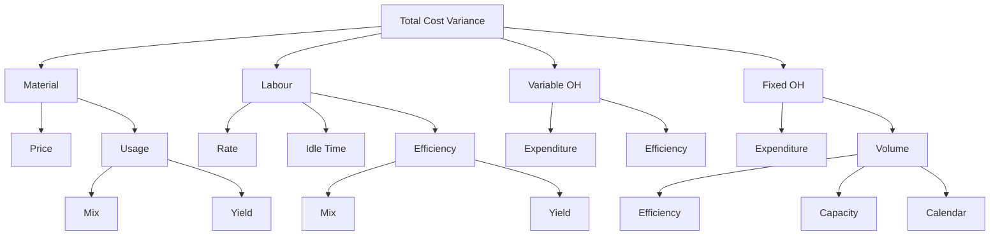

# Q&A — Standard Costing & Variance Analysis

> CA Intermediate · Cost & Management Accounting · Chapter 13
> Every question is followed immediately by a complete model answer. All figures in Rupees (₹). Formulas per ICAI convention: **Variance = Standard − Actual** for costs (positive = Favourable, F; negative = Adverse, A).

---

## Section A — Concept Check (short answer)

**A1. What is a standard cost and how does it differ from a budget?**
A standard cost is a *predetermined per-unit* cost (of material, labour, overhead) built up scientifically for one unit of output. A budget is the *total* cost/revenue plan for an entire period or activity level. Standard = per unit; Budget = total. A budget is often built by multiplying the standard cost by the budgeted quantity.

**A2. State the general formula for a Cost Variance and its sign convention.**
Cost Variance = (Standard Cost of actual output) − (Actual Cost). If the answer is positive it is **Favourable (F)** because actual cost was lower than standard; if negative it is **Adverse (A)**.

**A3. Distinguish "revision variance" from a controllable variance.**
A revision (planning) variance arises because the original standard itself was wrong/outdated and is *uncontrollable* by the manager. A controllable (operational) variance measures performance against a realistic current standard and *is* the manager's responsibility.

**A4. Why does the Material Usage Variance further split into Mix and Yield?**
When a product uses two or more materials that can substitute for one another, total usage can deviate for two reasons: (a) the *proportion* of inputs changed (Mix), and (b) the total input produced more/less output than expected (Yield). Mix + Yield = Usage.

**A5. What is Idle Time Variance and why is it always adverse?**
Idle Time Variance = Idle hours × Standard rate. It isolates the cost of paid but non-productive hours (breakdowns, strikes). Since idle time is always a loss of paid hours, it can never be favourable — it is always **Adverse**.

**A6. Give the four sub-variances of Fixed Overhead (absorption basis).**
Expenditure (Budgeted FOH − Actual FOH), Volume (Absorbed − Budgeted), which splits into Efficiency (Std hrs for actual output vs actual hrs) and Capacity (actual hrs vs budgeted hrs); Calendar variance arises when actual working days differ from budgeted.

**A7. In sales variances, how do the "value/turnover" method and the "margin/profit" method differ?**
The value method measures the impact of sales changes on **turnover** (revenue). The margin method measures the impact on **profit** (using contribution or profit per unit) and is the one used in the budgeted-to-actual profit reconciliation.

---

## Section B — Graded Computational Problems

### B1 (Easy) — Material Price & Usage

Standard: 5 kg @ ₹4/kg per unit. Actual output 1,000 units; actual material 5,200 kg costing ₹22,360.

**Solution.**
Standard price (SP) = ₹4; Standard qty for actual output (SQ) = 1,000 × 5 = 5,000 kg.
Actual qty (AQ) = 5,200 kg; Actual price (AP) = 22,360 / 5,200 = ₹4.30/kg.

- **Price Variance** = AQ × (SP − AP) = 5,200 × (4 − 4.30) = **₹1,560 (A)**
- **Usage Variance** = SP × (SQ − AQ) = 4 × (5,000 − 5,200) = **₹800 (A)**
- **Total Material Cost Variance** = (SQ×SP) − (AQ×AP) = 20,000 − 22,360 = **₹2,360 (A)**

Check: 1,560 A + 800 A = 2,360 A. ✓ Ties.

---

### B2 (Moderate) — Labour with Idle Time

Standard: 4 hrs @ ₹15/hr per unit. Actual output 500 units. Workers paid for 2,100 hrs @ ₹16/hr; 100 hrs were idle due to power failure.

**Solution.**
SR = ₹15; Std hrs for output (SH) = 500 × 4 = 2,000 hrs.
Hours paid = 2,100; Hours worked = 2,100 − 100 = 2,000; AR = ₹16.

- **Rate Variance** = Hours paid × (SR − AR) = 2,100 × (15 − 16) = **₹2,100 (A)**
- **Idle Time Variance** = Idle hrs × SR = 100 × 15 = **₹1,500 (A)**
- **Efficiency Variance** = SR × (SH − Hours worked) = 15 × (2,000 − 2,000) = **₹0**
- **Total Labour Cost Variance** = (SH×SR) − (Hours paid × AR) = 30,000 − 33,600 = **₹3,600 (A)**

Check: Rate 2,100 A + Idle 1,500 A + Efficiency 0 = 3,600 A. ✓ Ties.

---

### B3 (Hard) — Material Mix & Yield

Standard mix for 100 kg output:
| Material | Qty (kg) | Rate (₹) | Amount (₹) |
|---|---|---|---|
| A | 60 | 20 | 1,200 |
| B | 40 | 30 | 1,200 |
| **Total** | **100** | | **2,400** |

(Standard input 100 kg → 100 kg output, no loss.) Actual: A 340 kg @ ₹22, B 260 kg @ ₹28; output 560 kg.

**Solution.**
Total actual input = 340 + 260 = 600 kg. Std cost/kg of mix = 2,400/100 = ₹24.
Standard qty for actual output (SQ): A = 560×0.60 = 336 kg; B = 560×0.40 = 224 kg.
Revised standard mix (actual total input 600 in std proportion): A = 600×0.6 = 360; B = 600×0.4 = 240.

**Price Variance** = Σ AQ(SP−AP):
A: 340×(20−22) = 680 A; B: 260×(30−28) = 520 F → Net **₹160 (A)**

**Mix Variance** = SP × (Revised std qty − Actual qty):
A: 20×(360−340) = 400 F; B: 30×(240−260) = 600 A → Net **₹200 (A)**

**Yield Variance** = Std cost/kg output × (Actual output − Std output from actual input).
Std output from 600 kg input = 600 kg (no loss). Actual output = 560 kg → shortfall 40 kg.
= 24 × (560 − 600) = **₹960 (A)**

**Usage Variance** = SP × (SQ − AQ):
A: 20×(336−340) = 80 A; B: 30×(224−260) = 1,080 A → **₹1,160 (A)**
Check: Mix 200 A + Yield 960 A = 1,160 A = Usage. ✓

**Total Material Cost Variance** = Price + Usage = 160 A + 1,160 A = **₹1,320 (A)**
Verify directly: Std cost of output (560 × 24) = 13,440; Actual cost = 340×22 + 260×28 = 7,480 + 7,280 = 14,760; Variance = 13,440 − 14,760 = ₹1,320 A. ✓ Ties.

---

### B4 (Exam-hard) — Full Overhead Variance Set

Budget for the month: output 10,000 units; standard 2 hrs/unit; fixed OH ₹1,20,000; variable OH ₹60,000; budgeted days 25.
Actual: output 9,000 units; hours worked 17,500; actual days 24; fixed OH ₹1,25,000; variable OH ₹58,000.

**Solution — set up standard rates.**
Budgeted hours = 10,000 × 2 = 20,000 hrs.
Std FOH rate/hr = 1,20,000/20,000 = ₹6; Std VOH rate/hr = 60,000/20,000 = ₹3.
Std hrs for actual output (SH) = 9,000 × 2 = 18,000 hrs.
FOH absorbed = SH × 6 = 18,000 × 6 = 1,08,000.
Budgeted FOH per day = 1,20,000/25 = ₹4,800.

**Variable Overhead**
- Expenditure = (Actual hrs × Std rate) − Actual VOH = (17,500×3) − 58,000 = 52,500 − 58,000 = **₹5,500 (A)**
- Efficiency = Std rate × (SH − Actual hrs) = 3 × (18,000 − 17,500) = **₹1,500 (F)**
- Total VOH Variance = Absorbed − Actual = (18,000×3) − 58,000 = 54,000 − 58,000 = **₹4,000 (A)** ✓ (5,500 A + 1,500 F)

**Fixed Overhead**
- Expenditure = Budgeted − Actual = 1,20,000 − 1,25,000 = **₹5,000 (A)**
- Volume = Absorbed − Budgeted = 1,08,000 − 1,20,000 = **₹12,000 (A)**
- Total FOH Variance = Absorbed − Actual = 1,08,000 − 1,25,000 = **₹17,000 (A)** ✓ (5,000 A + 12,000 A)

**Volume split:**
- Efficiency = Std rate × (SH − Actual hrs) = 6 × (18,000 − 17,500) = **₹3,000 (F)**
- Capacity = Std rate × (Actual hrs − Revised budgeted hrs for actual days).
 Revised budgeted hrs = 20,000 × 24/25 = 19,200. = 6 × (17,500 − 19,200) = **₹10,200 (A)**
- Calendar = Std rate × (Revised budgeted hrs − Original budgeted hrs) = 6 × (19,200 − 20,000) = **₹4,800 (A)**
Check: Efficiency 3,000 F + Capacity 10,200 A + Calendar 4,800 A = **12,000 A = Volume**. ✓ Ties.

---

## Section C — Past-Paper-Style Full Question

**C1.** A company gives the following data for a period. Prepare all labour variances and reconcile.
Standard: 3 hrs @ ₹20/hr per unit; budgeted output 4,000 units. Standard gang: Skilled 2 hrs @ ₹25, Unskilled 1 hr @ ₹10.
Actual output 3,800 units. Actual: Skilled 8,200 hrs @ ₹26 = ₹2,13,200; Unskilled 3,600 hrs @ ₹9 = ₹32,400. No idle time.

**Model answer.**
Std hrs for actual output: Skilled = 3,800×2 = 7,600; Unskilled = 3,800×1 = 3,800. Total SH = 11,400.
Actual total hrs = 8,200 + 3,600 = 11,800. Revised std (actual total in std 2:1 ratio): Skilled = 11,800×2/3 = 7,866.67; Unskilled = 11,800×1/3 = 3,933.33.

**Rate Variance** = AH×(SR−AR): Skilled 8,200×(25−26)=8,200 A; Unskilled 3,600×(10−9)=3,600 F → **₹4,600 (A)**

**Mix Variance** = SR×(Revised std hrs − Actual hrs):
Skilled 25×(7,866.67−8,200)=8,333 A; Unskilled 10×(3,933.33−3,600)=3,333 F → **₹5,000 (A)**

**Yield (sub-efficiency) Variance** = SR×(Std hrs − Revised std hrs):
Skilled 25×(7,600−7,866.67)=6,667 A; Unskilled 10×(3,800−3,933.33)=1,333 A → **₹8,000 (A)**

**Efficiency Variance** = SR×(SH−AH): Skilled 25×(7,600−8,200)=15,000 A; Unskilled 10×(3,800−3,600)=2,000 F → **₹13,000 (A)**
Check: Mix 5,000 A + Yield 8,000 A = 13,000 A = Efficiency. ✓

**Total Labour Cost Variance** = (SH×SR)−(AH×AR) = (7,600×25 + 3,800×10) − (2,13,200+32,400)
= (1,90,000 + 38,000) − 2,45,600 = 2,28,000 − 2,45,600 = **₹17,600 (A)**
Reconcile: Rate 4,600 A + Efficiency 13,000 A = **17,600 A**. ✓ Ties.

---

**C2. Sales & Profit Reconciliation.** Budget: 1,000 units @ ₹100, cost ₹80, profit ₹20/unit. Actual: 1,100 units sold @ ₹95; total cost per unit ₹82.

**Model answer (margin method).**
Budgeted profit = 1,000 × 20 = ₹20,000. Standard profit/unit = ₹20.
- **Sales Price Variance** = Actual units × (AP − SP) = 1,100 × (95 − 100) = **₹5,500 (A)**
- **Sales Volume (profit) Variance** = Std profit × (Actual units − Budget units) = 20 × (1,100 − 1,000) = **₹2,000 (F)**
- **Total Sales Margin Variance** = 5,500 A + 2,000 F = **₹3,500 (A)**

**Cost side:** Total cost variance = Std cost of actual output − Actual cost = (1,100×80) − (1,100×82) = 88,000 − 90,200 = **₹2,200 (A)**

**Reconciliation:**
| Item | ₹ |
|---|---|
| Budgeted profit | 20,000 |
| Sales price variance | (5,500) A |
| Sales volume variance | 2,000 F |
| Cost variances | (2,200) A |
| **Actual profit** | **14,300** |

Verify: Actual profit = 1,100 × (95 − 82) = 1,100 × 13 = **₹14,300**. ✓ Ties.

---

## Section D — MCQs & Case Scenarios

**D1.** Material usage variance uses which price?
(a) Actual (b) Standard (c) Market (d) Weighted avg
**Ans: (b) Standard.** Usage is valued at standard price to isolate the quantity effect only.

**D2.** Idle time variance is:
(a) Always F (b) Always A (c) Either (d) Zero
**Ans: (b) Always Adverse** — paid non-productive hours are pure loss.

**D3.** Fixed OH volume variance = 0 when:
(a) Actual = budgeted output (b) No idle time (c) Days equal (d) Rate unchanged
**Ans: (a).** Volume = Absorbed − Budgeted; equal output means absorbed = budgeted.

**D4.** Sales price variance = 1,100×(95−100) uses:
(a) Budget qty (b) Actual qty (c) Std qty (d) Revised qty
**Ans: (b) Actual quantity** — price effect measured on units actually sold.

**D5 (Case).** A firm's material cost variance is favourable but usage is heavily adverse. What likely happened?
**Ans:** A large **favourable price variance** (cheap, possibly inferior material) outweighed adverse usage — the classic trap where buying cheap material causes higher wastage. Examiner tests whether you flag the price–usage trade-off.

**D6.** Fixed OH capacity variance measures deviation in:
(a) Output (b) Hours worked vs budgeted (c) Rate (d) Days
**Ans: (b).** Capacity = Std rate × (Actual hrs − Budgeted hrs), i.e. utilisation of available capacity.

---

## Variance Tree (Mermaid)

---

## Quick-Revision Formula Sheet

| Variance | Formula |
|---|---|
| Material Price | AQ × (SP − AP) |
| Material Usage | SP × (SQ − AQ) |
| Material Mix | SP × (Revised std qty − AQ) |
| Material Yield | Std cost/unit output × (Actual − Std output) |
| Labour Rate | Hours paid × (SR − AR) |
| Idle Time | Idle hrs × SR (always A) |
| Labour Efficiency | SR × (SH − Hours worked) |
| VOH Expenditure | (AH × Std rate) − Actual VOH |
| VOH Efficiency | Std rate × (SH − AH) |
| FOH Expenditure | Budgeted FOH − Actual FOH |
| FOH Volume | Absorbed − Budgeted |
| FOH Efficiency | Std rate × (SH − AH) |
| FOH Capacity | Std rate × (AH − Revised budgeted hrs) |
| FOH Calendar | Std rate × (Revised − Original budgeted hrs) |
| Sales Price | Actual units × (AP − SP) |
| Sales Volume (profit) | Std profit/unit × (Actual − Budget units) |

**Golden rules:** (1) Cost variance sign: Standard − Actual, positive = F. (2) Mix + Yield always tie back to Usage/Efficiency. (3) All FOH sub-variances tie to Absorbed − Actual. (4) Reconciliation: Budgeted profit ± sales variances ± cost variances = Actual profit.
