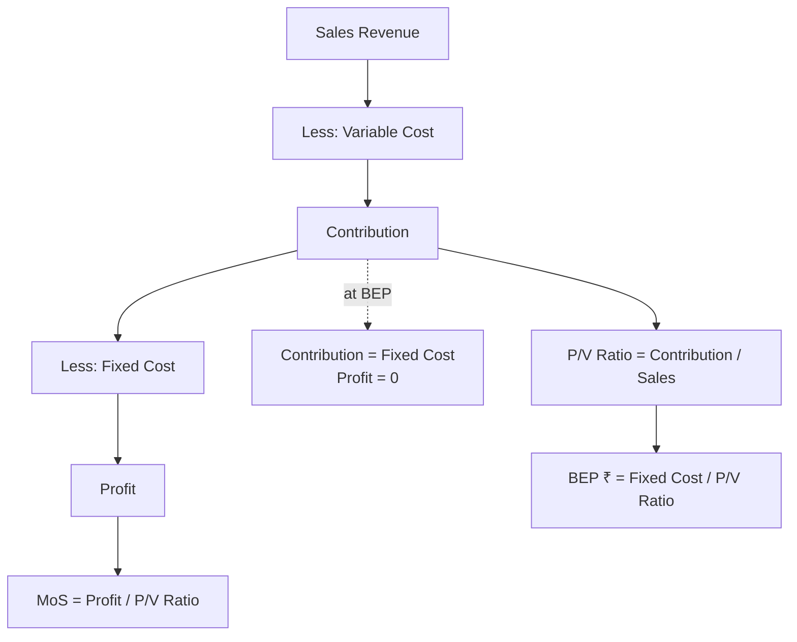

# Q&A — Marginal Costing & CVP Analysis

*CA Intermediate • Cost & Management Accounting • ICAI syllabus • All figures in Rupees (₹)*

---

## Section A — Concept-Check (Short Q&A)

**A1. Define marginal cost.**
Marginal cost is the aggregate of variable costs — i.e., the additional cost incurred to produce one more unit of output (Prime cost + Variable overheads). Fixed cost does not form part of marginal cost.

**A2. What is "contribution" and why is it central to marginal costing?**
Contribution = Sales − Variable cost = Fixed cost + Profit. It is the amount that first "contributes" towards recovering fixed cost, and thereafter becomes profit. Since fixed cost is a period cost, only contribution reflects the true incremental gain of an extra unit — hence it drives all short-run decisions.

**A3. Distinguish product fixed overhead from period fixed overhead treatment.**
Under **absorption costing**, fixed production overhead is treated as a **product cost** — absorbed into units and carried in closing stock. Under **marginal costing**, fixed overhead is a **period cost** — charged wholly to the period's P&L, never carried in stock.

**A4. Write the P/V ratio formula (three forms).**
P/V ratio = (Contribution ÷ Sales) × 100 = (Change in profit ÷ Change in sales) × 100 = (Contribution per unit ÷ Selling price per unit) × 100.

**A5. What is the "angle of incidence" on a break-even chart?**
It is the angle formed at the BEP between the sales line and the total cost line. A **larger angle** indicates a higher rate of profit earning after break-even (high P/V ratio); a narrow angle signals low profitability.

**A6. Give the cash break-even point formula and state its use.**
Cash BEP (units) = Cash fixed cost ÷ Contribution per unit, where cash fixed cost = Total fixed cost − non-cash items (e.g., depreciation). It shows the volume at which cash inflows just cover cash fixed outflows — useful for liquidity/survival analysis.

**A7. Why does profit differ under marginal vs absorption costing?**
Profit differs only because of the **fixed overhead carried in the change of stock**. Difference = Change in stock units × Fixed OH rate per unit. If production > sales (stock rises), absorption profit > marginal profit, and vice-versa.

**A8. State the limiting-factor (key-factor) decision rule.**
When a resource is scarce, rank products by **contribution per unit of the limiting factor** (not per unit of product), and allocate the scarce resource to the highest-ranking product first.

---

## Section B — Graded Computational Problems

### B1 (Easy) — Basic CVP toolkit
Selling price ₹50/unit; variable cost ₹30/unit; fixed cost ₹2,00,000. Find contribution/unit, P/V ratio, BEP (units & ₹), and profit at 15,000 units.

**Solution.**
- Contribution/unit = 50 − 30 = **₹20**
- P/V ratio = 20 ÷ 50 = **40%**
- BEP (units) = 2,00,000 ÷ 20 = **10,000 units**
- BEP (₹) = 2,00,000 ÷ 0.40 = **₹5,00,000** (check: 10,000 × 50 ✓)
- Profit at 15,000 units = (15,000 × 20) − 2,00,000 = 3,00,000 − 2,00,000 = **₹1,00,000**

### B2 (Easy-Moderate) — Margin of safety & target profit
Same data as B1. (a) Find MoS at 15,000 units in units, ₹ and %. (b) Units required for a target profit of ₹1,60,000.

**Solution.**
(a) MoS (units) = Actual − BEP = 15,000 − 10,000 = **5,000 units**
 MoS (₹) = 5,000 × 50 = **₹2,50,000**; MoS % = 5,000 ÷ 15,000 = **33.33%**
 Check: Profit = MoS × Contribution/unit = 5,000 × 20 = ₹1,00,000 ✓ (ties to B1)
(b) Units = (Fixed cost + Target profit) ÷ Contribution/unit = (2,00,000 + 1,60,000) ÷ 20 = 3,60,000 ÷ 20 = **18,000 units**
 Sales value = 18,000 × 50 = **₹9,00,000**

### B3 (Moderate) — After-tax target profit
Fixed cost ₹4,50,000; P/V ratio 30%; tax rate 40%. Find sales (₹) needed for an **after-tax** profit of ₹90,000.

**Solution.**
- Pre-tax profit required = 90,000 ÷ (1 − 0.40) = 90,000 ÷ 0.60 = **₹1,50,000**
- Required contribution = Fixed cost + Pre-tax profit = 4,50,000 + 1,50,000 = ₹6,00,000
- Sales = Contribution ÷ P/V ratio = 6,00,000 ÷ 0.30 = **₹20,00,000**
 Check: Contribution 6,00,000 − Fixed 4,50,000 = 1,50,000 pre-tax; after 40% tax = 90,000 ✓

### B4 (Moderate) — P/V ratio & fixed cost from two periods (high-low logic)
| Year | Sales (₹) | Profit (₹) |
|------|-----------|------------|
| 2024 | 12,00,000 | 60,000 |
| 2025 | 15,00,000 | 1,50,000 |

Find P/V ratio, fixed cost, BEP, and MoS for 2025.

**Solution.**
- P/V ratio = Δ Profit ÷ Δ Sales = (1,50,000 − 60,000) ÷ (15,00,000 − 12,00,000) = 90,000 ÷ 3,00,000 = **30%**
- Contribution 2024 = 12,00,000 × 30% = 3,60,000 → Fixed cost = 3,60,000 − 60,000 = **₹3,00,000**
 Verify with 2025: 15,00,000 × 30% = 4,50,000 − 3,00,000 = 1,50,000 profit ✓
- BEP (₹) = 3,00,000 ÷ 0.30 = **₹10,00,000**
- MoS 2025 = 15,00,000 − 10,00,000 = **₹5,00,000** (33.33% of sales)

### B5 (Exam-Hard) — Marginal vs Absorption reconciliation
Data (per unit): Selling price ₹200; Direct material ₹60; Direct labour ₹40; Variable production OH ₹20; Variable selling OH ₹10. Fixed production OH ₹6,00,000; Fixed selling & admin ₹1,50,000. Normal/actual output = 30,000 units; **Production = 30,000 units, Sales = 25,000 units.** No opening stock. Fixed OH absorption rate based on normal output.

Prepare both profit statements and reconcile.

**Solution.**

*Fixed production OH rate = 6,00,000 ÷ 30,000 = ₹20/unit.*

**Marginal Costing Statement**
| Particulars | ₹ |
|---|---|
| Sales (25,000 × 200) | 50,00,000 |
| Less: Variable cost of sales (25,000 × 120*) | 30,00,000 |
| Less: Variable selling OH (25,000 × 10) | 2,50,000 |
| **Contribution** | **17,50,000** |
| Less: Fixed production OH | 6,00,000 |
| Less: Fixed selling & admin | 1,50,000 |
| **Profit (Marginal)** | **10,00,000** |

*Variable production cost/unit = 60 + 40 + 20 = ₹120.

**Absorption Costing Statement**
| Particulars | ₹ |
|---|---|
| Sales (25,000 × 200) | 50,00,000 |
| Less: Production cost of sales (25,000 × 140**) | 35,00,000 |
| Add: (no under/over absorption — prod = normal) | 0 |
| **Gross profit** | **15,00,000** |
| Less: Variable selling OH (25,000 × 10) | 2,50,000 |
| Less: Fixed selling & admin | 1,50,000 |
| **Profit (Absorption)** | **11,00,000** |

**Full production cost/unit = 120 + 20 (fixed OH) = ₹140.

**Reconciliation**
| Particulars | ₹ |
|---|---|
| Profit under Marginal costing | 10,00,000 |
| Add: Fixed OH in closing stock (5,000 units × ₹20) | 1,00,000 |
| **Profit under Absorption costing** | **11,00,000** |

Closing stock = Production − Sales = 30,000 − 25,000 = 5,000 units. Absorption profit is higher by ₹1,00,000 because that fixed OH is deferred in stock rather than expensed. **Statements tie.** ✓

### B6 (Exam-Hard) — Limiting-factor product mix
Three products; machine hours are the limiting factor (only 40,000 hrs available). Max demand: P 8,000; Q 10,000; R 6,000 units.

| | P | Q | R |
|---|---|---|---|
| Selling price/unit (₹) | 120 | 90 | 150 |
| Variable cost/unit (₹) | 72 | 54 | 84 |
| Machine hrs/unit | 4 | 2 | 6 |

Determine the optimum product mix and maximum contribution.

**Solution.**

Step 1 — Contribution per unit:
- P = 120 − 72 = ₹48; Q = 90 − 54 = ₹36; R = 150 − 84 = ₹66

Step 2 — Contribution per machine hour (the limiting factor):
- P = 48 ÷ 4 = **₹12** (Rank III)
- Q = 36 ÷ 2 = **₹18** (Rank I)
- R = 66 ÷ 6 = **₹11** (Rank II by product? No —) 

Recheck ranking: Q ₹18 > P ₹12 > R ₹11. So **Rank I = Q, Rank II = P, Rank III = R.**

Step 3 — Allocate 40,000 hrs by rank:
| Product | Units (max demand) | Hrs/unit | Hrs used | Contribution (₹) |
|---|---|---|---|---|
| Q (I) | 10,000 | 2 | 20,000 | 3,60,000 |
| P (II) | 5,000* | 4 | 20,000 | 2,40,000 |
| R (III) | 0 | 6 | 0 | 0 |
| **Total** | | | **40,000** | **6,00,000** |

*After Q uses 20,000 hrs, remaining = 20,000 hrs → P can make 20,000 ÷ 4 = 5,000 units (below its 8,000 max). Nothing left for R.

**Optimum mix: Q 10,000 units + P 5,000 units; maximum contribution = ₹6,00,000.** (Contribution per hour ranking maximises total contribution given the hour constraint.) ✓

---

## Section C — Past-Paper-Style Full Questions

### C1. CVP with margin of safety and desired profit
A company sells a single product at ₹80/unit. Variable cost is ₹48/unit and annual fixed cost ₹6,40,000. Required: (i) BEP in units and value; (ii) sales to earn ₹2,40,000 profit; (iii) profit at 90% of a 40,000-unit capacity; (iv) new BEP if fixed cost rises by ₹80,000.

**Model Answer.**
- Contribution/unit = 80 − 48 = ₹32; P/V ratio = 32/80 = 40%
- (i) BEP = 6,40,000 ÷ 32 = **20,000 units**; value = 20,000 × 80 = **₹16,00,000**
- (ii) Units = (6,40,000 + 2,40,000) ÷ 32 = 8,80,000 ÷ 32 = **27,500 units** → ₹22,00,000
- (iii) 90% of 40,000 = 36,000 units. Profit = 36,000 × 32 − 6,40,000 = 11,52,000 − 6,40,000 = **₹5,12,000**
- (iv) New fixed cost = 7,20,000 → BEP = 7,20,000 ÷ 32 = **22,500 units**

### C2. Make-or-buy decision
A firm makes a component at variable cost ₹34/unit; fixed cost ₹1,20,000 p.a. is presently absorbed at ₹8/unit (15,000 units). A supplier offers the component at ₹40/unit. Advise, if (a) fixed costs are unavoidable, (b) ₹90,000 of the fixed cost is avoidable on buying.

**Model Answer.**
Relevant comparison uses only **avoidable** costs.
- (a) Make = variable ₹34; Buy = ₹40. Fixed ₹1,20,000 is unavoidable, so irrelevant. Extra cost to buy = (40 − 34) × 15,000 = **₹90,000 higher** → **Make** in-house.
- (b) Buying saves ₹90,000 avoidable fixed cost. Buy cost = 15,000 × 40 = 6,00,000. Make cost = 15,000 × 34 + 90,000 avoidable fixed = 5,10,000 + 90,000 = 6,00,000. Costs are **equal (₹6,00,000)** → indifferent; decide on qualitative factors (quality, supply reliability, spare capacity use).

### C3. Special order (accept/reject)
Normal output 50,000 units; capacity 65,000 units. Selling price ₹100; variable cost ₹60; fixed cost ₹15,00,000. An export order for 12,000 units at ₹75/unit arrives, requiring ₹40,000 special packing. Should it be accepted? (Home market unaffected.)

**Model Answer.**
Spare capacity = 65,000 − 50,000 = 15,000 units ≥ 12,000 → order fits without displacing regular sales; fixed cost already covered.
- Incremental revenue = 12,000 × 75 = 9,00,000
- Incremental variable cost = 12,000 × 60 = 7,20,000
- Special packing = 40,000
- **Incremental contribution/profit = 9,00,000 − 7,20,000 − 40,000 = ₹1,40,000**
Since incremental profit is **positive**, **accept** the order. (Note: ₹75 > variable cost ₹60, so each unit contributes ₹15 before special cost.)

### C4. Shutdown decision
A division's data (per year): Sales ₹8,00,000; Variable cost ₹5,60,000; Fixed cost ₹3,00,000 (of which ₹1,10,000 continues even if shut down). Advise whether to continue.

**Model Answer.**
- Contribution = 8,00,000 − 5,60,000 = ₹2,40,000
- If operating: loss = Contribution − Fixed = 2,40,000 − 3,00,000 = **(₹60,000) loss**
- If shut down: loss = unavoidable (committed) fixed cost = **(₹1,10,000)**
- Contribution ₹2,40,000 exceeds avoidable fixed cost (3,00,000 − 1,10,000 = ₹1,90,000) by ₹50,000.
**Continue operating** — shutting down worsens the loss by ₹50,000 (₹1,10,000 vs ₹60,000). Shutdown point sales = 1,90,000 ÷ P/V ratio (30%) = ₹6,33,333; current sales exceed it.

---

## Section D — MCQs & Case Scenarios

**D1.** If P/V ratio is 25% and fixed cost ₹5,00,000, BEP sales value is —
(a) ₹12,50,000 (b) ₹20,00,000 (c) ₹1,25,000 (d) ₹6,25,000
**Answer: (b).** BEP = Fixed ÷ P/V = 5,00,000 ÷ 0.25 = ₹20,00,000.

**D2.** When production exceeds sales, absorption-costing profit will be —
(a) lower than marginal (b) equal to marginal (c) higher than marginal (d) always zero
**Answer: (c).** Rising stock defers fixed OH, so absorption profit is higher.

**D3.** Margin of safety can be increased by —
(a) raising fixed cost (b) lowering selling price (c) increasing P/V ratio (d) reducing volume
**Answer: (c).** A higher P/V ratio lowers BEP, widening the margin of safety.

**D4.** Contribution per unit ₹40; fixed cost ₹4,00,000; desired profit ₹1,00,000. Required units —
(a) 10,000 (b) 12,500 (c) 7,500 (d) 15,000
**Answer: (b).** (4,00,000 + 1,00,000) ÷ 40 = 12,500 units.

**D5.** The angle of incidence being wide indicates —
(a) high fixed cost (b) high rate of profit after BEP (c) low P/V ratio (d) loss zone
**Answer: (b).** A wider angle = faster profit accumulation beyond break-even.

**D6 (Case).** A firm has P/V ratio 40%, MoS 25%, sales ₹20,00,000. Find profit and fixed cost.
**Answer.** Contribution = 20,00,000 × 40% = ₹8,00,000. Profit = MoS × P/V = (25% × 20,00,000) × 40% = 5,00,000 × 40% = **₹2,00,000**. Fixed cost = Contribution − Profit = 8,00,000 − 2,00,000 = **₹6,00,000**. (Check BEP = 6,00,000 ÷ 0.40 = ₹15,00,000; MoS = 20,00,000 − 15,00,000 = ₹5,00,000 = 25% ✓)

**D7 (Case).** Cash fixed cost ₹3,60,000, total fixed cost includes ₹90,000 depreciation, contribution/unit ₹30. Cash BEP =
**Answer.** Cash fixed cost given = ₹3,60,000; Cash BEP = 3,60,000 ÷ 30 = **12,000 units**. (Cash BEP < accounting BEP of (3,60,000+90,000)/30 = 15,000 units, since non-cash depreciation is excluded.)

---

## Quick Visual — CVP Structure

---

## One-Page Formula Recall (self-check)

| # | Item | Formula |
|---|---|---|
| 1 | Contribution | Sales − Variable cost = Fixed + Profit |
| 2 | Contribution/unit | SP/unit − VC/unit |
| 3 | P/V ratio | Contribution ÷ Sales |
| 4 | P/V (from changes) | Δ Contribution ÷ Δ Sales |
| 5 | BEP (units) | Fixed cost ÷ Contribution per unit |
| 6 | BEP (₹) | Fixed cost ÷ P/V ratio |
| 7 | Cash BEP | Cash fixed cost ÷ Contribution per unit |
| 8 | Margin of safety (₹) | Actual sales − BEP sales = Profit ÷ P/V |
| 9 | MoS ratio | MoS ÷ Actual sales |
| 10 | Profit | (Sales × P/V) − Fixed cost = MoS × P/V |
| 11 | Required units (target) | (Fixed + Target profit) ÷ Contribution/unit |
| 12 | Required sales (target) | (Fixed + Target profit) ÷ P/V ratio |
| 13 | Pre-tax profit | After-tax profit ÷ (1 − tax rate) |
| 14 | Sales for after-tax profit | (Fixed + Pre-tax profit) ÷ P/V |
| 15 | Composite BEP (₹) | Total fixed cost ÷ Composite P/V ratio |
| 16 | Composite P/V | Total contribution ÷ Total sales (all products) |
| 17 | Limiting-factor rank | Contribution ÷ per unit of key factor |
| 18 | Fixed OH absorption rate | Budgeted fixed OH ÷ Normal output |
| 19 | Under/over absorption | Absorbed − Actual fixed OH |
| 20 | Profit difference (MC vs AC) | Δ Stock units × Fixed OH rate |
| 21 | Shutdown point (₹) | Avoidable fixed cost ÷ P/V ratio |
| 22 | Angle of incidence | Wider ⇒ higher post-BEP profit rate |
| 23 | Absorption unit cost | Variable prod cost + Fixed OH per unit |

**Profit-comparison hook:** *Production > Sales ⇒ Absorption profit > Marginal profit* (stock rises, fixed OH deferred). *Production < Sales ⇒ Absorption profit < Marginal profit* (stock falls, deferred fixed OH released). *Production = Sales ⇒ profits equal.*
