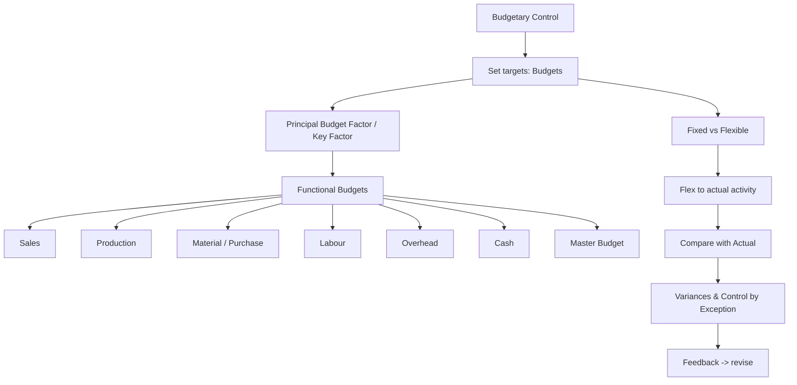

# Q&A — Budgets & Budgetary Control

*CA Intermediate · Cost & Management Accounting · ICAI-aligned · All figures in Rupees (₹)*

---

## The map of this chapter

**First-principles hook:** A budget is a *priced itinerary* — you decide where the business is going (targets), cost every leg of the journey, then check en route whether you are on track. Budgetary control = plan, flex, compare, act.

---

## Section A — Concept-check (with answers)

**A1. Define budgetary control in one line.**
*Answer:* The establishment of budgets relating responsibilities of executives to policy requirements, and the continuous comparison of actual with budgeted results to secure the objective by individual action or revision of policy.

**A2. What is the *principal budget factor* and why is it identified first?**
*Answer:* The factor that limits the activities of the undertaking (e.g., sales demand, material, machine capacity, cash). It is found first because every other budget must be built around it; budgeting the wrong factor first wastes the plan.

**A3. State the core difference between a fixed and a flexible budget.**
*Answer:* A fixed budget is drawn for one level of activity and stays unchanged; a flexible budget is designed to change with the actual level of activity by segregating costs into fixed and variable elements.

**A4. Why is a fixed budget useless as a control tool when volume changes?**
*Answer:* Because it compares actual cost at one activity level with budgeted cost at a *different* activity level — the variance mixes a volume effect with a genuine efficiency/spending effect, so it cannot isolate controllable performance.

**A5. Which items are excluded from a cash budget and why?**
*Answer:* Non-cash items — depreciation, provisions, notional rent, bad-debt provisions, goodwill written off — because a cash budget records only actual cash inflows and outflows, not accounting charges.

**A6. Distinguish zero-based budgeting (ZBB) from incremental budgeting.**
*Answer:* Incremental budgeting takes last year's figures + an increment as the base. ZBB starts from a "zero base" — every activity must be justified afresh each period as a decision package ranked by cost-benefit, so nothing is carried forward unquestioned.

**A7. What is a master budget?**
*Answer:* The consolidated summary of all functional budgets, culminating in a budgeted Profit & Loss Account and budgeted Balance Sheet — the overall financial blueprint.

**A8. Give the production budget identity.**
*Answer:* Units to be produced = Budgeted Sales + Desired Closing Stock of FG − Opening Stock of FG.

**A9. Give the materials purchase (quantity) identity.**
*Answer:* Purchases = Material consumed in production + Desired Closing Stock of RM − Opening Stock of RM.

**A10. What does "control by exception" mean here?**
*Answer:* Management attention is directed only to significant variances (exceptions) between budget and actual, not to every line — saving effort and focusing on what matters.

---

## Section B — Graded computational problems (full workings)

### B1 (Easy) — Production budget

Budgeted sales 12,000 units. Opening FG stock 1,500 units; desired closing FG stock 2,000 units.

**Solution:**
Production = Sales + Closing − Opening = 12,000 + 2,000 − 1,500 = **12,500 units.**

*Check:* Units available = Opening 1,500 + Produced 12,500 = 14,000; less Sales 12,000 = Closing 2,000 ✓.

---

### B2 (Easy-Moderate) — Material purchase budget

From B1, each unit needs 3 kg of material at ₹20/kg. Opening RM stock 4,000 kg; desired closing RM stock 5,000 kg.

**Solution:**
Material consumed = 12,500 units × 3 kg = 37,500 kg.
Purchases (kg) = 37,500 + 5,000 − 4,000 = **38,500 kg.**
Purchases (value) = 38,500 × ₹20 = **₹7,70,000.**

*Check:* RM available = Opening 4,000 + Purchases 38,500 = 42,500 kg; less consumed 37,500 = Closing 5,000 ✓.

---

### B3 (Moderate) — High-Low cost segregation

Overhead observed: at 8,000 units cost ₹94,000; at 12,000 units cost ₹1,26,000.

**Solution:**
Variable rate = (1,26,000 − 94,000) ÷ (12,000 − 8,000) = 32,000 ÷ 4,000 = **₹8/unit.**
Fixed cost = 1,26,000 − (12,000 × 8) = 1,26,000 − 96,000 = **₹30,000.**

*Check at 8,000 units:* 30,000 + 8,000×8 = 30,000 + 64,000 = ₹94,000 ✓.

---

### B4 (Moderate-Hard) — Flexible budget

Using B3 costs, prepare a flexible budget at 8,000, 10,000 and 12,000 units. Selling price ₹25/unit.

| Particulars | 8,000 u | 10,000 u | 12,000 u |
|---|---|---|---|
| Sales (@₹25) | 2,00,000 | 2,50,000 | 3,00,000 |
| Variable OH (@₹8) | 64,000 | 80,000 | 96,000 |
| Fixed OH | 30,000 | 30,000 | 30,000 |
| **Total cost** | 94,000 | 1,10,000 | 1,26,000 |
| **Profit** | 1,06,000 | 1,40,000 | 1,74,000 |

*Check:* Contribution/unit = 25 − 8 = ₹17. At 10,000 u: contribution 1,70,000 − fixed 30,000 = ₹1,40,000 ✓.

---

### B5 (Exam-Hard) — Flexible budget as a control tool, fully reconciled

Budget was set for **10,000 units**: Sales ₹2,50,000; Variable cost ₹8/unit; Fixed cost ₹30,000; budgeted profit ₹1,40,000 (from B4).

**Actual for the period (9,000 units):** Sales ₹2,29,500; Variable cost ₹75,600; Fixed cost ₹31,000.

**Step 1 — Flex the budget to actual 9,000 units:**
Sales = 9,000 × 25 = ₹2,25,000; Variable = 9,000 × 8 = ₹72,000; Fixed = ₹30,000.
Flexed profit = 2,25,000 − 72,000 − 30,000 = **₹1,23,000.**

**Step 2 — Compare actual vs flexed budget:**

| Item | Flexed (9,000 u) | Actual | Variance |
|---|---|---|---|
| Sales | 2,25,000 | 2,29,500 | +4,500 (F) |
| Variable cost | 72,000 | 75,600 | −3,600 (A) |
| Fixed cost | 30,000 | 31,000 | −1,000 (A) |
| **Profit** | 1,23,000 | 1,22,900 | −100 (A) |

**Step 3 — Reconcile original budgeted profit to actual profit:**

| | ₹ |
|---|---|
| Budgeted profit (10,000 u) | 1,40,000 |
| Less: Volume effect (1,000 u × ₹17 contribution) | (17,000) |
| = Flexed budget profit (9,000 u) | 1,23,000 |
| Add: Selling-price variance | 4,500 (F) |
| Less: Variable cost variance | (3,600) (A) |
| Less: Fixed cost (spending) variance | (1,000) (A) |
| **= Actual profit** | **1,22,900** |

*Self-verify:* 1,40,000 − 17,000 + 4,500 − 3,600 − 1,000 = 1,22,900 ✓. The reconciliation ties exactly, and the flexible budget separates the ₹17,000 volume drop (uncontrollable in this comparison) from the small ₹100 net operating shortfall.

---

### B6 (Exam-Hard) — Cash budget

Prepare a cash budget for Apr–Jun.
Opening cash (1 Apr): ₹40,000.
Sales: Feb 1,00,000; Mar 1,20,000; Apr 1,50,000; May 1,60,000; Jun 1,80,000.
Collections: 40% in month of sale, 50% next month, 10% second month after.
Purchases: Apr 80,000; May 90,000; Jun 1,00,000 — paid in the following month.
Wages ₹25,000/month paid same month. Overheads ₹15,000/month (includes ₹5,000 depreciation) paid same month. Machinery ₹60,000 paid in June.

**Collections working:**

| Received in | 40% current | 50% prev | 10% 2-prev | Total |
|---|---|---|---|---|
| Apr | 60,000 (Apr) | 60,000 (Mar) | 10,000 (Feb) | 1,30,000 |
| May | 64,000 (May) | 75,000 (Apr) | 12,000 (Mar) | 1,51,000 |
| Jun | 72,000 (Jun) | 80,000 (May) | 15,000 (Apr) | 1,67,000 |

**Cash overhead** = 15,000 − 5,000 depreciation = **₹10,000/month** (depreciation excluded).

| Particulars | Apr | May | Jun |
|---|---|---|---|
| Opening balance | 40,000 | 20,000 | 41,000 |
| Add: Collections | 1,30,000 | 1,51,000 | 1,67,000 |
| **Total available** | 1,70,000 | 1,71,000 | 2,08,000 |
| Less: Purchases paid | — | 80,000 | 90,000 |
| Less: Wages | 25,000 | 25,000 | 25,000 |
| Less: Cash overheads | 10,000 | 10,000 | 10,000 |
| Less: Machinery | — | — | 60,000 |
| **Total payments** | 35,000 | 1,15,000 | 1,85,000 |
| **Closing balance** | 20,000 | 41,000 | 23,000 |

*Note:* April purchase (80,000) is paid in May; June purchase (1,00,000) is paid in July, so it does not appear here. Depreciation is correctly excluded.

*Check May opening = April closing ₹20,000 ✓; June opening = May closing ₹41,000 ✓.*

---

## Section C — Past-paper-style full questions

### C1. "A flexible budget is superior to a fixed budget for cost control." Discuss. (5 marks)

**Model answer:**
A fixed budget is prepared for a single, pre-determined level of activity and is not adjusted when actual output differs. If actual volume deviates, comparing actual cost against the fixed budget produces variances contaminated by the volume change — management cannot tell whether a cost overrun is due to inefficiency or simply because more units were made.

A flexible budget overcomes this by classifying costs into fixed, variable and semi-variable, then re-casting ("flexing") the cost allowance to the *actual* activity level. Advantages: (i) it isolates genuinely controllable spending and efficiency variances from volume effects; (ii) it is realistic for businesses with seasonal or uncertain demand; (iii) it improves accountability and performance appraisal. Hence for **control** purposes the flexible budget is superior, whereas the fixed budget still serves as the original *planning* benchmark.

### C2. Explain the principal budget factor and give four examples. (4 marks)

**Model answer:**
The principal (key/limiting) budget factor is the constraint that, at a given time, limits the organisation's activity and therefore governs the preparation order of all budgets. The budget for this factor is prepared first; all others are subordinated to it. Examples: (i) **Sales** — insufficient market demand; (ii) **Materials** — shortage/rationing of a key input; (iii) **Labour** — scarcity of skilled workers; (iv) **Plant capacity / machine hours** — bottleneck equipment. Cash availability can also be the key factor.

### C3. Prepare a materials purchase budget. (6 marks)
A company makes products X and Y. Budgeted production: X 5,000 units, Y 4,000 units. Material M per unit: X 2 kg, Y 3 kg. Price ₹50/kg. Opening RM 3,000 kg, closing RM 4,000 kg.

**Model answer:**
Consumption = X(5,000×2) + Y(4,000×3) = 10,000 + 12,000 = 22,000 kg.
Purchases = 22,000 + 4,000 − 3,000 = **23,000 kg.**
Value = 23,000 × ₹50 = **₹11,50,000.**
*Check:* 3,000 + 23,000 − 22,000 = 4,000 kg closing ✓.

---

## Section D — MCQs & case scenarios

**D1.** A budget that remains unchanged regardless of activity level is a:
A) Flexible budget  B) Fixed budget  C) Cash budget  D) Master budget
**Ans: B.** *A fixed budget is set for one activity level and not adjusted.*

**D2.** Using High-Low, cost ₹50,000 at 5,000 u and ₹70,000 at 9,000 u. Variable rate =
A) ₹4  B) ₹5  C) ₹6  D) ₹8
**Ans: B.** *(70,000−50,000)/(9,000−5,000) = 20,000/4,000 = ₹5.*

**D3.** Which is NOT included in a cash budget?
A) Machinery purchase  B) Depreciation  C) Wages paid  D) Tax paid
**Ans: B.** *Depreciation is a non-cash charge, so it is excluded.*

**D4.** ZBB primarily differs from incremental budgeting because it:
A) Uses prior year + increment  B) Requires each activity to be justified from zero  C) Ignores cost-benefit  D) Applies only to cash
**Ans: B.** *Every decision package is re-justified afresh each period.*

**D5.** Production = 20,000 sales, opening FG 2,000, closing FG 3,000. Units produced =
A) 19,000  B) 20,000  C) 21,000  D) 25,000
**Ans: C.** *20,000 + 3,000 − 2,000 = 21,000.*

**D6 (Case).** A firm budgeted profit ₹5,00,000 at 50,000 units (contribution ₹15/u, fixed ₹2,50,000). Actual output 46,000 units. What is the flexed budget profit?
A) ₹4,40,000  B) ₹4,60,000  C) ₹5,00,000  D) ₹4,00,000
**Ans: A.** *Flex contribution 46,000×15 = 6,90,000 − fixed 2,50,000 = ₹4,40,000.* The ₹60,000 fall from budget is purely a volume effect (4,000 u × ₹15).

**D7 (Case).** In D6, if actual fixed cost was ₹2,60,000 and actual contribution ₹6,85,000, the actual profit is:
A) ₹4,25,000  B) ₹4,40,000  C) ₹4,30,000  D) ₹4,20,000
**Ans: A.** *6,85,000 − 2,60,000 = ₹4,25,000; a ₹15,000 adverse operating gap versus the flexed ₹4,40,000 (₹5,000 contribution A + ₹10,000 fixed spend A).*

**D8.** The consolidation of all functional budgets into budgeted P&L and Balance Sheet is the:
A) Sales budget  B) Master budget  C) Flexible budget  D) Capital budget
**Ans: B.** *Master budget = the overall summarised financial plan.*

---

## Connections & examiner traps

- **Standard costing link:** the flexible-budget variance in B5 is the doorway to material/labour/overhead variance analysis — same flex-then-compare logic.
- **CVP link:** contribution per unit (SP − variable cost) drives both the volume variance and break-even; a flexible budget is CVP arithmetic applied to control.
- **Trap 1:** Do NOT deduct opening stock twice — production adds closing and subtracts opening; purchases likewise for RM. Direction matters.
- **Trap 2:** Depreciation, provisions and notional charges must be stripped out of the cash budget (see B6).
- **Trap 3:** Payment/collection *timing lags* — pay a purchase in the month *after* purchase; a purchase in the last month often has no cash outflow in the budget period.
- **Trap 4:** When flexing, fixed cost stays constant in the flexed allowance; only variable cost moves with volume.

## First-principles recap & formula sheet

- Production = Sales + Closing FG − Opening FG
- Purchases = Consumption + Closing RM − Opening RM
- Variable rate (High-Low) = ΔCost ÷ ΔUnits
- Fixed cost = Total cost − (Variable rate × Units)
- Contribution/unit = Selling price − Variable cost/unit
- Volume variance = (Actual − Budget units) × Contribution/unit
- Flexed profit = (Actual units × Contribution/unit) − Fixed cost
- Closing cash = Opening cash + Receipts − Payments (cash items only)
