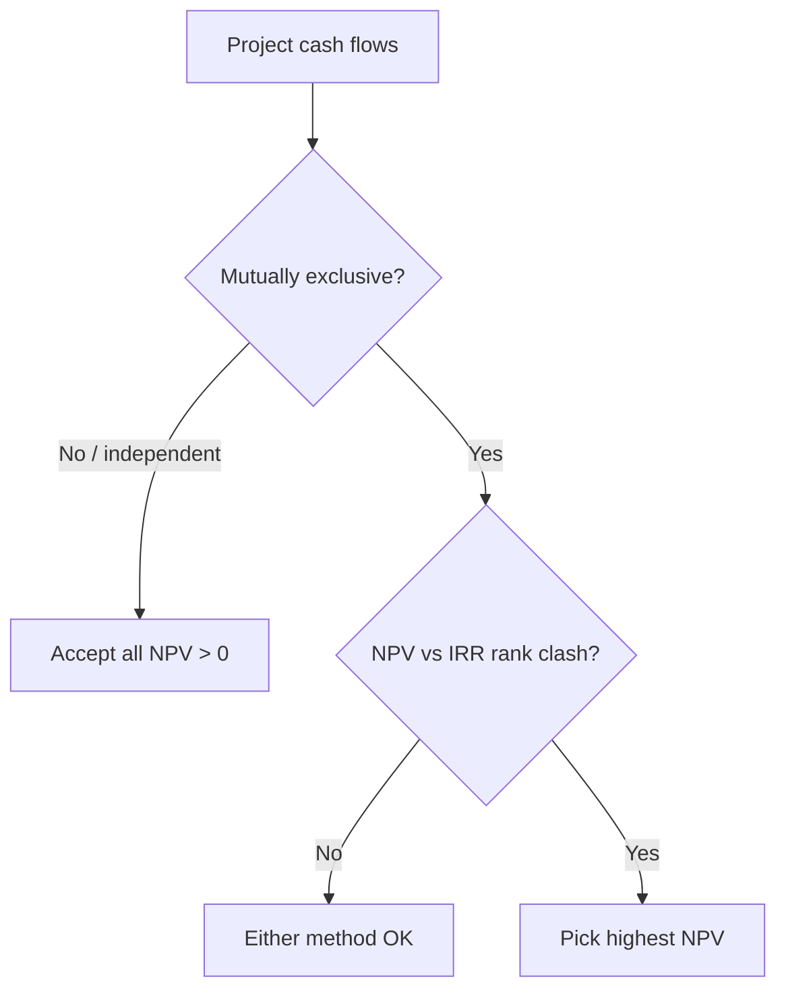
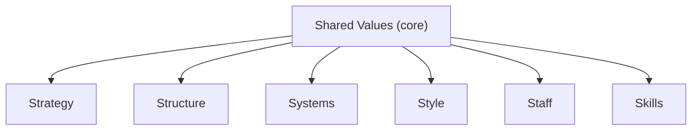

# Financial Management & Strategic Management — Quick-Revision Cheat-Sheet

> Last-mile scan sheet. Terse by design. FM = Sections A; SM = Section B. Symbols: `Kd` cost of debt, `Ke` equity, `Kp` pref, `Ko/WACC` overall.

---

## PART A — FINANCIAL MANAGEMENT

### 1. Scope & Goal
- **Objective:** Wealth (shareholder value) maximisation > Profit maximisation. Wealth = max NPV / max MPS, accounts for **time value + risk + cash flows**; profit max ignores these + is ambiguous.
- **Finance functions:** Investment (capital budgeting) · Financing (capital structure) · Dividend · Liquidity (working capital).
- **Agency cost:** owner–manager conflict; controlled by incentives, monitoring, ESOPs.

### 2. Time Value of Money (TVM)
| Concept | Formula |
|---|---|
| Future Value (single) | `FV = PV(1+i)^n` |
| Present Value (single) | `PV = FV / (1+i)^n` |
| FV of Annuity (ordinary) | `FVA = A·[((1+i)^n − 1)/i]` |
| PV of Annuity (ordinary) | `PVA = A·[(1 − (1+i)^-n)/i]` |
| Annuity **Due** | multiply ordinary result by `(1+i)` |
| Perpetuity | `PV = A / i` |
| Growing perpetuity | `PV = A / (i − g)` |
| Effective Annual Rate | `EAR = (1 + r/m)^m − 1` |

- **Sinking fund factor** = 1 / FVAF. **Capital recovery factor** = 1 / PVAF.
- Rule of 72: doubling period ≈ 72 / rate(%).

### 3. Ratio Analysis
| Category | Ratio | Formula |
|---|---|---|
| Liquidity | Current | CA / CL |
| | Quick/Acid | (CA − Inventory − Prepaid) / CL |
| Solvency | Debt-Equity | Debt / Equity |
| | Interest coverage | EBIT / Interest |
| | Proprietary | Shareholders' funds / Total assets |
| Turnover | Inventory | COGS / Avg inventory |
| | Debtors | Credit sales / Avg debtors |
| | Creditors | Credit purchases / Avg creditors |
| | Total assets | Sales / Avg total assets |
| Profitability | GP margin | GP / Sales |
| | Net margin | PAT / Sales |
| | ROCE | EBIT / Capital employed |
| | ROE | PAT − Pref div / Equity SH funds |
| Market | EPS | (PAT − Pref div) / No. of eq shares |
| | P/E | MPS / EPS |
| | Dividend yield | DPS / MPS |

- **Capital employed** = Equity + Pref + LT debt = Total assets − CL.
- **DuPont:** `ROE = Net margin × Asset turnover × Equity multiplier`.
- Operating cycle days: **Debtors + Inventory − Creditors**.

### 4. Cost of Capital
| Source | Formula |
|---|---|
| Cost of Debt (irredeemable, after-tax) | `Kd = I(1−t)/NP` |
| Cost of Debt (redeemable) | `Kd = [I(1−t) + (RV−NP)/n] / [(RV+NP)/2]` |
| Cost of Pref (irredeemable) | `Kp = PD / NP` |
| Cost of Pref (redeemable) | `Kp = [PD + (RV−NP)/n] / [(RV+NP)/2]` |
| Cost of Equity — Dividend (Gordon) | `Ke = D1/P0 + g` |
| Cost of Equity — Earnings | `Ke = EPS / MPS` |
| Cost of Equity — CAPM | `Ke = Rf + β(Rm − Rf)` |
| Cost of Retained Earnings | `Kr = Ke` (sometimes ×(1−tax)(1−brokerage) for external adj.) |

- `g = b × r` (retention × ROE). `D1 = D0(1+g)`. NP = net proceeds (after flotation).
- **WACC:** `Ko = Σ(weight × cost)`; weights via **book value** or **market value** (MV preferred).
- Marginal cost of capital = cost of raising an additional rupee.

### 5. Capital Structure & Leverage
| Leverage | Formula | Measures |
|---|---|---|
| DOL (operating) | Contribution / EBIT | Business risk |
| DFL (financial) | EBIT / (EBIT − I − Pref div/(1−t)) | Financial risk |
| DCL (combined) | Contribution / [EBIT − I − Pref/(1−t)] = DOL × DFL | Total risk |

- **% change in EPS = DCL × % change in Sales.**
- **Indifference point (EBIT):** EBIT where EPS is equal under two financing plans → equate EPS formulas.
- **Financial BEP:** EBIT that makes EPS = 0 (= I + Pref/(1−t)).
- **Theories:** Net Income (Ko falls as debt ↑) · Net Operating Income (Ko constant, value independent) · **MM** (no-tax: value independent + arbitrage; with tax: value ↑ with debt by tax shield) · Traditional (optimal mix exists, U-shaped WACC).

### 6. Capital Budgeting
| Method | Rule / Formula |
|---|---|
| Payback | Yrs to recover outlay; accept if < target. Ignores TVM & post-payback flows |
| Discounted Payback | Payback on discounted flows |
| ARR | Avg PAT / Avg investment (%) |
| NPV | `Σ CFt/(1+k)^t − Initial outlay`; accept if **NPV > 0** |
| PI / Desirability | PV of inflows / Initial outlay; accept if **> 1** |
| IRR | rate where NPV = 0; accept if **IRR > cost of capital** |
| MIRR | reinvests inflows at cost of capital; fixes multiple-IRR |

- **NPV vs IRR conflict** (mutually exclusive projects) → **choose NPV** (assumes reinvest at k, absolute ₹ value).
- IRR interpolation: `IRR = L + [NPVL / (NPVL − NPVH)] × (H − L)`.
- **Relevant cash flows:** incremental, after-tax, include opportunity cost & WC changes; **exclude sunk cost & allocated overheads**; add back depreciation (non-cash), account **tax shield on depreciation = Dep × t**.
- Terminal year: recover working capital + salvage (after-tax).

### 7. Working Capital Management
- **Net WC = CA − CL.** Gross WC = total CA.
- **Operating (cash) cycle = R + W + F + D − C** (raw-material, WIP, finished-goods, debtors holding − creditors period).
- WC required ≈ (Cost of goods sold / 365) × net operating cycle days; estimate via **each component** (stock, debtors at cost/sales, cash, less creditors).
- **Approaches:** Aggressive (low WC, high risk-return) · Conservative (high WC, low risk-return) · Matching/Hedging (match asset & finance maturity).
- **Receivables:** evaluate credit policy by comparing incremental contribution vs incremental cost (opportunity cost of investment in debtors + bad debts + admin).
- **Cash models:** Baumol (EOQ-type, certain flows) · Miller-Orr (upper/lower control limits, uncertain flows).
- **Inventory EOQ:** `√(2·A·O / C)` — A annual demand, O order cost, C carrying cost/unit.
- **Payables — cost of forgoing discount** ≈ `[d/(100−d)] × [365/(N − t)]`.
- **Sources:** Trade credit, bank finance (CC/OD), factoring, commercial paper, bills discounting, WC term loan.
- **MPBF (Tandon):** Method I = 0.75(CA−CL); Method II = 0.75·CA − CL.

### 8. Dividend Decision
| Model | Key relation |
|---|---|
| **Walter** | `P = [D + (r/Ke)(E − D)] / Ke`. Growth firm r>Ke → payout 0; Decline r<Ke → payout 100%; Normal r=Ke → irrelevant |
| **Gordon** | `P = E(1−b) / (Ke − br)`; dividend relevance, bird-in-hand |
| **MM** | Dividend **irrelevant** under perfect markets + arbitrage; value driven by earning power/investment policy |
| Traditional (Graham-Dodd) | weight on dividends > retained (D×4 + E) |

- Walter/Gordon assume constant r, Ke, all-equity, no external finance.

---

## PART B — STRATEGIC MANAGEMENT

### 1. Core Concepts
- **Strategy levels:** Corporate (which businesses) → Business (how to compete) → Functional (dept execution).
- **Vision** (aspiration/future) → **Mission** (purpose/business now) → **Objectives** (measurable) → **Strategy** → **Policy** (guideline) → **Programme/Budget**.
- **Strategic Management Process:** Environmental scanning → Strategy formulation → Implementation → Evaluation & control.
- **Competitive advantage:** valuable, rare, hard-to-imitate, non-substitutable (VRIN-flavoured) capabilities.

### 2. External Analysis — PESTLE
| P | E | S | T | L | E |
|---|---|---|---|---|---|
| Political | Economic | Socio-cultural | Technological | Legal | Environmental/Ecological |

Macro-environment scan for opportunities & threats.

### 3. Porter's Five Forces (industry attractiveness)
1. Threat of **new entrants** (barriers: scale, capital, brand, switching cost).
2. Bargaining power of **buyers**.
3. Bargaining power of **suppliers**.
4. Threat of **substitutes**.
5. **Rivalry** among existing competitors.
- High forces → low profitability. Used to position & shape strategy.

### 4. Porter's Generic Strategies
| | Low cost | Differentiation |
|---|---|---|
| **Broad target** | Cost Leadership | Differentiation |
| **Narrow target** | Cost Focus | Differentiation Focus |

- Stuck-in-the-middle = no clear advantage → poor performance.

### 5. Value Chain (Porter)
- **Primary:** Inbound logistics → Operations → Outbound logistics → Marketing & Sales → Service.
- **Support:** Firm infrastructure · HRM · Technology development · Procurement.
- Margin = value delivered − cost of activities; find advantage activity-by-activity.

### 6. Ansoff Product-Market Growth Matrix
| | Existing product | New product |
|---|---|---|
| **Existing market** | Market Penetration | Product Development |
| **New market** | Market Development | Diversification (highest risk) |

### 7. BCG Growth-Share Matrix
| | High market share | Low market share |
|---|---|---|
| **High growth** | ★ Star (invest/hold) | ? Question Mark (selective invest / divest) |
| **Low growth** | 🐄 Cash Cow (harvest, fund others) | 🐕 Dog (divest/liquidate) |

- Balance portfolio: cash cows fund stars & selected question marks.

### 8. GE / McKinsey Nine-Cell
- Axes: **Industry attractiveness** × **Business strength**; cells → Invest/Grow · Selectivity/Earn · Harvest/Divest. Richer than BCG (multi-factor).

### 9. ADL Matrix
- Axes: **Stage of industry maturity** (embryonic/growth/mature/ageing) × **competitive position**.

### 10. McKinsey 7S Framework (organisational alignment)

- **Hard S:** Strategy, Structure, Systems. **Soft S:** Style, Staff, Skills, Shared values.
- All must be mutually aligned for effective implementation.

### 11. Strategic Choice & Implementation
- **Corporate strategies:** Stability · Expansion (integration V/H, diversification concentric/conglomerate, internationalisation) · Retrenchment (turnaround, divestment, liquidation) · Combination.
- **Structure follows strategy:** Simple → Functional → Divisional (SBU) → Matrix → Network.
- **Strategic Business Unit (SBU):** independent business, own competitors & strategy, distinct mission.
- **Change management (Lewin):** Unfreeze → Change → Refreeze. Kurt Lewin force-field: driving vs restraining forces.
- **Strategic control types:** Premise · Implementation · Strategic surveillance · Special alert.
- **Benchmarking, TQM, BPR, Six Sigma** = execution/quality tools. BPR = fundamental rethink & radical redesign of processes.

### 12. Digital / New-age (as per ICAI module)
- Networks/tech: e-commerce, m-commerce, social media strategy, big data, AI. **CRM/SCM** integrate value chain digitally.
- Kotler market position roles: **Leader · Challenger · Follower · Nicher.**

---

## Exam Discipline
- **Show formula → substitution → answer**, with units (₹, %, times, days).
- State assumptions (e.g., 365 vs 360 days, book vs market weights) explicitly.
- Round only at final step; carry PVF to 3 decimals.
- SM: answer in **framework + application** form; name the model, then apply to the case.

> ⚠️ **Taxation / rates flag:** Any tax rate, surcharge, cess, threshold, depreciation rate, or slab used in FM sums is **Assessment-Year specific**. Formulas here are AY-neutral — before the exam, confirm the exact current rate/limit against the **latest ICAI Study Material / RTP for your attempt**. Do not memorise a rate from an old edition.
