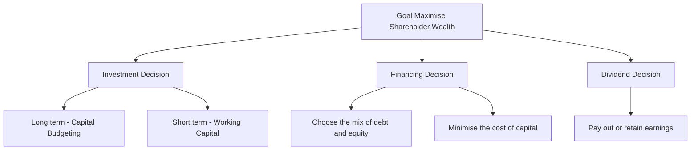
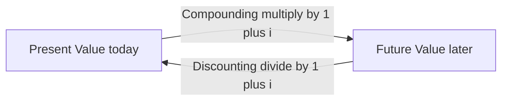
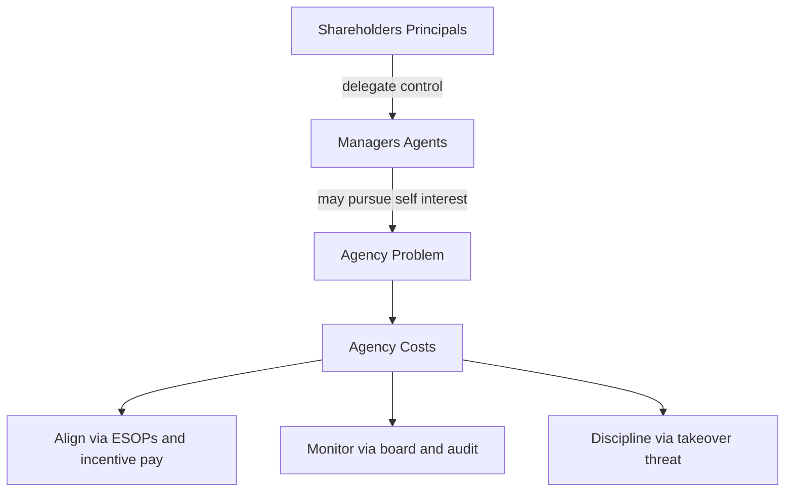
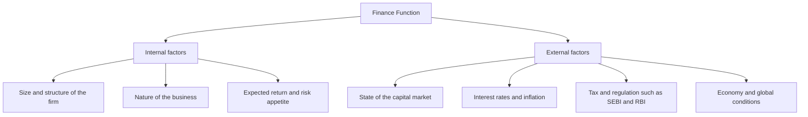

<!-- v2-deep -->

# Chapter 01 — Scope & Objectives of Financial Management

## 1. The Problem

Imagine you are handed the keys to a company on Monday morning. On your desk sit three envelopes.

The first envelope holds a stack of proposals: a new plant in Gujarat, a fleet of delivery trucks, a software system, an acquisition of a rival. Each promises to pay you back — but each swallows crores of cash *today* and dribbles returns back over years, and none of them is a sure thing.

The second envelope asks a different question: *where does the money come from?* You can issue shares, borrow from a bank, float debentures, or plough back last year's profits. Each source has a price, and mixing them wrong can bankrupt a profitable firm.

The third envelope is the quietest but not the least important: at year-end you will have earned some profit. Do you hand it to shareholders as dividend, or keep it inside the company to fund envelope one?

Here is the uncomfortable truth that gives birth to the entire subject of Financial Management: **capital is scarce and every rupee has an alternative use.** A rupee spent on the Gujarat plant is a rupee not spent on trucks, not returned to shareholders, not left in the bank earning interest. The engineer worries about whether the plant *works*; the marketer worries about whether the product *sells*. The finance manager worries about something none of them can see — whether the rupees committed will come back **larger, sooner, and safer** than the rupees committed to any competing use.

No other function in the firm asks that question. Production maximises output. Marketing maximises sales. HR maximises morale. Finance is the one function whose job is to **allocate scarce capital across all the others so that the owners end up wealthier.** That is why finance is a *distinct* function, and this chapter builds the foundation on which the rest of the subject stands.

The three envelopes never go away. Every chapter you will ever study in FM is a deep dive into one of them:

- Envelope 1 → the **Investment Decision** (capital budgeting, working capital).
- Envelope 2 → the **Financing Decision** (cost of capital, capital structure, leverage).
- Envelope 3 → the **Dividend Decision** (dividend policy).

But before we can choose *between* rupees today and rupees tomorrow, we need a common yardstick to compare them — because, as we are about to see, a rupee tomorrow is simply not worth a rupee today.

**A fourth, silent envelope — liquidity.** ICAI increasingly frames a *liquidity decision* alongside the three classic ones. It is really a sub-part of the investment decision (how much of your capital sits idle in cash and near-cash so the firm never defaults on a bill), but the exam sometimes lists it separately. Keep it in mind: the finance manager balances **profitability** (put every rupee to work) against **liquidity** (keep enough rupees safe and ready). This liquidity–profitability tension will reappear in Working Capital Management, and it is the short-horizon twin of the risk–return trade-off that governs the whole subject.

---

## 2. The Core Idea (an analogy)

Think of a finance manager as the **water manager of a hill town** during a dry season.

Water (capital) flows in from a few springs (financing sources) — some clean and free-ish (retained earnings), some pumped up at a cost (borrowings and fresh equity). The manager must decide which fields to irrigate (investment projects). Every field claims its water will grow the most valuable crop, but water sent to one field cannot go to another. And whatever water is left in the tank at night — does the manager release it to the villagers now (dividend), or store it to irrigate more fields tomorrow?

Now add the twist that makes finance *finance*: **water delivered today is worth more than water promised next month.** Today's water is certain and can be put to work immediately; next month's water might never arrive (risk), and even if it does, you lost a month of using it (time). A good water manager instinctively discounts every promise of future water.

That instinct — *future rupees are worth less than present rupees, and the further and riskier they are, the less they are worth* — is the **time value of money**. It is the single idea that turns finance from bookkeeping into decision-making. Every valuation formula in this book is just a machine for translating future rupees into today's rupees so they can be compared on one table.

Hold this analogy: **allocate scarce water, price each spring, and always discount tomorrow's promises against today's certainty.**

**Push the analogy one notch further, because the exam rewards nuance.** The water manager does not just discount future water — she also worries about *who owns the tank*. She is not the owner of the town's water; she is a *steward* hired by the villagers (shareholders). She may be tempted to build a grand aqueduct with her name on it (empire-building) even if a humble pipe would serve the villagers better. That temptation is the **agency problem** of §4.6. And she must never poison a neighbouring village's stream to fill her own tank faster (harming stakeholders), because next season she will need that neighbour's goodwill. So the full instruction is richer: *allocate scarce water, price each spring, discount every promise — and do it as an honest steward, not a self-serving one, without wrecking the watershed you all share.* That single sentence contains investment, financing, dividend, time value, agency, and stakeholder theory — the entire chapter in one breath.

---

## 3. Why It's Built This Way

### Why a separate finance function at all?

Historically, in small owner-run firms, the owner *was* the finance manager — he felt every rupee leave his own pocket. As firms grew, ownership (shareholders) separated from control (managers). Once that happened, someone inside the firm had to be formally charged with looking after the owners' rupees. That someone is the finance function, and its mandate is deliberately narrow and powerful: **take decisions that increase the wealth of the owners.**

Note the scope has widened over the decades:

- **Traditional (pre-1950s) view** — finance = *procurement of funds*. Its job was to raise money when the firm needed it (issues, loans) and keep the paperwork straight. Narrow, episodic, outsider's view of the firm.
- **Modern view** — finance = *procurement AND efficient utilisation of funds*. It is continuous, decision-oriented, and covers all three envelopes plus risk management. This is the view ICAI examines.

**Why the traditional view had to die — the three specific charges against it.** The exam sometimes asks you to *criticise* the traditional approach, so hold these three faults ready: (i) it was **outsider-looking** — it saw the firm only from the viewpoint of those *supplying* funds (investors, bankers), never from inside where the funds are *used*; (ii) it over-emphasised **episodic, long-term financing** (issues of shares/debentures, mergers, reorganisations) and ignored the daily, routine problem of **working-capital financing**; and (iii) it treated finance as a **fund-raising** exercise, giving no thought to whether the raised funds were **allocated and utilised** efficiently. The modern approach cures all three by making finance a *continuous, analytical, decision-making* function concerned equally with raising *and* deploying capital.

### Why must there be a single, clear objective?

A manager facing the three envelopes needs a **decision rule** — a single criterion that says "choose A over B." Without one clear objective, every decision becomes a debate. So finance theory insists on *one* overarching goal against which every choice is tested. The candidates are **profit maximisation** and **wealth maximisation** — and the whole intellectual battle of Section 4 is deciding which one deserves to be the master rule. Spoiler: wealth wins, and it wins *because* of the time value of money and risk, which is exactly why TVM sits at the heart of this chapter.

**Why not "maximise sales" or "maximise market share" as the master rule?** Because those are *means*, not *ends*. A firm can grow sales by slashing prices below cost and destroy owner wealth in the process. Any candidate objective must be tested against one question: *does pursuing it reliably make the owners richer?* Sales, market share, and even accounting profit can all move *opposite* to owner wealth in specific cases; only the present value of cash flows to owners cannot, because it *is* owner wealth by definition. This is the deeper reason wealth maximisation is not just "better" but *definitionally correct* — it is the only objective that is the goal itself rather than a proxy for it.

**Why one objective, not many?** Multi-objective management ("maximise profit AND employment AND environment AND market share") sounds wise but is operationally useless: when two objectives conflict — and they routinely do — you have no rule to break the tie. Finance therefore adopts a **single objective with constraints**: maximise owner wealth *subject to* legal, ethical, and stakeholder constraints. The constraints bound the search; the single objective directs it. This "constrained maximisation" framing is the sophisticated answer to the exam question "Is wealth maximisation socially irresponsible?" — no, because responsibility enters as a binding constraint, not as a competing objective.

---

## 4. Full Technical Content

### 4.1 Finance function and its scope

**Financial Management** is the managerial activity concerned with the **planning and controlling of the firm's financial resources.** Operationally it answers three questions:

*Figure 4.1 — The three financial decisions all serve one master goal: maximising the wealth of shareholders.*

**The Investment Decision** — allocating capital to assets.
- *Long-term* (Capital Budgeting): should we buy the plant, launch the product, make the acquisition? These commit large sums for years and are largely irreversible. Judged by whether they earn more than the cost of the capital they consume.
- *Short-term* (Working Capital Management): how much to hold in inventory, receivables and cash. Judged by the trade-off between liquidity (safety) and profitability.

**The Financing Decision** — deciding the **capital structure**, i.e. the proportion of debt to equity. Debt is cheaper (interest is tax-deductible, lenders take less risk) but adds fixed obligations and financial risk. The aim is the mix that **minimises the overall cost of capital**, because a lower cost of capital raises the value of the firm.

**The Dividend Decision** — splitting earnings between **payout** (dividend to shareholders now) and **retention** (reinvestment). The rule: retain only so long as the firm can reinvest at a return above what shareholders could earn elsewhere; otherwise, pay it out.

**A finer distinction the exam tests — decision vs. its measurement tool.** Each decision has a companion *criterion*, and mixing them up loses marks:

| Decision | Central question | Primary tool / criterion |
|---|---|---|
| Investment (long-term) | Which projects? | NPV, IRR, PI, payback |
| Investment (short-term) | How much liquidity? | Operating cycle, liquidity–profitability trade-off |
| Financing | What debt–equity mix? | Cost of capital (WACC), leverage, EBIT–EPS analysis |
| Dividend | Pay or retain? | Walter, Gordon, MM models; payout ratio |

**Why the investment decision is considered the *most important* of the three.** ICAI material ranks it first because it *creates* value directly: value is generated on the asset side of the balance sheet, when a project earns more than the capital it consumes. Financing and dividend decisions largely *redistribute* or *re-price* that value (they change *k*, or split the pie between now and later), whereas a good investment *enlarges* the pie. A firm can survive a mediocre financing policy; it cannot survive systematically negative-NPV investments.

### 4.2 Profit maximisation vs Wealth maximisation

**Profit maximisation** says: choose whatever action makes accounting profit as large as possible. It sounds obviously right — and it is the traditional yardstick — but it fails on four counts.

| Weakness of Profit Maximisation | What goes wrong |
|---|---|
| **Ambiguous** | "Profit" is undefined — profit before or after tax? Total profit or per share? Short-run or long-run? A vague objective cannot be a decision rule. |
| **Ignores timing (time value)** | Rs. 1,00,000 profit in Year 1 is treated the same as Rs. 1,00,000 in Year 5, though the earlier rupee is worth more. |
| **Ignores risk** | A safe project and a wildly risky project with the same expected profit are treated as equal, though shareholders clearly prefer the safe one. |
| **Ignores quality/cash** | Accounting profit is an opinion; cash is a fact. Profit can be inflated by credit sales that never get collected. |

**Wealth maximisation** (also *Net Present Value maximisation* or *maximising the market value of equity*) fixes all four. It says: choose the action that **maximises the present value of the expected future cash flows to shareholders, discounted at a rate reflecting their risk.** Formally, the wealth created by a decision is:

$$\text{Net Present Value} = \sum_{t=1}^{n} \frac{C_t}{(1+k)^t} - C_0$$

where \(C_t\) is the expected **cash flow** in year *t*, \(k\) is the discount rate capturing **risk** and **time**, and \(C_0\) is the initial outlay. A decision creates wealth only when NPV > 0.

Why wealth wins — read the formula against the table:
- It uses **cash flows**, not accounting profit → solves ambiguity and quality.
- It **discounts by time** through \((1+k)^t\) → solves timing.
- It **discounts by risk** through a higher \(k\) for riskier flows → solves risk.

So wealth maximisation is not a different *goal* from profit — it is profit maximisation done *honestly*, correcting for **time and risk**. This is precisely why we now build the machinery of time value of money: it is the engine inside the wealth objective.

**The one honest argument *for* profit maximisation — and why it still loses.** Do not dismiss profit maximisation as stupid; the exam respects a balanced answer. Its defenders make a real point: profit is the *source* of the firm's survival and the *reward* for efficient resource use — a firm that never profits eventually dies, so profit is a necessary condition. The rebuttal is precise: profit is a *necessary* condition for wealth but not a *sufficient objective*, because a firm can raise reported profit while *destroying* wealth (e.g. by cutting R&D and maintenance, or booking risky credit sales). Necessary condition, wrong objective. That single sentence is worth full marks.

**Two sub-flavours of profit maximisation the examiner may split hairs over:**
- **Total profit maximisation** — maximise absolute rupees of profit. Flawed further because a firm could raise total profit merely by issuing more shares and investing the proceeds at *any* positive return, even one *below* the cost of capital — diluting existing owners while total profit rises.
- **Earnings-per-share (EPS) maximisation** — a supposed fix that maximises profit *per share*. Better, but still ignores timing, risk, dividend policy and the fact that EPS can be manipulated by buy-backs and by the *timing* of income recognition. Wealth maximisation subsumes and corrects both.

**Value maximisation vs. wealth maximisation — a subtle labelling the exam likes.** "Maximise the value of the firm" (all providers of capital) and "maximise shareholder wealth" (equity only) are close cousins but not identical: firm value = value of debt + value of equity. Since the *contractual* claims of lenders are relatively fixed, actions that raise total firm value generally raise the *residual* equity value too — so the two align. But where they diverge (e.g. a risky bet that transfers value *from* lenders *to* shareholders), ICAI's stated financial objective is **shareholder wealth**, bounded by the ethical/stakeholder constraint that you do not simply expropriate lenders.

> **Value vs Values note:** the ICAI syllabus stresses that wealth maximisation must operate within legal and ethical limits and considers *all* stakeholders (see §4.6). Maximising owners' wealth is the financial objective; it is pursued responsibly, not ruthlessly.

### 4.3 Time Value of Money — the foundation

**Why money has a time value** — three reasons, all real:
1. **Preference for present consumption** — people would rather have a rupee now than later; to give it up they demand compensation.
2. **Reinvestment / opportunity** — a rupee today can be invested to grow; a rupee next year lost that year of growth.
3. **Risk and inflation** — future rupees are uncertain and buy less.

The compensation demanded is the **interest rate / required rate of return / discount rate.** Two operations translate rupees across time:

- **Compounding** — pushing a present sum *forward* to a future value.
- **Discounting** — pulling a future sum *back* to a present value.

They are mirror images.

*Figure 4.2 — Compounding moves money forward in time; discounting moves it back. The interest rate is the bridge.*

**The discount rate has three layers — decompose it and the whole subject clicks.** The single symbol *i* (or *k*) is not one thing; it is a stack:

$$k \approx \text{real risk-free rate} + \text{inflation premium} + \text{risk premium}$$

The first two layers together give the **nominal risk-free rate** (think government-security yield); the third layer is what the market charges for *this project's* uncertainty. This decomposition is why a riskier Project Y in Example 3 gets a *higher* *k* than a safe Project X: same time layers, bigger risk layer. Understanding this stops you from ever asking "which single interest rate do I use?" — you *build* the rate from the risk of the cash flow you are discounting.

#### (a) Future Value of a single sum (compounding)

$$FV = PV \times (1+i)^n$$

The factor \((1+i)^n\) is the **Future Value Interest Factor (FVIF).** Interest earns interest — that is *compounding*.

If interest is compounded *m* times a year:

$$FV = PV \times \left(1 + \frac{i}{m}\right)^{m \times n}$$

**Effective Annual Rate** (the true annual rate once intra-year compounding is counted):

$$EAR = \left(1 + \frac{i}{m}\right)^{m} - 1$$

**Continuous compounding — the limit the exam occasionally flags.** As *m* → ∞, the intra-year formula approaches \(FV = PV \times e^{i \times n}\), and \(EAR = e^{i} - 1\). You will rarely compute this in CA Intermediate, but recognise it as the *ceiling* on how much intra-year compounding can add: at 12% nominal, quarterly gives EAR 12.55%, monthly 12.68%, continuous 12.75% — diminishing returns as frequency rises. Knowing the ceiling exists is a useful sanity check on any EAR you compute.

#### (b) Present Value of a single sum (discounting)

$$PV = \frac{FV}{(1+i)^n} = FV \times \frac{1}{(1+i)^n}$$

The factor \(\frac{1}{(1+i)^n}\) is the **Present Value Interest Factor (PVIF).** This is the workhorse of all valuation.

#### (c) Annuities — a series of equal cash flows

An **annuity** is an equal amount paid/received at equal intervals for a fixed number of periods (e.g. Rs. 10,000 a year for 5 years). Two flavours:
- **Ordinary annuity (deferred)** — cash flows at the *end* of each period (the exam default).
- **Annuity due** — cash flows at the *beginning* of each period.

**Future Value of an Ordinary Annuity:**

$$FVA = A \times \frac{(1+i)^n - 1}{i}$$

The bracketed factor is the **FVIFA** (annuity compounding factor). *Why this shape?* Each instalment compounds for a different number of periods; summing the geometric series collapses to this formula.

**Present Value of an Ordinary Annuity:**

$$PVA = A \times \frac{1 - (1+i)^{-n}}{i}$$

The bracketed factor is the **PVIFA** (annuity discounting factor).

**Annuity due** — because every cash flow arrives one period *earlier*, multiply the ordinary-annuity result by \((1+i)\):

$$FV_{due} = FVA \times (1+i); \qquad PV_{due} = PVA \times (1+i)$$

**Perpetuity** — an annuity that never ends:

$$PV_{perpetuity} = \frac{A}{i}$$

**Growing perpetuity** (cash flow grows at rate *g* forever, needs *i > g*):

$$PV = \frac{A_1}{i - g}$$

This last one is the seed of the dividend-growth valuation model you will meet later — proof that TVM is not an isolated topic but the grammar of the whole subject.

**Deferred annuity — the trap hidden inside PVIFA.** If the first cash flow of an *n*-year annuity does not start at the end of Year 1 but is *deferred* to begin later (say the first receipt is at the end of Year 4), value it in two steps: (1) apply PVIFA to get the value *one period before the first cash flow* (here, at the end of Year 3), then (2) discount that lump sum back to today with a PVIF. Concretely, PV = A × PVIFA(i, n) × PVIF(i, d), where *d* is the deferment (number of years to one period before the first flow). Students who blindly apply PVIFA(i, total-years) get this wrong; the examiner sets it deliberately.

**Growing annuity (finite, growing stream) — for completeness.** When a stream grows at *g* for a *finite* n years, PV = \(\frac{A_1}{i-g}\left[1-\left(\frac{1+g}{1+i}\right)^n\right]\). Rarely examined directly at Intermediate, but it explains *why* the growing perpetuity is just its n → ∞ limit and reinforces that all these formulas are one geometric-series family, not separate spells to memorise.

### 4.4 Sinking fund, capital recovery and doubling — derived uses

- **Sinking fund** (how much to set aside each year to reach a target *FV*): rearrange FVA →
$$A = FV \times \frac{i}{(1+i)^n - 1}$$
- **Capital recovery / loan instalment** (annual payment to repay a present loan *PV*): rearrange PVA →
$$A = PV \times \frac{i}{1 - (1+i)^{-n}}$$
- **Rule of 72** (quick doubling time): years to double ≈ 72 ÷ interest rate (%). A handy sanity check, not an exam formula.

**Sinking-fund factor and capital-recovery factor are reciprocals-with-a-twist — and both are just inverted annuity factors.** The sinking-fund factor is 1/FVIFA; the capital-recovery factor is 1/PVIFA. Seeing them this way means you never memorise four factors — you memorise *two* (FVIFA, PVIFA) and *invert* when the unknown is the instalment rather than the total. This is the single highest-leverage insight in TVM problem-solving: identify *which quantity is unknown*, and the formula rearranges itself.

**A loan-amortisation subtlety examiners love: splitting each instalment into interest and principal.** The equal instalment from the capital-recovery formula is *constant*, but its *composition* shifts every year — early instalments are mostly interest, later ones mostly principal (because interest is charged on the *declining* outstanding balance). If a question asks for the "interest component of the 2nd instalment" or the "principal outstanding after 3 years," you must build an **amortisation schedule**: each year, interest = opening balance × i; principal repaid = instalment − interest; closing balance = opening − principal. Example 5 below drills exactly this.

### 4.5 Functions of a finance manager (the CFO's day)

Estimating capital requirements; deciding capital structure; selecting sources of funds; investing funds (capital budgeting + working capital); managing surplus (dividend vs retention); managing cash and liquidity; and **financial control** (monitoring that funds are used as planned). Two supporting concepts appear throughout: **risk–return trade-off** (higher return only by accepting higher risk) and the recognition that **market value**, not book value, measures success.

**Executive (routine) vs. non-executive (managerial) finance functions — a classification ICAI lists.** The *managerial/strategic* functions are the three big decisions (investment, financing, dividend) plus overall financial planning and control — these require judgement and shape value. The *routine/executive* functions are the clerical machinery that keeps money moving: record-keeping, cash receipts and disbursements, custody and safeguarding of securities and cash, and supplying financial information. The distinction matters because exam questions on "scope of the finance function" expect you to show *both* the value-creating decisions *and* the day-to-day treasury/control routines that support them.

**Where the finance function sits — Treasurer vs. Controller.** Large firms split finance into two offices: the **Treasurer** looks *outward and forward* (raising funds, managing cash and banking relations, credit, investments, insurance) while the **Controller** looks *inward and backward* (accounting, audit, budgeting, taxes, reporting, internal control). Both report to the CFO. This split is the organisational face of the "procurement vs. utilisation" idea from §3.

### 4.6 Agency problem and stakeholders

Because owners (shareholders/principals) hire managers (agents) to run the firm, an **agency problem** arises: managers may pursue their own interests — job security, perks, empire-building, avoiding risky-but-valuable projects — instead of maximising owners' wealth. The costs of monitoring and aligning them are **agency costs.**

Alignment mechanisms: performance-linked pay and **ESOPs** (stock options tie manager wealth to share price), board and audit oversight, debt covenants, the threat of **takeover** (poor managers get replaced), and market/regulatory discipline (SEBI, listing norms).

**The three components of agency cost — the exam wants the breakdown, not just the phrase.** Agency cost = (i) **monitoring costs** borne by principals (audits, boards, reporting systems that watch the agent); (ii) **bonding costs** borne by the agent to *credibly commit* to good behaviour (e.g. accepting restrictive covenants, deferred pay); and (iii) **residual loss** — the wealth still lost because alignment is never perfect. Note the direction (repeated in Traps §10): the manager's *ordinary salary* is **not** an agency cost; the *extra* cost of the conflict and its control is.

**A second agency conflict the exam tests: shareholders vs. debt-holders.** The classic conflict is owner vs. manager, but there is a second: once a firm has borrowed, *shareholders* (through managers) may act against *lenders'* interests — taking on riskier projects than lenders priced for ("asset substitution"), or paying large dividends that drain the cushion lenders relied on. Lenders anticipate this and protect themselves with **debt covenants** (limits on further borrowing, dividends, asset sales) and security. This is why "wealth maximisation bounded by stakeholder constraints" is not woolly ethics — it is enforced contractually.

**Stakeholder view:** the firm also owes duties to lenders, employees, customers, suppliers, government and society. Modern FM holds that *sustainable* wealth maximisation is impossible while abusing stakeholders — a firm that cheats customers or pollutes destroys long-run value. So wealth maximisation is the objective, pursued within ethical, legal and stakeholder-respecting bounds.

*Figure 4.3 — The separation of ownership from control creates the agency problem; alignment and monitoring mechanisms bring managers back in line with owners.*

### 4.7 Emerging role and environment of the finance function

The exam increasingly asks about the *changing* scope of finance. Beyond the three decisions, the modern finance manager handles **risk management** (hedging currency, interest-rate and commodity exposure using derivatives), **treasury and forex** in a globalised firm, **financial engineering** (designing hybrid instruments), and interaction with a web of **regulators and markets**.

*Figure 4.7 — The finance function is shaped by controllable internal factors and largely uncontrollable external factors; good financial management adapts the firm to both.*

**Why this matters for the objective.** External factors move the discount rate *k* (rising interest rates lift *k*, shrinking the PV of every future rupee) and the availability/cost of each financing source. So the "environment" is not decorative context — it directly feeds the numbers inside the wealth-maximisation formula. A question on "factors affecting the finance function" is answered well by tying each factor back to how it changes *cash flows* or *k*.

---

## 5. Worked Examples

Assume annual compounding unless stated. I show every factor so you can reconcile by hand.

### Example 1 (Easy) — Future value, present value, and why timing matters

Mr. A can receive **Rs. 1,00,000 today** or **Rs. 1,30,000 after 3 years.** His opportunity rate is **10% p.a.** Which is better? Prove it two ways.

**Method A — push today's money forward (compounding).**
$$FV = 1{,}00{,}000 \times (1.10)^3$$
\((1.10)^3 = 1.331\), so \(FV = 1{,}00{,}000 \times 1.331 = \textbf{Rs. 1,33,100}.\)

If he takes Rs. 1,00,000 today and invests at 10%, in 3 years he has Rs. 1,33,100 — **more** than the Rs. 1,30,000 offer. Take the money today.

**Method B — pull the future offer back (discounting).**
$$PV = 1{,}30{,}000 \times \frac{1}{(1.10)^3} = 1{,}30{,}000 \times 0.7513 = \textbf{Rs. 97,669.}$$

The Rs. 1,30,000 promise is worth only Rs. 97,669 today — **less** than Rs. 1,00,000. Same conclusion. 

*Reconciliation check:* discounting Method A's answer back gives \(1{,}33{,}100 \times 0.7513 = 1{,}00{,}000\) ✓, and compounding Method B's answer gives \(97{,}669 \times 1.331 = 1{,}30{,}000\) ✓. The two operations are exact inverses. **This is why profit maximisation, which ignores the 3-year gap, would wrongly call Rs. 1,30,000 the bigger number — and why wealth maximisation is right.**

**What if the examiner tweaks it?** Suppose the opportunity rate were **8%** instead of 10%. Then \((1.08)^3 = 1.2597\), PVIF = 0.7938, and the Rs. 1,30,000 promise is worth \(1{,}30{,}000 \times 0.7938 = \text{Rs. 1,03,194}\) today — now the *future* offer wins. **The decision flips on the discount rate**, which is the whole lesson: the answer is not in the rupees, it is in the rupees *and* the rate. The *break-even* rate is where \(1{,}00{,}000(1+i)^3 = 1{,}30{,}000\), i.e. \((1+i)^3 = 1.30\), \(i = 1.30^{1/3} - 1 \approx 9.14\%\). Below ~9.14% take the future offer; above it, take the money now. Stating a break-even like this earns extra credit.

### Example 2 (Moderate) — Annuities, sinking fund, and effective rate

**Part (i) — PV of an ordinary annuity.** A project pays **Rs. 50,000 at the end of each year for 5 years.** Discount rate **12%.** What is it worth today?

$$PVIFA_{12\%,5} = \frac{1-(1.12)^{-5}}{0.12}$$
\((1.12)^5 = 1.7623\Rightarrow(1.12)^{-5}=0.5674\). So \(PVIFA = \frac{1-0.5674}{0.12} = \frac{0.4326}{0.12} = 3.6048.\)
$$PVA = 50{,}000 \times 3.6048 = \textbf{Rs. 1,80,240.}$$

*Reconcile year by year* (PVIF at 12%): 0.8929, 0.7972, 0.7118, 0.6355, 0.5674 → sum = 3.6048 ✓ (matches the annuity factor). Individual PVs: 44,645 + 39,860 + 35,590 + 31,775 + 28,370 = **Rs. 1,80,240** ✓.

**Part (ii) — Annuity due.** If instead the Rs. 50,000 arrives at the **beginning** of each year:
$$PV_{due} = 1{,}80{,}240 \times 1.12 = \textbf{Rs. 2,01,869.}$$
It is worth more because every rupee arrives one year sooner.

**Part (iii) — Sinking fund.** The firm must accumulate **Rs. 10,00,000 in 4 years** to replace a machine, investing yearly at **10%.** Annual deposit?
$$FVIFA_{10\%,4} = \frac{(1.10)^4 - 1}{0.10} = \frac{1.4641 - 1}{0.10} = 4.641.$$
$$A = \frac{10{,}00{,}000}{4.641} = \textbf{Rs. 2,15,471 per year.}$$
*Check:* 2,15,471 × 4.641 = 10,00,000 ✓.

**Part (iv) — Effective annual rate.** A bank quotes **12% compounded quarterly.** True annual cost?
$$EAR = \left(1+\frac{0.12}{4}\right)^4 - 1 = (1.03)^4 - 1 = 1.1255 - 1 = \textbf{12.55\%.}$$
The "12%" is a nominal illusion; the borrower actually pays 12.55%. Quality of the number matters — a lesson wealth maximisation takes seriously and profit maximisation ignores.

**What if the examiner tweaks it — deferred annuity twist.** Suppose in Part (i) the first Rs. 50,000 does not arrive at the end of Year 1 but is **deferred so the five receipts fall at the end of Years 4 to 8.** Value the 5-year annuity as at end of Year 3, then discount 3 years to today: \(PV = 50{,}000 \times PVIFA_{12\%,5} \times PVIF_{12\%,3} = 50{,}000 \times 3.6048 \times 0.7118 = 1{,}80{,}240 \times 0.7118 = \textbf{Rs. 1,28,295.}\) Far less than Rs. 1,80,240 — the three-year wait costs over Rs. 51,000 of present value. Missing the extra PVIF discount is the classic deferred-annuity error.

### Example 3 (Exam-hard) — Wealth vs profit, with risk, using NPV

A company evaluates two mutually exclusive projects, each costing **Rs. 10,00,000** today, life 3 years. Cash flows and the risk-adjusted discount rate differ:

| Year | Project X cash flow (Rs.) | Project Y cash flow (Rs.) |
|---|---|---|
| 1 | 2,00,000 | 6,00,000 |
| 2 | 4,00,000 | 4,00,000 |
| 3 | 7,00,000 | 3,00,000 |
| **Total** | **13,00,000** | **13,00,000** |

Both return the same **total** cash (Rs. 13,00,000) — so **profit maximisation is indifferent.** But X is a stable, low-risk project discounted at **10%**, while Y is a volatile, high-risk project the market discounts at **14%.** Which creates more shareholder wealth?

**Project X @ 10%** (PVIF: 0.9091, 0.8264, 0.7513):

| Year | Cash flow | PVIF@10% | PV (Rs.) |
|---|---|---|---|
| 1 | 2,00,000 | 0.9091 | 1,81,820 |
| 2 | 4,00,000 | 0.8264 | 3,30,560 |
| 3 | 7,00,000 | 0.7513 | 5,25,910 |
| | | **Total PV** | **10,38,290** |

NPV(X) = 10,38,290 − 10,00,000 = **Rs. +38,290.**

**Project Y @ 14%** (PVIF: 0.8772, 0.7695, 0.6750):

| Year | Cash flow | PVIF@14% | PV (Rs.) |
|---|---|---|---|
| 1 | 6,00,000 | 0.8772 | 5,26,320 |
| 2 | 4,00,000 | 0.7695 | 3,07,800 |
| 3 | 3,00,000 | 0.6750 | 2,02,500 |
| | | **Total PV** | **10,36,620** |

NPV(Y) = 10,36,620 − 10,00,000 = **Rs. +36,620.**

**Decision:** By profit maximisation the two are a dead heat (both earn Rs. 3,00,000 "accounting surplus" over 3 years). By **wealth maximisation, choose Project X** — it creates Rs. 38,290 of shareholder wealth versus Rs. 36,620 for Y.

**Where did the difference come from?** Two forces fought each other. Y front-loads its cash (good — earlier rupees are worth more), which *helped* it. But Y carries higher risk, so the market discounts it at 14% (bad — it shrinks every rupee), which *hurt* it. Here the risk penalty just outweighed the timing advantage, so X wins narrowly. **Profit maximisation is blind to both forces; wealth maximisation prices both — exactly why it is the superior objective.**

*Self-verification:* recompute X's Year-3 PV: 7,00,000 × 0.7513 = 5,25,910 ✓; sum 1,81,820+3,30,560+5,25,910 = 10,38,290 ✓. Y: 5,26,320+3,07,800+2,02,500 = 10,36,620 ✓. Both NPVs positive, so both are acceptable in isolation; being mutually exclusive, the higher-NPV project (X) is chosen.

**What if the examiner tweaks it — same risk for both.** If the market judged Y to be *no riskier* than X and discounted **both at 10%**, then Y's PV = 6,00,000(0.9091) + 4,00,000(0.8264) + 3,00,000(0.7513) = 5,45,460 + 3,30,560 + 2,25,390 = 11,01,410, giving NPV(Y) = **Rs. +1,01,410** — now Y *wins decisively* because its front-loaded cash is no longer penalised. **The reversal proves the risk premium, not the timing, was doing the work in the original problem.** This paired comparison — same cash flows, one variable changed — is exactly how ICAI isolates a concept, and reproducing it in your answer signals mastery.

### Example 4 (Exam-hard) — Loan instalment, amortisation split, and the interest hidden in EMIs

A firm borrows **Rs. 20,00,000** repayable in **4 equal year-end instalments** at **10% p.a.** Find the annual instalment, then split the *second* instalment into interest and principal.

**Step 1 — the instalment (capital recovery).**
$$PVIFA_{10\%,4} = \frac{1-(1.10)^{-4}}{0.10} = \frac{1-0.6830}{0.10} = \frac{0.3170}{0.10} = 3.1699.$$
$$A = \frac{20{,}00{,}000}{3.1699} = \textbf{Rs. 6,30,942 per year.}$$
(Reciprocal check: capital-recovery factor = 1/3.1699 = 0.31547; 20,00,000 × 0.31547 = 6,30,940, rounding aside ✓.)

**Step 2 — amortisation schedule** (interest = opening × 10%; principal = instalment − interest):

| Year | Opening balance | Instalment | Interest @10% | Principal repaid | Closing balance |
|---|---|---|---|---|---|
| 1 | 20,00,000 | 6,30,942 | 2,00,000 | 4,30,942 | 15,69,058 |
| 2 | 15,69,058 | 6,30,942 | 1,56,906 | 4,74,036 | 10,95,022 |
| 3 | 10,95,022 | 6,30,942 | 1,09,502 | 5,21,440 | 5,73,582 |
| 4 | 5,73,582 | 6,30,942 | 57,358 | 5,73,584 | ~0 |

**Answer:** the second instalment of Rs. 6,30,942 splits into **interest Rs. 1,56,906** and **principal Rs. 4,74,036.**

*Self-verification:* the closing balance after Year 4 is ~Rs. 2 (pure rounding), confirming the schedule is internally consistent — the loan is fully amortised. Notice the interest component *falls* each year (2,00,000 → 1,56,906 → 1,09,502 → 57,358) while the principal component *rises*, because interest is charged only on the shrinking outstanding balance. **Exam point:** if asked for "total interest paid," sum the interest column = Rs. 5,23,766; equivalently, 4 × 6,30,942 − 20,00,000 = 25,23,768 − 20,00,000 = Rs. 5,23,768 (rounding aside) ✓ — two independent routes to the same number.

### Example 5 (Moderate–hard) — Retain or pay? The dividend decision as a TVM problem

A company has **Rs. 10,00,000** of surplus earnings. It can either **pay it out as dividend now**, letting shareholders invest elsewhere at their **opportunity rate of 12%**, or **retain and reinvest** it inside the firm. Two scenarios for the internal reinvestment return *r*:

- **Scenario A:** the firm can reinvest at **r = 15%**, producing **Rs. 11,50,000** in one year.
- **Scenario B:** the firm can reinvest at **r = 9%**, producing **Rs. 10,90,000** in one year.

Which scenario justifies *retention*, and why? Value each on a present-value basis using the shareholders' 12% opportunity rate.

**Scenario A — retain and earn 15%.**
$$PV_{\text{retain}} = \frac{11{,}50{,}000}{1.12} = 11{,}50{,}000 \times 0.8929 = \textbf{Rs. 10,26,835.}$$
Retaining is worth Rs. 10,26,835 today versus Rs. 10,00,000 paid out now → retention **adds** Rs. 26,835 of wealth. **Retain.**

**Scenario B — retain and earn 9%.**
$$PV_{\text{retain}} = \frac{10{,}90{,}000}{1.12} = 10{,}90{,}000 \times 0.8929 = \textbf{Rs. 9,73,261.}$$
Retaining is worth only Rs. 9,73,261 versus Rs. 10,00,000 paid out → retention **destroys** Rs. 26,739 of wealth. **Pay it out.**

**The rule, proven not asserted:** retain earnings only when the firm's reinvestment return *r* **exceeds** the shareholders' opportunity cost *k*. Here *k* = 12%: Scenario A (r = 15% > 12%) creates wealth; Scenario B (r = 9% < 12%) destroys it. This is exactly the retain-vs-pay principle of §4.1, and it is *nothing but* a present-value comparison — the dividend decision reduces to the same TVM engine as everything else.

*Self-verification:* at the break-even r = k = 12%, retention would produce Rs. 11,20,000, whose PV = 11,20,000 × 0.8929 = Rs. 10,00,000 — exactly equal to paying out, confirming 12% is the indifference point ✓. Above it, retain; below it, distribute.

---

## 6. Presentation / Format

**How to present TVM and objective answers in the ICAI exam:**

1. **State the formula first, then substitute.** Write \(PV = FV \times PVIF_{i,n}\), then plug numbers. Examiners award method marks even if arithmetic slips.
2. **Show the factor value.** Quote "PVIFA(12%,5) = 3.605" — from tables if provided, else computed. If you compute it, show the one-line working.
3. **Use a columnar table** for any multi-year cash flow (Year | Cash flow | Factor | Present value | with a Total row), exactly as in Example 3. It is fast, examiner-friendly, and self-checking.
4. **Round consistently** — factors to 3–4 decimals, rupees to whole numbers, and say so. Small rounding gaps are accepted if method is right.
5. **End with an explicit decision sentence** — "Since NPV of X (Rs. 38,290) > NPV of Y (Rs. 36,620), select Project X." A computation without a conclusion loses the decision mark.
6. **For theory questions** (e.g. "Why is wealth maximisation superior to profit maximisation?"), answer as a **point-wise comparison table** (ambiguity, timing, risk, quality) — the four weaknesses of §4.2. Neatness and structure carry marks.
7. **For amortisation questions, always draw the full schedule** (Opening | Instalment | Interest | Principal | Closing) as in Example 4, even if only one year's split is asked — it is self-checking and the examiner can trace your logic. State the closing balance ≈ 0 as proof.
8. **State assumptions explicitly** — "assuming end-of-year cash flows / annual compounding / ignoring tax unless stated." One line of stated assumptions protects you when the question is silent, and examiners reward it.
9. **Quote the decision rule alongside the number** — "retain since r (15%) > k (12%)" or "accept since NPV > 0." Pairing the rule with the result shows you understand *why*, not just *how*, and is often a separate mark.

---

## 7. Connections

- **Capital Budgeting (Investment decision):** NPV, IRR, PI and discounted payback are *nothing but* the discounting machinery of §4.3 applied to project cash flows. Example 3 is a capital-budgeting problem in disguise.
- **Cost of Capital (Financing decision):** the discount rate *k* you used above is the **weighted average cost of capital**; a whole chapter is devoted to computing it. Wealth is created only when project return exceeds this *k*.
- **Leverage & Capital Structure:** these decide *k*. Lowering *k* (via cheaper debt) raises the PV of the same cash flows — directly lifting wealth.
- **Dividend Decision:** the **growing-perpetuity** formula \(P_0 = D_1/(k-g)\) (Gordon/Walter models) is the §4.3 perpetuity applied to dividends. Retain-vs-pay hinges on whether the firm's reinvestment return beats *k* — proven numerically in Example 5.
- **Bond & Share Valuation:** a bond's price is the PV of an annuity (coupons) plus a lump sum (redemption) — Example 2's toolkit exactly.
- **Loan/Lease financing & EMIs:** the capital-recovery formula and amortisation schedule of §4.4 and Example 4 are the backbone of every EMI, lease-rental and instalment-buying problem in later chapters.
- **Working Capital:** the liquidity–profitability trade-off is the risk–return principle of §4.5 at short horizons.
- **Risk Analysis in Capital Budgeting:** the "different risk ⇒ different *k*" idea of Example 3 grows into risk-adjusted discount rates, certainty equivalents and sensitivity analysis.

Every one of these is a special case of "discount future rupees at a risk-adjusted rate and compare." Master this chapter and the rest of FM is variations on a theme.

---

## 8. Traps & Examiner Tricks

1. **Ordinary annuity vs annuity due.** "Beginning of each year" means annuity due — multiply by \((1+i)\). Missing this is the single most common lost mark.
2. **Nominal vs effective rate.** "12% compounded quarterly" is **not** 12% effective. Use \(i/m\) and \(m\times n\), or convert to EAR. Watch for monthly loan EMIs (m = 12).
3. **FVIFA vs PVIFA confusion.** Accumulating *to* a future target → FVIFA (sinking fund). Valuing a stream *today* / loan instalment → PVIFA. Grab the wrong factor and everything downstream is wrong.
4. **Using profit instead of cash flow.** NPV uses **cash flows** (add back depreciation, ignore non-cash items). Plugging accounting profit is a conceptual error the examiner loves to bait.
5. **Discount rate for risk.** If two projects have different risk, they must use different rates — do not lazily apply one rate to both (Example 3's whole point).
6. **"Total cash is equal, so projects are equal."** The classic trap — equal totals hide unequal *timing and risk*. Always discount.
7. **Perpetuity vs annuity.** "Forever" → \(A/i\); a fixed number of years → PVIFA. Don't use the perpetuity shortcut on a 5-year stream.
8. **Growing perpetuity needs i > g.** If \(g \geq i\) the formula explodes and is invalid — a favourite conceptual MCQ.
9. **Wealth maximisation ≠ share price manipulation.** The objective is *sustainable* market value considering stakeholders and ethics, not a rigged short-term price spike. Theory questions test this nuance.
10. **Agency cost direction.** Agency costs are the costs *of the conflict plus the costs of controlling it* (monitoring, bonding, residual loss) — not the manager's salary itself.
11. **Deferred annuity — the missing extra discount.** When the first cash flow starts several years out, apply PVIFA to reach *one period before the first flow*, then discount that lump back with a PVIF. Applying PVIFA over the total span (Example 2's twist) is wrong.
12. **Amortisation — interest is on the *declining* balance.** Each equal EMI has a *shrinking* interest part and a *growing* principal part. Charging interest on the original principal every year (a flat-rate error) overstates interest badly.
13. **Profit maximisation is not "stupid" — say why it *survives* as a necessary condition but fails as an *objective*.** A one-sided "profit bad, wealth good" answer loses the nuance mark; state that profit is necessary for survival but insufficient as a decision rule.
14. **EPS maximisation is not the fix.** Some students "upgrade" profit maximisation to EPS maximisation; note it still ignores timing, risk and dividend policy and is manipulable — only wealth maximisation cures all four defects.
15. **Effective-rate ceiling.** More frequent compounding raises EAR but with *diminishing* returns toward the continuous limit \(e^{i}-1\); an EAR *above* that ceiling (or above what the frequency allows) signals an arithmetic slip.
16. **Firm-value vs equity-value objective.** ICAI's stated financial objective is **shareholder** wealth, not total firm value — matters in any question where an action shifts value between lenders and owners.

---

## 9. First-Principles Recap

Strip everything away and here is the skeleton:

1. **Capital is scarce; every rupee has an alternative use.** Someone must allocate it well — that someone is the finance function (a *distinct* function because no one else optimises for owners' rupees).
2. Allocation happens through **three decisions** — invest, finance, distribute (with liquidity as a fourth, short-horizon concern) — and all serve **one master goal.**
3. The goal is **wealth maximisation, not profit maximisation,** because profit is ambiguous and blind to **timing, risk, and cash quality.** Wealth = present value of expected future *cash* flows, discounted for *time* and *risk*. Profit is a *necessary condition* for survival but the *wrong objective*.
4. To compare rupees across time you need **time value of money**: **compound** to go forward, **discount** to come back. Streams of equal flows collapse into **annuity** factors (invert them for sinking-fund and loan-instalment problems); endless flows into **perpetuity**. The discount rate itself decomposes into *real rate + inflation + risk*.
5. Because owners delegate to managers, an **agency problem** appears (plus a second, shareholder-vs-lender conflict); incentives, monitoring, covenants and market discipline realign it, and the whole exercise stays within **ethical and stakeholder** bounds — constraints, not competing objectives.

If you can regenerate the NPV formula from "future cash, discounted for time and risk," you can regenerate almost every tool in this book. That is the payoff of refusing to memorise: the formulas are *consequences*, not axioms.

---

## 10. Quick-Revision Sheet

**Core objective:** Maximise shareholder **wealth** = maximise \(\sum \frac{C_t}{(1+k)^t} - C_0\) (NPV). Beats profit maximisation on *timing, risk, ambiguity, cash quality*. Profit = necessary condition, wrong objective; EPS maximisation still fails on timing/risk/dividend.

**Three decisions:** Investment (capital budgeting + working capital) · Financing (capital structure, minimise *k*) · Dividend (payout vs retain). Plus liquidity as a short-horizon fourth.

**Discount rate decomposition:** \(k \approx\) real risk-free rate + inflation premium + risk premium.

| Concept | Formula | Factor / Note |
|---|---|---|
| FV of single sum | \(FV = PV(1+i)^n\) | FVIF |
| PV of single sum | \(PV = FV / (1+i)^n\) | PVIF |
| Intra-year compounding | \(FV = PV(1+\tfrac{i}{m})^{mn}\) | m = times/yr |
| Effective annual rate | \(EAR = (1+\tfrac{i}{m})^m - 1\) | true rate; continuous → \(e^i-1\) |
| FV of ordinary annuity | \(FVA = A\cdot\dfrac{(1+i)^n-1}{i}\) | FVIFA |
| PV of ordinary annuity | \(PVA = A\cdot\dfrac{1-(1+i)^{-n}}{i}\) | PVIFA |
| Annuity due | \(\times (1+i)\) on the ordinary result | flows at start |
| Deferred annuity | \(A\cdot PVIFA(i,n)\cdot PVIF(i,d)\) | d = deferment |
| Perpetuity | \(PV = A / i\) | forever |
| Growing perpetuity | \(PV = A_1/(i-g)\) | needs i > g |
| Sinking fund (deposit) | \(A = FV\cdot\dfrac{i}{(1+i)^n-1}\) | = FV / FVIFA |
| Loan instalment / capital recovery | \(A = PV\cdot\dfrac{i}{1-(1+i)^{-n}}\) | = PV / PVIFA |
| Rule of 72 | doubling years ≈ 72 / rate% | quick check |

**Profit vs Wealth — four wins for wealth:** ambiguity ✗ · ignores timing ✗ · ignores risk ✗ · ignores cash quality ✗ (profit fails all four; wealth fixes all four).

**Agency:** owner (principal) vs manager (agent) conflict → agency costs = monitoring + bonding + residual loss → fix with ESOPs/incentives, board & audit monitoring, debt covenants, takeover threat. Second conflict: shareholders vs lenders (curbed by covenants). Pursue wealth within ethical/stakeholder limits (constraints, not rival goals).

**Dividend rule (Example 5):** retain only if reinvestment return r > shareholders' opportunity cost k; else pay out.

**Amortisation reflex (Example 4):** equal instalment via PV/PVIFA; interest = opening × i on the *declining* balance; principal = instalment − interest; total interest = (n × instalment) − principal.

**Exam reflexes:** end-of-year = ordinary annuity; "beginning" = ×(1+i); "compounded quarterly" ⇒ use i/m & mn; deferred stream ⇒ extra PVIF discount; NPV uses cash flows not profit; different risk ⇒ different discount rate; equal totals ≠ equal value — always discount; state assumptions and end with a decision sentence.
