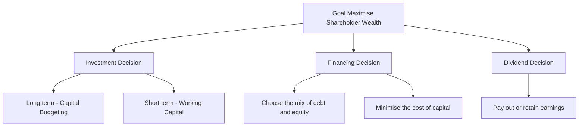
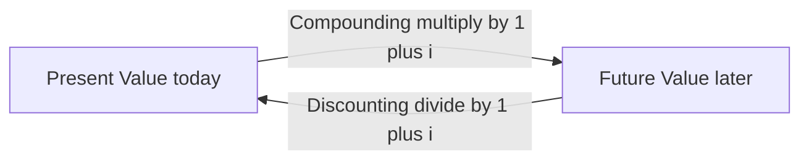
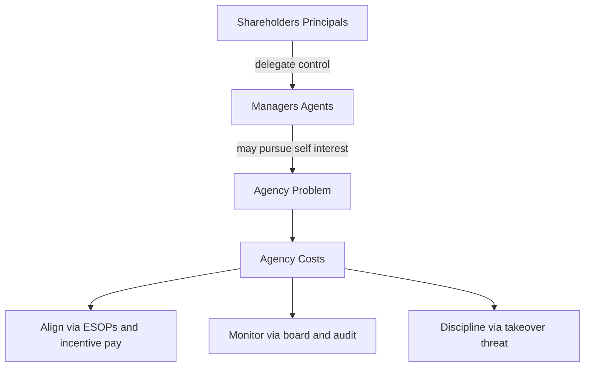

# Chapter 01 — Scope & Objectives of Financial Management

## 1. The Problem

Imagine you are handed the keys to a company on Monday morning. On your desk sit three envelopes.

The first envelope holds a stack of proposals: a new plant in Gujarat, a fleet of delivery trucks, a software system, an acquisition of a rival. Each promises to pay you back — but each swallows crores of cash *today* and dribbles returns back over years, and none of them is a sure thing.

The second envelope asks a different question: *where does the money come from?* You can issue shares, borrow from a bank, float debentures, or plough back last year's profits. Each source has a price, and mixing them wrong can bankrupt a profitable firm.

The third envelope is the quietest but not the least important: at year-end you will have earned some profit. Do you hand it to shareholders as dividend, or keep it inside the company to fund envelope one?

Here is the uncomfortable truth that gives birth to the entire subject of Financial Management: **capital is scarce and every rupee has an alternative use.** A rupee spent on the Gujarat plant is a rupee not spent on trucks, not returned to shareholders, not left in the bank earning interest. The engineer worries about whether the plant *works*; the marketer worries about whether the product *sells*. The finance manager worries about something none of them can see — whether the rupees committed will come back **larger, sooner, and safer** than the rupees committed to any competing use.

No other function in the firm asks that question. Production maximises output. Marketing maximises sales. HR maximises morale. Finance is the one function whose job is to **allocate scarce capital across all the others so that the owners end up wealthier.** That is why finance is a *distinct* function, and this chapter builds the foundation on which the rest of the subject stands.

The three envelopes never go away. Every chapter you will ever study in FM is a deep dive into one of them:

- Envelope 1 → the **Investment Decision** (capital budgeting, working capital).
- Envelope 2 → the **Financing Decision** (cost of capital, capital structure, leverage).
- Envelope 3 → the **Dividend Decision** (dividend policy).

But before we can choose *between* rupees today and rupees tomorrow, we need a common yardstick to compare them — because, as we are about to see, a rupee tomorrow is simply not worth a rupee today.

---

## 2. The Core Idea (an analogy)

Think of a finance manager as the **water manager of a hill town** during a dry season.

Water (capital) flows in from a few springs (financing sources) — some clean and free-ish (retained earnings), some pumped up at a cost (borrowings and fresh equity). The manager must decide which fields to irrigate (investment projects). Every field claims its water will grow the most valuable crop, but water sent to one field cannot go to another. And whatever water is left in the tank at night — does the manager release it to the villagers now (dividend), or store it to irrigate more fields tomorrow?

Now add the twist that makes finance *finance*: **water delivered today is worth more than water promised next month.** Today's water is certain and can be put to work immediately; next month's water might never arrive (risk), and even if it does, you lost a month of using it (time). A good water manager instinctively discounts every promise of future water.

That instinct — *future rupees are worth less than present rupees, and the further and riskier they are, the less they are worth* — is the **time value of money**. It is the single idea that turns finance from bookkeeping into decision-making. Every valuation formula in this book is just a machine for translating future rupees into today's rupees so they can be compared on one table.

Hold this analogy: **allocate scarce water, price each spring, and always discount tomorrow's promises against today's certainty.**

---

## 3. Why It's Built This Way

### Why a separate finance function at all?

Historically, in small owner-run firms, the owner *was* the finance manager — he felt every rupee leave his own pocket. As firms grew, ownership (shareholders) separated from control (managers). Once that happened, someone inside the firm had to be formally charged with looking after the owners' rupees. That someone is the finance function, and its mandate is deliberately narrow and powerful: **take decisions that increase the wealth of the owners.**

Note the scope has widened over the decades:

- **Traditional (pre-1950s) view** — finance = *procurement of funds*. Its job was to raise money when the firm needed it (issues, loans) and keep the paperwork straight. Narrow, episodic, outsider's view of the firm.
- **Modern view** — finance = *procurement AND efficient utilisation of funds*. It is continuous, decision-oriented, and covers all three envelopes plus risk management. This is the view ICAI examines.

### Why must there be a single, clear objective?

A manager facing the three envelopes needs a **decision rule** — a single criterion that says "choose A over B." Without one clear objective, every decision becomes a debate. So finance theory insists on *one* overarching goal against which every choice is tested. The candidates are **profit maximisation** and **wealth maximisation** — and the whole intellectual battle of Section 4 is deciding which one deserves to be the master rule. Spoiler: wealth wins, and it wins *because* of the time value of money and risk, which is exactly why TVM sits at the heart of this chapter.

---

## 4. Full Technical Content

### 4.1 Finance function and its scope

**Financial Management** is the managerial activity concerned with the **planning and controlling of the firm's financial resources.** Operationally it answers three questions:

*Figure 4.1 — The three financial decisions all serve one master goal: maximising the wealth of shareholders.*

**The Investment Decision** — allocating capital to assets.
- *Long-term* (Capital Budgeting): should we buy the plant, launch the product, make the acquisition? These commit large sums for years and are largely irreversible. Judged by whether they earn more than the cost of the capital they consume.
- *Short-term* (Working Capital Management): how much to hold in inventory, receivables and cash. Judged by the trade-off between liquidity (safety) and profitability.

**The Financing Decision** — deciding the **capital structure**, i.e. the proportion of debt to equity. Debt is cheaper (interest is tax-deductible, lenders take less risk) but adds fixed obligations and financial risk. The aim is the mix that **minimises the overall cost of capital**, because a lower cost of capital raises the value of the firm.

**The Dividend Decision** — splitting earnings between **payout** (dividend to shareholders now) and **retention** (reinvestment). The rule: retain only so long as the firm can reinvest at a return above what shareholders could earn elsewhere; otherwise, pay it out.

### 4.2 Profit maximisation vs Wealth maximisation

**Profit maximisation** says: choose whatever action makes accounting profit as large as possible. It sounds obviously right — and it is the traditional yardstick — but it fails on four counts.

| Weakness of Profit Maximisation | What goes wrong |
|---|---|
| **Ambiguous** | "Profit" is undefined — profit before or after tax? Total profit or per share? Short-run or long-run? A vague objective cannot be a decision rule. |
| **Ignores timing (time value)** | Rs. 1,00,000 profit in Year 1 is treated the same as Rs. 1,00,000 in Year 5, though the earlier rupee is worth more. |
| **Ignores risk** | A safe project and a wildly risky project with the same expected profit are treated as equal, though shareholders clearly prefer the safe one. |
| **Ignores quality/cash** | Accounting profit is an opinion; cash is a fact. Profit can be inflated by credit sales that never get collected. |

**Wealth maximisation** (also *Net Present Value maximisation* or *maximising the market value of equity*) fixes all four. It says: choose the action that **maximises the present value of the expected future cash flows to shareholders, discounted at a rate reflecting their risk.** Formally, the wealth created by a decision is:

$$\text{Net Present Value} = \sum_{t=1}^{n} \frac{C_t}{(1+k)^t} - C_0$$

where \(C_t\) is the expected **cash flow** in year *t*, \(k\) is the discount rate capturing **risk** and **time**, and \(C_0\) is the initial outlay. A decision creates wealth only when NPV > 0.

Why wealth wins — read the formula against the table:
- It uses **cash flows**, not accounting profit → solves ambiguity and quality.
- It **discounts by time** through \((1+k)^t\) → solves timing.
- It **discounts by risk** through a higher \(k\) for riskier flows → solves risk.

So wealth maximisation is not a different *goal* from profit — it is profit maximisation done *honestly*, correcting for **time and risk**. This is precisely why we now build the machinery of time value of money: it is the engine inside the wealth objective.

> **Value vs Values note:** the ICAI syllabus stresses that wealth maximisation must operate within legal and ethical limits and considers *all* stakeholders (see §4.6). Maximising owners' wealth is the financial objective; it is pursued responsibly, not ruthlessly.

### 4.3 Time Value of Money — the foundation

**Why money has a time value** — three reasons, all real:
1. **Preference for present consumption** — people would rather have a rupee now than later; to give it up they demand compensation.
2. **Reinvestment / opportunity** — a rupee today can be invested to grow; a rupee next year lost that year of growth.
3. **Risk and inflation** — future rupees are uncertain and buy less.

The compensation demanded is the **interest rate / required rate of return / discount rate.** Two operations translate rupees across time:

- **Compounding** — pushing a present sum *forward* to a future value.
- **Discounting** — pulling a future sum *back* to a present value.

They are mirror images.

*Figure 4.2 — Compounding moves money forward in time; discounting moves it back. The interest rate is the bridge.*

#### (a) Future Value of a single sum (compounding)

$$FV = PV \times (1+i)^n$$

The factor \((1+i)^n\) is the **Future Value Interest Factor (FVIF).** Interest earns interest — that is *compounding*.

If interest is compounded *m* times a year:

$$FV = PV \times \left(1 + \frac{i}{m}\right)^{m \times n}$$

**Effective Annual Rate** (the true annual rate once intra-year compounding is counted):

$$EAR = \left(1 + \frac{i}{m}\right)^{m} - 1$$

#### (b) Present Value of a single sum (discounting)

$$PV = \frac{FV}{(1+i)^n} = FV \times \frac{1}{(1+i)^n}$$

The factor \(\frac{1}{(1+i)^n}\) is the **Present Value Interest Factor (PVIF).** This is the workhorse of all valuation.

#### (c) Annuities — a series of equal cash flows

An **annuity** is an equal amount paid/received at equal intervals for a fixed number of periods (e.g. Rs. 10,000 a year for 5 years). Two flavours:
- **Ordinary annuity (deferred)** — cash flows at the *end* of each period (the exam default).
- **Annuity due** — cash flows at the *beginning* of each period.

**Future Value of an Ordinary Annuity:**

$$FVA = A \times \frac{(1+i)^n - 1}{i}$$

The bracketed factor is the **FVIFA** (annuity compounding factor). *Why this shape?* Each instalment compounds for a different number of periods; summing the geometric series collapses to this formula.

**Present Value of an Ordinary Annuity:**

$$PVA = A \times \frac{1 - (1+i)^{-n}}{i}$$

The bracketed factor is the **PVIFA** (annuity discounting factor).

**Annuity due** — because every cash flow arrives one period *earlier*, multiply the ordinary-annuity result by \((1+i)\):

$$FV_{due} = FVA \times (1+i); \qquad PV_{due} = PVA \times (1+i)$$

**Perpetuity** — an annuity that never ends:

$$PV_{perpetuity} = \frac{A}{i}$$

**Growing perpetuity** (cash flow grows at rate *g* forever, needs *i > g*):

$$PV = \frac{A_1}{i - g}$$

This last one is the seed of the dividend-growth valuation model you will meet later — proof that TVM is not an isolated topic but the grammar of the whole subject.

### 4.4 Sinking fund, capital recovery and doubling — derived uses

- **Sinking fund** (how much to set aside each year to reach a target *FV*): rearrange FVA →
$$A = FV \times \frac{i}{(1+i)^n - 1}$$
- **Capital recovery / loan instalment** (annual payment to repay a present loan *PV*): rearrange PVA →
$$A = PV \times \frac{i}{1 - (1+i)^{-n}}$$
- **Rule of 72** (quick doubling time): years to double ≈ 72 ÷ interest rate (%). A handy sanity check, not an exam formula.

### 4.5 Functions of a finance manager (the CFO's day)

Estimating capital requirements; deciding capital structure; selecting sources of funds; investing funds (capital budgeting + working capital); managing surplus (dividend vs retention); managing cash and liquidity; and **financial control** (monitoring that funds are used as planned). Two supporting concepts appear throughout: **risk–return trade-off** (higher return only by accepting higher risk) and the recognition that **market value**, not book value, measures success.

### 4.6 Agency problem and stakeholders

Because owners (shareholders/principals) hire managers (agents) to run the firm, an **agency problem** arises: managers may pursue their own interests — job security, perks, empire-building, avoiding risky-but-valuable projects — instead of maximising owners' wealth. The costs of monitoring and aligning them are **agency costs.**

Alignment mechanisms: performance-linked pay and **ESOPs** (stock options tie manager wealth to share price), board and audit oversight, debt covenants, the threat of **takeover** (poor managers get replaced), and market/regulatory discipline (SEBI, listing norms).

**Stakeholder view:** the firm also owes duties to lenders, employees, customers, suppliers, government and society. Modern FM holds that *sustainable* wealth maximisation is impossible while abusing stakeholders — a firm that cheats customers or pollutes destroys long-run value. So wealth maximisation is the objective, pursued within ethical, legal and stakeholder-respecting bounds.

*Figure 4.3 — The separation of ownership from control creates the agency problem; alignment and monitoring mechanisms bring managers back in line with owners.*

---

## 5. Worked Examples

Assume annual compounding unless stated. I show every factor so you can reconcile by hand.

### Example 1 (Easy) — Future value, present value, and why timing matters

Mr. A can receive **Rs. 1,00,000 today** or **Rs. 1,30,000 after 3 years.** His opportunity rate is **10% p.a.** Which is better? Prove it two ways.

**Method A — push today's money forward (compounding).**
$$FV = 1{,}00{,}000 \times (1.10)^3$$
\((1.10)^3 = 1.331\), so \(FV = 1{,}00{,}000 \times 1.331 = \textbf{Rs. 1,33,100}.\)

If he takes Rs. 1,00,000 today and invests at 10%, in 3 years he has Rs. 1,33,100 — **more** than the Rs. 1,30,000 offer. Take the money today.

**Method B — pull the future offer back (discounting).**
$$PV = 1{,}30{,}000 \times \frac{1}{(1.10)^3} = 1{,}30{,}000 \times 0.7513 = \textbf{Rs. 97,669.}$$

The Rs. 1,30,000 promise is worth only Rs. 97,669 today — **less** than Rs. 1,00,000. Same conclusion. 

*Reconciliation check:* discounting Method A's answer back gives \(1{,}33{,}100 \times 0.7513 = 1{,}00{,}000\) ✓, and compounding Method B's answer gives \(97{,}669 \times 1.331 = 1{,}30{,}000\) ✓. The two operations are exact inverses. **This is why profit maximisation, which ignores the 3-year gap, would wrongly call Rs. 1,30,000 the bigger number — and why wealth maximisation is right.**

### Example 2 (Moderate) — Annuities, sinking fund, and effective rate

**Part (i) — PV of an ordinary annuity.** A project pays **Rs. 50,000 at the end of each year for 5 years.** Discount rate **12%.** What is it worth today?

$$PVIFA_{12\%,5} = \frac{1-(1.12)^{-5}}{0.12}$$
\((1.12)^5 = 1.7623\Rightarrow(1.12)^{-5}=0.5674\). So \(PVIFA = \frac{1-0.5674}{0.12} = \frac{0.4326}{0.12} = 3.6048.\)
$$PVA = 50{,}000 \times 3.6048 = \textbf{Rs. 1,80,240.}$$

*Reconcile year by year* (PVIF at 12%): 0.8929, 0.7972, 0.7118, 0.6355, 0.5674 → sum = 3.6048 ✓ (matches the annuity factor). Individual PVs: 44,645 + 39,860 + 35,590 + 31,775 + 28,370 = **Rs. 1,80,240** ✓.

**Part (ii) — Annuity due.** If instead the Rs. 50,000 arrives at the **beginning** of each year:
$$PV_{due} = 1{,}80{,}240 \times 1.12 = \textbf{Rs. 2,01,869.}$$
It is worth more because every rupee arrives one year sooner.

**Part (iii) — Sinking fund.** The firm must accumulate **Rs. 10,00,000 in 4 years** to replace a machine, investing yearly at **10%.** Annual deposit?
$$FVIFA_{10\%,4} = \frac{(1.10)^4 - 1}{0.10} = \frac{1.4641 - 1}{0.10} = 4.641.$$
$$A = \frac{10{,}00{,}000}{4.641} = \textbf{Rs. 2,15,471 per year.}$$
*Check:* 2,15,471 × 4.641 = 10,00,000 ✓.

**Part (iv) — Effective annual rate.** A bank quotes **12% compounded quarterly.** True annual cost?
$$EAR = \left(1+\frac{0.12}{4}\right)^4 - 1 = (1.03)^4 - 1 = 1.1255 - 1 = \textbf{12.55\%.}$$
The "12%" is a nominal illusion; the borrower actually pays 12.55%. Quality of the number matters — a lesson wealth maximisation takes seriously and profit maximisation ignores.

### Example 3 (Exam-hard) — Wealth vs profit, with risk, using NPV

A company evaluates two mutually exclusive projects, each costing **Rs. 10,00,000** today, life 3 years. Cash flows and the risk-adjusted discount rate differ:

| Year | Project X cash flow (Rs.) | Project Y cash flow (Rs.) |
|---|---|---|
| 1 | 2,00,000 | 6,00,000 |
| 2 | 4,00,000 | 4,00,000 |
| 3 | 7,00,000 | 3,00,000 |
| **Total** | **13,00,000** | **13,00,000** |

Both return the same **total** cash (Rs. 13,00,000) — so **profit maximisation is indifferent.** But X is a stable, low-risk project discounted at **10%**, while Y is a volatile, high-risk project the market discounts at **14%.** Which creates more shareholder wealth?

**Project X @ 10%** (PVIF: 0.9091, 0.8264, 0.7513):

| Year | Cash flow | PVIF@10% | PV (Rs.) |
|---|---|---|---|
| 1 | 2,00,000 | 0.9091 | 1,81,820 |
| 2 | 4,00,000 | 0.8264 | 3,30,560 |
| 3 | 7,00,000 | 0.7513 | 5,25,910 |
| | | **Total PV** | **10,38,290** |

NPV(X) = 10,38,290 − 10,00,000 = **Rs. +38,290.**

**Project Y @ 14%** (PVIF: 0.8772, 0.7695, 0.6750):

| Year | Cash flow | PVIF@14% | PV (Rs.) |
|---|---|---|---|
| 1 | 6,00,000 | 0.8772 | 5,26,320 |
| 2 | 4,00,000 | 0.7695 | 3,07,800 |
| 3 | 3,00,000 | 0.6750 | 2,02,500 |
| | | **Total PV** | **10,36,620** |

NPV(Y) = 10,36,620 − 10,00,000 = **Rs. +36,620.**

**Decision:** By profit maximisation the two are a dead heat (both earn Rs. 3,00,000 "accounting surplus" over 3 years). By **wealth maximisation, choose Project X** — it creates Rs. 38,290 of shareholder wealth versus Rs. 36,620 for Y.

**Where did the difference come from?** Two forces fought each other. Y front-loads its cash (good — earlier rupees are worth more), which *helped* it. But Y carries higher risk, so the market discounts it at 14% (bad — it shrinks every rupee), which *hurt* it. Here the risk penalty just outweighed the timing advantage, so X wins narrowly. **Profit maximisation is blind to both forces; wealth maximisation prices both — exactly why it is the superior objective.**

*Self-verification:* recompute X's Year-3 PV: 7,00,000 × 0.7513 = 5,25,910 ✓; sum 1,81,820+3,30,560+5,25,910 = 10,38,290 ✓. Y: 5,26,320+3,07,800+2,02,500 = 10,36,620 ✓. Both NPVs positive, so both are acceptable in isolation; being mutually exclusive, the higher-NPV project (X) is chosen.

---

## 6. Presentation / Format

**How to present TVM and objective answers in the ICAI exam:**

1. **State the formula first, then substitute.** Write \(PV = FV \times PVIF_{i,n}\), then plug numbers. Examiners award method marks even if arithmetic slips.
2. **Show the factor value.** Quote "PVIFA(12%,5) = 3.605" — from tables if provided, else computed. If you compute it, show the one-line working.
3. **Use a columnar table** for any multi-year cash flow (Year | Cash flow | Factor | Present value | with a Total row), exactly as in Example 3. It is fast, examiner-friendly, and self-checking.
4. **Round consistently** — factors to 3–4 decimals, rupees to whole numbers, and say so. Small rounding gaps are accepted if method is right.
5. **End with an explicit decision sentence** — "Since NPV of X (Rs. 38,290) > NPV of Y (Rs. 36,620), select Project X." A computation without a conclusion loses the decision mark.
6. **For theory questions** (e.g. "Why is wealth maximisation superior to profit maximisation?"), answer as a **point-wise comparison table** (ambiguity, timing, risk, quality) — the four weaknesses of §4.2. Neatness and structure carry marks.

---

## 7. Connections

- **Capital Budgeting (Investment decision):** NPV, IRR, PI and discounted payback are *nothing but* the discounting machinery of §4.3 applied to project cash flows. Example 3 is a capital-budgeting problem in disguise.
- **Cost of Capital (Financing decision):** the discount rate *k* you used above is the **weighted average cost of capital**; a whole chapter is devoted to computing it. Wealth is created only when project return exceeds this *k*.
- **Leverage & Capital Structure:** these decide *k*. Lowering *k* (via cheaper debt) raises the PV of the same cash flows — directly lifting wealth.
- **Dividend Decision:** the **growing-perpetuity** formula \(P_0 = D_1/(k-g)\) (Gordon/Walter models) is the §4.3 perpetuity applied to dividends. Retain-vs-pay hinges on whether the firm's reinvestment return beats *k*.
- **Bond & Share Valuation:** a bond's price is the PV of an annuity (coupons) plus a lump sum (redemption) — Example 2's toolkit exactly.
- **Working Capital:** the liquidity–profitability trade-off is the risk–return principle of §4.5 at short horizons.

Every one of these is a special case of "discount future rupees at a risk-adjusted rate and compare." Master this chapter and the rest of FM is variations on a theme.

---

## 8. Traps & Examiner Tricks

1. **Ordinary annuity vs annuity due.** "Beginning of each year" means annuity due — multiply by \((1+i)\). Missing this is the single most common lost mark.
2. **Nominal vs effective rate.** "12% compounded quarterly" is **not** 12% effective. Use \(i/m\) and \(m\times n\), or convert to EAR. Watch for monthly loan EMIs (m = 12).
3. **FVIFA vs PVIFA confusion.** Accumulating *to* a future target → FVIFA (sinking fund). Valuing a stream *today* / loan instalment → PVIFA. Grab the wrong factor and everything downstream is wrong.
4. **Using profit instead of cash flow.** NPV uses **cash flows** (add back depreciation, ignore non-cash items). Plugging accounting profit is a conceptual error the examiner loves to bait.
5. **Discount rate for risk.** If two projects have different risk, they must use different rates — do not lazily apply one rate to both (Example 3's whole point).
6. **"Total cash is equal, so projects are equal."** The classic trap — equal totals hide unequal *timing and risk*. Always discount.
7. **Perpetuity vs annuity.** "Forever" → \(A/i\); a fixed number of years → PVIFA. Don't use the perpetuity shortcut on a 5-year stream.
8. **Growing perpetuity needs i > g.** If \(g \geq i\) the formula explodes and is invalid — a favourite conceptual MCQ.
9. **Wealth maximisation ≠ share price manipulation.** The objective is *sustainable* market value considering stakeholders and ethics, not a rigged short-term price spike. Theory questions test this nuance.
10. **Agency cost direction.** Agency costs are the costs *of the conflict plus the costs of controlling it* (monitoring, bonding, residual loss) — not the manager's salary itself.

---

## 9. First-Principles Recap

Strip everything away and here is the skeleton:

1. **Capital is scarce; every rupee has an alternative use.** Someone must allocate it well — that someone is the finance function (a *distinct* function because no one else optimises for owners' rupees).
2. Allocation happens through **three decisions** — invest, finance, distribute — and all three serve **one master goal.**
3. The goal is **wealth maximisation, not profit maximisation,** because profit is ambiguous and blind to **timing, risk, and cash quality.** Wealth = present value of expected future *cash* flows, discounted for *time* and *risk*.
4. To compare rupees across time you need **time value of money**: **compound** to go forward, **discount** to come back. Streams of equal flows collapse into **annuity** factors; endless flows into **perpetuity**.
5. Because owners delegate to managers, an **agency problem** appears; incentives, monitoring and market discipline realign it, and the whole exercise stays within **ethical and stakeholder** bounds.

If you can regenerate the NPV formula from "future cash, discounted for time and risk," you can regenerate almost every tool in this book. That is the payoff of refusing to memorise: the formulas are *consequences*, not axioms.

---

## 10. Quick-Revision Sheet

**Core objective:** Maximise shareholder **wealth** = maximise \(\sum \frac{C_t}{(1+k)^t} - C_0\) (NPV). Beats profit maximisation on *timing, risk, ambiguity, cash quality*.

**Three decisions:** Investment (capital budgeting + working capital) · Financing (capital structure, minimise *k*) · Dividend (payout vs retain).

| Concept | Formula | Factor / Note |
|---|---|---|
| FV of single sum | \(FV = PV(1+i)^n\) | FVIF |
| PV of single sum | \(PV = FV / (1+i)^n\) | PVIF |
| Intra-year compounding | \(FV = PV(1+\tfrac{i}{m})^{mn}\) | m = times/yr |
| Effective annual rate | \(EAR = (1+\tfrac{i}{m})^m - 1\) | true rate |
| FV of ordinary annuity | \(FVA = A\cdot\dfrac{(1+i)^n-1}{i}\) | FVIFA |
| PV of ordinary annuity | \(PVA = A\cdot\dfrac{1-(1+i)^{-n}}{i}\) | PVIFA |
| Annuity due | \(\times (1+i)\) on the ordinary result | flows at start |
| Perpetuity | \(PV = A / i\) | forever |
| Growing perpetuity | \(PV = A_1/(i-g)\) | needs i > g |
| Sinking fund (deposit) | \(A = FV\cdot\dfrac{i}{(1+i)^n-1}\) | reach a target FV |
| Loan instalment / capital recovery | \(A = PV\cdot\dfrac{i}{1-(1+i)^{-n}}\) | amortise a loan |
| Rule of 72 | doubling years ≈ 72 / rate% | quick check |

**Profit vs Wealth — four wins for wealth:** ambiguity ✗ · ignores timing ✗ · ignores risk ✗ · ignores cash quality ✗ (profit fails all four; wealth fixes all four).

**Agency:** owner (principal) vs manager (agent) conflict → agency costs → fix with ESOPs/incentives, board & audit monitoring, debt covenants, takeover threat. Pursue wealth within ethical/stakeholder limits.

**Exam reflexes:** end-of-year = ordinary annuity; "beginning" = ×(1+i); "compounded quarterly" ⇒ use i/m & mn; NPV uses cash flows not profit; different risk ⇒ different discount rate; equal totals ≠ equal value — always discount.
