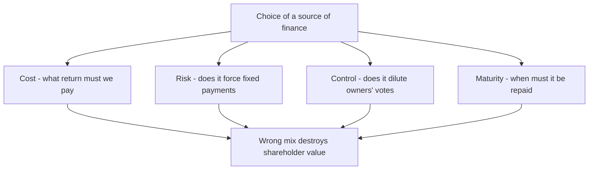
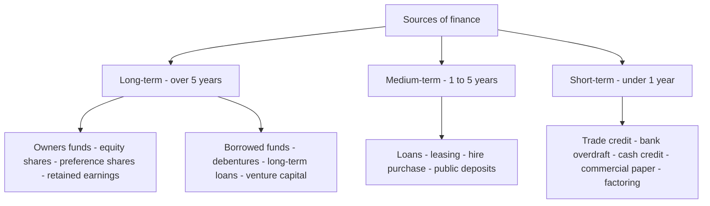
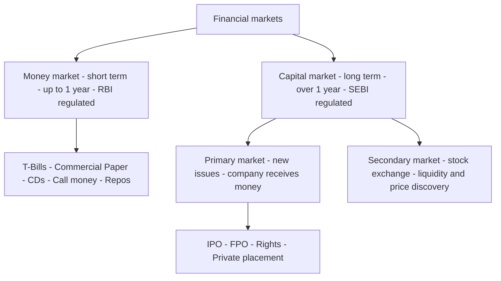
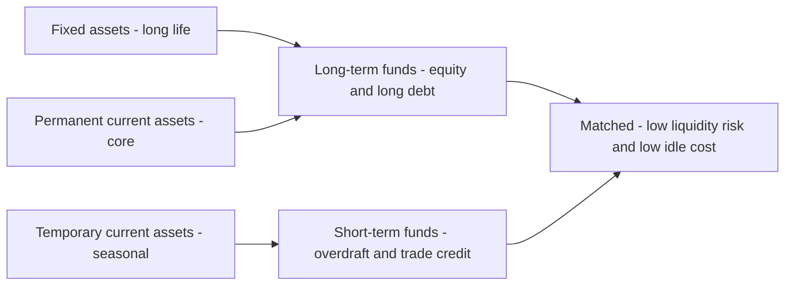

# Chapter 02 — Types of Financing & Financial Markets

## 1. The Problem — Where Will the Money Come From, and What Will It Cost You?

In Chapter 01 we established the mission of Financial Management: maximise shareholder wealth through three decisions — **invest, finance, distribute**. This chapter lives entirely inside the *second* decision: **financing**. The invest decision decides *what assets to buy*. But every asset — a factory, a fleet of trucks, a month's inventory — has to be *paid for*. The money to pay for it is called **capital**, and capital is never free and never neutral. Somebody hands it over, and in exchange they attach strings: a fixed interest cheque every quarter, a claim on your profits, a right to vote at your AGM, a deadline for repayment.

So the financing problem is not "can I find money?" It is: **"Of all the different pools of money I could tap, which mix leaves my shareholders richest and my company safest?"** Consider a concrete dilemma. Vishnu Steels needs ₹100 crore to build a new plant that will last 20 years. Vishnu's treasurer has offers:

- A bank will lend ₹100 crore at 9%, repayable over 3 years.
- Debenture-holders will lend ₹100 crore at 11%, repayable in 15 years.
- Equity investors will give ₹100 crore for shares — no repayment, no fixed return, but they now own a slice of the company and will demand ~16% return via dividends and capital gains.

Every one of these "works" in the narrow sense that cash arrives. But choosing wrong is fatal. Fund a 20-year plant with a 3-year bank loan and you must repay ₹100 crore before the plant has earned it back — you will be forced to refinance at the worst possible moment or sell the plant at a loss. Fund it entirely with 16% equity and you have starved shareholders of the cheaper 11% money that would have magnified their returns. Fund it with too much debt and one bad year of low profits leaves you unable to pay interest — and unpaid interest means insolvency.

The **source of finance matters** because each source carries a different bundle of four attributes, and getting the bundle wrong destroys value even when the project itself is sound.

*Figure 1 — the four attributes that make the choice of source a real decision, not a formality.*

## 2. The Core Idea — Money Has a Personality, and You Are Assembling a Team

Think of raising finance not as filling a bucket but as **hiring a team**. Each type of financier is a different kind of teammate with a different temperament and a different price.

- **The Debt-holder is a landlord.** You rent his money. He does not care whether you have a brilliant year or a terrible one — the rent (interest) is due on the first of the month, in full, or he evicts you (drags you toward insolvency). Because his return is fixed and legally enforceable, he takes little risk, so he charges a *low* rent. And a landlord never tells you how to run your business — no voting rights, no dilution of control. But he insists on a *lease term*: the money must be returned by a date.

- **The Equity-holder is a business partner.** She does not want rent; she wants a *share of the upside*. In a bad year she accepts nothing; in a great year she expects to get rich alongside you. Because she absorbs your risk — she is last in the queue if things go wrong — she demands a *high* return to compensate. And because she is a partner, she gets a *vote*: control is shared. But there is no repayment date — partnership capital is permanent.

- **The Preference-holder is a hybrid tenant-partner.** She takes a fixed dividend like rent, but only if profits allow, and she waits behind the landlord in the repayment queue. Middling risk, middling cost, usually no vote.

The art of financing is **assembling the right team for the job you're doing.** A long, patient project needs patient, permanent partners (equity) and long-lease landlords (long-term debt). A quick, self-liquidating job — like buying inventory you'll sell in two months — needs a short-term landlord (a bank overdraft) you can pay off the moment the cash comes in. This single instinct — *match the life of the money to the life of the asset* — is the **matching principle**, and it is the spine of this whole chapter.

## 3. Why It's Built This Way — Risk, Return, and the Queue

Everything about financing flows from one iron law of finance: **higher risk demands higher return.** A financier who bears more risk must be paid more, or he walks away. This single law, applied to the *queue of claims* on a company's cash and assets, explains why every source is priced the way it is.

Picture the company's cash flowing out each year, and imagine the claimants standing in a queue with buckets:

1. **Debt-holders** stand at the *front*. They are paid interest first, and in liquidation their principal is repaid first (especially if secured against assets). Standing first = low risk = they accept the *lowest* return. Bonus: interest is a business expense, so it is **tax-deductible**, making debt cheaper still to the company.
2. **Preference shareholders** stand in the *middle*. Paid after debt, before equity. Medium risk = medium return. Their dividend is *not* tax-deductible (it's an appropriation of profit, not an expense).
3. **Equity shareholders** stand at the *back*. They get only what's left — the "residual". In a bad year, nothing. In liquidation, they're paid last and often get zero. Highest risk = they demand the *highest* return.

*Figure 2 — the queue of claims. Position in the queue determines risk, which determines cost.*

This queue explains a crucial and counter-intuitive fact that trips up beginners: **equity is the most expensive source of finance, not the cheapest.** Newcomers think "we don't pay interest on shares, so equity is free." Wrong. Equity holders bear the most risk and therefore demand the highest return (16–18% is typical vs 9–11% for debt). It just doesn't arrive as a contractual cheque — it arrives as the *expectation* of dividends plus capital appreciation, which management ignores at its peril.

So why not fund everything with cheap debt? Because the same fixed cheque that makes debt cheap also makes it **dangerous**. Interest must be paid whether you earn ₹100 crore or ₹1 crore. This is **financial risk** — the risk created by fixed financing charges. A little debt magnifies shareholder returns (financial leverage, Chapter on Leverage). Too much debt magnifies losses and can force insolvency. The financing decision is therefore a **balancing act** between the cheapness of debt and the safety of equity — a theme that recurs throughout FM.

## 4. Full Technical Content — The Complete Menu of Sources

We classify sources along two axes the examiner cares about: **maturity** (long-term vs short-term) and **ownership** (owners' funds vs borrowed funds). Study the map first, then each source in detail.

*Figure 3 — the classification of sources of finance by maturity and ownership.*

### 4.1 Long-term sources — Owners' Funds

**(a) Equity Share Capital.** The permanent risk capital of a company. Equity shareholders are the *real owners*. Key features and the reasoning behind each:

- **No fixed dividend, no repayment.** Because there is no contractual outflow, equity is the *safest source from the company's viewpoint* — it never forces insolvency. This is precisely why it is the *foundation* of the capital structure.
- **Voting rights → control.** Issuing new equity to outsiders **dilutes control** of existing owners. A promoter holding 60% who issues a big new tranche may drop below 51% and lose control — a decisive reason companies sometimes avoid equity even when it's available.
- **Highest cost.** As established, residual claimants demand the highest return.
- **Dividends are not tax-deductible** — paid out of post-tax profit.
- **No charge on assets**, so it preserves borrowing capacity for the future.

*Ways to raise equity:* IPO/FPO (public issue), **Rights issue** (offered to existing shareholders pro-rata, protecting their control), **Private placement/Preferential allotment**, **Bonus issue** (capitalising reserves — raises *no* new cash, only reshuffles the balance sheet), **Sweat equity** (to employees/directors for know-how), and **ESOPs**.

**(b) Preference Share Capital.** A hybrid — legally equity, behaviourally debt-like.

- **Preferential rights:** fixed rate of **dividend** *before* equity, and priority in **repayment of capital** on winding up. Hence the name.
- **Usually no voting rights** (regain votes if dividend unpaid for 2 years) — so it raises capital *without diluting control*. A key attraction.
- **Cheaper than equity** (lower risk than equity, ranks ahead) but **costlier than debt** (ranks behind debt; dividend not tax-deductible).
- **Types you must know:** *Cumulative* (unpaid dividends accumulate as arrears — the default) vs *Non-cumulative*; *Participating* (shares surplus profit beyond fixed rate) vs *Non-participating*; *Convertible* (into equity) vs *Non-convertible*; *Redeemable* (repaid on a date — the Companies Act 2013 requires preference shares be redeemable within **20 years**, except infrastructure companies) vs Irredeemable. In India, effectively all preference shares are redeemable.

**(c) Retained Earnings (Ploughing back of profits).** Profits kept in the business instead of paid as dividend. This is **internal financing** — the others are external.

- Belongs to equity shareholders, so it is a form of **owners' funds**. It carries an **opportunity cost** equal to the return shareholders forgo — so it is *not free*, a classic exam trap.
- **Advantages:** no issue costs, no dilution of control, no fixed obligation, readily available, and it cushions dividends. Enables growth without depending on volatile markets.
- **Danger — over-capitalisation / careless investment:** because the money feels "free", managers may invest it in sub-par projects. And excessive retention starves shareholders of current dividends.

### 4.2 Long-term sources — Borrowed Funds

**(d) Debentures / Bonds.** A debenture is a written acknowledgement of debt — the company borrows from the public in small units.

- **Fixed interest**, paid *whether or not profits are earned*; a legal obligation. **Interest is tax-deductible** → cheapest long-term source after adjusting for tax.
- **No voting rights → no dilution of control.** Debenture-holders are creditors, not owners.
- Often **secured** by a charge (fixed or floating) on assets → lower risk to lenders → lower rate.
- **Repayable** on maturity → creates *refinancing/redemption* pressure; a Debenture Redemption Reserve may be required.
- **Types:** Secured vs Unsecured (naked); Redeemable vs Irredeemable; Convertible (**FCD** fully / **PCD** partly convertible into equity) vs Non-convertible (NCD); Registered vs Bearer; Zero-coupon (issued at discount, no periodic interest).
- **Danger:** raises **financial risk**; too much interest burden can trigger insolvency in a downturn.

**(e) Term Loans (from banks / financial institutions).** Negotiated long/medium-term loans, typically for buying fixed assets. Repaid in instalments (EMIs) with interest, usually secured, often with **restrictive covenants** (limits on further borrowing, dividends). Interest tax-deductible. No dilution of control but tighter lender oversight than debentures.

**(f) Venture Capital.** Long-term risk capital for **new, high-risk, high-growth** ventures (typically start-ups and tech) that cannot access conventional funding because they have no track record or collateral.

- The VC provides **equity or quasi-equity** and, crucially, **management expertise, mentoring and networks**. They take a stake and expect to **exit** (via IPO or sale) in 3–7 years with a very high return to compensate for high failure rates.
- **Stages of financing:** *Seed* (idea) → *Start-up* (product development) → *Early/First stage* (commercial production) → *Expansion/Second stage* (scaling) → *Later stage/Mezzanine/Bridge* (pre-IPO). You should be able to name these in order.
- **Methods:** equity participation, conditional loan (royalty on sales), income note (interest + royalty), participating debenture.

**(g) Other long-term routes.** *Loan syndication*, *Asset securitisation*, *International sources* — **ADRs** (American Depository Receipts), **GDRs** (Global Depository Receipts), **ECBs** (External Commercial Borrowings), and **FDI/FII**. ADR/GDR let an Indian company raise equity abroad; ECB is foreign-currency debt.

### 4.3 Medium-term sources

**(h) Lease Financing.** Instead of *buying* an asset, the firm (the **lessee**) *uses* it and pays rent to the owner (the **lessor**). The core idea: **profits are earned by *using* assets, not by *owning* them** — so why sink scarce long-term capital into ownership?

- **Finance (Capital) Lease:** long-term, non-cancellable; substantially transfers all risks and rewards of ownership to the lessee; lease covers most of the asset's economic life; effectively a purchase financed by the lessor. Shown as an asset + liability by the lessee.
- **Operating Lease:** short-term, cancellable; lessor bears risk of obsolescence and usually maintenance (e.g., leasing a photocopier or aircraft). Good for assets prone to obsolescence.
- **Advantages:** conserves capital (100% financing), no large upfront outlay, lease rentals are tax-deductible, flexibility, avoids obsolescence risk (operating). **Disadvantage:** lessee loses ownership/salvage value; over the life it can cost more than buying.
- **Sale and lease-back:** firm sells an owned asset to a lessor and leases it back — unlocks cash tied up in the asset while retaining use.

**(i) Hire Purchase.** The hirer pays in instalments and **ownership transfers only after the last instalment**. Contrast with leasing where ownership never transfers (finance lease may have a purchase option). Interest portion is a charge; the hirer eventually owns the asset and claims depreciation.

**(j) Public Deposits.** Company invites deposits from the public for 6 months to 3 years at attractive interest. Simple, no security/charge, no dilution — but regulated (Companies Act limits) and can be unstable if not renewed.

### 4.4 Short-term sources — the working-capital toolkit

Short-term finance funds **current assets** (inventory, receivables) that turn back into cash within a year. It is repaid from the operating cycle itself.

**(k) Trade Credit.** Credit extended by *suppliers* — you buy goods now, pay in 30–60 days. **Spontaneous** (grows automatically with purchases), needs no negotiation, and is *interest-free* if no cash discount is forgone — but forgoing a cash discount for early payment can make it very expensive in implicit terms.

**(l) Bank Finance for working capital:**
- **Cash Credit:** borrow up to a limit against security of inventory/receivables; interest only on the amount used. The workhorse of Indian working-capital finance.
- **Overdraft:** overdraw a current account up to a limit; short, fluctuating needs.
- **Bills Discounting:** the bank pays you now (less discount) for a bill of exchange due later — converts receivables to instant cash.
- **Letter of Credit:** bank guarantees payment to your supplier — not direct finance but eases trade credit.
- **Working Capital Demand Loan.**

**(m) Commercial Paper (CP).** An **unsecured promissory note** issued by *large, creditworthy* companies to raise short-term funds (7 days to 1 year) directly from the money market, usually *cheaper* than bank credit. Issued at a discount to face value. Only high-rated firms qualify.

**(n) Factoring.** The firm *sells* its **receivables** to a factor at a discount for immediate cash; the factor collects from customers. *With recourse* (firm bears bad-debt risk) vs *without recourse* (factor bears it). **Forfaiting** is the equivalent for *export* receivables (medium-term, without recourse).

**(o) Inter-Corporate Deposits (ICDs), and accrued expenses / provisions** (wages and taxes owed but not yet paid) — spontaneous, cost-free short-term financing.

### 4.5 The comparison that ties it together

| Feature | Equity Shares | Preference Shares | Debentures / Debt | Retained Earnings |
|---|---|---|---|---|
| Nature of holder | Owner | Hybrid owner | Creditor | Owner (internal) |
| Return | Dividend (variable) | Fixed dividend | Fixed interest | Implicit (opportunity cost) |
| Obligation to pay | None (discretionary) | Only if profits | Compulsory (legal) | None |
| Repayment | None (permanent) | On redemption (≤20 yrs) | On maturity | Not applicable |
| Voting / Control | Yes — dilutes control | Usually no | No | No dilution |
| Risk to company | Lowest | Medium | Highest (financial risk) | Lowest |
| Cost to company | Highest | Medium | Lowest | Moderate (opp. cost) |
| Tax treatment | Not deductible | Not deductible | **Deductible** | Not deductible |
| Charge on assets | No | No | Usually yes | No |

## 4.6 Financial Markets — Where Sources Are Bought and Sold

Sources of finance are traded in **financial markets** — the meeting place of those with surplus funds (savers) and those who need funds (firms). Two big divisions, split by **maturity of the instrument**:

- **Money Market** — the market for **short-term** funds (maturity **up to 1 year**). Deals in near-cash, highly liquid, low-risk, low-return instruments. Instruments: **Treasury Bills** (T-Bills, issued by RBI/Govt), **Commercial Paper**, **Certificates of Deposit (CDs)** (issued by banks), **Call/Notice money** (inter-bank overnight), **Commercial Bills**, **Repos**. Participants: RBI, banks, large corporates, mutual funds. Purpose: manage *liquidity / working capital*, not long-term growth. Regulated primarily by the **RBI**.

- **Capital Market** — the market for **long-term** funds (maturity **over 1 year**, including permanent equity). Instruments: **shares, debentures, bonds**. Higher risk, higher return, less liquid than money-market paper. Purpose: fund *fixed assets and long-term growth*. Regulated primarily by **SEBI**.

The capital market itself splits into:
- **Primary Market (New Issue Market):** where securities are issued for the *first* time and the company *actually receives the money* — IPO, FPO, rights issue, private placement. This is where financing genuinely happens.
- **Secondary Market (Stock Exchange, e.g. NSE/BSE):** where *existing* securities are traded among investors. The **company gets no new money** here — but the secondary market provides **liquidity** and **price discovery**, which is what makes investors willing to buy in the primary market in the first place. Without a resale market, few would ever subscribe.

*Figure 4 — the architecture of financial markets by maturity and function.*

## 4.7 The Matching Principle (Hedging Approach) — and WHY

The single most important *decision rule* connecting sources to uses is the **matching principle** (also called the **hedging approach** to financing):

> **Match the maturity of the source of finance to the life of the asset it funds. Finance long-term (fixed / permanent) assets with long-term funds, and short-term (temporary current) assets with short-term funds.**

Refined for working capital, current assets have two layers:
- **Permanent (core) current assets** — the minimum inventory and receivables always on hand — behave like fixed assets and should be financed with **long-term** funds.
- **Temporary (fluctuating) current assets** — seasonal spikes — should be financed with **short-term** funds that can be repaid when the spike subsides.

**Why?** Two failures the principle prevents:

1. **Financing long assets with short funds (aggressive, under-financing) → liquidity crisis.** If Vishnu funds its 20-year plant with a 3-year loan, the loan falls due long before the plant generates enough to repay it. The firm must **refinance repeatedly**, exposed to interest-rate spikes and credit droughts; a single refusal to roll over the loan forces a fire-sale of the plant. Cheaper in good times, lethal in bad times.

2. **Financing short assets with long funds (conservative, over-financing) → idle cost.** If Vishnu funds a two-month seasonal inventory build-up with permanent equity or a 15-year debenture, then for the other ten months of the year that expensive long-term money sits **idle**, still demanding its high return. You are paying rent on a warehouse you use two months a year. This drags down return on capital and is *over-capitalisation*.

The matching (hedging) approach threads between these: it minimises both the *risk* of a liquidity crunch and the *cost* of idle funds. It is the applied form of everything above — cost, risk, and maturity all resolved into one clean rule.

*Figure 5 — the matching principle mapping asset lives to source lives.*

## 5. Worked Examples

### Example 1 (Warm-up) — Why equity is *not* the cheapest source

**Problem.** Anand Ltd is choosing between raising ₹50 lakh via (i) 12% debentures or (ii) equity shares on which investors expect a 16% return. Corporate tax is 25%. Compute the **effective cost to the company** of each source and identify the cheaper one. Ignore issue expenses.

**Reasoning first.** Cost to the company is the return it must *give up* to the provider — but for debt, interest is tax-deductible, so the government effectively refunds part of it. For equity, dividends are paid from post-tax profit, so there is no tax shield.

**Step 1 — Cost of debentures (after tax).**
Pre-tax interest rate = 12%.
After-tax cost = 12% × (1 − tax rate) = 12% × (1 − 0.25) = 12% × 0.75 = **9.00%**.

Check in rupees: interest = ₹50,00,000 × 12% = ₹6,00,000. Tax saved = ₹6,00,000 × 25% = ₹1,50,000. Net cost = ₹6,00,000 − ₹1,50,000 = ₹4,50,000, i.e. ₹4,50,000 / ₹50,00,000 = **9.00%.** ✓

**Step 2 — Cost of equity.**
Equity return of 16% is paid out of post-tax profit; no tax shield. Effective cost = **16.00%**.

**Step 3 — Compare.**

| Source | Nominal rate | Tax shield? | Effective cost |
|---|---|---|---|
| 12% Debentures | 12% | Yes (25%) | 9.00% |
| Equity | 16% | No | 16.00% |

**Conclusion.** Debt costs the company **9%** vs **16%** for equity — debt is far cheaper, confirming the queue logic: the front-of-queue, tax-shielded landlord is cheaper than the back-of-queue partner. *But* this does not mean "use all debt" — see Example 3 for the risk cost of doing so.

### Example 2 (Application) — Buy vs Lease

**Problem.** Bhaskar Ltd needs a machine costing **₹10,00,000**, useful life **5 years**, no salvage value, depreciated on straight-line. Two options:

- **Buy** using a 5-year loan at **10%** interest, repaying principal in one bullet at year-5 end (interest paid annually).
- **Lease** at an annual lease rental of **₹2,60,000** payable at each year-end for 5 years.

Tax rate **25%**; after-tax cost of capital (discount rate) **8%**. Advise whether to **buy or lease** by comparing the present value of after-tax cash outflows. PV factors at 8%: Yr1 0.926, Yr2 0.857, Yr3 0.794, Yr4 0.735, Yr5 0.681 (annuity 4.993).

**Reasoning first.** Both options acquire the *same* machine, so we compare only the **financing cash outflows**, after tax, in present-value terms — the cheaper PV of outflow wins. Buying gives a **depreciation tax shield** (you own it) plus an **interest tax shield**; leasing gives a **lease-rental tax shield**.

**Step 1 — LEASE option cash flows.**
Annual lease rent = ₹2,60,000. It is tax-deductible, so after-tax outflow = ₹2,60,000 × (1 − 0.25) = ₹2,60,000 × 0.75 = **₹1,95,000 per year** for 5 years.
PV = ₹1,95,000 × 4.993 = **₹9,73,635.**

**Step 2 — BUY option cash flows.**
Depreciation = ₹10,00,000 / 5 = ₹2,00,000 per year → depreciation tax shield = ₹2,00,000 × 25% = **₹50,000 per year** (an inflow/saving).
Interest = ₹10,00,000 × 10% = ₹1,00,000 per year → after-tax interest = ₹1,00,000 × 0.75 = **₹75,000 per year** (outflow).
Principal repayment = **₹10,00,000** at end of Year 5 (outflow).

*Note on the loan:* since the loan rate (10% pre-tax = 7.5% post-tax) differs from the 8% discount rate, we discount all buy-related flows at 8% for a like-for-like comparison with the lease.

Year-by-year net outflow for BUY:

| Year | After-tax interest (out) | Dep. tax shield (in) | Principal (out) | Net outflow | PV factor @8% | PV |
|---|---|---|---|---|---|---|
| 1 | 75,000 | (50,000) | — | 25,000 | 0.926 | 23,150 |
| 2 | 75,000 | (50,000) | — | 25,000 | 0.857 | 21,425 |
| 3 | 75,000 | (50,000) | — | 25,000 | 0.794 | 19,850 |
| 4 | 75,000 | (50,000) | — | 25,000 | 0.735 | 18,375 |
| 5 | 75,000 | (50,000) | 10,00,000 | 10,25,000 | 0.681 | 6,98,025 |
| **Total PV of buying** | | | | | | **₹7,80,825** |

**Step 3 — Compare PV of outflows.**

| Option | PV of after-tax outflow |
|---|---|
| Buy (borrow) | ₹7,80,825 |
| Lease | ₹9,73,635 |

**Conclusion.** **Buying is cheaper** by ₹9,73,635 − ₹7,80,825 = **₹1,92,810** in present-value terms. Bhaskar should **buy (borrow)** the machine. *Interpretation:* the lease rental of ₹2,60,000 is high relative to owning; ownership also captures the depreciation tax shield which leasing forfeits. Had the lease rental been lower (say ₹2,00,000), the answer could flip — the technique, not a memorised verdict, is what matters.

### Example 3 (Exam-hard) — Choosing a financing *mix* under a profit scenario (EPS approach)

**Problem.** Chandra Ltd needs **₹80,00,000** to fund an expansion expected to raise annual **EBIT to ₹24,00,000**. Three financing plans:

- **Plan A — All equity:** issue 8,00,000 equity shares of ₹10 each.
- **Plan B — Equity + Debt:** ₹40,00,000 equity (4,00,000 shares of ₹10) + ₹40,00,000 12% debentures.
- **Plan C — Equity + Preference + Debt:** ₹20,00,000 equity (2,00,000 shares of ₹10) + ₹20,00,000 10% preference shares + ₹40,00,000 12% debentures.

Tax rate **30%**. (i) Compute **EPS** under each plan at EBIT = ₹24,00,000 and advise which maximises shareholder wealth. (ii) Then recompute EPS if a downturn cuts **EBIT to ₹6,00,000**, and comment on the **financial risk** revealed.

**Reasoning first.** Shareholder wealth is served by the plan giving the highest **EPS** — *provided* the firm can safely bear the fixed charges. Debt and preference introduce **fixed charges** (interest, pref-dividend) that are paid before equity. When EBIT is high, these cheap fixed charges leave *more* per equity share (favourable leverage). When EBIT falls, the same fixed charges devour profit and can turn EPS negative (unfavourable leverage). We must test *both* scenarios.

**Part (i) — EPS at EBIT = ₹24,00,000.**

Formula: EPS = [(EBIT − Interest) × (1 − t) − Preference Dividend] ÷ No. of equity shares.

Fixed charges:
- Interest (Plans B, C) = ₹40,00,000 × 12% = **₹4,80,000.**
- Preference dividend (Plan C) = ₹20,00,000 × 10% = **₹2,00,000.**

| Item | Plan A | Plan B | Plan C |
|---|---|---|---|
| EBIT | 24,00,000 | 24,00,000 | 24,00,000 |
| Less: Interest | — | 4,80,000 | 4,80,000 |
| EBT | 24,00,000 | 19,20,000 | 19,20,000 |
| Less: Tax @30% | 7,20,000 | 5,76,000 | 5,76,000 |
| PAT | 16,80,000 | 13,44,000 | 13,44,000 |
| Less: Pref. dividend | — | — | 2,00,000 |
| Earnings for equity | 16,80,000 | 13,44,000 | 11,44,000 |
| No. of equity shares | 8,00,000 | 4,00,000 | 2,00,000 |
| **EPS (₹)** | **2.10** | **3.36** | **5.72** |

**Advice (i).** At EBIT ₹24,00,000, **Plan C gives the highest EPS (₹5.72)**, then Plan B (₹3.36), then Plan A (₹2.10). The fixed charges (12% debt, 10% pref) cost *less than* the ~30% pre-tax return the ₹80 lakh earns (EBIT/Capital = 24/80 = 30%), so leverage is **favourable** and magnifies EPS. On profitability alone, Plan C wins.

**Part (ii) — EPS if EBIT falls to ₹6,00,000.**

| Item | Plan A | Plan B | Plan C |
|---|---|---|---|
| EBIT | 6,00,000 | 6,00,000 | 6,00,000 |
| Less: Interest | — | 4,80,000 | 4,80,000 |
| EBT | 6,00,000 | 1,20,000 | 1,20,000 |
| Less: Tax @30% | 1,80,000 | 36,000 | 36,000 |
| PAT | 4,20,000 | 84,000 | 84,000 |
| Less: Pref. dividend | — | — | 2,00,000 |
| Earnings for equity | 4,20,000 | 84,000 | (1,16,000) |
| No. of equity shares | 8,00,000 | 4,00,000 | 2,00,000 |
| **EPS (₹)** | **0.525** | **0.21** | **(0.58)** |

**Comment (ii).** The picture *inverts*. Now EBIT/Capital = 6/80 = 7.5%, *below* the fixed-charge cost. Leverage becomes **unfavourable**: Plan A (all-equity, no fixed charges) is safest at ₹0.525; Plan B collapses to ₹0.21; **Plan C turns negative (−₹0.58)** — after paying ₹4,80,000 interest and ₹2,00,000 preference dividend, equity holders are left worse than nothing.

**Overall conclusion.** This is the financing decision in miniature. Plan C maximises return *when times are good* but carries the greatest **financial risk** — its fixed charges make EPS swing violently with EBIT. The right choice depends on how **stable and predictable** Chandra's EBIT is. A firm confident of steady ₹24 lakh EBIT leans toward Plan C; a firm in a cyclical, volatile industry should temper the debt (Plan B) or stay conservative (Plan A). **There is no free lunch: the same fixed charges that magnify gains magnify losses.** This is exactly why financing is a *decision*, not a formula — reconciling the cheapness of debt (Example 1) against its risk (here).

## 6. Presentation / Format for the Exam

**(a) Cost-of-source and lease/buy questions** — always present a clear PV-of-cash-outflows table with columns: *Year | Cash flow items | Net flow | PV factor | Present value*, and a final total row. State the discount rate and PV factors used. End with a one-line **decision statement** ("Since PV of buying ₹7,80,825 < PV of leasing ₹9,73,635, the firm should buy").

**(b) EPS / financing-mix questions** — use the vertical format: EBIT → less Interest → EBT → less Tax → PAT → less Preference Dividend → Earnings for equity → ÷ shares → **EPS**. Show each plan in a parallel column. Always finish with an **advisory comment** linking EPS to financial risk.

**(c) Theory / "distinguish between" questions** (very common on this chapter) — answer in a **two-column table** (e.g., *Basis | Equity | Preference*): bases such as return, voting rights, repayment, risk, cost, tax. Examiners award marks per point of distinction, so a table of 5–6 bases scores fully.

**(d) Classification questions** — group under headings *Long-term / Medium-term / Short-term* or *Owners' funds / Borrowed funds*, and note the regulator (SEBI/RBI) where markets are asked.

## 7. Connections — How This Chapter Wires Into the Rest of FM

- **→ Cost of Capital.** The "cost" attribute of each source becomes the input to computing the **Weighted Average Cost of Capital (WACC)**. Example 1's after-tax cost of debt is literally the Kd used there.
- **→ Capital Structure.** The *mix* decision in Example 3 is formalised into theories (Net Income, Net Operating Income, Traditional, MM) that ask the optimal debt-equity ratio to minimise WACC and maximise value.
- **→ Leverage.** The magnification effect seen in Example 3 is quantified as **financial leverage** (Degree of Financial Leverage), and combined with operating leverage into combined leverage.
- **→ Capital Budgeting (the invest decision).** The *maturity* of sources here must match the *life* of projects evaluated there — the matching principle is the bridge between financing and investing.
- **→ Working Capital Management.** Section 4.7's permanent vs temporary current assets and the short-term toolkit (trade credit, cash credit, factoring, CP) are the raw material of working-capital financing strategy.
- **→ Dividend Decision.** Retained earnings (4.1c) sits on the seam between the finance and distribute decisions — every rupee retained is a rupee not distributed.

## 8. Traps & Examiner Tricks

1. **"Equity is free/cheapest."** The number-one error. Equity is the **most expensive** source (highest risk → highest required return), just with no *contractual* cash outflow. Never call it free.
2. **Retained earnings have "no cost."** Wrong — they carry an **opportunity cost** equal to shareholders' required return. Ploughing profits into a sub-return project destroys value.
3. **Forgetting the tax shield on debt.** Cost of debt in exams is nearly always **after-tax** = rate × (1 − t). Preference dividend gets **no** shield. Mixing these up is a classic mark-loser.
4. **Preference dividend deducted before tax.** No — preference dividend is an *appropriation of PAT*, deducted **after** tax, whereas interest is deducted **before** tax. Watch the EPS ladder.
5. **Primary vs secondary market cash.** The **company receives money only in the primary market.** Secondary-market trading gives the company nothing (just liquidity to investors). Examiners test this directly.
6. **Money vs capital market cut-off.** The dividing line is **1-year maturity**. Commercial Paper and Certificates of Deposit are **money-market** (short-term) instruments, *not* capital-market — even though issued by companies/banks.
7. **Leasing vs hire purchase ownership.** In **hire purchase, ownership transfers** after the last instalment; in **leasing, ownership stays with the lessor**. Depreciation is claimed by the *owner*.
8. **Matching principle direction.** Long assets ↔ long funds. Funding long assets with short funds = **liquidity risk**; funding short assets with long funds = **idle-cost/over-capitalisation**. Don't invert them.
9. **"More debt always raises EPS."** Only when EBIT return exceeds the fixed-charge rate (favourable leverage). Below that break-even, debt *slashes* EPS and can turn it negative — see Example 3(ii).
10. **Bonus issue "raises finance."** A bonus issue capitalises reserves and brings in **no new cash** — it only rearranges the balance sheet. A rights issue *does* bring cash.
11. **Redeemable preference limit.** Under the Companies Act 2013, preference shares must be redeemable within **20 years** (infrastructure companies excepted) — irredeemable preference shares can no longer be issued in India.

## 9. First-Principles Recap

Strip everything away and you are left with one chain of logic:

Every rupee of capital comes from a financier who bears some **risk**, and by the iron law *higher risk demands higher return*, that risk sets the **cost**. Position in the **queue of claims** determines the risk: debt-holders stand first (low risk, low cost, plus a tax shield), preference in the middle, equity last (high risk, high cost, no shield). The very feature that makes debt cheap — its fixed, first-in-queue cheque — is what makes it dangerous: fixed charges must be paid in bad years too, creating **financial risk**. So financing is a *balancing act* between the cheapness of debt and the safety of equity, and the right balance depends on how stable the firm's earnings are. Layered on top is **maturity**: money must be repaid on a schedule, so we **match** the life of each source to the life of the asset it funds — long with long, short with short — to avoid both a liquidity crisis (short funding long) and idle cost (long funding short). These instruments are bought and sold in **markets** split by the same maturity idea: the **money market** for short-term liquidity (RBI), the **capital market** for long-term growth (SEBI), with the primary market delivering cash to firms and the secondary market delivering liquidity to investors. Master those four attributes — **cost, risk, control, maturity** — and you can reason your way to the right source for any situation, without memorising a single list.

## 10. Quick-Revision Sheet

**Core formulas**

| Purpose | Formula |
|---|---|
| After-tax cost of debt | Kd = Interest rate × (1 − Tax rate) |
| EPS (financing mix) | EPS = [(EBIT − Interest) × (1 − t) − Pref. Dividend] ÷ No. of equity shares |
| Favourable leverage condition | Return on capital (EBIT ÷ Total capital) > Fixed-charge rate |
| Lease vs Buy decision rule | Choose option with **lower PV of after-tax cash outflows** |
| Buy outflows (per year) | After-tax interest + Principal − Depreciation tax shield |
| Depreciation tax shield | Depreciation × Tax rate |
| After-tax lease rental | Lease rent × (1 − Tax rate) |

**Key facts table**

| Item | Remember this |
|---|---|
| Cheapest source | Debt (after-tax, has tax shield) |
| Most expensive source | Equity (highest risk, no shield) |
| Only source with tax shield | Debt / borrowings (interest deductible) |
| Source that dilutes control | Equity shares |
| Sources that preserve control | Debt, preference shares, retained earnings |
| Permanent capital (no repayment) | Equity + retained earnings |
| Pref. shares redeemable within | 20 years (Companies Act 2013; infra excepted) |
| Money market cut-off | Maturity ≤ 1 year; regulator RBI |
| Capital market | Maturity > 1 year; regulator SEBI |
| Company gets new cash in | Primary market only |
| Money-market instruments | T-Bills, Commercial Paper, CDs, Call money, Repos |
| Capital-market instruments | Shares, debentures, bonds |
| Ownership transfers (HP vs Lease) | HP: yes, after last instalment; Lease: no |
| VC financing stages | Seed → Start-up → Early → Expansion → Later/Bridge |
| Matching principle | Long assets ↔ long funds; short assets ↔ short funds |
| Short funds → long assets | Liquidity risk (aggressive) |
| Long funds → short assets | Idle cost / over-capitalisation (conservative) |

**One-line decision heuristics**
- Need cheapness and can bear fixed payments with stable EBIT → tilt to **debt**.
- Volatile earnings, want safety, or protecting borrowing capacity → tilt to **equity**.
- Want capital *without* diluting control and no tax shield needed → **preference shares** or **debt**.
- Funding a long-life asset → **long-term** source; funding seasonal current assets → **short-term** source.
- Asset prone to obsolescence, want to conserve capital → **lease** (operating).
- New, high-risk, high-growth venture with no track record → **venture capital**.
