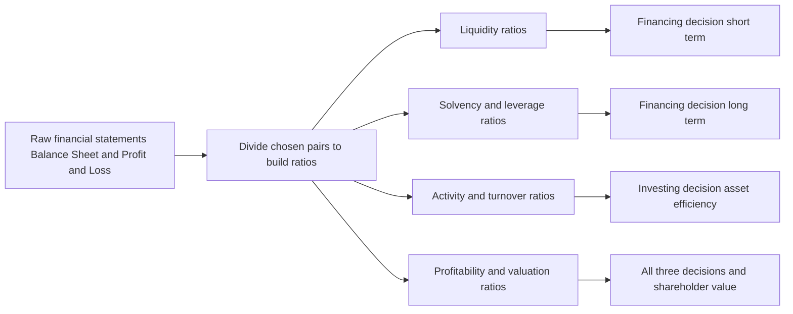
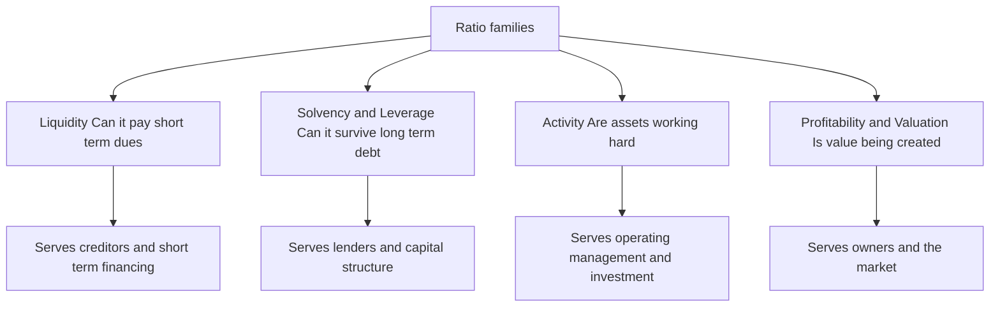
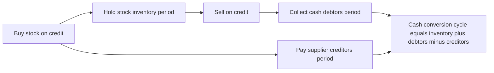
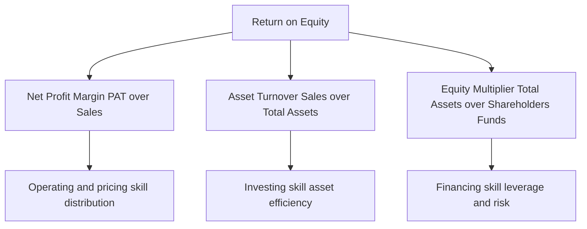

# Chapter 03 — Ratio Analysis (Financial Analysis & Planning)

## 1. The Problem

Imagine two companies drop their annual accounts on your desk. Company A earns a net profit of ₹50 lakh; Company B earns ₹5 crore. Which one is the better business to lend to, buy shares in, or run?

If your instinct is "Company B, obviously — it earns ten times more," you have just fallen into the trap that ratio analysis exists to prevent. Suppose Company A employed ₹2 crore of capital to make that ₹50 lakh (a 25% return), while Company B employed ₹50 crore to make ₹5 crore (a 10% return). Company A is the vastly superior business. The raw profit figure — the "absolute number" — told you the *opposite* of the truth.

This is the core problem. A financial statement is a pile of absolute rupee figures: sales of ₹30,00,000, inventory of ₹3,50,000, debentures of ₹6,00,000. Each number, standing alone, is almost meaningless. Is ₹3,50,000 of inventory "a lot"? You cannot possibly say. A lot *compared to what*? Compared to how fast the firm sells? Compared to last year? Compared to a competitor? A single rupee figure has no yardstick attached to it.

Financial statements were built to *record*, not to *evaluate*. They faithfully report what happened, but they do not tell you whether what happened was good or bad, safe or dangerous, improving or deteriorating. That judgement is what every user of accounts actually wants — the lender deciding whether the loan will be repaid, the shareholder deciding whether value is being created, the manager deciding where the business is bleeding. Raw statements do not answer their questions. **Ratio analysis is the machine that converts recorded facts into evaluative meaning.**

## 2. The Core Idea

A ratio is nothing more than one number divided by another, chosen so that the answer *means something*. That is the whole trick: you take two figures that individually say little, and by placing one over the other you manufacture a yardstick.

Think of a doctor. When you walk into a clinic, the doctor does not weigh your entire body of medical facts equally. Instead she takes a handful of *vital signs* — pulse, blood pressure, temperature, blood-sugar ratio. Each is a small number, but each is a *ratio* or *rate* deliberately constructed so that a trained eye instantly knows "normal," "worrying," or "emergency." A pulse of 72 means health; 150 at rest means alarm. The number is comparable across every human being on earth because it has an implicit denominator (beats *per minute*) and a known reference range.

A financial ratio is a vital sign for a business. Current Ratio is its blood pressure (can it meet short-term demands?). Interest Coverage is its pulse under load (can it carry its debt burden?). Net Profit Margin is its body temperature (is the core metabolism healthy?). Return on Equity is the overall fitness score. Just as a doctor never diagnoses from a single reading but reads them *together and against reference ranges*, an analyst never judges a firm from one ratio but from a **panel of ratios read against three benchmarks**: the firm's own past (trend), a rival firm (cross-section), and the industry norm (standard).

The denominator is what gives the ratio its power. Dividing profit by capital employed silently answers "profit *relative to the money it took to earn it*" — exactly the question the raw profit figure could not answer in Section 1. Choosing the right denominator is choosing the right question.

## 3. Why It's Built This Way

Why ratios, and not just "read the statements carefully"? Because ratios solve three problems that absolute figures structurally cannot.

**Problem one: scale.** A ₹5 crore profit and a ₹50 lakh profit are not comparable until you neutralise size. Dividing by sales, or by capital, cancels out scale and lets a small firm and a giant be compared on equal terms. Ratios are *scale-free*.

**Problem two: the missing yardstick.** Meaning only exists in comparison. Ratios are built precisely so they can be lined up — this year versus last year (**trend / time-series analysis**), this firm versus that firm (**cross-sectional analysis**), and this firm versus the industry average (**benchmarking**). The ratio is the common language that makes comparison legal.

**Problem three: the interconnection of decisions.** A business is not a random heap of numbers; it is a *system*. Profit depends on sales, sales depend on assets deployed, assets are funded by a mix of debt and equity, and the debt mix feeds back into profit through interest. Ratios, and especially the DuPont chain (Section 4), expose these linkages so you can see *why* a result happened, not just *that* it happened.

Crucially, ratios are organised around the **three decisions that define Financial Management**: the **investing** decision (are assets deployed profitably?), the **financing** decision (is the debt–equity mix safe and cheap?), and the **distribution** decision (how much is returned to shareholders?) — all in service of the single objective, **maximising shareholder wealth**. Each ratio family, as we will see, is a lens trained on one of these decisions.

*Figure 3.1 — Ratios convert recorded facts into signals that inform each Financial Management decision.*

## 4. Full Technical Content

We organise every exam ratio into four families, and for each we ask first *what decision it serves*, then state the formula. A ratio you cannot attach to a decision is a ratio you will misuse.

*Figure 3.2 — The four families and the constituency each one answers to.*

### 4.1 Liquidity Ratios — "Can the firm meet its near-term obligations?"

**Decision served:** short-term financing and creditworthiness. A supplier or bank giving 60-day credit does not care about ten-year profits; it cares whether cash will be there next quarter. Liquidity ratios test the buffer of short-term assets against short-term claims.

- **Current Ratio = Current Assets ÷ Current Liabilities.** The rule-of-thumb ideal is **2 : 1** — roughly two rupees of near-cash assets backing every rupee of near-term claim, leaving a margin even if some current assets (slow stock, doubtful debtors) prove less liquid than their book value. *Too low* signals a cash crunch; *too high* signals idle, unproductive current assets — liquidity bought at the cost of return.

- **Quick / Acid-Test / Liquid Ratio = Quick Assets ÷ Current Liabilities**, where **Quick Assets = Current Assets − Inventory − Prepaid Expenses**. Ideal **1 : 1**. This is the stricter test: it strips out inventory (the slowest current asset — it must first be sold, then collected) and prepaids (which will never turn back into cash). A firm can have a healthy current ratio yet fail the acid test if it is choked with unsold stock.

- **Cash / Absolute Liquidity Ratio = (Cash + Bank + Marketable Securities) ÷ Current Liabilities.** Ideal roughly **0.5 : 1**. The most conservative test — only genuine cash and cash-equivalents count. Used when even receivables are suspect.

*Why built this way:* the three ratios form a ladder of severity. Each successive ratio removes one more "not-quite-cash" asset from the numerator, so reading all three tells you not just *whether* the firm is liquid but *what* its liquidity rests on.

### 4.2 Solvency / Leverage Ratios — "Can the firm survive its long-term debt?"

**Decision served:** the long-term financing decision — capital structure. Debt is cheaper than equity and its interest is tax-deductible, but it is a *fixed, unforgiving* claim: interest must be paid and principal repaid regardless of profits. Too much debt and a bad year becomes insolvency. These ratios measure how heavily the firm leans on borrowed money.

- **Debt–Equity Ratio = Long-term Debt ÷ Shareholders' Funds.** The classic gauge of gearing. A common comfort level is **2 : 1** for manufacturing. Higher means more financial risk borne by lenders relative to owners. (Shareholders' funds = Equity share capital + Reserves & surplus + Preference share capital, less fictitious assets.)

- **Proprietary Ratio = Shareholders' Funds ÷ Total Assets.** The mirror image — the proportion of the asset base funded by owners rather than outsiders. Higher is safer; it is the shock-absorber against which losses are borne before creditors are touched.

- **Capital Gearing Ratio = Fixed-income-bearing funds ÷ Equity-shareholders' funds = (Preference capital + Debt) ÷ (Equity capital + Reserves).** Measures the weight of *fixed-return* capital (which magnifies swings in equity earnings) against variable-return equity. High gearing = high financial risk *and* high potential reward to equity.

- **Interest Coverage Ratio = EBIT ÷ Interest.** A *flow* solvency test rather than a *stock* one. It asks: how many times over does operating profit cover the interest bill? A coverage of 9 means profit could fall dramatically before interest becomes unpayable. Lenders watch this more closely than any balance-sheet ratio because it measures the *ability to service*, not just the *quantum of* debt.

*Why built this way:* the first three are **stock** ratios (snapshots from the balance sheet — how the pile is funded); the last is a **flow** ratio (from the P&L — whether current earnings can carry the burden). Solvency needs both: a firm can look fine on debt–equity yet be one bad quarter from breaching its interest cover.

### 4.3 Activity / Turnover Ratios — "How hard are the assets working?"

**Decision served:** the investing decision and operating efficiency. Capital tied up in assets has a cost. Turnover ratios measure how many rupees of sales each rupee of asset generates — the *velocity* of the asset base. Slow velocity means capital is sleeping.

- **Inventory (Stock) Turnover = Cost of Goods Sold ÷ Average Inventory.** How many times a year stock is sold and replaced. Higher = leaner, faster-moving stock (less capital locked, less obsolescence risk). *Holding period = 360 ÷ Turnover* days.

- **Debtors / Receivables Turnover = Credit Sales ÷ Average Receivables** (Receivables = Debtors + Bills Receivable). How fast credit sales convert to cash. *Collection period = 360 ÷ Turnover* days — the average number of days customers take to pay. Long collection = cash starved and higher bad-debt risk.

- **Creditors / Payables Turnover = Credit Purchases ÷ Average Payables** (Payables = Creditors + Bills Payable). *Payment period = 360 ÷ Turnover* days. Here, slower can be *better* — it is free supplier finance — provided you do not damage relationships or lose cash discounts.

- **Fixed Asset Turnover = Sales ÷ Net Fixed Assets**; **Total Asset Turnover = Sales ÷ Total Assets**; **Capital Turnover = Sales ÷ Capital Employed**; **Working Capital Turnover = Sales ÷ Net Working Capital.** Each asks the same question of a different asset pool: how much revenue is squeezed from it.

These three period ratios combine into the single most operationally useful number in the chapter:

- **Operating Cycle = Inventory holding period + Debtors collection period.**
- **Cash Conversion Cycle (CCC) = Inventory period + Debtors period − Creditors period.**

*Figure 3.3 — The cash conversion cycle. Fewer days means cash is freed faster and less working capital must be financed.*

*Why built this way:* every turnover ratio uses a **P&L flow in the numerator** (sales, COGS, purchases — a full year's activity) over a **balance-sheet stock in the denominator** (a point-in-time asset). Because the denominator is a snapshot, the theoretically correct figure is the **average of opening and closing balances**. When only a closing balance is available, use it — but know that you are approximating.

### 4.4 Profitability & Valuation Ratios — "Is value being created for owners?"

**Decision served:** ultimately *all three* decisions, judged at the finish line — shareholder wealth. Profitability ratios split into **margin ratios** (profit per rupee of sales) and **return ratios** (profit per rupee of capital), plus **market/valuation ratios** that connect the accounts to the share price and the distribution decision.

**Margins (base = Sales):**
- **Gross Profit Ratio = Gross Profit ÷ Sales.** Efficiency of production/purchasing before overheads.
- **Operating Profit Ratio = EBIT ÷ Sales.** Efficiency of core operations after overheads but before financing and tax.
- **Operating Ratio = (COGS + Operating expenses) ÷ Sales.** The cost-side mirror; Operating Ratio + Operating Profit Ratio = 100%.
- **Net Profit Ratio = PAT ÷ Sales.** The bottom-line squeeze after everything.

**Returns (base = Capital):**
- **Return on Capital Employed (ROCE) = EBIT ÷ Capital Employed**, where **Capital Employed = Total Assets − Current Liabilities = Shareholders' funds + Long-term debt.** The purest test of *investing* efficiency because EBIT (pre-interest, pre-tax) is the return to *all* providers of long-term capital, matched against *all* long-term capital. It is independent of how the firm is financed, so it isolates operating skill.
- **Return on Equity (ROE) / Return on Net Worth = PAT ÷ Shareholders' Funds.** The single most owner-relevant ratio — return earned on the owners' money after debt-holders and tax have been paid.
- **Return on Assets (ROA) = PAT ÷ Total Assets** (some use EBIT or PAT + interest in the numerator to keep it financing-neutral).

**Market / Valuation (base = share):**
- **Earnings Per Share (EPS) = Earnings available to equity ÷ Number of equity shares** (Earnings available to equity = PAT − Preference dividend).
- **Price–Earnings (P/E) Ratio = Market Price per Share ÷ EPS** — how many rupees the market pays per rupee of earnings; a proxy for growth expectations.
- **Dividend Payout Ratio = DPS ÷ EPS** (or Equity dividend ÷ Earnings available to equity) — the *distribution decision* made visible; **Retention Ratio = 1 − Payout.**
- **Dividend Yield = DPS ÷ MPS**; **Earnings Yield = EPS ÷ MPS.**
- **Book Value per Share = Equity shareholders' funds ÷ Number of equity shares.**

### 4.5 The DuPont Decomposition — the ratio that explains the ratios

ROE tells you the owners earned, say, 21%. It does *not* tell you *why*, or *how to improve it*, or *what risk was taken to get it*. The **DuPont analysis** (devised at the DuPont corporation in the 1920s) cracks ROE open into its drivers, revealing that the same 21% can come from utterly different — and differently risky — business models.

**Three-step DuPont:**

$$\text{ROE} = \underbrace{\frac{\text{PAT}}{\text{Sales}}}_{\text{Net Profit Margin}} \times \underbrace{\frac{\text{Sales}}{\text{Total Assets}}}_{\text{Asset Turnover}} \times \underbrace{\frac{\text{Total Assets}}{\text{Shareholders' Funds}}}_{\text{Equity Multiplier}}$$

The insight is profound. ROE is driven by exactly three levers, one from each Financial Management decision:

1. **Net Profit Margin** — *operating/pricing skill*. How much profit per rupee of sales. (The distribution of the value chain.)
2. **Asset Turnover** — *investing skill*. How much sales per rupee of assets. (Efficiency of the investing decision.)
3. **Equity Multiplier** — *financing skill / leverage*. How much asset base is levered on each rupee of equity. (The financing decision made visible; a multiplier of 1.69 means assets are 1.69× the owners' money, the rest borrowed.)

A jeweller earns high ROE through fat *margins* on slow turnover. A supermarket earns the *same* ROE through razor-thin margins on furious *turnover*. A bank earns it through huge *leverage* on tiny margins. DuPont tells you *which kind of business you are looking at* — and warns you when a "great" ROE is actually just dangerous borrowing (a high equity multiplier) masquerading as skill.

*Figure 3.4 — DuPont splits ROE into one lever from each Financial Management decision, showing not just the result but its source and its risk.*

**Five-step (extended) DuPont** decomposes margin further into a tax lever and an interest lever:

$$\text{ROE} = \underbrace{\frac{\text{PAT}}{\text{PBT}}}_{\text{Tax burden}} \times \underbrace{\frac{\text{PBT}}{\text{EBIT}}}_{\text{Interest burden}} \times \underbrace{\frac{\text{EBIT}}{\text{Sales}}}_{\text{Operating margin}} \times \underbrace{\frac{\text{Sales}}{\text{Assets}}}_{\text{Asset turnover}} \times \underbrace{\frac{\text{Assets}}{\text{Equity}}}_{\text{Leverage}}$$

This separates *operating* performance (operating margin × turnover) from *financing/tax* effects (tax burden × interest burden × leverage), so you can see whether ROE improved because the business got better or merely because tax fell or debt rose.

## 5. Worked Examples

Throughout, we use the following statements of **Deepak Ltd** for the year ended 31 March. Every ratio in Sections 5.2–5.4 is computed from these exact figures and reconciles.

**Balance Sheet as at 31 March**

| Equity & Liabilities | ₹ | Assets | ₹ |
|---|---:|---|---:|
| Equity Share Capital (₹10 each) | 10,00,000 | Fixed Assets (net) | 15,00,000 |
| Reserves & Surplus | 4,00,000 | Non-current Investments | 2,00,000 |
| 12% Preference Share Capital | 2,00,000 | **Current Assets** | |
| 10% Debentures | 6,00,000 | Inventory (Stock) | 3,50,000 |
| **Current Liabilities** | | Trade Receivables (Debtors) | 3,00,000 |
| Trade Payables (Creditors) 2,50,000 | | Bills Receivable | 1,00,000 |
| Bills Payable 50,000 | | Cash & Bank | 2,50,000 |
| Bank Overdraft 1,50,000 | | | |
| Outstanding Expenses 50,000 | | | |
| Total Current Liabilities | 5,00,000 | | |
| **Total** | **27,00,000** | **Total** | **27,00,000** |

**Statement of Profit & Loss for the year**

| Particulars | ₹ |
|---|---:|
| Sales (of which credit sales ₹24,00,000) | 30,00,000 |
| Less: Cost of Goods Sold | 21,00,000 |
| **Gross Profit** | **9,00,000** |
| Less: Operating Expenses (admin + selling) | 3,60,000 |
| **Operating Profit (EBIT)** | **5,40,000** |
| Less: Interest on 10% Debentures | 60,000 |
| **Profit Before Tax (PBT)** | **4,80,000** |
| Less: Tax @ 30% | 1,44,000 |
| **Profit After Tax (PAT)** | **3,36,000** |
| Less: Preference Dividend (12% of 2,00,000) | 24,000 |
| **Earnings available to Equity** | **3,12,000** |

*Additional data:* Credit purchases during the year ₹18,00,000; Market price per equity share ₹31.20; Equity dividend declared 20% (i.e. ₹2 per share). For simplicity, closing balances are treated as representative (averages equal closing).

### Example 5.1 — Liquidity (easy)

*A bank is deciding whether to extend Deepak Ltd a 90-day working-capital line. Assess short-term liquidity.*

**Step 1 — Current Assets and Current Liabilities.**
Current Assets = 3,50,000 + 3,00,000 + 1,00,000 + 2,50,000 = **₹10,00,000.**
Current Liabilities = 2,50,000 + 50,000 + 1,50,000 + 50,000 = **₹5,00,000.**

**Step 2 — Current Ratio** = 10,00,000 ÷ 5,00,000 = **2.0 : 1.** Exactly the textbook ideal — comfortable short-term cushion.

**Step 3 — Quick Assets** = Current Assets − Inventory − Prepaid = 10,00,000 − 3,50,000 − 0 = ₹6,50,000.
**Quick Ratio** = 6,50,000 ÷ 5,00,000 = **1.3 : 1.** Above the 1:1 ideal — even excluding stock, the firm covers its current dues comfortably.

**Step 4 — Cash Ratio** = (Cash & Bank) ÷ CL = 2,50,000 ÷ 5,00,000 = **0.5 : 1.** Meets the conservative benchmark.

**Interpretation & decision:** All three liquidity signals are healthy and consistent — the current ratio is not being flattered by bloated inventory (the quick ratio confirms it). **The bank can extend the line with confidence.**

### Example 5.2 — Solvency & Activity (moderate)

*A debenture-holder wants to know whether Deepak Ltd can safely carry more debt, and how efficiently it runs its assets.*

**Solvency:**

**Step 1 — Debt–Equity.** Long-term debt = ₹6,00,000. Shareholders' funds = Equity capital 10,00,000 + Reserves 4,00,000 + Preference 2,00,000 = ₹16,00,000.
Debt–Equity = 6,00,000 ÷ 16,00,000 = **0.375 : 1.** Very conservatively financed — far below the 2:1 comfort ceiling; there is ample room to borrow.

**Step 2 — Proprietary Ratio** = Shareholders' funds ÷ Total Assets = 16,00,000 ÷ 27,00,000 = **0.59 (59%).** Owners fund nearly 60% of the asset base — a strong shock-absorber.

**Step 3 — Capital Gearing** = (Preference + Debt) ÷ (Equity capital + Reserves) = (2,00,000 + 6,00,000) ÷ (10,00,000 + 4,00,000) = 8,00,000 ÷ 14,00,000 = **0.57 : 1.** Low-geared — fixed-return capital is well below equity, so financial risk is modest.

**Step 4 — Interest Coverage** = EBIT ÷ Interest = 5,40,000 ÷ 60,000 = **9 times.** Operating profit covers interest nine times over; EBIT could fall almost 89% before interest becomes unpayable.

**Activity:**

**Step 5 — Inventory Turnover** = COGS ÷ Inventory = 21,00,000 ÷ 3,50,000 = **6 times.** Holding period = 360 ÷ 6 = **60 days.**

**Step 6 — Debtors Turnover** = Credit Sales ÷ Receivables = 24,00,000 ÷ (3,00,000 + 1,00,000) = 24,00,000 ÷ 4,00,000 = **6 times.** Collection period = 360 ÷ 6 = **60 days.**

**Step 7 — Creditors Turnover** = Credit Purchases ÷ Payables = 18,00,000 ÷ (2,50,000 + 50,000) = 18,00,000 ÷ 3,00,000 = **6 times.** Payment period = 360 ÷ 6 = **60 days.**

**Step 8 — Operating cycle & CCC.**
Operating Cycle = 60 (stock) + 60 (debtors) = **120 days.**
Cash Conversion Cycle = 60 + 60 − 60 = **60 days.**

**Interpretation & decision:** Low leverage plus 9× interest cover means the firm is *under*-borrowed and can comfortably service additional debentures — good news for the lender, and arguably a signal to management that cheap debt is being under-used. The 60-day cash cycle means every rupee of sales is locked up for two months before returning as cash; shaving the collection or holding period would release working capital.

### Example 5.3 — Profitability, Valuation & DuPont (exam-hard, fully reconciling)

*An equity analyst must judge whether Deepak Ltd creates shareholder value, value the share, and explain the source of its return.*

**Margins:**

| Ratio | Computation | Result |
|---|---|---|
| Gross Profit Ratio | 9,00,000 ÷ 30,00,000 | **30%** |
| Operating Profit Ratio | 5,40,000 ÷ 30,00,000 | **18%** |
| Operating Ratio | (21,00,000 + 3,60,000) ÷ 30,00,000 | **82%** |
| Net Profit Ratio | 3,36,000 ÷ 30,00,000 | **11.2%** |

*Reconciliation check:* Operating Ratio 82% + Operating Profit Ratio 18% = 100%. ✓

**Returns:**

**Step 1 — Capital Employed** = Total Assets − Current Liabilities = 27,00,000 − 5,00,000 = ₹22,00,000. (Check: Shareholders' funds 16,00,000 + Debt 6,00,000 = 22,00,000. ✓)
**ROCE** = EBIT ÷ Capital Employed = 5,40,000 ÷ 22,00,000 = **24.55%.**

**Step 2 — ROE** = PAT ÷ Shareholders' funds = 3,36,000 ÷ 16,00,000 = **21%.**

**Step 3 — ROA** = PAT ÷ Total Assets = 3,36,000 ÷ 27,00,000 = **12.44%.**

*Note the ladder:* ROCE (24.55%) > ROE (21%)? Here ROE is below ROCE because ROCE is a **pre-tax** return to all capital, while ROE is **after-tax** to equity only. Comparing like-with-like: the after-tax operating return exceeds the 10% cost of debt, so leverage is *favourable* — borrowing at 10% to earn ~24.5% pre-tax lifts equity returns. (This is the financial-leverage effect quantified in Chapter on Leverage.)

**Market / Valuation:**

**Step 4 — EPS** = Earnings available to equity ÷ No. of equity shares = 3,12,000 ÷ 1,00,000 = **₹3.12.**
(Number of shares = 10,00,000 ÷ 10 = 1,00,000.)

**Step 5 — P/E Ratio** = MPS ÷ EPS = 31.20 ÷ 3.12 = **10 times.**

**Step 6 — Dividend Payout** = DPS ÷ EPS = 2.00 ÷ 3.12 = **64.1%.** **Retention Ratio** = 35.9%.

**Step 7 — Dividend Yield** = 2.00 ÷ 31.20 = **6.41%**; **Earnings Yield** = 3.12 ÷ 31.20 = **10%.**

**Step 8 — Book Value per Share** = (Equity capital + Reserves) ÷ shares = 14,00,000 ÷ 1,00,000 = **₹14.** The share trades at 31.20, i.e. **2.23× book** — the market values the business well above its accounting net worth, consistent with a 24.5% ROCE.

**DuPont decomposition (three-step):**

$$\text{ROE} = \frac{\text{PAT}}{\text{Sales}} \times \frac{\text{Sales}}{\text{Total Assets}} \times \frac{\text{Total Assets}}{\text{Shareholders' Funds}}$$

$$= \frac{3{,}36{,}000}{30{,}00{,}000} \times \frac{30{,}00{,}000}{27{,}00{,}000} \times \frac{27{,}00{,}000}{16{,}00{,}000}$$

$$= 0.112 \times 1.1111 \times 1.6875 = 0.21 = \mathbf{21\%}$$

*Reconciliation:* 21% matches the direct ROE from Step 2. ✓

**Reading the DuPont result:** Deepak's 21% ROE is built on a *decent* margin (11.2%), a *modest* asset turnover (1.11×), and *low* leverage (equity multiplier only 1.69, because the firm is under-borrowed). The story DuPont tells: **the return is earned on operating quality, not on financial risk.** Since the equity multiplier is low and ROCE comfortably beats the cost of debt, management could *raise* ROE further simply by taking on more (favourable) debt — a financing-decision insight invisible in the bare 21% figure.

**Five-step check:**
ROE = (PAT/PBT) × (PBT/EBIT) × (EBIT/Sales) × (Sales/Assets) × (Assets/Equity)
= (3,36,000/4,80,000) × (4,80,000/5,40,000) × (5,40,000/30,00,000) × (30,00,000/27,00,000) × (27,00,000/16,00,000)
= 0.70 × 0.8889 × 0.18 × 1.1111 × 1.6875 = **0.21 = 21%.** ✓

The tax burden (0.70) and interest burden (0.8889) show that of the operating return, 30% is lost to tax and about 11% to interest — the rest flows to equity, amplified by leverage.

## 6. Presentation / Format

Marks in the exam are lost not on arithmetic but on presentation. Follow this discipline:

1. **State the formula, then substitute, then answer, with units.** Every ratio: `Formula = numerator ÷ denominator = figure ÷ figure = result (unit).` Liquidity/solvency ratios are expressed as a **proportion "x : 1"**; turnover as **"times"**; period ratios as **"days"**; margins and returns as **"%"**.

2. **Show the build-up of composite figures.** Never write "Current Assets = 10,00,000" without the components. Examiners award marks for the working (e.g. the sum of stock + debtors + BR + cash), not just the total.

3. **Group by family** under clear headings — Liquidity, Solvency, Activity, Profitability — so the answer reads as a diagnostic panel.

4. **Always attach a one-line interpretation** when the question says "comment," "analyse," or "advise." A number without a verdict is half an answer.

5. **State your assumptions.** If you use 360 days (vs 365), or closing balances (vs averages), or include/exclude bank overdraft from current liabilities for the quick ratio, *say so in a note*. Examiners accept either convention if stated.

A model presentation block:

> **Current Ratio** = Current Assets ÷ Current Liabilities = ₹10,00,000 ÷ ₹5,00,000 = **2 : 1.**
> *Comment:* meets the ideal 2:1 norm; short-term liquidity is sound.

## 7. Connections

Ratio analysis is the hub that touches almost every other FM chapter:

- **Working Capital Management** — the operating cycle and cash conversion cycle (Section 4.3) *are* the analytical engine of working-capital planning; turnover ratios drive the estimation of stock, debtor and creditor levels.
- **Leverage** — the capital-gearing and interest-coverage ratios feed directly into the study of *financial leverage* and *degree of financial leverage*; the DuPont equity multiplier *is* leverage. Example 5.3's observation that ROCE > cost of debt is the trading-on-equity principle.
- **Cost of Capital & Capital Structure** — debt–equity and coverage ratios constrain how much debt a firm can raise and at what rate; they underpin the target capital structure.
- **Dividend Decisions** — payout, retention and dividend-yield ratios are the quantitative face of dividend policy.
- **Capital Budgeting** — ROCE and asset-turnover benchmarks inform the hurdle rate and the post-audit of whether investments delivered.
- **Business valuation / Strategic Management** — P/E, EPS and book value connect the accounts to market value; DuPont is a standard strategy-diagnosis tool for identifying a firm's competitive model (margin-led vs volume-led vs leverage-led).

## 8. Traps & Examiner Tricks

1. **Quick assets ≠ Current assets − Inventory only.** You must *also* remove prepaid expenses (they can never become cash). Forgetting prepaids is the single most common slip.

2. **Bank overdraft in the quick ratio.** Some texts exclude a *chronic* bank overdraft from current liabilities (treating it as quasi-permanent finance) when computing the quick ratio, which raises the ratio. Either treatment is defensible — **state your assumption.** Here we included it.

3. **Credit vs total figures.** Debtors turnover uses **credit sales**, not total sales; creditors turnover uses **credit purchases**. If the question gives a split, using the total figure is wrong. If no split is given, assume all are credit and *say so*.

4. **Average vs closing balances.** The correct denominator for turnover ratios is the *average* of opening and closing. If opening figures are given, you *must* average — using closing alone will lose marks.

5. **Capital Employed — two routes, one answer.** Total Assets − Current Liabilities *must* equal Shareholders' funds + Long-term debt. If they don't, you have misclassified an item (a favourite trap: hiding a long-term loan among current liabilities, or a fictitious asset like preliminary expenses that must be deducted from shareholders' funds).

6. **ROCE numerator must be EBIT (pre-interest, pre-tax).** Using PAT in ROCE double-counts the financing effect and makes it non-comparable across firms with different gearing. Match a pre-financing return with an all-capital base.

7. **EPS uses earnings *after* preference dividend**, divided by the number of *equity* shares — not total share capital, and not PAT. Deducting the ₹24,000 preference dividend is easy to forget.

8. **A high ratio is not automatically "good."** A current ratio of 6:1 signals idle cash and poor asset use; a very high debtors period signals lax credit control; a very *low* creditors period may mean you are foregoing free finance. Always judge *against a norm and a trend*, never in isolation — the doctor's rule from Section 2.

9. **Direction of the payables ratio.** Slower payment (longer period) is often *favourable* (free finance) — the opposite of debtors, where slower is bad. Do not mechanically call "faster = better" for every turnover.

10. **The DuPont ROE denominator must match.** Use total shareholders' funds consistently in both the equity multiplier and the direct ROE, or the reconciliation breaks. Mixing "equity-only funds" and "total shareholders' funds" between the two is a classic self-inconsistency.

## 9. First-Principles Recap

Strip everything away and the logic is a short chain. **Raw statements record but do not evaluate** — a rupee figure has no yardstick (Section 1). **A ratio manufactures a yardstick by division**, choosing a denominator that encodes the question you care about — profit *relative to capital*, assets *relative to claims* (Section 2). Because ratios are scale-free and comparable, they let you judge a firm against its **past, its rivals, and its industry** (Section 3).

We organise them around the **three Financial Management decisions**: liquidity and solvency ratios test the **financing** decision (short- and long-term — can we pay, can we survive our debt?); activity ratios test the **investing** decision (are the assets working hard?); profitability and valuation ratios test whether the whole system, plus the **distribution** decision, is **creating shareholder wealth** — the sole objective.

The crown is **DuPont**, which proves ROE is nothing more than **margin × turnover × leverage** — one lever from each decision — so that a return is never just a number but a *story* about how, and at what risk, it was earned. And every ratio is only as honest as the analyst who reads it *in context, against a norm, with its assumptions stated* — never in isolation (Sections 8, limitations below).

**Limitations to keep in view:** ratios inherit every weakness of the accounts they come from — they use *historical cost* (ignoring inflation and current values), rest on *accounting policies* that differ across firms (making cross-firm comparison treacherous unless policies match), are *window-dressable* at the balance-sheet date, ignore *qualitative* factors (management quality, brand, market position), can be distorted by *seasonality* (a year-end snapshot may not represent the year), and have *no single "correct" value* — a ratio is only meaningful against an appropriate benchmark. A ratio is a question-generator, not an answer.

## 10. Quick-Revision Sheet

| # | Ratio | Formula | Ideal / Sense | Decision served |
|---|---|---|---|---|
| **Liquidity** | | | | |
| 1 | Current Ratio | Current Assets ÷ Current Liabilities | 2 : 1 | Short-term financing |
| 2 | Quick / Acid Test | (CA − Inventory − Prepaid) ÷ CL | 1 : 1 | Short-term financing |
| 3 | Cash / Absolute | (Cash + Bank + Marketable sec.) ÷ CL | 0.5 : 1 | Short-term financing |
| **Solvency / Leverage** | | | | |
| 4 | Debt–Equity | Long-term Debt ÷ Shareholders' Funds | ≤ 2 : 1 | Capital structure |
| 5 | Proprietary | Shareholders' Funds ÷ Total Assets | Higher safer | Capital structure |
| 6 | Capital Gearing | (Pref + Debt) ÷ (Equity cap + Reserves) | Context | Financing risk |
| 7 | Interest Coverage | EBIT ÷ Interest | Higher safer | Debt servicing |
| **Activity / Turnover** | | | | |
| 8 | Inventory Turnover | COGS ÷ Avg Inventory | Higher = leaner | Working capital |
| 9 | Inventory Period | 360 ÷ Inventory Turnover | Fewer days | Working capital |
| 10 | Debtors Turnover | Credit Sales ÷ Avg Receivables | Higher = faster | Credit policy |
| 11 | Collection Period | 360 ÷ Debtors Turnover | Fewer days | Credit policy |
| 12 | Creditors Turnover | Credit Purchases ÷ Avg Payables | Context | Payables policy |
| 13 | Payment Period | 360 ÷ Creditors Turnover | Longer = free finance | Payables policy |
| 14 | Operating Cycle | Inventory period + Collection period | Fewer days | Working capital |
| 15 | Cash Conversion Cycle | Inv. period + Debtor period − Creditor period | Fewer days | Working capital |
| 16 | Fixed Asset Turnover | Sales ÷ Net Fixed Assets | Higher | Investing efficiency |
| 17 | Total Asset Turnover | Sales ÷ Total Assets | Higher | Investing efficiency |
| 18 | Capital Turnover | Sales ÷ Capital Employed | Higher | Investing efficiency |
| 19 | Working Capital Turnover | Sales ÷ Net Working Capital | Higher | Working capital |
| **Profitability — Margins** | | | | |
| 20 | Gross Profit Ratio | Gross Profit ÷ Sales | Higher | Pricing/production |
| 21 | Operating Profit Ratio | EBIT ÷ Sales | Higher | Core operations |
| 22 | Operating Ratio | (COGS + Op. exp) ÷ Sales | Lower | Cost control |
| 23 | Net Profit Ratio | PAT ÷ Sales | Higher | Bottom line |
| **Profitability — Returns** | | | | |
| 24 | ROCE | EBIT ÷ Capital Employed | Higher | Investing (all capital) |
| 25 | ROE / Return on Net Worth | PAT ÷ Shareholders' Funds | Higher | Owner return |
| 26 | ROA | PAT (or EBIT) ÷ Total Assets | Higher | Asset return |
| **Valuation / Market** | | | | |
| 27 | EPS | (PAT − Pref. Div.) ÷ No. of equity shares | Higher | Owner value |
| 28 | P/E Ratio | Market Price ÷ EPS | Growth signal | Valuation |
| 29 | Dividend Payout | DPS ÷ EPS | Policy | Distribution |
| 30 | Retention Ratio | 1 − Payout | Policy | Distribution / growth |
| 31 | Dividend Yield | DPS ÷ Market Price | Income return | Distribution |
| 32 | Earnings Yield | EPS ÷ Market Price | Inverse of P/E | Valuation |
| 33 | Book Value per Share | (Equity cap + Reserves) ÷ Equity shares | vs Market price | Valuation |
| **DuPont** | | | | |
| 34 | ROE (3-step) | Net Margin × Asset Turnover × Equity Multiplier | Diagnostic | All three decisions |
| 35 | ROE (5-step) | Tax burden × Interest burden × Op. margin × Asset TO × Leverage | Diagnostic | Operating vs financing |

**Key reconciliations to memorise:** Capital Employed = Total Assets − Current Liabilities = Shareholders' Funds + Long-term Debt · Operating Ratio + Operating Profit Ratio = 100% · Payout + Retention = 100% · DuPont ROE must equal direct PAT ÷ Shareholders' Funds.
